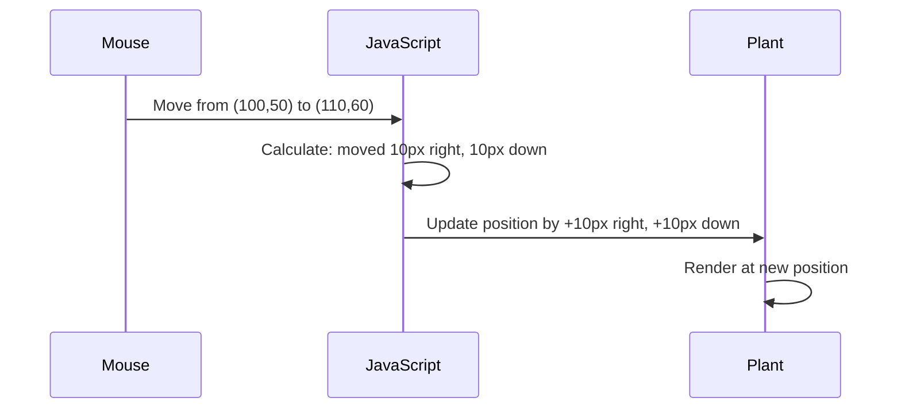

<!--
CO_OP_TRANSLATOR_METADATA:
{
  "original_hash": "bc93f6285423033ebf5b8abeb5282888",
  "translation_date": "2025-10-24T22:07:04+00:00",
  "source_file": "3-terrarium/3-intro-to-DOM-and-closures/README.md",
  "language_code": "ro"
}
-->
# Proiect Terrarium Partea 3: Manipularea DOM-ului și Closures în JavaScript


> Sketchnote de [Tomomi Imura](https://twitter.com/girlie_mac)

Bine ai venit la unul dintre cele mai captivante aspecte ale dezvoltării web - interactivitatea! Document Object Model (DOM) este ca un pod între HTML-ul și JavaScript-ul tău, iar astăzi îl vom folosi pentru a da viață terrariumului tău. Când Tim Berners-Lee a creat primul browser web, el a imaginat o lume în care documentele ar putea fi dinamice și interactive - DOM-ul face posibilă această viziune.

Vom explora, de asemenea, closures în JavaScript, care pot părea intimidante la început. Gândește-te la closures ca la niște "buzunare de memorie" unde funcțiile tale pot păstra informații importante. Este ca și cum fiecare plantă din terrariumul tău ar avea propriul său registru de date pentru a-și urmări poziția. Până la sfârșitul acestei lecții, vei înțelege cât de naturale și utile sunt acestea.

Iată ce vom construi: un terrarium în care utilizatorii pot muta și plasa plantele oriunde doresc. Vei învăța tehnici de manipulare a DOM-ului care stau la baza tuturor, de la încărcarea fișierelor prin drag-and-drop până la jocurile interactive. Să dăm viață terrariumului tău.

## Test înainte de lecție

[Test înainte de lecție](https://ff-quizzes.netlify.app/web/quiz/19)

## Înțelegerea DOM-ului: Poarta ta către pagini web interactive

Document Object Model (DOM) este modul prin care JavaScript comunică cu elementele HTML. Când browserul tău încarcă o pagină HTML, creează o reprezentare structurată a paginii în memorie - acesta este DOM-ul. Gândește-te la el ca la un arbore genealogic în care fiecare element HTML este un membru al familiei pe care JavaScript îl poate accesa, modifica sau rearanja.

Manipularea DOM-ului transformă paginile statice în site-uri web interactive. De fiecare dată când vezi un buton care își schimbă culoarea la trecerea mouse-ului, conținut care se actualizează fără reîncărcarea paginii sau elemente pe care le poți muta, aceasta este manipularea DOM-ului în acțiune.


> O reprezentare a DOM-ului și a marcajului HTML care îl referențiază. De la [Olfa Nasraoui](https://www.researchgate.net/publication/221417012_Profile-Based_Focused_Crawler_for_Social_Media-Sharing_Websites)

**Ce face DOM-ul atât de puternic:**
- **Oferă** o modalitate structurată de a accesa orice element de pe pagină
- **Permite** actualizări dinamice ale conținutului fără reîncărcarea paginii
- **Răspunde** în timp real la interacțiunile utilizatorului, cum ar fi clicuri și mișcări
- **Creează** fundația pentru aplicațiile web interactive moderne

## Closures în JavaScript: Crearea unui cod organizat și puternic

Un [closure în JavaScript](https://developer.mozilla.org/docs/Web/JavaScript/Closures) este ca și cum ai oferi unei funcții propriul spațiu privat de lucru cu memorie persistentă. Gândește-te la cum fiecare specie de cinteză a lui Darwin de pe Insulele Galápagos și-a dezvoltat ciocuri specializate în funcție de mediul specific - closures funcționează similar, creând funcții specializate care "își amintesc" contextul specific chiar și după ce funcția părinte s-a terminat.

În terrariumul nostru, closures ajută fiecare plantă să-și amintească propria poziție în mod independent. Acest model apare frecvent în dezvoltarea profesională cu JavaScript, ceea ce îl face un concept valoros de înțeles.

> 💡 **Înțelegerea Closures**: Closures sunt un subiect semnificativ în JavaScript, iar mulți dezvoltatori le folosesc ani de zile înainte de a înțelege pe deplin toate aspectele teoretice. Astăzi, ne concentrăm pe aplicarea practică - vei vedea cum apar closures în mod natural pe măsură ce construim funcționalitățile interactive. Înțelegerea se va dezvolta pe măsură ce vei vedea cum rezolvă probleme reale.


> O reprezentare a DOM-ului și a marcajului HTML care îl referențiază. De la [Olfa Nasraoui](https://www.researchgate.net/publication/221417012_Profile-Based_Focused_Crawler_for_Social_Media-Sharing_Websites)

În această lecție, vom finaliza proiectul nostru interactiv de terrarium prin crearea JavaScript-ului care va permite utilizatorului să manipuleze plantele de pe pagină.

## Înainte de a începe: Pregătirea pentru succes

Vei avea nevoie de fișierele HTML și CSS din lecțiile anterioare despre terrarium - suntem pe cale să facem acel design static interactiv. Dacă te alături pentru prima dată, completarea acelor lecții mai întâi va oferi un context important.

Iată ce vom construi:
- **Drag-and-drop fluid** pentru toate plantele din terrarium
- **Urmărirea coordonatelor** astfel încât plantele să-și amintească pozițiile
- **O interfață interactivă completă** folosind JavaScript simplu
- **Cod curat și organizat** folosind modele de closures

## Configurarea fișierului JavaScript

Să creăm fișierul JavaScript care va face terrariumul tău interactiv.

**Pasul 1: Creează fișierul script**

În folderul terrariumului tău, creează un fișier nou numit `script.js`.

**Pasul 2: Leagă JavaScript-ul de HTML-ul tău**

Adaugă acest tag script în secțiunea `<head>` a fișierului tău `index.html`:

```html
<script src="./script.js" defer></script>
```

**De ce atributul `defer` este important:**
- **Asigură** că JavaScript-ul așteaptă până când tot HTML-ul este încărcat
- **Previne** erorile în care JavaScript-ul caută elemente care nu sunt încă pregătite
- **Garantează** că toate elementele plantelor sunt disponibile pentru interacțiune
- **Oferă** performanță mai bună decât plasarea scripturilor la baza paginii

> ⚠️ **Notă importantă**: Atributul `defer` previne problemele comune de sincronizare. Fără el, JavaScript-ul poate încerca să acceseze elemente HTML înainte ca acestea să fie încărcate, cauzând erori.

---

## Conectarea JavaScript-ului la elementele HTML

Înainte să putem face elementele dragabile, JavaScript-ul trebuie să le localizeze în DOM. Gândește-te la asta ca la un sistem de catalogare a bibliotecii - odată ce ai numărul de catalog, poți găsi exact cartea de care ai nevoie și accesa tot conținutul acesteia.

Vom folosi metoda `document.getElementById()` pentru a face aceste conexiuni. Este ca și cum ai avea un sistem de arhivare precis - oferi un ID și localizează exact elementul de care ai nevoie în HTML-ul tău.

### Activarea funcționalității de drag pentru toate plantele

Adaugă acest cod în fișierul tău `script.js`:

```javascript
// Enable drag functionality for all 14 plants
dragElement(document.getElementById('plant1'));
dragElement(document.getElementById('plant2'));
dragElement(document.getElementById('plant3'));
dragElement(document.getElementById('plant4'));
dragElement(document.getElementById('plant5'));
dragElement(document.getElementById('plant6'));
dragElement(document.getElementById('plant7'));
dragElement(document.getElementById('plant8'));
dragElement(document.getElementById('plant9'));
dragElement(document.getElementById('plant10'));
dragElement(document.getElementById('plant11'));
dragElement(document.getElementById('plant12'));
dragElement(document.getElementById('plant13'));
dragElement(document.getElementById('plant14'));
```

**Ce realizează acest cod:**
- **Localizează** fiecare element al plantei în DOM folosind ID-ul său unic
- **Recuperează** o referință JavaScript la fiecare element HTML
- **Transmite** fiecare element unei funcții `dragElement` (pe care o vom crea în continuare)
- **Pregătește** fiecare plantă pentru interacțiunea drag-and-drop
- **Conectează** structura HTML la funcționalitatea JavaScript

> 🎯 **De ce să folosești ID-uri în loc de clase?** ID-urile oferă identificatori unici pentru elemente specifice, în timp ce clasele CSS sunt concepute pentru stilizarea grupurilor de elemente. Când JavaScript-ul trebuie să manipuleze elemente individuale, ID-urile oferă precizia și performanța de care avem nevoie.

> 💡 **Sfat util**: Observă cum apelăm `dragElement()` pentru fiecare plantă individual. Această abordare asigură că fiecare plantă primește propriul comportament de dragare independent, ceea ce este esențial pentru o interacțiune fluidă a utilizatorului.

---

## Construirea Closure-ului pentru Drag Element

Acum vom crea inima funcționalității de dragare: un closure care gestionează comportamentul de dragare pentru fiecare plantă. Acest closure va conține mai multe funcții interne care lucrează împreună pentru a urmări mișcările mouse-ului și pentru a actualiza pozițiile elementelor.

Closures sunt perfecte pentru această sarcină deoarece ne permit să creăm variabile "private" care persistă între apelurile funcției, oferind fiecărei plante propriul sistem independent de urmărire a coordonatelor.

### Înțelegerea Closures cu un exemplu simplu

Permite-mi să demonstrez closures cu un exemplu simplu care ilustrează conceptul:

```javascript
function createCounter() {
    let count = 0; // This is like a private variable
    
    function increment() {
        count++; // The inner function remembers the outer variable
        return count;
    }
    
    return increment; // We're giving back the inner function
}

const myCounter = createCounter();
console.log(myCounter()); // 1
console.log(myCounter()); // 2
```

**Ce se întâmplă în acest model de closure:**
- **Creează** o variabilă privată `count` care există doar în acest closure
- **Funcția internă** poate accesa și modifica acea variabilă externă (mecanismul closure)
- **Când returnăm** funcția internă, aceasta își menține conexiunea la acele date private
- **Chiar și după** ce `createCounter()` își termină execuția, `count` persistă și își amintește valoarea

### De ce Closures sunt perfecte pentru funcționalitatea de dragare

Pentru terrariumul nostru, fiecare plantă trebuie să-și amintească coordonatele poziției curente. Closures oferă soluția perfectă:

**Beneficii cheie pentru proiectul nostru:**
- **Menține** variabilele private de poziție pentru fiecare plantă independent
- **Păstrează** datele coordonatelor între evenimentele de dragare
- **Previne** conflictele de variabile între diferite elemente dragabile
- **Creează** o structură de cod curată și organizată

> 🎯 **Obiectiv de învățare**: Nu trebuie să stăpânești fiecare aspect al closures acum. Concentrează-te pe modul în care acestea ne ajută să organizăm codul și să menținem starea pentru funcționalitatea de dragare.

### Crearea funcției dragElement

Acum să construim funcția principală care va gestiona toată logica de dragare. Adaugă această funcție sub declarațiile elementelor plantelor:

```javascript
function dragElement(terrariumElement) {
    // Initialize position tracking variables
    let pos1 = 0,  // Previous mouse X position
        pos2 = 0,  // Previous mouse Y position  
        pos3 = 0,  // Current mouse X position
        pos4 = 0;  // Current mouse Y position
    
    // Set up the initial drag event listener
    terrariumElement.onpointerdown = pointerDrag;
}
```

**Înțelegerea sistemului de urmărire a poziției:**
- **`pos1` și `pos2`**: Stochează diferența dintre pozițiile vechi și noi ale mouse-ului
- **`pos3` și `pos4`**: Urmăresc coordonatele curente ale mouse-ului
- **`terrariumElement`**: Elementul specific al plantei pe care îl facem dragabil
- **`onpointerdown`**: Evenimentul care se declanșează când utilizatorul începe să tragă

**Cum funcționează modelul de closure:**
- **Creează** variabile private de poziție pentru fiecare element al plantei
- **Menține** aceste variabile pe parcursul ciclului de viață al dragării
- **Asigură** că fiecare plantă își urmărește coordonatele independent
- **Oferă** o interfață curată prin funcția `dragElement`

### De ce să folosești Pointer Events?

Te-ai putea întreba de ce folosim `onpointerdown` în loc de mai familiarul `onclick`. Iată raționamentul:

| Tip de eveniment | Cel mai potrivit pentru | Dezavantaj |
|------------------|--------------------------|------------|
| `onclick`       | Clicuri simple pe butoane | Nu poate gestiona dragarea (doar clicuri și eliberări) |
| `onpointerdown` | Mouse și touch | Mai nou, dar bine suportat în zilele noastre |
| `onmousedown`   | Doar mouse desktop | Lasă utilizatorii de mobil pe dinafară |

**De ce pointer events sunt perfecte pentru ceea ce construim:**
- **Funcționează excelent** indiferent dacă cineva folosește un mouse, deget sau chiar un stilou
- **Se simte la fel** pe laptop, tabletă sau telefon
- **Gestionează** mișcarea reală de dragare (nu doar clic și eliberare)
- **Creează** o experiență fluidă pe care utilizatorii o așteaptă de la aplicațiile web moderne

> 💡 **Pregătire pentru viitor**: Pointer events sunt modalitatea modernă de a gestiona interacțiunile utilizatorilor. În loc să scrii cod separat pentru mouse și touch, obții ambele gratuit. Destul de grozav, nu-i așa?

---

## Funcția pointerDrag: Capturarea începutului unei dragări

Când un utilizator apasă pe o plantă (fie cu un clic de mouse, fie cu o atingere de deget), funcția `pointerDrag` intră în acțiune. Această funcție capturează coordonatele inițiale și configurează sistemul de dragare.

Adaugă această funcție în interiorul closure-ului `dragElement`, imediat după linia `terrariumElement.onpointerdown = pointerDrag;`:

```javascript
function pointerDrag(e) {
    // Prevent default browser behavior (like text selection)
    e.preventDefault();
    
    // Capture the initial mouse/touch position
    pos3 = e.clientX;  // X coordinate where drag started
    pos4 = e.clientY;  // Y coordinate where drag started
    
    // Set up event listeners for the dragging process
    document.onpointermove = elementDrag;
    document.onpointerup = stopElementDrag;
}
```

**Pas cu pas, iată ce se întâmplă:**
- **Previne** comportamentele implicite ale browserului care ar putea interfera cu dragarea
- **Înregistrează** coordonatele exacte unde utilizatorul a început gestul de dragare
- **Stabilește** ascultători de evenimente pentru mișcarea continuă de dragare
- **Pregătește** sistemul pentru a urmări mișcarea mouse-ului/degetului pe întregul document

### Înțelegerea prevenirii evenimentelor

Linia `e.preventDefault()` este crucială pentru o dragare fluidă:

**Fără prevenire, browserele ar putea:**
- **Selecta** textul în timpul dragării pe pagină
- **Declanșa** meniuri contextuale la clic dreapta în timpul dragării
- **Interfera** cu comportamentul nostru personalizat de dragare
- **Crea** artefacte vizuale în timpul operațiunii de dragare

> 🔍 **Experiment**: După ce finalizezi această lecție, încearcă să elimini `e.preventDefault()` și vezi cum afectează experiența de dragare. Vei înțelege rapid de ce această linie este esențială!

### Sistemul de urmărire a coordonatelor

Proprietățile `e.clientX` și `e.clientY` ne oferă coordonate precise ale mouse-ului/atingerii:

| Proprietate | Ce măsoară | Caz de utilizare |
|-------------|------------|------------------|
| `clientX`   | Poziția orizontală relativă la fereastra de vizualizare | Urmărirea mișcării stânga-dreapta |
| `clientY`   | Poziția verticală relativă la fereastra de vizualizare | Urmărirea mișcării sus-jos |

**Înțelegerea acestor coordonate:**
- **Oferă** informații de poziționare precise la nivel de pixel
- **Se actualizează** în timp real pe măsură ce utilizatorul își mișcă pointerul
- **Rămâne** consistent pe diferite dimensiuni de ecran și niveluri de zoom
- **Permite** interacțiuni de dragare fluide și receptive

### Configurarea ascultătorilor de evenimente la nivel de document

Observă cum atașăm evenimentele de mișcare și oprire întregului `document`, nu doar elementului plantei:

```javascript
document.onpointermove = elementDrag;
document.onpointerup = stopElementDrag;
```

**De ce să atașăm la document:**
- **Continuă** urmărirea chiar și când mouse-ul părăsește elementul plantei
- **Previne** întreruperea dragării dacă utilizatorul se mișcă rapid
- **Oferă** o dragare fluidă pe întregul ecran
- **Gestionează** cazurile limită în care cursorul se mișcă în afara ferestrei browserului

> ⚡ **Notă de performanță**: Vom curăța acești ascultători la nivel de document când dragarea se oprește pentru a evita scurgerile de memorie și problemele de performanță.

## Finalizarea sistemului de dragare: Mișcare și curățare

Acum vom adăuga cele două funcții rămase care gestionează mișcarea efectivă de dragare și curățarea atunci când dragarea se oprește. Aceste funcții lucrează împreună pentru a crea o mișcare fluidă și receptivă a plantelor în terrarium.

### Funcția elementDrag: Urmărirea mișcării

Adaugă funcția `elementDrag` imediat după acolada închisă a funcției `pointerDrag
- **`pos3` și `pos4`**: Stochează poziția curentă a mouse-ului pentru următorul calcul
- **`offsetTop` și `offsetLeft`**: Obține poziția curentă a elementului pe pagină
- **Logica de scădere**: Mută elementul cu aceeași distanță pe care a parcurs-o mouse-ul

**Iată o defalcare a calculului mișcării:**
1. **Măsoară** diferența dintre pozițiile vechi și noi ale mouse-ului
2. **Calculează** cât de mult să mute elementul pe baza mișcării mouse-ului
3. **Actualizează** proprietățile de poziționare CSS ale elementului în timp real
4. **Stochează** noua poziție ca punct de referință pentru următorul calcul de mișcare

### Reprezentare vizuală a matematicii



### Funcția stopElementDrag: Curățare

Adaugă funcția de curățare după acolada de închidere a `elementDrag`:

```javascript
function stopElementDrag() {
    // Remove the document-level event listeners
    document.onpointerup = null;
    document.onpointermove = null;
}
```

**De ce este esențială curățarea:**
- **Previne** scurgerile de memorie cauzate de ascultătorii de evenimente rămași
- **Oprește** comportamentul de tragere atunci când utilizatorul eliberează planta
- **Permite** altor elemente să fie trase independent
- **Resetează** sistemul pentru următoarea operațiune de tragere

**Ce se întâmplă fără curățare:**
- Ascultătorii de evenimente continuă să ruleze chiar și după ce tragerea se oprește
- Performanța se degradează pe măsură ce ascultătorii neutilizați se acumulează
- Comportament neașteptat la interacțiunea cu alte elemente
- Resursele browserului sunt irosite pe gestionarea inutilă a evenimentelor

### Înțelegerea proprietăților de poziționare CSS

Sistemul nostru de tragere manipulează două proprietăți CSS cheie:

| Proprietate | Ce controlează | Cum o folosim |
|-------------|----------------|---------------|
| `top` | Distanța față de marginea de sus | Poziționarea verticală în timpul tragerii |
| `left` | Distanța față de marginea din stânga | Poziționarea orizontală în timpul tragerii |

**Informații cheie despre proprietățile offset:**
- **`offsetTop`**: Distanța curentă față de partea de sus a elementului părinte poziționat
- **`offsetLeft`**: Distanța curentă față de partea stângă a elementului părinte poziționat
- **Contextul poziționării**: Aceste valori sunt relative față de cel mai apropiat strămoș poziționat
- **Actualizări în timp real**: Se schimbă imediat când modificăm proprietățile CSS

> 🎯 **Filosofia designului**: Acest sistem de tragere este intenționat flexibil – nu există "zone de plasare" sau restricții. Utilizatorii pot plasa plantele oriunde, oferindu-le control creativ complet asupra designului terariului.

## Punerea tuturor cap la cap: Sistemul complet de tragere

Felicitări! Tocmai ai construit un sistem sofisticat de drag-and-drop folosind JavaScript pur. Funcția ta completă `dragElement` conține acum un closure puternic care gestionează:

**Ce realizează closure-ul tău:**
- **Menține** variabile de poziție private pentru fiecare plantă în mod independent
- **Gestionează** ciclul complet de tragere de la început până la sfârșit
- **Oferă** mișcare lină și receptivă pe întregul ecran
- **Curăță** resursele corespunzător pentru a preveni scurgerile de memorie
- **Creează** o interfață intuitivă și creativă pentru designul terariului

### Testarea terariului interactiv

Acum testează terariul interactiv! Deschide fișierul `index.html` într-un browser web și încearcă funcționalitatea:

1. **Dă clic și ține apăsat** pe orice plantă pentru a începe tragerea
2. **Mișcă mouse-ul sau degetul** și urmărește cum planta se deplasează lin
3. **Eliberează** pentru a plasa planta în noua poziție
4. **Experimentează** cu diferite aranjamente pentru a explora interfața

🥇 **Realizare**: Ai creat o aplicație web complet interactivă folosind concepte de bază pe care dezvoltatorii profesioniști le utilizează zilnic. Funcționalitatea de drag-and-drop folosește aceleași principii din spatele încărcării fișierelor, tablourilor kanban și multor alte interfețe interactive.


---

## Provocarea Agentului GitHub Copilot 🚀

Folosește modul Agent pentru a finaliza următoarea provocare:

**Descriere:** Îmbunătățește proiectul terariului adăugând o funcționalitate de resetare care să readucă toate plantele la pozițiile lor originale cu animații fluide.

**Indicație:** Creează un buton de resetare care, atunci când este apăsat, animă toate plantele înapoi la pozițiile lor originale din bara laterală folosind tranziții CSS. Funcția ar trebui să stocheze pozițiile originale la încărcarea paginii și să tranziționeze plantele înapoi la acele poziții în mod fluid, pe parcursul unei secunde, atunci când butonul de resetare este apăsat.

Află mai multe despre [modul agent](https://code.visualstudio.com/blogs/2025/02/24/introducing-copilot-agent-mode) aici.

## 🚀 Provocare suplimentară: Extinde-ți abilitățile

Ești pregătit să duci terariul la nivelul următor? Încearcă să implementezi aceste îmbunătățiri:

**Extensii creative:**
- **Dublu clic** pe o plantă pentru a o aduce în față (manipularea z-index)
- **Adaugă feedback vizual** precum o strălucire subtilă când treci cu mouse-ul peste plante
- **Implementează limite** pentru a preveni ca plantele să fie trase în afara terariului
- **Creează o funcție de salvare** care să memoreze pozițiile plantelor folosind localStorage
- **Adaugă efecte sonore** pentru ridicarea și plasarea plantelor

> 💡 **Oportunitate de învățare**: Fiecare dintre aceste provocări te va învăța noi aspecte ale manipulării DOM, gestionării evenimentelor și designului experienței utilizatorului.

## Test de evaluare după lecție

[Test de evaluare după lecție](https://ff-quizzes.netlify.app/web/quiz/20)

## Recapitulare și studiu individual: Aprofundarea cunoștințelor

Ai stăpânit fundamentele manipulării DOM și closure-urilor, dar întotdeauna există mai multe de explorat! Iată câteva direcții pentru a-ți extinde cunoștințele și abilitățile.

### Abordări alternative pentru Drag and Drop

Am folosit evenimente pointer pentru flexibilitate maximă, dar dezvoltarea web oferă mai multe abordări:

| Abordare | Cel mai potrivit pentru | Valoare educativă |
|----------|--------------------------|------------------|
| [API-ul HTML Drag and Drop](https://developer.mozilla.org/docs/Web/API/HTML_Drag_and_Drop_API) | Încărcări de fișiere, zone formale de tragere | Înțelegerea capacităților native ale browserului |
| [Evenimente Touch](https://developer.mozilla.org/docs/Web/API/Touch_events) | Interacțiuni specifice mobile | Modele de dezvoltare orientate pe mobil |
| Proprietăți CSS `transform` | Animații fluide | Tehnici de optimizare a performanței |

### Subiecte avansate de manipulare DOM

**Următorii pași în călătoria ta de învățare:**
- **Delegarea evenimentelor**: Gestionarea eficientă a evenimentelor pentru mai multe elemente
- **Intersection Observer**: Detectarea momentului în care elementele intră/ies din viewport
- **Mutation Observer**: Monitorizarea modificărilor în structura DOM
- **Componente Web**: Crearea de elemente UI reutilizabile și încapsulate
- **Concepte de Virtual DOM**: Înțelegerea modului în care framework-urile optimizează actualizările DOM

### Resurse esențiale pentru continuarea învățării

**Documentație tehnică:**
- [Ghidul MDN pentru Evenimente Pointer](https://developer.mozilla.org/docs/Web/API/Pointer_events) - Referință completă pentru evenimente pointer
- [Specificația W3C pentru Evenimente Pointer](https://www.w3.org/TR/pointerevents1/) - Documentație oficială a standardelor
- [Explorare aprofundată a Closure-urilor JavaScript](https://developer.mozilla.org/docs/Web/JavaScript/Closures) - Modele avansate de closure

**Compatibilitate browser:**
- [CanIUse.com](https://caniuse.com/) - Verifică suportul funcțiilor în diferite browsere
- [Date de compatibilitate browser MDN](https://github.com/mdn/browser-compat-data) - Informații detaliate despre compatibilitate

**Oportunități de practică:**
- **Construiește** un joc de puzzle folosind mecanisme similare de tragere
- **Creează** un tablou kanban cu gestionarea sarcinilor prin drag-and-drop
- **Proiectează** o galerie foto cu aranjamente de fotografii dragabile
- **Experimentează** cu gesturi tactile pentru interfețe mobile

> 🎯 **Strategie de învățare**: Cel mai bun mod de a consolida aceste concepte este prin practică. Încearcă să construiești variații ale interfețelor dragabile – fiecare proiect te va învăța ceva nou despre interacțiunea utilizatorului și manipularea DOM.

## Temă

[Lucrează puțin mai mult cu DOM-ul](assignment.md)

---

**Declinare de responsabilitate**:  
Acest document a fost tradus folosind serviciul de traducere AI [Co-op Translator](https://github.com/Azure/co-op-translator). Deși ne străduim să asigurăm acuratețea, vă rugăm să fiți conștienți că traducerile automate pot conține erori sau inexactități. Documentul original în limba sa natală ar trebui considerat sursa autoritară. Pentru informații critice, se recomandă traducerea profesională realizată de oameni. Nu ne asumăm responsabilitatea pentru neînțelegerile sau interpretările greșite care pot apărea din utilizarea acestei traduceri.