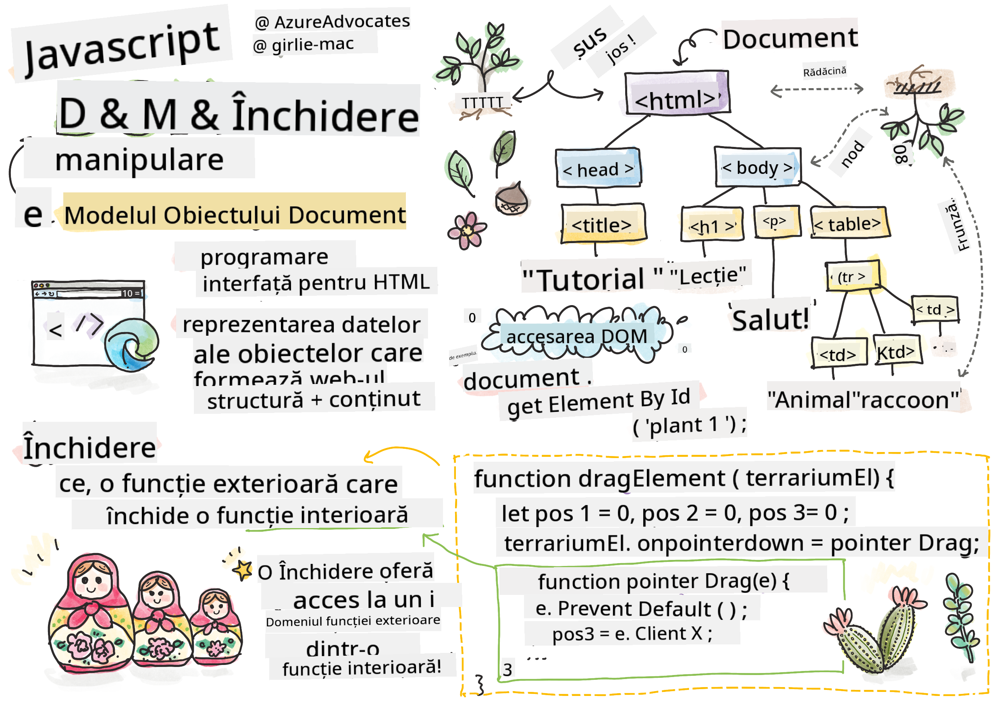
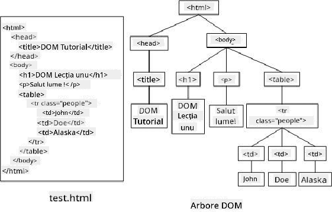
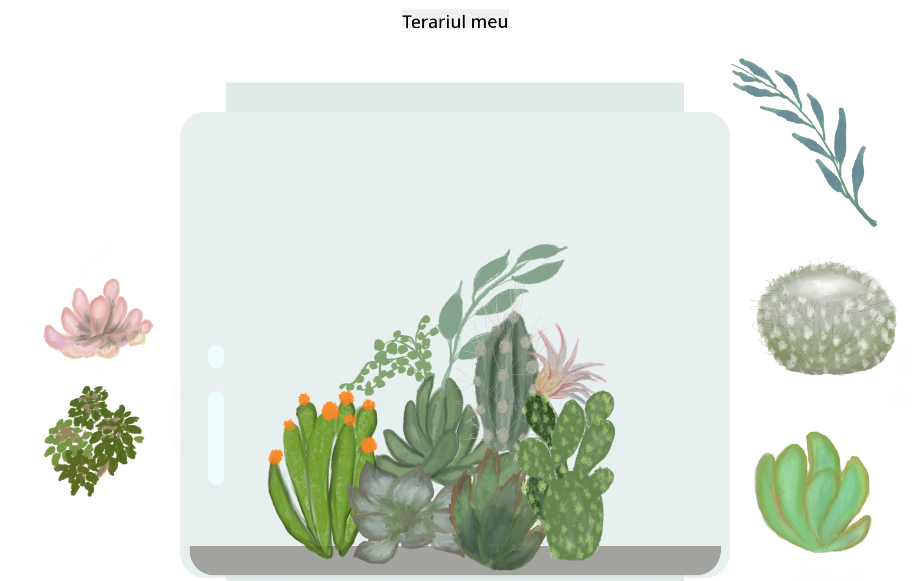

<!--
CO_OP_TRANSLATOR_METADATA:
{
  "original_hash": "30f8903a1f290e3d438dc2c70fe60259",
  "translation_date": "2025-08-28T08:15:48+00:00",
  "source_file": "3-terrarium/3-intro-to-DOM-and-closures/README.md",
  "language_code": "ro"
}
-->
# Proiect Terrarium Partea 3: Manipularea DOM-ului și o Închidere


> Sketchnote de [Tomomi Imura](https://twitter.com/girlie_mac)

## Chestionar Pre-Lecție

[Chestionar pre-lecție](https://ff-quizzes.netlify.app/web/quiz/19)

### Introducere

Manipularea DOM-ului, sau "Document Object Model", este un aspect cheie al dezvoltării web. Conform [MDN](https://developer.mozilla.org/docs/Web/API/Document_Object_Model/Introduction), "Document Object Model (DOM) este reprezentarea datelor obiectelor care alcătuiesc structura și conținutul unui document pe web." Provocările legate de manipularea DOM-ului pe web au fost adesea motivul utilizării framework-urilor JavaScript în locul JavaScript-ului simplu pentru gestionarea DOM-ului, dar ne vom descurca singuri!

În plus, această lecție va introduce ideea unei [închideri JavaScript](https://developer.mozilla.org/docs/Web/JavaScript/Closures), pe care o puteți considera ca o funcție închisă de o altă funcție, astfel încât funcția interioară să aibă acces la domeniul funcției exterioare.

> Închiderile JavaScript sunt un subiect vast și complex. Această lecție abordează cea mai simplă idee: în codul acestui terrarium, veți găsi o închidere: o funcție interioară și o funcție exterioară construite astfel încât funcția interioară să aibă acces la domeniul funcției exterioare. Pentru mult mai multe informații despre cum funcționează acest lucru, vizitați [documentația extinsă](https://developer.mozilla.org/docs/Web/JavaScript/Closures).

Vom folosi o închidere pentru a manipula DOM-ul.

Gândiți-vă la DOM ca la un arbore, care reprezintă toate modurile în care un document de pagină web poate fi manipulat. Diverse API-uri (Interfețe de Programare a Aplicațiilor) au fost scrise astfel încât programatorii, folosind limbajul de programare preferat, să poată accesa DOM-ul și să-l editeze, schimbe, rearanjeze și să-l gestioneze în alte moduri.



> O reprezentare a DOM-ului și a marcajului HTML care îl referențiază. De la [Olfa Nasraoui](https://www.researchgate.net/publication/221417012_Profile-Based_Focused_Crawler_for_Social_Media-Sharing_Websites)

În această lecție, vom finaliza proiectul nostru interactiv de terrarium prin crearea JavaScript-ului care va permite utilizatorului să manipuleze plantele de pe pagină.

### Prerechizite

Ar trebui să aveți HTML-ul și CSS-ul pentru terrarium-ul vostru construite. Până la sfârșitul acestei lecții, veți putea muta plantele în și din terrarium prin tragere.

### Sarcină

În folderul terrarium, creați un fișier nou numit `script.js`. Importați acel fișier în secțiunea `<head>`:

```html
	<script src="./script.js" defer></script>
```

> Notă: folosiți `defer` atunci când importați un fișier JavaScript extern în fișierul HTML pentru a permite executarea JavaScript-ului doar după ce fișierul HTML a fost complet încărcat. De asemenea, puteți folosi atributul `async`, care permite scriptului să se execute în timp ce fișierul HTML este analizat, dar în cazul nostru, este important ca elementele HTML să fie complet disponibile pentru tragere înainte de a permite executarea scriptului de tragere.
---

## Elementele DOM

Primul lucru pe care trebuie să-l faceți este să creați referințe la elementele pe care doriți să le manipulați în DOM. În cazul nostru, acestea sunt cele 14 plante care așteaptă în barele laterale.

### Sarcină

```html
dragElement(document.getElementById('plant1'));
dragElement(document.getElementById('plant2'));
dragElement(document.getElementById('plant3'));
dragElement(document.getElementById('plant4'));
dragElement(document.getElementById('plant5'));
dragElement(document.getElementById('plant6'));
dragElement(document.getElementById('plant7'));
dragElement(document.getElementById('plant8'));
dragElement(document.getElementById('plant9'));
dragElement(document.getElementById('plant10'));
dragElement(document.getElementById('plant11'));
dragElement(document.getElementById('plant12'));
dragElement(document.getElementById('plant13'));
dragElement(document.getElementById('plant14'));
```

Ce se întâmplă aici? Referențiați documentul și căutați în DOM-ul său pentru a găsi un element cu un anumit Id. Amintiți-vă că în prima lecție despre HTML ați dat Id-uri individuale fiecărei imagini de plantă (`id="plant1"`)? Acum veți folosi acel efort. După identificarea fiecărui element, transmiteți acel element unei funcții numite `dragElement` pe care o veți construi în curând. Astfel, elementul din HTML este acum activat pentru tragere, sau va fi în curând.

✅ De ce referențiem elementele prin Id? De ce nu prin clasa CSS? Puteți consulta lecția anterioară despre CSS pentru a răspunde la această întrebare.

---

## Închiderea

Acum sunteți gata să creați închiderea `dragElement`, care este o funcție exterioară ce închide o funcție interioară sau funcții (în cazul nostru, vom avea trei).

Închiderile sunt utile atunci când una sau mai multe funcții trebuie să acceseze domeniul funcției exterioare. Iată un exemplu:

```javascript
function displayCandy(){
	let candy = ['jellybeans'];
	function addCandy(candyType) {
		candy.push(candyType)
	}
	addCandy('gumdrops');
}
displayCandy();
console.log(candy)
```

În acest exemplu, funcția displayCandy înconjoară o funcție care adaugă un nou tip de bomboană într-un array care există deja în funcție. Dacă ați rula acest cod, array-ul `candy` ar fi nedefinit, deoarece este o variabilă locală (locală pentru închidere).

✅ Cum puteți face array-ul `candy` accesibil? Încercați să-l mutați în afara închiderii. În acest fel, array-ul devine global, în loc să rămână disponibil doar pentru domeniul local al închiderii.

### Sarcină

Sub declarațiile elementelor din `script.js`, creați o funcție:

```javascript
function dragElement(terrariumElement) {
	//set 4 positions for positioning on the screen
	let pos1 = 0,
		pos2 = 0,
		pos3 = 0,
		pos4 = 0;
	terrariumElement.onpointerdown = pointerDrag;
}
```

`dragElement` primește obiectul său `terrariumElement` din declarațiile de la începutul scriptului. Apoi, setați câteva poziții locale la `0` pentru obiectul transmis funcției. Acestea sunt variabilele locale care vor fi manipulate pentru fiecare element pe măsură ce adăugați funcționalitatea de tragere și plasare în închidere pentru fiecare element. Terrarium-ul va fi populat de aceste elemente trase, astfel încât aplicația trebuie să țină evidența locului unde sunt plasate.

În plus, elementul terrarium transmis acestei funcții este atribuit unui eveniment `pointerdown`, care face parte din [web APIs](https://developer.mozilla.org/docs/Web/API) concepute pentru a ajuta la gestionarea DOM-ului. `onpointerdown` se declanșează atunci când un buton este apăsat sau, în cazul nostru, un element care poate fi tras este atins. Acest handler de evenimente funcționează atât pe [navigatoare web cât și mobile](https://caniuse.com/?search=onpointerdown), cu câteva excepții.

✅ [Handler-ul de evenimente `onclick`](https://developer.mozilla.org/docs/Web/API/GlobalEventHandlers/onclick) are mult mai mult suport cross-browser; de ce nu l-ați folosi aici? Gândiți-vă la tipul exact de interacțiune pe ecran pe care încercați să o creați aici.

---

## Funcția Pointerdrag

Elementul `terrariumElement` este gata să fie tras; când evenimentul `onpointerdown` este declanșat, funcția `pointerDrag` este invocată. Adăugați acea funcție chiar sub această linie: `terrariumElement.onpointerdown = pointerDrag;`:

### Sarcină 

```javascript
function pointerDrag(e) {
	e.preventDefault();
	console.log(e);
	pos3 = e.clientX;
	pos4 = e.clientY;
}
```

Se întâmplă mai multe lucruri. Mai întâi, preveniți evenimentele implicite care se întâmplă în mod normal la pointerdown folosind `e.preventDefault();`. În acest fel aveți mai mult control asupra comportamentului interfeței.

> Reveniți la această linie după ce ați construit complet fișierul script și încercați fără `e.preventDefault()` - ce se întâmplă?

În al doilea rând, deschideți `index.html` într-o fereastră de browser și inspectați interfața. Când faceți clic pe o plantă, puteți vedea cum evenimentul 'e' este capturat. Explorați evenimentul pentru a vedea cât de multe informații sunt colectate de un singur eveniment pointer down!  

Apoi, observați cum variabilele locale `pos3` și `pos4` sunt setate la e.clientX. Puteți găsi valorile `e` în panoul de inspecție. Aceste valori capturează coordonatele x și y ale plantei în momentul în care faceți clic pe ea sau o atingeți. Veți avea nevoie de un control fin asupra comportamentului plantelor pe măsură ce faceți clic și le trageți, astfel încât să țineți evidența coordonatelor lor.

✅ Devine mai clar de ce această aplicație este construită cu o închidere mare? Dacă nu ar fi, cum ați menține domeniul pentru fiecare dintre cele 14 plante care pot fi trase?

Completați funcția inițială adăugând două manipulări suplimentare ale evenimentelor pointer sub `pos4 = e.clientY`:

```html
document.onpointermove = elementDrag;
document.onpointerup = stopElementDrag;
```
Acum indicați că doriți ca planta să fie trasă împreună cu pointerul pe măsură ce o mutați și ca gestul de tragere să se oprească atunci când deselectați planta. `onpointermove` și `onpointerup` fac parte din același API ca `onpointerdown`. Interfața va arunca erori acum, deoarece nu ați definit încă funcțiile `elementDrag` și `stopElementDrag`, așa că construiți-le în continuare.

## Funcțiile elementDrag și stopElementDrag

Veți completa închiderea adăugând două funcții interne suplimentare care vor gestiona ce se întâmplă atunci când trageți o plantă și opriți tragerea acesteia. Comportamentul dorit este ca să puteți trage orice plantă în orice moment și să o plasați oriunde pe ecran. Această interfață este destul de neimpusă (nu există o zonă de plasare, de exemplu) pentru a vă permite să proiectați terrarium-ul exact așa cum doriți, adăugând, eliminând și repoziționând plantele.

### Sarcină

Adăugați funcția `elementDrag` imediat după acolada de închidere a `pointerDrag`:

```javascript
function elementDrag(e) {
	pos1 = pos3 - e.clientX;
	pos2 = pos4 - e.clientY;
	pos3 = e.clientX;
	pos4 = e.clientY;
	console.log(pos1, pos2, pos3, pos4);
	terrariumElement.style.top = terrariumElement.offsetTop - pos2 + 'px';
	terrariumElement.style.left = terrariumElement.offsetLeft - pos1 + 'px';
}
```
În această funcție, faceți multe modificări ale pozițiilor inițiale 1-4 pe care le-ați setat ca variabile locale în funcția exterioară. Ce se întâmplă aici?

Pe măsură ce trageți, reasignați `pos1` făcându-l egal cu `pos3` (pe care l-ați setat anterior ca `e.clientX`) minus valoarea curentă `e.clientX`. Faceți o operație similară pentru `pos2`. Apoi, resetați `pos3` și `pos4` la noile coordonate X și Y ale elementului. Puteți urmări aceste modificări în consolă pe măsură ce trageți. Apoi, manipulați stilul css al plantei pentru a seta poziția sa nouă pe baza noilor poziții ale `pos1` și `pos2`, calculând coordonatele X și Y ale plantei pe baza comparării offset-ului său cu aceste poziții noi.

> `offsetTop` și `offsetLeft` sunt proprietăți CSS care setează poziția unui element pe baza poziției părintelui său; părintele său poate fi orice element care nu este poziționat ca `static`. 

Toate aceste recalculări ale poziționării vă permit să ajustați fin comportamentul terrarium-ului și al plantelor sale.

### Sarcină 

Ultima sarcină pentru a completa interfața este să adăugați funcția `stopElementDrag` după acolada de închidere a `elementDrag`:

```javascript
function stopElementDrag() {
	document.onpointerup = null;
	document.onpointermove = null;
}
```

Această funcție mică resetează evenimentele `onpointerup` și `onpointermove`, astfel încât să puteți relua progresul plantei începând să o trageți din nou sau să începeți să trageți o plantă nouă.

✅ Ce se întâmplă dacă nu setați aceste evenimente la null?

Acum ați finalizat proiectul!

🥇Felicitări! Ați terminat terrarium-ul vostru frumos! 

---

## 🚀Provocare

Adăugați un nou handler de evenimente în închiderea voastră pentru a face ceva suplimentar cu plantele; de exemplu, faceți dublu clic pe o plantă pentru a o aduce în față. Fiți creativi!

## Chestionar Post-Lecție

[Chestionar post-lecție](https://ff-quizzes.netlify.app/web/quiz/20)

## Recapitulare & Studiu Individual

Deși tragerea elementelor pe ecran pare trivială, există multe moduri de a face acest lucru și multe capcane, în funcție de efectul pe care îl căutați. De fapt, există un întreg [API de tragere și plasare](https://developer.mozilla.org/docs/Web/API/HTML_Drag_and_Drop_API) pe care îl puteți încerca. Nu l-am folosit în acest modul deoarece efectul dorit era oarecum diferit, dar încercați acest API pe propriul proiect și vedeți ce puteți realiza.

Găsiți mai multe informații despre evenimentele pointer pe [documentația W3C](https://www.w3.org/TR/pointerevents1/) și pe [documentația web MDN](https://developer.mozilla.org/docs/Web/API/Pointer_events).

Verificați întotdeauna capabilitățile browserului folosind [CanIUse.com](https://caniuse.com/).

## Temă

[Lucrați puțin mai mult cu DOM-ul](assignment.md)

---

**Declinarea responsabilității**:  
Acest document a fost tradus folosind serviciul de traducere AI [Co-op Translator](https://github.com/Azure/co-op-translator). Deși depunem eforturi pentru a asigura acuratețea, vă rugăm să rețineți că traducerile automate pot conține erori sau inexactități. Documentul original în limba sa nativă ar trebui considerat sursa autoritară. Pentru informații critice, se recomandă traducerea profesională realizată de un specialist uman. Nu ne asumăm răspunderea pentru eventualele neînțelegeri sau interpretări greșite care pot apărea din utilizarea acestei traduceri.