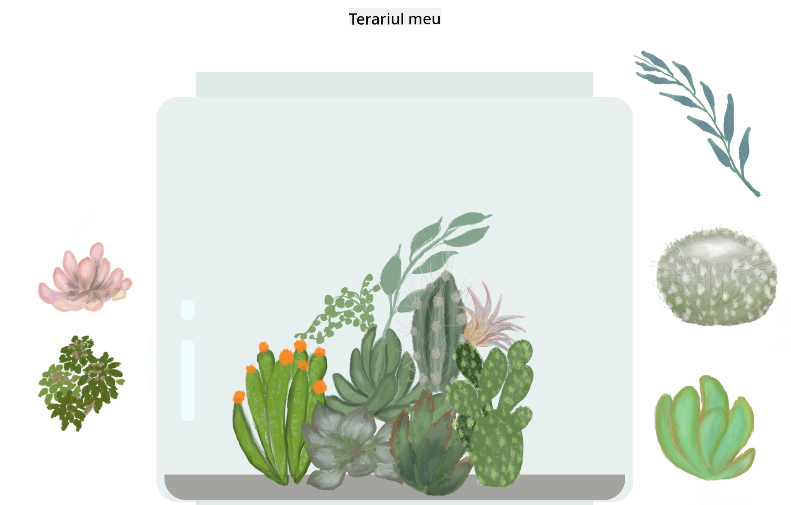

<!--
CO_OP_TRANSLATOR_METADATA:
{
  "original_hash": "7965cd2bc5dc92ad888dc4c6ab2ab70a",
  "translation_date": "2025-08-27T21:59:15+00:00",
  "source_file": "3-terrarium/README.md",
  "language_code": "ro"
}
-->
# Terrariul Meu: Un proiect pentru a învăța despre HTML, CSS și manipularea DOM folosind JavaScript 🌵🌱

Un mic exercițiu de tip drag and drop. Cu puțin HTML, JS și CSS, vei putea construi o interfață web, să o stilizezi și chiar să adaugi multiple interacțiuni la alegerea ta.

# Lecții

1. [Introducere în HTML](./1-intro-to-html/README.md)
2. [Introducere în CSS](./2-intro-to-css/README.md)
3. [Introducere în DOM și JS Closures](./3-intro-to-DOM-and-closures/README.md)

## Credite

Scris cu ♥️ de [Jen Looper](https://www.twitter.com/jenlooper)

Terrariul creat prin CSS a fost inspirat de borcanul de sticlă al lui Jakub Mandra [codepen](https://codepen.io/Rotarepmi/pen/rjpNZY).

Ilustrațiile sunt desenate manual de [Jen Looper](http://jenlooper.com) cu ajutorul Procreate.

## Publică Terrariul Tău

Poți publica terrariul tău pe web folosind Azure Static Web Apps.

1. Clonează acest repo

2. Apasă acest buton

3. Parcurge pașii din asistent pentru a crea aplicația ta. Asigură-te că setezi rădăcina aplicației fie la `/solution`, fie la rădăcina codului tău. Această aplicație nu are API, deci nu trebuie să te îngrijorezi în privința adăugării unuia. Un folder GitHub va fi creat în repository-ul clonat, care va ajuta serviciile de build ale Azure Static Web Apps să construiască și să publice aplicația ta la o nouă adresă URL.

---

**Declinare de responsabilitate**:  
Acest document a fost tradus folosind serviciul de traducere AI [Co-op Translator](https://github.com/Azure/co-op-translator). Deși ne străduim să asigurăm acuratețea, vă rugăm să fiți conștienți că traducerile automate pot conține erori sau inexactități. Documentul original în limba sa natală ar trebui considerat sursa autoritară. Pentru informații critice, se recomandă traducerea profesională realizată de un specialist uman. Nu ne asumăm responsabilitatea pentru eventualele neînțelegeri sau interpretări greșite care pot apărea din utilizarea acestei traduceri.