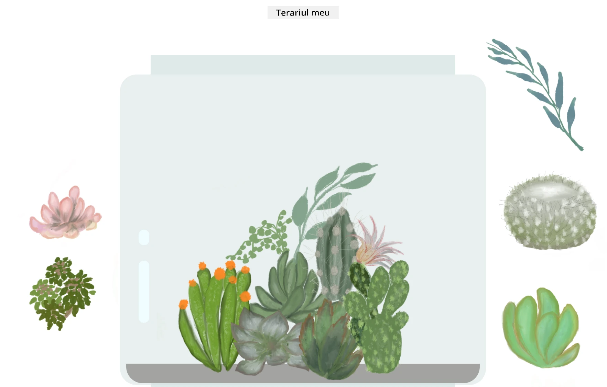

<!--
CO_OP_TRANSLATOR_METADATA:
{
  "original_hash": "6329fbe8bd936068debd78cca6f09c0a",
  "translation_date": "2025-08-28T08:13:18+00:00",
  "source_file": "3-terrarium/solution/README.md",
  "language_code": "ro"
}
-->
# Terariul Meu: Un proiect pentru a învăța despre HTML, CSS și manipularea DOM folosind JavaScript 🌵🌱

Un mic exercițiu de tip drag and drop. Cu puțin HTML, JS și CSS, poți construi o interfață web, să o stilizezi și să adaugi interacțiuni.

## Credite

Scris cu ♥️ de [Jen Looper](https://www.twitter.com/jenlooper)

Terariul creat prin CSS a fost inspirat de borcanul de sticlă al lui Jakub Mandra [codepen](https://codepen.io/Rotarepmi/pen/rjpNZY).

Ilustrațiile au fost desenate manual de [Jen Looper](http://jenlooper.com) folosind Procreate.

## Publică-ți Terariul

Poți publica terariul tău pe web folosind Azure Static Web Apps.

1. Clonează acest depozit

2. Apasă acest buton

3. Parcurge pașii din asistent pentru a-ți crea aplicația. Asigură-te că setezi rădăcina aplicației fie la `/solution`, fie la rădăcina codului tău. Această aplicație nu are un API, așa că nu te îngrijora să adaugi unul. Un folder .github va fi creat în depozitul tău clonat, care va ajuta serviciul de build al Azure Static Web Apps să construiască și să publice aplicația ta la o nouă adresă URL.

---

**Declinarea responsabilității**:  
Acest document a fost tradus folosind serviciul de traducere AI [Co-op Translator](https://github.com/Azure/co-op-translator). Deși depunem eforturi pentru a asigura acuratețea, vă rugăm să aveți în vedere că traducerile automate pot conține erori sau inexactități. Documentul original în limba sa nativă ar trebui considerat sursa autoritară. Pentru informații critice, se recomandă traducerea profesională realizată de un specialist uman. Nu ne asumăm răspunderea pentru eventualele neînțelegeri sau interpretări greșite care pot apărea din utilizarea acestei traduceri.