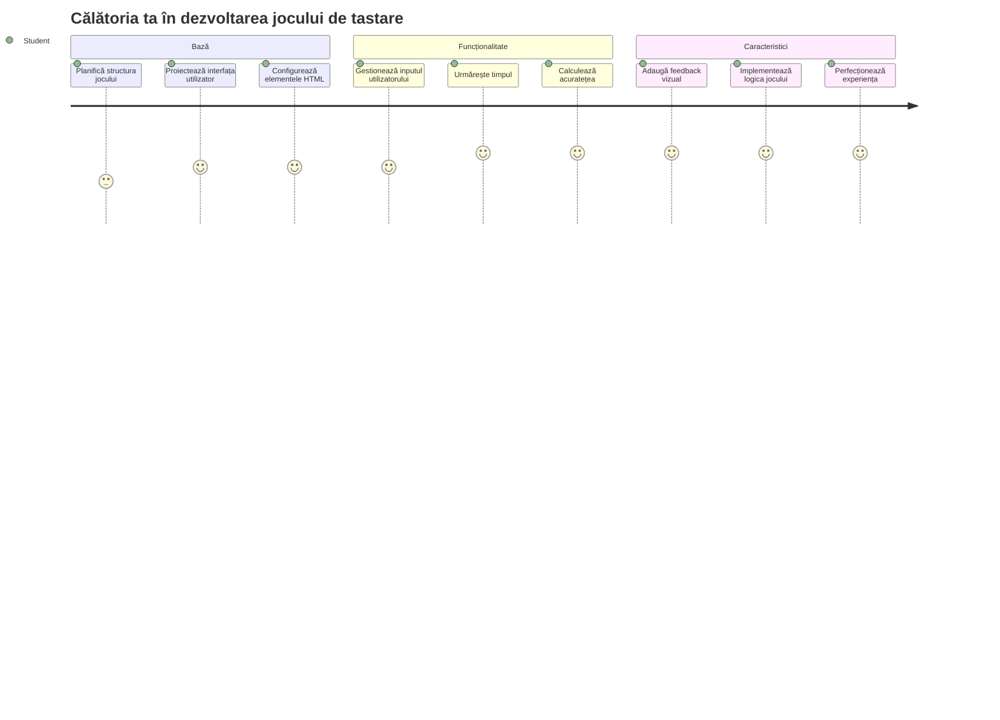
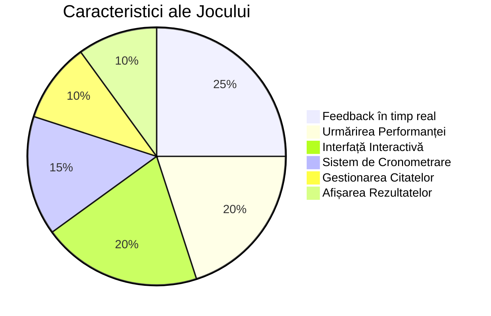
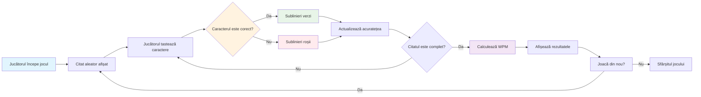
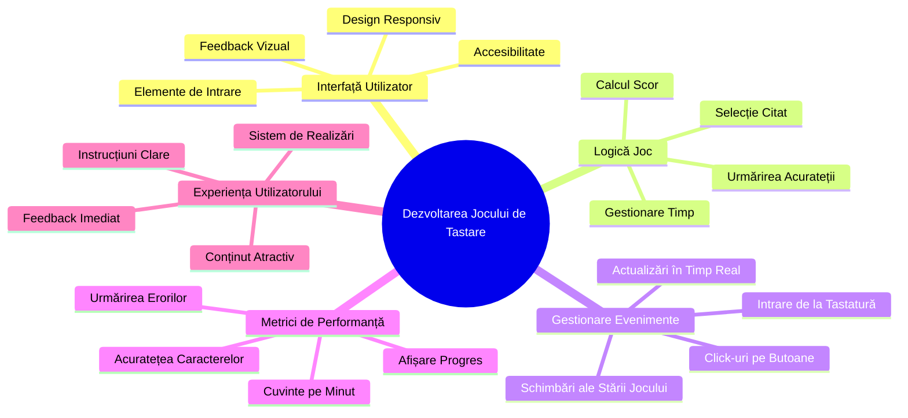
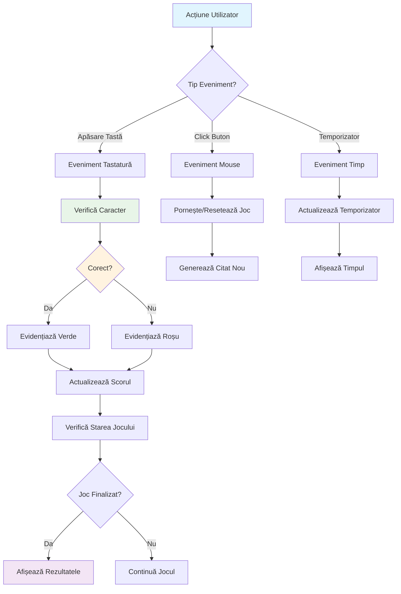
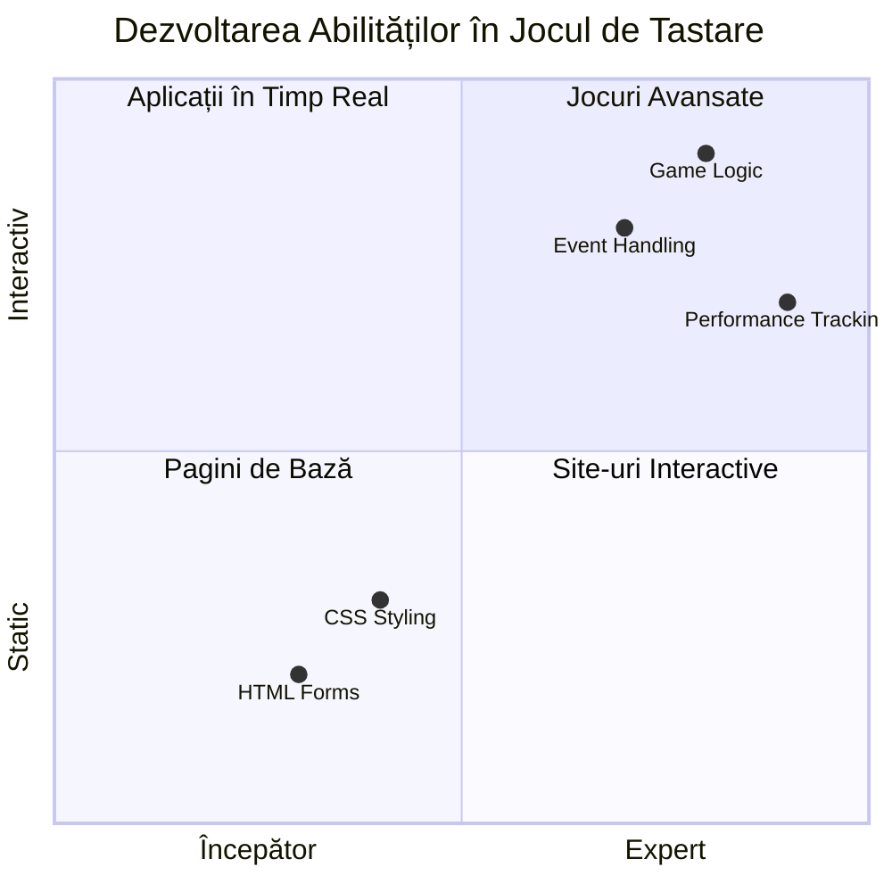
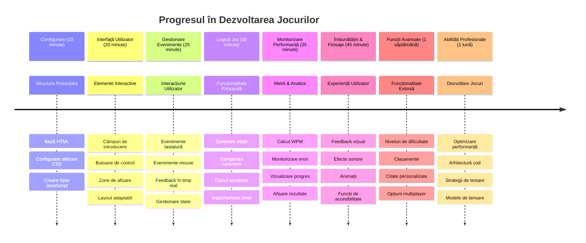

<!--
CO_OP_TRANSLATOR_METADATA:
{
  "original_hash": "efa2ab875b8bb5a7883816506da6b6d2",
  "translation_date": "2026-01-07T05:25:40+00:00",
  "source_file": "4-typing-game/README.md",
  "language_code": "ro"
}
-->
# Programare Bazată pe Evenimente - Construiește un Joc de Tastare

## Introducere

Iată ceva ce toți dezvoltatorii știu, dar despre care vorbesc rar: tastatul rapid este o superputere! 🚀 Gândește-te - cu cât reușești să transmiți ideile din mintea ta în editorul de cod mai repede, cu atât creativitatea ta poate curge mai liber. E ca și cum ai avea o conductă directă între gândurile tale și ecran.

Vrei să știi una dintre cele mai bune metode de a-ți îmbunătăți această abilitate? Ai ghicit - vom construi un joc!

> Să creăm împreună un joc de tastare grozav!

Ești gata să pui în practică toate acele abilități de JavaScript, HTML și CSS pe care le-ai învățat? Vom construi un joc de tastare care te va provoca cu citate aleatorii din legendarul detectiv [Sherlock Holmes](https://en.wikipedia.org/wiki/Sherlock_Holmes). Jocul va urmări cât de repede și precis poți tasta - și crede-mă, e mai captivant decât ai putea crede!

## Ce Va Trebui să Știi

Înainte să începem, asigură-te că ești confortabil cu aceste concepte (nu-ți face griji dacă ai nevoie de o recapitulare rapidă - am trecut cu toții prin asta!):

- Crearea de controale pentru introducere text și butoane
- CSS și setarea stilurilor folosind clase  
- Bazele JavaScript
  - Crearea unui array
  - Generarea unui număr aleator
  - Obținerea timpului curent

Dacă vreunul dintre acestea ți se pare puțin uitat, e perfect în regulă! Uneori, cea mai bună modalitate de a-ți consolida cunoștințele este să intri într-un proiect și să descoperi lucrurile pe parcurs.

### 🔄 **Verificare Pedagogică**
**Evaluarea Fundamentelor**: Înainte de a începe dezvoltarea, asigură-te că înțelegi:
- ✅ Cum funcționează formularele și elementele de input în HTML
- ✅ Clasele CSS și stilizarea dinamică
- ✅ Ascultătorii și manipularea evenimentelor în JavaScript
- ✅ Manipularea array-urilor și selecția aleatorie
- ✅ Măsurarea și calculul timpului

**Auto-test rapid**: Poți explica cum funcționează împreună aceste concepte într-un joc interactiv?
- **Evenimentele** se declanșează când utilizatorii interacționează cu elementele
- **Handler-ele** procesează aceste evenimente și actualizează starea jocului
- **CSS** oferă feedback vizual pentru acțiunile utilizatorului
- **Timpul** permite măsurarea performanței și progresul jocului

## Hai să Construim Jocul!

[Crearea unui joc de tastare folosind programare bazată pe evenimente](./typing-game/README.md)

### ⚡ **Ce Poți Face în Următoarele 5 Minute**
- [ ] Deschide consola browserului și încearcă să asculți evenimente de tastatură cu `addEventListener`
- [ ] Creează o pagină HTML simplă cu un câmp de input și testează detectarea tastării
- [ ] Exersează manipularea șirurilor comparând textul tastat cu textul țintă
- [ ] Experimentează cu `setTimeout` pentru a înțelege funcțiile de timp

### 🎯 **Ce Poți Realiza în Această Oră**
- [ ] Finalizează testul de după lecție și înțelege programarea bazată pe evenimente
- [ ] Construiește o versiune simplă a jocului de tastare cu validarea cuvintelor
- [ ] Adaugă feedback vizual pentru tastarea corectă și incorectă
- [ ] Implementează un sistem simplu de punctaj bazat pe viteză și precizie
- [ ] Stilizează jocul cu CSS pentru un aspect plăcut vizual

### 📅 **Dezvoltarea Jocului pe Parcursul Săptămânii**
- [ ] Finalizează jocul de tastare complet cu toate funcționalitățile și finisajele
- [ ] Adaugă niveluri de dificultate cu complexitate variabilă a cuvintelor
- [ ] Implementează urmărirea statisticilor utilizatorului (WPM, precizie în timp)
- [ ] Creează efecte sonore și animații pentru o experiență mai bună a utilizatorului
- [ ] Fă jocul responsive pentru dispozitive mobile cu ecran tactil
- [ ] Publică jocul online și adună feedback de la utilizatori

### 🌟 **Dezvoltarea Interactivă pe Parcursul Lunii**
- [ ] Construiește mai multe jocuri explorând diferite modele de interacțiune
- [ ] Învață despre game loops, managementul stării și optimizarea performanței
- [ ] Contribuie la proiecte open source de dezvoltare a jocurilor
- [ ] Stăpânește concepte avansate de temporizare și animații fluide
- [ ] Creează un portofoliu ce include diverse aplicații interactive
- [ ] Fii mentor pentru alții interesați de dezvoltarea jocurilor și interacțiunea cu utilizatorul

## 🎯 Cronologia pentru Stăpânirea Jocului de Tastare

### 🛠️ Rezumatul Toolkit-ului pentru Dezvoltarea Jocului

După ce vei termina acest proiect, vei fi stăpânit:
- **Programarea bazată pe evenimente**: Interfețe responsive care reacționează la input
- **Feedback în timp real**: Actualizări vizuale și de performanță instantanee
- **Măsurarea performanței**: Sisteme precise de timp și punctaj
- **Managementul stării jocului**: Controlul fluxului aplicației și experiența utilizatorului
- **Design interactiv**: Crearea unor experiențe captivante și addictive
- **API-uri web moderne**: Folosirea capabilităților browserului pentru interacțiuni bogate
- **Pattern-uri de accesibilitate**: Design incluziv pentru toți utilizatorii

**Aplicații reale**: Aceste abilități se aplică direct în:
- **Aplicații web**: Orice interfață interactivă sau dashboard
- **Software educațional**: Platforme de învățare și instrumente de evaluare a competențelor
- **Instrumente de productivitate**: Editoare de text, IDE-uri și software de colaborare
- **Industria jocurilor**: Jocuri în browser și divertisment interactiv
- **Dezvoltare mobilă**: Interfețe tactile și gestionarea gesturilor

**Următorul nivel**: Ești gata să explorezi framework-uri avansate pentru jocuri, sisteme multiplayer în timp real sau aplicații interactive complexe!

## Mulțumiri

Scris cu ♥️ de [Christopher Harrison](http://www.twitter.com/geektrainer)

---

<!-- CO-OP TRANSLATOR DISCLAIMER START -->
**Declinare de responsabilitate**:
Acest document a fost tradus folosind serviciul de traducere AI [Co-op Translator](https://github.com/Azure/co-op-translator). Deși ne străduim pentru acuratețe, vă rugăm să rețineți că traducerile automate pot conține erori sau inexactități. Documentul original în limba sa nativă trebuie considerat sursa autorizată. Pentru informații critice, se recomandă traducerea profesională realizată de un traducător uman. Nu ne asumăm responsabilitatea pentru eventualele neînțelegeri sau interpretări greșite rezultate din utilizarea acestei traduceri.
<!-- CO-OP TRANSLATOR DISCLAIMER END -->