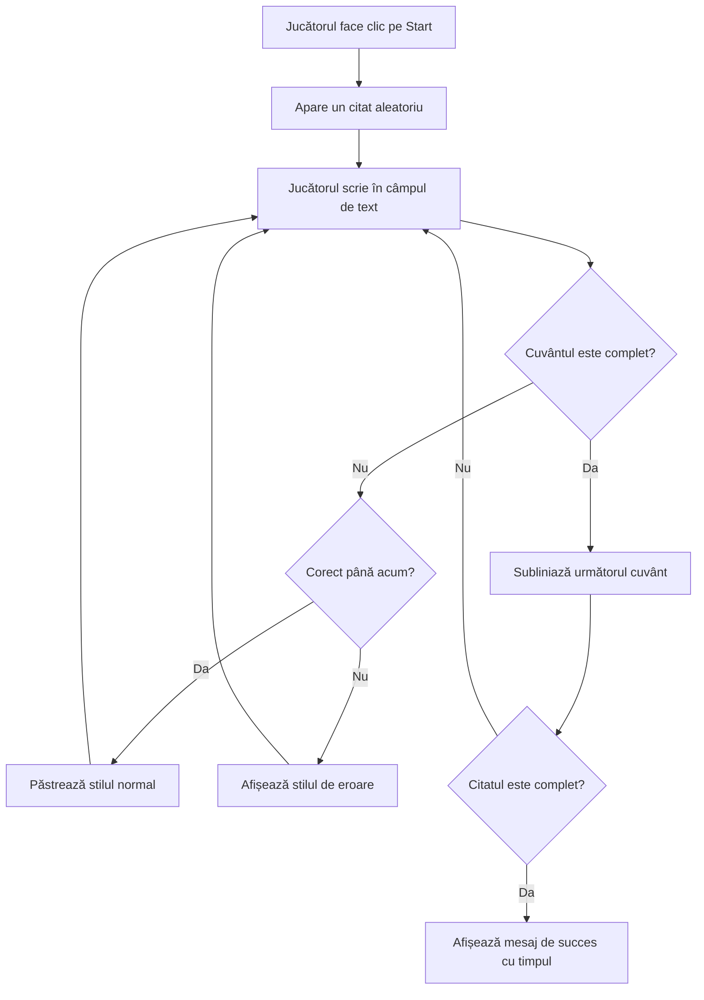
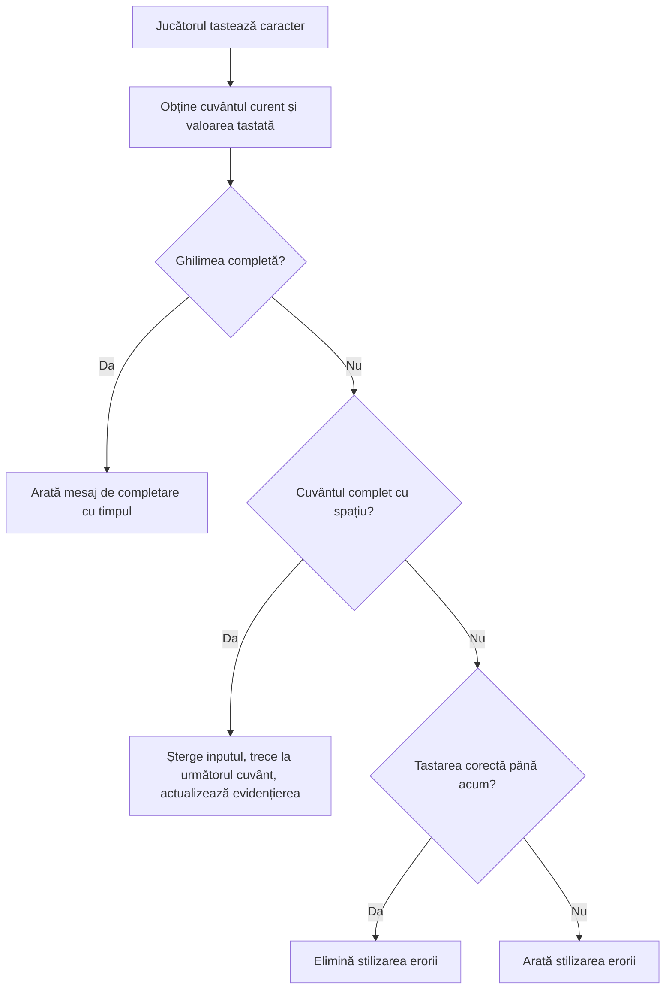
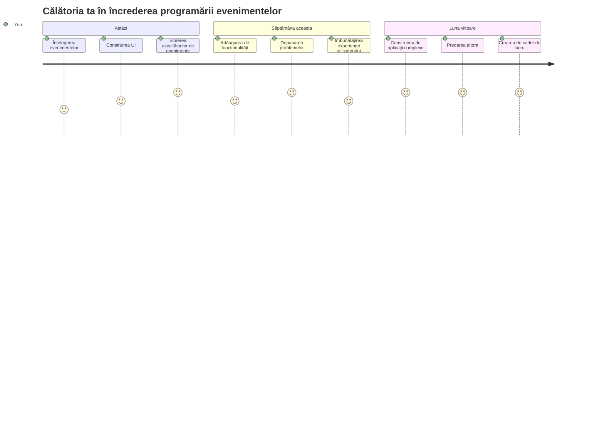

# Crearea unui joc folosind evenimente

Te-ai întrebat vreodată cum știu site-urile când apeși un buton sau tastezi într-o casetă de text? Asta este magia programării bazate pe evenimente! Ce metodă mai bună de a învăța această abilitate esențială decât construind ceva util - un joc de viteză la tastare care reacționează la fiecare apăsare de tastă pe care o faci.

Vei vedea cu ochii tăi cum browserele web „vorbesc” cu codul tău JavaScript. De fiecare dată când apeși, tastezi sau muți mouse-ul, browserul trimite mesaje mici (le numim evenimente) către codul tău, iar tu decizi cum să răspunzi!

Până la finalul acestui material, vei fi construit un joc real de tastare care urmărește viteza și acuratețea. Mai important, vei înțelege conceptele fundamentale care stau la baza fiecărui site interactiv pe care l-ai folosit vreodată. Hai să începem!

## Chestionar pre-lecture

[Pre-lecture quiz](https://ff-quizzes.netlify.app/web/quiz/21)

## Programarea bazată pe evenimente

Gândește-te la aplicația sau site-ul tău preferat - ce îl face să se simtă viu și receptiv? Totul ține de modul în care reacționează la ceea ce faci! Fiecare apăsare, clic, glisare sau apăsare de tastă creează ceea ce numim un „eveniment”, și aici se întâmplă adevărata magie a dezvoltării web.

Iată ce face programarea pentru web atât de interesantă: niciodată nu știm când cineva va face clic pe un buton sau va începe să tasteze într-o casetă de text. Poate face clic imediat, poate aștepta cinci minute sau poate niciodată să nu facă clic! Această imprevizibilitate înseamnă că trebuie să ne gândim diferit la modul în care scriem codul.

În loc să scriem cod care rulează de sus în jos ca o rețetă, scriem cod care așteaptă cu răbdare să se întâmple ceva. Este similar cu modul în care operatorii de telegraf din anii 1800 stăteau lângă mașinile lor, gata să răspundă în momentul în care un mesaj trecea prin fir.

Deci, ce este exact un „eveniment”? Simplu spus, este ceva care se întâmplă! Când apeși un buton - asta este un eveniment. Când tastezi o literă - asta este un eveniment. Când muți mouse-ul - asta este un alt eveniment.

Programarea bazată pe evenimente ne permite să configurăm codul pentru a asculta și răspunde. Creăm funcții speciale numite **ascultători de evenimente** care așteaptă cu răbdare ca lucruri specifice să se întâmple, apoi sar în acțiune când se întâmplă.

Gândește-te la ascultătorii de evenimente ca la un sonerie pentru codul tău. Îl configurezi pe sonerie (`addEventListener()`), îi spui la ce sunet să asculte (cum ar fi un 'click' sau 'keypress'), apoi specifici ce ar trebui să se întâmple când cineva o sună (funcția ta personalizată).

**Iată cum funcționează ascultătorii de evenimente:**
- **Ascultă** acțiuni specifice ale utilizatorului precum clicuri, apăsări de tastă sau mișcări ale mouse-ului
- **Execută** codul tău personalizat când apare evenimentul specificat
- **Răspunde** imediat la interacțiunile utilizatorului, creând o experiență fluentă
- **Gestionează** multiple evenimente pe același element folosind ascultători diferiți

> **NOTE:** Merită subliniat că există numeroase moduri de a crea ascultători de evenimente. Poți folosi funcții anonime sau poți crea unele cu nume. Poți folosi diverse scurtături, cum ar fi setarea proprietății `click`, sau utilizarea `addEventListener()`. În exercițiul nostru ne vom concentra pe `addEventListener()` și funcții anonime, deoarece probabil este cea mai comună tehnică folosită de dezvoltatorii web. Este și cea mai flexibilă, deoarece `addEventListener()` funcționează pentru toate evenimentele, iar numele evenimentului poate fi furnizat ca parametru.

### Evenimente comune

Deși browserele web oferă zeci de evenimente diferite pe care le poți asculta, majoritatea aplicațiilor interactive se bazează doar pe câteva evenimente esențiale. Înțelegerea acestor evenimente de bază îți va oferi fundația pentru a construi interacțiuni sofisticate cu utilizatorul.

Există [zeci de evenimente](https://developer.mozilla.org/docs/Web/Events) disponibile pentru a fi ascultate când creezi o aplicație. Practic, orice face un utilizator pe o pagină declanșează un eveniment, ceea ce îți oferă multă putere pentru a te asigura că obțin experiența dorită. Din fericire, de obicei vei avea nevoie doar de un număr mic de evenimente. Iată câteva comune (inclusiv cele două pe care le vom folosi la crearea jocului nostru):

| Eveniment | Descriere | Cazuri comune de utilizare |
|-----------|-----------|----------------------------|
| `click` | Utilizatorul a apăsat pe ceva | Butoane, linkuri, elemente interactive |
| `contextmenu` | Utilizatorul a apăsat butonul drept al mouse-ului | Meniuri de clic dreapta personalizate |
| `select` | Utilizatorul a evidențiat text | Editare text, operațiuni de copiere |
| `input` | Utilizatorul a introdus text | Validarea formularelor, căutare în timp real |

**Înțelegerea acestor tipuri de evenimente:**
- **Se declanșează** când utilizatorii interacționează cu elemente specifice din pagina ta
- **Oferă** informații detaliate despre acțiunea utilizatorului prin obiectele eveniment
- **Îți permit să creezi** aplicații web interactive și receptive
- **Funcționează** consecvent pe diferite browsere și dispozitive

## Crearea jocului

Acum că înțelegi cum funcționează evenimentele, hai să punem acea cunoștință în practică construind ceva util. Vom crea un joc de viteză la tastare care demonstrează gestionarea evenimentelor, ajutându-te să dezvolți o abilitate importantă de dezvoltator.

Vom crea un joc pentru a explora cum funcționează evenimentele în JavaScript. Jocul nostru va testa abilitățile de tastare ale unui jucător, una dintre cele mai subestimate abilități pe care toți dezvoltatorii ar trebui să le aibă. Un fapt amuzant: aspectul tastaturii QWERTY pe care îl folosim azi a fost conceput de fapt în anii 1870 pentru mașinile de scris - și abilitățile bune de tastare sunt încă la fel de valoroase pentru programatori astăzi! Fluxul general al jocului va arăta astfel:


**Iată cum va funcționa jocul nostru:**
- **Pornește** când jucătorul apasă butonul de start și afișează un citat aleatoriu
- **Urmărește** progresul tastării jucătorului cuvânt cu cuvânt în timp real
- **Evidențiază** cuvântul curent pentru a ghida atenția jucătorului
- **Oferă** feedback vizual imediat pentru erorile de tastare
- **Calculează** și afișează timpul total când citatul este completat

Hai să construim jocul nostru și să învățăm despre evenimente!

### Structura fișierelor

Înainte să începem să scriem cod, haide să ne organizăm! Un structura curată a fișierelor încă de la început îți va economisi dureri de cap mai târziu și va face proiectul tău mai profesionist. 😊

Vom păstra lucrurile simple cu doar trei fișiere: `index.html` pentru structura paginii, `script.js` pentru toată logica jocului, și `style.css` pentru a face totul să arate grozav. Acesta este trio-ul clasic ce alimentează majoritatea webului!

**Creează un dosar nou pentru proiectul tău deschizând o consolă sau terminal și executând următoarea comandă:**

```bash
# Linux sau macOS
mkdir typing-game && cd typing-game

# Windows
md typing-game && cd typing-game
```

**Iată ce fac aceste comenzi:**
- **Creează** un director nou numit `typing-game` pentru fișierele proiectului tău
- **Navighează** automat în directorul nou creat
- **Configurază** un spațiu de lucru curat pentru dezvoltarea jocului tău

**Deschide Visual Studio Code:**

```bash
code .
```

**Această comandă:**
- **Pornește** Visual Studio Code în directorul curent
- **Deschide** folderul proiectului tău în editor
- **Oferă** acces la toate uneltele de dezvoltare de care ai nevoie

**Adaugă trei fișiere în dosar în Visual Studio Code cu următoarele nume:**
- `index.html` - Conține structura și conținutul jocului tău
- `script.js` - Gestionează toată logica jocului și ascultătorii de evenimente
- `style.css` - Definește aspectul vizual și stilizarea

## Crearea interfeței utilizatorului

Acum să construim scena unde se va desfășura toată acțiunea jocului! Gândește-te la asta ca la proiectarea panoului de control pentru o navă spațială - trebuie să ne asigurăm că tot ce au nevoie jucătorii noștri este exact acolo unde se așteaptă.

Hai să vedem de ce are nevoie efectiv jocul nostru. Dacă ai juca un joc de tastare, ce ai vrea să vezi pe ecran? Iată ce vom avea nevoie:

| Element UI | Scop | Element HTML |
|------------|------|--------------|
| Afișaj Citat | Afișează textul de tastat | `<p>` cu `id="quote"` |
| Zona de Mesaje | Afișează mesaje de stare și succes | `<p>` cu `id="message"` |
| Câmp Text | Unde jucătorii tastează citatul | `<input>` cu `id="typed-value"` |
| Buton Start | Pornește jocul | `<button>` cu `id="start"` |

**Înțelegerea structurii UI:**
- **Organizează** conținutul logic de sus în jos
- **Atribuie** ID-uri unice elementelor pentru țintirea în JavaScript
- **Oferă** o ierarhie vizuală clară pentru o experiență mai bună a utilizatorului
- **Include** elemente HTML semantice pentru accesibilitate

Fiecare dintre acestea va avea nevoie de ID-uri ca să putem lucra cu ele în JavaScript-ul nostru. Vom adăuga și referințe către fișierele CSS și JavaScript pe care urmează să le creăm.

Creează un fișier nou numit `index.html`. Adaugă următorul HTML:

```html
<!-- inside index.html -->
<html>
<head>
  <title>Typing game</title>
  <link rel="stylesheet" href="style.css">
</head>
<body>
  <h1>Typing game!</h1>
  <p>Practice your typing skills with a quote from Sherlock Holmes. Click **start** to begin!</p>
  <p id="quote"></p> <!-- This will display our quote -->
  <p id="message"></p> <!-- This will display any status messages -->
  <div>
    <input type="text" aria-label="current word" id="typed-value" /> <!-- The textbox for typing -->
    <button type="button" id="start">Start</button> <!-- To start the game -->
  </div>
  <script src="script.js"></script>
</body>
</html>
```

**Ce realizează această structură HTML:**
- **Leagă** fișierul de stil CSS în `<head>` pentru stilizare
- **Creează** un titlu clar și instrucțiuni pentru utilizatori
- **Stabilește** paragrafe spațiu rezervat cu ID-uri specifice pentru conținut dinamic
- **Include** un câmp de input cu atribute de accesibilitate
- **Oferă** un buton de start pentru a lansa jocul
- **Încarcă** fișierul JavaScript la final pentru performanță optimă

### Lansarea aplicației

Testarea frecventă a aplicației în timpul dezvoltării te ajută să identifici problemele din timp și să vezi progresul în timp real. Live Server este un instrument de neprețuit care reîncarcă automat browserul ori de câte ori salvezi modificări, făcând dezvoltarea mult mai eficientă.

Este întotdeauna cel mai bine să dezvolți iterativ pentru a vedea cum arată lucrurile. Hai să lansăm aplicația noastră. Există o extensie minunată pentru Visual Studio Code numită [Live Server](https://marketplace.visualstudio.com/items?itemName=ritwickdey.LiveServer&WT.mc_id=academic-77807-sagibbon) care va găzdui aplicația local și va reîmprospăta browserul de fiecare dată când salvezi.

**Instalează [Live Server](https://marketplace.visualstudio.com/items?itemName=ritwickdey.LiveServer&WT.mc_id=academic-77807-sagibbon) urmând linkul și făcând clic pe Install:**

**Iată ce se întâmplă în timpul instalării:**
- **Îți solicită** browserul să deschidă Visual Studio Code
- **Te ghidează** prin procesul de instalare a extensiei
- **Poate necesita** repornirea Visual Studio Code pentru a finaliza configurarea

**Odată instalat, în Visual Studio Code, apasă Ctrl-Shift-P (sau Cmd-Shift-P) pentru a deschide paleta de comenzi:**

**Înțelegerea paletei de comenzi:**
- **Oferă** acces rapid la toate comenzile VS Code
- **Caută** comenzile în timp ce tastezi
- **Oferă** scurtături de tastatură pentru dezvoltare mai rapidă

**Tastează „Live Server: Open with Live Server”:**

**Ce face Live Server:**
- **Pornește** un server local de dezvoltare pentru proiectul tău
- **Reîncarcă automat** browserul când salvezi fișierele
- **Servește** fișierele tale de pe o adresă URL locală (de obicei `localhost:5500`)

**Deschide un browser și navighează la `https://localhost:5500`:**

Ar trebui acum să vezi pagina pe care ai creat-o! Hai să adăugăm funcționalitate.

## Adaugă CSS-ul

Acum să facem lucrurile să arate bine! Feedback-ul vizual a fost crucial pentru interfețele de utilizator încă din primele zile ale calculatoarelor. În anii 1980, cercetătorii au descoperit că feedback-ul vizual imediat îmbunătățește dramatic performanța utilizatorului și reduce erorile. Asta este exact ce vom crea.

Jocul nostru trebuie să fie clar ca lumina zilei în legătură cu ce se întâmplă. Jucătorii ar trebui să știe imediat ce cuvânt trebuie să tasteze și dacă greșesc, să vadă asta pe loc. Hai să creăm o stilizare simplă, dar eficientă:

Creează un fișier nou numit `style.css` și adaugă următorul conținut.

```css
/* inside style.css */
.highlight {
  background-color: yellow;
}

.error {
  background-color: lightcoral;
  border: red;
}
```

**Înțelegerea acestor clase CSS:**
- **Evidențiază** cuvântul curent cu un fundal galben pentru o ghidare vizuală clară
- **Semnalizează** erorile de tastare cu o culoare de fundal coral deschis
- **Oferă** feedback imediat fără a perturba fluxul de tastare al utilizatorului
- **Folosește** culori contrastante pentru accesibilitate și comunicare vizuală clară

✅ Când vine vorba de CSS poți aranja pagina cum vrei. Petrece puțin timp și fă pagina mai atractivă:

- Alege un font diferit
- Colorează antetele
- Redimensionează elementele

## JavaScript

Aici începe partea interesantă! 🎉 Avem structura HTML și stilizarea CSS, dar acum jocul nostru este ca o mașină frumoasă fără motor. JavaScript va fi acel motor - este ceea ce face totul să funcționeze și să răspundă la ceea ce fac jucătorii.

Aici vei vedea creația ta prindând viață. Vom aborda pas cu pas ca să nu te simți copleșit:

| Pas | Scop | Ce vei învăța |
|-----|------|---------------|
| [Crearea constantelor](../../../../4-typing-game/typing-game) | Setarea citatelor și referințelor DOM | Managementul variabilelor și selecția DOM |
| [Ascultător de eveniment pentru start joc](../../../../4-typing-game/typing-game) | Gestionarea inițierii jocului | Manipularea evenimentelor și actualizări UI |
| [Ascultător de eveniment pentru tastare](../../../../4-typing-game/typing-game) | Procesarea inputului utilizatorului în timp real | Validarea inputului și feedback dinamic |

**Această abordare structurată te ajută să:**
- **Organizezi** codul în secțiuni logice și gestionabile
- **Construiești** funcționalitate treptat pentru depanare mai ușoară
- **Înțelegi** cum funcționează împreună diferitele părți ale aplicației tale
- **Creezi** modele reutilizabile pentru proiectele viitoare

Dar mai întâi, creează un fișier nou numit `script.js`.

### Adaugă constantele

Înainte să intrăm în acțiune, hai să adunăm toate resursele! Așa cum centrul de comandă NASA configurează toate sistemele lor de monitorizare înainte de lansare, este mult mai ușor când ai totul pregătit și gata de folosit. Ne salvează de căutările ulterioare și ajută la prevenirea greșelilor de tipar.

Iată ce trebuie să configurăm mai întâi:

| Tip de date | Scop | Exemplu |
| Array de citate | Stochează toate citatele posibile pentru joc | `['Quote 1', 'Quote 2', ...]` |
| Array de cuvinte | Desparte citatul curent în cuvinte individuale | `['When', 'you', 'have', ...]` |
| Index cuvânt | Urmărește care cuvânt scrie jucătorul | `0, 1, 2, 3...` |
| Timp de început | Calculează timpul scurs pentru punctaj | `Date.now()` |

**De asemenea, vom avea nevoie de referințe către elementele UI:**
| Element | ID | Scop |
|---------|----|---------|
| Câmp text | `typed-value` | Unde scriu jucătorii |
| Afișare citat | `quote` | Arată citatul de tastat |
| Zonă mesaje | `message` | Afișează actualizări de stare |

```javascript
// în interiorul script.js
// toate citatele noastre
const quotes = [
    'When you have eliminated the impossible, whatever remains, however improbable, must be the truth.',
    'There is nothing more deceptive than an obvious fact.',
    'I ought to know by this time that when a fact appears to be opposed to a long train of deductions it invariably proves to be capable of bearing some other interpretation.',
    'I never make exceptions. An exception disproves the rule.',
    'What one man can invent another can discover.',
    'Nothing clears up a case so much as stating it to another person.',
    'Education never ends, Watson. It is a series of lessons, with the greatest for the last.',
];
// stochează lista de cuvinte și indexul cuvântului pe care jucătorul îl tastează în prezent
let words = [];
let wordIndex = 0;
// timpul de început
let startTime = Date.now();
// elementele paginii
const quoteElement = document.getElementById('quote');
const messageElement = document.getElementById('message');
const typedValueElement = document.getElementById('typed-value');
```

**Descompunând ce realizează acest cod de configurare:**
- **Stochează** un array cu citate Sherlock Holmes folosind `const` deoarece citatele nu se vor schimba
- **Initializează** variabilele de urmărire cu `let` deoarece aceste valori se vor actualiza în timpul jocului
- **Capturază** referințe către elementele DOM folosind `document.getElementById()` pentru acces eficient
- **Configurează** baza pentru toată funcționalitatea jocului cu nume de variabile clare și descriptive
- **Organizează** datele și elementele asociate logic pentru o mentenanță mai ușoară a codului

✅ Mergi înainte și adaugă mai multe citate în jocul tău

> 💡 **Sfat util**: Putem recupera elementele ori de câte ori vrem în cod folosind `document.getElementById()`. Deoarece vom face referire la aceste elemente frecvent, vom evita greșelile de scriere în șiruri literale folosind constante. Framework-uri precum [Vue.js](https://vuejs.org/) sau [React](https://reactjs.org/) te pot ajuta să gestionezi mai bine centralizarea codului tău.
>
**Iată de ce această abordare funcționează atât de bine:**
- **Previne** erorile de ortografie când se face referire la elemente de mai multe ori
- **Îmbunătățește** lizibilitatea codului cu nume constante descriptive
- **Activează** suport mai bun al IDE-ului cu autocomplete și verificare de erori
- **Facilitează** refactorizarea dacă ID-urile elementelor se schimbă ulterior

Acordă-ți un minut să vizionezi un videoclip despre folosirea `const`, `let` și `var`

[](https://youtube.com/watch?v=JNIXfGiDWM8 "Tipuri de variabile")

> 🎥 Apasă pe imaginea de mai sus pentru un videoclip despre variabile.

### Adaugă logica de start

Aici totul prinde sens! 🚀 Ești pe cale să scrii primul tău adevărat event listener, iar senzația de a vedea codul răspunzând la un click pe buton este destul de satisfăcătoare.

Gândește-te: undeva, un jucător va apăsa butonul "Start", iar codul tău trebuie să fie pregătit pentru asta. Nu știm când o va face - imediat, sau după ce își ia o cafea - dar atunci când se întâmplă, jocul tău prinde viață.

Când utilizatorul apasă `start`, trebuie să selectăm un citat, să configurăm interfața și să pornim urmărirea cuvântului curent și a timpului. Mai jos este JavaScript-ul pe care trebuie să îl adaugi; îl discutăm imediat după blocul de script.

```javascript
// la sfârșitul script.js
document.getElementById('start').addEventListener('click', () => {
  // obține o citare
  const quoteIndex = Math.floor(Math.random() * quotes.length);
  const quote = quotes[quoteIndex];
  // Pune citatul într-un tablou de cuvinte
  words = quote.split(' ');
  // resetează indexul cuvântului pentru urmărire
  wordIndex = 0;

  // Actualizări UI
  // Creează un tablou de elemente span pentru a putea seta o clasă
  const spanWords = words.map(function(word) { return `<span>${word} </span>`});
  // Convertește într-un șir și setează ca innerHTML pe afișajul citatului
  quoteElement.innerHTML = spanWords.join('');
  // Evidențiază primul cuvânt
  quoteElement.childNodes[0].className = 'highlight';
  // Șterge orice mesaje anterioare
  messageElement.innerText = '';

  // Configurează caseta de text
  // Golește caseta de text
  typedValueElement.value = '';
  // setează focusul
  typedValueElement.focus();
  // setează handlerul de eveniment

  // Pornește cronometrul
  startTime = new Date().getTime();
});
```

**Să descompunem codul în secțiuni logice:**

**📊 Configurare urmărire cuvânt:**
- **Selectează** un citat aleator folosind `Math.floor()` și `Math.random()` pentru varietate
- **Convertește** citatul într-un array de cuvinte individuale folosind `split(' ')`
- **Resetează** `wordIndex` la 0 deoarece jucătorii începe cu primul cuvânt
- **Pregătește** starea jocului pentru un nou rând

**🎨 Configurare UI și afișare:**
- **Creează** un array de elemente `<span>`, înfășurând fiecare cuvânt pentru stilizare individuală
- **Unește** elementele span într-un singur șir pentru actualizarea eficientă a DOM-ului
- **Evidențiază** primul cuvânt adăugând clasa CSS `highlight`
- **Curăță** orice mesaje anterioare pentru a oferi o tablă curată

**⌨️ Pregătirea câmpului de text:**
- **Șterge** orice text existent în câmpul de input
- **Setează focusul** pe textbox astfel încât jucătorii să poată începe să scrie imediat
- **Pregătește** aria de input pentru noua sesiune de joc

**⏱️ Inițializare cronometru:**
- **Capturează** timestamp-ul curent folosind `new Date().getTime()`
- **Permite** calculul exact al vitezei de tastare și timpului de finalizare
- **Pornește** urmărirea performanței pentru sesiunea de joc

### Adaugă logica de tastare

Aici abordăm inima jocului nostru! Nu te îngrijora dacă pare mult la început — vom parcurge fiecare bucățică, iar la final vei vedea cât de logic este totul.

Ce construim aici este destul de sofisticat: de fiecare dată când cineva tastează o literă, codul nostru va verifica ce a tastat, îi va oferi feedback și va decide ce trebuie să se întâmple în continuare. Este similar cu modul în care primele procesoare de text precum WordStar din anii 70 ofereau feedback în timp real.

```javascript
// la sfârșitul script.js
typedValueElement.addEventListener('input', () => {
  // Obține cuvântul curent
  const currentWord = words[wordIndex];
  // obține valoarea curentă
  const typedValue = typedValueElement.value;

  if (typedValue === currentWord && wordIndex === words.length - 1) {
    // sfârșitul propoziției
    // Afișează succesul
    const elapsedTime = new Date().getTime() - startTime;
    const message = `CONGRATULATIONS! You finished in ${elapsedTime / 1000} seconds.`;
    messageElement.innerText = message;
  } else if (typedValue.endsWith(' ') && typedValue.trim() === currentWord) {
    // sfârșitul cuvântului
    // șterge typedValueElement pentru cuvântul nou
    typedValueElement.value = '';
    // treci la următorul cuvânt
    wordIndex++;
    // resetează numele clasei pentru toate elementele din citat
    for (const wordElement of quoteElement.childNodes) {
      wordElement.className = '';
    }
    // evidențiază cuvântul nou
    quoteElement.childNodes[wordIndex].className = 'highlight';
  } else if (currentWord.startsWith(typedValue)) {
    // corect în momentul actual
    // evidențiază următorul cuvânt
    typedValueElement.className = '';
  } else {
    // stare de eroare
    typedValueElement.className = 'error';
  }
});
```

**Înțelegerea fluxului logic de tastare:**

Această funcție folosește o abordare tip cascadă, verificând condițiile de la cele mai specifice la cele mai generale. Să descompunem fiecare scenariu:


**🏁 Citat complet (Scenariul 1):**
- **Verifică** dacă valoarea tastată corespunde cuvântului curent ȘI că suntem la ultimul cuvânt
- **Calculează** timpul scurs scăzând timpul de start din timpul curent
- **Convertește** milisecundele în secunde prin împărțire la 1.000
- **Afișează** un mesaj de felicitare cu timpul de finalizare

**✅ Cuvânt complet (Scenariul 2):**
- **Detectează** finalizarea cuvântului când inputul se termină cu spațiu
- **Validează** că inputul tăiat se potrivește exact cu cuvântul curent
- **Șterge** câmpul de input pentru cuvântul următor
- **Trece** la cuvântul următor incrementând `wordIndex`
- **Actualizează** evidențierea vizuală eliminând toate clasele și evidențiind noul cuvânt

**📝 Tastare în curs (Scenariul 3):**
- **Verifică** că cuvântul curent începe cu ceea ce s-a tastat până acum
- **Elimină** orice stil de eroare pentru a arăta că inputul este corect
- **Permite** continuarea tastării fără întrerupere

**❌ Stare de eroare (Scenariul 4):**
- **Se declanșează** când textul tastat nu coincide cu începutul cuvântului așteptat
- **Aplică** clasa CSS de eroare pentru a oferi feedback vizual imediat
- **Ajută** jucătorii să identifice rapid și să corecteze greșelile

## Testează aplicația ta

Privește ce ai realizat! 🎉 Ai construit un joc de tastare funcțional de la zero folosind programare bazată pe evenimente. Ia-ți un moment să apreciezi asta - nu e o realizare mică!

Acum urmează faza de testare! Va funcționa așa cum te aștepți? Ai uitat ceva? Ei bine, dacă ceva nu merge perfect din prima, este complet normal. Chiar și dezvoltatorii cu experiență găsesc erori în codul lor frecvent. Este parte din procesul de dezvoltare!

Apasă pe `start` și începe să tastezi! Ar trebui să semene puțin cu animația pe care am văzut-o anterior.


**Ce să testezi în aplicația ta:**
- **Verifică** dacă apăsarea pe Start afișează un citat aleator
- **Confirmă** că tastarea evidențiază corect cuvântul curent
- **Verifică** dacă apar stilurile de eroare la tastarea greșită
- **Asigură** că finalizarea cuvintelor avansează evidențierea corect
- **Testează** dacă terminarea citatului afișează mesajul de finalizare cu timpul

**Sfaturi comune pentru depanare:**
- **Verifică** consola browserului (F12) pentru erori JavaScript
- **Confirmă** că toate numele fișierelor sunt exacte (sensitive la majuscule)
- **Asigură-te** că Live Server rulează și se actualizează corect
- **Testează** diferite citate pentru a verifica selecția aleatorie

---

## Provocarea Agent GitHub Copilot 🎮

Folosește modul Agent pentru a rezolva următoarea provocare:

**Descriere:** Extinde jocul de tastare implementând un sistem de dificultate care să ajusteze jocul în funcție de performanța jucătorului. Această provocare te va ajuta să exersezi gestionarea avansată a evenimentelor, analiza datelor și actualizările dinamice UI.

**Prompt:** Creează un sistem de ajustare a dificultății pentru jocul de tastare care:
1. Monitorizează viteza de tastare a jucătorului (cuvinte pe minut) și procentajul de acuratețe
2. Se ajustează automat pe trei niveluri de dificultate: Ușor (citate simple), Mediu (citatele curente), Greu (citate complexe cu punctuație)
3. Afișează nivelul de dificultate curent și statisticile jucătorului în UI
4. Implementează un contor de serii care crește dificultatea după 3 performanțe bune consecutiv
5. Adaugă feedback vizual (culori, animații) pentru a indica schimbările de dificultate

Adaugă elementele HTML necesare, stiluri CSS și funcțiile JavaScript pentru a implementa această caracteristică. Include gestionarea adecvată a erorilor și asigură-te că jocul rămâne accesibil cu etichete ARIA potrivite.

Află mai multe despre [modul agent](https://code.visualstudio.com/blogs/2025/02/24/introducing-copilot-agent-mode) aici.

## 🚀 Provocare

Ești gata să duci jocul tău de tastare la nivelul următor? Încearcă să implementezi aceste funcții avansate pentru a aprofunda înțelegerea manipulării evenimentelor și a DOM-ului:

**Adaugă mai multă funcționalitate:**

| Funcționalitate | Descriere | Abilități pe care le exersezi |
|-----------------|-----------|-------------------------------|
| **Control Input** | Dezactivează listener-ul pentru evenimentul `input` la finalizare și îl reactivează când se apasă butonul | Gestionarea evenimentelor și controlul stării |
| **Management UI** | Dezactivează textbox-ul când jucătorul termină citatul | Manipularea proprietăților DOM |
| **Dialog Modal** | Afișează o fereastră modală cu mesajul de succes | Pattern-uri avansate UI și accesibilitate |
| **Sistem de scor maxim** | Stochează scorurile în `localStorage` | API-uri de stocare browser și persistența datelor |

**Sfaturi de implementare:**
- **Documentează-te** despre `localStorage.setItem()` și `localStorage.getItem()` pentru stocare persistentă
- **Exersează** adăugarea și eliminarea dinamică a event listener-elor
- **Explorează** elemente dialog HTML sau pattern-uri modale CSS
- **Ia în considerare** accesibilitatea când dezactivezi și reactivezi controalele formularului

## Quiz post-lecture

[Quiz post-lecture](https://ff-quizzes.netlify.app/web/quiz/22)

---

## 🚀 Cronologia ta de masterizare a jocului de tastare

### ⚡ **Ce poți face în următoarele 5 minute**
- [ ] Testează jocul de tastare cu diferite citate pentru a asigura funcționarea lină
- [ ] Experimentează cu stilurile CSS — încearcă să schimbi culorile pentru evidențiere și eroare
- [ ] Deschide DevTools în browser (F12) și urmărește Consola în timp ce joci
- [ ] Provocă-te să termini un citat cât mai rapid posibil

### ⏰ **Ce poți realiza în următoarea oră**
- [ ] Adaugă mai multe citate în array (poate din cărțile sau filmele preferate)
- [ ] Implementează sistemul de scor maxim cu localStorage din secțiunea de provocare
- [ ] Creează un calculator de cuvinte pe minut care să afișeze după fiecare joc
- [ ] Adaugă efecte sonore pentru tastarea corectă, erori și finalizare

### 📅 **Aventura ta pe o săptămână**
- [ ] Construiește o versiune multiplayer în care prietenii pot concura unul lângă altul
- [ ] Creează niveluri de dificultate diferite cu complexitate variată a citatelor
- [ ] Adaugă o bară de progres care să arate cât din citat s-a terminat
- [ ] Implementează conturi de utilizator cu urmărire personalizată a statisticilor
- [ ] Proiectează teme personalizate și permite utilizatorilor să aleagă stilul preferat

### 🗓️ **Transformarea ta pe o lună**
- [ ] Creează un curs de tastare cu lecții care predau progresiv plasarea corectă a degetelor
- [ ] Construiește analize care arată ce litere sau cuvinte cauzează cele mai multe erori
- [ ] Adaugă suport pentru diferite limbi și layout-uri de tastatură
- [ ] Integrează API-uri educaționale pentru a prelua citate din baze de date literare
- [ ] Publică jocul tău de tastare îmbunătățit pentru ca alții să-l folosească și să se bucure

### 🎯 **Verificare finală de reflecție**

**Înainte să continui, ia un moment să sărbătorești:**
- Care a fost cel mai satisfăcător moment în timp ce construiai acest joc?
- Cum te simți acum în legătură cu programarea bazată pe evenimente comparativ cu începutul?
- Care este o caracteristică pe care abia aștepți să o adaugi pentru a face jocul unic?
- Cum ai putea aplica conceptele de gestionare a evenimentelor în alte proiecte?


> 🌟 **Amintește-ți**: Tocmai ai stăpânit unul dintre conceptele de bază care animă fiecare site și aplicație interactivă. Programarea bazată pe evenimente este ceea ce face web-ul să fie viu și receptiv. De fiecare dată când vezi un meniu derulant, un formular care validează pe măsură ce tastezi sau un joc care reacționează la click-urile tale, acum înțelegi magia din spatele lor. Nu doar înveți să programezi - înveți să creezi experiențe care sunt intuitive și captivante! 🎉

---

## Recenzie & Studiu individual

Citește despre [toate evenimentele disponibile](https://developer.mozilla.org/docs/Web/Events) către dezvoltator prin browser și gândește-te în ce situații ai folosi fiecare.

## Tema

[Crează un nou joc de tastatură](assignment.md)

---

<!-- CO-OP TRANSLATOR DISCLAIMER START -->
**Declinarea responsabilității**:  
Acest document a fost tradus folosind serviciul de traducere AI [Co-op Translator](https://github.com/Azure/co-op-translator). Deși ne străduim pentru acuratețe, vă rugăm să rețineți că traducerile automate pot conține erori sau inexactități. Documentul original în limba sa nativă trebuie considerat sursa autoritară. Pentru informații critice, se recomandă traducerea profesională realizată de un traducător uman. Nu ne asumăm răspunderea pentru eventualele neînțelegeri sau interpretări greșite rezultate din utilizarea acestei traduceri.
<!-- CO-OP TRANSLATOR DISCLAIMER END -->