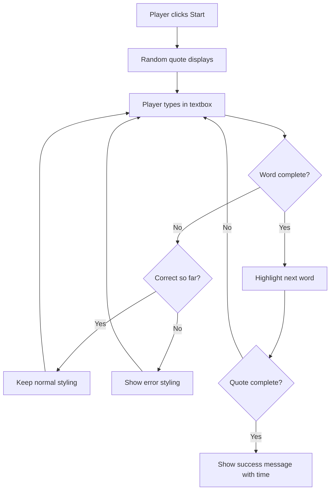
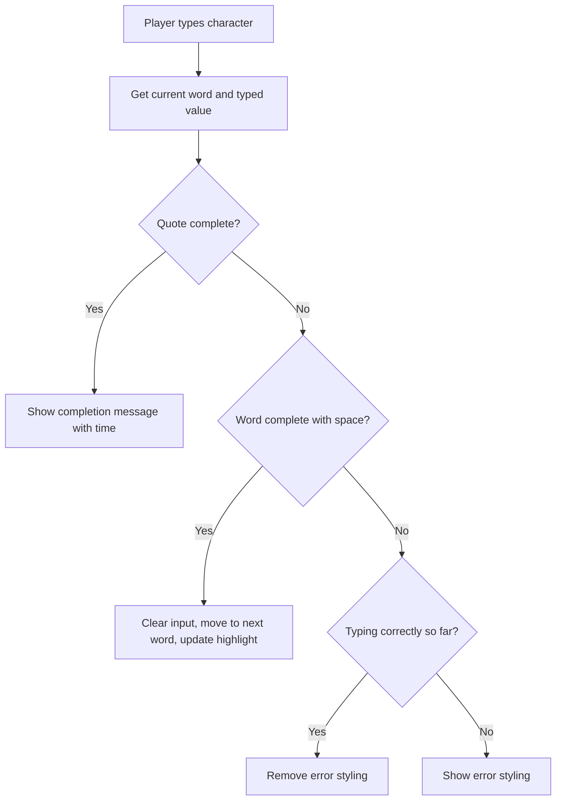

<!--
CO_OP_TRANSLATOR_METADATA:
{
  "original_hash": "e6b75e5b8caae906473a8a09d77b7121",
  "translation_date": "2025-10-24T22:15:00+00:00",
  "source_file": "4-typing-game/typing-game/README.md",
  "language_code": "ro"
}
-->
# Crearea unui joc folosind evenimente

Te-ai întrebat vreodată cum știu site-urile web când dai clic pe un buton sau tastezi într-o casetă de text? Aceasta este magia programării bazate pe evenimente! Ce mod mai bun de a învăța această abilitate esențială decât să construiești ceva util - un joc de viteză la tastare care reacționează la fiecare apăsare de tastă pe care o faci.

Vei vedea direct cum browserele web „vorbesc” cu codul tău JavaScript. De fiecare dată când dai clic, tastezi sau miști mouse-ul, browserul trimite mici mesaje (le numim evenimente) către codul tău, iar tu decizi cum să răspunzi!

Până la finalul acestui tutorial, vei fi construit un joc real de tastare care îți urmărește viteza și acuratețea. Mai important, vei înțelege conceptele fundamentale care stau la baza fiecărui site web interactiv pe care l-ai folosit vreodată. Să începem!

## Chestionar înainte de lecție

[Chestionar înainte de lecție](https://ff-quizzes.netlify.app/web/quiz/21)

## Programarea bazată pe evenimente

Gândește-te la aplicația sau site-ul tău preferat - ce îl face să pară viu și receptiv? Totul se rezumă la modul în care reacționează la ceea ce faci! Fiecare atingere, clic, glisare sau apăsare de tastă creează ceea ce numim un „eveniment”, și aici începe adevărata magie a dezvoltării web.

Iată ce face programarea pentru web atât de interesantă: nu știm niciodată când cineva va da clic pe acel buton sau va începe să tasteze într-o casetă de text. Poate că va da clic imediat, va aștepta cinci minute sau poate nu va da clic deloc! Această imprevizibilitate înseamnă că trebuie să gândim diferit despre cum scriem codul nostru.

În loc să scriem cod care rulează de sus în jos ca o rețetă, scriem cod care așteaptă răbdător să se întâmple ceva. Este similar cu modul în care operatorii de telegraf din anii 1800 stăteau lângă mașinile lor, gata să răspundă în momentul în care un mesaj ajungea prin fir.

Deci, ce este exact un „eveniment”? Simplu spus, este ceva ce se întâmplă! Când dai clic pe un buton - acesta este un eveniment. Când tastezi o literă - acesta este un eveniment. Când miști mouse-ul - acesta este un alt eveniment.

Programarea bazată pe evenimente ne permite să configurăm codul nostru pentru a asculta și a răspunde. Creăm funcții speciale numite **ascultători de evenimente** care așteaptă răbdător lucruri specifice să se întâmple, apoi acționează imediat când acestea se întâmplă.

Gândește-te la ascultătorii de evenimente ca la un sonerie pentru codul tău. Configurezi soneria (`addEventListener()`), îi spui ce sunet să asculte (cum ar fi un 'clic' sau 'keypress') și apoi specifici ce ar trebui să se întâmple când cineva sună (funcția ta personalizată).

**Cum funcționează ascultătorii de evenimente:**
- **Ascultă** acțiuni specifice ale utilizatorului, cum ar fi clicuri, apăsări de taste sau mișcări ale mouse-ului
- **Execută** codul tău personalizat atunci când are loc evenimentul specificat
- **Răspunde** imediat la interacțiunile utilizatorului, creând o experiență fluidă
- **Gestionează** mai multe evenimente pe același element folosind ascultători diferiți

> **NOTE:** Merită menționat că există numeroase moduri de a crea ascultători de evenimente. Poți folosi funcții anonime sau poți crea funcții denumite. Poți folosi diverse scurtături, cum ar fi setarea proprietății `click` sau utilizarea `addEventListener()`. În exercițiul nostru ne vom concentra pe `addEventListener()` și funcțiile anonime, deoarece este probabil cea mai comună tehnică folosită de dezvoltatorii web. Este, de asemenea, cea mai flexibilă, deoarece `addEventListener()` funcționează pentru toate evenimentele, iar numele evenimentului poate fi furnizat ca parametru.

### Evenimente comune

Deși browserele web oferă zeci de evenimente diferite pe care le poți asculta, majoritatea aplicațiilor interactive se bazează doar pe câteva evenimente esențiale. Înțelegerea acestor evenimente de bază îți va oferi fundația pentru a construi interacțiuni sofisticate cu utilizatorii.

Există [zeci de evenimente](https://developer.mozilla.org/docs/Web/Events) disponibile pentru a le asculta atunci când creezi o aplicație. Practic, orice face un utilizator pe o pagină generează un eveniment, ceea ce îți oferă multă putere pentru a te asigura că obține experiența dorită. Din fericire, de obicei vei avea nevoie doar de câteva evenimente. Iată câteva dintre cele mai comune (inclusiv cele două pe care le vom folosi pentru a crea jocul nostru):

| Eveniment | Descriere | Utilizări comune |
|-----------|-----------|------------------|
| `click` | Utilizatorul a dat clic pe ceva | Butoane, linkuri, elemente interactive |
| `contextmenu` | Utilizatorul a dat clic dreapta pe mouse | Meniuri personalizate la clic dreapta |
| `select` | Utilizatorul a selectat text | Editare text, operațiuni de copiere |
| `input` | Utilizatorul a introdus text | Validarea formularelor, căutare în timp real |

**Înțelegerea acestor tipuri de evenimente:**
- **Se declanșează** atunci când utilizatorii interacționează cu elemente specifice de pe pagina ta
- **Furnizează** informații detaliate despre acțiunea utilizatorului prin obiecte de eveniment
- **Permite** crearea de aplicații web responsive și interactive
- **Funcționează** în mod constant pe diferite browsere și dispozitive

## Crearea jocului

Acum că înțelegi cum funcționează evenimentele, să punem în practică aceste cunoștințe construind ceva util. Vom crea un joc de viteză la tastare care demonstrează gestionarea evenimentelor și te ajută să dezvolți o abilitate importantă pentru dezvoltatori.

Vom crea un joc pentru a explora cum funcționează evenimentele în JavaScript. Jocul nostru va testa abilitatea de tastare a unui jucător, care este una dintre cele mai subestimate abilități pe care toți dezvoltatorii ar trebui să le aibă. Știați că layout-ul tastaturii QWERTY pe care îl folosim astăzi a fost de fapt conceput în anii 1870 pentru mașinile de scris - iar abilitățile bune de tastare sunt la fel de valoroase pentru programatori și astăzi! Fluxul general al jocului va arăta astfel:



**Cum va funcționa jocul nostru:**
- **Începe** când jucătorul apasă butonul de start și afișează un citat aleatoriu
- **Urmărește** progresul tastării jucătorului cuvânt cu cuvânt în timp real
- **Evidențiază** cuvântul curent pentru a ghida atenția jucătorului
- **Oferă** feedback vizual imediat pentru greșelile de tastare
- **Calculează** și afișează timpul total când citatul este completat

Să construim jocul nostru și să învățăm despre evenimente!

### Structura fișierelor

Înainte să începem să scriem cod, să ne organizăm! Să avem o structură de fișiere curată de la început ne va scuti de dureri de cap mai târziu și va face proiectul nostru mai profesional. 😊

Vom păstra lucrurile simple cu doar trei fișiere: `index.html` pentru structura paginii, `script.js` pentru toată logica jocului și `style.css` pentru a face totul să arate grozav. Aceasta este triada clasică care stă la baza majorității web-ului!

**Creează un folder nou pentru proiectul tău deschizând o consolă sau fereastră terminal și executând următoarea comandă:**

```bash
# Linux or macOS
mkdir typing-game && cd typing-game

# Windows
md typing-game && cd typing-game
```

**Ce fac aceste comenzi:**
- **Creează** un nou director numit `typing-game` pentru fișierele proiectului tău
- **Navighează** automat în directorul nou creat
- **Configurează** un spațiu de lucru curat pentru dezvoltarea jocului tău

**Deschide Visual Studio Code:**

```bash
code .
```

**Această comandă:**
- **Lansează** Visual Studio Code în directorul curent
- **Deschide** folderul proiectului în editor
- **Oferă** acces la toate instrumentele de dezvoltare de care ai nevoie

**Adaugă trei fișiere în folderul din Visual Studio Code cu următoarele nume:**
- `index.html` - Conține structura și conținutul jocului tău
- `script.js` - Gestionează toată logica jocului și ascultătorii de evenimente
- `style.css` - Definește aspectul vizual și stilizarea

## Crearea interfeței utilizatorului

Acum să construim scena unde va avea loc toată acțiunea jocului nostru! Gândește-te la asta ca la proiectarea panoului de control al unei nave spațiale - trebuie să ne asigurăm că tot ce au nevoie jucătorii este exact acolo unde se așteaptă să fie.

Să ne dăm seama de ce are nevoie jocul nostru. Dacă ai juca un joc de tastare, ce ai vrea să vezi pe ecran? Iată ce vom avea nevoie:

| Element UI | Scop | Element HTML |
|------------|------|--------------|
| Afișaj citat | Afișează textul de tastat | `<p>` cu `id="quote"` |
| Zonă de mesaje | Afișează mesaje de stare și succes | `<p>` cu `id="message"` |
| Casetă de text | Unde jucătorii tastează citatul | `<input>` cu `id="typed-value"` |
| Buton de start | Pornește jocul | `<button>` cu `id="start"` |

**Înțelegerea structurii UI:**
- **Organizează** conținutul logic de sus în jos
- **Atribuie** ID-uri unice elementelor pentru a fi accesate din JavaScript
- **Oferă** o ierarhie vizuală clară pentru o experiență mai bună a utilizatorului
- **Include** elemente HTML semantice pentru accesibilitate

Fiecare dintre acestea va avea nevoie de ID-uri pentru a putea lucra cu ele în JavaScript. Vom adăuga, de asemenea, referințe la fișierele CSS și JavaScript pe care urmează să le creăm.

Creează un fișier nou numit `index.html`. Adaugă următorul cod HTML:

```html
<!-- inside index.html -->
<html>
<head>
  <title>Typing game</title>
  <link rel="stylesheet" href="style.css">
</head>
<body>
  <h1>Typing game!</h1>
  <p>Practice your typing skills with a quote from Sherlock Holmes. Click **start** to begin!</p>
  <p id="quote"></p> <!-- This will display our quote -->
  <p id="message"></p> <!-- This will display any status messages -->
  <div>
    <input type="text" aria-label="current word" id="typed-value" /> <!-- The textbox for typing -->
    <button type="button" id="start">Start</button> <!-- To start the game -->
  </div>
  <script src="script.js"></script>
</body>
</html>
```

**Ce realizează această structură HTML:**
- **Leagă** fișierul CSS în `<head>` pentru stilizare
- **Creează** un titlu clar și instrucțiuni pentru utilizatori
- **Stabilește** paragrafe de tip placeholder cu ID-uri specifice pentru conținut dinamic
- **Include** un câmp de introducere text cu atribute de accesibilitate
- **Oferă** un buton de start pentru a declanșa jocul
- **Încarcă** fișierul JavaScript la final pentru performanță optimă

### Lansarea aplicației

Testarea frecventă a aplicației în timpul dezvoltării te ajută să identifici problemele devreme și să vezi progresul în timp real. Live Server este un instrument valoros care îți actualizează automat browserul de fiecare dată când salvezi modificările, făcând dezvoltarea mult mai eficientă.

Este întotdeauna cel mai bine să dezvolți iterativ pentru a vedea cum arată lucrurile. Să lansăm aplicația noastră. Există o extensie minunată pentru Visual Studio Code numită [Live Server](https://marketplace.visualstudio.com/items?itemName=ritwickdey.LiveServer&WT.mc_id=academic-77807-sagibbon) care va găzdui aplicația ta local și va actualiza browserul de fiecare dată când salvezi.

**Instalează [Live Server](https://marketplace.visualstudio.com/items?itemName=ritwickdey.LiveServer&WT.mc_id=academic-77807-sagibbon) urmând linkul și făcând clic pe Install:**

**Ce se întâmplă în timpul instalării:**
- **Deschide** browserul pentru a accesa Visual Studio Code
- **Ghidează** procesul de instalare a extensiei
- **Poate necesita** repornirea Visual Studio Code pentru finalizarea configurării

**După instalare, în Visual Studio Code, apasă Ctrl-Shift-P (sau Cmd-Shift-P) pentru a deschide paleta de comenzi:**

**Înțelegerea paletei de comenzi:**
- **Oferă** acces rapid la toate comenzile din VS Code
- **Permite** căutarea comenzilor pe măsură ce tastezi
- **Oferă** scurtături de tastatură pentru o dezvoltare mai rapidă

**Tastează "Live Server: Open with Live Server":**

**Ce face Live Server:**
- **Pornește** un server local de dezvoltare pentru proiectul tău
- **Actualizează** automat browserul când salvezi fișierele
- **Servește** fișierele tale de la un URL local (de obicei `localhost:5500`)

**Deschide un browser și navighează la `https://localhost:5500`:**

Acum ar trebui să vezi pagina pe care ai creat-o! Să adăugăm puțină funcționalitate.

## Adaugă CSS-ul

Acum să facem lucrurile să arate bine! Feedback-ul vizual a fost crucial pentru interfețele utilizatorului încă de la începuturile informaticii. În anii 1980, cercetătorii au descoperit că feedback-ul vizual imediat îmbunătățește semnificativ performanța utilizatorului și reduce erorile. Exact asta vom crea.

Jocul nostru trebuie să fie extrem de clar în ceea ce privește ceea ce se întâmplă. Jucătorii ar trebui să știe imediat ce cuvânt trebuie să tasteze, iar dacă fac o greșeală, ar trebui să o vadă imediat. Să creăm un stil simplu, dar eficient:

Creează un fișier nou numit `style.css` și adaugă următorul cod.

```css
/* inside style.css */
.highlight {
  background-color: yellow;
}

.error {
  background-color: lightcoral;
  border: red;
}
```

**Înțelegerea acestor clase CSS:**
- **Evidențiază** cuvântul curent cu un fundal galben pentru o ghidare vizuală clară
- **Semnalează** erorile de tastare cu o culoare coral deschis
- **Oferă** feedback imediat fără a întrerupe fluxul de tastare al utilizatorului
- **Folosește** culori contrastante pentru accesibilitate și comunicare vizuală clară

✅ Când vine vorba de CSS, poți să îți organizezi pagina așa cum îți dorești. Ia puțin timp și fă pagina să arate mai atractiv:

- Alege un font diferit
- Colorează titlurile
- Redimensionează elementele

## JavaScript

Acum începe partea interesantă! 🎉 Avem structura HTML și stilizarea CSS, dar în acest moment jocul nostru este ca o mașină frumoasă fără motor. JavaScript va fi motorul - este ceea ce face ca totul să funcționeze și să răspundă la acțiunile jucătorilor.

Aici vei vedea cum creația ta prinde viață. Vom aborda acest pas pas cu pas, astfel încât nimic să nu pară copleșitor:

| Pas | Scop | Ce vei învăța |
|-----|------|---------------|
| [Crearea constantelor](../../../../4-typing-game/typing-game) | Configurarea citatelor și referințelor DOM | Gestionarea variabilelor și selecția DOM |
| [Ascultător de evenimente pentru a începe jocul](../../../../4-typing-game/typing-game) | Gestionarea inițializării jocului | Gestionarea evenimentelor și actualizarea UI |
| [Ascultător de evenimente pentru tastare](../../../../4-typing-game/typing-game) | Procesarea inputului utilizatorului în timp real | Validarea inputului și feedback dinamic |

**Această abordare structurată te ajută:**
- **Organizează** codul în secțiuni logice și ușor de gestionat
- **Construiește** funcționalitatea treptat pentru o depanare mai ușoară
- **Înțelege** cum funcționează împreună diferitele părți ale aplicației tale
- **Creează** modele reutilizabile pentru proiecte viitoare

Dar mai întâi, creează un fiș
| Array de citate | Stochează toate citatele posibile pentru joc | `['Citat 1', 'Citat 2', ...]` |
| Array de cuvinte | Împarte citatul curent în cuvinte individuale | `['Când', 'ai', '...', ...]` |
| Indexul cuvântului | Urmărește cuvântul pe care jucătorul îl tastează | `0, 1, 2, 3...` |
| Timp de început | Calculează timpul scurs pentru punctaj | `Date.now()` |

**Vom avea nevoie și de referințe la elementele UI:**
| Element | ID | Scop |
|---------|----|------|
| Câmp de text | `typed-value` | Unde tastează jucătorii |
| Afișare citat | `quote` | Afișează citatul de tastat |
| Zonă de mesaje | `message` | Afișează actualizările de stare |

```javascript
// inside script.js
// all of our quotes
const quotes = [
    'When you have eliminated the impossible, whatever remains, however improbable, must be the truth.',
    'There is nothing more deceptive than an obvious fact.',
    'I ought to know by this time that when a fact appears to be opposed to a long train of deductions it invariably proves to be capable of bearing some other interpretation.',
    'I never make exceptions. An exception disproves the rule.',
    'What one man can invent another can discover.',
    'Nothing clears up a case so much as stating it to another person.',
    'Education never ends, Watson. It is a series of lessons, with the greatest for the last.',
];
// store the list of words and the index of the word the player is currently typing
let words = [];
let wordIndex = 0;
// the starting time
let startTime = Date.now();
// page elements
const quoteElement = document.getElementById('quote');
const messageElement = document.getElementById('message');
const typedValueElement = document.getElementById('typed-value');
```

**Ce realizează acest cod de configurare:**
- **Stochează** un array de citate din Sherlock Holmes folosind `const`, deoarece citatele nu se vor schimba
- **Inițializează** variabile de urmărire cu `let`, deoarece aceste valori se vor actualiza în timpul jocului
- **Capturează** referințe la elementele DOM folosind `document.getElementById()` pentru acces eficient
- **Configurează** fundația pentru toate funcționalitățile jocului cu nume de variabile clare și descriptive
- **Organizează** datele și elementele asociate logic pentru o întreținere mai ușoară a codului

✅ Adaugă mai multe citate în jocul tău

> 💡 **Sfat util**: Putem accesa elementele oricând în cod folosind `document.getElementById()`. Deoarece vom face referire la aceste elemente în mod regulat, vom evita greșelile de tipar cu literale de șiruri utilizând constante. Framework-uri precum [Vue.js](https://vuejs.org/) sau [React](https://reactjs.org/) te pot ajuta să gestionezi mai bine centralizarea codului.
>
**De ce funcționează atât de bine această abordare:**
- **Previne** greșelile de scriere atunci când facem referire la elemente de mai multe ori
- **Îmbunătățește** lizibilitatea codului cu nume descriptive pentru constante
- **Permite** suport mai bun din partea IDE-ului cu completare automată și verificarea erorilor
- **Facilitează** refactorizarea dacă ID-urile elementelor se schimbă ulterior

Ia un minut să vizionezi un videoclip despre utilizarea `const`, `let` și `var`

[](https://youtube.com/watch?v=JNIXfGiDWM8 "Tipuri de variabile")

> 🎥 Click pe imaginea de mai sus pentru un videoclip despre variabile.

### Adaugă logica de start

Aici totul prinde contur! 🚀 Urmează să scrii primul tău listener de evenimente real, și există ceva foarte satisfăcător în a vedea cum codul tău răspunde la un click pe buton.

Gândește-te: undeva, un jucător va apăsa pe butonul "Start", iar codul tău trebuie să fie pregătit pentru el. Nu avem idee când va apăsa - poate imediat, poate după ce își ia o cafea - dar când o va face, jocul tău prinde viață.

Când utilizatorul apasă `start`, trebuie să selectăm un citat, să configurăm interfața utilizatorului și să setăm urmărirea pentru cuvântul curent și timpul. Mai jos este codul JavaScript pe care trebuie să-l adaugi; discutăm despre el imediat după blocul de script.

```javascript
// at the end of script.js
document.getElementById('start').addEventListener('click', () => {
  // get a quote
  const quoteIndex = Math.floor(Math.random() * quotes.length);
  const quote = quotes[quoteIndex];
  // Put the quote into an array of words
  words = quote.split(' ');
  // reset the word index for tracking
  wordIndex = 0;

  // UI updates
  // Create an array of span elements so we can set a class
  const spanWords = words.map(function(word) { return `<span>${word} </span>`});
  // Convert into string and set as innerHTML on quote display
  quoteElement.innerHTML = spanWords.join('');
  // Highlight the first word
  quoteElement.childNodes[0].className = 'highlight';
  // Clear any prior messages
  messageElement.innerText = '';

  // Setup the textbox
  // Clear the textbox
  typedValueElement.value = '';
  // set focus
  typedValueElement.focus();
  // set the event handler

  // Start the timer
  startTime = new Date().getTime();
});
```

**Să descompunem codul în secțiuni logice:**

**📊 Configurarea urmăririi cuvintelor:**
- **Selectează** un citat aleatoriu folosind `Math.floor()` și `Math.random()` pentru varietate
- **Transformă** citatul într-un array de cuvinte individuale folosind `split(' ')`
- **Resetează** `wordIndex` la 0, deoarece jucătorii încep cu primul cuvânt
- **Pregătește** starea jocului pentru o rundă nouă

**🎨 Configurarea și afișarea UI:**
- **Creează** un array de elemente `<span>`, înfășurând fiecare cuvânt pentru stilizare individuală
- **Unește** elementele span într-un singur șir pentru actualizarea eficientă a DOM-ului
- **Evidențiază** primul cuvânt prin adăugarea clasei CSS `highlight`
- **Șterge** orice mesaje anterioare ale jocului pentru a oferi un început curat

**⌨️ Pregătirea câmpului de text:**
- **Șterge** orice text existent în câmpul de introducere
- **Setează focusul** pe câmpul de text astfel încât jucătorii să poată începe să tasteze imediat
- **Pregătește** zona de introducere pentru sesiunea nouă de joc

**⏱️ Inițializarea cronometrului:**
- **Capturează** timestamp-ul curent folosind `new Date().getTime()`
- **Permite** calcularea precisă a vitezei de tastare și a timpului de finalizare
- **Pornește** urmărirea performanței pentru sesiunea de joc

### Adaugă logica de tastare

Aici abordăm esența jocului nostru! Nu te îngrijora dacă pare mult la început - vom parcurge fiecare piesă, iar la final vei vedea cât de logic este totul.

Ceea ce construim aici este destul de sofisticat: de fiecare dată când cineva tastează o literă, codul nostru va verifica ce a tastat, îi va oferi feedback și va decide ce ar trebui să se întâmple în continuare. Este similar cu modul în care primele procesoare de text, precum WordStar în anii '70, ofereau feedback în timp real pentru dactilografi.

```javascript
// at the end of script.js
typedValueElement.addEventListener('input', () => {
  // Get the current word
  const currentWord = words[wordIndex];
  // get the current value
  const typedValue = typedValueElement.value;

  if (typedValue === currentWord && wordIndex === words.length - 1) {
    // end of sentence
    // Display success
    const elapsedTime = new Date().getTime() - startTime;
    const message = `CONGRATULATIONS! You finished in ${elapsedTime / 1000} seconds.`;
    messageElement.innerText = message;
  } else if (typedValue.endsWith(' ') && typedValue.trim() === currentWord) {
    // end of word
    // clear the typedValueElement for the new word
    typedValueElement.value = '';
    // move to the next word
    wordIndex++;
    // reset the class name for all elements in quote
    for (const wordElement of quoteElement.childNodes) {
      wordElement.className = '';
    }
    // highlight the new word
    quoteElement.childNodes[wordIndex].className = 'highlight';
  } else if (currentWord.startsWith(typedValue)) {
    // currently correct
    // highlight the next word
    typedValueElement.className = '';
  } else {
    // error state
    typedValueElement.className = 'error';
  }
});
```

**Înțelegerea fluxului logic al tastării:**

Această funcție folosește o abordare în cascadă, verificând condițiile de la cele mai specifice la cele mai generale. Să descompunem fiecare scenariu:



**🏁 Citat complet (Scenariul 1):**
- **Verifică** dacă valoarea tastată se potrivește cu cuvântul curent ȘI dacă suntem la ultimul cuvânt
- **Calculează** timpul scurs scăzând timpul de început din timpul curent
- **Transformă** milisecundele în secunde împărțind la 1.000
- **Afișează** un mesaj de felicitare cu timpul de finalizare

**✅ Cuvânt complet (Scenariul 2):**
- **Detectează** completarea cuvântului când introducerea se termină cu un spațiu
- **Validează** că textul introdus, fără spații, se potrivește exact cu cuvântul curent
- **Șterge** câmpul de introducere pentru următorul cuvânt
- **Avansează** la următorul cuvânt incrementând `wordIndex`
- **Actualizează** evidențierea vizuală prin eliminarea tuturor claselor și evidențierea noului cuvânt

**📝 Tastare în progres (Scenariul 3):**
- **Verifică** dacă cuvântul curent începe cu ceea ce a fost tastat până acum
- **Elimină** orice stilizare de eroare pentru a arăta că introducerea este corectă
- **Permite** continuarea tastării fără întrerupere

**❌ Stare de eroare (Scenariul 4):**
- **Declanșează** când textul tastat nu se potrivește cu începutul cuvântului așteptat
- **Aplică** clasa CSS de eroare pentru a oferi feedback vizual imediat
- **Ajută** jucătorii să identifice și să corecteze rapid greșelile

## Testează aplicația ta

Uite ce ai realizat! 🎉 Tocmai ai construit un joc de tastare funcțional de la zero folosind programarea bazată pe evenimente. Ia un moment să apreciezi asta - nu este deloc o realizare mică!

Acum urmează faza de testare! Va funcționa așa cum te aștepți? Am ratat ceva? Iată ce trebuie să știi: dacă ceva nu funcționează perfect de la început, este complet normal. Chiar și dezvoltatorii experimentați găsesc erori în codul lor în mod regulat. Este parte din procesul de dezvoltare!

Apasă pe `start` și începe să tastezi! Ar trebui să arate puțin ca animația pe care am văzut-o înainte.


**Ce să testezi în aplicația ta:**
- **Verifică** dacă apăsarea pe Start afișează un citat aleatoriu
- **Confirmă** că tastarea evidențiază corect cuvântul curent
- **Verifică** dacă stilizarea de eroare apare pentru tastarea incorectă
- **Asigură-te** că finalizarea cuvintelor avansează evidențierea corect
- **Testează** dacă finalizarea citatului afișează mesajul de finalizare cu timpul

**Sfaturi comune pentru depanare:**
- **Verifică** consola browserului (F12) pentru erori JavaScript
- **Asigură-te** că toate numele fișierelor se potrivesc exact (case-sensitive)
- **Asigură-te** că Live Server funcționează și se actualizează corect
- **Testează** citate diferite pentru a verifica dacă selecția aleatorie funcționează

---

## Provocarea Agentului GitHub Copilot 🎮

Folosește modul Agent pentru a finaliza următoarea provocare:

**Descriere:** Extinde jocul de tastare implementând un sistem de dificultate care ajustează jocul în funcție de performanța jucătorului. Această provocare te va ajuta să exersezi gestionarea avansată a evenimentelor, analiza datelor și actualizările dinamice ale UI.

**Cerere:** Creează un sistem de ajustare a dificultății pentru jocul de tastare care:
1. Urmărește viteza de tastare a jucătorului (cuvinte pe minut) și procentajul de acuratețe
2. Se ajustează automat la trei niveluri de dificultate: Ușor (citate simple), Mediu (citate curente), Greu (citate complexe cu punctuație)
3. Afișează nivelul curent de dificultate și statisticile jucătorului în UI
4. Implementează un contor de serie care crește dificultatea după 3 performanțe consecutive bune
5. Adaugă feedback vizual (culori, animații) pentru a indica schimbările de dificultate

Adaugă elementele HTML necesare, stilurile CSS și funcțiile JavaScript pentru a implementa această funcționalitate. Include gestionarea corespunzătoare a erorilor și asigură-te că jocul rămâne accesibil cu etichete ARIA adecvate.

Află mai multe despre [modul agent](https://code.visualstudio.com/blogs/2025/02/24/introducing-copilot-agent-mode) aici.

## 🚀 Provocare

Ești pregătit să duci jocul de tastare la nivelul următor? Încearcă să implementezi aceste funcționalități avansate pentru a-ți aprofunda înțelegerea gestionării evenimentelor și manipulării DOM:

**Adaugă mai multe funcționalități:**

| Funcționalitate | Descriere | Abilități pe care le vei exersa |
|-----------------|-----------|---------------------------------|
| **Controlul introducerii** | Dezactivează listener-ul de evenimente `input` la finalizare și reactivează-l când se apasă butonul | Gestionarea evenimentelor și controlul stării |
| **Gestionarea stării UI** | Dezactivează câmpul de text când jucătorul finalizează citatul | Manipularea proprietăților DOM |
| **Dialog modal** | Afișează o casetă de dialog modală cu mesajul de succes | Modele avansate de UI și accesibilitate |
| **Sistem de scoruri maxime** | Stochează scorurile maxime folosind `localStorage` | API-uri de stocare în browser și persistența datelor |

**Sfaturi pentru implementare:**
- **Studiază** `localStorage.setItem()` și `localStorage.getItem()` pentru stocare persistentă
- **Exersează** adăugarea și eliminarea dinamică a listener-elor de evenimente
- **Explorează** elementele HTML de tip dialog sau modelele de modalitate CSS
- **Ia în considerare** accesibilitatea atunci când dezactivezi și reactivezi controalele formularului

## Test de evaluare după lecție

[Test de evaluare după lecție](https://ff-quizzes.netlify.app/web/quiz/22)

## Recapitulare & Studiu individual

Citește despre [toate evenimentele disponibile](https://developer.mozilla.org/docs/Web/Events) pentru dezvoltator prin intermediul browserului web și analizează scenariile în care ai folosi fiecare dintre ele.

## Temă

[Crează un nou joc de tastare](assignment.md)

---

**Declinare de responsabilitate**:  
Acest document a fost tradus folosind serviciul de traducere AI [Co-op Translator](https://github.com/Azure/co-op-translator). Deși ne străduim să asigurăm acuratețea, vă rugăm să fiți conștienți că traducerile automate pot conține erori sau inexactități. Documentul original în limba sa natală ar trebui considerat sursa autoritară. Pentru informații critice, se recomandă traducerea profesională realizată de oameni. Nu ne asumăm responsabilitatea pentru neînțelegerile sau interpretările greșite care pot apărea din utilizarea acestei traduceri.