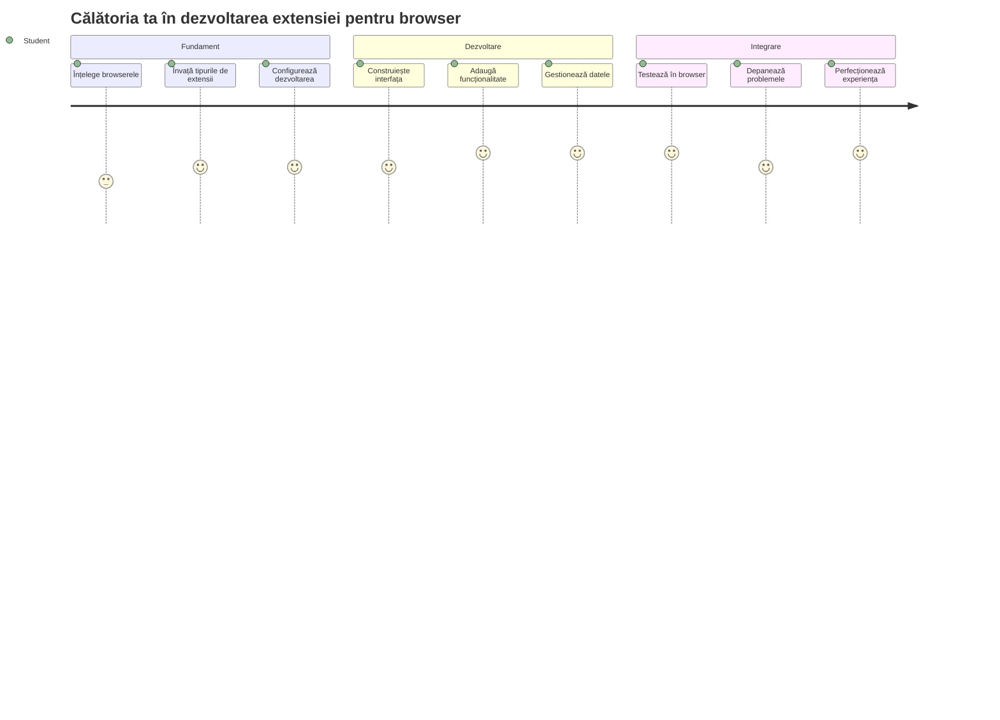
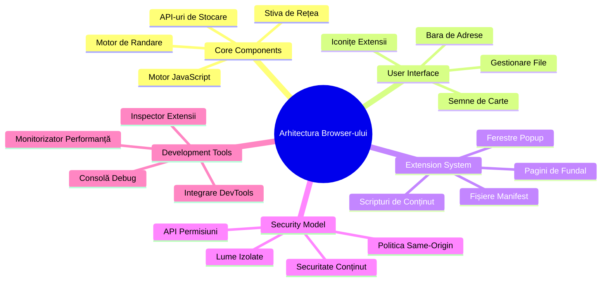
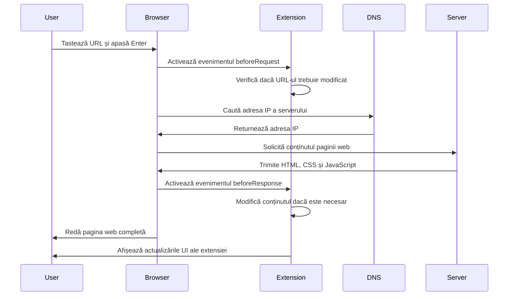
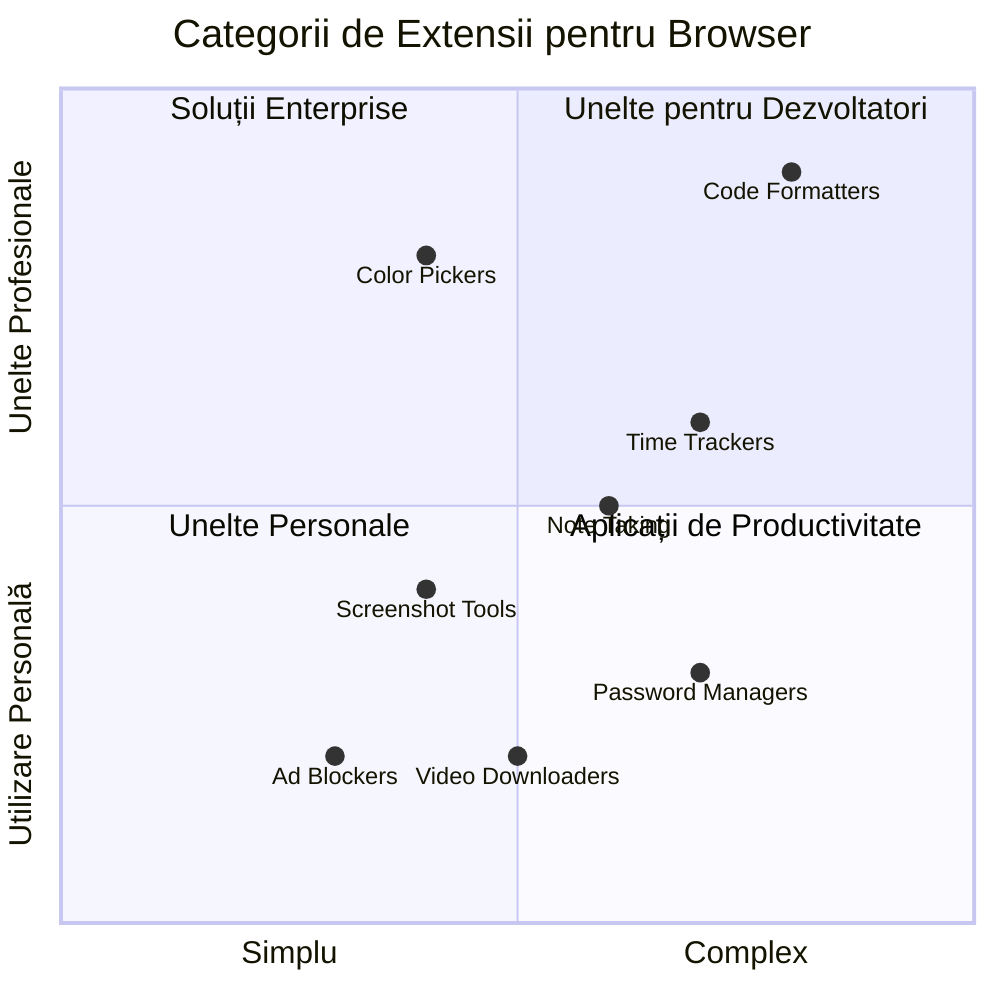
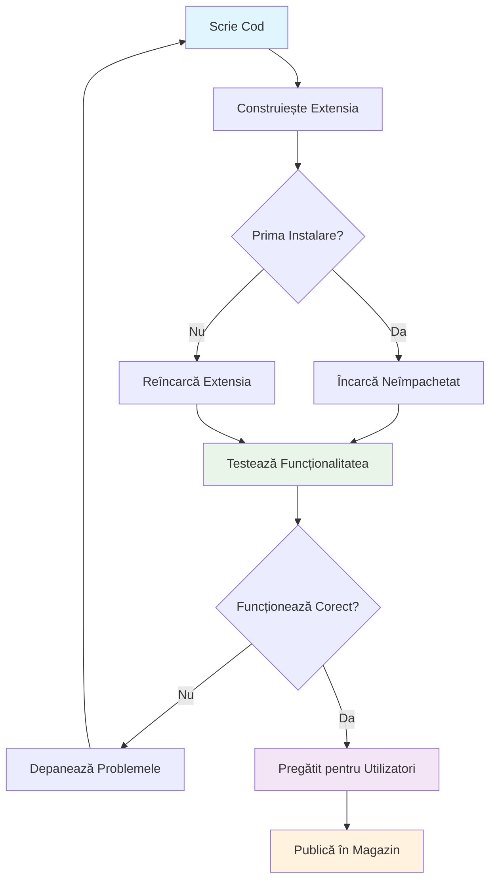
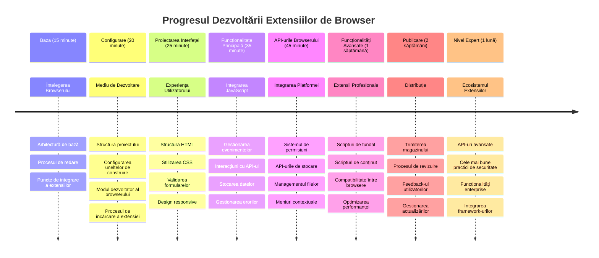

<!--
CO_OP_TRANSLATOR_METADATA:
{
  "original_hash": "00aa85715e1efd4930c17a23e3012e69",
  "translation_date": "2026-01-07T05:55:18+00:00",
  "source_file": "5-browser-extension/1-about-browsers/README.md",
  "language_code": "ro"
}
-->
# Browser Extension Project Part 1: Totul despre browsere



> Sketchnote de [Wassim Chegham](https://dev.to/wassimchegham/ever-wondered-what-happens-when-you-type-in-a-url-in-an-address-bar-in-a-browser-3dob)

## Chestionar Pre-Prelegere

[Chestionar pre-prelegere](https://ff-quizzes.netlify.app/web/quiz/23)

### Introducere

Extensiile de browser sunt mini-aplicații care îmbunătățesc experiența ta de navigare pe web. La fel ca viziunea originală a lui Tim Berners-Lee despre un web interactiv, extensiile extind capabilitățile browserului dincolo de simpla vizualizare a documentelor. De la manageri de parole care îți păstrează conturile în siguranță până la selecționatori de culori care ajută designerii să aleagă nuanțe perfecte, extensiile rezolvă provocările cotidiene de navigare.

Înainte să construim prima ta extensie, să înțelegem cum funcționează browserele. La fel cum Alexander Graham Bell trebuia să înțeleagă transmiterea sunetului înainte să inventeze telefonul, cunoașterea elementelor fundamentale ale browserului te va ajuta să creezi extensii care se integrează perfect cu sistemele existente ale browserului.

La finalul acestei lecții, vei înțelege arhitectura browserului și vei fi început să construiești prima ta extensie.


## Înțelegerea Browserelor Web

Un browser web este, în esență, un interpretator sofisticat de documente. Când tastezi "google.com" în bara de adrese, browserul efectuează o serie complexă de operațiuni - solicitând conținut de la servere din întreaga lume, apoi analizând și redând acel cod în paginile web interactive pe care le vezi.

Acest proces reflectă modul în care primul browser web, WorldWideWeb, a fost proiectat de Tim Berners-Lee în 1990 pentru a face documentele hiperlinkate accesibile tuturor.

✅ **Puțină istorie**: Primul browser se numea 'WorldWideWeb' și a fost creat de Sir Timothy Berners-Lee în 1990.


> Unele browsere timpurii, via [Karen McGrane](https://www.slideshare.net/KMcGrane/week-4-ixd-history-personal-computing)

### Cum Processează Browserele Conținutul Web

Procesul dintre tastarea unui URL și vizualizarea unei pagini web implică mai mulți pași coordonați care au loc în câteva secunde:


**Iată ce realizează acest proces:**
- **Traduce** URL-ul citibil de om într-o adresă IP de server printr-o căutare DNS
- **Stabilește** o conexiune securizată cu serverul web folosind protocoale HTTP sau HTTPS
- **Solicită** conținutul specific al paginii web de la server
- **Primește** markup HTML, stilizare CSS și cod JavaScript de la server
- **Redă** tot conținutul în pagina web interactivă pe care o vezi

### Caracteristici de Bază ale Browserului

Browserele moderne oferă numeroase caracteristici pe care dezvoltatorii de extensii le pot exploata:

| Caracteristică | Scop | Oportunități pentru Extensii |
|---------|---------|------------------------|
| **Motor de redare** | Afișează HTML, CSS și JavaScript | Modificare conținut, injectare stiluri |
| **Motor JavaScript** | Execută cod JavaScript | Scripturi personalizate, interacțiuni API |
| **Stocare locală** | Salvează date local | Preferințe utilizator, date cache |
| **Stack rețea** | Gestionează cererile web | Monitorizare cereri, analiză date |
| **Model de securitate** | Protejează utilizatorii de conținut rău intenționat | Filtrare conținut, îmbunătățiri securitate |

**Înțelegerea acestor caracteristici te ajută să:**
- **Identifici** unde extensia ta poate adăuga cea mai mare valoare
- **Alegi** API-urile potrivite ale browserului pentru funcționalitatea extensiei tale
- **Proiectezi** extensii care funcționează eficient cu sistemele browserului
- **Asiguri** că extensia ta urmează cele mai bune practici de securitate în browser

### Considerații pentru Dezvoltarea Cross-Browser

Diferite browsere implementează standardele cu variații ușoare, similar modului în care limbajele de programare diferă în gestionarea aceluiași algoritm. Chrome, Firefox și Safari au fiecare caracteristici unice pe care dezvoltatorii trebuie să le ia în considerare la dezvoltarea extensiilor.

> 💡 **Sfat de Pro**: Folosește [caniuse.com](https://www.caniuse.com) pentru a verifica ce tehnologii web sunt suportate în diferite browsere. Acest lucru este neprețuit când planifici funcționalitățile extensiei tale!

**Considerații cheie pentru dezvoltarea extensiilor:**
- **Testează** extensia ta în browserele Chrome, Firefox și Edge
- **Adaptează-te** la diferite API-uri și formate de manifest pentru extensii de browser
- **Gestionază** caracteristici și limitări de performanță variabile
- **Oferă** soluții alternative pentru funcții specifice browserelor, care pot să nu fie disponibile

✅ **Insight Analytic**: Poți determina ce browsere preferă utilizatorii tăi instalând pachete de analiză în proiectele tale de dezvoltare web. Aceste date te ajută să prioritizezi suportul pentru browsere.

## Înțelegerea Extensiilor de Browser

Extensiile browserelor rezolvă provocări comune în navigarea pe web prin adăugarea de funcționalități direct în interfața browserului. În loc să ceară aplicații separate sau fluxuri de lucru complexe, extensiile oferă acces imediat la unelte și caracteristici.

Acest concept reflectă modul în care pionierii timpurii ai calculatoarelor, precum Douglas Engelbart, și-au imaginat augmentarea capacităților umane prin tehnologie - extensiile sporesc funcționalitatea de bază a browserului tău.


**Categorii populare de extensii și beneficiile lor:**
- **Instrumente de productivitate**: Manageri de sarcini, aplicații de luat notițe și trackere de timp care te ajută să rămâi organizat
- **Îmbunătățiri de securitate**: Manageri de parole, blocatoare de reclame și unelte de confidențialitate care îți protejează datele
- **Instrumente pentru dezvoltatori**: Formatare cod, selecționatori de culori și utilitare de depanare care eficientizează dezvoltarea
- **Îmbunătățire conținut**: Moduri de lectură, descărcătoare video și unelte de captură de ecran care îți îmbunătățesc experiența web

✅ **Întrebare de reflecție**: Care sunt extensiile tale de browser preferate? Ce sarcini specifice realizează și cum îți îmbunătățesc experiența de navigare?

### 🔄 **Verificare Pedagogică**
**Înțelegerea arhitecturii browserului**: Înainte de a începe dezvoltarea extensiilor, asigură-te că poți:
- ✅ Explica cum procesează browserele cererile web și redau conținutul
- ✅ Identifica componentele principale ale arhitecturii browserului
- ✅ Înțelege modul în care extensiile se integrează cu funcționalitatea browserului
- ✅ Recunoaște modelul de securitate care protejează utilizatorii

**Auto-test rapid**: Poți urmări traseul de la tastarea unui URL până la afișarea unei pagini web?
1. **Căutare DNS** transformă URL în adresă IP
2. **Cerere HTTP** preia conținutul de la server
3. **Parsing** procesează HTML, CSS și JavaScript
4. **Redare** afișează pagina finală
5. **Extensiile** pot modifica conținutul în mai mulți pași

## Instalarea și Gestionarea Extensiilor

Înțelegerea procesului de instalare a extensiilor te ajută să anticipezi experiența utilizatorului când oamenii își instalează extensia ta. Procesul de instalare este standardizat în browserele moderne, cu variații minore în designul interfeței.


> **Important**: Asigură-te că activezi modul dezvoltator și permiți extensiile din alte magazine când testezi extensiile proprii.

### Procesul de Instalare a Extensiilor în Dezvoltare

Când dezvolți și testezi propriile extensii, urmează acest flux de lucru:


```bash
# Pasul 1: Construiește-ți extensia
npm run build
```

**Ce realizează această comandă:**
- **Compilează** codul tău sursă în fișiere pregătite pentru browser
- **Grupă** module JavaScript în pachete optimizate
- **Generează** fișierele finale ale extensiei în folderul `/dist`
- **Pregătește** extensia pentru instalare și testare

**Pasul 2: Navighează la Extensiile Browserului**
1. **Deschide** pagina de administrare extensii a browserului tău
2. **Apasă** butonul „Setări și altele” (pictograma `...`) în dreapta sus
3. **Selectează** „Extensii” din meniul derulant

**Pasul 3: Încarcă Extensia Ta**
- **Pentru instalări noi**: Alege `load unpacked` și selectează folderul tău `/dist`
- **Pentru actualizări**: Apasă `reload` lângă extensia deja instalată
- **Pentru testare**: Activează „Modul dezvoltator” pentru a accesa funcții suplimentare de depanare

### Instalarea Extensiilor pentru Producție

> ✅ **Notă**: Aceste instrucțiuni de dezvoltare sunt pentru extensiile pe care le construiești tu însuți. Pentru instalarea extensiilor publicate, vizitează magazinele oficiale de extensii ale browserului precum [Microsoft Edge Add-ons store](https://microsoftedge.microsoft.com/addons/Microsoft-Edge-Extensions-Home).

**Înțelegerea diferenței:**
- **Instalările în dezvoltare** îți permit să testezi extensii nepublicate în timpul dezvoltării
- **Instalările din magazin** oferă extensii verificate, publicate, cu actualizări automate
- **Sideloading-ul** permite instalarea extensiilor din afara magazinelor oficiale (necesită modul dezvoltator activat)

## Construirea Extensiei Tale de Amprentă de Carbon

Vom crea o extensie de browser care afișează amprenta de carbon a consumului energetic al regiunii tale. Acest proiect demonstrează conceptele esențiale ale dezvoltării extensiilor în timp ce creează un instrument practic pentru conștientizarea mediului.

Această abordare urmează principiul „învățării prin practică” care s-a dovedit eficient încă de la teoriile educaționale ale lui John Dewey - combinând aptitudinile tehnice cu aplicații reale semnificative.

### Cerințe pentru Proiect

Înainte de a începe dezvoltarea, să adunăm resursele și dependențele necesare:

**Acces API necesar:**
- **[Cheie API CO2 Signal](https://www.co2signal.com/)**: Introdu adresa ta de email pentru a primi cheia API gratuită
- **[Codul regiunii](http://api.electricitymap.org/v3/zones)**: Găsește codul regiunii tale folosind [Electricity Map](https://www.electricitymap.org/map) (de exemplu, Boston folosește 'US-NEISO')

**Unelte de dezvoltare:**
- **[Node.js și NPM](https://www.npmjs.com)**: Unealtă de gestionare pachete pentru instalarea dependențelor proiectului
- **[Cod de start](../../../../5-browser-extension/start)**: Descarcă folderul `start` pentru a începe dezvoltarea

✅ **Află mai multe**: Amplifică-ți abilitățile de gestionare a pachetelor cu acest [modul complet Learn](https://docs.microsoft.com/learn/modules/create-nodejs-project-dependencies/?WT.mc_id=academic-77807-sagibbon)

### Înțelegerea Structurii Proiectului

Înțelegerea structurii proiectului ajută la organizarea eficientă a activităților de dezvoltare. La fel cum Biblioteca din Alexandria era organizată pentru a facilita accesul rapid la cunoștințe, un cod bine structurat crește eficiența dezvoltării:

```
project-root/
├── dist/                    # Built extension files
│   ├── manifest.json        # Extension configuration
│   ├── index.html           # User interface markup
│   ├── background.js        # Background script functionality
│   └── main.js              # Compiled JavaScript bundle
├── src/                     # Source development files
│   └── index.js             # Your main JavaScript code
├── package.json             # Project dependencies and scripts
└── webpack.config.js        # Build configuration
```

**Defalcarea a ceea ce face fiecare fișier:**
- **`manifest.json`**: **Definește** metadatele extensiei, permisiunile și punctele de intrare
- **`index.html`**: **Creează** interfața utilizator care apare când utilizatorii dau click pe extensie
- **`background.js`**: **Gestionează** sarcinile din fundal și ascultătorii de evenimente din browser
- **`main.js`**: **Conține** JavaScript-ul final grupat după procesul de build
- **`src/index.js`**: **Adăpostește** codul principal de dezvoltare care este compilat în `main.js`

> 💡 **Sfat de organizare**: Păstrează-ți cheia API și codul regiunii într-o notiță securizată pentru referințe ușoare în timpul dezvoltării. Vei avea nevoie de aceste valori pentru testarea funcționalității extensiei.

✅ **Notă de securitate**: Nu urca niciodată chei API sau credențiale sensibile în depozitul tău de cod. Îți vom arăta cum să le gestionezi în siguranță în pașii următori.

## Crearea Interfeței Extensiei

Acum vom construi componentele interfeței utilizator. Extensia folosește o abordare cu două ecrane: un ecran de configurare pentru setarea inițială și un ecran de rezultate pentru afișarea datelor.

Aceasta urmează principiul dezvăluirii progresive folosit în designul interfețelor încă din primele zile ale calculatoarelor - dezvăluind informații și opțiuni într-o secvență logică pentru a nu copleși utilizatorii.

### Prezentarea Vederilor Extensiei

**Vederea de configurare** - Configurare inițială pentru utilizatorii noi:


**Vederea de rezultate** - Afișarea datelor despre amprenta de carbon:


### Construirea Formularului de Configurare

Formularul de configurare colectează datele de configurare ale utilizatorului în timpul primei utilizări. Odată configurat, această informație este păstrată în stocarea locală a browserului pentru sesiuni viitoare.

În fișierul `/dist/index.html`, adaugă această structură a formularului:

```html
<form class="form-data" autocomplete="on">
    <div>
        <h2>New? Add your Information</h2>
    </div>
    <div>
        <label for="region">Region Name</label>
        <input type="text" id="region" required class="region-name" />
    </div>
    <div>
        <label for="api">Your API Key from tmrow</label>
        <input type="text" id="api" required class="api-key" />
    </div>
    <button class="search-btn">Submit</button>
</form>
```

**Iată ce realizează acest formular:**
- **Creează** o structură semantică a formularului cu etichete și asocieri corecte pentru câmpuri
- **Activează** funcționalitatea de completare automată a browserului pentru experiență îmbunătățită
- **Solicită** completarea ambelor câmpuri înainte de trimitere folosind atributul `required`
- **Organizează** intrările cu nume descriptive de clasă pentru ușurință în stilizare și direcționare JavaScript
- **Oferă** instrucțiuni clare utilizatorilor care instalează extensia pentru prima dată

### Construirea Afișajului Rezultatelor

Apoi, creează zona de rezultate care va afișa datele despre amprenta de carbon. Adaugă acest HTML sub formular:

```html
<div class="result">
    <div class="loading">loading...</div>
    <div class="errors"></div>
    <div class="data"></div>
    <div class="result-container">
        <p><strong>Region: </strong><span class="my-region"></span></p>
        <p><strong>Carbon Usage: </strong><span class="carbon-usage"></span></p>
        <p><strong>Fossil Fuel Percentage: </strong><span class="fossil-fuel"></span></p>
    </div>
    <button class="clear-btn">Change region</button>
</div>
```

**Defalcarea a ceea ce oferă această structură:**
- **`loading`**: **Afișează** un mesaj de încărcare în timp ce datele API sunt preluate
- **`errors`**: **Arată** mesaje de eroare dacă apelurile API eșuează sau datele sunt invalide
- **`data`**: **Deține** date brute pentru depanare în timpul dezvoltării
- **`result-container`**: **Prezintă** informații formatate despre amprenta de carbon utilizatorilor
- **`clear-btn`**: **Permite** utilizatorilor să-și schimbe regiunea și să reconfigureze extensia

### Configurarea Procesului de Build

Acum să instalăm dependențele proiectului și să testăm procesul de build:

```bash
npm install
```

**Ce realizează acest proces de instalare:**
- **Descarcă** Webpack și alte dependențe de dezvoltare specificate în `package.json`
- **Configurează** lanțul de build pentru compilarea JavaScript-ului modern
- **Pregătește** mediul de dezvoltare pentru construirea și testarea extensiei
- **Permite** gruparea codului, optimizarea și caracteristici de compatibilitate cross-browser

> 💡 **Insight despre procesul de build**: Webpack grupează codul tău sursă din `/src/index.js` în `/dist/main.js`. Acest proces optimizează codul pentru producție și asigură compatibilitatea browserelor.

### Testarea Progresului Tău

În acest punct, poți testa extensia ta:
1. **Rulează** comanda de build pentru a compila codul tău  
2. **Încarcă** extensia în browser folosind modul dezvoltator  
3. **Verifică** dacă formularul se afișează corect și arată profesional  
4. **Verifică** dacă toate elementele formularului sunt aliniate corect și funcționale  

**Ce ai realizat:**  
- **Ai construit** structura HTML de bază pentru extensia ta  
- **Ai creat** atât interfețele de configurare, cât și cele de rezultate cu marcaj semantic corect  
- **Ai configurat** un workflow modern de dezvoltare folosind uneltele standard din industrie  
- **Ai pregătit** fundația pentru adăugarea funcționalităților interactive în JavaScript  

### 🔄 **Verificare pedagogică**  
**Progresul dezvoltării extensiei:** Verifică-ți înțelegerea înainte de a continua:  
- ✅ Poți explica scopul fiecărui fișier din structura proiectului?  
- ✅ Înțelegi cum transformă procesul de build codul sursă?  
- ✅ De ce separăm configurarea și rezultatele în secțiuni UI diferite?  
- ✅ Cum susține structura formularului atât utilizabilitatea, cât și accesibilitatea?  

**Înțelegerea workflow-ului de dezvoltare:** Acum ar trebui să poți:  
1. **Modifica** HTML și CSS pentru interfața extensiei tale  
2. **Rula** comanda de build pentru a compila modificările  
3. **Reîncărca** extensia în browser pentru a testa actualizările  
4. **Depana** probleme folosind uneltele de dezvoltare ale browserului  

Ai finalizat prima fază a dezvoltării unei extensii pentru browser. La fel cum frații Wright au trebuit mai întâi să înțeleagă aerodinamica înainte de a zbura, înțelegerea acestor concepte fundamentale te pregătește să construiești funcționalități interactive mai complexe în următoarea lecție.  

## Provocarea Agentului GitHub Copilot 🚀

Folosește modul Agent pentru a îndeplini următoarea provocare:  

**Descriere:** Îmbunătățește extensia pentru browser adăugând validarea formularului și funcții de feedback pentru utilizator pentru a îmbunătăți experiența când se introduc cheile API și codurile de regiune.  

**Prompt:** Creează funcții JavaScript de validare care verifică dacă câmpul pentru cheia API conține cel puțin 20 de caractere și dacă codul regiunii respectă formatul corect (de exemplu „US-NEISO”). Adaugă feedback vizual prin schimbarea culorii bordurii inputului în verde pentru date valide și roșu pentru cele invalide. De asemenea, adaugă o opțiune de toggle pentru a arăta/ascunde cheia API din motive de securitate.  

Află mai multe despre [modul agent](https://code.visualstudio.com/blogs/2025/02/24/introducing-copilot-agent-mode) aici.  

## 🚀 Provocare  

Aruncă o privire pe un magazin de extensii pentru browser și instalează una în browserul tău. Poți examina fișierele acesteia în moduri interesante. Ce descoperi?  

## Chestionar post-lectură  

[Chestionar post-lectură](https://ff-quizzes.netlify.app/web/quiz/24)  

## Revizuire & Auto-învățare  

În această lecție ai aflat puțin despre istoria browserelor web; profită de ocazie să înveți despre cum au vizualizat inventatorii World Wide Web folosirea acestuia citind mai multe despre istoria sa. Câteva site-uri utile includ:  

[Istoria browserelor web](https://www.mozilla.org/firefox/browsers/browser-history/)  

[Istoria webului](https://webfoundation.org/about/vision/history-of-the-web/)  

[Un interviu cu Tim Berners-Lee](https://www.theguardian.com/technology/2019/mar/12/tim-berners-lee-on-30-years-of-the-web-if-we-dream-a-little-we-can-get-the-web-we-want)  

### ⚡ **Ce poți face în următoarele 5 minute**  
- [ ] Deschide pagina extensiilor din Chrome/Edge (chrome://extensions) și explorează ce ai instalat  
- [ ] Privește fila Network din DevTools a browserului în timp ce încarci o pagină web  
- [ ] Încearcă să vezi sursa paginii (Ctrl+U) pentru a observa structura HTML  
- [ ] Inspectează orice element de pe pagină și modifică-i CSS-ul din DevTools  

### 🎯 **Ce poți realiza în această oră**  
- [ ] Finalizează chestionarul post-lectură și înțelege conceptele fundamentale ale browserului  
- [ ] Creează un fișier manifest.json de bază pentru o extensie de browser  
- [ ] Construiește o extensie simplă „Hello World” care afișează un popup  
- [ ] Testează încărcarea extensiei tale în modul dezvoltator  
- [ ] Explorează documentația pentru extensii a browserului țintă  

### 📅 **Călătoria ta de o săptămână în dezvoltarea extensiilor**  
- [ ] Finalizează o extensie de browser funcțională cu utilitate reală  
- [ ] Învață despre scripturi de conținut, scripturi de fundal și interacțiuni popup  
- [ ] Stăpânește API-urile browserului precum storage, tabs, și messaging  
- [ ] Proiectează interfețe prietenoase cu utilizatorul pentru extensia ta  
- [ ] Testează extensia ta pe site-uri și scenarii diferite  
- [ ] Publică extensia în magazinul de extensii al browserului  

### 🌟 **Dezvoltarea ta de o lună în browser**  
- [ ] Construiește mai multe extensii care rezolvă probleme diferite ale utilizatorilor  
- [ ] Învață API-uri avansate și bune practici de securitate pentru browser  
- [ ] Contribuie la proiecte open source de extensii pentru browser  
- [ ] Stăpânește compatibilitatea între browsere și îmbunătățirea progresivă  
- [ ] Creează unelte și șabloane de dezvoltare pentru extensii pentru alți dezvoltatori  
- [ ] Devino un expert în extensii de browser care ajută alți dezvoltatori  

## 🎯 Cronologia stăpânirii dezvoltării extensiilor pentru browser  


### 🛠️ Rezumatul uneltelor de dezvoltare a extensiei tale  

După finalizarea acestei lecții, ai acum:  
- **Cunoștințe despre arhitectura browserului**: Înțelegerea motoarelor de rendering, modelelor de securitate și integrării extensiilor  
- **Mediu de dezvoltare**: Lanț de unelte modern cu Webpack, NPM și capabilități de depanare  
- **Fundație UI/UX**: Structură semantică HTML cu tipare de divulgare progresivă  
- **Conștientizare a securității**: Înțelegerea permisiunilor browserului și practici de dezvoltare sigure  
- **Concepte cross-browser**: Cunoștințe despre considerentele de compatibilitate și metode de testare  
- **Integrare API**: Fundație pentru lucrul cu surse externe de date  
- **Workflow profesional**: Proceduri standard din industrie pentru dezvoltare și testare  

**Aplicații în lumea reală:** Aceste abilități se aplică direct la:  
- **Dezvoltare web**: Aplicații single-page și progressive web apps  
- **Aplicații desktop**: Electron și software desktop web-based  
- **Dezvoltare mobilă**: Aplicații hibride și soluții mobile web-based  
- **Unelte enterprise**: Aplicații interne de productivitate și automatizare workflow  
- **Open Source**: Contribuții la proiecte de extensii de browser și standarde web  

**Următorul nivel:** Ești pregătit să adaugi funcționalitate interactivă, să lucrezi cu API-urile browserului și să creezi extensii care rezolvă probleme reale ale utilizatorilor!  

## Temă  

[Restylează-ți extensia](assignment.md)

---

<!-- CO-OP TRANSLATOR DISCLAIMER START -->
**Declinare de responsabilitate**:
Acest document a fost tradus folosind serviciul de traducere automată [Co-op Translator](https://github.com/Azure/co-op-translator). Deși ne străduim să asigurăm acuratețea, vă rugăm să rețineți că traducerile automate pot conține erori sau inexactități. Documentul original în limba sa nativă trebuie considerat sursa autorizată. Pentru informații critice, se recomandă traducerea profesională realizată de un specialist uman. Nu ne asumăm răspunderea pentru eventualele neînțelegeri sau interpretări greșite care pot apărea în urma utilizării acestei traduceri.
<!-- CO-OP TRANSLATOR DISCLAIMER END -->