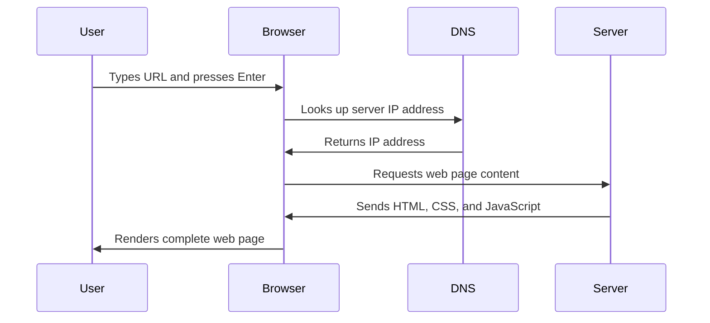

<!--
CO_OP_TRANSLATOR_METADATA:
{
  "original_hash": "33a875c522f237a2026e4653240dfc07",
  "translation_date": "2025-10-24T22:20:49+00:00",
  "source_file": "5-browser-extension/1-about-browsers/README.md",
  "language_code": "ro"
}
-->
# Proiect de Extensie pentru Browser Partea 1: Totul despre Browsere


> Schiță realizată de [Wassim Chegham](https://dev.to/wassimchegham/ever-wondered-what-happens-when-you-type-in-a-url-in-an-address-bar-in-a-browser-3dob)

## Test înainte de lecție

[Test înainte de lecție](https://ff-quizzes.netlify.app/web/quiz/23)

### Introducere

Extensiile pentru browser sunt mini-aplicații care îmbunătățesc experiența de navigare pe web. Așa cum viziunea originală a lui Tim Berners-Lee despre un web interactiv a extins capacitățile internetului dincolo de simpla vizualizare a documentelor, extensiile extind funcționalitățile browserului. De la manageri de parole care îți protejează conturile, la instrumente de selectare a culorilor care ajută designerii să găsească nuanțele perfecte, extensiile rezolvă provocările zilnice ale navigării pe internet.

Înainte de a construi prima ta extensie, să înțelegem cum funcționează browserele. Așa cum Alexander Graham Bell a trebuit să înțeleagă transmisia sunetului înainte de a inventa telefonul, cunoașterea fundamentelor browserului te va ajuta să creezi extensii care se integrează perfect cu sistemele existente ale browserului.

Până la sfârșitul acestei lecții, vei înțelege arhitectura browserului și vei începe să construiești prima ta extensie.

## Înțelegerea Browserelor Web

Un browser web este, în esență, un interpret sofisticat de documente. Când tastezi "google.com" în bara de adrese, browserul efectuează o serie complexă de operațiuni - solicitând conținut de la servere din întreaga lume, apoi analizând și redând acel cod în paginile web interactive pe care le vezi.

Acest proces reflectă modul în care primul browser web, WorldWideWeb, a fost conceput de Tim Berners-Lee în 1990 pentru a face documentele hipertext accesibile tuturor.

✅ **Un pic de istorie**: Primul browser se numea 'WorldWideWeb' și a fost creat de Sir Timothy Berners-Lee în 1990.


> Unele dintre primele browsere, via [Karen McGrane](https://www.slideshare.net/KMcGrane/week-4-ixd-history-personal-computing)

### Cum procesează browserele conținutul web

Procesul dintre introducerea unui URL și vizualizarea unei pagini web implică mai mulți pași coordonați care se desfășoară în câteva secunde:



**Iată ce realizează acest proces:**
- **Traduce** URL-ul ușor de citit de către oameni într-o adresă IP a serverului prin căutarea DNS
- **Stabilește** o conexiune securizată cu serverul web folosind protocoalele HTTP sau HTTPS
- **Solicită** conținutul specific al paginii web de la server
- **Primește** marcaj HTML, stilizare CSS și cod JavaScript de la server
- **Redă** tot conținutul în pagina web interactivă pe care o vezi

### Funcționalități de bază ale browserelor

Browserele moderne oferă numeroase funcționalități pe care dezvoltatorii de extensii le pot valorifica:

| Funcționalitate | Scop | Oportunități pentru extensii |
|------------------|------|-----------------------------|
| **Motor de redare** | Afișează HTML, CSS și JavaScript | Modificarea conținutului, injectarea stilurilor |
| **Motor JavaScript** | Execută codul JavaScript | Scripturi personalizate, interacțiuni cu API-uri |
| **Stocare locală** | Salvează date local | Preferințe ale utilizatorului, date cache |
| **Stack de rețea** | Gestionează cererile web | Monitorizarea cererilor, analiza datelor |
| **Model de securitate** | Protejează utilizatorii de conținut malițios | Filtrarea conținutului, îmbunătățiri de securitate |

**Înțelegerea acestor funcționalități te ajută să:**
- **Identifici** unde extensia ta poate adăuga cea mai mare valoare
- **Alegi** API-urile potrivite ale browserului pentru funcționalitatea extensiei tale
- **Proiectezi** extensii care funcționează eficient cu sistemele browserului
- **Asiguri** că extensia ta respectă cele mai bune practici de securitate ale browserului

### Considerații pentru dezvoltarea extensiilor cross-browser

Browserele diferite implementează standardele cu variații ușoare, similar modului în care limbajele de programare diferite pot gestiona același algoritm în mod diferit. Chrome, Firefox și Safari au fiecare caracteristici unice pe care dezvoltatorii trebuie să le ia în considerare în timpul dezvoltării extensiilor.

> 💡 **Sfat util**: Folosește [caniuse.com](https://www.caniuse.com) pentru a verifica ce tehnologii web sunt suportate de diferite browsere. Acest lucru este de neprețuit atunci când planifici funcționalitățile extensiei tale!

**Considerații cheie pentru dezvoltarea extensiilor:**
- **Testează** extensia ta pe browserele Chrome, Firefox și Edge
- **Adaptează-te** la diferite API-uri și formate de manifest ale extensiilor browserului
- **Gestionează** caracteristicile de performanță și limitările variate
- **Oferă** soluții alternative pentru funcționalitățile specifice browserului care pot să nu fie disponibile

✅ **Analiză Insight**: Poți determina ce browsere preferă utilizatorii tăi instalând pachete de analiză în proiectele tale de dezvoltare web. Aceste date te ajută să prioritizezi ce browsere să susții mai întâi.

## Înțelegerea Extensiilor pentru Browser

Extensiile pentru browser rezolvă provocările comune ale navigării pe web prin adăugarea de funcționalități direct în interfața browserului. În loc să necesite aplicații separate sau fluxuri de lucru complexe, extensiile oferă acces imediat la instrumente și funcții.

Acest concept reflectă modul în care pionierii informaticii timpurii, precum Douglas Engelbart, au imaginat augmentarea capacităților umane cu ajutorul tehnologiei - extensiile îmbunătățesc funcționalitatea de bază a browserului.

**Categorii populare de extensii și beneficiile lor:**
- **Instrumente de productivitate**: Manageri de sarcini, aplicații de luat notițe și trackere de timp care te ajută să rămâi organizat
- **Îmbunătățiri de securitate**: Manageri de parole, blocatori de reclame și instrumente de confidențialitate care îți protejează datele
- **Instrumente pentru dezvoltatori**: Formatare de cod, selectoare de culori și utilități de depanare care simplifică dezvoltarea
- **Îmbunătățirea conținutului**: Moduri de citire, descărcătoare de videoclipuri și instrumente de captură de ecran care îmbunătățesc experiența ta pe web

✅ **Întrebare de reflecție**: Care sunt extensiile tale preferate pentru browser? Ce sarcini specifice îndeplinesc și cum îți îmbunătățesc experiența de navigare?

## Instalarea și Gestionarea Extensiilor

Înțelegerea procesului de instalare a extensiilor te ajută să anticipezi experiența utilizatorului atunci când oamenii îți instalează extensia. Procesul de instalare este standardizat în browserele moderne, cu variații minore în designul interfeței.


> **Important**: Asigură-te că activezi modul de dezvoltator și permiți extensiile din alte magazine atunci când testezi propriile extensii.

### Procesul de instalare a extensiilor în dezvoltare

Când dezvolți și testezi propriile extensii, urmează acest flux de lucru:

```bash
# Step 1: Build your extension
npm run build
```

**Ce realizează această comandă:**
- **Compilează** codul sursă în fișiere pregătite pentru browser
- **Grupuri** modulele JavaScript în pachete optimizate
- **Generează** fișierele finale ale extensiei în folderul `/dist`
- **Pregătește** extensia pentru instalare și testare

**Pasul 2: Navighează la Extensiile Browserului**
1. **Deschide** pagina de gestionare a extensiilor browserului tău
2. **Apasă** butonul "Setări și altele" (pictograma `...`) din colțul din dreapta sus
3. **Selectează** "Extensii" din meniul derulant

**Pasul 3: Încarcă Extensia Ta**
- **Pentru instalări noi**: Alege `load unpacked` și selectează folderul `/dist`
- **Pentru actualizări**: Apasă `reload` lângă extensia deja instalată
- **Pentru testare**: Activează "Modul de dezvoltator" pentru a accesa funcții suplimentare de depanare

### Instalarea Extensiilor în Producție

> ✅ **Notă**: Aceste instrucțiuni de dezvoltare sunt specifice extensiilor pe care le construiești singur. Pentru a instala extensii publicate, vizitează magazinele oficiale de extensii ale browserelor, cum ar fi [Microsoft Edge Add-ons store](https://microsoftedge.microsoft.com/addons/Microsoft-Edge-Extensions-Home).

**Înțelegerea diferenței:**
- **Instalările de dezvoltare** îți permit să testezi extensii nepublicate în timpul dezvoltării
- **Instalările din magazin** oferă extensii publicate, verificate, cu actualizări automate
- **Instalarea manuală** permite instalarea extensiilor din afara magazinelor oficiale (necesită modul de dezvoltator)

## Construirea Extensiei pentru Amprenta de Carbon

Vom crea o extensie pentru browser care afișează amprenta de carbon a utilizării energiei din regiunea ta. Acest proiect demonstrează concepte esențiale de dezvoltare a extensiilor, creând în același timp un instrument practic pentru conștientizarea mediului.

Această abordare urmează principiul "învățării prin practică", care s-a dovedit eficient încă de la teoriile educaționale ale lui John Dewey - combinând abilități tehnice cu aplicații reale semnificative.

### Cerințele Proiectului

Înainte de a începe dezvoltarea, să adunăm resursele și dependențele necesare:

**Acces la API necesar:**
- **[Cheie API CO2 Signal](https://www.co2signal.com/)**: Introdu adresa ta de email pentru a primi o cheie API gratuită
- **[Codul regiunii](http://api.electricitymap.org/v3/zones)**: Găsește codul regiunii tale folosind [Electricity Map](https://www.electricitymap.org/map) (de exemplu, Boston folosește 'US-NEISO')

**Instrumente de Dezvoltare:**
- **[Node.js și NPM](https://www.npmjs.com)**: Instrument de gestionare a pachetelor pentru instalarea dependențelor proiectului
- **[Cod de început](../../../../5-browser-extension/start)**: Descarcă folderul `start` pentru a începe dezvoltarea

✅ **Află mai multe**: Îmbunătățește-ți abilitățile de gestionare a pachetelor cu acest [modul cuprinzător de învățare](https://docs.microsoft.com/learn/modules/create-nodejs-project-dependencies/?WT.mc_id=academic-77807-sagibbon)

### Înțelegerea Structurii Proiectului

Înțelegerea structurii proiectului ajută la organizarea eficientă a muncii de dezvoltare. Așa cum Biblioteca din Alexandria a fost organizată pentru o recuperare ușoară a cunoștințelor, o bază de cod bine structurată face dezvoltarea mai eficientă:

```
project-root/
├── dist/                    # Built extension files
│   ├── manifest.json        # Extension configuration
│   ├── index.html           # User interface markup
│   ├── background.js        # Background script functionality
│   └── main.js              # Compiled JavaScript bundle
└── src/                     # Source development files
    └── index.js             # Your main JavaScript code
```

**Ce realizează fiecare fișier:**
- **`manifest.json`**: **Definește** metadatele extensiei, permisiunile și punctele de intrare
- **`index.html`**: **Creează** interfața utilizatorului care apare când utilizatorii fac clic pe extensia ta
- **`background.js`**: **Gestionează** sarcinile de fundal și ascultătorii de evenimente ale browserului
- **`main.js`**: **Conține** codul JavaScript final grupat după procesul de construire
- **`src/index.js`**: **Conține** codul principal de dezvoltare care este compilat în `main.js`

> 💡 **Sfat de organizare**: Stochează cheia API și codul regiunii într-o notă sigură pentru referință ușoară în timpul dezvoltării. Vei avea nevoie de aceste valori pentru a testa funcționalitatea extensiei tale.

✅ **Notă de securitate**: Nu comite niciodată chei API sau credențiale sensibile în depozitul tău de cod. Îți vom arăta cum să le gestionezi în siguranță în pașii următori.

## Crearea Interfeței Extensiei

Acum vom construi componentele interfeței utilizatorului. Extensia folosește o abordare cu două ecrane: un ecran de configurare pentru configurarea inițială și un ecran de rezultate pentru afișarea datelor.

Aceasta urmează principiul dezvăluirii progresive utilizat în designul interfeței încă din primele zile ale informaticii - dezvăluirea informațiilor și opțiunilor într-o secvență logică pentru a evita copleșirea utilizatorilor.

### Prezentare generală a vizualizărilor extensiei

**Vizualizarea de configurare** - Configurarea utilizatorului pentru prima dată:


**Vizualizarea rezultatelor** - Afișarea datelor despre amprenta de carbon:


### Construirea Formularului de Configurare

Formularul de configurare colectează datele de configurare ale utilizatorului în timpul utilizării inițiale. Odată configurate, aceste informații persistă în stocarea browserului pentru sesiunile viitoare.

În fișierul `/dist/index.html`, adaugă această structură de formular:

```html
<form class="form-data" autocomplete="on">
    <div>
        <h2>New? Add your Information</h2>
    </div>
    <div>
        <label for="region">Region Name</label>
        <input type="text" id="region" required class="region-name" />
    </div>
    <div>
        <label for="api">Your API Key from tmrow</label>
        <input type="text" id="api" required class="api-key" />
    </div>
    <button class="search-btn">Submit</button>
</form>
```

**Ce realizează acest formular:**
- **Creează** o structură semantică de formular cu etichete și asocieri de intrare corespunzătoare
- **Activează** funcționalitatea de completare automată a browserului pentru o experiență îmbunătățită a utilizatorului
- **Solicită** completarea ambelor câmpuri înainte de trimitere folosind atributul `required`
- **Organizează** intrările cu nume de clase descriptive pentru o stilizare ușoară și o țintire în JavaScript
- **Oferă** instrucțiuni clare pentru utilizatorii care configurează extensia pentru prima dată

### Construirea Afișajului Rezultatelor

În continuare, creează zona de rezultate care va afișa datele despre amprenta de carbon. Adaugă acest HTML sub formular:

```html
<div class="result">
    <div class="loading">loading...</div>
    <div class="errors"></div>
    <div class="data"></div>
    <div class="result-container">
        <p><strong>Region: </strong><span class="my-region"></span></p>
        <p><strong>Carbon Usage: </strong><span class="carbon-usage"></span></p>
        <p><strong>Fossil Fuel Percentage: </strong><span class="fossil-fuel"></span></p>
    </div>
    <button class="clear-btn">Change region</button>
</div>
```

**Ce oferă această structură:**
- **`loading`**: **Afișează** un mesaj de încărcare în timp ce datele API sunt preluate
- **`errors`**: **Arată** mesaje de eroare dacă apelurile API eșuează sau datele sunt invalide
- **`data`**: **Conține** date brute pentru depanare în timpul dezvoltării
- **`result-container`**: **Prezintă** informații formatate despre amprenta de carbon utilizatorilor
- **`clear-btn`**: **Permite** utilizatorilor să își schimbe regiunea și să reconfigureze extensia

### Configurarea Procesului de Construire

Acum să instalăm dependențele proiectului și să testăm procesul de construire:

```bash
npm install
```

**Ce realizează acest proces de instalare:**
- **Descarcă** Webpack și alte dependențe de dezvoltare specificate în `package.json`
- **Configurează** lanțul de instrumente de construire pentru compilarea JavaScript modern
- **Pregătește** mediul de dezvoltare pentru construirea și testarea extensiei
- **Activează** gruparea codului, optimizarea și caracteristicile de compatibilitate cross-browser

> 💡 **Informații despre procesul de construire**: Webpack grupează codul sursă din `/src/index.js` în `/dist/main.js`. Acest proces optimizează codul pentru producție și asigură compatibilitatea
**Descriere:** Îmbunătățiți extensia de browser prin adăugarea funcțiilor de validare a formularelor și feedback pentru utilizatori, pentru a îmbunătăți experiența utilizatorilor atunci când introduc chei API și coduri de regiune.

**Sarcină:** Creați funcții de validare în JavaScript care verifică dacă câmpul pentru cheia API conține cel puțin 20 de caractere și dacă codul de regiune respectă formatul corect (cum ar fi 'US-NEISO'). Adăugați feedback vizual prin schimbarea culorii bordurii câmpurilor de input: verde pentru inputuri valide și roșu pentru cele invalide. De asemenea, adăugați o funcție de comutare pentru a afișa/ascunde cheia API din motive de securitate.

Aflați mai multe despre [modul agent](https://code.visualstudio.com/blogs/2025/02/24/introducing-copilot-agent-mode) aici.

## 🚀 Provocare

Aruncați o privire la un magazin de extensii pentru browser și instalați una în browserul dvs. Puteți examina fișierele acesteia în moduri interesante. Ce descoperiți?

## Test de evaluare după lecție

[Test de evaluare după lecție](https://ff-quizzes.netlify.app/web/quiz/24)

## Recapitulare și Studiu Individual

În această lecție ați învățat puțin despre istoria browserului web; profitați de această oportunitate pentru a afla cum au imaginat inventatorii World Wide Web utilizarea acestuia, citind mai multe despre istoria sa. Unele site-uri utile includ:

[Istoria browserelor web](https://www.mozilla.org/firefox/browsers/browser-history/)

[Istoria web-ului](https://webfoundation.org/about/vision/history-of-the-web/)

[Un interviu cu Tim Berners-Lee](https://www.theguardian.com/technology/2019/mar/12/tim-berners-lee-on-30-years-of-the-web-if-we-dream-a-little-we-can-get-the-web-we-want)

## Temă 

[Restilizați extensia dvs.](assignment.md)

---

**Declinare de responsabilitate**:  
Acest document a fost tradus folosind serviciul de traducere AI [Co-op Translator](https://github.com/Azure/co-op-translator). Deși ne străduim să asigurăm acuratețea, vă rugăm să fiți conștienți că traducerile automate pot conține erori sau inexactități. Documentul original în limba sa maternă ar trebui considerat sursa autoritară. Pentru informații critice, se recomandă traducerea profesională realizată de oameni. Nu ne asumăm responsabilitatea pentru eventualele neînțelegeri sau interpretări greșite care pot apărea din utilizarea acestei traduceri.