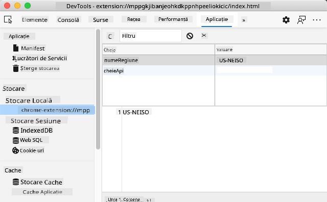

<!--
CO_OP_TRANSLATOR_METADATA:
{
  "original_hash": "e10f168beac4e7b05e30e0eb5c92bf11",
  "translation_date": "2025-08-28T07:50:54+00:00",
  "source_file": "5-browser-extension/2-forms-browsers-local-storage/README.md",
  "language_code": "ro"
}
-->
# Proiect Extensie de Browser Partea 2: Apelează un API, folosește Local Storage

## Chestionar Pre-Lecție

[Chestionar pre-lecție](https://ff-quizzes.netlify.app/web/quiz/25)

### Introducere

În această lecție, vei apela un API prin trimiterea formularului extensiei tale de browser și vei afișa rezultatele în extensie. În plus, vei învăța cum să stochezi date în local storage-ul browserului pentru referințe și utilizări viitoare.

✅ Urmează segmentele numerotate din fișierele corespunzătoare pentru a ști unde să plasezi codul tău.

### Configurează elementele pentru manipulare în extensie:

Până acum, ai construit HTML-ul pentru formular și `<div>`-ul de rezultate al extensiei tale de browser. De acum înainte, va trebui să lucrezi în fișierul `/src/index.js` și să construiești extensia pas cu pas. Consultă [lecția anterioară](../1-about-browsers/README.md) pentru a-ți configura proiectul și pentru procesul de build.

Lucrând în fișierul `index.js`, începe prin a crea câteva variabile `const` pentru a reține valorile asociate diferitelor câmpuri:

```JavaScript
// form fields
const form = document.querySelector('.form-data');
const region = document.querySelector('.region-name');
const apiKey = document.querySelector('.api-key');

// results
const errors = document.querySelector('.errors');
const loading = document.querySelector('.loading');
const results = document.querySelector('.result-container');
const usage = document.querySelector('.carbon-usage');
const fossilfuel = document.querySelector('.fossil-fuel');
const myregion = document.querySelector('.my-region');
const clearBtn = document.querySelector('.clear-btn');
```

Toate aceste câmpuri sunt referite prin clasa lor CSS, așa cum le-ai configurat în HTML în lecția anterioară.

### Adaugă ascultători de evenimente

În continuare, adaugă ascultători de evenimente pentru formular și butonul de resetare care resetează formularul, astfel încât, dacă un utilizator trimite formularul sau apasă pe butonul de resetare, să se întâmple ceva. Adaugă și apelul pentru inițializarea aplicației la finalul fișierului:

```JavaScript
form.addEventListener('submit', (e) => handleSubmit(e));
clearBtn.addEventListener('click', (e) => reset(e));
init();
```

✅ Observă prescurtarea folosită pentru a asculta un eveniment de submit sau click și cum evenimentul este transmis funcțiilor handleSubmit sau reset. Poți scrie echivalentul acestei prescurtări într-un format mai lung? Care variantă îți place mai mult?

### Construiește funcțiile init() și reset():

Acum vei construi funcția care inițializează extensia, numită init():

```JavaScript
function init() {
	//if anything is in localStorage, pick it up
	const storedApiKey = localStorage.getItem('apiKey');
	const storedRegion = localStorage.getItem('regionName');

	//set icon to be generic green
	//todo

	if (storedApiKey === null || storedRegion === null) {
		//if we don't have the keys, show the form
		form.style.display = 'block';
		results.style.display = 'none';
		loading.style.display = 'none';
		clearBtn.style.display = 'none';
		errors.textContent = '';
	} else {
        //if we have saved keys/regions in localStorage, show results when they load
        displayCarbonUsage(storedApiKey, storedRegion);
		results.style.display = 'none';
		form.style.display = 'none';
		clearBtn.style.display = 'block';
	}
};

function reset(e) {
	e.preventDefault();
	//clear local storage for region only
	localStorage.removeItem('regionName');
	init();
}

```

În această funcție există o logică interesantă. Citind-o, poți vedea ce se întâmplă?

- se setează două `const` pentru a verifica dacă utilizatorul a stocat un APIKey și un cod de regiune în local storage.
- dacă oricare dintre acestea este null, afișează formularul schimbând stilul său pentru a fi afișat ca 'block'.
- ascunde zona de rezultate, mesajul de încărcare și butonul clearBtn și setează orice text de eroare ca fiind gol.
- dacă există o cheie și o regiune, începe o rutină pentru:
  - a apela API-ul pentru a obține date despre utilizarea carbonului
  - a ascunde zona de rezultate
  - a ascunde formularul
  - a afișa butonul de resetare

Înainte de a merge mai departe, este util să înveți despre un concept foarte important disponibil în browsere: [LocalStorage](https://developer.mozilla.org/docs/Web/API/Window/localStorage). LocalStorage este o modalitate utilă de a stoca șiruri de caractere în browser sub forma unei perechi `cheie-valoare`. Acest tip de stocare web poate fi manipulat prin JavaScript pentru a gestiona datele în browser. LocalStorage nu expiră, în timp ce SessionStorage, un alt tip de stocare web, este șters când browserul este închis. Diferitele tipuri de stocare au avantaje și dezavantaje în utilizarea lor.

> Notă - extensia ta de browser are propriul local storage; fereastra principală a browserului este o instanță diferită și se comportă separat.

Setezi valoarea APIKey ca fiind un șir de caractere, de exemplu, și poți vedea că este setată în Edge prin "inspectarea" unei pagini web (poți face clic dreapta pe un browser pentru a inspecta) și mergând la fila Applications pentru a vedea stocarea.



✅ Gândește-te la situații în care NU ai dori să stochezi anumite date în LocalStorage. În general, plasarea cheilor API în LocalStorage este o idee proastă! Poți vedea de ce? În cazul nostru, deoarece aplicația noastră este pur educativă și nu va fi publicată într-un magazin de aplicații, vom folosi această metodă.

Observă că folosești Web API pentru a manipula LocalStorage, fie prin `getItem()`, `setItem()`, sau `removeItem()`. Este larg suportat în browsere.

Înainte de a construi funcția `displayCarbonUsage()` care este apelată în `init()`, să construim funcționalitatea pentru gestionarea trimiterii inițiale a formularului.

### Gestionează trimiterea formularului

Creează o funcție numită `handleSubmit` care acceptă un argument de eveniment `(e)`. Oprește propagarea evenimentului (în acest caz, dorim să oprim browserul să se reîmprospăteze) și apelează o nouă funcție, `setUpUser`, transmițând argumentele `apiKey.value` și `region.value`. În acest fel, folosești cele două valori care sunt aduse prin formularul inițial atunci când câmpurile corespunzătoare sunt completate.

```JavaScript
function handleSubmit(e) {
	e.preventDefault();
	setUpUser(apiKey.value, region.value);
}
```

✅ Reîmprospătează-ți memoria - HTML-ul pe care l-ai configurat în lecția anterioară are două câmpuri de intrare ale căror `valori` sunt capturate prin `const`-urile pe care le-ai configurat la începutul fișierului, și ambele sunt `required`, astfel încât browserul oprește utilizatorii să introducă valori nule.

### Configurează utilizatorul

Trecând la funcția `setUpUser`, aici setezi valorile local storage pentru apiKey și regionName. Adaugă o nouă funcție:

```JavaScript
function setUpUser(apiKey, regionName) {
	localStorage.setItem('apiKey', apiKey);
	localStorage.setItem('regionName', regionName);
	loading.style.display = 'block';
	errors.textContent = '';
	clearBtn.style.display = 'block';
	//make initial call
	displayCarbonUsage(apiKey, regionName);
}
```

Această funcție setează un mesaj de încărcare pentru a fi afișat în timp ce API-ul este apelat. În acest moment, ai ajuns la crearea celei mai importante funcții ale acestei extensii de browser!

### Afișează utilizarea carbonului

În cele din urmă, este timpul să interoghezi API-ul!

Înainte de a merge mai departe, ar trebui să discutăm despre API-uri. API-urile, sau [Interfețele de Programare a Aplicațiilor](https://www.webopedia.com/TERM/A/API.html), sunt un element critic în trusa de instrumente a unui dezvoltator web. Ele oferă modalități standard pentru programe de a interacționa și de a comunica între ele. De exemplu, dacă construiești un site web care trebuie să interogheze o bază de date, cineva ar putea să fi creat un API pe care să-l folosești. Deși există multe tipuri de API-uri, unul dintre cele mai populare este un [API REST](https://www.smashingmagazine.com/2018/01/understanding-using-rest-api/).

✅ Termenul 'REST' înseamnă 'Transfer de Stare Reprezentativă' și implică utilizarea unor URL-uri configurate diferit pentru a obține date. Fă puțină cercetare despre diferitele tipuri de API-uri disponibile pentru dezvoltatori. Ce format ți se pare atractiv?

Există lucruri importante de remarcat despre această funcție. În primul rând, observă cuvântul cheie [`async`](https://developer.mozilla.org/docs/Web/JavaScript/Reference/Statements/async_function). Scrierea funcțiilor astfel încât să ruleze asincron înseamnă că acestea așteaptă finalizarea unei acțiuni, cum ar fi returnarea datelor, înainte de a continua.

Iată un videoclip rapid despre `async`:

[](https://youtube.com/watch?v=YwmlRkrxvkk "Async și Await pentru gestionarea promisiunilor")

> 🎥 Fă clic pe imaginea de mai sus pentru un videoclip despre async/await.

Creează o nouă funcție pentru a interoga API-ul C02Signal:

```JavaScript
import axios from '../node_modules/axios';

async function displayCarbonUsage(apiKey, region) {
	try {
		await axios
			.get('https://api.co2signal.com/v1/latest', {
				params: {
					countryCode: region,
				},
				headers: {
					'auth-token': apiKey,
				},
			})
			.then((response) => {
				let CO2 = Math.floor(response.data.data.carbonIntensity);

				//calculateColor(CO2);

				loading.style.display = 'none';
				form.style.display = 'none';
				myregion.textContent = region;
				usage.textContent =
					Math.round(response.data.data.carbonIntensity) + ' grams (grams C02 emitted per kilowatt hour)';
				fossilfuel.textContent =
					response.data.data.fossilFuelPercentage.toFixed(2) +
					'% (percentage of fossil fuels used to generate electricity)';
				results.style.display = 'block';
			});
	} catch (error) {
		console.log(error);
		loading.style.display = 'none';
		results.style.display = 'none';
		errors.textContent = 'Sorry, we have no data for the region you have requested.';
	}
}
```

Aceasta este o funcție mare. Ce se întâmplă aici?

- urmând cele mai bune practici, folosești cuvântul cheie `async` pentru a face ca această funcție să se comporte asincron. Funcția conține un bloc `try/catch`, deoarece va returna o promisiune atunci când API-ul returnează date. Deoarece nu ai control asupra vitezei cu care API-ul va răspunde (s-ar putea să nu răspundă deloc!), trebuie să gestionezi această incertitudine apelându-l asincron.
- interoghezi API-ul co2signal pentru a obține datele regiunii tale, folosind cheia ta API. Pentru a folosi acea cheie, trebuie să folosești un tip de autentificare în parametrii antetului.
- odată ce API-ul răspunde, atribui diferite elemente ale datelor sale de răspuns părților ecranului pe care le-ai configurat pentru a afișa aceste date.
- dacă există o eroare sau dacă nu există niciun rezultat, afișezi un mesaj de eroare.

✅ Utilizarea modelelor de programare asincronă este un alt instrument foarte util în trusa ta de instrumente. Citește [despre diferitele moduri](https://developer.mozilla.org/docs/Web/JavaScript/Reference/Statements/async_function) în care poți configura acest tip de cod.

Felicitări! Dacă construiești extensia (`npm run build`) și o reîmprospătezi în panoul extensiilor, ai o extensie funcțională! Singurul lucru care nu funcționează este pictograma, iar acest lucru îl vei rezolva în lecția următoare.

---

## 🚀 Provocare

Am discutat despre mai multe tipuri de API până acum în aceste lecții. Alege un API web și cercetează în detaliu ce oferă. De exemplu, aruncă o privire la API-urile disponibile în browsere, cum ar fi [HTML Drag and Drop API](https://developer.mozilla.org/docs/Web/API/HTML_Drag_and_Drop_API). Ce face ca un API să fie grozav, în opinia ta?

## Chestionar Post-Lecție

[Chestionar post-lecție](https://ff-quizzes.netlify.app/web/quiz/26)

## Recapitulare și Studiu Individual

Ai învățat despre LocalStorage și API-uri în această lecție, ambele foarte utile pentru un dezvoltator web profesionist. Poți să te gândești cum funcționează aceste două lucruri împreună? Gândește-te cum ai arhitectura un site web care ar stoca elemente pentru a fi utilizate de un API.

## Temă

[Adoptă un API](assignment.md)

---

**Declinare de responsabilitate**:  
Acest document a fost tradus folosind serviciul de traducere AI [Co-op Translator](https://github.com/Azure/co-op-translator). Deși ne străduim să asigurăm acuratețea, vă rugăm să fiți conștienți că traducerile automate pot conține erori sau inexactități. Documentul original în limba sa natală ar trebui considerat sursa autoritară. Pentru informații critice, se recomandă traducerea profesională realizată de un specialist uman. Nu ne asumăm responsabilitatea pentru eventualele neînțelegeri sau interpretări greșite care pot apărea din utilizarea acestei traduceri.