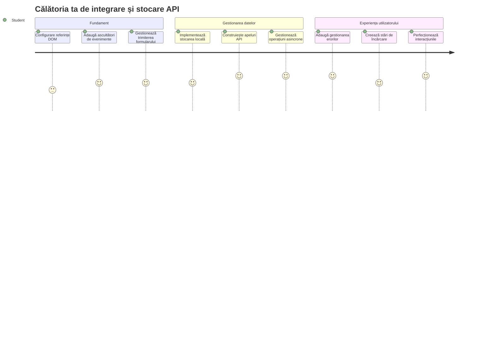
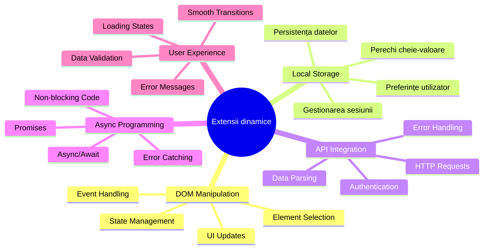
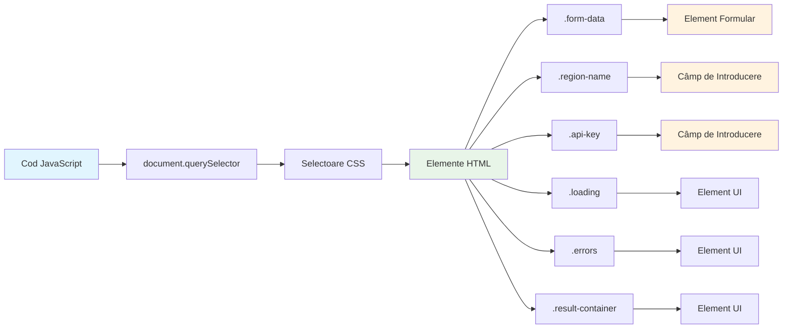
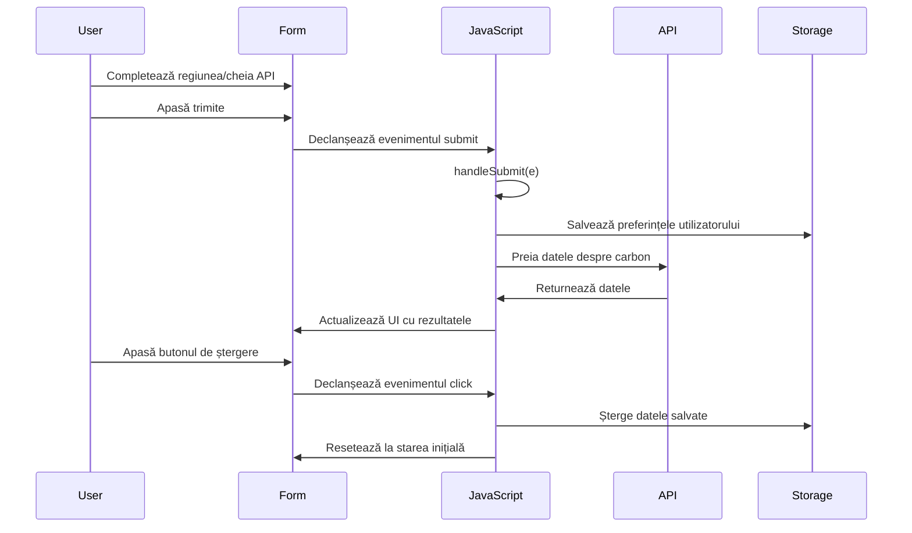
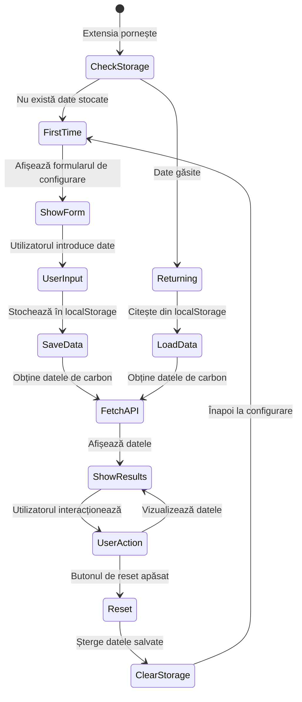
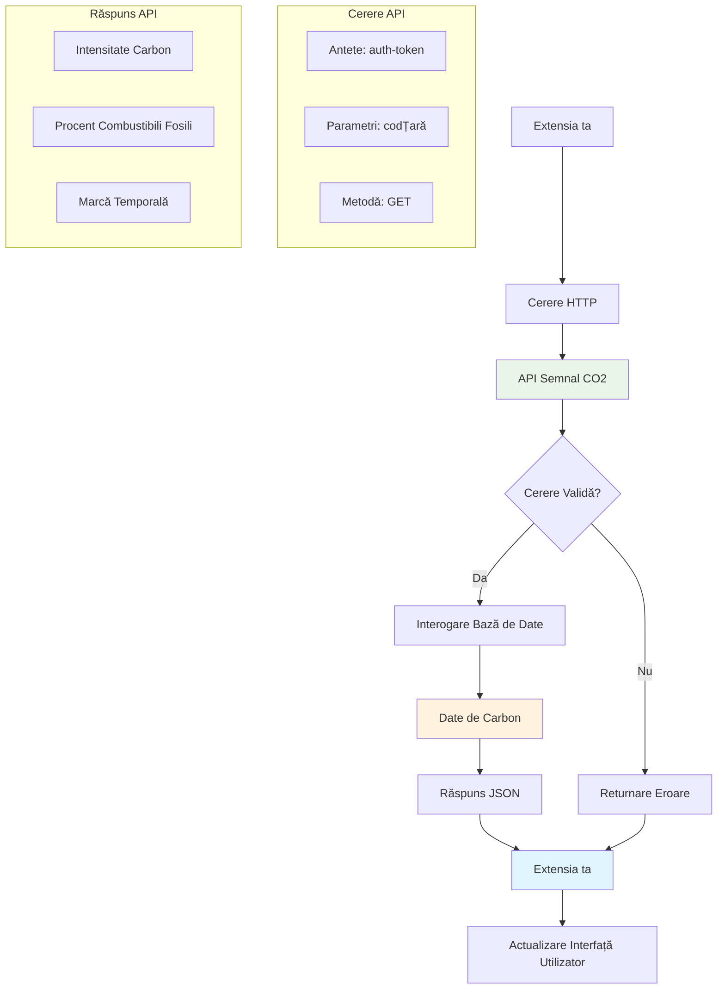
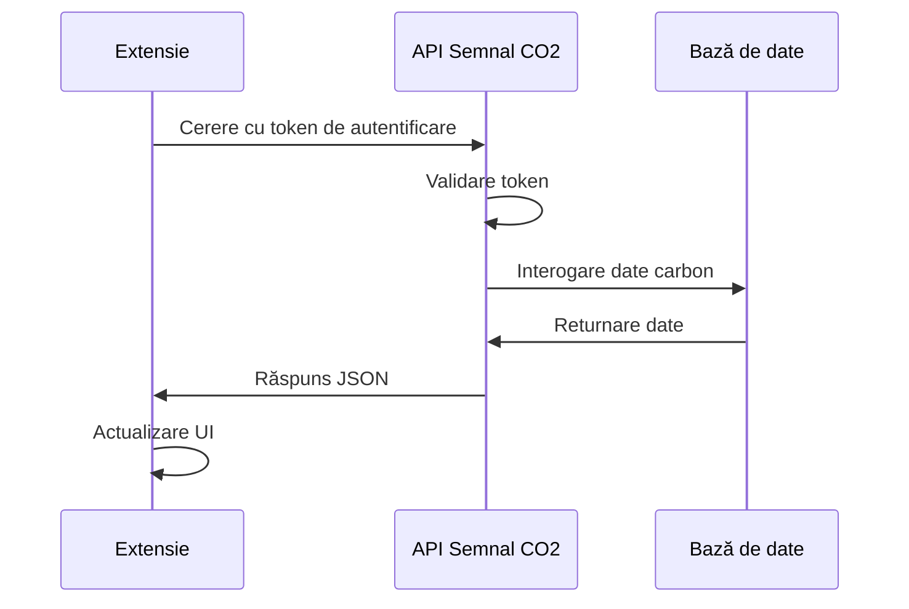
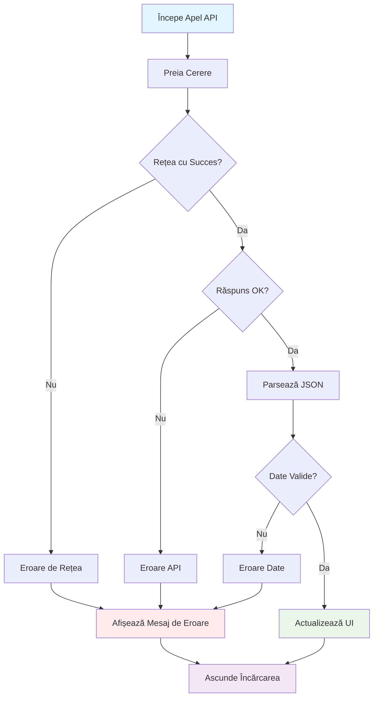
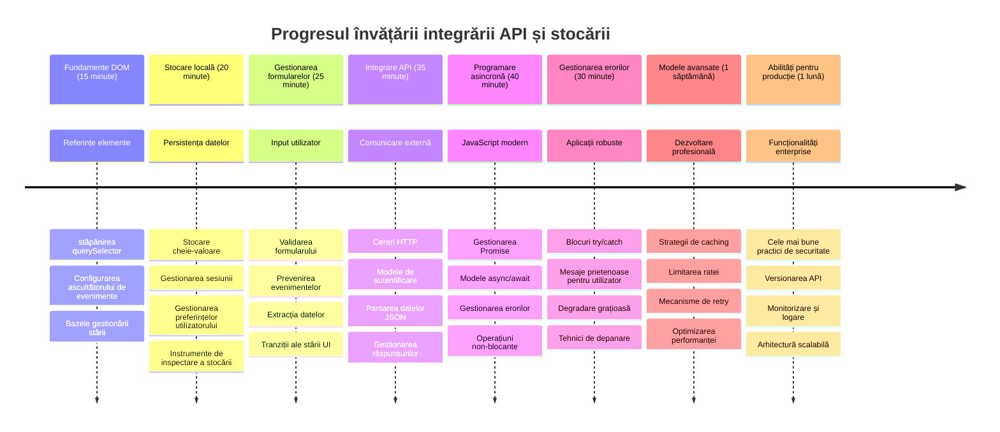

<!--
CO_OP_TRANSLATOR_METADATA:
{
  "original_hash": "2b6203a48c48d8234e0948353b47d84e",
  "translation_date": "2026-01-07T05:51:39+00:00",
  "source_file": "5-browser-extension/2-forms-browsers-local-storage/README.md",
  "language_code": "ro"
}
-->
# Proiect Extensie Browser Partea 2: Apelează un API, folosește Stocarea Locală


## Chestionar Pre-Lecție

[Pre-lecture quiz](https://ff-quizzes.netlify.app/web/quiz/25)

## Introducere

Ți-ai amintit extensia de browser pe care ai început să o construiești? Acum ai un formular arătos, dar este practic static. Astăzi îi vom aduce viață conectând-o la date reale și oferindu-i memorie.

Gândește-te la calculatoarele de la centrul de comandă al misiunii Apollo – nu afișau doar informații fixe. Comunicau constant cu navele spațiale, primeau date telemetrice și își aminteau parametrii critici ai misiunii. Acesta este tipul de comportament dinamic pe care îl construim azi. Extensia ta va accesa internetul, va prelua date reale despre mediu și își va aminti setările tale pentru următoarea dată.

Integrarea API poate părea complicată, dar este de fapt doar o modalitate de a învăța codul tău să comunice cu alte servicii. Indiferent dacă preiei date meteo, feed-uri din social media sau informații despre amprenta de carbon cum vom face azi, totul ține de stabilirea acestor conexiuni digitale. Vom explora și cum browserele pot păstra informații – similar cu modul în care bibliotecile au folosit cataloage cu fișe pentru a reține unde se află cărțile.

La finalul acestei lecții, vei avea o extensie de browser care preia date reale, stochează preferințele utilizatorului și oferă o experiență fluidă. Hai să începem!


✅ Urmează segmentele numerotate în fișierele corespunzătoare pentru a ști unde să introduci codul

## Configurarea elementelor de manipulat în extensie

Înainte ca JavaScript-ul tău să poată manipula interfața, are nevoie de referințe către elemente HTML specifice. Gândește-te la un telescop care trebuie îndreptat spre anumite stele – înainte ca Galileo să poată studia lunile lui Jupiter, trebuia să găsească și să focalizeze asupra planetei Jupiter.

În fișierul tău `index.js`, vom crea variabile `const` care capturează referințe către fiecare element important al formularului. Acest lucru este similar cu modul în care oamenii de știință își etichetează echipamentul – în loc să caute prin tot laboratorul de fiecare dată, pot accesa direct ceea ce au nevoie.


```javascript
// câmpuri de formular
const form = document.querySelector('.form-data');
const region = document.querySelector('.region-name');
const apiKey = document.querySelector('.api-key');

// rezultate
const errors = document.querySelector('.errors');
const loading = document.querySelector('.loading');
const results = document.querySelector('.result-container');
const usage = document.querySelector('.carbon-usage');
const fossilfuel = document.querySelector('.fossil-fuel');
const myregion = document.querySelector('.my-region');
const clearBtn = document.querySelector('.clear-btn');
```

**Iată ce face acest cod:**
- **Capturează** elementele formularului folosind `document.querySelector()` cu selectori CSS de clasă
- **Creează** referințe către câmpurile de input pentru numele regiunii și cheia API
- **Stabilește** conexiuni către elementele de afișare a rezultatelor pentru datele despre consumul de carbon
- **Configurează** accesul la elemente UI precum indicatori de încărcare și mesaje de eroare
- **Stochează** fiecare referință într-o variabilă `const` pentru a le reutiliza ușor în tot codul tău

## Adaugă ascultători de evenimente

Acum vom face extensia să răspundă la acțiunile utilizatorului. Ascultătorii de evenimente sunt modalitatea codului tău de a monitoriza interacțiunile utilizatorilor. Gândește-te la ei ca la operatorii din vechile centrale telefonice – ascultau apelurile primite și conectau circuitele potrivite când cineva voia să facă o legătură.


```javascript
form.addEventListener('submit', (e) => handleSubmit(e));
clearBtn.addEventListener('click', (e) => reset(e));
init();
```

**Conceptul acestora:**
- **Atașează** un ascultător de `submit` pentru formular care se declanșează când utilizatorii apasă Enter sau click pe submit
- **Leagă** un ascultător de `click` pe butonul de reset pentru a reseta formularul
- **Transmite** obiectul eveniment `(e)` funcțiilor handler pentru control suplimentar
- **Apelează** funcția `init()` imediat pentru a configura starea inițială a extensiei tale

✅ Observă sintaxa prescurtată a funcției săgeată folosită aici. Această abordare modernă JavaScript este mai curată decât expresiile tradiționale, deși ambele funcționează bine!

### 🔄 **Verificare Pedagogică**
**Înțelegerea Manipulării Evenimentelor**: Înainte să treci la inițializare, asigură-te că poți:
- ✅ Explica cum `addEventListener` conectează acțiunile utilizatorului cu funcțiile JavaScript
- ✅ Înțelege de ce transmitem obiectul eveniment `(e)` către funcțiile handler
- ✅ Recunoaște diferența dintre evenimentele `submit` și `click`
- ✅ Descrie când se rulează funcția `init()` și de ce

**Auto-test rapid**: Ce s-ar întâmpla dacă ai uita `e.preventDefault()` la trimiterea formularului?
*Răspuns: Pagina s-ar reîncărca, pierzând toate stările JavaScript și întrerupând experiența utilizatorului*

## Construiește funcțiile de inițializare și resetare

Să creăm logica de inițializare pentru extensia ta. Funcția `init()` este ca un sistem de navigație al unei nave care verifică instrumentele – determină starea curentă și ajustează interfața în consecință. Verifică dacă cineva a folosit extensia ta anterior și încarcă setările anterioare.

Funcția `reset()` oferă utilizatorilor un început proaspăt – similar cu modul în care oamenii de știință își resetează instrumentele între experimente pentru a avea date curate.

```javascript
function init() {
	// Verifică dacă utilizatorul a salvat anterior credențiale API
	const storedApiKey = localStorage.getItem('apiKey');
	const storedRegion = localStorage.getItem('regionName');

	// Setează pictograma extensiei pe verde generic (simbol pentru lecțiile viitoare)
	// TODO: Implementează actualizarea pictogramei în lecția următoare

	if (storedApiKey === null || storedRegion === null) {
		// Utilizator pentru prima dată: afișează formularul de configurare
		form.style.display = 'block';
		results.style.display = 'none';
		loading.style.display = 'none';
		clearBtn.style.display = 'none';
		errors.textContent = '';
	} else {
		// Utilizator revenit: încarcă automat datele salvate
		displayCarbonUsage(storedApiKey, storedRegion);
		results.style.display = 'none';
		form.style.display = 'none';
		clearBtn.style.display = 'block';
	}
}

function reset(e) {
	e.preventDefault();
	// Șterge regiunea stocată pentru a permite utilizatorului să aleagă o locație nouă
	localStorage.removeItem('regionName');
	// Repornește procesul de inițializare
	init();
}
```

**Analiză a ceea ce se întâmplă aici:**
- **Recuperează** cheia API și regiunea stocate din stocarea locală a browserului
- **Verifică** dacă este un utilizator nou (fără credențiale stocate) sau un utilizator revenit
- **Afișează** formularul de configurare pentru utilizatorii noi și ascunde alte elemente UI
- **Încarcă** automat date salvate pentru utilizatorii reveniți și afișează opțiunea de resetare
- **Gestionează** starea interfeței utilizator pe baza datelor disponibile

**Concepte cheie despre Stocarea Locală:**
- **Persistă** date între sesiuni diferite ale browserului (spre deosebire de stocarea de sesiune)
- **Stochează** date sub formă de perechi cheie-valoare folosind `getItem()` și `setItem()`
- **Returnează** `null` când nu există date pentru o cheie dată
- **Oferă** o metodă simplă de a reține preferințele și setările utilizatorului

> 💡 **Înțelegerea Stocării în Browser**: [LocalStorage](https://developer.mozilla.org/docs/Web/API/Window/localStorage) este ca și cum ai oferi extensiei tale o memorie persistentă. Gândește-te cum Biblioteca din Alexandria stoca suluri - informațiile rămâneau disponibile chiar și când cercetătorii plecau și reveneau.
>
> **Caracteristici importante:**
> - **Persistă** date chiar și după închiderea browserului
> - **Supraviețuiește** restartului computerului și prăbușirilor browserului
> - **Oferă** spațiu semnificativ pentru preferințele utilizatorului
> - **Asigură** acces instant fără întârzieri de rețea

> **Notă Importantă**: Extensia ta de browser are propria stocare locală izolată, separată de paginile web obișnuite. Aceasta asigură securitate și previne conflictele cu alte site-uri.

Poți vedea datele stocate deschizând uneltele pentru dezvoltatori ale browserului (F12), navigând la fila **Application** și extinzând secțiunea **Local Storage**.




> ⚠️ **Considerație de Securitate**: În aplicațiile de producție, stocarea cheilor API în LocalStorage poate reprezenta un risc de securitate, deoarece JavaScript poate accesa aceste date. Pentru scopuri educaționale, această metodă este acceptabilă, dar aplicațiile reale ar trebui să folosească stocare sigură pe server pentru credențiale sensibile.

## Gestionează trimiterea formularului

Acum vom gestiona ce se întâmplă când cineva trimite formularul tău. Implicit, browserele reîncarcă pagina la trimiterea formularelor, dar vom intercepta acest comportament pentru a crea o experiență mai fluidă.

Această abordare imită modul în care centrul de comandă al misiunii gestionează comunicațiile cu navele spațiale – în loc să reseteze întregul sistem la fiecare transmisie, mențin o operațiune continuă în timp ce procesează informațiile noi.

Creează o funcție care capturează evenimentul de trimitere a formularului și extrage inputul utilizatorului:

```javascript
function handleSubmit(e) {
	e.preventDefault();
	setUpUser(apiKey.value, region.value);
}
```

**În cele de mai sus, am:**
- **Prevenit** comportamentul implicit de trimitere a formularului care ar reîncărca pagina
- **Extras** valorile de input ale utilizatorului din câmpurile cheii API și regiune
- **Transmit** datele formularului către funcția `setUpUser()` pentru procesare
- **Menținut** comportamentul unei aplicații cu o singură pagină evitând reîncărcarea paginii

✅ Amintește-ți că câmpurile formularului tău HTML includ atributul `required`, deci browserul validează automat că utilizatorii introduc atât cheia API, cât și regiunea înainte ca această funcție să fie apelată.

## Configurează preferințele utilizatorului

Funcția `setUpUser` este responsabilă pentru salvarea credențialelor utilizatorului și inițierea primei apelări API. Aceasta creează o tranziție lină de la configurare la afișarea rezultatelor.

```javascript
function setUpUser(apiKey, regionName) {
	// Salvează credențialele utilizatorului pentru sesiunile viitoare
	localStorage.setItem('apiKey', apiKey);
	localStorage.setItem('regionName', regionName);
	
	// Actualizează interfața pentru a afișa starea de încărcare
	loading.style.display = 'block';
	errors.textContent = '';
	clearBtn.style.display = 'block';
	
	// Preia datele de utilizare a carbonului cu credențialele utilizatorului
	displayCarbonUsage(apiKey, regionName);
}
```

**Pas cu pas, iată ce se întâmplă:**
- **Salvează** cheia API și numele regiunii în stocarea locală pentru utilizări viitoare
- **Afișează** un indicator de încărcare pentru a informa utilizatorii că datele sunt preluate
- **Șterge** eventualele mesaje de eroare afișate anterior
- **Dezvăluie** butonul de resetare pentru ca utilizatorii să își poată reseta setările mai târziu
- **Inițiază** apelul API pentru a prelua date reale despre consumul de carbon

Această funcție creează o experiență utilizator fără întreruperi, gestionând atât persistența datelor, cât și actualizările interfeței într-o acțiune coordonată.

## Afișează datele despre consumul de carbon

Acum vom conecta extensia ta la surse externe de date prin API-uri. Aceasta transformă extensia ta dintr-un instrument independent într-unul care poate accesa informații în timp real de pe internet.

**Înțelegerea API-urilor**

[API-urile](https://www.webopedia.com/TERM/A/API.html) sunt modul în care aplicațiile diferite comunică între ele. Gândește-te la ele ca la sistemul de telegraf care conecta orașele îndepărtate în secolul al XIX-lea – operatorii trimiteau cereri la stații îndepărtate și primeau răspunsuri cu informațiile solicitate. De fiecare dată când verifici social media, întrebi un asistent vocal sau folosești o aplicație de livrări, API-urile facilitează aceste schimburi de date.


**Concepte cheie despre API-urile REST:**
- **REST** înseamnă 'Representational State Transfer'
- **Folosește** metode HTTP standard (GET, POST, PUT, DELETE) pentru a interacționa cu datele
- **Returnează** date în formate previzibile, de obicei JSON
- **Oferă** endpoint-uri consistente bazate pe URL-uri pentru diferite tipuri de cereri

✅ API-ul [CO2 Signal](https://www.co2signal.com/) pe care îl vom folosi oferă date în timp real despre intensitatea carbonului din rețelele electrice la nivel mondial. Acest lucru ajută utilizatorii să înțeleagă impactul asupra mediului al consumului lor de electricitate!

> 💡 **Înțelegerea JavaScript-ului asincron**: Cuvântul cheie [`async`](https://developer.mozilla.org/docs/Web/JavaScript/Reference/Statements/async_function) permite codului tău să gestioneze mai multe operațiuni simultan. Când ceri date de la un server, nu vrei ca întreaga extensie să înghețe – asta ar fi ca un control aerian care stopă toate operațiunile în timp ce așteaptă răspunsul unei singure aeronave.
>
> **Beneficii cheie:**
> - **Menține** extensia receptivă în timpul încărcării datelor
> - **Permite** continuarea execuției altor coduri în timpul cererilor de rețea
> - **Îmbunătățește** lizibilitatea codului comparativ cu pattern-urile tradiționale cu callback
> - **Permite** o gestionare elegantă a erorilor de rețea

Iată un video scurt despre `async`:

[](https://youtube.com/watch?v=YwmlRkrxvkk "Async and Await for managing promises")

> 🎥 Dă click pe imaginea de mai sus pentru un video despre async/await.

### 🔄 **Verificare Pedagogică**
**Înțelegerea Programării Asincrone**: Înainte să intri în funcția API, verifică dacă înțelegi:
- ✅ De ce folosim `async/await` în loc să blocăm întreaga extensie
- ✅ Cum blochele `try/catch` gestionează elegant erorile de rețea
- ✅ Diferența dintre operațiile sincrone și asincrone
- ✅ De ce apelurile API pot eșua și cum să tratezi aceste situații

**Conexiune din Lumea Reală**: Ia în considerare aceste exemple obișnuite asincrone:
- **Comandarea mâncării**: Nu stai lângă bucătărie – primești un bon și continui alte activități
- **Trimiterea email-urilor**: Aplicația ta de email nu se blochează în timpul trimiterii – poți compune mai multe mesaje
- **Încărcarea paginilor web**: Imaginile se încarcă progresiv în timp ce poți deja citi textul

**Fluxul de autentificare API**:

Creează funcția pentru preluarea și afișarea datelor despre consumul de carbon:

```javascript
// Abordare modernă a API-ului fetch (nu sunt necesare dependențe externe)
async function displayCarbonUsage(apiKey, region) {
	try {
		// Preia datele despre intensitatea carbonului de la API-ul CO2 Signal
		const response = await fetch('https://api.co2signal.com/v1/latest', {
			method: 'GET',
			headers: {
				'auth-token': apiKey,
				'Content-Type': 'application/json'
			},
			// Adaugă parametri de interogare pentru regiunea specifică
			...new URLSearchParams({ countryCode: region }) && {
				url: `https://api.co2signal.com/v1/latest?countryCode=${region}`
			}
		});

		// Verifică dacă cererea API a fost realizată cu succes
		if (!response.ok) {
			throw new Error(`API request failed: ${response.status}`);
		}

		const data = await response.json();
		const carbonData = data.data;

		// Calculează valoarea rotunjită a intensității carbonului
		const carbonIntensity = Math.round(carbonData.carbonIntensity);

		// Actualizează interfața utilizatorului cu datele preluate
		loading.style.display = 'none';
		form.style.display = 'none';
		myregion.textContent = region.toUpperCase();
		usage.textContent = `${carbonIntensity} grams (grams CO₂ emitted per kilowatt hour)`;
		fossilfuel.textContent = `${carbonData.fossilFuelPercentage.toFixed(2)}% (percentage of fossil fuels used to generate electricity)`;
		results.style.display = 'block';

		// TODO: calculateColor(carbonIntensity) - implementează în următoarea lecție

	} catch (error) {
		console.error('Error fetching carbon data:', error);
		
		// Afișează un mesaj de eroare prietenos pentru utilizator
		loading.style.display = 'none';
		results.style.display = 'none';
		errors.textContent = 'Sorry, we couldn\'t fetch data for that region. Please check your API key and region code.';
	}
}
```

**Analiză a ceea ce se întâmplă aici:**
- **Folosește** API-ul modern `fetch()` în loc de biblioteci externe precum Axios pentru un cod mai curat, fără dependențe
- **Implementează** verificări corecte ale erorilor cu `response.ok` pentru a detecta eșecurile API
- **Gestionează** operațiile asincrone cu `async/await` pentru un flux de cod mai lizibil
- **Se autentifică** la API-ul CO2 Signal folosind header-ul `auth-token`
- **Parsează** datele JSON primite și extrage informațiile despre intensitatea carbonului
- **Actualizează** mai multe elemente UI cu date de mediu formatate
- **Oferă** mesaje prietenoase pentru utilizator în caz de eroare la apelul API

**Concepte JavaScript moderne demonstrate:**
- **Template literals** cu sintaxa `${}` pentru formatare curată a șirurilor
- **Gestionarea erorilor** cu blocuri try/catch pentru aplicații robuste
- **Pattern async/await** pentru gestionarea cererilor de rețea elegant
- **Deconstruirea obiectelor** pentru a extrage date specifice din răspunsurile API
- **Chaining** pentru multiple manipulări DOM

✅ Această funcție demonstrează mai multe concepte importante din dezvoltarea web – comunicarea cu servere externe, autentificarea, procesarea datelor, actualizarea interfețelor și gestionarea elegantă a erorilor. Sunt abilități fundamentale folosite regulat de dezvoltatorii profesioniști.


### 🔄 **Verificare Pedagogică**
**Înțelegerea Completă a Sistemului**: Verifică stăpânirea întregului flux:
- ✅ Cum referințele DOM permit JavaScript-ului să controleze interfața
- ✅ De ce stocarea locală asigură persistența între sesiuni de browser
- ✅ Cum `async/await` face apeluri API fără a îngheța extensia
- ✅ Ce se întâmplă când apelurile API eșuează și cum se gestionează erorile
- ✅ De ce experiența utilizator include stări de încărcare și mesaje de eroare

🎉 **Ce ai realizat:** Ai creat o extensie de browser care:
- **Se conectează** la internet și preia date reale despre mediu
- **Persistă** setările utilizatorului între sesiuni
- **Gestionează** erorile elegant în loc să se blocheze
- **Oferă** o experiență fluidă și profesională utilizatorului

Testează-ți lucrarea rulând `npm run build` și reîmprospătând extensia în browser. Acum ai un tracker funcțional pentru amprenta de carbon. Lecția următoare va adăuga funcționalitate dinamică la pictogramă pentru a completa extensia.

---

## Provocarea Agentului GitHub Copilot 🚀

Folosește modul Agent pentru a finaliza următoarea provocare:
**Descriere:** Îmbunătățește extensia browserului adăugând îmbunătățiri pentru gestionarea erorilor și caracteristici pentru experiența utilizatorului. Această provocare te va ajuta să exersezi lucrul cu API-uri, stocarea locală și manipularea DOM folosind tipare moderne de JavaScript.

**Solicitare:** Creează o versiune îmbunătățită a funcției displayCarbonUsage care să includă: 1) Un mecanism de reîncercare pentru apelurile API eșuate cu backoff exponențial, 2) Validarea intrării pentru codul regiunii înainte de a face apelul API, 3) O animație de încărcare cu indicatori de progres, 4) Cache-uirea răspunsurilor API în localStorage cu timestamp-uri de expirare (cache pentru 30 de minute), și 5) O funcționalitate de afișare a datelor istorice din apelurile API precedente. De asemenea, adaugă comentarii JSDoc de stil TypeScript pentru a documenta toți parametrii funcției și tipurile de returnare.

Află mai multe despre [agent mode](https://code.visualstudio.com/blogs/2025/02/24/introducing-copilot-agent-mode) aici.

## 🚀 Provocare

Extinde-ți înțelegerea despre API-uri explorând bogăția API-urilor bazate pe browser disponibile pentru dezvoltarea web. Alege unul dintre aceste API-uri de browser și construiește o mică demonstrație:

- [Geolocation API](https://developer.mozilla.org/docs/Web/API/Geolocation_API) - Obține locația curentă a utilizatorului
- [Notification API](https://developer.mozilla.org/docs/Web/API/Notifications_API) - Trimite notificări desktop
- [HTML Drag and Drop API](https://developer.mozilla.org/docs/Web/API/HTML_Drag_and_Drop_API) - Creează interfețe interactive de drag
- [Web Storage API](https://developer.mozilla.org/docs/Web/API/Web_Storage_API) - Tehnici avansate de stocare locală
- [Fetch API](https://developer.mozilla.org/docs/Web/API/Fetch_API) - Alternativă modernă pentru XMLHttpRequest

**Întrebări de cercetare de luat în considerare:**
- Ce probleme din viața reală rezolvă acest API?
- Cum gestionează API-ul erorile și cazurile limită?
- Ce considerente de securitate există atunci când folosești acest API?
- Cât de larg este sprijinit acest API în diferite browsere?

După cercetarea ta, identifică ce caracteristici fac un API prietenos pentru dezvoltatori și fiabil.

## Test după prelegere

[Test după prelegere](https://ff-quizzes.netlify.app/web/quiz/26)

## Recapitulare & Studiu individual

Ai învățat despre LocalStorage și API-uri în această lecție, ambele foarte utile pentru dezvoltatorul web profesionist. Te poți gândi cum funcționează aceste două împreună? Gândește-te cum ai proiecta un site web care să stocheze elemente ce vor fi folosite de un API.

### ⚡ **Ce poți face în următoarele 5 minute**
- [ ] Deschide fila Application din DevTools și explorează localStorage pe orice site
- [ ] Creează un formular HTML simplu și testează validarea formularului în browser
- [ ] Încearcă stocarea și preluarea de date folosind localStorage în consola browserului
- [ ] Inspectează datele formularului trimise folosind fila Network

### 🎯 **Ce poți realiza în această oră**
- [ ] Completează testul post-lectură și înțelege conceptele de gestionare a formularelor
- [ ] Construiește un formular pentru extensia de browser care salvează preferințele utilizatorului
- [ ] Implementează validare client-side cu mesaje de eroare utile
- [ ] Exersează utilizarea API-ului chrome.storage pentru persistența datelor extensiei
- [ ] Creează o interfață care răspunde la setările salvate ale utilizatorului

### 📅 **Programul tău săptămânal de construire a extensiei**
- [ ] Finalizează o extensie de browser completă cu funcționalitate de formular
- [ ] Stăpânește diferitele opțiuni de stocare: local, sync și session storage
- [ ] Implementează funcții avansate de formular precum autocomplete și validare
- [ ] Adaugă funcționalități de import/export pentru datele utilizatorului
- [ ] Testează extensia pe diferite browsere
- [ ] Perfecționează experiența utilizator și gestionarea erorilor în extensia ta

### 🌟 **Programul tău lunar de perfecționare Web API**
- [ ] Construiește aplicații complexe folosind diverse API-uri de stocare în browser
- [ ] Învață despre modele de dezvoltare offline-first
- [ ] Contribuie la proiecte open source ce implică persistența datelor
- [ ] Stăpânește dezvoltarea cu focus pe confidențialitate și conformitate GDPR
- [ ] Creează librării reutilizabile pentru gestionarea formularelor și a datelor
- [ ] Împărtășește cunoștințe despre API-urile web și dezvoltarea extensiilor

## 🎯 Cronologia ta de perfecționare în dezvoltarea extensiilor


### 🛠️ Rezumatul kitului tău de dezvoltare full-stack

După finalizarea acestei lecții, ai acum:
- **Stăpânire DOM:** țintire și manipulare precisă a elementelor
- **Expertiză în stocare:** management persistent al datelor cu localStorage
- **Integrare API:** extragere de date în timp real și autentificare
- **Programare asincronă:** operațiuni non-blocante cu JavaScript modern
- **Gestionarea erorilor:** aplicații robuste care gestionează grațios eșecurile
- **Experiența utilizatorului:** stări de încărcare, validare și interacțiuni fluide
- **Tipare moderne:** fetch API, async/await și caracteristici ES6+

**Competențe profesionale obținute:** Ai implementat tipare folosite în:
- **Aplicații web:** aplicații single-page cu surse externe de date
- **Dezvoltare mobilă:** aplicații bazate pe API cu capabilități offline
- **Software desktop:** aplicații Electron cu stocare persistentă
- **Sisteme enterprise:** autentificare, caching și gestionare erori
- **Framework-uri moderne:** tipare de gestionare date în React/Vue/Angular

**Nivelul următor:** Ești pregătit să explorezi subiecte avansate precum strategii de caching, conexiuni WebSocket în timp real sau management complex al stării!

## Tema

[Adoptă un API](assignment.md)

---

<!-- CO-OP TRANSLATOR DISCLAIMER START -->
**Declinare de responsabilitate**:
Acest document a fost tradus folosind serviciul de traducere AI [Co-op Translator](https://github.com/Azure/co-op-translator). Deși ne străduim pentru acuratețe, vă rugăm să rețineți că traducerile automate pot conține erori sau inexactități. Documentul original în limba sa nativă trebuie considerat sursa autorizată. Pentru informații critice, se recomandă traducerea profesională realizată de un specialist uman. Nu ne asumăm răspunderea pentru orice neînțelegeri sau interpretări greșite rezultate din utilizarea acestei traduceri.
<!-- CO-OP TRANSLATOR DISCLAIMER END -->