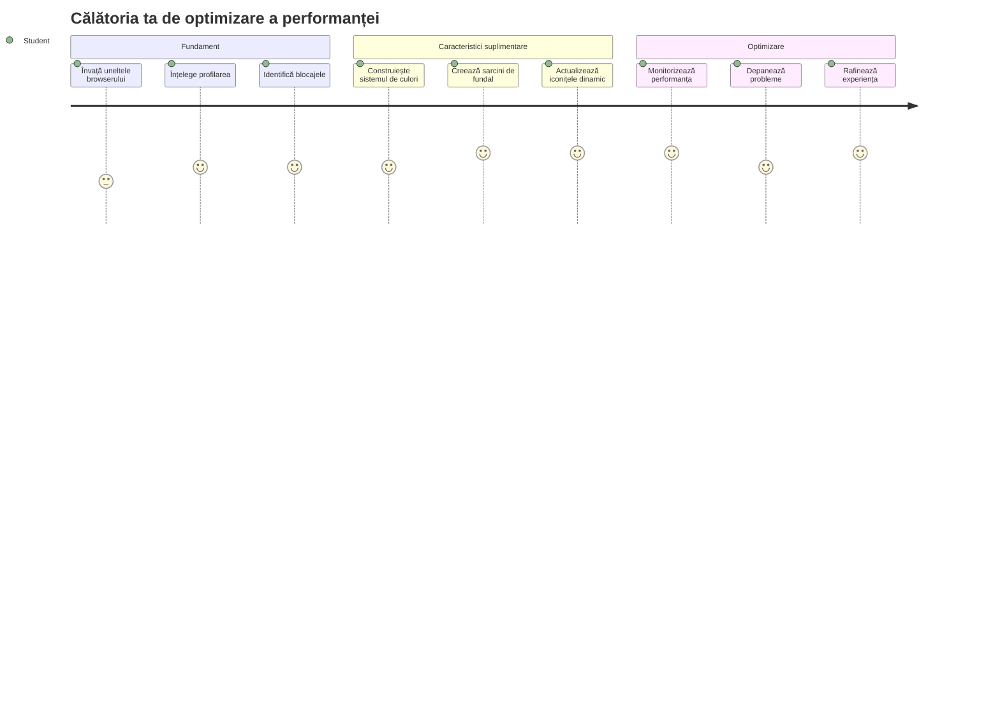
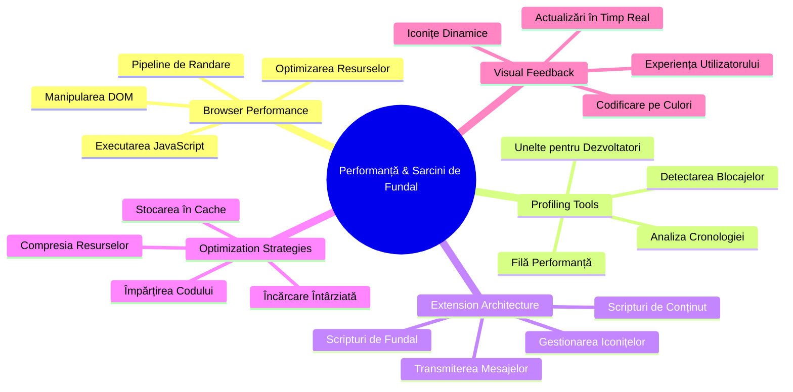
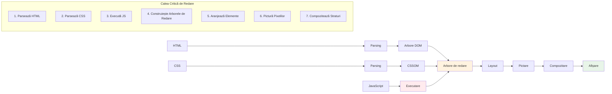
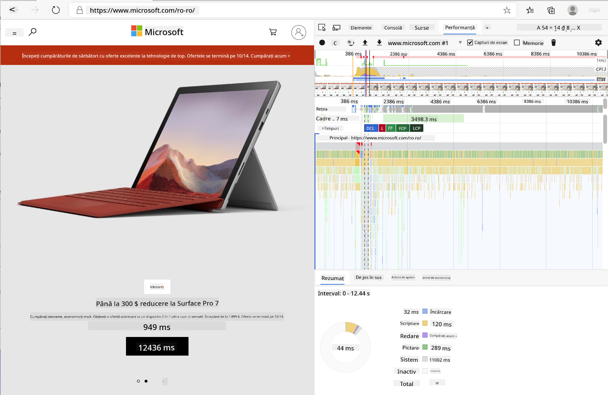
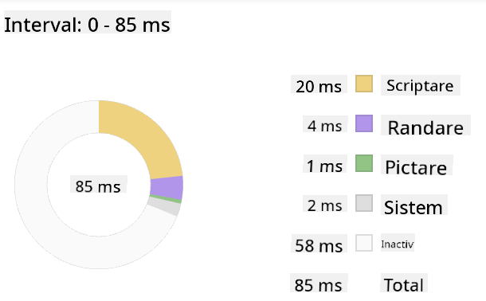
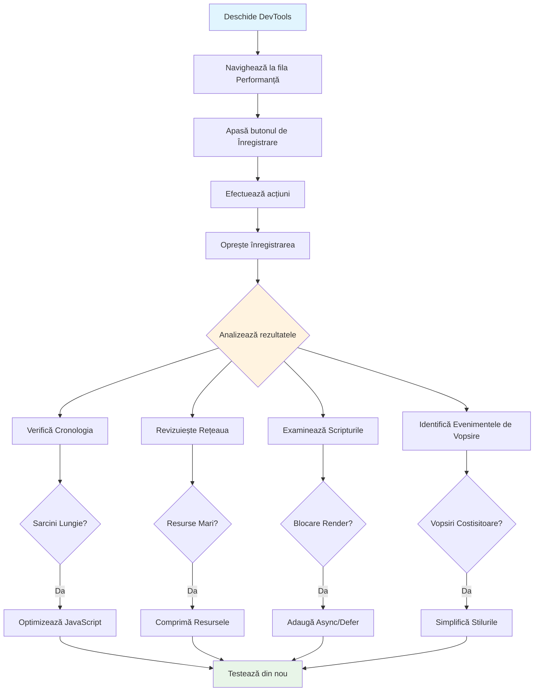
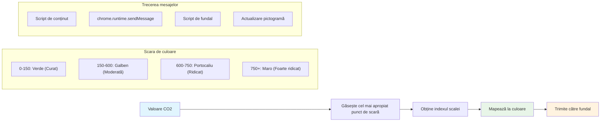
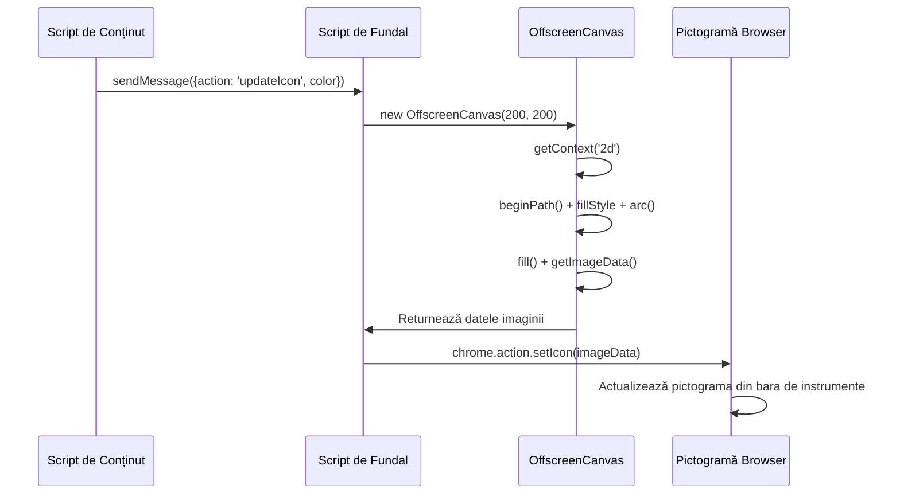
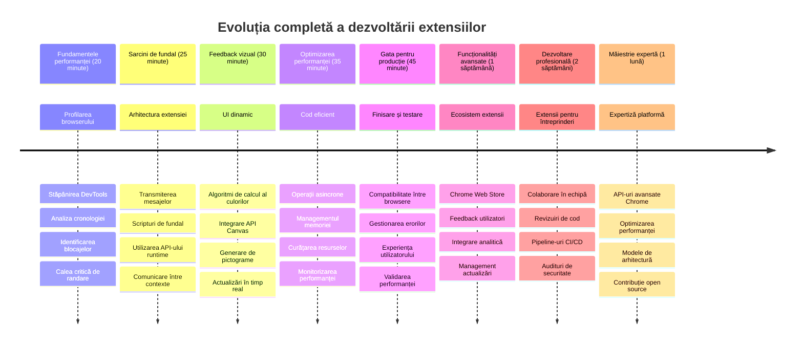

<!--
CO_OP_TRANSLATOR_METADATA:
{
  "original_hash": "b275fed2c6fc90d2b9b6661a3225faa2",
  "translation_date": "2026-01-07T05:53:24+00:00",
  "source_file": "5-browser-extension/3-background-tasks-and-performance/README.md",
  "language_code": "ro"
}
-->
# Proiect Extensie Browser Partea 3: Aflați despre Sarcini de Fundal și Performanță


V-ați întrebat vreodată ce face ca unele extensii de browser să se simtă rapide și receptivă în timp ce altele par lente? Secretul stă în ceea ce se întâmplă în spatele scenei. În timp ce utilizatorii navighează prin interfața extensiei tale, există o lume întreagă de procese de fundal care gestionează discret preluarea datelor, actualizările icoanei și resursele sistemului.

Aceasta este ultima noastră lecție din seria extensiilor de browser și vom face ca trackerul tău de amprentă de carbon să funcționeze fluid. Vei adăuga actualizări dinamice ale icoanei și vei învăța cum să identifici problemele de performanță înainte să devină probleme reale. Este ca reglarea fină a unei mașini de curse – mici optimizări pot face o diferență imensă în modul în care totul funcționează.

Până la final, vei avea o extensie finisată și vei înțelege principiile performanței care diferențiază aplicațiile web bune de cele grozave. Haideți să ne scufundăm în lumea optimizării browserului.

## Chestionar Pre-Lecție

[Chestionar pre-lectură](https://ff-quizzes.netlify.app/web/quiz/27)

### Introducere

În lecțiile anterioare, ai construit un formular, l-ai conectat la un API și ai abordat preluarea asincronă a datelor. Extensia ta prinde bine contur.

Acum trebuie să adăugăm ultimele detalii – cum ar fi schimbarea culorii icoanei extensiei în funcție de datele despre carbon. Acest lucru îmi amintește cum NASA a trebuit să optimizeze fiecare sistem de pe nava spațială Apollo. Nu-și puteau permite nicio pierdere de cicluri sau memorie pentru că viețile depindeau de performanță. Deși extensia noastră de browser nu este chiar atât de critică, aceleași principii se aplică – cod eficient creează experiențe mai bune pentru utilizatori.


## Noțiuni de Bază despre Performanța Web

Când codul tău rulează eficient, oamenii pot chiar *simți* diferența. Cunoști acel moment când o pagină se încarcă instantaneu sau o animație curge lin? Aceasta este performanța bună în acțiune.

Performanța nu este doar despre viteză – este despre crearea de experiențe web care se simt naturale, nu greoaie și frustrante. În vremurile timpurii ale calculatoarelor, Grace Hopper ținea faimos un nanosecund (o bucată de sârmă de aproximativ un picior lungime) pe biroul ei pentru a arăta cât de departe călătorește lumina într-o miliardime de secundă. Era felul ei de a explica de ce fiecare microsecundă contează în calculatoare. Să explorăm uneltele de detectiv care te ajută să descoperi ce încetinește lucrurile.

> „Performanța website-ului este despre două lucruri: cât de repede se încarcă pagina și cât de rapid rulează codul de pe ea.” -- [Zack Grossbart](https://www.smashingmagazine.com/2012/06/javascript-profiling-chrome-developer-tools/)

Subiectul despre cum să-ți faci site-urile web extrem de rapide pe toate tipurile de dispozitive, pentru tot felul de utilizatori, în toate situațiile, este, firește, vast. Iată câteva puncte de reținut pe măsură ce construiești un proiect web standard sau o extensie de browser.

Primul pas în optimizarea site-ului tău este să înțelegi ce se întâmplă cu adevărat sub capotă. Din fericire, browserul tău vine cu unelte puternice de detectiv încorporate.


Pentru a deschide Developer Tools în Edge, fă clic pe cele trei puncte din colțul din dreapta sus, apoi mergi la Mai multe unelte > Developer Tools. Sau folosește scurtătura de tastatură: `Ctrl` + `Shift` + `I` pe Windows sau `Option` + `Command` + `I` pe Mac. Odată ajuns acolo, fă clic pe fila Performanță - aici vei face investigația ta.

**Iată trusa ta de detectiv pentru performanță:**
- **Deschide** Developer Tools (le vei folosi constant ca dezvoltator!)
- **Mergi** la fila Performanță – gândește-te la ea ca la un tracker de fitness pentru aplicația ta web
- **Apasă** butonul Record și urmărește-l pe pagina ta în acțiune
- **Studiază** rezultatele pentru a identifica ce încetinește lucrurile

Hai să încercăm asta. Deschide un site (Microsoft.com este potrivit pentru asta) și apasă butonul 'Record'. Acum reîncarcă pagina și urmărește cum profilatorul surprinde tot ce se întâmplă. Când oprești înregistrarea, vei vedea o defalcare detaliată a modului în care browserul 'scriptuiește', 'randează' și 'pictează' site-ul. Îmi amintește cum centrul de comandă monitorizează fiecare sistem în timpul lansării unei rachete – primești date în timp real despre exact ce se întâmplă și când.



✅ Documentația [Microsoft Documentation](https://docs.microsoft.com/microsoft-edge/devtools-guide/performance/?WT.mc_id=academic-77807-sagibbon) are o mulțime de detalii dacă vrei să explorezi mai mult.

> Sfaturi pro: Șterge memoria cache a browserului înainte de testare pentru a vedea cum performează site-ul tău pentru vizitatorii pentru prima dată – de obicei este destul de diferit față de vizitele repetate!

Selectează elemente din cronologia profilului pentru a mări evenimentele care se petrec în timp ce pagina ta se încarcă.

Obține o imagine de ansamblu a performanței paginii tale selectând o parte din cronologia profilului și uitându-te în panoul de sumar:



Verifică panoul Event Log pentru a vedea dacă vreun eveniment a durat mai mult de 15 ms:


✅ Familiarizează-te cu profilatorul tău! Deschide uneltele pentru dezvoltatori pe acest site și vezi dacă există blocaje. Care este elementul cel mai lent la încărcare? Cel mai rapid?


## La ce să fii atent când faci profilare

Rularea profilatorului este doar începutul – adevărata abilitate este să știi ce îți spun efectiv acele grafice pline de culoare. Nu-ți face griji, te vei obișnui să le citești. Dezvoltatorii cu experiență au învățat să identifice semnele de avertizare înainte să se transforme în probleme serioase.

Să vorbim despre suspecții obișnuiți – cauzatorii de probleme de performanță care tind să pătrundă în proiectele web. Asemenea modului în care Marie Curie a trebuit să monitorizeze cu grijă nivelurile de radiații din laboratorul ei, trebuie să urmărim anumite tipare care indică probleme în devenire. Prinderea lor devreme îți va salva ție (și utilizatorilor tăi) multe frustrări.

**Dimensiunea resurselor**: Site-urile web au devenit „mai grele” de-a lungul anilor și o mare parte din această greutate suplimentară vine de la imagini. Este ca și cum am îmbulzit tot mai multe în valizele noastre digitale.

✅ Vezi arhiva [Internet Archive](https://httparchive.org/reports/page-weight) pentru a observa cum au crescut dimensiunile paginilor în timp – este foarte revelator.

**Iată cum să-ți menții resursele optimizate:**
- **Comprimă** imaginile! Formate moderne ca WebP pot reduce dramatic dimensiunea fișierelor
- **Servește** dimensiunea corectă a imaginii pentru fiecare dispozitiv – nu trebuie să trimiți imagini mari de desktop pe telefoane
- **Minifică** CSS-ul și JavaScript-ul – fiecare octet contează
- **Folosește** încărcare leneșă (lazy loading) pentru ca imaginile să se descarce doar când utilizatorii derulează efectiv la ele

**Traversări DOM**: Browserul trebuie să construiască Document Object Model pe baza codului pe care îl scrii, așa că este în interesul performanței bune să păstrezi un număr minim de etichete, folosindu-le și stilizându-le doar pe cele necesare paginii. În acest sens, CSS-ul în exces asociat unei pagini ar putea fi optimizat; stilurile folosite numai pe o anumită pagină nu trebuie incluse în foaia de stil principală, de exemplu.

**Strategii cheie pentru optimizarea DOM:**
- **Minimizează** numărul elementelor HTML și nivelurile de cuibărire
- **Elimină** regulile CSS nefolosite și consolidează foile de stil eficient
- **Organizează** CSS-ul pentru a încărca doar ce este necesar pentru fiecare pagină
- **Structură** HTML semantic pentru o parsare mai bună de către browser

**JavaScript**: Fiecare dezvoltator JavaScript ar trebui să fie atent la scripturile „blocante de redare” care trebuie încărcate înainte ca restul DOM să poată fi traversat și redat în browser. Ia în considerare folosirea atributului `defer` cu scripturile inline (așa cum se face în modulul Terrarium).

**Tehnici moderne de optimizare JavaScript:**
- **Folosește** atributul `defer` pentru a încărca scripturile după parsarea DOM-ului
- **Implementarea** codului împărțit (code splitting) pentru a încărca doar JavaScript-ul necesar
- **Aplică** încărcare leneșă pentru funcționalități non-critice
- **Minimizează** folosirea bibliotecilor și framework-urilor grele când este posibil

✅ Încearcă câteva site-uri pe un [Site Speed Test website](https://www.webpagetest.org/) pentru a afla mai multe despre verificările comune făcute pentru a determina performanța site-ului.

### 🔄 **Verificare Pedagogică**
**Înțelegerea Performanței**: Înainte de a construi funcții pentru extensie, asigură-te că poți:
- ✅ Explica calea critică de redare de la HTML la pixeli
- ✅ Identifica blocajele comune de performanță în aplicațiile web
- ✅ Folosi uneltele pentru dezvoltatori ale browserului pentru a profila performanța paginii
- ✅ Înțelege cum dimensiunea resurselor și complexitatea DOM afectează viteza

**Auto-Test Rapid**: Ce se întâmplă când ai un JavaScript blocant de redare?
*Răspuns: Browserul trebuie să descarce și să execute scriptul înainte să poată continua să parseze HTML-ul și să redea pagina*

**Impact real asupra performanței:**
- **Întârziere de 100ms**: Utilizatorii observă încetinirea
- **Întârziere de 1 secundă**: Utilizatorii încep să-și piardă concentrarea
- **3+ secunde**: 40% dintre utilizatori abandonează pagina
- **Rețele mobile**: Performanța contează și mai mult

Acum că ai o idee despre cum browserul redă resursele pe care le trimiți, să vedem ultimele lucruri pe care trebuie să le faci pentru a finaliza extensia ta:

### Creează o funcție pentru calcularea culorii

Acum vom crea o funcție care transformă datele numerice în culori semnificative. Gândește-te la ea ca un sistem de semafor – verde pentru energie curată, roșu pentru intensitate mare de carbon.

Această funcție va lua datele CO2 din API-ul nostru și va determina ce culoare reprezintă cel mai bine impactul asupra mediului. Este similar cu modul în care oamenii de știință folosesc codificarea în culori în hărțile termice pentru a vizualiza modele complexe de date – de la temperaturile oceanelor până la formarea stelelor. Să adăugăm asta în `/src/index.js`, imediat după acele variabile `const` pe care le-am definit mai devreme:


```javascript
function calculateColor(value) {
	// Defineți scara intensității CO2 (grame pe kWh)
	const co2Scale = [0, 150, 600, 750, 800];
	// Culorile corespunzătoare de la verde (curat) la maro închis (ridicat în carbon)
	const colors = ['#2AA364', '#F5EB4D', '#9E4229', '#381D02', '#381D02'];

	// Găsiți valoarea scalei cea mai apropiată de intrarea noastră
	const closestNum = co2Scale.sort((a, b) => {
		return Math.abs(a - value) - Math.abs(b - value);
	})[0];
	
	console.log(`${value} is closest to ${closestNum}`);
	
	// Găsiți indexul pentru maparea culorilor
	const num = (element) => element > closestNum;
	const scaleIndex = co2Scale.findIndex(num);

	const closestColor = colors[scaleIndex];
	console.log(scaleIndex, closestColor);

	// Trimiteți mesaj de actualizare a culorii către scriptul de fundal
	chrome.runtime.sendMessage({ action: 'updateIcon', value: { color: closestColor } });
}
```

**Să analizăm această funcție isteață:**
- **Setează** două matrice – una pentru nivelurile de CO2, cealaltă pentru culori (verde = curat, maro = murdar!)
- **Găsește** cea mai apropiată valoare de valoarea noastră reală a CO2 folosind o sortare inteligentă de matrice
- **Ia** culoarea corespunzătoare folosind metoda findIndex()
- **Trimite** un mesaj către scriptul de fundal al Chrome cu culoarea aleasă
- **Folosește** template literals (acele backticks) pentru o formatare a șirului mai curată
- **Păstrează** totul organizat cu declarații const

API-ul `chrome.runtime` [API](https://developer.chrome.com/extensions/runtime) este ca sistemul nervos al extensiei tale – gestionează toată comunicarea și sarcinile din spatele scenei:

> „Folosește API-ul chrome.runtime pentru a recupera pagina de fundal, a returna detalii despre manifest și pentru a asculta și răspunde la evenimente în ciclul de viață al aplicației sau extensiei. Poți folosi, de asemenea, acest API pentru a converti calea relativă a URL-urilor în URL-uri complet calificate.”

**De ce este API-ul Chrome Runtime atât de util:**
- **Permite** comunicarea între diferitele părți ale extensiei tale
- **Gestionează** lucrările de fundal fără să blocheze interfața utilizatorului
- **Administrează** evenimentele ciclului de viață al extensiei
- **Facilitează** schimbul de mesaje între scripturi extrem de ușor

✅ Dacă dezvolți această extensie de browser pentru Edge, s-ar putea să te surprindă că folosești un API chrome. Versiunile mai noi ale browserului Edge rulează pe motorul Chromium, așa că poți valorifica aceste unelte.


> **Sfaturi Pro**: Dacă vrei să profilezi o extensie de browser, pornește uneltele pentru dezvoltatori din interiorul extensiei, deoarece este o instanță separată de browser. Astfel ai acces la metrici specifice performanței extensiei.

### Setează o culoare implicită pentru icoană

Înainte să începem preluarea datelor reale, să-i oferim extensiei noastre un punct de plecare. Nimănui nu-i place să se uite la o icoană goală sau defectă. Vom începe cu o culoare verde ca utilizatorii să știe că extensia funcționează din momentul instalării.

În funcția ta `init()`, să setăm acea icoană verde implicită:

```javascript
chrome.runtime.sendMessage({
	action: 'updateIcon',
	value: {
		color: 'green',
	},
});
```

**Ce realizează această inițializare:**
- **Setează** o culoare verde neutră ca stare implicită
- **Oferă** feedback vizual imediat când extensia se încarcă
- **Stabilește** tiparul de comunicare cu scriptul de fundal
- **Se asigură** că utilizatorii văd o extensie funcțională înainte să se încarce datele

### Apelează funcția, execută apelul

Acum să conectăm totul astfel încât, atunci când vin date proaspete despre CO2, icoana ta să se actualizeze automat cu culoarea potrivită. Este ca și cum ai conecta circuitul final într-un dispozitiv electronic – brusc toate componentele individuale funcționează ca un singur sistem.

Adaugă această linie imediat după ce obții datele CO2 din API:

```javascript
// După preluarea datelor CO2 de la API
// lasă CO2 = data.data[0].intensity.actual;
calculateColor(CO2);
```

**Această integrare realizează:**
- **Leagă** fluxul de date API cu sistemul indicator vizual
- **Declanșează** automat actualizările icoanei când sosesc date noi
- **Asigură** feedback vizual în timp real bazat pe intensitatea actuală a carbonului
- **Menține** separarea preocupărilor dintre preluarea datelor și logica afișării

Și în final, în `/dist/background.js`, adaugă ascultătorul pentru aceste apeluri de acțiuni de fundal:

```javascript
// Ascultă mesajele de la scriptul de conținut
chrome.runtime.onMessage.addListener(function (msg, sender, sendResponse) {
	if (msg.action === 'updateIcon') {
		chrome.action.setIcon({ imageData: drawIcon(msg.value) });
	}
});

// Desenează o pictogramă dinamică folosind API-ul Canvas
// Împrumutat de la extensia energy lollipop - caracteristică frumoasă!
function drawIcon(value) {
	// Creează o pânză offscreen pentru performanță mai bună
	const canvas = new OffscreenCanvas(200, 200);
	const context = canvas.getContext('2d');

	// Desenează un cerc colorat ce reprezintă intensitatea carbonului
	context.beginPath();
	context.fillStyle = value.color;
	context.arc(100, 100, 50, 0, 2 * Math.PI);
	context.fill();

	// Returnează datele imaginii pentru pictograma browserului
	return context.getImageData(50, 50, 100, 100);
}
```

**Ce face acest script de fundal:**
- **Ascultă** mesajele de la scriptul principal (ca un recepționer care ia apeluri)
- **Procesează** cererile 'updateIcon' pentru a schimba icoana din bara de instrumente
- **Creează** icoane noi din mers folosind Canvas API
- **Desenează** un cerc colorat simplu care arată intensitatea actuală a carbonului
- **Actualizează** bara de instrumente a browserului cu icoana proaspătă
- **Folosește** OffscreenCanvas pentru performanță fluidă (fără blocarea UI-ului)

✅ Vei învăța mai multe despre Canvas API în lecțiile [Space Game](../../6-space-game/2-drawing-to-canvas/README.md).


### 🔄 **Verificare Pedagogică**
**Înțelegerea completă a extensiei**: Verifică-ți stăpânirea întregului sistem:
- ✅ Cum funcționează schimbul de mesaje între diferitele scripturi ale extensiei?
- ✅ De ce folosim OffscreenCanvas în loc de Canvas normal pentru performanță?
- ✅ Ce rol are API-ul Chrome Runtime în arhitectura extensiilor?
- ✅ Cum mapează algoritmul de calcul al culorii datele la feedback vizual?

**Considerații privind performanța**: Extensia ta demonstrează acum:
- **Mesagerie eficientă**: Comunicare curată între contexte de script
- **Redare optimizată**: OffscreenCanvas previne blocarea UI-ului
- **Actualizări în timp real**: Schimbări dinamice ale iconiței bazate pe date live
- **Gestionarea memoriei**: Curățare și manejare corespunzătoare a resurselor

**Este timpul să testezi extensia ta:**
- **Construiește** totul cu `npm run build`
- **Reîncarcă** extensia în browser (nu uita acest pas)
- **Deschide** extensia și urmărește cum iconița își schimbă culorile
- **Verifică** cum răspunde la date reale despre carbon din întreaga lume

Acum vei ști dintr-o privire dacă este un moment bun pentru acea încărcare de rufe sau dacă ar trebui să aștepți energie mai curată. Tocmai ai construit ceva cu adevărat util și ai învățat despre performanța browserului pe parcurs.

## Provocarea Agentului GitHub Copilot 🚀

Folosește modul Agent pentru a finaliza următoarea provocare:

**Descriere:** Extinde capacitățile de monitorizare a performanței ale extensiei browser-ului adăugând o funcționalitate care urmărește și afișează timpii de încărcare pentru diferitele componente ale extensiei.

**Prompt:** Creează un sistem de monitorizare a performanței pentru extensia browser-ului care măsoară și înregistrează timpul necesar pentru a prelua datele CO2 de la API, a calcula culorile și a actualiza iconița. Adaugă o funcție numită `performanceTracker` care utilizează API-ul Performance pentru a măsura aceste operațiuni și afișează rezultatele în consola browser-ului cu timpi de marcare și metrici privind durata.

Află mai multe despre [modul agent](https://code.visualstudio.com/blogs/2025/02/24/introducing-copilot-agent-mode) aici.

## 🚀 Provocare

Iată o misiune de detectiv interesantă: alege câteva site-uri open source care există de mulți ani (gândește-te la Wikipedia, GitHub sau Stack Overflow) și cercetează în istoria lor de commit-uri. Poți observa unde au făcut îmbunătățiri de performanță? Ce probleme apăreau frecvent?

**Abordarea ta de investigare:**
- **Caută** în mesajele commit-urilor cuvinte precum „optimizează,” „performanță” sau „mai rapid”
- **Caută** tipare – reparau aceleași tipuri de probleme de mai multe ori?
- **Identifică** vinovații comuni care încetineau site-urile
- **Împărtășește** ce ai descoperit – alți dezvoltatori pot învăța din exemple reale

## Quiz post-lectură

[Quiz post-lectură](https://ff-quizzes.netlify.app/web/quiz/28)

## Recapitulare și Studiu Individual

Ia în considerare abonarea la un [newsletter de performanță](https://perf.email/)

Cercetează unele modalități prin care browserele măsoară performanța web uitându-te prin filele de performanță din uneltele lor. Găsești diferențe majore?

### ⚡ **Ce poți face în următoarele 5 minute**
- [ ] Deschide Managerul de sarcini al browser-ului (Shift+Esc în Chrome) pentru a vedea utilizarea resurselor de către extensii
- [ ] Folosește fila Performance din DevTools pentru a înregistra și analiza performanța paginii web
- [ ] Verifică pagina de Extensii din browser pentru a vedea care extensii afectează timpul de pornire
- [ ] Încearcă să dezactivezi temporar extensiile pentru a observa diferențe în performanță

### 🎯 **Ce poți realiza în această oră**
- [ ] Completează quiz-ul post-lectură și înțelege conceptele de performanță
- [ ] Implementează un script de fundal pentru extensia ta de browser
- [ ] Învață să folosești browser.alarms pentru sarcini de fundal eficiente
- [ ] Exersează trimiterea mesajelor între scripturile de conținut și cele de fundal
- [ ] Măsoară și optimizează utilizarea resurselor extensiei tale

### 📅 **Călătoria ta de performanță pe durata unei săptămâni**
- [ ] Finalizează o extensie de browser de înaltă performanță cu funcționalitate de fundal
- [ ] Stăpânește service workers și arhitectura modernă a extensiilor
- [ ] Implementează sincronizare eficientă a datelor și strategii de cache
- [ ] Învață tehnici avansate de depanare pentru performanța extensiilor
- [ ] Optimizează extensia atât pentru funcționalitate, cât și pentru eficiența resurselor
- [ ] Creează teste cuprinzătoare pentru scenarii de performanță ale extensiei

### 🌟 **Măiestria ta în optimizare pe durata unei luni**
- [ ] Construiește extensii de browser de nivel enterprise cu performanță optimă
- [ ] Învață despre Web Workers, Service Workers și performanța web modernă
- [ ] Contribuie la proiecte open source axate pe optimizarea performanței
- [ ] Stăpânește internals ale browserului și tehnici avansate de depanare
- [ ] Creează instrumente de monitorizare a performanței și ghiduri cu bune practici
- [ ] Devino expert în performanță care ajută la optimizarea aplicațiilor web

## 🎯 Cronologia ta de măiestrie în extensii de browser


### 🛠️ Kit complet pentru dezvoltarea extensiei tale

După ce ai terminat această trilogie, ai stăpânit:
- **Arhitectura browser-ului**: Înțelegere profundă despre integrarea extensiilor în sistemele browser-ului
- **Profilare de performanță**: Capacitatea de a identifica și remedia punctele slabe folosind unelte de dezvoltator
- **Programare asincronă**: Modele moderne JavaScript pentru operațiuni responsiv și non-blocante
- **Integrarea API-urilor**: Preluare externă de date cu autentificare și gestionare a erorilor
- **Design vizual**: Actualizări dinamice UI și generare grafică bazată pe Canvas
- **Transmitere mesaje**: Comunicare între scripturi în arhitectura extensiilor
- **Experiența utilizatorului**: Stări de încărcare, gestionarea erorilor și interacțiuni intuitive
- **Abilități de producție**: Testare, depanare și optimizare pentru lansare în medii reale

**Aplicații în lumea reală**: Abilitățile tale de dezvoltare extensii se aplică direct în:
- **Aplicatii web progresive**: Arhitectură și modele de performanță similare
- **Aplicații desktop Electron**: Aplicații cross-platform folosind tehnologii web
- **Aplicații hibride mobile**: Dezvoltare Cordova/PhoneGap cu API-uri web
- **Aplicații web enterprise**: Dashboards complexe și unelte de productivitate
- **Extensii Chrome DevTools**: Unelte avansate pentru dezvoltatori și depanare
- **Integrarea API web**: Orice aplicație care comunică cu servicii externe

**Impact profesional**: Acum poți:
- **Construi** extensii de browser gata de producție, de la concept la lansare
- **Optimiza** performanța aplicațiilor web folosind unelte standard din industrie
- **Arhitectura** sisteme scalabile cu separare corespunzătoare a responsabilităților
- **Depana** operațiuni asincrone complexe și comunicare cross-context
- **Contribui** la proiecte open source de extensii și standarde web

**Oportunități de următorul nivel**:
- **Dezvoltator Chrome Web Store**: Publică extensii pentru milioane de utilizatori
- **Inginer performanță web**: Specializează-te în optimizare și experiență utilizator
- **Dezvoltator platformă browser**: Contribuie la dezvoltarea motoarelor browser
- **Creator framework extensii**: Construiește unelte care ajută alți dezvoltatori
- **Relații dezvoltatori**: Împărtășește cunoștințe prin învățare și creare de conținut

🌟 **Realizare deblocată**: Ai construit o extensie completă, funcțională, care demonstrează practici profesionale de dezvoltare și standarde web moderne!

## Tema

[Analizează un site pentru performanță](assignment.md)

---

<!-- CO-OP TRANSLATOR DISCLAIMER START -->
**Declinare de responsabilitate**:
Acest document a fost tradus utilizând serviciul de traducere AI [Co-op Translator](https://github.com/Azure/co-op-translator). Deși ne străduim pentru acuratețe, vă rugăm să rețineți că traducerile automate pot conține erori sau inexactități. Documentul original, în limba sa nativă, trebuie considerat sursa autoritară. Pentru informații critice, se recomandă traducerea profesională realizată de un traducător uman. Nu ne asumăm răspunderea pentru eventuale neînțelegeri sau interpretări greșite rezultate din utilizarea acestei traduceri.
<!-- CO-OP TRANSLATOR DISCLAIMER END -->