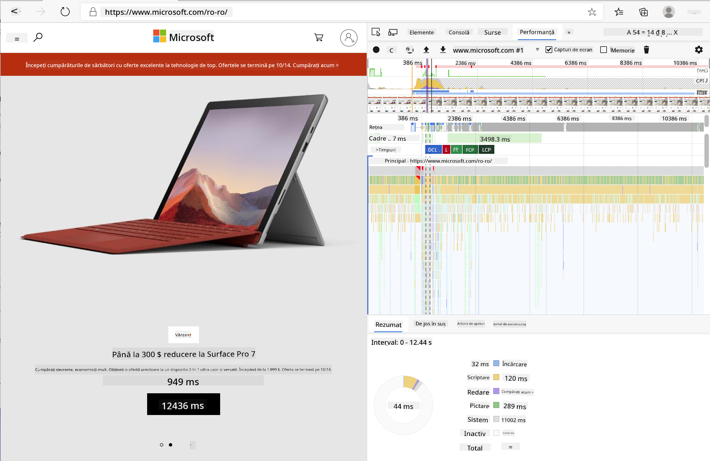

<!--
CO_OP_TRANSLATOR_METADATA:
{
  "original_hash": "f198c6b817b4b2a99749f4662e7cae98",
  "translation_date": "2025-08-28T07:44:02+00:00",
  "source_file": "5-browser-extension/3-background-tasks-and-performance/README.md",
  "language_code": "ro"
}
-->
# Proiect Extensie de Browser Partea 3: Învață despre Sarcini de Fundal și Performanță

## Chestionar Pre-Lecție

[Chestionar pre-lecție](https://ashy-river-0debb7803.1.azurestaticapps.net/quiz/27)

### Introducere

În ultimele două lecții ale acestui modul, ai învățat cum să construiești un formular și o zonă de afișare pentru datele preluate de la un API. Este o metodă foarte standard de a crea o prezență web. Ai învățat chiar și cum să gestionezi preluarea datelor în mod asincron. Extensia ta de browser este aproape completă.

Mai rămâne să gestionezi câteva sarcini de fundal, inclusiv actualizarea culorii pictogramei extensiei, așa că este un moment excelent să discutăm despre cum browserul gestionează acest tip de sarcini. Să ne gândim la aceste sarcini ale browserului în contextul performanței resurselor tale web pe măsură ce le construiești.

## Bazele Performanței Web

> "Performanța unui site web se referă la două lucruri: cât de repede se încarcă pagina și cât de repede rulează codul de pe ea." -- [Zack Grossbart](https://www.smashingmagazine.com/2012/06/javascript-profiling-chrome-developer-tools/)

Subiectul despre cum să faci site-urile tale extrem de rapide pe toate tipurile de dispozitive, pentru toți utilizatorii, în toate situațiile, este, fără surpriză, vast. Iată câteva puncte de luat în considerare pe măsură ce construiești fie un proiect web standard, fie o extensie de browser.

Primul lucru pe care trebuie să-l faci pentru a te asigura că site-ul tău funcționează eficient este să colectezi date despre performanța sa. Primul loc unde poți face acest lucru este în instrumentele de dezvoltare ale browserului tău web. În Edge, poți selecta butonul "Setări și altele" (pictograma cu trei puncte din colțul din dreapta sus al browserului), apoi navighează la Mai Multe Instrumente > Instrumente de Dezvoltare și deschide fila Performanță. De asemenea, poți folosi combinațiile de taste `Ctrl` + `Shift` + `I` pe Windows sau `Option` + `Command` + `I` pe Mac pentru a deschide instrumentele de dezvoltare.

Fila Performanță conține un instrument de Profilare. Deschide un site web (încearcă, de exemplu, [https://www.microsoft.com](https://www.microsoft.com/?WT.mc_id=academic-77807-sagibbon)) și apasă butonul 'Înregistrare', apoi reîmprospătează site-ul. Oprește înregistrarea în orice moment și vei putea vedea rutinele generate pentru 'script', 'render' și 'paint' ale site-ului:



✅ Vizitează [Documentația Microsoft](https://docs.microsoft.com/microsoft-edge/devtools-guide/performance/?WT.mc_id=academic-77807-sagibbon) despre panoul Performanță în Edge

> Sfat: pentru a obține o citire precisă a timpului de pornire al site-ului tău, golește memoria cache a browserului

Selectează elemente din cronologia profilului pentru a mări evenimentele care se întâmplă în timp ce pagina ta se încarcă.

Obține o imagine de ansamblu a performanței paginii tale selectând o parte din cronologia profilului și uitându-te la panoul de rezumat:


Verifică panoul Jurnal de Evenimente pentru a vedea dacă vreun eveniment a durat mai mult de 15 ms:


✅ Familiarizează-te cu instrumentul de profilare! Deschide instrumentele de dezvoltare pe acest site și vezi dacă există blocaje. Care este resursa care se încarcă cel mai încet? Dar cea mai rapidă?

## Verificări de profilare

În general, există câteva "zone problematice" pe care fiecare dezvoltator web ar trebui să le urmărească atunci când construiește un site pentru a evita surprizele neplăcute în momentul lansării în producție.

**Dimensiunile resurselor**: Web-ul a devenit mai 'greu' și, prin urmare, mai lent, în ultimii ani. O parte din această greutate are legătură cu utilizarea imaginilor.

✅ Consultă [Arhiva Internetului](https://httparchive.org/reports/page-weight) pentru o perspectivă istorică asupra greutății paginilor și multe altele.

O practică bună este să te asiguri că imaginile tale sunt optimizate și livrate la dimensiunea și rezoluția potrivită pentru utilizatorii tăi.

**Traversări DOM**: Browserul trebuie să construiască Modelul Obiectului Documentului (DOM) pe baza codului pe care îl scrii, așa că este în interesul unei performanțe bune a paginii să păstrezi etichetele la minim, folosind și stilizând doar ceea ce este necesar pentru pagină. În acest sens, CSS-ul excesiv asociat unei pagini ar putea fi optimizat; stilurile care trebuie utilizate doar pe o singură pagină nu trebuie incluse în foaia de stil principală, de exemplu.

**JavaScript**: Fiecare dezvoltator JavaScript ar trebui să fie atent la scripturile care blochează randarea și care trebuie încărcate înainte ca restul DOM-ului să poată fi traversat și afișat în browser. Ia în considerare utilizarea `defer` cu scripturile tale inline (așa cum se face în modulul Terrarium).

✅ Încearcă câteva site-uri pe un [site de testare a vitezei](https://www.webpagetest.org/) pentru a afla mai multe despre verificările comune care se fac pentru a determina performanța site-ului.

Acum că ai o idee despre cum browserul afișează resursele pe care le trimiți, să analizăm ultimele câteva lucruri pe care trebuie să le faci pentru a finaliza extensia:

### Creează o funcție pentru calcularea culorii

Lucrând în `/src/index.js`, adaugă o funcție numită `calculateColor()` după seria de variabile `const` pe care le-ai setat pentru a avea acces la DOM:

```JavaScript
function calculateColor(value) {
	let co2Scale = [0, 150, 600, 750, 800];
	let colors = ['#2AA364', '#F5EB4D', '#9E4229', '#381D02', '#381D02'];

	let closestNum = co2Scale.sort((a, b) => {
		return Math.abs(a - value) - Math.abs(b - value);
	})[0];
	console.log(value + ' is closest to ' + closestNum);
	let num = (element) => element > closestNum;
	let scaleIndex = co2Scale.findIndex(num);

	let closestColor = colors[scaleIndex];
	console.log(scaleIndex, closestColor);

	chrome.runtime.sendMessage({ action: 'updateIcon', value: { color: closestColor } });
}
```

Ce se întâmplă aici? Transmiți o valoare (intensitatea carbonului) din apelul API pe care l-ai finalizat în lecția anterioară, iar apoi calculezi cât de aproape este valoarea sa de indexul prezentat în array-ul de culori. Apoi trimiți acea valoare de culoare cea mai apropiată către runtime-ul Chrome.

Runtime-ul Chrome are [un API](https://developer.chrome.com/extensions/runtime) care gestionează tot felul de sarcini de fundal, iar extensia ta profită de acest lucru:

> "Folosește API-ul chrome.runtime pentru a prelua pagina de fundal, a returna detalii despre manifest și a asculta și răspunde la evenimentele din ciclul de viață al aplicației sau extensiei. De asemenea, poți folosi acest API pentru a converti calea relativă a URL-urilor în URL-uri complet calificate."

✅ Dacă dezvolți această extensie de browser pentru Edge, s-ar putea să te surprindă faptul că folosești un API Chrome. Versiunile mai noi ale browserului Edge rulează pe motorul browserului Chromium, așa că poți profita de aceste instrumente.

> Notă: dacă vrei să profilezi o extensie de browser, lansează instrumentele de dezvoltare din interiorul extensiei, deoarece aceasta este propria instanță separată de browser.

### Setează o culoare implicită pentru pictogramă

Acum, în funcția `init()`, setează pictograma să fie generic verde la început, apelând din nou acțiunea `updateIcon` a Chrome:

```JavaScript
chrome.runtime.sendMessage({
	action: 'updateIcon',
		value: {
			color: 'green',
		},
});
```

### Apelează funcția, execută apelul

Apoi, apelează funcția pe care tocmai ai creat-o adăugând-o la promisiunea returnată de API-ul C02Signal:

```JavaScript
//let CO2...
calculateColor(CO2);
```

Și, în final, în `/dist/background.js`, adaugă ascultătorul pentru aceste apeluri de acțiuni de fundal:

```JavaScript
chrome.runtime.onMessage.addListener(function (msg, sender, sendResponse) {
	if (msg.action === 'updateIcon') {
		chrome.browserAction.setIcon({ imageData: drawIcon(msg.value) });
	}
});
//borrowed from energy lollipop extension, nice feature!
function drawIcon(value) {
	let canvas = document.createElement('canvas');
	let context = canvas.getContext('2d');

	context.beginPath();
	context.fillStyle = value.color;
	context.arc(100, 100, 50, 0, 2 * Math.PI);
	context.fill();

	return context.getImageData(50, 50, 100, 100);
}
```

În acest cod, adaugi un ascultător pentru orice mesaje care ajung la managerul de sarcini de fundal. Dacă este numit 'updateIcon', atunci următorul cod este rulat pentru a desena o pictogramă de culoarea corespunzătoare folosind API-ul Canvas.

✅ Vei învăța mai multe despre API-ul Canvas în [lecțiile despre Jocul Spațial](../../6-space-game/2-drawing-to-canvas/README.md).

Acum, reconstruiește extensia ta (`npm run build`), reîmprospătează și lansează extensia, și urmărește cum se schimbă culoarea. Este un moment bun să faci o plimbare sau să speli vasele? Acum știi!

Felicitări, ai construit o extensie de browser utilă și ai învățat mai multe despre cum funcționează browserul și cum să profilezi performanța acestuia.

---

## 🚀 Provocare

Investighează câteva site-uri open source care există de mult timp și, pe baza istoricului lor de pe GitHub, vezi dacă poți determina cum au fost optimizate de-a lungul anilor pentru performanță, dacă au fost optimizate. Care este cel mai comun punct sensibil?

## Chestionar Post-Lecție

[Chestionar post-lecție](https://ashy-river-0debb7803.1.azurestaticapps.net/quiz/28)

## Recapitulare & Studiu Individual

Ia în considerare abonarea la un [newsletter despre performanță](https://perf.email/)

Investighează câteva dintre modurile în care browserele evaluează performanța web uitându-te prin filele de performanță din instrumentele lor web. Găsești diferențe majore?

## Temă

[Analizează un site pentru performanță](assignment.md)

---

**Declinare de responsabilitate**:  
Acest document a fost tradus folosind serviciul de traducere AI [Co-op Translator](https://github.com/Azure/co-op-translator). Deși ne străduim să asigurăm acuratețea, vă rugăm să rețineți că traducerile automate pot conține erori sau inexactități. Documentul original în limba sa maternă ar trebui considerat sursa autoritară. Pentru informații critice, se recomandă traducerea profesională realizată de un specialist. Nu ne asumăm responsabilitatea pentru eventualele neînțelegeri sau interpretări greșite care pot apărea din utilizarea acestei traduceri.