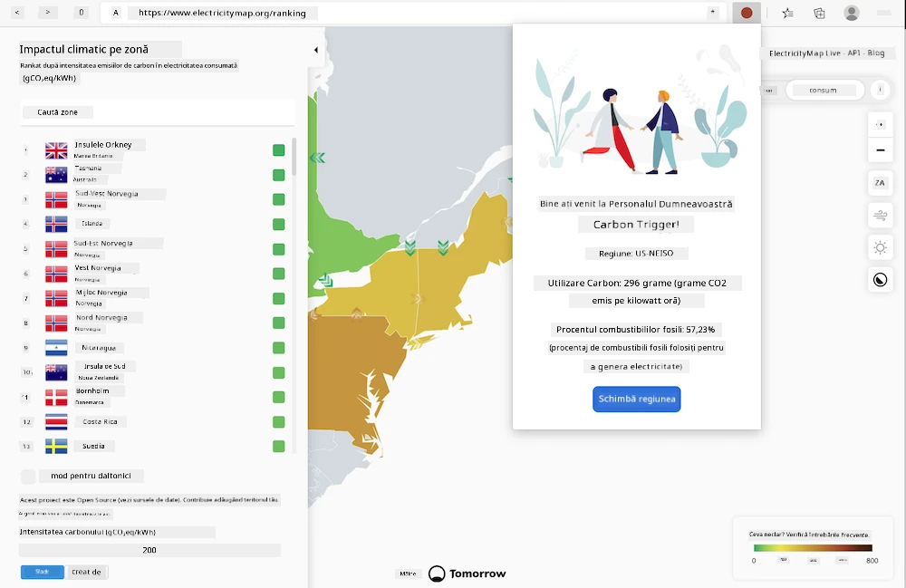

# Construirea unei extensii pentru browser

Construirea extensiilor pentru browser este o modalitate distractivă și interesantă de a analiza performanța aplicațiilor tale, în timp ce creezi un alt tip de resursă web. Acest modul include lecții despre cum funcționează browserele, cum să implementezi o extensie pentru browser, cum să construiești un formular, să apelezi un API, să utilizezi stocarea locală și cum să evaluezi performanța site-ului tău web pentru a o îmbunătăți.

Vei construi o extensie pentru browser care funcționează pe Edge, Chrome și Firefox. Această extensie, care este ca un mini site web adaptat pentru o sarcină foarte specifică, verifică [API-ul C02 Signal](https://www.co2signal.com) pentru utilizarea energiei electrice și intensitatea carbonului într-o anumită regiune și oferă o evaluare a amprentei de carbon a regiunii respective.

Această extensie poate fi utilizată ad-hoc de un utilizator, odată ce o cheie API și un cod de regiune sunt introduse într-un formular, pentru a determina utilizarea locală a energiei electrice și, astfel, pentru a oferi date care pot influența deciziile utilizatorului legate de consumul de energie. De exemplu, poate fi preferabil să amâni utilizarea unui uscător de haine (o activitate cu intensitate mare de carbon) în timpul unei perioade de consum ridicat de energie electrică în regiunea ta.

### Subiecte

1. [Despre browser](1-about-browsers/README.md)
2. [Formulare și stocare locală](2-forms-browsers-local-storage/README.md)
3. [Sarcini de fundal și performanță](3-background-tasks-and-performance/README.md)

### Credite

## Credite

Ideea pentru acest declanșator de carbon web a fost oferită de Asim Hussain, lider la Microsoft al echipei Green Cloud Advocacy și autor al [Principiilor Verzi](https://principles.green/). Inițial, a fost un [proiect de site web](https://github.com/jlooper/green).

Structura extensiei pentru browser a fost influențată de [extensia COVID a lui Adebola Adeniran](https://github.com/onedebos/covtension).

Conceptul din spatele sistemului de pictograme „punct” a fost sugerat de structura pictogramelor din extensia pentru browser [Energy Lollipop](https://energylollipop.com/) pentru emisiile din California.

Aceste lecții au fost scrise cu ♥️ de [Jen Looper](https://www.twitter.com/jenlooper)

---

**Declinare de responsabilitate**:  
Acest document a fost tradus folosind serviciul de traducere AI [Co-op Translator](https://github.com/Azure/co-op-translator). Deși ne străduim să asigurăm acuratețea, vă rugăm să fiți conștienți că traducerile automate pot conține erori sau inexactități. Documentul original în limba sa natală ar trebui considerat sursa autoritară. Pentru informații critice, se recomandă traducerea profesională realizată de un specialist uman. Nu ne asumăm responsabilitatea pentru eventualele neînțelegeri sau interpretări greșite care pot apărea din utilizarea acestei traduceri.