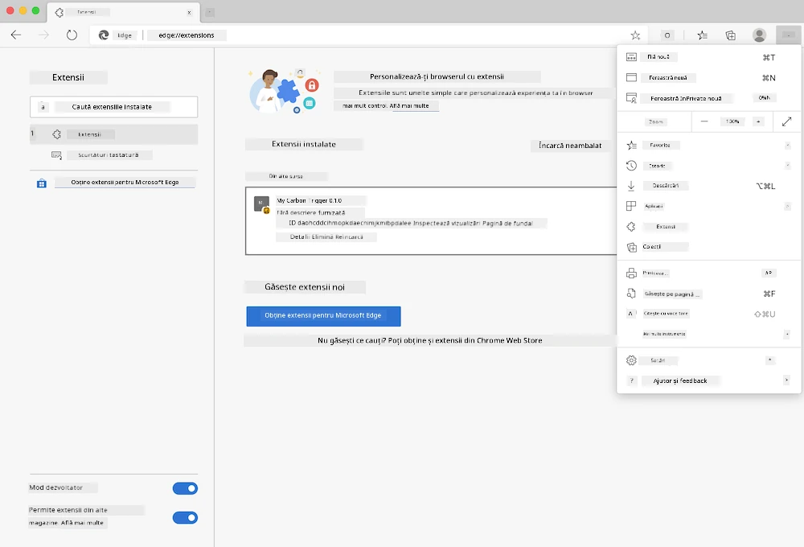

# Extensia de browser Carbon Trigger: codul de început

Se va utiliza API-ul Signal CO2 de la tmrow pentru a monitoriza utilizarea energiei electrice, cu scopul de a crea o extensie de browser care să ofere un memento direct în browser despre cât de intensă este utilizarea energiei electrice în regiunea ta. Utilizarea acestei extensii personalizate va ajuta la evaluarea activităților proprii pe baza acestor informații.


## Pentru a începe

Este necesar ca [npm](https://npmjs.com) să fie instalat. Descarcă o copie a acestui cod într-un folder de pe computerul tău.

Instalează toate pachetele necesare:

```
npm install
```

Construiește extensia folosind webpack:

```
npm run build
```

Pentru a instala pe Edge, folosește meniul „trei puncte” din colțul din dreapta sus al browserului pentru a accesa panoul Extensii. Dacă nu este deja activată, activează Modul dezvoltator (în partea de jos, stânga). Selectează „Încarcă necomprimat” pentru a adăuga o nouă extensie. Deschide folderul „dist” la prompt, iar extensia va fi încărcată. Pentru a o utiliza, vei avea nevoie de o cheie API pentru API-ul CO2 Signal (poți [obține una prin e-mail aici](https://www.co2signal.com/) - introdu adresa ta de e-mail în caseta de pe această pagină) și de [codul pentru regiunea ta](http://api.electricitymap.org/v3/zones) corespunzător [hărții electrice](https://www.electricitymap.org/map) (de exemplu, pentru Boston, „US-NEISO”).



După ce cheia API și regiunea au fost introduse în interfața extensiei, punctul colorat din bara extensiei browserului ar trebui să se schimbe pentru a reflecta utilizarea energiei din regiune și să ofere o sugestie despre ce activități cu consum ridicat de energie ar fi potrivite de realizat. Conceptul din spatele acestui sistem de „puncte” a fost inspirat de [extensia Energy Lollipop](https://energylollipop.com/) pentru emisiile din California.

---

**Declinare de responsabilitate**:  
Acest document a fost tradus folosind serviciul de traducere AI [Co-op Translator](https://github.com/Azure/co-op-translator). Deși ne străduim să asigurăm acuratețea, vă rugăm să rețineți că traducerile automate pot conține erori sau inexactități. Documentul original în limba sa natală ar trebui considerat sursa autoritară. Pentru informații critice, se recomandă traducerea profesională realizată de un specialist uman. Nu ne asumăm responsabilitatea pentru eventualele neînțelegeri sau interpretări greșite care pot apărea din utilizarea acestei traduceri.