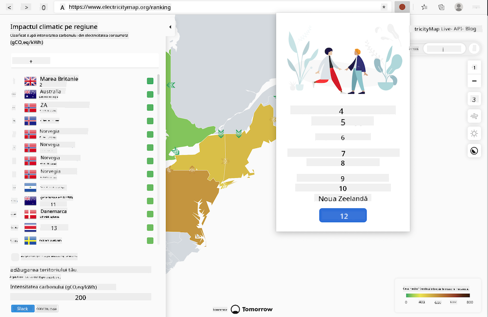
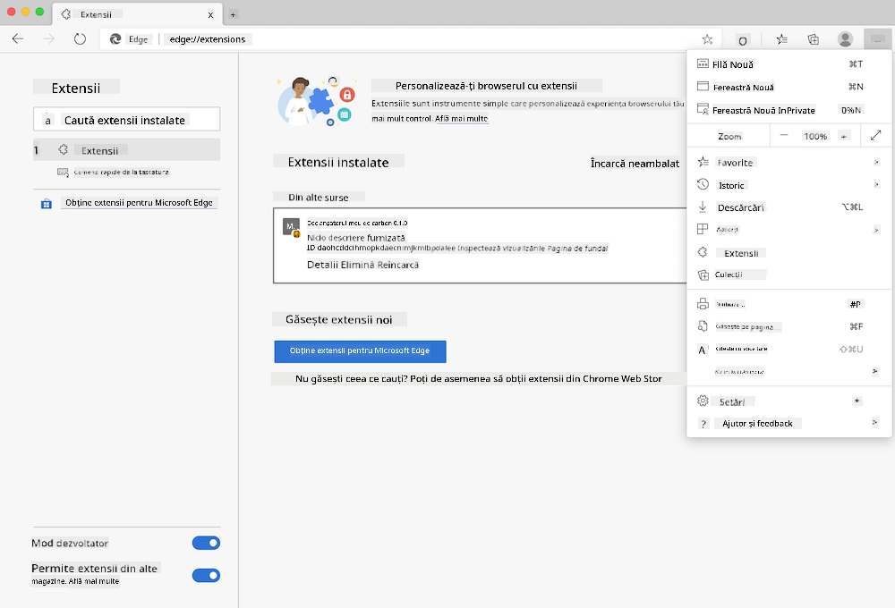

<!--
CO_OP_TRANSLATOR_METADATA:
{
  "original_hash": "3f5e6821e0febccfc5d05e7c944d9e3d",
  "translation_date": "2025-08-27T22:54:09+00:00",
  "source_file": "5-browser-extension/solution/translation/README.ja.md",
  "language_code": "ro"
}
-->
# Extensie de browser Carbon Trigger: Cod finalizat

Construiește o extensie de browser care utilizează API-ul CO2 Signal de la tmrow pentru a urmări consumul de energie și pentru a afișa, ca un memento, cât de intens este consumul de energie în regiunea ta. Folosind această extensie în mod ad-hoc, poți lua decizii informate cu privire la activitățile tale pe baza acestor informații.



## Introducere

Este necesar să ai [npm](https://npmjs.com) instalat. Descarcă o copie a acestui cod într-un folder de pe computerul tău.

Instalează toate pachetele necesare.

```
npm install
```

Construiește extensia folosind webpack.

```
npm run build
```

Pentru a instala pe Edge, găsește panoul „Extensii” din meniul „trei puncte” din colțul din dreapta sus al browserului. De acolo, selectează „Load Unpacked” pentru a încărca noua extensie. Când apare promptul, deschide folderul „dist” și extensia va fi încărcată. Pentru utilizare, vei avea nevoie de o cheie API pentru CO2 Signal ([obține una aici prin email](https://www.co2signal.com/) - introdu adresa ta de email în caseta de pe această pagină) și de [codul corespunzător regiunii tale](http://api.electricitymap.org/v3/zones) de pe [Electricity Map](https://www.electricitymap.org/map) (de exemplu, pentru Boston, folosește 'US-NEISO').



După ce introduci cheia API și regiunea în interfața extensiei, punctul colorat afișat în bara de extensii a browserului se va schimba, reflectând consumul de energie din regiunea ta. Acest lucru îți va indica ce activități care necesită energie sunt potrivite în acel moment. Conceptul sistemului „punct” mi-a fost inspirat de extensia [Energy Lollipop](https://energylollipop.com/) pentru emisiile din California.

---

**Declinare de responsabilitate**:  
Acest document a fost tradus folosind serviciul de traducere AI [Co-op Translator](https://github.com/Azure/co-op-translator). Deși ne străduim să asigurăm acuratețea, vă rugăm să fiți conștienți că traducerile automate pot conține erori sau inexactități. Documentul original în limba sa maternă ar trebui considerat sursa autoritară. Pentru informații critice, se recomandă traducerea profesională realizată de un specialist uman. Nu ne asumăm responsabilitatea pentru eventualele neînțelegeri sau interpretări greșite care pot apărea din utilizarea acestei traduceri.