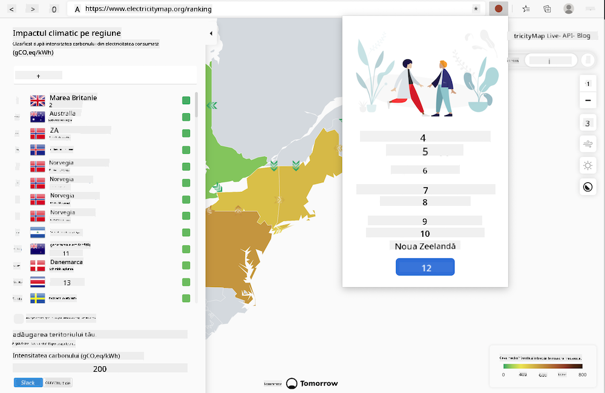

<!--
CO_OP_TRANSLATOR_METADATA:
{
  "original_hash": "21b364c158c8e4f698de65eeac16c9fe",
  "translation_date": "2025-08-27T22:52:29+00:00",
  "source_file": "5-browser-extension/solution/translation/README.ms.md",
  "language_code": "ro"
}
-->
# Extensia de browser Carbon Trigger: Cod complet

Folosind API-ul CO2 Signal de la tmrow pentru a monitoriza consumul de electricitate, construiește o extensie de browser care îți permite să primești notificări în browser despre cât de intens este consumul de electricitate în regiunea ta. Utilizarea acestei extensii te va ajuta să iei decizii informate cu privire la activitățile tale, bazându-te pe aceste informații.



## Începe de aici

Trebuie să ai instalat [npm](https://npmjs.com). Descarcă o copie a acestui cod într-un folder de pe computerul tău.

Instalează toate pachetele necesare:

```
npm install
```

Construiește extensia folosind webpack:

```
npm run build
```

Pentru a instala extensia în Edge, folosește meniul „trei puncte” din colțul din dreapta sus al browserului pentru a accesa panoul Extensii. De acolo, selectează „Load Unpacked” pentru a încărca extensia. Deschide folderul „dist” la cerere, iar extensia va fi încărcată. Pentru a o utiliza, vei avea nevoie de o cheie API pentru API-ul CO2 Signal ([obține una prin e-mail aici](https://www.co2signal.com/) - introdu adresa ta de e-mail în caseta de pe această pagină) și [codul pentru regiunea ta](http://api.electricitymap.org/v3/zones), care corespunde cu [Electricity Map](https://www.electricitymap.org/map) (în Boston, de exemplu, eu folosesc „US-NEISO”).


După ce introduci cheia API și regiunea în interfața extensiei, punctul colorat din bara extensiei browserului se va schimba pentru a reflecta consumul de energie din regiunea ta și îți va oferi sugestii despre activitățile potrivite pe care le poți desfășura. Conceptul din spatele sistemului „punct” mi-a fost inspirat de [extensia de browser Energy Lollipop](https://energylollipop.com/) pentru emisiile din California.

---

**Declinare de responsabilitate**:  
Acest document a fost tradus folosind serviciul de traducere AI [Co-op Translator](https://github.com/Azure/co-op-translator). Deși ne străduim să asigurăm acuratețea, vă rugăm să fiți conștienți că traducerile automate pot conține erori sau inexactități. Documentul original în limba sa natală ar trebui considerat sursa autoritară. Pentru informații critice, se recomandă traducerea profesională realizată de un specialist uman. Nu ne asumăm responsabilitatea pentru eventualele neînțelegeri sau interpretări greșite care pot apărea din utilizarea acestei traduceri.