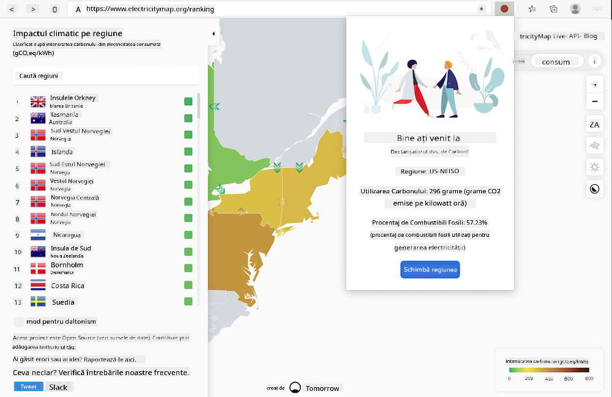

<!--
CO_OP_TRANSLATOR_METADATA:
{
  "original_hash": "26fd39046d264ba185dcb086d3a8cf3e",
  "translation_date": "2025-08-28T07:46:44+00:00",
  "source_file": "5-browser-extension/start/README.md",
  "language_code": "ro"
}
-->
# Extensia de browser Carbon Trigger: Cod de început

Folosind API-ul CO2 Signal de la tmrow pentru a monitoriza consumul de energie electrică, construiește o extensie de browser astfel încât să ai un memento direct în browser despre cât de intens este consumul de energie electrică în regiunea ta. Utilizarea acestei extensii în mod ad-hoc te va ajuta să iei decizii informate cu privire la activitățile tale, bazându-te pe aceste informații.



## Începe

Va trebui să ai instalat [npm](https://npmjs.com). Descarcă o copie a acestui cod într-un folder de pe computerul tău.

Instalează toate pachetele necesare:

```
npm install
```

Construiește extensia folosind webpack:

```
npm run build
```

Pentru a instala pe Edge, folosește meniul „trei puncte” din colțul din dreapta sus al browserului pentru a găsi panoul Extensii. De acolo, selectează „Load Unpacked” pentru a încărca o extensie nouă. La prompt, deschide folderul „dist” și extensia va fi încărcată. Pentru a o utiliza, vei avea nevoie de o cheie API pentru API-ul CO2 Signal ([obține una aici prin email](https://www.co2signal.com/) - introdu adresa ta de email în căsuța de pe această pagină) și de [codul pentru regiunea ta](http://api.electricitymap.org/v3/zones) corespunzător [Electricity Map](https://www.electricitymap.org/map) (de exemplu, în Boston, folosesc „US-NEISO”).


Odată ce cheia API și regiunea sunt introduse în interfața extensiei, punctul colorat din bara extensiei browserului ar trebui să se schimbe pentru a reflecta consumul de energie din regiunea ta și să îți ofere o sugestie despre ce activități consumatoare de energie ar fi potrivite să le desfășori. Conceptul din spatele acestui sistem de „puncte” mi-a fost inspirat de [extensia Energy Lollipop](https://energylollipop.com/) pentru emisiile din California.

---

**Declinare de responsabilitate**:  
Acest document a fost tradus folosind serviciul de traducere AI [Co-op Translator](https://github.com/Azure/co-op-translator). Deși ne străduim să asigurăm acuratețea, vă rugăm să fiți conștienți că traducerile automate pot conține erori sau inexactități. Documentul original în limba sa natală ar trebui considerat sursa autoritară. Pentru informații critice, se recomandă traducerea profesională realizată de un specialist uman. Nu ne asumăm responsabilitatea pentru eventualele neînțelegeri sau interpretări greșite care pot apărea din utilizarea acestei traduceri.