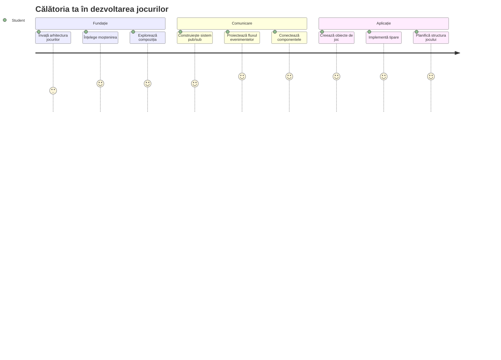
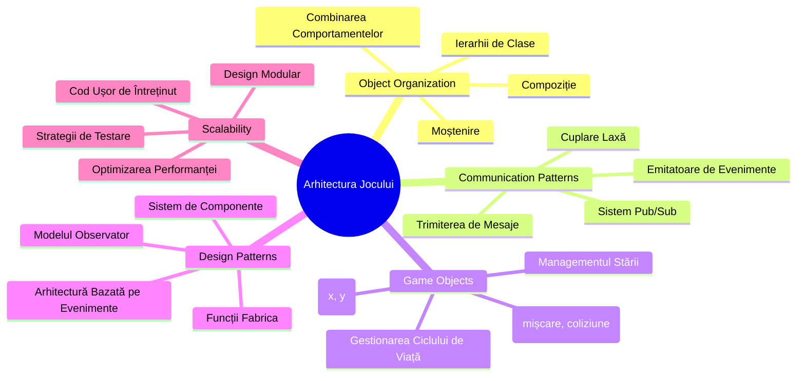
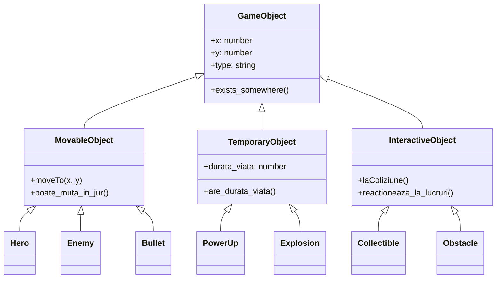
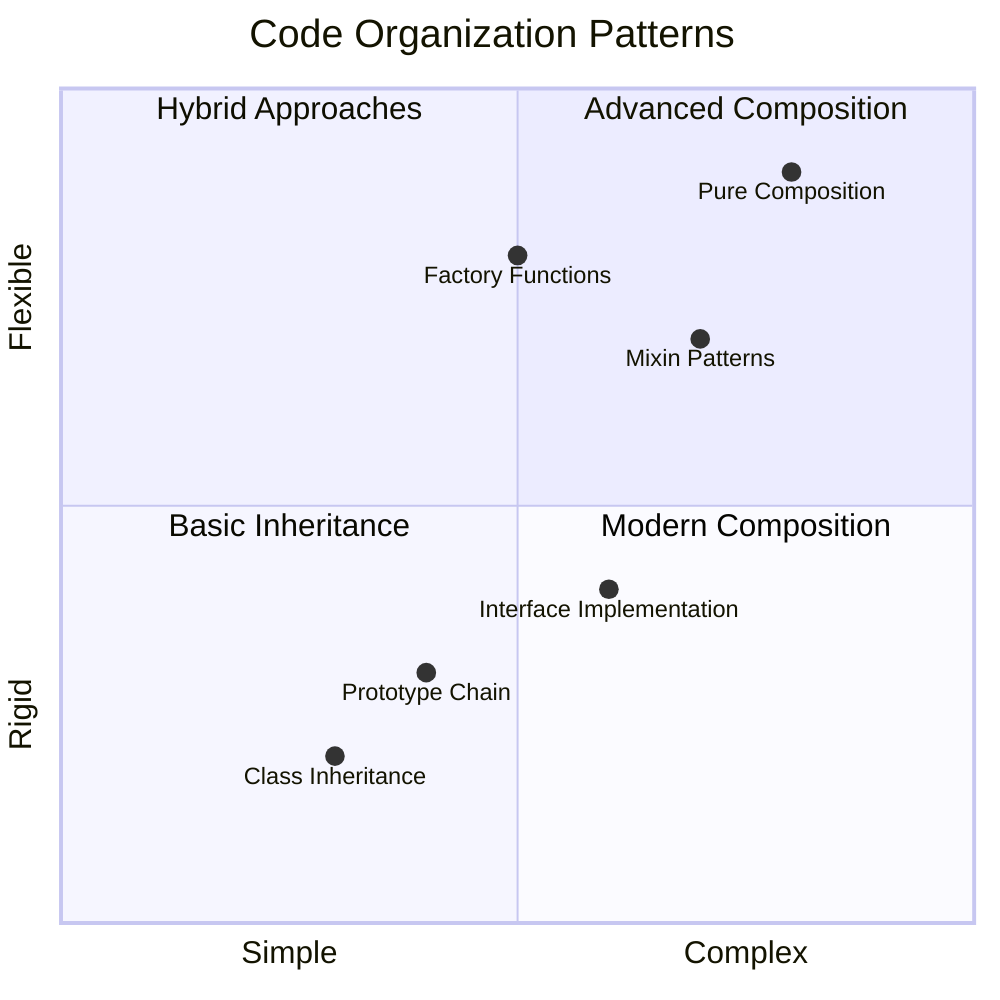
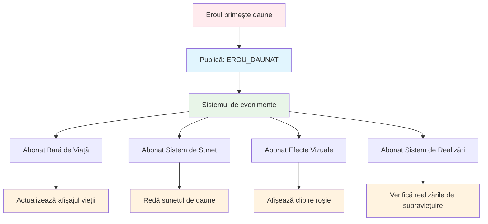
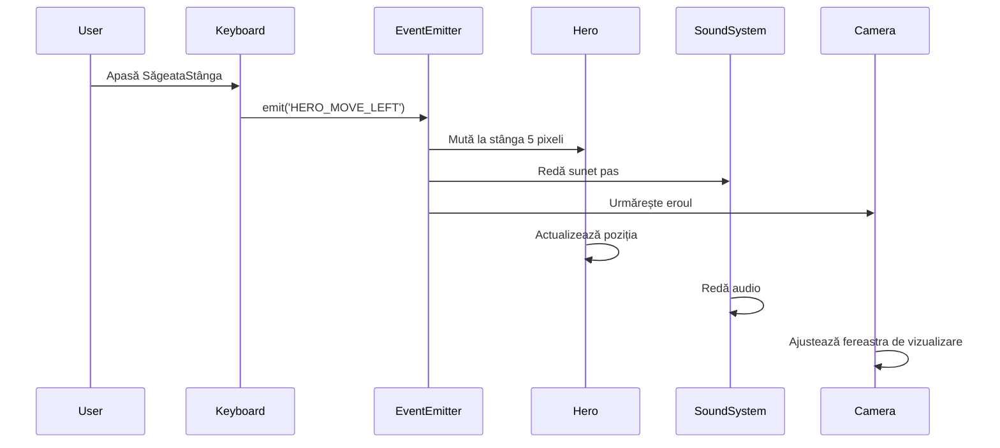
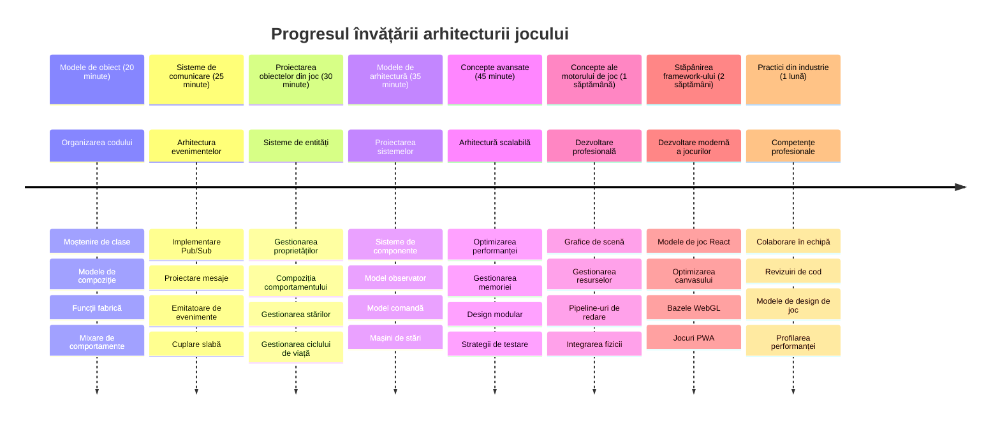

# Construiește un Joc Spațial Partea 1: Introducere




La fel cum controlul misiunii NASA coordonează multiple sisteme în timpul unei lansări spațiale, vom crea un joc spațial care demonstrează cum diferite părți ale unui program pot lucra împreună fără probleme. Creând ceva la care poți chiar să joci, vei învăța concepte esențiale de programare care se aplică oricărui proiect software.

Vom explora două abordări fundamentale pentru organizarea codului: moștenirea și compoziția. Acestea nu sunt doar concepte academice – sunt aceleași modele care alimentează totul, de la jocuri video la sisteme bancare. Vom implementa, de asemenea, un sistem de comunicare numit pub/sub care funcționează ca rețelele de comunicare folosite în navele spațiale, permițând diferitelor componente să împărtășească informații fără a crea dependențe.

La finalul acestei serii, vei înțelege cum să construiești aplicații care pot escala și evolua – fie că dezvolți jocuri, aplicații web sau orice alt sistem software.


## Chestionar Pre-Lecție

[Chestionar pre-lectură](https://ff-quizzes.netlify.app/web/quiz/29)

## Moștenirea și Compoziția în Dezvoltarea Jocurilor

Pe măsură ce proiectele cresc în complexitate, organizarea codului devine critică. Ceea ce începe ca un script simplu poate deveni dificil de întreținut fără o structură adecvată – la fel cum misiunile Apollo au necesitat o coordonare atentă între mii de componente.

Vom explora două abordări fundamentale pentru organizarea codului: moștenirea și compoziția. Fiecare are avantaje distincte, iar înțelegerea ambelor te ajută să alegi abordarea potrivită pentru diferite situații. Vom demonstra aceste concepte prin jocul nostru spațial, unde eroi, inamici, power-up-uri și alte obiecte trebuie să interacționeze eficient.

✅ Una dintre cele mai celebre cărți de programare vreodată scrise are legătură cu [modelele de design](https://en.wikipedia.org/wiki/Design_Patterns).

În orice joc, ai `obiecte de joc` – elementele interactive care populează lumea jocului tău. Eroi, inamici, power-up-uri și efecte vizuale sunt toate obiecte de joc. Fiecare există la coordonate specifice pe ecran folosind valori `x` și `y`, similar cu trasarea unor puncte pe un plan coordonat.

În ciuda diferențelor lor vizuale, aceste obiecte împart deseori comportamente fundamentale:

- **Există undeva** – Fiecare obiect are coordonate x și y astfel încât jocul să știe unde să îl deseneze
- **Multe se pot mișca** – Eroii aleargă, inamicii urmăresc, gloanțele zboară pe ecran
- **Au o durată de viață** – Unele rămân pentru totdeauna, altele (ca exploziile) apar pentru scurt timp și dispar
- **Reacționează la lucruri** – Când obiectele se ciocnesc, power-up-urile sunt colectate, barele de viață se actualizează

✅ Gândește-te la un joc precum Pac-Man. Poți identifica cele patru tipuri de obiect menționate în acest joc?


### Exprimarea Comportamentului Prin Cod

Acum că înțelegi comportamentele comune pe care le împart obiectele de joc, să explorăm cum să implementăm aceste comportamente în JavaScript. Poți exprima comportamentul unui obiect prin metode atașate fie claselor, fie obiectelor individuale, și există mai multe abordări din care poți alege.

**Abordarea bazată pe clase**

Clasele și moștenirea oferă o abordare structurată pentru organizarea obiectelor de joc. Asemenea sistemului de clasificare taxonomică dezvoltat de Carl Linnaeus, începi cu o clasă de bază care conține proprietăți comune, apoi creezi clase specializate care moștenesc aceste fundamente adăugând capabilități specifice.

✅ Moștenirea este un concept important de înțeles. Află mai multe în [articolul MDN despre moștenire](https://developer.mozilla.org/docs/Web/JavaScript/Inheritance_and_the_prototype_chain).

Iată cum poți implementa obiectele de joc folosind clase și moștenire:

```javascript
// Pasul 1: Creează clasa de bază GameObject
class GameObject {
  constructor(x, y, type) {
    this.x = x;
    this.y = y;
    this.type = type;
  }
}
```

**Să descompunem pas cu pas:**
- Creăm un șablon de bază pe care fiecare obiect de joc îl poate folosi
- Constructorul salvează unde se află obiectul (`x`, `y`) și ce tip este
- Aceasta devine fundația pe care toate obiectele tale de joc o vor construi

```javascript
// Pasul 2: Adăugați capacitatea de mișcare prin moștenire
class Movable extends GameObject {
  constructor(x, y, type) {
    super(x, y, type); // Apelați constructorul părinte
  }

  // Adăugați abilitatea de a vă muta într-o poziție nouă
  moveTo(x, y) {
    this.x = x;
    this.y = y;
  }
}
```

**În exemplul de mai sus, am:**
- **Extins** clasa GameObject pentru a adăuga funcționalitate de mișcare
- **Apelat** constructorul părinte folosind `super()` pentru a inițializa proprietățile moștenite
- **Adăugat** o metodă `moveTo()` care actualizează poziția obiectului

```javascript
// Pasul 3: Creează tipuri specifice de obiecte de joc
class Hero extends Movable {
  constructor(x, y) {
    super(x, y, 'Hero'); // Setează tipul automat
  }
}

class Tree extends GameObject {
  constructor(x, y) {
    super(x, y, 'Tree'); // Arborii nu au nevoie de mișcare
  }
}

// Pasul 4: Folosește obiectele tale de joc
const hero = new Hero(0, 0);
hero.moveTo(5, 5); // Eroul se poate mișca!

const tree = new Tree(10, 15);
// tree.moveTo() ar cauza o eroare - arborii nu se pot mișca
```

**Înțelegerea acestor concepte:**
- **Creează** tipuri de obiecte specializate care moștenesc comportamentele adecvate
- **Demonstrează** cum moștenirea permite includerea selectivă a caracteristicilor
- **Arată** că eroii se pot mișca în timp ce copacii rămân nemișcători
- **Ilustrează** cum ierarhia claselor previne acțiuni inadecvate

✅ Ia câteva minute pentru a-ți reimagina un erou Pac-Man (de exemplu, Inky, Pinky sau Blinky) și cum ar fi scris în JavaScript.

**Abordarea Compoziției**

Compoziția urmează o filozofie modulară de design, similar cu modul în care inginerii proiectează nave spațiale cu componente interschimbabile. În loc să moștenești dintr-o clasă părinte, combini comportamente specifice pentru a crea obiecte cu exact funcționalitatea de care au nevoie. Această abordare oferă flexibilitate fără constrângeri ierarhice rigide.

```javascript
// Pasul 1: Creează obiectele de comportament de bază
const gameObject = {
  x: 0,
  y: 0,
  type: ''
};

const movable = {
  moveTo(x, y) {
    this.x = x;
    this.y = y;
  }
};
```

**Ce face acest cod:**
- **Definește** un `gameObject` de bază cu proprietăți de poziție și tip
- **Creează** un obiect comportamental separat `movable` cu funcționalitate de mișcare
- **Separă** preocupările păstrând datele de poziție și logica de mișcare independente

```javascript
// Pasul 2: Combină obiectele prin îmbinarea comportamentelor
const movableObject = { ...gameObject, ...movable };

// Pasul 3: Creează funcții fabrică pentru diferite tipuri de obiecte
function createHero(x, y) {
  return {
    ...movableObject,
    x,
    y,
    type: 'Hero'
  };
}

function createStatic(x, y, type) {
  return {
    ...gameObject,
    x,
    y,
    type
  };
}
```

**În exemplul de mai sus, am:**
- **Combinat** proprietățile obiectului de bază cu comportamentul de mișcare folosind sintaxa spread
- **Creat** funcții factory care returnează obiecte personalizate
- **Permis** crearea flexibilă de obiecte fără ierarhii rigide de clase
- **Permis** obiectelor să aibă exact comportamentele de care au nevoie

```javascript
// Pasul 4: Creează și folosește-ți obiectele compuse
const hero = createHero(10, 10);
hero.moveTo(5, 5); // Funcționează perfect!

const tree = createStatic(0, 0, 'Tree');
// tree.moveTo() nu este definit - nu a fost compus niciun comportament de mișcare
```

**Puncte cheie de reținut:**
- **Compoziția** constă în combinarea comportamentelor, mai degrabă decât în moștenirea lor
- **Oferă** mai multă flexibilitate decât ierarhiile rigide de moștenire
- **Permite** obiectelor să aibă exact caracteristicile de care au nevoie
- **Folosește** sintaxa modernă JavaScript spread pentru o combinare curată a obiectelor

```

**Which Pattern Should You Choose?**

**Which Pattern Should You Choose?**



> 💡 **Sfat Pro**: Ambele modele au locul lor în dezvoltarea modernă JavaScript. Clasele funcționează bine pentru ierarhii clar definite, în timp ce compoziția strălucește când ai nevoie de flexibilitate maximă.
> 
**Când să folosești fiecare abordare:**
- **Alege** moștenirea când ai relații clare "este un" (un Erou *este un* obiect Mișcabil)
- **Selectează** compoziția când ai relații "are un" (un Erou *are* abilități de mișcare)
- **Ia în considerare** preferințele echipei tale și cerințele proiectului
- **Amintește-ți** că poți combina ambele abordări în aceeași aplicație

### 🔄 **Verificare Pedagogică**
**Înțelegerea Organizării Obiectelor**: Înainte de a trece la modelele de comunicare, asigură-te că poți:
- ✅ Explica diferența dintre moștenire și compoziție
- ✅ Identifica când să folosești clase vs funcții factory
- ✅ Înțelege cum funcționează cuvântul cheie `super()` în moștenire
- ✅ Recunoaște beneficiile fiecărei abordări pentru dezvoltarea jocurilor

**Auto-Test Rapid**: Cum ai crea un Inamic Zburător care poate atât să se miște, cât și să zboare?
- **Abordare moștenire**: `class FlyingEnemy extends Movable`
- **Abordare compoziție**: `{ ...movable, ...flyable, ...gameObject }`

**Conexiune în Lumea Reală**: Aceste modele apar peste tot:
- **Componente React**: Props (compoziție) vs moștenire clasă
- **Motoare de joc**: Sistemele entitate-componente folosesc compoziție
- **Aplicații mobile**: Framework-urile UI folosesc adesea ierarhii de moștenire

## Modele de Comunicare: Sistemul Pub/Sub

Pe măsură ce aplicațiile devin complexe, gestionarea comunicării dintre componente devine o provocare. Modelul publish-subscribe (pub/sub) rezolvă această problemă folosind principii similare transmisiunii radio – un emițător poate ajunge la mai mulți receptori fără să știe cine ascultă.

Gândește-te ce se întâmplă când un erou primește daune: bara de viață se actualizează, efectele sonore se redau, apar feedback-uri vizuale. În loc să cuplezi obiectul erou direct la aceste sisteme, pub/sub permite eroului să difuzeze un mesaj „daune primite”. Orice sistem care trebuie să reacționeze poate să se aboneze la acest tip de mesaj și să reacționeze corespunzător.

✅ **Pub/Sub** înseamnă 'publish-subscribe' (publicare-abonare)


### Înțelegerea Arhitecturii Pub/Sub

Modelul pub/sub menține părțile diferite ale aplicației tale slab cuplate, ceea ce înseamnă că pot colabora fără a depinde direct unele de altele. Această separare face codul tău mai ușor de întreținut, testat și flexibil la schimbări.

**Actorii-cheie în pub/sub:**
- **Mesaje** – Etichete simple de text precum `'PLAYER_SCORED'` care descriu ce s-a întâmplat (plus orice informații suplimentare)
- **Publicatori** – Obiectele care strigă „S-a întâmplat ceva!” către oricine ascultă
- **Abonați** – Obiectele care spun „Mă interesează acest eveniment” și reacționează când se întâmplă
- **Sistemul de Evenimente** – Intermediarul care se asigură că mesajele ajung la ascultătorii potriviți

### Construind un Sistem de Evenimente

Hai să creăm un sistem simplu, dar puternic, care demonstrează aceste concepte:

```javascript
// Pasul 1: Creează clasa EventEmitter
class EventEmitter {
  constructor() {
    this.listeners = {}; // Stochează toți ascultătorii de evenimente
  }
  
  // Înregistrează un ascultător pentru un tip specific de mesaj
  on(message, listener) {
    if (!this.listeners[message]) {
      this.listeners[message] = [];
    }
    this.listeners[message].push(listener);
  }
  
  // Trimite un mesaj tuturor ascultătorilor înregistrați
  emit(message, payload = null) {
    if (this.listeners[message]) {
      this.listeners[message].forEach(listener => {
        listener(message, payload);
      });
    }
  }
}
```

**Descompunerea a ceea ce se întâmplă aici:**
- **Creează** un sistem central de gestionare a evenimentelor folosind o clasă simplă
- **Stochează** ascultătorii într-un obiect organizat după tipurile de mesaje
- **Înregistrează** noi ascultători folosind metoda `on()`
- **Difuzează** mesaje către toți ascultătorii interesați folosind `emit()`
- **Suportă** date opționale atașate pentru transmiterea informațiilor relevante

### Punând Totul laolaltă: Un Exemplu Practic

Bine, să vedem asta în acțiune! Vom construi un sistem simplu de mișcare care arată cât de curat și flexibil poate fi pub/sub:

```javascript
// Pasul 1: Definește tipurile tale de mesaje
const Messages = {
  HERO_MOVE_LEFT: 'HERO_MOVE_LEFT',
  HERO_MOVE_RIGHT: 'HERO_MOVE_RIGHT',
  ENEMY_SPOTTED: 'ENEMY_SPOTTED'
};

// Pasul 2: Creează sistemul tău de evenimente și obiectele jocului
const eventEmitter = new EventEmitter();
const hero = createHero(0, 0);
```

**Ce face acest cod:**
- **Definește** un obiect cu constante pentru a preveni greșelile de tastare în numele mesajelor
- **Creează** o instanță de event emitter pentru a gestiona toată comunicarea
- **Inițializează** un obiect erou la poziția de start

```javascript
// Pasul 3: Configurați ascultătorii de evenimente (abonati)
eventEmitter.on(Messages.HERO_MOVE_LEFT, () => {
  hero.moveTo(hero.x - 5, hero.y);
  console.log(`Hero moved to position: ${hero.x}, ${hero.y}`);
});

eventEmitter.on(Messages.HERO_MOVE_RIGHT, () => {
  hero.moveTo(hero.x + 5, hero.y);
  console.log(`Hero moved to position: ${hero.x}, ${hero.y}`);
});
```

**În exemplul de mai sus, am:**
- **Înregistrat** ascultători de evenimente care reacționează la mesaje de mișcare
- **Actualizat** poziția eroului pe baza direcției de mișcare
- **Adăugat** mesaje în consolă pentru a urmări schimbările poziției eroului
- **Separat** logica de mișcare de gestionarea input-ului

```javascript
// Pasul 4: Conectați intrarea de la tastatură la evenimente (editori)
window.addEventListener('keydown', (event) => {
  switch(event.key) {
    case 'ArrowLeft':
      eventEmitter.emit(Messages.HERO_MOVE_LEFT);
      break;
    case 'ArrowRight':
      eventEmitter.emit(Messages.HERO_MOVE_RIGHT);
      break;
  }
});
```

**Înțelegerea acestor concepte:**
- **Leagă** input-ul de la tastatură de evenimentele jocului fără cuplare strânsă
- **Permite** sistemului de input să comunice indirect cu obiectele de joc
- **Permite** mai multor sisteme să reacționeze la aceleași evenimente de la tastatură
- **Facilitează** schimbarea combinațiilor de taste sau adăugarea unor noi metode de input


> 💡 **Sfat Pro**: Frumusețea acestui model este flexibilitatea! Poți adăuga ușor efecte sonore, tremur de ecran sau efecte particulare doar adăugând mai mulți ascultători de evenimente – fără să modifici codul existent pentru tastatură sau mișcare.
> 
**Iată de ce vei adora această abordare:**
- Adăugarea de funcționalități noi devine foarte ușoară – doar ascultă evenimentele care te interesează
- Mai multe lucruri pot reacționa la același eveniment fără să interfereze între ele
- Testarea devine mult mai simplă pentru că fiecare piesă funcționează independent
- Când ceva se strică, știi exact unde să cauți

### De ce Pub/Sub Scalează Eficient

Modelul pub/sub menține simplitatea pe măsură ce aplicațiile cresc în complexitate. Fie că gestionezi zeci de inamici, actualizări dinamice UI sau sisteme audio, modelul face față scalării crescute fără modificări arhitecturale. Funcționalitățile noi se integrează în sistemul existent de evenimente fără a afecta funcționalitatea stabilită.

> ⚠️ **Greșeală comună**: Nu crea prea multe tipuri specifice de mesaje prea devreme. Începe cu categorii largi și rafinează-le pe măsură ce nevoile jocului tău devin mai clare.
> 
**Cele mai bune practici:**
- **Gruparea** mesajelor relaționate în categorii logice
- **Folosirea** numelor descriptive care indică clar ce s-a întâmplat
- **Păstrarea** simplă și concentrată a încărcăturii mesajelor
- **Documentarea** tipurilor de mesaje pentru colaborarea în echipă

### 🔄 **Verificare Pedagogică**
**Înțelegerea Arhitecturii Orientate pe Evenimente**: Verifică-ți înțelegerea completă a sistemului:
- ✅ Cum previne modelul pub/sub cuplarea strânsă între componente?
- ✅ De ce este mai ușor să adaugi funcționalități noi cu arhitectura orientată pe evenimente?
- ✅ Ce rol joacă EventEmitter în fluxul de comunicație?
- ✅ Cum previn constantele de mesaje erorile și îmbunătățesc mentenanța?

**Provocare de Design**: Cum ai gestiona următoarele scenarii în joc folosind pub/sub?
1. **Inamicul moare**: Actualizează scorul, redă sunet, apariția unui power-up, eliminarea de pe ecran
2. **Nivelul terminat**: Oprește muzica, afișează UI, salvează progresul, încarcă nivelul următor
3. **Power-up colectat**: Îmbunătățește abilități, actualizează UI, redă efect, pornește temporizator

**Conexiune Profesională**: Acest model apare în:
- **Framework-uri Frontend**: Sisteme de evenimente React/Vue
- **Servicii Backend**: Comunicarea între microservicii
- **Motoare de Joc**: Sistemul de evenimente Unity
- **Dezvoltare Mobilă**: Sisteme de notificări iOS/Android

---

## Provocarea Agentului GitHub Copilot 🚀

Folosește modul Agent pentru a finaliza următoarea provocare:

**Descriere:** Creează un sistem simplu de obiecte de joc folosind atât moștenirea, cât și modelul pub/sub. Vei implementa un joc de bază unde diferite obiecte pot comunica prin evenimente fără să știe direct unii de alții.

**Prompt:** Creează un sistem de joc JavaScript cu următoarele cerințe: 1) Creează o clasă de bază GameObject cu coordonate x, y și o proprietate de tip. 2) Creează o clasă Hero care extinde GameObject și se poate mișca. 3) Creează o clasă Enemy care extinde GameObject și poate urmări eroul. 4) Implementează o clasă EventEmitter pentru modelul pub/sub. 5) Configurează ascultători de evenimente astfel încât, atunci când eroul se mișcă, inamicii din apropiere primesc un eveniment 'HERO_MOVED' și își actualizează poziția pentru a se deplasa spre erou. Include declarații console.log pentru a arăta comunicarea între obiecte.

Află mai multe despre [modul agent](https://code.visualstudio.com/blogs/2025/02/24/introducing-copilot-agent-mode) aici.

## 🚀 Provocare
Considera cum poate modelul pub-sub să îmbunătățească arhitectura jocului. Identifică care componente ar trebui să emită evenimente și cum ar trebui să răspundă sistemul. Proiectează un concept de joc și schițează tiparele de comunicare dintre componentele acestuia.

## Chestionar după Lecție

[Chestionar după lecție](https://ff-quizzes.netlify.app/web/quiz/30)

## Recapitulare & Studiu Individual

Află mai multe despre Pub/Sub citind [despre el](https://docs.microsoft.com/azure/architecture/patterns/publisher-subscriber/?WT.mc_id=academic-77807-sagibbon).

### ⚡ **Ce Poți Face în Următoarele 5 Minute**
- [ ] Deschide orice joc HTML5 online și inspectează-i codul folosind DevTools
- [ ] Creează un element HTML5 Canvas simplu și desenează o formă de bază
- [ ] Încearcă să folosești `setInterval` pentru a crea un ciclu simplu de animație
- [ ] Explorează documentația Canvas API și încearcă o metodă de desen

### 🎯 **Ce Poți Realiza în Această Oră**
- [ ] Finalizează chestionarul post-lecție și înțelege conceptele dezvoltării jocurilor
- [ ] Configurează structura proiectului tău de joc cu fișiere HTML, CSS și JavaScript
- [ ] Creează un ciclu de joc de bază care actualizează și redă continuu
- [ ] Desenează primele tale sprite-uri pe canvas
- [ ] Implementează încărcarea de bază a resurselor pentru imagini și sunete

### 📅 **Crearea Jocului Tău pe Parcursul unei Săptămâni**
- [ ] Finalizează jocul spațial complet cu toate funcționalitățile planificate
- [ ] Adaugă grafică finisată, efecte sonore și animații fluide
- [ ] Implementează stările jocului (ecran de start, joc în desfășurare, game over)
- [ ] Creează un sistem de scor și urmărirea progresului jucătorului
- [ ] Fă jocul tău responsiv și accesibil pe diferite dispozitive
- [ ] Publică jocul online și colectează feedback de la jucători

### 🌟 **Dezvoltarea Jocului pe Parcursul unei Luni**
- [ ] Construiește multiple jocuri explorând diferite genuri și mecanici
- [ ] Învață un framework de dezvoltare a jocurilor precum Phaser sau Three.js
- [ ] Contribuie la proiecte open source de dezvoltare jocuri
- [ ] Stăpânește modele avansate de programare a jocurilor și optimizare
- [ ] Creează un portofoliu care să-ți evidențieze abilitățile de dezvoltare jocuri
- [ ] Mentorează alți interesați de dezvoltare de jocuri și media interactivă

## 🎯 Cronologia Maestriei Tale în Dezvoltarea Jocurilor


### 🛠️ Rezumatul Trusei Tale de Unelte pentru Arhitectura Jocului

După ce ai finalizat această lecție, acum ai:
- **Stăpânirea Modelului de Design**: Înțelegerea compromisurilor dintre moștenire și compoziție
- **Arhitectură bazată pe Evenimente**: Implementare pub/sub pentru comunicare scalabilă
- **Design Orientat pe Obiecte**: Ierarhii de clase și compoziția comportamentului
- **JavaScript Modern**: Funcții fabrică, sintaxă spread și modele ES6+
- **Arhitectură Scalabilă**: Principii de decuplare și design modular
- **Fundamente de Dezvoltare Jocuri**: Sisteme de entități și modele de componente
- **Modele Profesionale**: Abordări standard industriale pentru organizarea codului

**Aplicații în Lumea Reală**: Aceste modele se aplică direct în:
- **Framework-uri Frontend**: Arhitectura componentelor React/Vue și managementul stării
- **Servicii Backend**: Comunicare microservicii și sisteme bazate pe evenimente
- **Dezvoltare Mobilă**: Arhitectură aplicații iOS/Android și sisteme de notificări
- **Motoare de Jocuri**: Unity, Unreal și dezvoltare web de jocuri
- **Software Enterprise**: Event sourcing și design sisteme distribuite
- **Design API**: Servicii RESTful și comunicare în timp real

**Competențe Profesionale Dobândite**: Acum poți:
- **Proiecta** arhitecturi software scalabile utilizând modele dovedite
- **Implementa** sisteme bazate pe evenimente care gestionează interacțiuni complexe
- **Alege** strategii potrivite de organizare a codului pentru diverse scenarii
- **Depana** și menține eficient sisteme decuplate
- **Comunica** decizii tehnice folosind terminologie standard industrială

**Următorul Nivel**: Ești gata să implementezi aceste modele într-un joc real, să explorezi subiecte avansate de dezvoltare jocuri sau să aplici aceste concepte arhitecturale în aplicații web!

🌟 **Realizare Deblocată**: Ai stăpânit modelele fundamentale de arhitectură software care susțin totul, de la jocuri simple la sisteme enterprise complexe!

## Temă

[Simulează un joc](assignment.md)

---

<!-- CO-OP TRANSLATOR DISCLAIMER START -->
**Disclaimer**:  
Acest document a fost tradus folosind serviciul de traducere AI [Co-op Translator](https://github.com/Azure/co-op-translator). Deși ne străduim pentru acuratețe, vă rugăm să rețineți că traducerile automate pot conține erori sau inexactități. Documentul original în limba sa nativă trebuie considerat sursa autorizată. Pentru informații critice, se recomandă traducerea profesională realizată de un traducător uman. Nu ne asumăm răspunderea pentru eventualele neînțelegeri sau interpretări greșite rezultate din utilizarea acestei traduceri.
<!-- CO-OP TRANSLATOR DISCLAIMER END -->