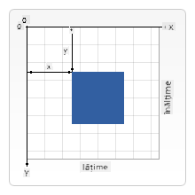

<!--
CO_OP_TRANSLATOR_METADATA:
{
  "original_hash": "41be8d35e7f30aa9dad10773c35e89c4",
  "translation_date": "2025-08-28T07:58:47+00:00",
  "source_file": "6-space-game/2-drawing-to-canvas/README.md",
  "language_code": "ro"
}
-->
# Construiește un Joc Spațial Partea 2: Desenează Eroul și Monștrii pe Canvas

## Chestionar Pre-Lecție

[Chestionar pre-lecție](https://ashy-river-0debb7803.1.azurestaticapps.net/quiz/31)

## Canvas-ul

Canvas-ul este un element HTML care, în mod implicit, nu are conținut; este o pagină goală. Trebuie să adaugi conținut desenând pe el.

✅ Citește [mai multe despre API-ul Canvas](https://developer.mozilla.org/docs/Web/API/Canvas_API) pe MDN.

Iată cum este de obicei declarat, ca parte a corpului paginii:

```html
<canvas id="myCanvas" width="200" height="100"></canvas>
```

Mai sus setăm `id`, `width` și `height`.

- `id`: setează acest atribut pentru a obține o referință atunci când ai nevoie să interacționezi cu el.
- `width`: aceasta este lățimea elementului.
- `height`: aceasta este înălțimea elementului.

## Desenarea geometriei simple

Canvas-ul folosește un sistem de coordonate cartezian pentru a desena lucruri. Astfel, utilizează o axă x și o axă y pentru a exprima unde se află ceva. Poziția `0,0` este colțul din stânga sus, iar colțul din dreapta jos este ceea ce ai setat ca fiind WIDTH și HEIGHT ale canvas-ului.


> Imagine de la [MDN](https://developer.mozilla.org/docs/Web/API/Canvas_API/Tutorial/Drawing_shapes)

Pentru a desena pe elementul canvas, trebuie să urmezi pașii următori:

1. **Obține o referință** la elementul Canvas.
1. **Obține o referință** la elementul Context care se află pe elementul Canvas.
1. **Efectuează o operațiune de desenare** folosind elementul Context.

Codul pentru pașii de mai sus arată de obicei astfel:

```javascript
// draws a red rectangle
//1. get the canvas reference
canvas = document.getElementById("myCanvas");

//2. set the context to 2D to draw basic shapes
ctx = canvas.getContext("2d");

//3. fill it with the color red
ctx.fillStyle = 'red';

//4. and draw a rectangle with these parameters, setting location and size
ctx.fillRect(0,0, 200, 200) // x,y,width, height
```

✅ API-ul Canvas se concentrează în principal pe forme 2D, dar poți desena și elemente 3D pe un site web; pentru aceasta, ai putea folosi [API-ul WebGL](https://developer.mozilla.org/docs/Web/API/WebGL_API).

Poți desena o mulțime de lucruri cu API-ul Canvas, cum ar fi:

- **Forme geometrice**, am arătat deja cum să desenezi un dreptunghi, dar există mult mai multe pe care le poți desena.
- **Text**, poți desena text cu orice font și culoare dorești.
- **Imagini**, poți desena o imagine bazată pe un fișier imagine, cum ar fi un .jpg sau .png, de exemplu.

✅ Încearcă! Știi cum să desenezi un dreptunghi, poți desena un cerc pe o pagină? Aruncă o privire la câteva desene interesante realizate cu Canvas pe CodePen. Iată un [exemplu deosebit de impresionant](https://codepen.io/dissimulate/pen/KrAwx).

## Încarcă și desenează un fișier imagine

Poți încărca un fișier imagine creând un obiect `Image` și setând proprietatea sa `src`. Apoi, asculți evenimentul `load` pentru a ști când este gata de utilizare. Codul arată astfel:

### Încarcă fișierul

```javascript
const img = new Image();
img.src = 'path/to/my/image.png';
img.onload = () => {
  // image loaded and ready to be used
}
```

### Model de încărcare a fișierului

Este recomandat să încadrezi codul de mai sus într-o construcție ca aceasta, astfel încât să fie mai ușor de utilizat și să încerci să îl manipulezi doar atunci când este complet încărcat:

```javascript
function loadAsset(path) {
  return new Promise((resolve) => {
    const img = new Image();
    img.src = path;
    img.onload = () => {
      // image loaded and ready to be used
      resolve(img);
    }
  })
}

// use like so

async function run() {
  const heroImg = await loadAsset('hero.png')
  const monsterImg = await loadAsset('monster.png')
}

```

Pentru a desena elemente de joc pe ecran, codul tău ar arăta astfel:

```javascript
async function run() {
  const heroImg = await loadAsset('hero.png')
  const monsterImg = await loadAsset('monster.png')

  canvas = document.getElementById("myCanvas");
  ctx = canvas.getContext("2d");
  ctx.drawImage(heroImg, canvas.width/2,canvas.height/2);
  ctx.drawImage(monsterImg, 0,0);
}
```

## Acum este momentul să începi să construiești jocul tău

### Ce să construiești

Vei construi o pagină web cu un element Canvas. Aceasta ar trebui să afișeze un ecran negru `1024*768`. Ți-am oferit două imagini:

- Nava eroului

   

- Monstru 5*5

   

### Pași recomandați pentru a începe dezvoltarea

Localizează fișierele care au fost create pentru tine în subfolderul `your-work`. Acesta ar trebui să conțină următoarele:

```bash
-| assets
  -| enemyShip.png
  -| player.png
-| index.html
-| app.js
-| package.json
```

Deschide copia acestui folder în Visual Studio Code. Trebuie să ai un mediu de dezvoltare local configurat, de preferat cu Visual Studio Code, NPM și Node instalate. Dacă nu ai `npm` configurat pe computerul tău, [iată cum să faci asta](https://www.npmjs.com/get-npm).

Începe proiectul navigând la folderul `your_work`:

```bash
cd your-work
npm start
```

Comanda de mai sus va porni un server HTTP la adresa `http://localhost:5000`. Deschide un browser și introdu acea adresă. Este o pagină goală acum, dar asta se va schimba.

> Notă: pentru a vedea modificările pe ecran, reîmprospătează browserul.

### Adaugă cod

Adaugă codul necesar în `your-work/app.js` pentru a rezolva următoarele:

1. **Desenează** un canvas cu fundal negru  
   > sfat: adaugă două linii sub TODO-ul corespunzător în `/app.js`, setând elementul `ctx` să fie negru și coordonatele sus/stânga la 0,0, iar înălțimea și lățimea să fie egale cu cele ale canvas-ului.
2. **Încarcă** texturi  
   > sfat: adaugă imaginile player și enemy folosind `await loadTexture` și trecând calea imaginii. Nu le vei vedea încă pe ecran!
3. **Desenează** eroul în centrul ecranului, în jumătatea de jos  
   > sfat: folosește API-ul `drawImage` pentru a desena heroImg pe ecran, setând `canvas.width / 2 - 45` și `canvas.height - canvas.height / 4)`.
4. **Desenează** 5*5 monștri  
   > sfat: Acum poți decomenta codul pentru a desena inamicii pe ecran. Apoi, mergi la funcția `createEnemies` și completeaz-o.

   Mai întâi, configurează câteva constante:

    ```javascript
    const MONSTER_TOTAL = 5;
    const MONSTER_WIDTH = MONSTER_TOTAL * 98;
    const START_X = (canvas.width - MONSTER_WIDTH) / 2;
    const STOP_X = START_X + MONSTER_WIDTH;
    ```

    apoi, creează un loop pentru a desena array-ul de monștri pe ecran:

    ```javascript
    for (let x = START_X; x < STOP_X; x += 98) {
        for (let y = 0; y < 50 * 5; y += 50) {
          ctx.drawImage(enemyImg, x, y);
        }
      }
    ```

## Rezultat

Rezultatul final ar trebui să arate astfel:


## Soluție

Te rugăm să încerci să rezolvi singur mai întâi, dar dacă te blochezi, aruncă o privire la o [soluție](../../../../6-space-game/2-drawing-to-canvas/solution/app.js).

---

## 🚀 Provocare

Ai învățat despre desenarea cu API-ul Canvas concentrat pe 2D; aruncă o privire la [API-ul WebGL](https://developer.mozilla.org/docs/Web/API/WebGL_API) și încearcă să desenezi un obiect 3D.

## Chestionar Post-Lecție

[Chestionar post-lecție](https://ashy-river-0debb7803.1.azurestaticapps.net/quiz/32)

## Recapitulare și Studiu Individual

Află mai multe despre API-ul Canvas [citind despre el](https://developer.mozilla.org/docs/Web/API/Canvas_API).

## Temă

[Experimentează cu API-ul Canvas](assignment.md)

---

**Declinarea responsabilității**:  
Acest document a fost tradus folosind serviciul de traducere AI [Co-op Translator](https://github.com/Azure/co-op-translator). Deși depunem eforturi pentru a asigura acuratețea, vă rugăm să rețineți că traducerile automate pot conține erori sau inexactități. Documentul original în limba sa nativă ar trebui considerat sursa autoritară. Pentru informații critice, se recomandă traducerea realizată de un profesionist uman. Nu ne asumăm răspunderea pentru eventualele neînțelegeri sau interpretări greșite care pot apărea din utilizarea acestei traduceri.