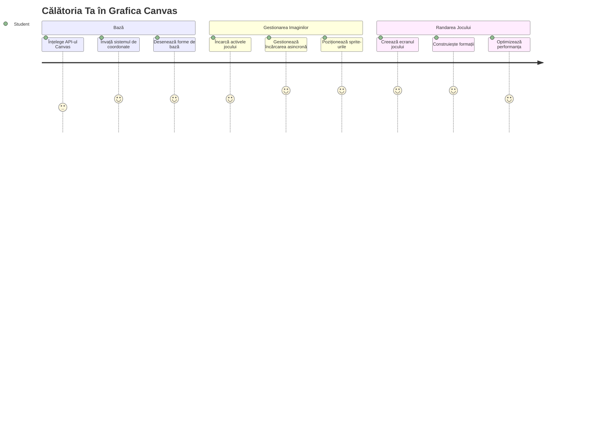
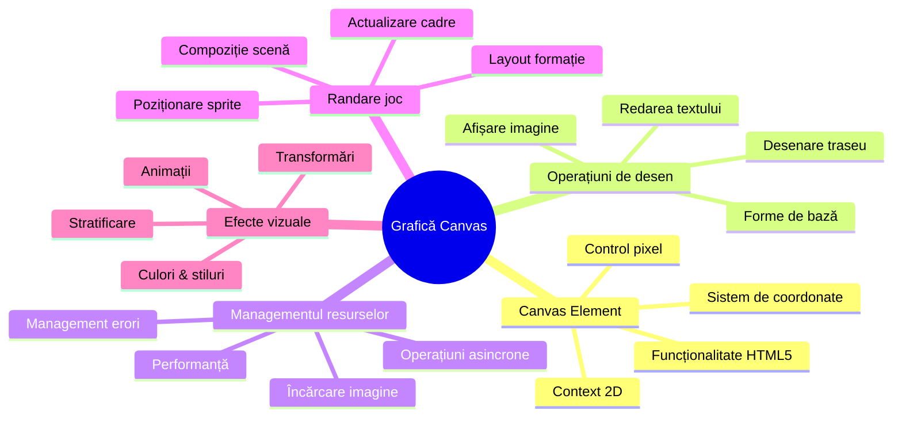
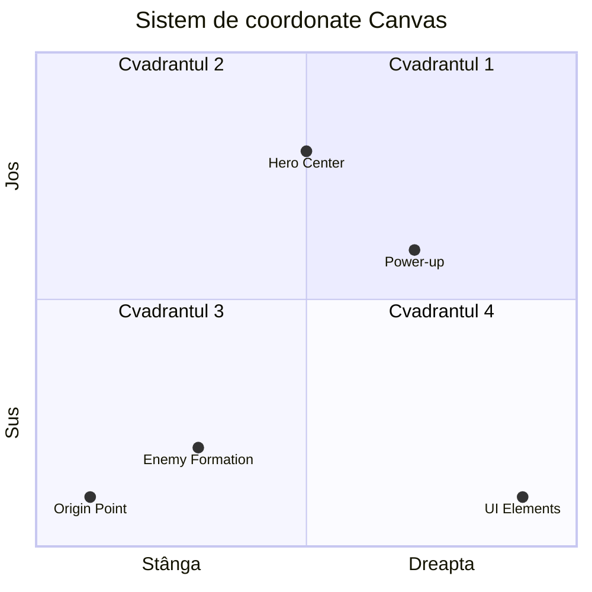
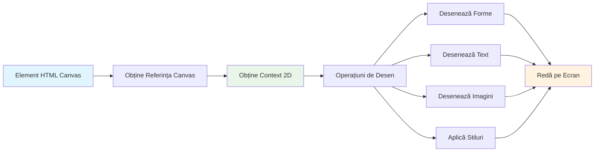
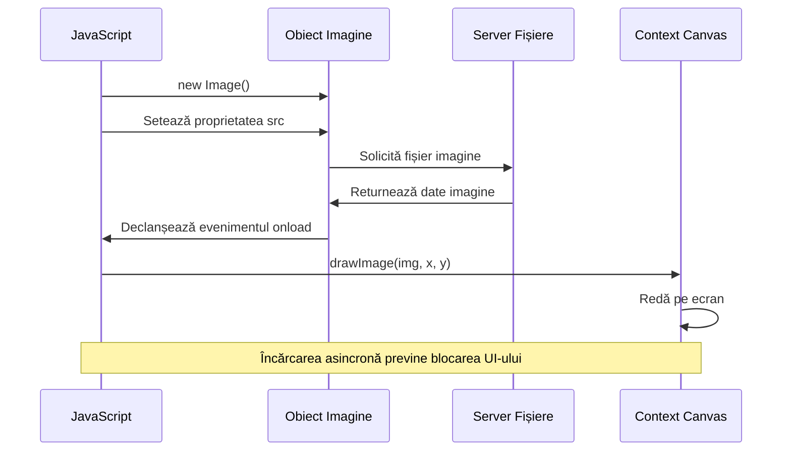
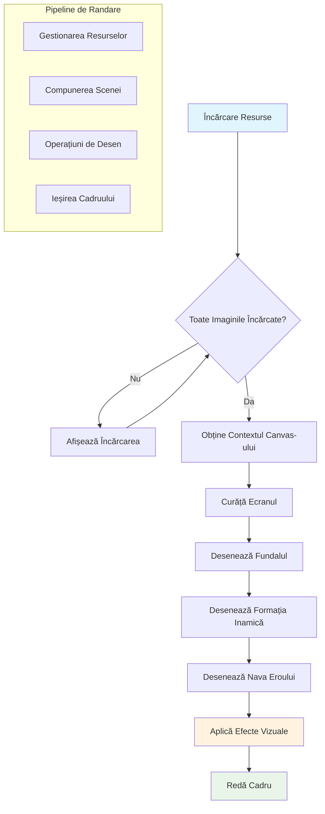
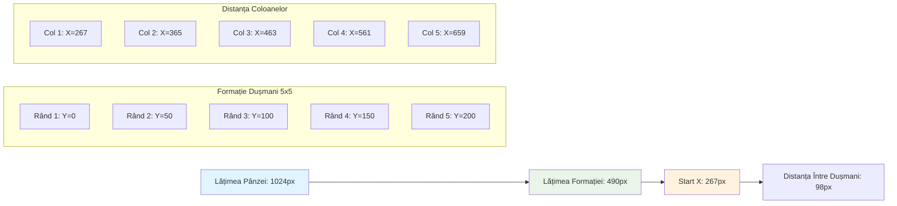
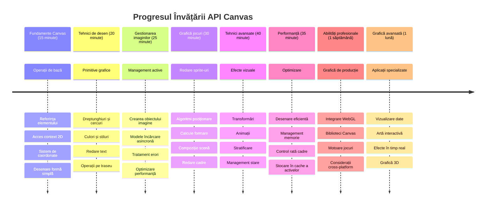

<!--
CO_OP_TRANSLATOR_METADATA:
{
  "original_hash": "7994743c5b21fdcceb36307916ef249a",
  "translation_date": "2026-01-07T05:42:55+00:00",
  "source_file": "6-space-game/2-drawing-to-canvas/README.md",
  "language_code": "ro"
}
-->
# Construiește un Joc Spațial Partea 2: Desenează Eroul și Monștrii pe Canvas


API-ul Canvas este una dintre cele mai puternice caracteristici ale dezvoltării web pentru crearea graficii dinamice și interactive chiar în browserul tău. În această lecție, vom transforma elementul HTML gol `<canvas>` într-o lume de joc plină de eroi și monștri. Gândește-te la canvas ca la tabla ta digitală de desen unde codul devine vizual.

Construim pe baza a ceea ce ai învățat în lecția anterioară, iar acum vom explora aspectele vizuale. Vei învăța cum să încarci și să afișezi sprite-urile jocului, să poziționezi elemente cu precizie și să creezi fundația vizuală pentru jocul tău spațial. Aceasta face legătura între paginile web statice și experiențele dinamice, interactive.

La sfârșitul acestei lecții, vei avea o scenă completă de joc cu nava eroului poziționată corect și formațiuni de inamici gata de luptă. Vei înțelege cum redau jocurile moderne grafica în browsere și vei dobândi abilități pentru a-ți crea propriile experiențe vizuale interactive. Hai să explorăm grafica pe canvas și să aducem la viață jocul tău spațial!


## Chestionar Pre-Lecție

[Chestionar pre-lectură](https://ff-quizzes.netlify.app/web/quiz/31)

## Canvas-ul

Deci, ce este exact acest element `<canvas>`? Este soluția HTML5 pentru crearea de grafică dinamică și animații în browserele web. Spre deosebire de imaginile sau videoclipurile obișnuite care sunt statice, canvas-ul îți oferă control la nivel de pixeli asupra tuturor elementelor afișate pe ecran. Acest lucru îl face perfect pentru jocuri, vizualizări de date și artă interactivă. Gândește-te la el ca la o suprafață de desen programabilă unde JavaScript devine pensula ta.

Implicit, un element canvas apare ca un dreptunghi transparent, gol pe pagina ta. Dar acolo se află potențialul! Puterea sa reală se dezvăluie atunci când folosești JavaScript pentru a desena forme, încărca imagini, crea animații și face lucrurile să răspundă la interacțiunile utilizatorului. Este similar cu modul în care pionierii graficii pe calculator din anii 1960 de la Bell Labs trebuiau să programeze fiecare pixel pentru a crea primele animații digitale.

✅ Citește [mai multe despre API-ul Canvas](https://developer.mozilla.org/docs/Web/API/Canvas_API) pe MDN.

Iată cum este declarat de obicei, ca parte din corpul paginii:

```html
<canvas id="myCanvas" width="200" height="100"></canvas>
```

**Ce face acest cod:**
- **Setează** atributul `id` pentru a putea face referire la acest element canvas specific din JavaScript
- **Definește** `width` în pixeli pentru a controla lățimea orizontală a canvas-ului
- **Stabilește** `height` în pixeli pentru a determina dimensiunile verticale ale canvas-ului

## Desenarea Geometriei Simple

Acum că știi ce este elementul canvas, să explorăm cum să desenezi efectiv pe el! Canvas-ul folosește un sistem de coordonate care poate părea familiar de la orele de matematică, dar există un detaliu important specific graficii pe calculator.

Canvas-ul folosește coordonate carteziene cu o axă x (orizontală) și o axă y (verticală) pentru a poziționa tot ceea ce desenezi. Dar acesta este diferența cheie: spre deosebire de sistemul de coordonate din matematică, punctul de origine `(0,0)` începe în colțul din stânga sus, cu valorile x crescând către dreapta și valorile y crescând în jos. Această abordare provine de la primele monitoare de calculator în care fasciculele de electroni scanau de sus în jos, făcând colțul din stânga sus punctul natural de pornire.



> Imagine de la [MDN](https://developer.mozilla.org/docs/Web/API/Canvas_API/Tutorial/Drawing_shapes)

Pentru a desena pe elementul canvas, vei urma același proces în trei pași care formează baza tuturor graficilor canvas. Odată ce îl faci de câteva ori, devine ceva natural:


1. **Ia o referință** la elementul Canvas din DOM (la fel ca orice alt element HTML)
2. **Preia contextul de redare 2D** – acesta oferă toate metodele de desenare
3. **Începe să desenezi!** Folosește metodele încorporate ale contextului pentru a crea grafica ta

Iată cum arată în cod:

```javascript
// Pasul 1: Obține elementul canvas
const canvas = document.getElementById("myCanvas");

// Pasul 2: Obține contextul de redare 2D
const ctx = canvas.getContext("2d");

// Pasul 3: Setează culoarea de umplere și desenează un dreptunghi
ctx.fillStyle = 'red';
ctx.fillRect(0, 0, 200, 200); // x, y, lățime, înălțime
```

**Să descompunem pas cu pas:**
- **Preluăm** elementul canvas folosind ID-ul său și îl stocăm într-o variabilă
- **Preluăm** contextul de redare 2D – acesta este trusa noastră cu metode de desen
- **Spunem** canvas-ului să umple cu roșu folosind proprietatea `fillStyle`
- **Desenăm** un dreptunghi care începe din colțul stânga sus (0,0) și are 200 pixeli în lățime și înălțime

✅ API-ul Canvas este concentrat în principal pe forme 2D, însă poți desena și elemente 3D pe un site web; pentru asta, ai putea utiliza [API-ul WebGL](https://developer.mozilla.org/docs/Web/API/WebGL_API).

Poți desena multe lucruri cu API-ul Canvas precum:

- **Forme geometrice**, am arătat deja cum să desenezi un dreptunghi, dar poți desena mult mai multe.
- **Text**, poți desena texturi cu orice font și culoare dorești.
- **Imagini**, poți desena o imagine pornind de la un fișier de imagine precum .jpg sau .png, de exemplu.

✅ Încearcă! Știi cum să desenezi un dreptunghi, poți să desenezi un cerc pe o pagină? Aruncă o privire la câteva desene interesante pe Canvas pe CodePen. Iată un [exemplu deosebit de impresionant](https://codepen.io/dissimulate/pen/KrAwx).

### 🔄 **Verificare Pedagogică**
**Înțelegerea Fundamentele Canvas:** Înainte de a trece la încărcarea imaginilor, asigură-te că poți:
- ✅ Explica cum diferă sistemul de coordonate al canvas-ului de coordonatele matematice
- ✅ Înțelege procesul în trei pași pentru operațiunile de desen pe canvas
- ✅ Identifica ce oferă contextul de redare 2D
- ✅ Descrie modul în care fillStyle și fillRect funcționează împreună

**Auto-Test Rapid:** Cum ai desena un cerc albastru la poziția (100, 50) cu raza 25?
```javascript
ctx.fillStyle = 'blue';
ctx.beginPath();
ctx.arc(100, 50, 25, 0, 2 * Math.PI);
ctx.fill();
```

**Metode de Desen Canvas pe care acum le știi**:
- **fillRect()**: Desenează dreptunghiuri umplute
- **fillStyle**: Setează culori și modele
- **beginPath()**: Începe căi noi de desen
- **arc()**: Creează cercuri și curbe

## Încarcă și Desenează un Asset de Imagine

Desenarea formelor de bază este utilă pentru început, dar majoritatea jocurilor au nevoie de imagini reale! Sprite-urile, fundalurile și texturile sunt cele care dau jocurilor aspectul vizual. Încărcarea și afișarea imaginilor pe canvas funcționează diferit de desenarea formelor geometrice, dar este simplu odată ce înțelegi procesul.

Trebuie să creăm un obiect `Image`, să încărcăm fișierul imagine (acest proces este asincron, adică "în fundal"), și apoi să-l desenăm pe canvas odată ce este gata. Această abordare asigură că imaginile tale se afișează corect fără a bloca aplicația în timp ce se încarcă.


### Încărcare Basică de Imagine

```javascript
const img = new Image();
img.src = 'path/to/my/image.png';
img.onload = () => {
  // Imagine încărcată și gata de utilizare
  console.log('Image loaded successfully!');
};
```

**Ce se întâmplă în acest cod:**
- **Creăm** un nou obiect Image pentru a încărca sprite-ul sau textura noastră
- **Îi spunem** ce fișier de imagine să încarce setând calea sursei
- **Ascultăm** evenimentul de încărcare pentru a ști exact când imaginea este gata de folosit

### O Metodă Mai Bună de a Încărca Imagini

Iată o metodă mai robustă pentru gestionarea încărcării imaginilor pe care dezvoltatorii profesioniști o folosesc frecvent. Vom înveli logica de încărcare a imaginii într-o funcție bazată pe Promisiuni – această abordare, popularizată când Promisiunile JavaScript au devenit standard în ES6, face codul mai organizat și gestionează elegant erorile:

```javascript
function loadAsset(path) {
  return new Promise((resolve, reject) => {
    const img = new Image();
    img.src = path;
    img.onload = () => {
      resolve(img);
    };
    img.onerror = () => {
      reject(new Error(`Failed to load image: ${path}`));
    };
  });
}

// Utilizare modernă cu async/await
async function initializeGame() {
  try {
    const heroImg = await loadAsset('hero.png');
    const monsterImg = await loadAsset('monster.png');
    // Imaginile sunt acum gata de folosit
  } catch (error) {
    console.error('Failed to load game assets:', error);
  }
}
```

**Ce am făcut aici:**
- **Am învelit** toată logica de încărcare a imaginii într-o Promisiune pentru a o putea gestiona mai bine
- **Am adăugat** un management al erorilor care ne spune când ceva nu merge bine
- **Am folosit** sintaxa modernă async/await pentru că este mult mai curată și ușor de citit
- **Am inclus** blocuri try/catch pentru a gestiona cu grație orice dificultăți la încărcare

Odată ce imaginile sunt încărcate, desenarea lor pe canvas este de fapt destul de simplă:

```javascript
async function renderGameScreen() {
  try {
    // Încarcă resursele jocului
    const heroImg = await loadAsset('hero.png');
    const monsterImg = await loadAsset('monster.png');

    // Obține canvas-ul și contextul
    const canvas = document.getElementById("myCanvas");
    const ctx = canvas.getContext("2d");

    // Desenează imaginile în poziții specifice
    ctx.drawImage(heroImg, canvas.width / 2, canvas.height / 2);
    ctx.drawImage(monsterImg, 0, 0);
  } catch (error) {
    console.error('Failed to render game screen:', error);
  }
}
```

**Să parcurgem pas cu pas:**
- Încărcăm ambele imagini, a eroului și a monstruului, în fundal folosind await
- Preluăm elementul canvas și obținem contextul 2D necesar
- Poziționăm imaginea eroului exact în centrul paginii folosind un calcul simplu al coordonatelor
- Așezăm imaginea monstruului în colțul din stânga sus pentru a începe formațiunea inamicilor
- Prindem eventualele erori ce pot apărea în timpul încărcării sau redării


## Acum Este Timpul să Începi să Construiești Jocul Tău

Acum vom pune totul cap la cap pentru a crea fundația vizuală a jocului tău spațial. Ai înțeles bine fundamentele canvas-ului și tehnicile de încărcare a imaginilor, așa că această secțiune practică te va ghida să construiești un ecran complet al jocului cu sprite-uri poziționate corect.

### Ce să Construiești

Vei construi o pagină web cu un element Canvas. Aceasta ar trebui să redea un ecran negru `1024*768`. Ți-am furnizat două imagini:

- Nava eroului

   

- Monstru 5*5

   

### Pași Recomandați pentru a începe dezvoltarea

Găsește fișierele de început care au fost create pentru tine în subfolderul `your-work`. Structura proiectului tău ar trebui să conțină:

```bash
your-work/
├── assets/
│   ├── enemyShip.png
│   └── player.png
├── index.html
├── app.js
└── package.json
```

**Cu ce lucrezi:**
- **Sprite-urile jocului** se află în folderul `assets/` pentru a păstra totul organizat
- **Fișierul tău principal HTML** configurează elementul canvas și pregătește totul
- **Un fișier JavaScript** unde vei scrie toată magia redării jocului
- **Un package.json** care configurează un server de dezvoltare pentru test local

Deschide acest folder în Visual Studio Code pentru a începe dezvoltarea. Vei avea nevoie de un mediu local de dezvoltare cu Visual Studio Code, NPM și Node.js instalate. Dacă nu ai configurat `npm` pe calculatorul tău, [aici găsești cum să îl instalezi](https://www.npmjs.com/get-npm).

Pornește serverul tău de dezvoltare navigând în folderul `your-work`:

```bash
cd your-work
npm start
```

**Această comandă face câteva lucruri tare interesante:**
- **Pornește** un server local la `http://localhost:5000` astfel încât să poți testa jocul
- **Servește** corect toate fișierele astfel încât browserul să le încarce conform
- **Monitorizează** fișierele tale pentru schimbări pentru un flux de dezvoltare fluid
- **Îți oferă** un mediu profesional de dezvoltare pentru testarea completă

> 💡 **Notă**: Browserul tău va afișa o pagină goală la început – asta este normal! Pe măsură ce adaugi cod, reîmprospătează browserul pentru a vedea modificările tale. Această metodă iterativă de dezvoltare este asemănătoare cu modul în care NASA a construit computerul de navigație Apollo – testând fiecare componentă înainte de integrarea ei în sistemul mai mare.

### Adaugă cod

Adaugă codul necesar în `your-work/app.js` pentru a finaliza următoarele sarcini:

1. **Desenează un canvas cu fundal negru**
   > 💡 **Cum se face:** Găsește TODO-ul din `/app.js` și adaugă doar două linii. Setează `ctx.fillStyle` la negru, apoi folosește `ctx.fillRect()` începând de la (0,0) cu dimensiunile canvas-ului. Simplu!

2. **Încarcă texturile jocului**
   > 💡 **Cum se face:** Folosește `await loadAsset()` pentru a încărca imaginile pentru jucător și inamici. Stochează-le în variabile pentru a le putea folosi mai târziu. Ține minte – nu vor apărea până nu le desenezi efectiv!

3. **Desenează nava eroului în poziția de mijloc-jos**
   > 💡 **Cum se face:** Folosește `ctx.drawImage()` pentru a poziționa nava eroului. Pentru coordonata x, încearcă `canvas.width / 2 - 45` pentru a o centra, iar pentru coordonata y, folosește `canvas.height - canvas.height / 4` pentru a o poziționa în zona de jos.

4. **Desenează o formațiune 5×5 de nave inamice**
   > 💡 **Cum se face:** Găsește funcția `createEnemies` și configurează un loop imbricat. Va trebui să faci un calcul pentru spațiere și poziționare, dar nu-ți face griji – îți voi arăta exact cum!

Mai întâi, stabilește constante pentru un layout corect al formațiunii inamice:

```javascript
const ENEMY_TOTAL = 5;
const ENEMY_SPACING = 98;
const FORMATION_WIDTH = ENEMY_TOTAL * ENEMY_SPACING;
const START_X = (canvas.width - FORMATION_WIDTH) / 2;
const STOP_X = START_X + FORMATION_WIDTH;
```

**Să explicăm ce fac aceste constante:**
- Setăm câte 5 inamici pe rând și coloană (o grilă plăcută 5×5)
- Definim cât spațiu să fie între inamici pentru a nu părea înghesuiți
- Calculăm cât de lată va fi întreaga formațiune
- Determinăm unde să începem și să terminăm pentru a avea formațiunea centrată


Apoi, creează loop-uri imbricate pentru a desena formațiunea inamicilor:

```javascript
for (let x = START_X; x < STOP_X; x += ENEMY_SPACING) {
  for (let y = 0; y < 50 * 5; y += 50) {
    ctx.drawImage(enemyImg, x, y);
  }
}
```

**Ce face acest loop imbricat:**
- Loop-ul exterior se **mișcă** de la stânga la dreapta peste formațiune
- Loop-ul interior merge **de sus în jos** pentru a crea rânduri ordonate
- Desenăm fiecare sprite inamic la coordonatele x,y precis calculate
- Totul este păstrat **uniform spațiat** pentru a arăta profesionist și organizat

### 🔄 **Verificare Pedagogică**
**Stăpânirea Redării Jocului:** Verifică-ți înțelegerea sistemului complet de redare:
- ✅ Cum previne încărcarea asincronă a imaginilor blocarea UI-ului la pornirea jocului?
- ✅ De ce calculăm pozițiile formațiunii inamice folosind constante în loc să hardcodăm?
- ✅ Ce rol joacă contextul de redare 2D în operațiunile de desen?
- ✅ Cum creează loop-urile imbricate formațiuni organizate de sprite-uri?

**Considerații de Performanță:** Jocul tău demonstrează acum:
- **Încărcarea eficientă a asset-urilor**: gestionare a imaginilor pe bază de Promisiuni
- **Redare organizată**: operațiuni structurate de desen
- **Poziționare matematică**: plasare calculată a sprite-urilor
- **Gestionarea erorilor**: administrare grațioasă a eșecurilor

**Concepte de Programare Vizuală:** Ai învățat:
- **Sisteme de coordonate**: Translatarea matematicii în poziții pe ecran  
- **Gestionarea sprite-urilor**: Încărcarea și afișarea graficelor jocului  
- **Algoritmi pentru formații**: Modele matematice pentru aranjamente organizate  
- **Operațiuni asincrone**: JavaScript modern pentru o experiență fluidă a utilizatorului  

## Rezultat

Rezultatul final ar trebui să arate astfel:


## Soluție

Încearcă să rezolvi mai întâi singur, însă dacă te împotmolești, aruncă o privire la o [soluție](../../../../6-space-game/2-drawing-to-canvas/solution/app.js)

---

## Provocarea GitHub Copilot Agent 🚀

Folosește modul Agent pentru a finaliza următoarea provocare:

**Descriere:** Îmbunătățește canvas-ul jocului tău spațial adăugând efecte vizuale și elemente interactive folosind tehnicile API Canvas pe care le-ai învățat.

**Prompt:** Creează un fișier nou numit `enhanced-canvas.html` cu un canvas care afișează stele animate în fundal, o bară de sănătate care pulsează pentru nava erou și nave inamice care se mișcă încet în jos. Include cod JavaScript care desenează stele sclipitoare folosind poziții și opacități random, implementează o bară de sănătate care își schimbă culoarea în funcție de nivelul sănătății (verde > galben > roșu) și animează navele inamice să se deplaseze în jos pe ecran cu viteze diferite.

Află mai multe despre [modul agent](https://code.visualstudio.com/blogs/2025/02/24/introducing-copilot-agent-mode) aici.

## 🚀 Provocare

Ai învățat despre desenarea cu API-ul Canvas 2D; aruncă o privire la [API-ul WebGL](https://developer.mozilla.org/docs/Web/API/WebGL_API) și încearcă să desenezi un obiect 3D.

## Chestionar post-lectură

[Chestionar post-lectură](https://ff-quizzes.netlify.app/web/quiz/32)

## Recapitulare & Studiu individual

Află mai multe despre API-ul Canvas citind [aici](https://developer.mozilla.org/docs/Web/API/Canvas_API).

### ⚡ **Ce poți face în următoarele 5 minute**
- [ ] Deschide consola browserului și creează un element canvas cu `document.createElement('canvas')`
- [ ] Încearcă să desenezi un dreptunghi folosind `fillRect()` pe contextul canvas-ului
- [ ] Experimentează cu culori diferite folosind proprietatea `fillStyle`
- [ ] Desenează un cerc simplu folosind metoda `arc()`

### 🎯 **Ce poți realiza în această oră**
- [ ] Completează chestionarul post-lectură și înțelege fundamentele canvas-ului
- [ ] Creează o aplicație de desen pe canvas cu forme și culori multiple
- [ ] Implementează încărcarea de imagini și redarea sprite-urilor pentru jocul tău
- [ ] Construiește o animație simplă care mută obiecte pe canvas
- [ ] Exersează transformări pe canvas, precum scalare, rotație și translație

### 📅 **Călătoria ta săptămânală cu Canvas**
- [ ] Finalizează jocul spațial cu grafice și animații sprite rafinate
- [ ] Stăpânește tehnici avansate de canvas precum degradeuri, modele și compoziție
- [ ] Creează vizualizări interactive folosind canvas pentru reprezentarea datelor
- [ ] Învață tehnici de optimizare a canvas-ului pentru performanțe fluide
- [ ] Construiește o aplicație de desen sau pictură cu diverse unelte
- [ ] Explorează modele creative de codare și artă generativă cu canvas

### 🌟 **Maestria ta lunară în grafică**
- [ ] Construiește aplicații vizuale complexe folosind Canvas 2D și WebGL
- [ ] Învață concepte de programare grafică și elemente fundamentale shader
- [ ] Contribuie la biblioteci open-source de grafică și unelte de vizualizare
- [ ] Stăpânește optimizarea performanței pentru aplicații intensive grafic
- [ ] Creează conținut educațional despre programarea canvas și grafica pe calculator
- [ ] Devino expert în programarea grafică care ajută alți dezvoltatori să creeze experiențe vizuale

## 🎯 Cronologia maestriei tale în grafica Canvas


### 🛠️ Rezumatul trusei tale de unelte pentru grafica Canvas

După finalizarea acestei lecții, acum dispui de:  
- **Stăpânirea API-ului Canvas**: Înțelegere completă a programării grafice 2D  
- **Matematica coordonatelor**: Poziționări și algoritmi preciși de dispunere  
- **Gestionarea resurselor**: Încărcare profesională de imagini și gestionarea erorilor  
- **Pipeline-ul de redare**: Abordare structurată a compoziției scenei  
- **Grafica pentru jocuri**: Poziționarea sprite-urilor și calcule pentru formații  
- **Programare asincronă**: Modele JavaScript moderne pentru performanță fluidă  
- **Programare vizuală**: Translatarea conceptelor matematice în grafică pe ecran  

**Aplicații reale**: Abilitățile tale Canvas se aplică direct în:  
- **Vizualizarea datelor**: Diagrame, grafice și tablouri interactive  
- **Dezvoltarea jocurilor**: Jocuri 2D, simulări și experiențe interactive  
- **Arta digitală**: Codare creativă și proiecte de artă generativă  
- **Design UI/UX**: Grafică personalizată și elemente interactive  
- **Software educațional**: Unelte vizuale pentru învățare și simulări  
- **Aplicații web**: Grafică dinamică și vizualizări în timp real  

**Competențe profesionale dobândite**: Acum poți:  
- **Construi** soluții grafice personalizate fără biblioteci externe  
- **Optimiza** performanța redării pentru experiențe fluide ale utilizatorului  
- **Depana** probleme vizuale complexe folosind unelte de dezvoltator din browser  
- **Proiecta** sisteme grafice scalabile folosind principii matematice  
- **Integra** grafica Canvas cu frameworkuri moderne de aplicații web  

**Metode API Canvas stăpânite**:  
- **Gestionarea elementelor**: getElementById, getContext  
- **Operații de desen**: fillRect, drawImage, fillStyle  
- **Încărcare de resurse**: Obiecte Image, modele Promise  
- **Poziționare matematică**: Calcule de coordonate, algoritmi pentru formații  

**Următorul nivel**: Ești pregătit să adaugi animații, interacțiune cu utilizatorul, detectare coliziuni sau să explorezi WebGL pentru grafică 3D!

🌟 **Realizare deblocată**: Ai construit un sistem complet de redare a jocului folosind tehnici fundamentale ale API-ului Canvas!

## Tema

[Joacă-te cu API-ul Canvas](assignment.md)

---

<!-- CO-OP TRANSLATOR DISCLAIMER START -->
**Declinarea răspunderii**:  
Acest document a fost tradus utilizând serviciul de traducere AI [Co-op Translator](https://github.com/Azure/co-op-translator). Deși ne străduim pentru acuratețe, vă rugăm să fiți conștienți că traducerile automate pot conține erori sau inexactități. Documentul original în limba sa nativă trebuie considerat sursa autorizată. Pentru informații critice, se recomandă traducerea profesională realizată de un traducător uman. Nu ne asumăm responsabilitatea pentru eventualele neînțelegeri sau interpretări greșite care pot rezulta din utilizarea acestei traduceri.
<!-- CO-OP TRANSLATOR DISCLAIMER END -->