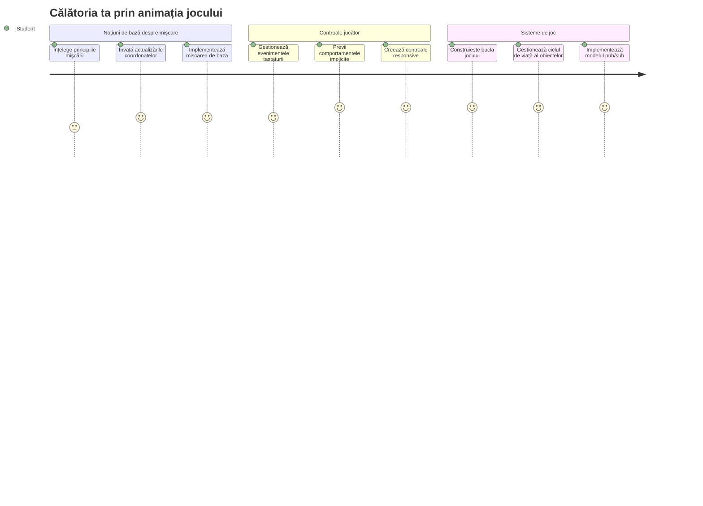
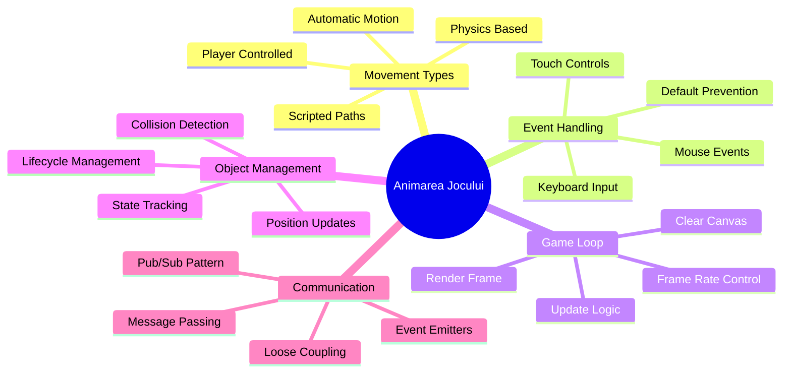
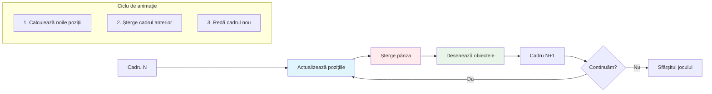
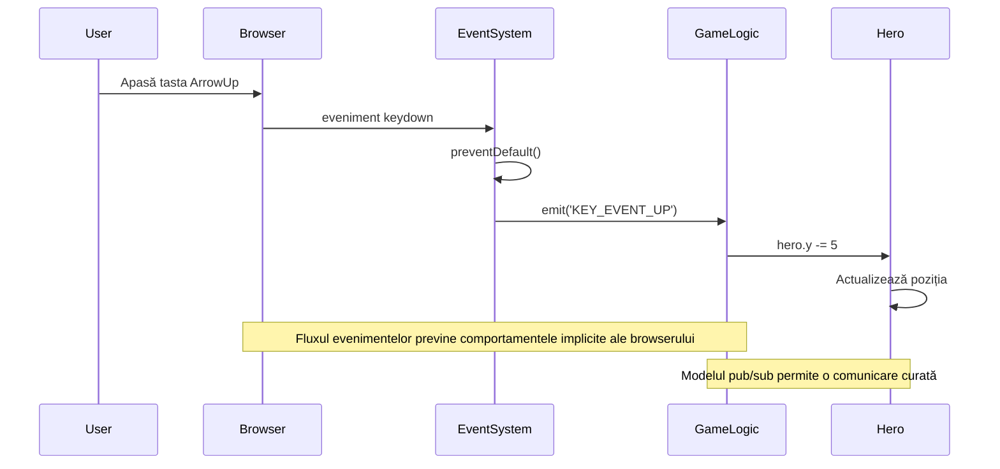
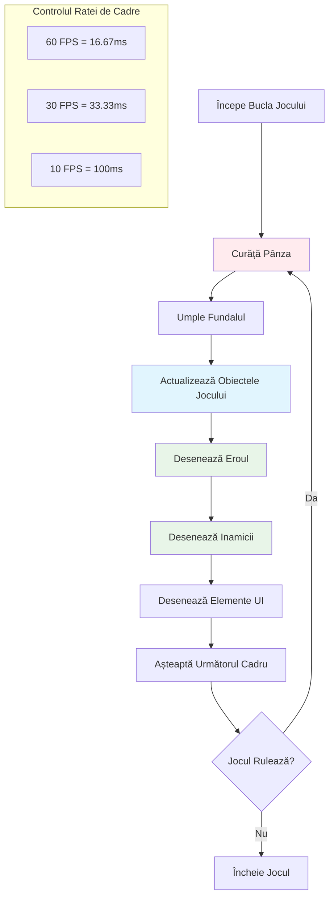
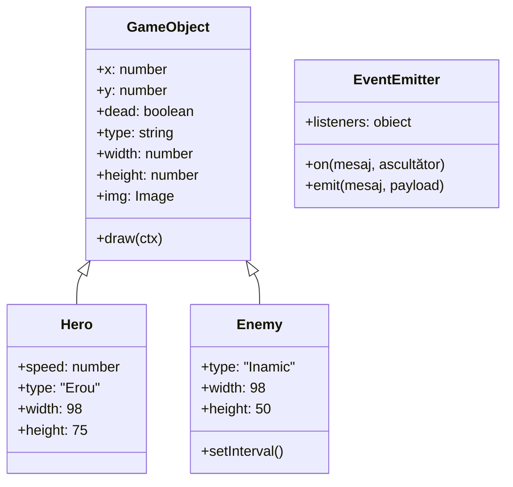
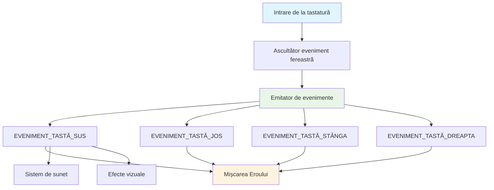
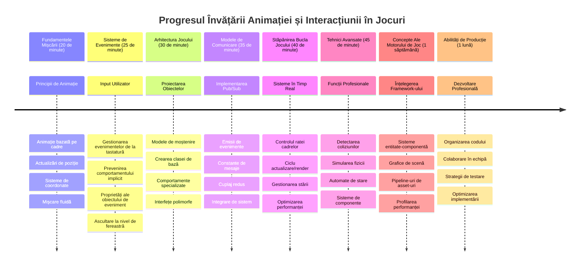

# Construiește un joc spațial Partea 3: Adăugarea Mișcării


Gândește-te la jocurile tale preferate – ceea ce le face captivante nu sunt doar grafica frumoasă, ci modul în care totul se mișcă și răspunde la acțiunile tale. Acum, jocul tău spațial este ca o pictură frumoasă, dar suntem pe cale să adăugăm mișcare care îi dă viață.

Când inginerii NASA au programat computerul de ghidare pentru misiunile Apollo, s-au confruntat cu o provocare similară: cum faci o navă spațială să răspundă la comenzile pilotului în timp ce menține automat corectarea traiectoriei? Principiile pe care le vom învăța astăzi reflectă aceleași concepte – gestionarea mișcării controlate de jucător împreună cu comportamentele automate ale sistemului.

În această lecție, vei învăța cum să faci navele spațiale să alunece pe ecran, să răspundă la comenzile jucătorului și să creezi tipare de mișcare fluide. Vom descompune totul în concepte gestionabile care se construiesc natural unul pe celălalt.

La final, jucătorii își vor pilota nava erou pe ecran în timp ce vasele inamice patrulează deasupra. Mai important, vei înțelege principiile fundamentale care alimentează sistemele de mișcare ale jocurilor.


## Chestionar pre-lectură

[Chestionar pre-lectură](https://ff-quizzes.netlify.app/web/quiz/33)

## Înțelegerea mișcării în jocuri

Jocurile prind viață când lucrurile încep să se miște, iar în esență există două moduri în care se întâmplă asta:

- **Mișcare controlată de jucător**: Când apeși o tastă sau dai click cu mouse-ul, ceva se mișcă. Aceasta este conexiunea directă între tine și lumea jocului tău.
- **Mișcare automată**: Când jocul însuși decide să miște lucrurile – cum ar fi vasele inamice care trebuie să patruleze ecranul indiferent dacă faci ceva sau nu.

Făcutul obiectelor să se miște pe un ecran de computer este mai simplu decât ai putea crede. Ți-aduci aminte de coordonatele x și y din ora de matematică? Exact cu asta lucrăm aici. Când Galileo a urmărit lunile lui Jupiter în 1610, practic făcea același lucru – plota poziții în timp pentru a înțelege tiparele de mișcare.

Mișcarea lucrurilor pe ecran este ca să creezi o animație dintr-o carte de flip – trebuie să urmezi acești trei pași simpli:


1. **Actualizează poziția** – Schimbă locul unde ar trebui să fie obiectul tău (poate mută-l 5 pixeli spre dreapta)
2. **Șterge cadrul vechi** – Curăță ecranul ca să nu vezi urme fantomatice peste tot
3. **Desenează cadrul nou** – Pune obiectul tău în noua lui poziție

Fă asta suficient de rapid și bam! Ai mișcare fluidă care se simte naturală pentru jucători.

Iată cum ar putea arăta în cod:

```javascript
// Setează locația eroului
hero.x += 5;
// Curăță dreptunghiul care găzduiește eroul
ctx.clearRect(0, 0, canvas.width, canvas.height);
// Re-desenează fundalul jocului și eroul
ctx.fillRect(0, 0, canvas.width, canvas.height);
ctx.fillStyle = "black";
ctx.drawImage(heroImg, hero.x, hero.y);
```

**Acesta este ce face acest cod:**
- **Actualizează** coordonata x a eroului cu 5 pixeli pentru a-l mișca orizontal
- **Curăță** întreaga zonă a canvas-ului pentru a elimina cadrul anterior
- **Umple** canvas-ul cu o culoare de fundal neagră
- **Redesenază** imaginea eroului în noua poziție

✅ Te poți gândi la un motiv pentru care redessinarea eroului de mai multe cadre pe secundă ar putea implica costuri de performanță? Citește despre [alternative la acest tipar](https://developer.mozilla.org/en-US/docs/Web/API/Canvas_API/Tutorial/Optimizing_canvas).

## Gestionarea evenimentelor de la tastatură

Aici conectăm intrarea jucătorului la acțiunea din joc. Când cineva apasă bara de spațiu pentru a trage cu laserul sau apasă o săgeată pentru a evita un asteroid, jocul tău trebuie să detecteze și să răspundă la acea intrare.

Evenimentele de la tastatură se întâmplă la nivel de fereastră, ceea ce înseamnă că întregul tău browser ascultă acele apăsări de taste. Click-urile cu mouse-ul, pe de altă parte, pot fi legate de elemente specifice (cum ar fi apăsarea unui buton). Pentru jocul nostru spațial, ne vom concentra pe controlul prin tastatură deoarece acesta oferă jucătorilor sentimentul clasic de arcade.

Aceasta îmi amintește de modul în care operatorii telegrafici din anii 1800 trebuiau să traducă intrările în cod Morse în mesaje semnificative – noi facem ceva similar, traducând apăsările tastelor în comenzi de joc.

Pentru a gestiona un eveniment trebuie să folosești metoda `addEventListener()` a ferestrei și să îi oferi doi parametri de intrare. Primul este numele evenimentului, de exemplu `keyup`. Al doilea este funcția care trebuie invocată ca rezultat al apariției evenimentului.

Iată un exemplu:

```javascript
window.addEventListener('keyup', (evt) => {
  // evt.key = reprezentarea sub formă de șir a tastei
  if (evt.key === 'ArrowUp') {
    // fă ceva
  }
});
```

**Descompunerea a ceea ce se întâmplă aici:**
- **Ascultă** evenimente de tastatură pe întreaga fereastră
- **Captează** obiectul de eveniment care conține informații despre tasta apăsată
- **Verifică** dacă tasta apăsată corespunde unei taste specifice (în acest caz, săgeata sus)
- **Execută** codul când condiția este îndeplinită

Pentru evenimentele tastaturii sunt două proprietăți ale evenimentului pe care le poți folosi pentru a vedea ce tastă a fost apăsată:

- `key` - este o reprezentare ca șir a tastei apăsate, de exemplu `'ArrowUp'`
- `keyCode` - este o reprezentare numerică, de exemplu `37`, corespunde tastei `ArrowLeft`

✅ Manipularea evenimentelor tastaturii este utilă și în afara dezvoltării jocurilor. La ce alte scopuri te poți gândi pentru această tehnică?


### Taste speciale: un avertisment!

Unele taste au comportamente implicite în browser care pot interfera cu jocul tău. Tastele săgeată derulează pagina iar bara de spațiu face sări – comportamente nedorite când cineva încearcă să piloteze nava spațială.

Putem preveni aceste comportamente implicite și lăsa jocul să gestioneze intrarea în schimb. Este similar cu modul în care primii programatori de computere trebuiau să suprascrie întreruperile sistemului pentru a crea comportamente personalizate – noi facem asta la nivel de browser. Iată cum:

```javascript
const onKeyDown = function (e) {
  console.log(e.keyCode);
  switch (e.keyCode) {
    case 37:
    case 39:
    case 38:
    case 40: // Tastele săgeată
    case 32:
      e.preventDefault();
      break; // Spațiu
    default:
      break; // nu bloca alte taste
  }
};

window.addEventListener('keydown', onKeyDown);
```

**Înțelegerea acestui cod de prevenire:**
- **Verifică** coduri de taste specifice care ar putea cauza comportamente nedorite ale browserului
- **Previne** comportamentul implicit al browserului pentru tastele săgeată și bara de spațiu
- **Permite** altor taste să funcționeze normal
- **Folosește** `e.preventDefault()` pentru a opri comportamentul încorporat al browserului

### 🔄 **Verificare pedagogică**
**Înțelegerea gestionării evenimentelor**: Înainte de a trece la mișcarea automată, asigură-te că poți:
- ✅ Explica diferența dintre evenimentele `keydown` și `keyup`
- ✅ Înțelege de ce prevenim comportamentele implicite ale browserului
- ✅ Descrie cum ascultătorii de evenimente conectează intrarea utilizatorului la logica jocului
- ✅ Identifica ce taste ar putea interfera cu controalele jocului

**Test rapid de auto-verificare**: Ce s-ar întâmpla dacă nu ai preveni comportamentul implicit pentru tastele săgeată?
*Răspuns: Browserul ar derula pagina, interferând cu mișcarea din joc*

**Arhitectura sistemului de evenimente**: Acum înțelegi:
- **Ascultarea la nivel de fereastră**: Capturarea evenimentelor la nivelul browserului
- **Proprietățile obiectului eveniment**: șiruri `key` vs numere `keyCode`
- **Prevenirea comportamentelor implicite**: Oprirea comportamentelor nedorite ale browserului
- **Logica condițională**: Răspunsul la combinații specifice de taste

## Mișcare cauzată de joc

Acum să vorbim despre obiecte care se mișcă fără comanda jucătorului. Gândește-te la navele inamice care croiesc drum pe ecran, gloanțe care zboară în linii drepte sau nori care plutesc în fundal. Această mișcare autonomă face lumea jocului tău să pară vie chiar și când nimeni nu atinge comenzile.

Folosim temporizatoarele încorporate ale JavaScript pentru a actualiza pozițiile la intervale regulate. Acest concept este asemănător modului în care ceasurile cu pendul funcționează – un mecanism regulat care declanșează acțiuni repetate, la intervale de timp. Iată cât de simplu poate fi:

```javascript
const id = setInterval(() => {
  // Mută inamicul pe axa y
  enemy.y += 10;
}, 100);
```

**Ce face acest cod de mișcare:**
- **Creează** un temporizator care rulează la fiecare 100 milisecunde
- **Actualizează** coordonata y a inamicului cu 10 pixeli de fiecare dată
- **Stochează** ID-ul intervalului ca să-l putem opri apoi dacă e nevoie
- **Muta** inamicul în jos pe ecran în mod automat

## Bucla jocului

Iată conceptul care leagă totul – bucla jocului. Dacă jocul tău ar fi un film, bucla jocului ar fi proiectoul de film, care afișează cadru după cadru atât de repede încât totul pare a se mișca fluid.

Fiecare joc are una dintre aceste bucle care rulează în fundal. Este o funcție care actualizează toate obiectele din joc, redesenează ecranul și repetă acest proces continuu. Ea ține evidența eroului tău, a tuturor inamicilor, a oricăror lasere care zboară – întreg starea jocului.

Acest concept îmi amintește de cum animatorii filmelor timpurii precum Walt Disney trebuiau să redeseneze cadrele personajelor pentru a crea iluzia mișcării. Facem același lucru, doar cu cod în loc de creioane.

Iată cum ar putea arăta o buclă tipică de joc, exprimată în cod:


```javascript
const gameLoopId = setInterval(() => {
  function gameLoop() {
    ctx.clearRect(0, 0, canvas.width, canvas.height);
    ctx.fillStyle = "black";
    ctx.fillRect(0, 0, canvas.width, canvas.height);
    drawHero();
    drawEnemies();
    drawStaticObjects();
  }
  gameLoop();
}, 200);
```

**Înțelegerea structurii buclei jocului:**
- **Curăță** întreg canvas-ul pentru a elimina cadrul anterior
- **Umple** fundalul cu o culoare solidă
- **Desenează** toate obiectele jocului în pozițiile lor curente
- **Repetă** acest proces la fiecare 200 milisecunde pentru a crea o animație fluidă
- **Gestionează** viteza cadrelor controlând timpul intervalului

## Continuarea jocului spațial

Acum vom adăuga mișcare scenei statice pe care ai construit-o anterior. Vom transforma o captură de ecran într-o experiență interactivă. Vom parcurge pas cu pas pentru a asigura că fiecare parte se construiește pe ce a fost pus înainte.

Ia codul de unde am rămas în lecția precedentă (sau începe cu codul din folderul [Part II- starter](../../../../6-space-game/3-moving-elements-around/your-work) dacă ai nevoie de un început nou).

**Iată ce construim astăzi:**
- **Controale erou**: Tastele săgeată vor pilota nava ta spațială pe ecran
- **Mișcare inamic**: Navele extraterestre vor începe avansul

Să începem să implementăm aceste funcționalități.

## Pași recomandați

Găsește fișierele care ți-au fost create în sub-folderul `your-work`. Ar trebui să conțină următoarele:

```bash
-| assets
  -| enemyShip.png
  -| player.png
-| index.html
-| app.js
-| package.json
```

Pornești proiectul în folderul `your-work` tastând:

```bash
cd your-work
npm start
```

**Ce face această comandă:**
- **Navighează** către directorul proiectului tău
- **Pornește** un server HTTP la adresa `http://localhost:5000`
- **Servește** fișierele jocului ca să le poți testa în browser

Comanda de mai sus va porni un server HTTP la adresa `http://localhost:5000`. Deschide un browser și introdu acea adresă, ar trebui să afișeze eroul și toți inamicii; nimic nu se mișcă – încă!

### Adăugare cod

1. **Adaugă obiecte dedicate** pentru `hero` și `enemy` și `game object`, acestea ar trebui să aibă proprietăți `x` și `y`. (Amintește-ți partea despre [Moștenire sau compoziție](../README.md)).

   *SUGESTIE* `game object` ar trebui să fie cel cu `x` și `y` și cu abilitatea de a se desena singur pe canvas.

   > **Sfaturi**: Începe prin a adăuga o nouă clasă `GameObject` cu constructorul delimitat ca mai jos, apoi deseneaz-o pe canvas:

    ```javascript
    class GameObject {
      constructor(x, y) {
        this.x = x;
        this.y = y;
        this.dead = false;
        this.type = "";
        this.width = 0;
        this.height = 0;
        this.img = undefined;
      }
    
      draw(ctx) {
        ctx.drawImage(this.img, this.x, this.y, this.width, this.height);
      }
    }
    ```

    **Înțelegerea acestei clase de bază:**
    - **Definește** proprietăți comune pe care le împart toate obiectele din joc (poziție, dimensiune, imagine)
    - **Include** un semnalizator `dead` pentru a urmări dacă obiectul trebuie eliminat
    - **Oferă** o metodă `draw()` care redă obiectul pe canvas
    - **Setează** valori implicite pentru toate proprietățile pe care clasele copil le pot suprascrie


    Acum, extinde această `GameObject` pentru a crea `Hero` și `Enemy`:
    
    ```javascript
    class Hero extends GameObject {
      constructor(x, y) {
        super(x, y);
        this.width = 98;
        this.height = 75;
        this.type = "Hero";
        this.speed = 5;
      }
    }
    ```

    ```javascript
    class Enemy extends GameObject {
      constructor(x, y) {
        super(x, y);
        this.width = 98;
        this.height = 50;
        this.type = "Enemy";
        const id = setInterval(() => {
          if (this.y < canvas.height - this.height) {
            this.y += 5;
          } else {
            console.log('Stopped at', this.y);
            clearInterval(id);
          }
        }, 300);
      }
    }
    ```

    **Concepte cheie în aceste clase:**
    - **Moștenește** de la `GameObject` folosind cuvântul cheie `extends`
    - **Apelează** constructorul părinte cu `super(x, y)`
    - **Setează** dimensiuni și proprietăți specifice fiecărui tip de obiect
    - **Implementează** mișcare automată pentru inamici folosind `setInterval()`

2. **Adaugă gestori de evenimente pentru taste** pentru a manevra navigarea prin taste (mișcă eroul sus/jos/stânga/dreapta)

   *AMINTEȘTE-ȚI* este un sistem cartezian, colțul din stânga sus este `0,0`. De asemenea, amintește-ți să adaugi cod pentru a opri *comportamentul implicit*

   > **Sfaturi**: Creează funcția ta `onKeyDown` și atașeaz-o la fereastră:

   ```javascript
   const onKeyDown = function (e) {
     console.log(e.keyCode);
     // Adaugă codul din lecția de mai sus pentru a opri comportamentul implicit
     switch (e.keyCode) {
       case 37:
       case 39:
       case 38:
       case 40: // Tastele săgeți
       case 32:
         e.preventDefault();
         break; // Spațiu
       default:
         break; // nu bloca alte taste
     }
   };

   window.addEventListener("keydown", onKeyDown);
   ```
    
   **Ce face acest handler de eveniment:**
   - **Ascultă** pentru evenimente de tip keydown pe întreaga fereastră
   - **Înregistrează** codul tastei pentru a te ajuta la depanare ce taste sunt apăsate
   - **Previne** comportamentul implicit al browserului la tastele săgeată și bara de spațiu
   - **Permite** altor taste să funcționeze normal
   
   Verifică consola browserului tău în acest punct și urmărește cum sunt înregistrate apăsările de taste. 

3. **Implementează** [paternul Publish-Subscribe](../README.md), acesta va păstra codul curat pe măsură ce parcurgi restul părților.

   Paternul Publish-Subscribe ajută la organizarea codului prin separarea detectării evenimentelor de gestionarea lor. Aceasta face codul tău mai modular și mai ușor de întreținut.

   Pentru această ultimă parte, poți:

   1. **Adaugă un ascultător de evenimente** pe fereastră:

       ```javascript
       window.addEventListener("keyup", (evt) => {
         if (evt.key === "ArrowUp") {
           eventEmitter.emit(Messages.KEY_EVENT_UP);
         } else if (evt.key === "ArrowDown") {
           eventEmitter.emit(Messages.KEY_EVENT_DOWN);
         } else if (evt.key === "ArrowLeft") {
           eventEmitter.emit(Messages.KEY_EVENT_LEFT);
         } else if (evt.key === "ArrowRight") {
           eventEmitter.emit(Messages.KEY_EVENT_RIGHT);
         }
       });
       ```

   **Ce face acest sistem de evenimente:**
   - **Detectează** intrarea de la tastatură și o convertește în evenimente personalizate de joc
   - **Separă** detectarea intrării de logica jocului
   - **Face** ușor de schimbat controalele mai târziu fără a afecta codul jocului
   - **Permite** ca mai multe sisteme să răspundă la aceeași intrare


   2. **Creează o clasă EventEmitter** pentru a publica și abona mesaje:

       ```javascript
       class EventEmitter {
         constructor() {
           this.listeners = {};
         }
       
         on(message, listener) {
           if (!this.listeners[message]) {
             this.listeners[message] = [];
           }
           this.listeners[message].push(listener);
         }
       
   3. **Adaugă constante** și configurează EventEmitter-ul:

       ```javascript
       const Messages = {
         KEY_EVENT_UP: "KEY_EVENT_UP",
         KEY_EVENT_DOWN: "KEY_EVENT_DOWN",
         KEY_EVENT_LEFT: "KEY_EVENT_LEFT",
         KEY_EVENT_RIGHT: "KEY_EVENT_RIGHT",
       };
       
       let heroImg, 
           enemyImg, 
           laserImg,
           canvas, ctx, 
           gameObjects = [], 
           hero, 
           eventEmitter = new EventEmitter();
       ```

   **Înțelegerea setărilor:**
   - **Definește** constante de mesaje pentru a evita greșelile de tastare și pentru a face refactorizarea mai ușoară
   - **Declară** variabile pentru imagini, contextul canvas-ului și starea jocului
   - **Creează** un event emitter global pentru sistemul pub-sub
   - **Initializează** un array pentru a ține toate obiectele jocului

   4. **Inițializează jocul**

       ```javascript
       function initGame() {
         gameObjects = [];
         createEnemies();
         createHero();
       
         eventEmitter.on(Messages.KEY_EVENT_UP, () => {
           hero.y -= 5;
         });
       
         eventEmitter.on(Messages.KEY_EVENT_DOWN, () => {
           hero.y += 5;
         });
       
         eventEmitter.on(Messages.KEY_EVENT_LEFT, () => {
           hero.x -= 5;
         });
       
4. **Configurează bucla jocului**

   Restructurează funcția `window.onload` pentru a inițializa jocul și a seta o buclă de joc la un interval potrivit. Vei adăuga și un fascicul laser:

    ```javascript
    window.onload = async () => {
      canvas = document.getElementById("canvas");
      ctx = canvas.getContext("2d");
      heroImg = await loadTexture("assets/player.png");
      enemyImg = await loadTexture("assets/enemyShip.png");
      laserImg = await loadTexture("assets/laserRed.png");
    
      initGame();
      const gameLoopId = setInterval(() => {
        ctx.clearRect(0, 0, canvas.width, canvas.height);
        ctx.fillStyle = "black";
        ctx.fillRect(0, 0, canvas.width, canvas.height);
        drawGameObjects(ctx);
      }, 100);
    };
    ```

   **Înțelegerea configurării jocului:**
   - **Așteaptă** ca pagina să se încarce complet înainte de a începe
   - **Ia** elementul canvas și contextul său de randare 2D
   - **Încarcă** toate resursele de imagine asincron folosind `await`
   - **Pornește** bucla jocului care rulează la intervale de 100ms (10 FPS)
   - **Șterge** și redesenează întregul ecran la fiecare cadru

5. **Adaugă cod** pentru a mișca inamicii la un anumit interval

    Restructurează funcția `createEnemies()` pentru a crea inamicii și a-i împinge în noua clasă gameObjects:

    ```javascript
    function createEnemies() {
      const MONSTER_TOTAL = 5;
      const MONSTER_WIDTH = MONSTER_TOTAL * 98;
      const START_X = (canvas.width - MONSTER_WIDTH) / 2;
      const STOP_X = START_X + MONSTER_WIDTH;
    
      for (let x = START_X; x < STOP_X; x += 98) {
        for (let y = 0; y < 50 * 5; y += 50) {
          const enemy = new Enemy(x, y);
          enemy.img = enemyImg;
          gameObjects.push(enemy);
        }
      }
    }
    ```

    **Ce face crearea inamicilor:**
    - **Calculează** pozițiile pentru a centra inamicii pe ecran
    - **Creează** o grilă de inamici folosind bucle imbricate
    - **Atribuie** imaginea inamicului fiecărui obiect inamic
    - **Adaugă** fiecare inamic în array-ul global de obiecte de joc
    
    și adaugă o funcție `createHero()` pentru a face un proces similar pentru erou.
    
    ```javascript
    function createHero() {
      hero = new Hero(
        canvas.width / 2 - 45,
        canvas.height - canvas.height / 4
      );
      hero.img = heroImg;
      gameObjects.push(hero);
    }
    ```

    **Ce face crearea eroului:**
    - **Poziționează** eroul în partea de jos, în centru pe ecran
    - **Atribuie** imaginea eroului obiectului erou
    - **Adaugă** eroul în array-ul de obiecte de joc pentru redare

    și în final, adaugă o funcție `drawGameObjects()` pentru a începe desenarea:

    ```javascript
    function drawGameObjects(ctx) {
      gameObjects.forEach(go => go.draw(ctx));
    }
    ```

    **Înțelegerea funcției de desenare:**
    - **Parcurge** toate obiectele de joc din array
    - **Apelează** metoda `draw()` pe fiecare obiect
    - **Transmite** contextul canvas pentru ca obiectele să se poată reda singure

    ### 🔄 **Verificare Pedagogică**
    **Înțelegere completă a sistemului jocului**: Verifică stăpânirea ta asupra întregii arhitecturi:
    - ✅ Cum permite moștenirea ca Hero și Enemy să împartă proprietăți comune GameObject?
    - ✅ De ce face pattern-ul pub/sub codul tău mai ușor de întreținut?
    - ✅ Ce rol are bucla jocului în crearea unei animații fluide?
    - ✅ Cum conectează event listener-ele intrarea utilizatorului la comportamentul obiectelor de joc?

    **Integrarea sistemului**: Jocul tău demonstrează acum:
    - **Design orientat pe obiecte**: Clase de bază cu moșteniri specializate
    - **Arhitectură bazată pe evenimente**: Pattern pub/sub pentru cuplare slabă
    - **Cadru de animație**: Buclă de joc cu actualizări consistente ale cadrelor
    - **Gestionare intrări**: Evenimente de tastatură cu prevenirea comportamentului implicit
    - **Gestionare resurse**: Încărcare imagini și redare sprite-uri

    **Pattern-uri profesionale**: Ai implementat:
    - **Separarea responsabilităților**: Intrări, logică și redare separate
    - **Polimorfism**: Toate obiectele de joc împart interfață comună de desenare
    - **Transmiterea mesajelor**: Comunicare curată între componente
    - **Gestionare resurse**: Manipulare eficientă a sprite-urilor și animațiilor

    Inamicii tăi ar trebui să înceapă să avanseze către nava ta erou!
      }
    }
    ```
    
    and add a `createHero()` function to do a similar process for the hero.
    
    ```javascript
    function createHero() {
      hero = new Hero(
        canvas.width / 2 - 45,
        canvas.height - canvas.height / 4
      );
      hero.img = heroImg;
      gameObjects.push(hero);
    }
    ```

    și în final, adaugă o funcție `drawGameObjects()` pentru a începe desenarea:

    ```javascript
    function drawGameObjects(ctx) {
      gameObjects.forEach(go => go.draw(ctx));
    }
    ```

    Inamicii tăi ar trebui să înceapă să avanseze către nava ta erou!

---

## Provocarea Agentului GitHub Copilot 🚀

Iată o provocare care va îmbunătăți rafinamentul jocului tău: adăugarea limitelor și controalelor fluide. În prezent, eroul tău poate ieși de pe ecran, iar mișcarea poate părea sacadată.

**Misiunea ta:** Fă ca nava ta spațială să se simtă mai realistă implementând limite de ecran și o mișcare fluidă. Este similar cu modul în care sistemele de control al zborului NASA împiedică navele spațiale să depășească parametrii operaționali siguri.

**Ce trebuie să construiești:** Creează un sistem care să țină nava erou pe ecran și fă controalele să fie fluide. Când jucătorii țin apăsată o tastă săgeată, nava ar trebui să alunece continuu, nu să se miște prin pași discreți. Ia în considerare adăugarea unui feedback vizual când nava atinge limitele ecranului – poate un efect subtil pentru a indica marginea zonei de joc.

Află mai multe despre [agent mode](https://code.visualstudio.com/blogs/2025/02/24/introducing-copilot-agent-mode) aici.

## 🚀 Provocare

Organizarea codului devine din ce în ce mai importantă pe măsură ce proiectele cresc. Probabil ai observat că fișierul tău s-a aglomerat cu funcții, variabile și clase amestecate. Aceasta îmi amintește de cum inginerii care au organizat codul misiunii Apollo au trebuit să creeze sisteme clare și întreținute, la care mai multe echipe puteau lucra simultan.

**Misiunea ta:**
Gândește ca un arhitect software. Cum ți-ai organiza codul astfel încât peste șase luni, tu (sau un coleg) să poată înțelege ce se întâmplă? Chiar dacă totul rămâne într-un fișier deocamdată, poți crea o organizare mai bună:

- **Gruparea funcțiilor conexe** cu antete clare de comentarii
- **Separarea responsabilităților** - păstrează logica jocului separată de redare
- **Folosirea convențiilor consistente de denumire** pentru variabile și funcții
- **Crearea de module** sau namespace-uri pentru organizarea diferitelor aspecte ale jocului
- **Adăugarea de documentație** care explică scopul fiecărei secțiuni majore

**Întrebări de reflecție:**
- Care părți din cod îți sunt cele mai greu de înțeles când te întorci la ele?
- Cum ai putea organiza codul pentru a face mai ușoară contribuția altora?
- Ce se întâmplă dacă vrei să adaugi noi funcționalități precum power-up-uri sau tipuri diferite de inamici?

## Quiz Post-Prelegere

[Quiz post-prelegere](https://ff-quizzes.netlify.app/web/quiz/34)

## Recapitulare & Auto-Studii

Am construit totul de la zero, ceea ce e minunat pentru învățare, dar iată un mic secret – există niște framework-uri JavaScript uimitoare care pot gestiona mult din munca grea pentru tine. Odată ce te simți confortabil cu fundamentele parcurse, merită să [explorezi ce e disponibil](https://github.com/collections/javascript-game-engines).

Gândește-te la framework-uri ca la o cutie de unelte bine aprovizionată în loc să faci fiecare unealtă manual. Ele pot rezolva multe dintre provocările organizării codului de care am vorbit, plus oferă funcții care ți-ar lua săptămâni să le construiești singur.

**Lucruri demne de explorat:**
- Cum organizează motoarele de jocuri codul – vei fi uimit de pattern-urile inteligente pe care le folosesc
- Trucuri de performanță pentru a face jocurile pe canvas să ruleze foarte fluent  
- Funcționalități moderne JavaScript care pot face codul tău mai curat și întreținut
- Abordări diferite pentru gestionarea obiectelor de joc și relațiile lor

## 🎯 Cronologia Stăpânirii Animației Jocului Tău


### 🛠️ Rezumatul Kit-ului Tău de Dezvoltare a Jocului

După finalizarea acestei lecții, ai stăpânit acum:
- **Principii de animație**: Mișcare bazată pe cadre și tranziții fluide
- **Programare bazată pe evenimente**: Gestionarea input-ului de tastatură cu management corect al evenimentelor
- **Design orientat pe obiecte**: Ierarhii de moștenire și interfețe polimorfice
- **Pattern-uri de comunicare**: Arhitectură pub/sub pentru un cod ușor de întreținut
- **Arhitectura buclei jocului**: Ciclu de actualizare și randare în timp real
- **Sisteme de input**: Maparea controalelor utilizatorului cu prevenirea comportamentului implicit
- **Gestionarea resurselor**: Încărcarea sprite-urilor și tehnici eficiente de randare

### ⚡ **Ce poți face în următoarele 5 minute**
- [ ] Deschide consola browser-ului și încearcă `addEventListener('keydown', console.log)` pentru a vedea evenimente de tastatură
- [ ] Creează un element div simplu și mută-l folosind tastele săgeată
- [ ] Experimentează cu `setInterval` pentru a crea mișcare continuă
- [ ] Încearcă să previi comportamentul implicit cu `event.preventDefault()`

### 🎯 **Ce poți realiza în această oră**
- [ ] Finalizează quiz-ul post-lectură și înțelege programarea bazată pe evenimente
- [ ] Construiește nava erou cu mișcare completă la tastatură
- [ ] Implementează modele fluide de mișcare pentru inamici
- [ ] Adaugă limite pentru a preveni ieșirea obiectelor de pe ecran
- [ ] Creează detecție de coliziune de bază între obiectele jocului

### 📅 **Călătoria ta de o săptămână în animație**
- [ ] Finalizează jocul complet spațial cu mișcări și interacțiuni rafinate
- [ ] Adaugă modele avansate de mișcare: curbe, accelerare și fizică
- [ ] Implementează tranziții fluide și funcții easing
- [ ] Creează efecte de particule și sisteme de feedback vizual
- [ ] Optimizează performanța jocului pentru rulare fluentă la 60fps
- [ ] Adaugă controale tactile pentru mobil și design responsive

### 🌟 **Dezvoltarea ta interactivă pe o lună**
- [ ] Construiește aplicații interactive complexe cu sisteme avansate de animație
- [ ] Învață biblioteci de animație precum GSAP sau creează-ți propriul motor de animație
- [ ] Contribuie la proiecte opensource de dezvoltare jocuri și animație
- [ ] Stăpânește optimizarea performanței pentru aplicații grafice intensive
- [ ] Creează conținut educațional despre dezvoltarea jocurilor și animație
- [ ] Construiește un portofoliu demonstrativ pentru abilități avansate de programare interactivă

**Aplicații în lumea reală**: Abilitățile tale de animație în jocuri se aplică direct la:
- **Aplicații web interactive**: Dashboard-uri dinamice și interfețe în timp real
- **Vizualizare de date**: Grafice animate și grafică interactivă
- **Software educațional**: Simulări interactive și instrumente de învățare
- **Dezvoltare mobilă**: Jocuri cu control tactil și gesturi
- **Aplicații desktop**: Aplicații Electron cu animații fluide
- **Animații web**: Biblioteci CSS și JavaScript pentru animații

**Competențe profesionale dobândite**: Acum poți:
- **Proiecta** sisteme bazate pe evenimente care se scalează cu complexitatea
- **Implementa** animații fluide folosind principii matematice
- **Depana** sisteme complexe de interacțiune cu unelte de dezvoltare browser
- **Optimiza** performanța jocului pe diverse dispozitive și browsere
- **Concepe** structuri de cod întreținute folosind pattern-uri dovedite

**Concepte de dezvoltare joc stăpânite**:
- **Gestionarea ratei de cadre**: Înțelegerea FPS și controlul temporizării
- **Gestionarea input-ului**: Sisteme de tastatură și evenimente cross-platform
- **Ciclul de viață al obiectelor**: Modele de creare, actualizare și distrugere
- **Sincronizarea stărilor**: Menținerea consistenței stării jocului între cadre
- **Arhitectura evenimentelor**: Comunicare decuplată între sisteme de joc

**Nivel următor**: Ești gata să adaugi detecție coliziuni, sisteme de punctaj, efecte sonore sau să explorezi framework-uri moderne de jocuri ca Phaser sau Three.js!

🌟 **Realizare deblocată**: Ai construit un sistem complet interactiv de joc cu pattern-uri profesionale de arhitectură!

## Tema

[Comentează codul tău](assignment.md)

---

<!-- CO-OP TRANSLATOR DISCLAIMER START -->
**Declinare de responsabilitate**:
Acest document a fost tradus folosind serviciul de traducere AI [Co-op Translator](https://github.com/Azure/co-op-translator). Deși ne străduim pentru acuratețe, vă rugăm să rețineți că traducerile automate pot conține erori sau inexactități. Documentul original în limba sa nativă trebuie considerat sursa autorizată. Pentru informații critice, se recomandă traducerea profesională realizată de un specialist uman. Nu ne asumăm responsabilitatea pentru orice neînțelegeri sau interpretări greșite care pot apărea în urma utilizării acestei traduceri.
<!-- CO-OP TRANSLATOR DISCLAIMER END -->