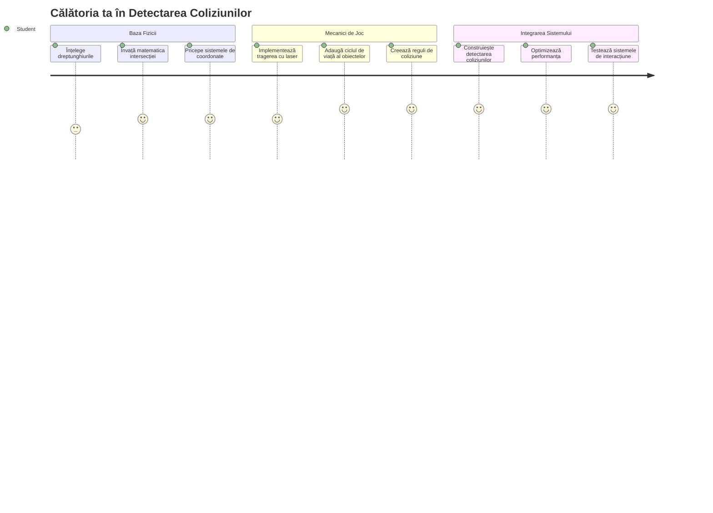
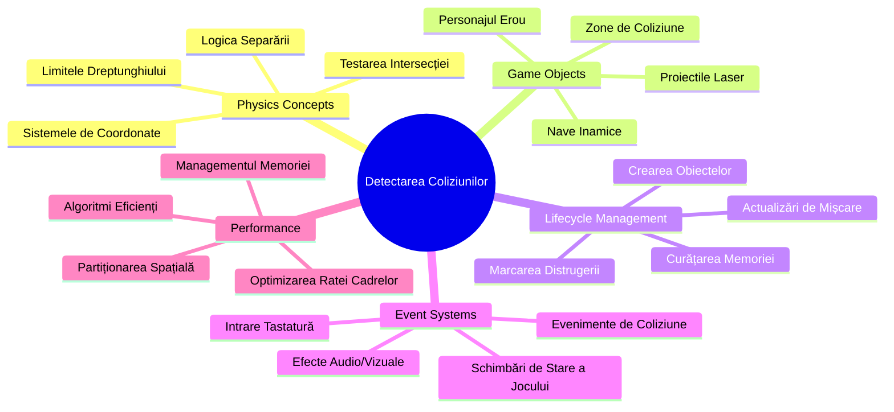
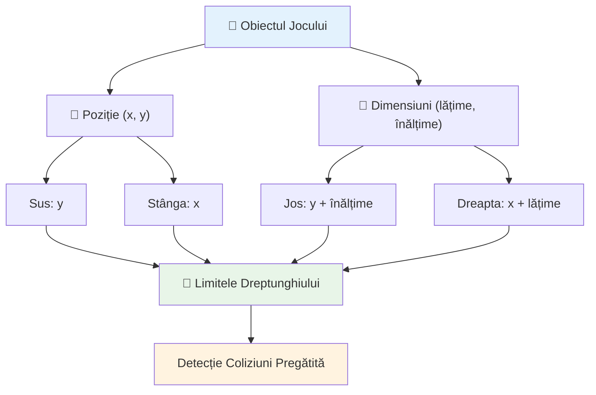
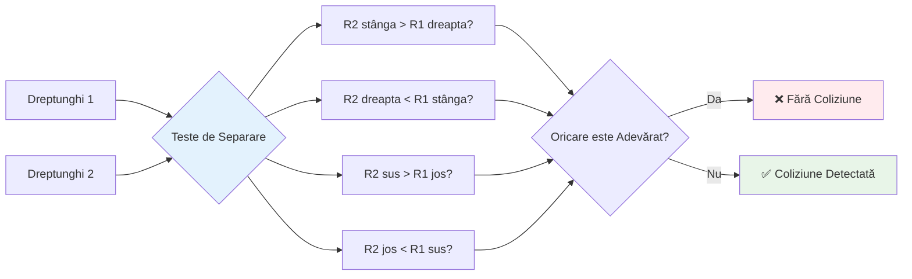
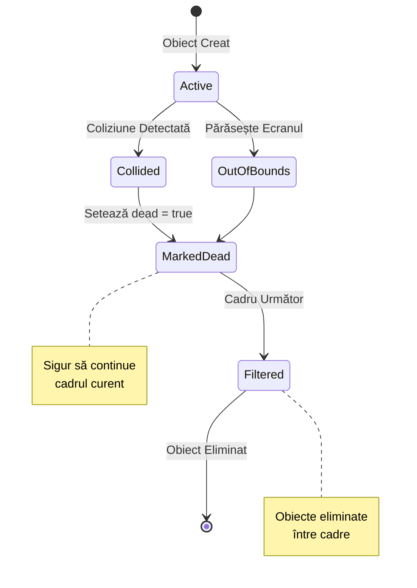
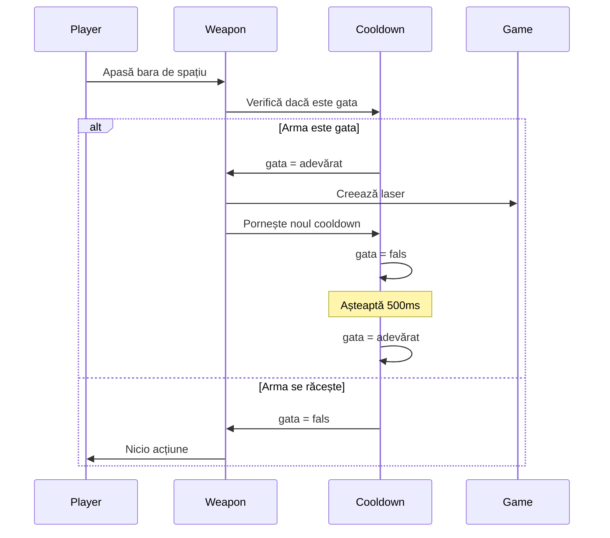
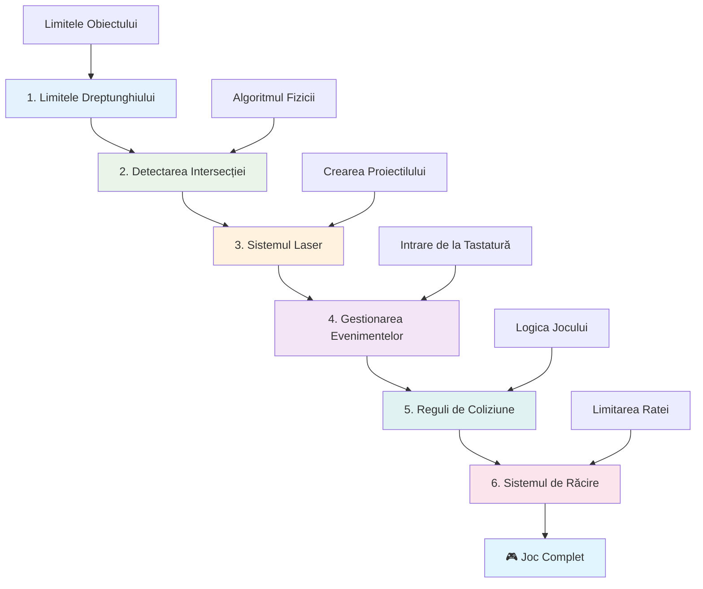
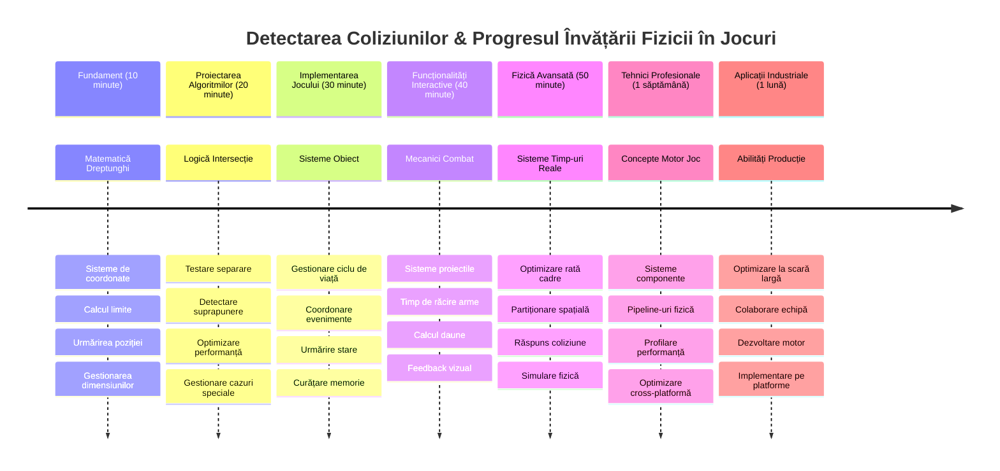

# Construiește un joc spațial Partea 4: Adăugarea unui laser și detectarea coliziunilor


## Chestionar pre-lectură

[Chestionar pre-lectură](https://ff-quizzes.netlify.app/web/quiz/35)

Gândește-te la momentul din Star Wars când torpilele proton ale lui Luke lovesc portul de evacuare al Stelei Morții. Acea detectare precisă a coliziunii a schimbat soarta galaxiei! În jocuri, detectarea coliziunilor funcționează la fel - determină când obiectele interacționează și ce se întâmplă apoi.

În această lecție, vei adăuga arme laser jocului tău spațial și vei implementa detectarea coliziunilor. Exact ca planificatorii misiunilor NASA care calculează traiectoriile navelor spațiale pentru a evita resturile, vei învăța să detectezi când obiectele de joc se intersectează. Vom descompune asta în pași gestionabili care se construiesc unul pe altul.

La final, vei avea un sistem de luptă funcțional în care laserele distrug inamicii și coliziunile declanșează evenimente în joc. Aceleași principii de coliziune sunt folosite în totul, de la simulări fizice la interfețe web interactive.


✅ Fă niște cercetări despre primul joc de calculator scris vreodată. Care a fost funcționalitatea sa?

## Detectarea coliziunilor

Detectarea coliziunilor funcționează ca senzorii de proximitate de pe modulul lunar Apollo - verifică constant distanțele și declanșează alerte când obiectele se apropie prea mult. În jocuri, acest sistem determină când obiectele interacționează și ce ar trebui să se întâmple apoi.

Abordarea pe care o vom folosi tratează fiecare obiect de joc ca un dreptunghi, similar cu modul în care sistemele de control al traficului aerian folosesc forme geometrice simplificate pentru a urmări aeronavele. Această metodă dreptunghiulară poate părea de bază, dar este eficientă din punct de vedere computațional și funcționează bine în majoritatea scenariilor de joc.

### Reprezentarea dreptunghiului

Fiecare obiect de joc are nevoie de limite de coordonate, similar cu modul în care roverul Mars Pathfinder și-a cartografiat locația pe suprafața marțiană. Iată cum definim aceste coordonate limită:


```javascript
rectFromGameObject() {
  return {
    top: this.y,
    left: this.x,
    bottom: this.y + this.height,
    right: this.x + this.width
  }
}
```

**Să despărțim asta:**
- **Marginea de sus**: Este locul unde începe obiectul tău vertical (poziția y)
- **Marginea stângă**: Unde începe orizontal (poziția x)
- **Marginea de jos**: Adaugi înălțimea la poziția y - acum știi unde se termină!
- **Marginea dreaptă**: Adaugi lățimea la poziția x - și ai limita completă

### Algoritmul de intersecție

Detectarea intersecțiilor dreptunghiurilor folosește o logică similară cu cea a Telescopului Spațial Hubble care determină dacă obiectele cerești se suprapun în câmpul său vizual. Algoritmul verifică separarea:


```javascript
function intersectRect(r1, r2) {
  return !(r2.left > r1.right ||
    r2.right < r1.left ||
    r2.top > r1.bottom ||
    r2.bottom < r1.top);
}
```

**Testul de separare funcționează ca sistemele radar:**
- Este dreptunghiul 2 complet la dreapta dreptunghiului 1?
- Este dreptunghiul 2 complet la stânga dreptunghiului 1?
- Este dreptunghiul 2 complet sub dreptunghiul 1?
- Este dreptunghiul 2 complet deasupra dreptunghiului 1?

Dacă niciuna dintre aceste condiții nu este adevărată, dreptunghiurile trebuie să se suprapună. Această abordare reflectă modul în care operatorii radar determină dacă două aeronave sunt la distanțe de siguranță.

## Gestionarea ciclului de viață al obiectelor

Când un laser lovește un inamic, ambele obiecte trebuie eliminate din joc. Totuși, ștergerea obiectelor în timpul unei iterări poate cauza căderi - o lecție învățată pe cale grea în sistemele timpurii de calculator, cum ar fi Calculatorul de Ghidare Apollo. În schimb, folosim o metodă de „marcare pentru ștergere” care elimină obiectele în siguranță între cadre.


Iată cum marcăm ceva pentru eliminare:

```javascript
// Marchează obiectul pentru eliminare
enemy.dead = true;
```

**De ce funcționează această abordare:**
- Marcăm obiectul ca „mort” dar nu îl ștergem imediat
- Permite cadrului curent de joc să se termine în siguranță
- Fără căderi cauzate de utilizarea unui obiect deja dispărut!

Apoi filtrăm obiectele marcate înainte de următorul ciclu de redare:

```javascript
gameObjects = gameObjects.filter(go => !go.dead);
```

**Ce face această filtrare:**
- Creează o listă nouă doar cu obiectele „vii”
- Elimină orice obiect marcat ca mort
- Păstrează jocul tău funcțional fără probleme
- Prevăine acumularea de obiecte distruse care ar consuma memorie

## Implementarea mecanicii laserului

Proiectilele laser din jocuri funcționează pe același principiu ca torpilele cu fotoni din Star Trek - obiecte discrete care călătoresc în linii drepte până lovesc ceva. Fiecare apăsare a barei spatiu creează un nou obiect laser care se mișcă pe ecran.

Pentru a face asta să funcționeze, trebuie să coordonăm câteva componente diferite:

**Componente cheie de implementat:**
- **Crearea** obiectelor laser care pornesc din poziția eroului
- **Gestionarea** input-ului de la tastatură pentru a declanșa crearea laserului
- **Administrarea** mișcării laserului și ciclului său de viață
- **Implementarea** reprezentării vizuale pentru proiectilele laser

## Implementarea controlului ratei de tragere

Ratele nelimitate de tragere ar copleși motorul jocului și ar face jocul prea ușor. Sistemele reale de arme se confruntă cu constrângeri similare - chiar și fazerele USS Enterprise necesitau timp să se reîncarce între lovituri.

Vom implementa un sistem de cooldown care împiedică spam-ul de tragere rapidă, menținând totuși controale responsive:


```javascript
class Cooldown {
  constructor(time) {
    this.cool = false;
    setTimeout(() => {
      this.cool = true;
    }, time);
  }
}

class Weapon {
  constructor() {
    this.cooldown = null;
  }
  
  fire() {
    if (!this.cooldown || this.cooldown.cool) {
      // Creează proiectil laser
      this.cooldown = new Cooldown(500);
    } else {
      // Arma se răcește încă
    }
  }
}
```

**Cum funcționează cooldown-ul:**
- Când este creat arma, aceasta începe „fierbinte” (nu poate trage încă)
- După perioada de timeout, devine „rece” (gata să tragă)
- Înainte de tragere verificăm: „Este arma rece?”
- Acest lucru previne click-urile în spam și păstrează controalele responsive

✅ Revizuiește lecția 1 din seria jocului spațial pentru a-ți aminti despre cooldown-uri.

## Construirea sistemului de coliziuni

Vei extinde codul jocului spațial existent pentru a crea un sistem de detectare a coliziunilor. La fel ca sistemul automat de evitare a coliziunilor de pe Stația Spațială Internațională, jocul tău va monitoriza continuu pozițiile obiectelor și va răspunde la intersecții.

Pornind de la codul din lecția anterioară, vei adăuga detectarea coliziunilor cu reguli specifice care guvernează interacțiunile obiectelor.

> 💡 **Sfat profesional**: Sprite-ul laser este deja inclus în folderul tău de resurse și referențiat în cod, pregătit pentru implementare.

### Reguli de coliziune de implementat

**Mecanici de joc de adăugat:**
1. **Laserul lovește inamicul**: Obiectul inamic este distrus când este lovit de un proiectil laser
2. **Laserul lovește limita ecranului**: Laserul este eliminat când ajunge la marginea superioară a ecranului
3. **Coliziunea dintre inamic și erou**: Ambele obiecte sunt distruse când se intersectează
4. **Inamicul ajunge jos**: Condiție de game over când inamicii ajung la partea de jos a ecranului

### 🔄 **Verificare pedagogică**
**Bazele detectării coliziunilor**: Înainte de implementare, asigură-te că înțelegi:
- ✅ Cum limitele dreptunghiurilor definesc zonele de coliziune
- ✅ De ce testarea separării este mai eficientă decât calculul intersecției
- ✅ Importanța gestionării ciclului de viață al obiectelor în buclele jocului
- ✅ Cum sistemele event-driven coordonează răspunsurile la coliziuni

**Auto-test rapid**: Ce s-ar întâmpla dacă ai șterge obiectele imediat în loc să le marchezi?
*Răspuns: Ștergerea în timpul buclei poate cauza căderi sau sări peste obiecte în iterație*

**Înțelegerea fizicii**: Acum ai înțeles:
- **Sisteme de coordonate**: Cum poziția și dimensiunile creează limite
- **Logica intersecțiilor**: Principiile matematice din spatele detectării coliziunilor
- **Optimizarea performanței**: De ce algoritmii eficienți contează în sistemele în timp real
- **Managementul memoriei**: Modele sigure de cicluri de viață ale obiectelor pentru stabilitate

## Configurarea mediului de dezvoltare

Vești bune - am pregătit deja cea mai mare parte din fond pentru tine! Toate resursele jocului și structura de bază te așteaptă în subfolderul `your-work`, gata să adaugi funcțiile cool de coliziuni.

### Structura proiectului

```bash
-| assets
  -| enemyShip.png
  -| player.png
  -| laserRed.png
-| index.html
-| app.js
-| package.json
```

**Înțelegerea structurii de fișiere:**
- **Conține** toate imaginile sprite necesare obiectelor de joc
- **Include** documentul HTML principal și fișierul aplicației JavaScript
- **Oferă** configurarea pachetului pentru serverul local de dezvoltare

### Pornirea serverului de dezvoltare

Navighează în folderul proiectului și pornește serverul local:

```bash
cd your-work
npm start
```

**Această secvență de comenzi:**
- **Schimbă** directorul în folderul tău de lucru
- **Pornește** un server HTTP local la `http://localhost:5000`
- **Servește** fișierele jocului pentru testare și dezvoltare
- **Permite** dezvoltarea live cu reîncărcare automată

Deschide browserul și navighează la `http://localhost:5000` pentru a vedea starea curentă a jocului cu eroul și inamicii afișați pe ecran.

### Implementare pas cu pas

Ca abordarea sistematică folosită de NASA pentru programarea navei Voyager, vom implementa detectarea coliziunilor metodic, construind fiecare componentă pas cu pas.


#### 1. Adaugă limite dreptunghiulare pentru coliziune

Mai întâi, să învățăm obiectele jocului să-și descrie limitele. Adaugă această metodă în clasa ta `GameObject`:

```javascript
rectFromGameObject() {
    return {
      top: this.y,
      left: this.x,
      bottom: this.y + this.height,
      right: this.x + this.width,
    };
  }
```

**Această metodă face:**
- **Creează** un obiect dreptunghi cu coordonate precise ale limitelor
- **Calculează** marginile de jos și dreapta folosind poziția plus dimensiunile
- **Returnează** un obiect pregătit pentru algoritmii de detectare a coliziunilor
- **Oferă** o interfață standardizată pentru toate obiectele jocului

#### 2. Implementează detectarea intersecțiilor

Acum să creăm detectivul coliziunilor - o funcție care poate spune când două dreptunghiuri se suprapun:

```javascript
function intersectRect(r1, r2) {
  return !(
    r2.left > r1.right ||
    r2.right < r1.left ||
    r2.top > r1.bottom ||
    r2.bottom < r1.top
  );
}
```

**Acest algoritm funcționează prin:**
- **Testează** patru condiții de separare între dreptunghiuri
- **Returnează** `false` dacă vreuna din condițiile de separare este adevărată
- **Indică** coliziune când nu există nicio separare
- **Folosește** logica negării pentru testare eficientă a intersecției

#### 3. Implementează sistemul de tragere cu laser

Aici devine interesant! Să configurăm sistemul de tragere cu laser.

##### Constante pentru mesaje

Mai întâi, să definim câteva tipuri de mesaje ca diferitele părți ale jocului să poată comunica:

```javascript
KEY_EVENT_SPACE: "KEY_EVENT_SPACE",
COLLISION_ENEMY_LASER: "COLLISION_ENEMY_LASER",
COLLISION_ENEMY_HERO: "COLLISION_ENEMY_HERO",
```

**Aceste constante oferă:**
- **Standardizează** numele evenimentelor în toată aplicația
- **Permite** o comunicare consistentă între sistemele de joc
- **Previne** erori de tastare la înregistrarea handlerelor evenimentelor

##### Gestionarea input-ului de la tastatură

Adaugă detecția tastei spațiu în ascultătorul tău de evenimente key:

```javascript
} else if(evt.keyCode === 32) {
  eventEmitter.emit(Messages.KEY_EVENT_SPACE);
}
```

**Acest handler de input:**
- **Detectează** apăsările tastei spațiu folosind keyCode 32
- **Emite** un mesaj de eveniment standardizat
- **Permite** logica despărțită de tragere

##### Setarea ascultătorului de evenimente

Înregistrează comportamentul de tragere în funcția ta `initGame()`:

```javascript
eventEmitter.on(Messages.KEY_EVENT_SPACE, () => {
 if (hero.canFire()) {
   hero.fire();
 }
});
```

**Acest ascultător de evenimente:**
- **Răspunde** la evenimentele tastei spațiu
- **Verifică** statusul cooldown-ului de tragere
- **Declanșează** crearea laserului când este permis

Adaugă gestionarea coliziunilor pentru interacțiunile laser-inamic:

```javascript
eventEmitter.on(Messages.COLLISION_ENEMY_LASER, (_, { first, second }) => {
  first.dead = true;
  second.dead = true;
});
```

**Acest handler de coliziuni:**
- **Primește** datele evenimentului de coliziune cu ambele obiecte
- **Marchează** ambele obiecte pentru eliminare
- **Asigură** o curățare corectă după coliziune

#### 4. Creează clasa Laser

Implementează un proiectil laser care se mișcă în sus și își gestionează ciclul de viață:

```javascript
class Laser extends GameObject {
  constructor(x, y) {
    super(x, y);
    this.width = 9;
    this.height = 33;
    this.type = 'Laser';
    this.img = laserImg;
    
    let id = setInterval(() => {
      if (this.y > 0) {
        this.y -= 15;
      } else {
        this.dead = true;
        clearInterval(id);
      }
    }, 100);
  }
}
```

**Această implementare de clasă:**
- **Extinde** GameObject pentru a moșteni funcționalitățile de bază
- **Setează** dimensiunile adecvate pentru sprite-ul laserului
- **Creează** o mișcare automată în sus folosind `setInterval()`
- **Gestionează** autodistrugerea când ajunge în vârful ecranului
- **Administrează** propria temporizare a animației și curățarea

#### 5. Implementează sistemul de detectare a coliziunilor

Creează o funcție cuprinzătoare de detectare a coliziunilor:

```javascript
function updateGameObjects() {
  const enemies = gameObjects.filter(go => go.type === 'Enemy');
  const lasers = gameObjects.filter(go => go.type === "Laser");
  
  // Testează coliziunile dintre laser și inamic
  lasers.forEach((laser) => {
    enemies.forEach((enemy) => {
      if (intersectRect(laser.rectFromGameObject(), enemy.rectFromGameObject())) {
        eventEmitter.emit(Messages.COLLISION_ENEMY_LASER, {
          first: laser,
          second: enemy,
        });
      }
    });
  });

  // Elimină obiectele distruse
  gameObjects = gameObjects.filter(go => !go.dead);
}
```

**Acest sistem de coliziuni:**
- **Filtrează** obiectele jocului după tip pentru testare eficientă
- **Testează** fiecare laser față de fiecare inamic pentru intersecții
- **Emite** evenimente de coliziune când se detectează intersecții
- **Curăță** obiectele distruse după procesarea coliziunilor

> ⚠️ **Important**: Adaugă `updateGameObjects()` în bucla principală de joc din `window.onload` pentru a activa detectarea coliziunilor.

#### 6. Adaugă sistemul de cooldown în clasa Hero

Îmbunătățește clasa Hero cu mecanisme de tragere și limitarea ratei:

```javascript
class Hero extends GameObject {
  constructor(x, y) {
    super(x, y);
    this.width = 99;
    this.height = 75;
    this.type = "Hero";
    this.speed = { x: 0, y: 0 };
    this.cooldown = 0;
  }
  
  fire() {
    gameObjects.push(new Laser(this.x + 45, this.y - 10));
    this.cooldown = 500;

    let id = setInterval(() => {
      if (this.cooldown > 0) {
        this.cooldown -= 100;
      } else {
        clearInterval(id);
      }
    }, 200);
  }
  
  canFire() {
    return this.cooldown === 0;
  }
}
```

**Înțelegerea clasei Hero îmbunătățite:**
- **Inițializează** timer-ul de cooldown la zero (gata să tragă)
- **Creează** obiecte laser poziționate deasupra navei eroului
- **Setează** perioada de cooldown pentru a preveni tragerea rapidă
- **Decrementează** timer-ul de cooldown folosind actualizări bazate pe interval
- **Oferă** verificarea stării de tragere prin metoda `canFire()`

### 🔄 **Verificare pedagogică**
**Înțelegerea completă a sistemului**: Verifică stăpânirea sistemului de coliziuni:
- ✅ Cum permit limitele dreptunghiurilor o detectare eficientă a coliziunilor?
- ✅ De ce este critică gestionarea ciclului de viață al obiectelor pentru stabilitatea jocului?
- ✅ Cum previne sistemul de cooldown problemele de performanță?
- ✅ Ce rol joacă arhitectura bazată pe evenimente în gestionarea coliziunilor?

**Integrarea sistemului**: Detectarea coliziunilor demonstrează:
- **Precizie matematică**: Algoritmi pentru intersecția dreptunghiurilor
- **Optimizare a performanței**: Modele eficiente de testare a coliziunilor
- **Managementul memoriei**: Crearea și distrugerea obiectelor în siguranță
- **Coordonarea evenimentelor**: Comunicare decuplată între sisteme
- **Procesare în timp real**: Actualizări bazate pe cadre

**Tipare profesionale**: Ai implementat:
- **Separarea preocupărilor**: Fizică, redare și input separate
- **Design orientat pe obiecte**: Moștenire și polimorfism
- **Gestionarea stării**: Ciclu de viață al obiectelor și urmărirea stării jocului
- **Optimizarea performanței**: Algoritmi eficienți pentru utilizare în timp real

### Testarea implementării tale

Jocul tău spațial are acum un sistem complet de detectare a coliziunilor și mecanici de luptă. 🚀 Testează aceste noi capabilități:
- **Navighează** cu săgețile pentru a verifica controlul mișcării
- **Trage cu laserul** cu tasta spațiu - observă cum cooldown-ul previne spam-ul
- **Observă coliziunile** când laserele lovesc inamicii, declanșând eliminarea
- **Verifică curățarea** pe măsură ce obiectele distruse dispar din joc

Ai implementat cu succes un sistem de detectare a coliziunilor folosind aceleași principii matematice care ghidează navigația navelor spațiale și robotică.

### ⚡ **Ce poți face în următoarele 5 minute**
- [ ] Deschide DevTools în browser și setează breakpoint-uri în funcția ta de detectare a coliziunilor  
- [ ] Încearcă să modifici viteza laserului sau mișcarea inamicilor pentru a vedea efectele coliziunii  
- [ ] Experimentează cu valori diferite de cooldown pentru a testa ratele de tragere  
- [ ] Adaugă declarații `console.log` pentru a urmări evenimentele de coliziune în timp real

### 🎯 **Ce poți realiza în această oră**
- [ ] Finalizează testul post-lecție și înțelege algoritmii de detectare a coliziunilor
- [ ] Adaugă efecte vizuale precum explozii când apar coliziuni
- [ ] Implementează diferite tipuri de proiectile cu proprietăți variate
- [ ] Creează power-up-uri care îmbunătățesc temporar abilitățile jucătorului
- [ ] Adaugă efecte sonore pentru a face coliziunile mai satisfăcătoare

### 📅 **Programul tău de o săptămână pentru programarea fizicii**
- [ ] Finalizează jocul spațial complet cu sisteme de coliziune rafinate
- [ ] Implementează forme avansate de coliziune dincolo de dreptunghiuri (cercuri, poligoane)
- [ ] Adaugă sisteme de particule pentru efecte realiste de explozie
- [ ] Creează comportamente complexe ale inamicilor cu evitare a coliziunilor
- [ ] Optimizează detectarea coliziunilor pentru performanță mai bună cu multe obiecte
- [ ] Adaugă simulări fizice precum impulsul și mișcarea realistă

### 🌟 **Stăpânirea fizicii jocurilor pe o lună**
- [ ] Construiește jocuri cu motoare fizice avansate și simulări realiste
- [ ] Învață detectarea coliziunilor 3D și algoritmi de partiționare spațială
- [ ] Contribuie la biblioteci open source de fizică și motoare de joc
- [ ] Stăpânește optimizarea performanței pentru aplicații grafice intensive
- [ ] Creează conținut educațional despre fizica jocurilor și detectarea coliziunilor
- [ ] Construiește un portofoliu care să evidențieze abilități avansate în programarea fizicii

## 🎯 Cronologia ta pentru stăpânirea detectării coliziunilor


### 🛠️ Rezumatul trusei tale de unelte pentru fizica jocurilor

După finalizarea acestei lecții, ai stăpânit acum:
- **Matematică pentru coliziuni**: Algoritmi de intersecție a dreptunghiurilor și sisteme de coordonate
- **Optimizare a performanței**: Detectare eficientă a coliziunilor pentru aplicații în timp real
- **Gestionarea ciclului de viață al obiectelor**: Modele sigure de creare, actualizare și distrugere
- **Arhitectură bazată pe evenimente**: Sisteme decuplate pentru răspunsuri la coliziuni
- **Integrarea în bucla jocului**: Actualizări fizice pe cadre și coordonarea randării
- **Sisteme de input**: Controluri responsive cu limitare a ratei și feedback
- **Gestionarea memoriei**: Pooling eficient de obiecte și strategii de curățare

**Aplicații în lumea reală**: Abilitățile tale de detectare a coliziunilor se aplică direct la:
- **Simulări interactive**: Modelare științifică și unelte educaționale
- **Design de interfețe utilizator**: Interacțiuni drag-and-drop și detectare tactilă
- **Vizualizarea datelor**: Grafice interactive și elemente pe care se poate da click
- **Dezvoltare mobilă**: Recunoașterea gesturilor tactile și manipularea coliziunilor
- **Programare robotică**: Planificarea traseelor și evitarea obstacolelor
- **Grafică pe calculator**: Traseul razelor și algoritmi spațiali

**Competențe profesionale dobândite**: Acum poți:
- **Proiecta** algoritmi eficienți pentru detectarea coliziunilor în timp real
- **Implementa** sisteme fizice care se scalează cu complexitatea obiectelor
- **Depana** sisteme complexe de interacțiune folosind principii matematice
- **Optimiza** performanța pentru diferite hardware-uri și browsere
- **Arhitectura** sisteme de joc întreținute folosind modele de design validate

**Concepte de dezvoltare a jocurilor stăpânite**:
- **Simulare fizică**: Detectare și răspuns la coliziuni în timp real
- **Inginerie a performanței**: Algoritmi optimizați pentru aplicații interactive
- **Sisteme de evenimente**: Comunicare decuplată între componentele jocului
- **Gestionarea obiectelor**: Modele eficiente de cicluri de viață pentru conținut dinamic
- **Manipularea inputului**: Controluri responsive cu feedback adecvat

**Nivelul următor**: Ești pregătit să explorezi motoare fizice avansate ca Matter.js, să implementezi detectarea coliziunilor 3D sau să construiești sisteme complexe de particule!

🌟 **Realizare deblocată**: Ai creat un sistem complet de interacțiune bazat pe fizică, cu detectare a coliziunilor de grad profesional!

## Provocarea Agentului GitHub Copilot 🚀

Folosește modul Agent pentru a finaliza următoarea provocare:

**Descriere:** Îmbunătățește sistemul de detectare a coliziunilor prin implementarea unor power-up-uri care apar aleatoriu și oferă abilități temporare atunci când sunt colectate de nava erou.

**Provocare:** Creează o clasă PowerUp care extinde GameObject și implementează detectarea coliziunilor între erou și power-up-uri. Adaugă cel puțin două tipuri de power-up-uri: unul care crește rata de foc (reduce timpul de răcire) și altul care creează un scut temporar. Include logica de apariție care creează power-up-uri la intervale și poziții aleatorii.

---


## 🚀 Provocare

Adaugă o explozie! Uită-te la resursele jocului din [repo-ul Space Art](../../../../6-space-game/solution/spaceArt/readme.txt) și încearcă să adaugi o explozie când laserul lovește un extraterestru

## Test post-lectură

[Test post-lectură](https://ff-quizzes.netlify.app/web/quiz/36)

## Recapitulare & Studiu individual

Experimentează cu intervalele în jocul tău de până acum. Ce se întâmplă când le schimbi? Citește mai multe despre [evenimentele de temporizare JavaScript](https://www.freecodecamp.org/news/javascript-timing-events-settimeout-and-setinterval/).

## Tema

[Explorează coliziunile](assignment.md)

---

<!-- CO-OP TRANSLATOR DISCLAIMER START -->
**Declinare de responsabilitate**:
Acest document a fost tradus utilizând serviciul de traducere automată AI [Co-op Translator](https://github.com/Azure/co-op-translator). Deși ne străduim pentru acuratețe, vă rugăm să rețineți că traducerile automate pot conține erori sau inexactități. Documentul original în limba sa nativă trebuie considerat sursa autorizată. Pentru informații critice, se recomandă traducea profesională realizată de un traducător uman. Nu ne asumăm răspunderea pentru eventuale neînțelegeri sau interpretări greșite rezultate din utilizarea acestei traduceri.
<!-- CO-OP TRANSLATOR DISCLAIMER END -->