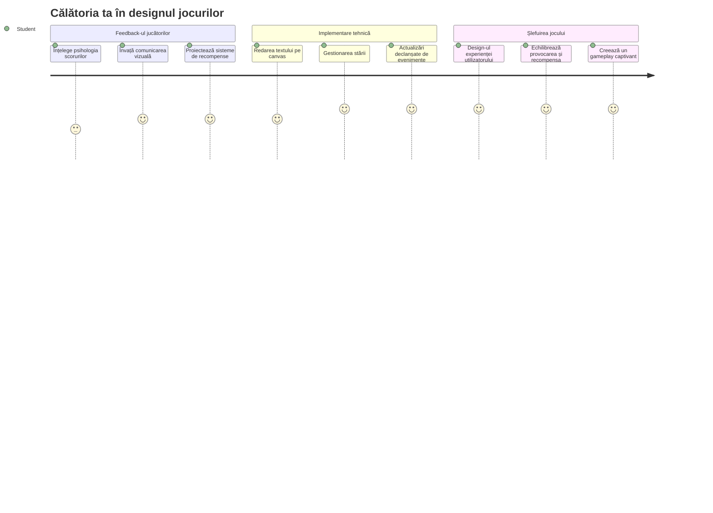
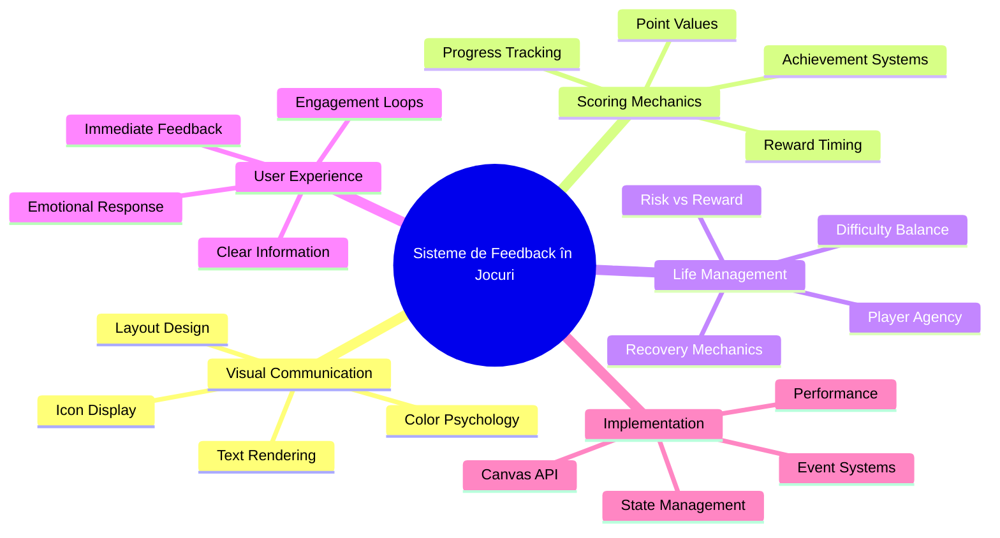
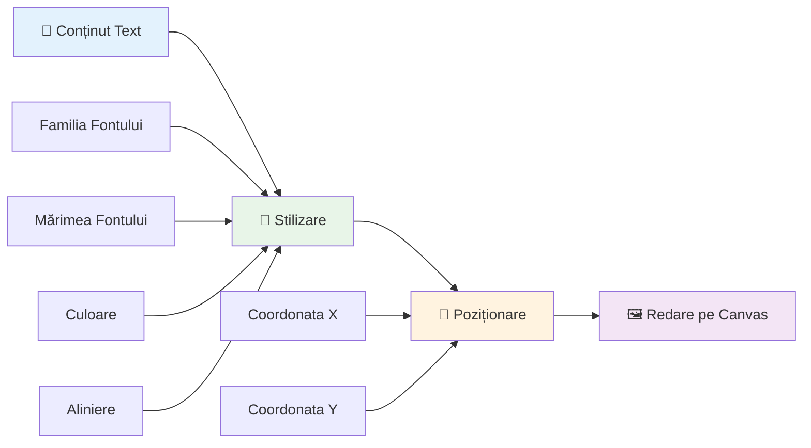
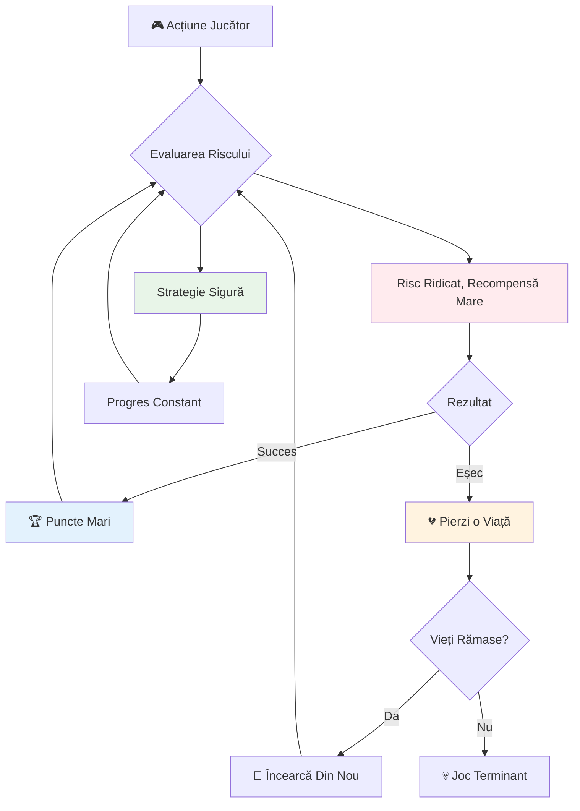
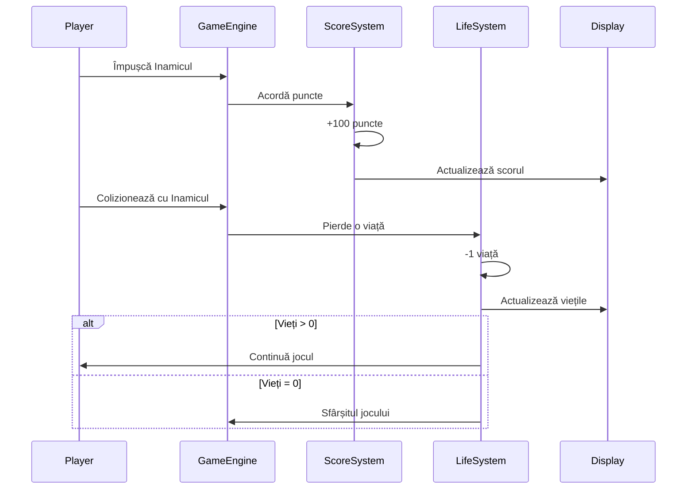
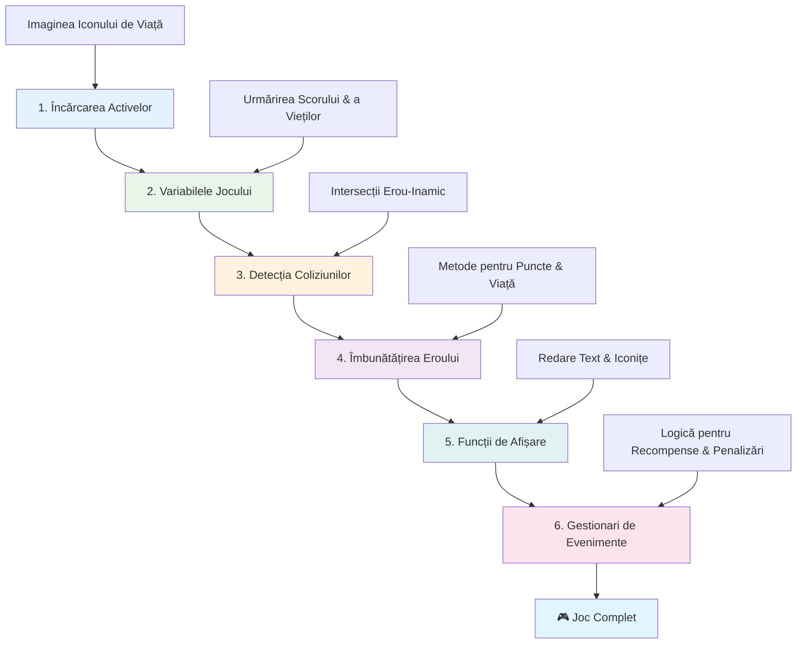
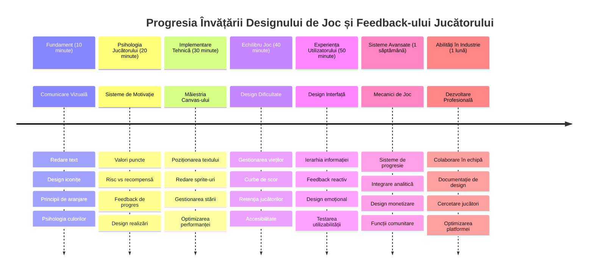

<!--
CO_OP_TRANSLATOR_METADATA:
{
  "original_hash": "2ed9145a16cf576faa2a973dff84d099",
  "translation_date": "2026-01-07T05:46:28+00:00",
  "source_file": "6-space-game/5-keeping-score/README.md",
  "language_code": "ro"
}
-->
# Construiește un joc spațial Partea 5: Scoruri și vieți


## Chestionar pre-lectură

[Chestionar pre-lectură](https://ff-quizzes.netlify.app/web/quiz/37)

Pregătit să faci ca jocul tău spațial să se simtă cu adevărat un joc? Haide să adăugăm punctajul și gestionarea vieților - mecanicile de bază care au transformat jocurile arcade timpurii precum Space Invaders din simple demonstrații în divertisment captivant. Aici jocul tău devine cu adevărat jucabil.


## Afișarea textului pe ecran - Vocea jocului tău

Pentru a afișa scorul, trebuie să învățăm cum să redăm text pe canvas. Metoda `fillText()` este instrumentul tău principal pentru asta - este aceeași tehnică folosită în jocurile arcade clasice pentru a arăta scorurile și informațiile despre stare.


Ai control total asupra aspectului textului:

```javascript
ctx.font = "30px Arial";
ctx.fillStyle = "red";
ctx.textAlign = "right";
ctx.fillText("show this on the screen", 0, 0);
```

✅ Aprofundează subiectul [adăugării textului pe canvas](https://developer.mozilla.org/docs/Web/API/Canvas_API/Tutorial/Drawing_text) - s-ar putea să fii surprins cât de creativ poți fi cu fonturile și stilizarea!

## Vieți - Mai mult decât un simplu număr

În designul jocurilor, o „viață” reprezintă marja de eroare a jucătorului. Acest concept datează încă din aparatele de pinball, unde primeai mai multe bile pentru a juca. În jocurile video timpurii precum Asteroids, viețile dădeau jucătorilor permisiunea de a-și asuma riscuri și de a învăța din greșeli.


Reprezentarea vizuală contează enorm - afișarea icoanelor de navă în loc de textul simplu „Vieți: 3” creează o recunoaștere vizuală imediată, similar cu modul în care primele cabine arcade foloseau iconografie pentru a comunica peste bariere lingvistice.

## Construirea sistemului de recompense al jocului tău

Acum vom implementa sistemele de feedback care țin jucătorii implicați:


- **Sistem de punctaj**: Fiecare navă inamic distrusă acordă 100 de puncte (numere rotunde sunt mai ușor de calculat mental pentru jucători). Scorul se afișează în colțul din stânga jos.
- **Contor de vieți**: Eroul tău începe cu trei vieți - un standard stabilit de jocurile arcade timpurii pentru a echilibra provocarea cu jucabilitatea. Fiecare coliziune cu un inamic costă o viață. Vom afișa viețile rămase în colțul din dreapta jos folosind icoane de navă .

## Să începem construcția!

Mai întâi, setează-ți spațiul de lucru. Navighează la fișierele din subfolderul `your-work`. Ar trebui să vezi aceste fișiere:

```bash
-| assets
  -| enemyShip.png
  -| player.png
  -| laserRed.png
-| index.html
-| app.js
-| package.json
```

Ca să testezi jocul, pornește serverul de dezvoltare din folderul `your_work`:

```bash
cd your-work
npm start
```

Acesta rulează un server local la `http://localhost:5000`. Deschide această adresă în browser pentru a vedea jocul tău. Testează controalele cu tastele săgeți și încearcă să tragi în inamici pentru a verifica dacă totul funcționează.


### E timpul să codezi!

1. **Ia activele vizuale de care ai nevoie**. Copiază asset-ul `life.png` din folderul `solution/assets/` în folderul tău `your-work`. Apoi adaugă lifeImg în funcția ta window.onload:

    ```javascript
    lifeImg = await loadTexture("assets/life.png");
    ```

1. Nu uita să adaugi `lifeImg` în lista ta de active:

    ```javascript
    let heroImg,
    ...
    lifeImg,
    ...
    eventEmitter = new EventEmitter();
    ```
  
2. **Setează variabilele pentru joc**. Adaugă cod care să urmărească scorul total (începând de la 0) și viețile rămase (începând de la 3). Le vom afișa pe ecran astfel încât jucătorii să știe mereu unde se află.

3. **Implementează detectarea coliziunilor**. Extinde funcția `updateGameObjects()` ca să detecteze când inamicii se ciocnesc cu eroul tău:

    ```javascript
    enemies.forEach(enemy => {
        const heroRect = hero.rectFromGameObject();
        if (intersectRect(heroRect, enemy.rectFromGameObject())) {
          eventEmitter.emit(Messages.COLLISION_ENEMY_HERO, { enemy });
        }
      })
    ```

4. **Adaugă urmărirea vieților și punctelor la eroul tău**. 
   1. **Inițializează contoarele**. Sub `this.cooldown = 0` din clasa `Hero`, setează viața și punctele:

        ```javascript
        this.life = 3;
        this.points = 0;
        ```

   1. **Afișează aceste valori jucătorului**. Creează funcții pentru a desena aceste valori pe ecran:

        ```javascript
        function drawLife() {
          // DE FACUT, 35, 27
          const START_POS = canvas.width - 180;
          for(let i=0; i < hero.life; i++ ) {
            ctx.drawImage(
              lifeImg, 
              START_POS + (45 * (i+1) ), 
              canvas.height - 37);
          }
        }
        
        function drawPoints() {
          ctx.font = "30px Arial";
          ctx.fillStyle = "red";
          ctx.textAlign = "left";
          drawText("Points: " + hero.points, 10, canvas.height-20);
        }
        
        function drawText(message, x, y) {
          ctx.fillText(message, x, y);
        }

        ```

   1. **Leagă totul în bucla ta de joc**. Adaugă aceste funcții în window.onload imediat după `updateGameObjects()`:

        ```javascript
        drawPoints();
        drawLife();
        ```

### 🔄 **Verificare pedagogică**
**Înțelegerea designului jocului**: Înainte de a implementa consecințele, asigură-te că înțelegi:
- ✅ Cum comunică feedback-ul vizual starea jocului către jucători
- ✅ De ce plasarea consistentă a elementelor UI îmbunătățește ușurința de utilizare
- ✅ Psihologia din spatele valorilor punctelor și gestionării vieților
- ✅ Cum diferă redarea textului pe canvas față de textul HTML

**Autoevaluare rapidă**: De ce jocurile arcade folosesc de obicei numere rotunde pentru valorile punctelor?  
*Răspuns: Numerele rotunde sunt mai ușor de calculat mental de către jucători și creează recompense psihologice satisfăcătoare*

**Principii de experiență a utilizatorului**: Aplici acum:  
- **Ierarhie vizuală**: Informații importante plasate proeminent  
- **Feedback imediat**: Actualizări în timp real pentru acțiunile jucătorului  
- **Sarcină cognitivă**: Prezentare simplă și clară a informațiilor  
- **Design emoțional**: Icoane și culori care creează conexiune cu jucătorul

1. **Implementează consecințe și recompense în joc**. Acum vom adăuga sistemele de feedback care conferă sens acțiunilor jucătorului:

   1. **Coliziunile costă vieți**. De fiecare dată când eroul tău se lovește de un inamic, pierzi o viață.

      Adaugă această metodă în clasa `Hero`:

        ```javascript
        decrementLife() {
          this.life--;
          if (this.life === 0) {
            this.dead = true;
          }
        }
        ```

   2. **Lovitul inamicilor oferă puncte**. Fiecare lovitură reușită oferă 100 de puncte, oferind un feedback pozitiv imediat pentru tragerea precisă.

      Extinde clasa Hero cu această metodă de incrementare:
    
        ```javascript
          incrementPoints() {
            this.points += 100;
          }
        ```

        Acum leagă aceste funcții de evenimentele de coliziune:

        ```javascript
        eventEmitter.on(Messages.COLLISION_ENEMY_LASER, (_, { first, second }) => {
           first.dead = true;
           second.dead = true;
           hero.incrementPoints();
        })

        eventEmitter.on(Messages.COLLISION_ENEMY_HERO, (_, { enemy }) => {
           enemy.dead = true;
           hero.decrementLife();
        });
        ```

✅ Curios despre alte jocuri construite cu JavaScript și Canvas? Explorează puțin - s-ar putea să fii uimit ce este posibil!

După implementarea acestor funcții, testează jocul pentru a vedea sistemul complet de feedback în acțiune. Vei vedea icoanele vieții în partea dreaptă jos, scorul în stânga jos și vei observa cum coliziunile reduc viețile, iar loviturile reușite cresc punctajul.

Jocul tău are acum mecanicile esențiale care au făcut jocurile arcade timpurii atât de captivante - obiective clare, feedback imediat și consecințe semnificative pentru acțiunile jucătorului.

### 🔄 **Verificare pedagogică**
**Sistem complet de design al jocului**: Verifică stăpânirea ta a sistemelor de feedback pentru jucător:  
- ✅ Cum creează mecanicile de scor motivare și implicare a jucătorului?  
- ✅ De ce este importantă consistența vizuală pentru designul interfeței utilizator?  
- ✅ Cum echilibrează sistemul de vieți provocarea cu retenția jucătorului?  
- ✅ Ce rol are feedback-ul imediat în crearea unei experiențe satisfăcătoare?

**Integrarea sistemelor**: Sistemul tău de feedback demonstrează:  
- **Designul experienței utilizatorului**: Comunicare vizuală clară și ierarhie a informațiilor  
- **Arhitectură bazată pe evenimente**: Actualizări responsive la acțiunile jucătorului  
- **Managementul stării**: Urmărirea și afișarea datelor dinamice ale jocului  
- **Măiestria canvas-ului**: Redare text și poziționare sprite-uri  
- **Psihologia jocului**: Înțelegerea motivației și implicării jucătorului

**Modele profesionale**: Ai implementat:  
- **Arhitectura MVC**: Separarea logicii jocului, datelor și prezentării  
- **Pattern-ul Observer**: Actualizări bazate pe evenimente pentru schimbarea stării jocului  
- **Design componentelor**: Funcții reutilizabile pentru redare și logică  
- **Optimizare performantă**: Redare eficientă în buclele jocului

### ⚡ **Ce poți face în următoarele 5 minute**
- [ ] Experimentează cu diferite dimensiuni de font și culori pentru afișarea scorului  
- [ ] Încearcă să schimbi valorile punctelor și observă cum afectează senzația jocului  
- [ ] Adaugă instrucțiuni console.log pentru a urmări când se schimbă punctele și viețile  
- [ ] Testează cazuri limite, cum ar fi epuizarea vieților sau obținerea unui scor mare

### 🎯 **Ce poți realiza în această oră**
- [ ] Completează chestionarul post-lecție și înțelege psihologia designului jocului  
- [ ] Adaugă efecte sonore pentru punctaje și pierderea vieților  
- [ ] Implementează un sistem de scoruri maxime folosind localStorage  
- [ ] Creează valori diferite de puncte pentru tipuri diferite de inamici  
- [ ] Adaugă efecte vizuale, cum ar fi zguduitura ecranului la pierderea unei vieți

### 📅 **Călătoria ta de o săptămână în design de jocuri**
- [ ] Completează jocul spațial complet cu sisteme de feedback rafinate  
- [ ] Implementează mecanici avansate de punctaj, cum ar fi multiplicatori de combo  
- [ ] Adaugă realizări și conținut deblocat  
- [ ] Creează sisteme de progresie și echilibrare a dificultății  
- [ ] Proiectează interfețe pentru meniuri și ecrane de game over  
- [ ] Studiază alte jocuri pentru a înțelege mecanismele de implicare

### 🌟 **Maestria ta de o lună în dezvoltare de jocuri**
- [ ] Construiește jocuri complete cu sisteme sofisticate de progresie  
- [ ] Învață analiza jocurilor și măsurarea comportamentului jucătorilor  
- [ ] Contribuie la proiecte open source de dezvoltare a jocurilor  
- [ ] Stăpânește modele avansate de design de joc și monetizare  
- [ ] Creează conținut educațional despre designul jocurilor și experiența utilizatorului  
- [ ] Construiește un portofoliu care să evidențieze abilitățile tale de design și dezvoltare a jocurilor

## 🎯 Cronologia ta pentru maestria în design de jocuri


### 🛠️ Rezumatul trusei tale de unelte pentru design de jocuri

După ce ai finalizat această lecție, ai stăpânit acum:
- **Psihologia jucătorului**: Înțelegerea motivației, a raportului risc/recompensă și a ciclurilor de implicare  
- **Comunicarea vizuală**: Design eficient de UI folosind text, icoane și layout  
- **Sisteme de feedback**: Răspuns în timp real la acțiunile jucătorului și evenimentele jocului  
- **Managementul stării**: Urmărirea și afișarea eficientă a datelor dinamice din joc  
- **Redare a textului pe canvas**: Afișare profesională a textului cu stilizare și poziționare  
- **Integrarea evenimentelor**: Conectarea acțiunilor utilizatorului cu consecințe semnificative în joc  
- **Echilibru în joc**: Proiectarea curbelor de dificultate și sistemelor de progres al jucătorului

**Aplicații în lumea reală**: Abilitățile tale de design de jocuri se aplică direct în:  
- **Designul interfeței utilizator**: Crearea de interfețe captivante și intuitive  
- **Dezvoltare de produse**: Înțelegerea motivației utilizatorului și a ciclurilor de feedback  
- **Tehnologie educațională**: Gamificare și sisteme de implicare în învățare  
- **Vizualizarea datelor**: Facerea informațiilor complexe accesibile și captivante  
- **Dezvoltare aplicații mobile**: Mecanici de retenție și design UX  
- **Tehnologie de marketing**: Înțelegerea comportamentului utilizatorului și optimizarea conversiei

**Competențe profesionale dobândite**: Acum poți:  
- **Proiecta** experiențe care motivează și implică utilizatorii  
- **Implementa** sisteme de feedback care ghidează comportamentul utilizatorului eficient  
- **Echilibra** provocarea și accesibilitatea în sisteme interactive  
- **Crea** comunicare vizuală care funcționează pentru grupuri diverse de utilizatori  
- **Analiza** comportamentul utilizatorului și iterează pe îmbunătățiri de design

**Concepte stăpânite în dezvoltarea jocurilor**:  
- **Motivația jucătorului**: Înțelegerea factorilor care stimulează implicarea și retenția  
- **Design vizual**: Crearea de interfețe clare, atractive și funcționale  
- **Integrarea sistemelor**: Conectarea mai multor sisteme de joc pentru o experiență coerentă  
- **Optimizarea performanței**: Redare eficientă și management al stării  
- **Accesibilitate**: Design pentru niveluri diferite de abilitate și nevoi ale jucătorilor

**Următorul nivel**: Ești pregătit să explorezi modele avansate de design de joc, să implementezi sisteme de analiza sau să studiezi monetizarea jocurilor și strategiile de retenție a jucătorilor!

🌟 **Realizare deblocat**: Ai construit un sistem complet de feedback pentru jucător bazat pe principii profesionale de design de joc!

---

## Provocarea Agentului GitHub Copilot 🚀

Folosește modul Agent pentru a realiza următoarea provocare:

**Descriere:** Îmbunătățește sistemul de punctaj al jocului spațial implementând un sistem de scor maxim cu stocare persistentă și mecanici de punctaj bonus.

**Prompt:** Creează un sistem de scor maxim care salvează cel mai bun scor al jucătorului în localStorage. Adaugă puncte bonus pentru ucideri consecutive de inamici (sistem de combo) și implementează valori diferite de puncte pentru diferitele tipuri de inamici. Include un indicator vizual când jucătorul atinge un nou scor maxim și afișează scorul maxim curent pe ecranul jocului.


## 🚀 Provocare

Acum ai un joc funcțional cu scoruri și vieți. Gândește-te ce funcții suplimentare ar putea îmbunătăți experiența jucătorului.

## Chestionar post-lectură

[Chestionar post-lectură](https://ff-quizzes.netlify.app/web/quiz/38)

## Recenzie & Studiu individual

Vrei să explorezi mai mult? Cercetează diferite abordări pentru sistemele de scor și vieți din jocuri. Există motoare de joc fascinante precum [PlayFab](https://playfab.com) care gestionează punctaje, clasamente și progresul jucătorului. Cum ar putea integrarea unei astfel de soluții să ducă jocul tău la un nivel superior?

## Temă

[Construiește un joc cu punctaj](assignment.md)

---

<!-- CO-OP TRANSLATOR DISCLAIMER START -->
**Declinarea responsabilității**:  
Acest document a fost tradus folosind serviciul de traducere automată AI [Co-op Translator](https://github.com/Azure/co-op-translator). Deși ne străduim pentru acuratețe, vă rugăm să rețineți că traducerile automate pot conține erori sau inexactități. Documentul original în limba sa nativă trebuie considerat sursa autorizată. Pentru informații critice, se recomandă traducerea profesională realizată de un traducător uman. Nu ne asumăm responsabilitatea pentru eventualele neînțelegeri sau interpretări greșite ce pot apărea ca urmare a utilizării acestei traduceri.
<!-- CO-OP TRANSLATOR DISCLAIMER END -->