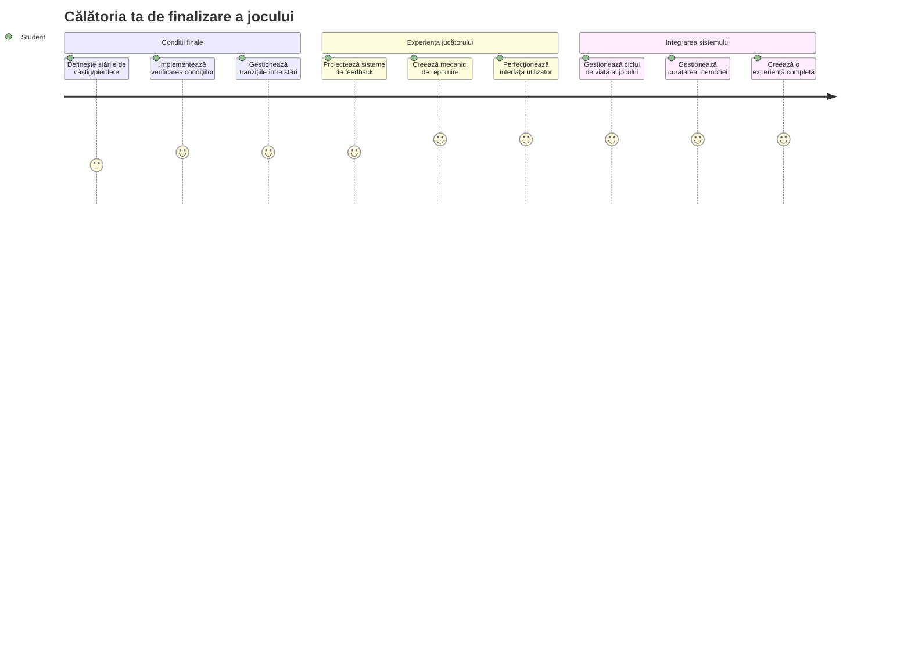
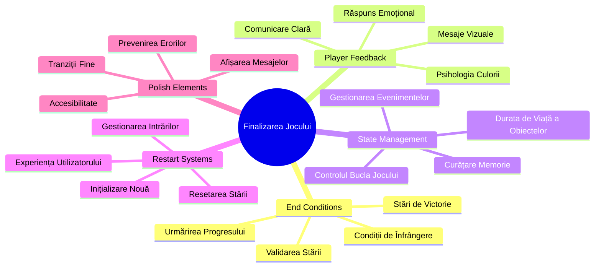
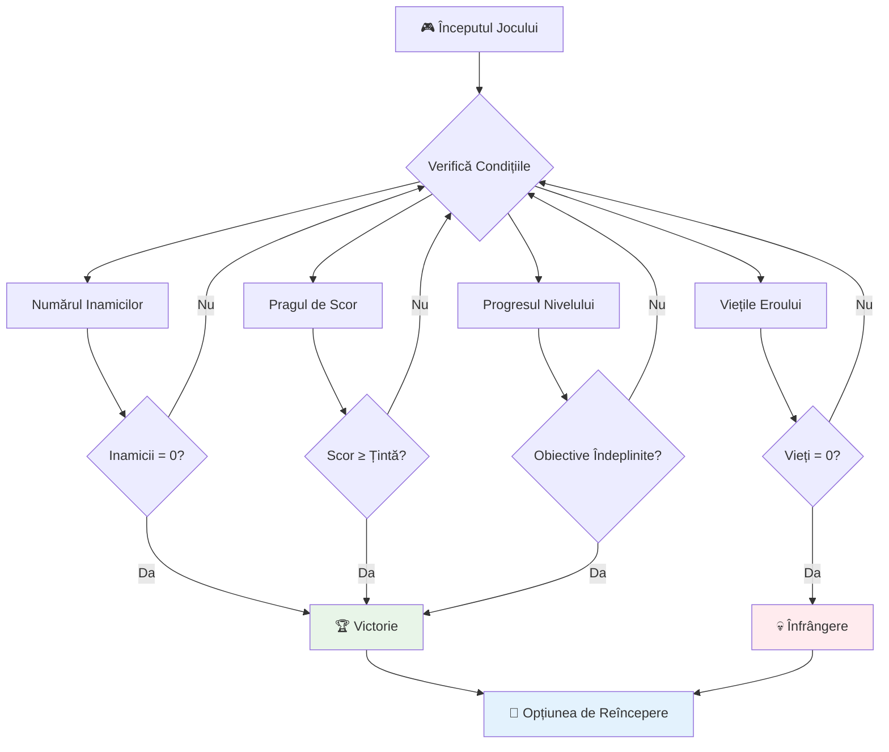
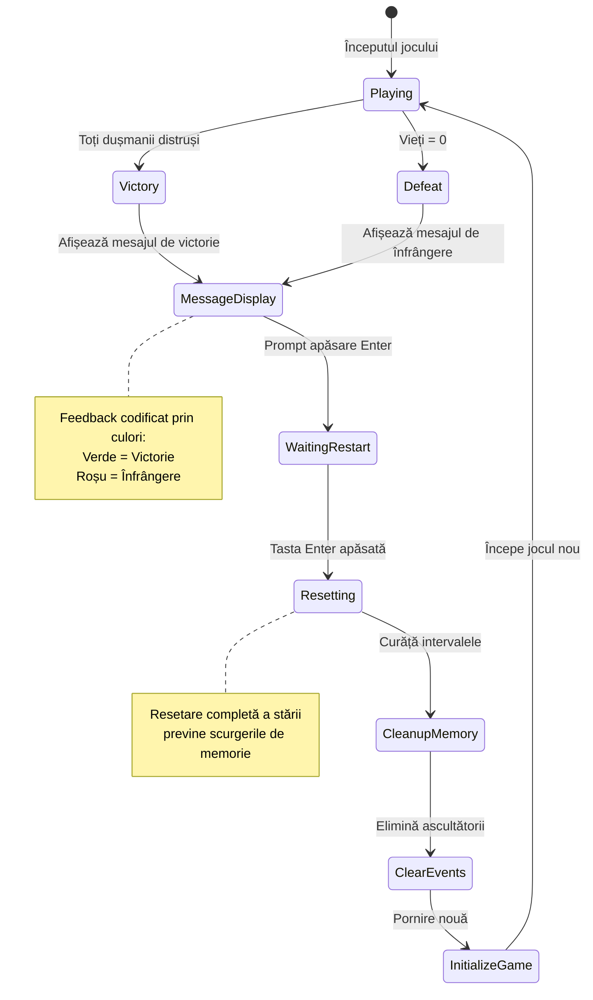
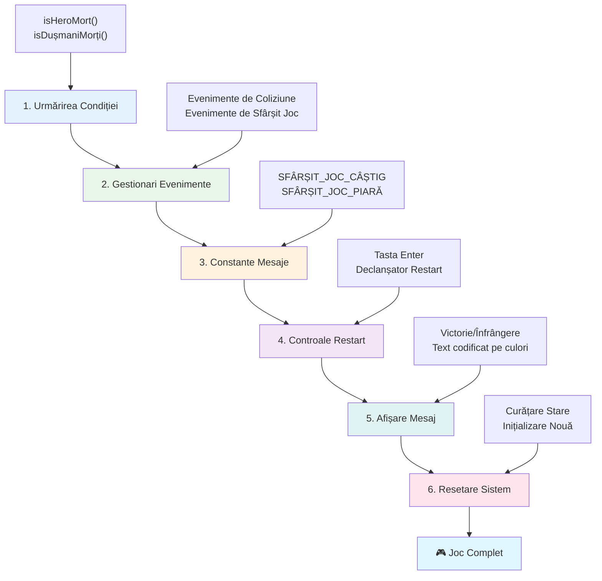
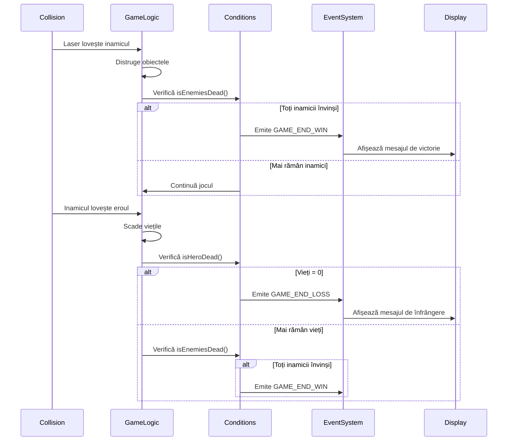
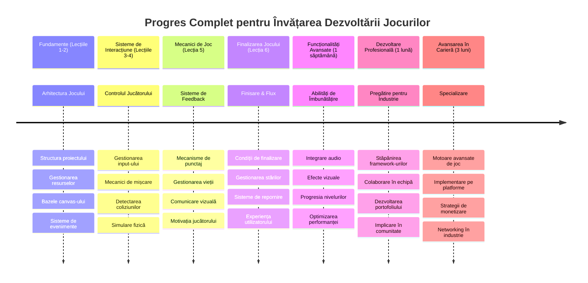

# Construiește un Joc Spațial Partea 6: Final și Repornește


Fiecare joc grozav are nevoie de condiții clare de final și un mecanism lin de repornire. Ai creat un joc spațial impresionant cu mișcare, luptă și scoruri - acum este timpul să adaugi ultimele piese care îl fac să se simtă complet.

Jocul tău rulează în prezent indefinit, ca sondele Voyager pe care NASA le-a lansat în 1977 - încă călătorind prin spațiu după decenii. Deși este un lucru bun pentru explorarea spațiului, jocurile au nevoie de puncte finale definite pentru a crea experiențe satisfăcătoare.

Astăzi, vom implementa condiții corecte de câștig/pierdere și un sistem de repornire. La finalul acestei lecții, vei avea un joc finisat pe care jucătorii îl pot termina și juca din nou, exact ca jocurile clasice arcade care au definit acest mediu.


## Chestionar pre-lectură

[Pre-lecture quiz](https://ff-quizzes.netlify.app/web/quiz/39)

## Înțelegerea Condițiilor de Finalizare a Jocului

Când ar trebui să se termine jocul tău? Această întrebare fundamentală a modelat designul jocurilor încă din epoca timpurie a jocurilor arcade. Pac-Man se termină când ești prins de fantome sau când cureți toate punctele, în timp ce Space Invaders se termină când extratereștrii ajung în partea de jos sau îi distrugi pe toți.

Ca creator al jocului, tu definești condițiile de victorie și înfrângere. Pentru jocul nostru spațial, iată câteva abordări dovedite care creează un gameplay captivant:


- **Au fost distruse `N` nave inamice**: Este destul de comun, dacă împarți un joc în diferite niveluri, să fie nevoie să distrugi `N` nave inamice pentru a termina un nivel
- **Nava ta a fost distrusă**: Există cu siguranță jocuri în care pierzi dacă nava ta este distrusă. O altă abordare comună este să ai conceptul de vieți. De fiecare dată când nava ta este distrusă, pierzi o viață. Odată ce toate viețile sunt pierdute, pierzi jocul.
- **Ai adunat `N` puncte**: O altă condiție comună de final este să colectezi puncte. Cum obții punctele depinde de tine, dar este destul de comun să se asocieze puncte cu diverse activități, cum ar fi distrugerea unei nave inamice sau colectarea obiectelor pe care le *lasă căzute* când sunt distruse.
- **Finalizează un nivel**: Aceasta poate implica mai multe condiții, cum ar fi distrugerea a `X` nave inamice, colectarea a `Y` puncte sau poate că un anumit obiect specific a fost colectat.

## Implementarea Funcționalității de Repornește Jocul

Jocurile bune încurajează rejucabilitatea prin mecanisme line de repornire. Când jucătorii termină un joc (sau înfrângerea survine), deseori doresc să încerce din nou imediat - fie pentru a-și îmbunătăți scorul, fie performanța.


Tetris exemplifică perfect acest lucru: când blocurile tale ating vârful, poți începe instantaneu un joc nou fără să navighezi prin meniuri complicate. Vom construi un sistem similar de repornire care resetează curat starea jocului și îi readuce rapid pe jucători în acțiune.

✅ **Reflecție**: Gândește-te la jocurile pe care le-ai jucat. În ce condiții se termină și cum ești invitat să repornești? Ce face ca experiența de repornire să fie lină versus frustrantă?

## Ce Vei Construi

Vei implementa funcțiile finale care transformă proiectul tău într-o experiență completă de joc. Aceste elemente diferențiază jocurile finisate de prototipurile de bază.

**Iată ce adăugăm astăzi:**

1. **Condiție de victorie**: Distruge toți inamicii și bucură-te de o celebrare adecvată (ai câștigat!)
2. **Condiție de înfrângere**: Rămâi fără vieți și înfruntă ecranul de înfrângere
3. **Mecanism de repornire**: Apasă Enter pentru a începe din nou - pentru că un joc nu este niciodată suficient
4. **Gestionarea stării**: Curat la fiecare start - fără inamici rămași sau probleme ciudate de la jocul anterior

## Începutul

Să pregătim mediul tău de dezvoltare. Ar trebui să ai toate fișierele jocului spațial din lecțiile anterioare gata.

**Proiectul tău ar trebui să arate cam așa:**

```bash
-| assets
  -| enemyShip.png
  -| player.png
  -| laserRed.png
  -| life.png
-| index.html
-| app.js
-| package.json
```

**Pornește serverul de dezvoltare:**

```bash
cd your-work
npm start
```

**Această comandă:**
- Rulează un server local la `http://localhost:5000`
- Servește fișierele tale corect
- Reîmprospătează automat când faci modificări

Deschide `http://localhost:5000` în browser și verifică dacă jocul rulează. Ar trebui să poți să te miști, să tragi și să interacționezi cu inamicii. Odată confirmat, putem continua cu implementarea.

> 💡 **Sfat Pro**: Pentru a evita avertismente în Visual Studio Code, declară `gameLoopId` în partea de sus a fișierului ca `let gameLoopId;` în loc să îl declari în funcția `window.onload`. Aceasta urmează cele mai bune practici moderne pentru declararea variabilelor în JavaScript.


## Pașii de Implementare

### Pasul 1: Creează Funcții Pentru Monitorizarea Condițiilor de Final

Avem nevoie de funcții care să monitorizeze când ar trebui să se termine jocul. Ca niște senzori pe Stația Spațială Internațională care monitorizează constant sistemele critice, aceste funcții vor verifica continuu starea jocului.

```javascript
function isHeroDead() {
  return hero.life <= 0;
}

function isEnemiesDead() {
  const enemies = gameObjects.filter((go) => go.type === "Enemy" && !go.dead);
  return enemies.length === 0;
}
```

**Iată ce se întâmplă în culise:**
- **Verifică** dacă eroul nostru nu mai are vieți (of!)
- **Numără** câți inamici mai sunt în viață și activi
- **Returnează** `true` când câmpul de luptă este curat de inamici
- **Folosește** o logică simplă de adevărat/fals pentru claritate
- **Filtrează** prin toate obiectele jocului pentru a găsi supraviețuitorii

### Pasul 2: Actualizează Gestionarii de Evenimente pentru Condițiile de Final

Acum vom conecta aceste verificări de condiții la sistemul de evenimente al jocului. De fiecare dată când apare o coliziune, jocul va evalua dacă aceasta declanșează o condiție de final. Aceasta creează un feedback imediat pentru evenimentele critice.


```javascript
eventEmitter.on(Messages.COLLISION_ENEMY_LASER, (_, { first, second }) => {
    first.dead = true;
    second.dead = true;
    hero.incrementPoints();

    if (isEnemiesDead()) {
      eventEmitter.emit(Messages.GAME_END_WIN);
    }
});

eventEmitter.on(Messages.COLLISION_ENEMY_HERO, (_, { enemy }) => {
    enemy.dead = true;
    hero.decrementLife();
    if (isHeroDead())  {
      eventEmitter.emit(Messages.GAME_END_LOSS);
      return; // pierdere înainte de victorie
    }
    if (isEnemiesDead()) {
      eventEmitter.emit(Messages.GAME_END_WIN);
    }
});

eventEmitter.on(Messages.GAME_END_WIN, () => {
    endGame(true);
});
  
eventEmitter.on(Messages.GAME_END_LOSS, () => {
  endGame(false);
});
```

**Ce se întâmplă aici:**
- **Laserul lovește inamicul**: Amândoi dispar, primești puncte și verificăm dacă ai câștigat
- **Inamicul lovește nava ta**: Pierzi o viață și verificăm dacă încă mai respiri
- **Ordine inteligentă**: Verificăm înfrângerea primul (nimeni nu vrea să câștige și să piardă în același timp!)
- **Reacții instantanee**: De îndată ce ceva important se întâmplă, jocul știe despre asta

### Pasul 3: Adaugă Noi Constante pentru Mesaje

Va trebui să adaugi noi tipuri de mesaje în obiectul constant `Messages`. Aceste constante ajută la menținerea consistenței și împiedică greșelile de scriere în sistemul tău de evenimente.

```javascript
GAME_END_LOSS: "GAME_END_LOSS",
GAME_END_WIN: "GAME_END_WIN",
```

**În exemplul de mai sus am:**
- **Adăugat** constante pentru evenimente de finalizare a jocului pentru consistență
- **Folosim** nume descriptive care indică clar scopul evenimentului
- **Urmăm** convenția de denumire deja existentă pentru tipurile de mesaje

### Pasul 4: Implementează Controalele de Repornește

Acum vei adăuga controale de tastatură care permit jucătorilor să repornească jocul. Tasta Enter este o alegere naturală, deoarece este asociată în mod obișnuit cu confirmarea acțiunilor și începerea jocurilor noi.

**Adaugă detecția tastei Enter la ascultătorul de evenimente de tip keydown existent:**

```javascript
else if(evt.key === "Enter") {
   eventEmitter.emit(Messages.KEY_EVENT_ENTER);
}
```

**Adaugă noua constantă de mesaj:**

```javascript
KEY_EVENT_ENTER: "KEY_EVENT_ENTER",
```

**Ce trebuie să știi:**
- **Extinde** sistemul tău existent de gestionare a evenimentelor de tastatură
- **Folosește** tasta Enter ca declanșator pentru repornire pentru o experiență intuitivă
- **Emite** un eveniment personalizat pe care alte părți ale jocului tău îl pot asculta
- **Menține** același tipar ca și celelalte controale de tastatură

### Pasul 5: Creează Sistemul de Afișare a Mesajelor

Jocul tău trebuie să comunice clar rezultatele către jucători. Vom crea un sistem de mesaje care afișează stările de victorie și înfrângere folosind text colorat, similar cu interfețele terminalelor computerelor timpurii, unde verde indica succesul și roșu avertismente.

**Creează funcția `displayMessage()`:**

```javascript
function displayMessage(message, color = "red") {
  ctx.font = "30px Arial";
  ctx.fillStyle = color;
  ctx.textAlign = "center";
  ctx.fillText(message, canvas.width / 2, canvas.height / 2);
}
```

**Pas cu pas, iată ce se întâmplă:**
- **Setează** dimensiunea și familia fontului pentru text clar și ușor de citit
- **Aplică** un parametru de culoare cu "roșu" ca implicit pentru avertismente
- **Centrează** textul orizontal și vertical pe canvas
- **Folosește** parametri impliciți moderni în JavaScript pentru opțiuni flexibile de culoare
- **Profită** de contextul 2D al canvasului pentru randare directă a textului

**Creează funcția `endGame()`:**

```javascript
function endGame(win) {
  clearInterval(gameLoopId);

  // Setează o întârziere pentru a te asigura că toate renderizările restante se finalizează
  setTimeout(() => {
    ctx.clearRect(0, 0, canvas.width, canvas.height);
    ctx.fillStyle = "black";
    ctx.fillRect(0, 0, canvas.width, canvas.height);
    if (win) {
      displayMessage(
        "Victory!!! Pew Pew... - Press [Enter] to start a new game Captain Pew Pew",
        "green"
      );
    } else {
      displayMessage(
        "You died !!! Press [Enter] to start a new game Captain Pew Pew"
      );
    }
  }, 200)  
}
```

**Ce face această funcție:**
- **Îngheață** totul pe loc - nici o navă sau laser nu se mai mișcă
- **Ia** o mică pauză (200ms) pentru a lăsa ultimul cadru să se deseneze complet
- **Curăță** ecranul și îl pictează în negru pentru efect dramatic
- **Afișează** mesaje diferite pentru câștigători și învinși
- **Codifică culorile** - verde pentru bine, roșu pentru... nu prea bine
- **Spune** jucătorilor exact cum să reînceapă

### 🔄 **Verificare Pedagogică**
**Gestionarea Stării Jocului**: Înainte de a implementa funcționalitatea de reset, asigură-te că înțelegi:
- ✅ Cum condițiile de finalizare creează obiective clare în gameplay
- ✅ De ce feedback-ul vizual este esențial pentru înțelegerea jucătorilor
- ✅ Importanța curățeniei corespunzătoare pentru prevenirea scurgerilor de memorie
- ✅ Cum arhitectura bazată pe evenimente permite tranziții curate ale stării

**Auto-Test Rapid**: Ce s-ar întâmpla dacă nu ai elimina ascultătorii de evenimente la reset?
*Răspuns: Scurgeri de memorie și ascultători dublați cauzând comportament imprevizibil*

**Principii de Design a Jocului**: Acum implementezi:
- **Obiective Clare**: Jucătorii știu exact ce înseamnă succesul și eșecul
- **Feedback Imediat**: Schimbările de stare sunt comunicate instantaneu
- **Controlul Utilizatorului**: Jucătorii pot reporni când sunt pregătiți
- **Fiabilitatea Sistemului**: Curățarea corespunzătoare previne erorile și problemele de performanță

### Pasul 6: Implementează Funcționalitatea de Resetare a Jocului

Sistemul de reset are nevoie să curețe complet starea curentă a jocului și să inițializeze o sesiune nouă de joc. Astfel, jucătorii încep curat fără niciun rest de date din jocul anterior.

**Creează funcția `resetGame()`:**

```javascript
function resetGame() {
  if (gameLoopId) {
    clearInterval(gameLoopId);
    eventEmitter.clear();
    initGame();
    gameLoopId = setInterval(() => {
      ctx.clearRect(0, 0, canvas.width, canvas.height);
      ctx.fillStyle = "black";
      ctx.fillRect(0, 0, canvas.width, canvas.height);
      drawPoints();
      drawLife();
      updateGameObjects();
      drawGameObjects(ctx);
    }, 100);
  }
}
```

**Să înțelegem fiecare parte:**
- **Verifică** dacă un ciclu de joc rulează înainte de resetare
- **Curăță** ciclul curent de joc pentru a opri toată activitatea
- **Elimină** toți ascultătorii de evenimente pentru a preveni scurgerile de memorie
- **Reinițializează** starea jocului cu obiecte și variabile proaspete
- **Pornește** un nou ciclu de joc cu toate funcțiile esențiale
- **Menține** același interval de 100ms pentru performanță constantă

**Adaugă gestionarea tastei Enter în funcția ta `initGame()`:**

```javascript
eventEmitter.on(Messages.KEY_EVENT_ENTER, () => {
  resetGame();
});
```

**Adaugă metoda `clear()` în clasa ta EventEmitter:**

```javascript
clear() {
  this.listeners = {};
}
```

**Puncte cheie de reținut:**
- **Conectează** apăsarea tastei Enter la funcționalitatea de resetare a jocului
- **Înregistrează** acest ascultător în timpul inițializării jocului
- **Oferă** o modalitate curată de a elimina toți ascultătorii când se face reset
- **Previne** scurgerile de memorie curățând handlerii între jocuri
- **Resetează** obiectul de ascultători la o stare goală pentru o inițializare curată

## Felicitări! 🎉

👽 💥 🚀 Ai construit cu succes un joc complet de la zero. La fel ca programatorii care au creat primele jocuri video în anii 1970, ai transformat linii de cod într-o experiență interactivă cu mecanici corecte de joc și feedback pentru utilizator. 🚀 💥 👽

**Ai realizat:**
- **Implementat** condiții complete de câștig și pierdere cu feedback pentru utilizator
- **Creat** un sistem fluid de repornire pentru gameplay continuu
- **Proiectat** comunicare vizuală clară pentru stările jocului
- **Gestionat** tranziții și curățări complexe ale stării jocului
- **Asamblat** toate componentele într-un joc coerent și jucabil

### 🔄 **Verificare Pedagogică**
**Sistem Complet de Dezvoltare a Jocului**: Sărbătorește stăpânirea întregului ciclu de dezvoltare a jocului:
- ✅ Cum condițiile de finalizare creează experiențe satisfăcătoare pentru jucător?
- ✅ De ce gestionarea corectă a stării este critică pentru stabilitatea jocului?
- ✅ Cum îmbunătățește feedback-ul vizual înțelegerea jucătorului?
- ✅ Ce rol joacă sistemul de repornire în reținerea jucătorilor?

**Stăpânirea Sistemului**: Jocul tău complet demonstrează:
- **Dezvoltare Full-Stack a Jocului**: De la grafică la input și gestionarea stării
- **Arhitectură Profesionistă**: Sisteme bazate pe evenimente cu curățare adecvată
- **Design UX**: Feedback clar și controale intuitive
- **Optimizare Performanță**: Randare eficientă și managementul memoriei
- **Finisare și Complețitudine**: Toate detaliile care fac un joc să se simtă terminat

**Competențe pentru Industrie**: Ai implementat:
- **Arhitectura Loop-ului de Joc**: Sisteme în timp real cu performanță constantă
- **Programare bazată pe Evenimente**: Sisteme decuplate care pot scala eficient
- **Gestionarea Stării**: Manipulare complexă a datelor și managementul ciclului de viață
- **Design UI**: Comunicare clară și controale responsiv
- **Testare și Debugging**: Dezvoltare iterativă și rezolvare de probleme

### ⚡ **Ce Poți Face în Următoarele 5 Minute**
- [ ] Joacă jocul tău complet și testează toate condițiile de victorie și înfrângere
- [ ] Experimentează cu diferiți parametri pentru condițiile de final
- [ ] Încearcă să adaugi declarații console.log pentru a urmări schimbările stării jocului
- [ ] Împarte jocul tău cu prietenii și adună feedback

### 🎯 **Ce Poți Realiza în Această Oră**
- [ ] Completează chestionarul post-lectură și reflectă asupra parcursului tău de dezvoltare a jocului
- [ ] Adaugă efecte audio pentru stările de victorie și înfrângere
- [ ] Implementează condiții suplimentare de final, cum ar fi limite de timp sau obiective bonus
- [ ] Creează niveluri de dificultate diferite cu numere variate de inamici
- [ ] Finisează prezentarea vizuală cu fonturi și culori mai bune

### 📅 **Maiestria Ta în Dezvoltarea Jocurilor pe Parcursul unei Săptămâni**
- [ ] Completează jocul spațial îmbunătățit cu mai multe niveluri și progresie
- [ ] Adaugă funcții avansate precum power-up-uri, tipuri diferite de inamici și arme speciale
- [ ] Creează un sistem de scoruri înalte cu stocare persistentă
- [ ] Proiectează interfețe pentru meniuri, setări și opțiuni ale jocului
- [ ] Optimizează performanța pentru diferite dispozitive și browsere
- [ ] Publică jocul online și împărtășește-l cu comunitatea
### 🌟 **Cariera ta de dezvoltare a jocurilor pe durata unei luni**
- [ ] Construiește mai multe jocuri complete explorând genuri și mecanici diferite
- [ ] Învață framework-uri avansate de dezvoltare a jocurilor precum Phaser sau Three.js
- [ ] Contribuie la proiecte open source de dezvoltare a jocurilor
- [ ] Studiază principiile designului de joc și psihologia jucătorului
- [ ] Creează un portofoliu care să-ți evidențieze abilitățile de dezvoltare a jocurilor
- [ ] Conectează-te cu comunitatea dezvoltatorilor de jocuri și continuă să înveți

## 🎯 Cronologia ta completă pentru stăpânirea dezvoltării jocurilor


### 🛠️ Rezumatul complet al trusei tale de dezvoltare a jocurilor

După ce ai parcurs întreaga serie de jocuri spațiale, ai stăpânit acum:
- **Arhitectura jocului**: Sisteme bazate pe evenimente, bucle ale jocului și gestionarea stărilor
- **Programarea grafică**: API Canvas, redarea sprite-urilor și efecte vizuale
- **Sisteme de intrare**: Gestionarea tastaturii, detectarea coliziunilor și controale responsive
- **Designul jocului**: Feedback-ul jucătorului, sisteme de progresie și mecanici de implicare
- **Optimizarea performanței**: Redare eficientă, gestionarea memoriei și controlul ratei de cadre
- **Experiența utilizatorului**: Comunicare clară, controale intuitive și detalii de finisare
- **Modele profesionale**: Cod curat, tehnici de depanare și organizarea proiectului

**Aplicații în lumea reală**: Abilitățile tale de dezvoltare a jocurilor se aplică direct la:
- **Aplicații web interactive**: Interfețe dinamice și sisteme în timp real
- **Vizualizarea datelor**: Grafice animate și grafică interactivă
- **Tehnologia educațională**: Gamificare și experiențe de învățare captivante
- **Dezvoltare mobilă**: Interacțiuni tactile și optimizarea performanței
- **Software de simulare**: Motoare fizice și modelare în timp real
- **Industrii creative**: Artă interactivă, divertisment și experiențe digitale

**Abilități profesionale dobândite**: Acum poți:
- **Arhitectura** sisteme interactive complexe de la zero
- **Depanare** aplicații în timp real folosind abordări sistematice
- **Optimizare** a performanței pentru experiențe fluide ale utilizatorului
- **Design** interfețe atrăgătoare și modele de interacțiune
- **Colaborare** eficientă la proiecte tehnice cu o organizare corectă a codului

**Concepte de dezvoltare a jocurilor stăpânite**:
- **Sisteme în timp real**: Bucle ale jocului, gestionarea ratei de cadre și performanță
- **Arhitectură bazată pe evenimente**: Sisteme decuplare și transmiterea mesajelor
- **Gestionarea stărilor**: Manevrarea complexă a datelor și gestionarea ciclului de viață
- **Programarea interfeței cu utilizatorul**: Grafică Canvas și design responsive
- **Teoria designului jocului**: Psihologia jucătorului și mecanici de implicare

**Următorul nivel**: Ești gata să explorezi framework-uri avansate de jocuri, grafică 3D, sisteme multiplayer sau să faci tranziția către roluri profesionale în dezvoltarea jocurilor!

🌟 **Realizare Deblocată**: Ai finalizat o călătorie completă de dezvoltare a jocurilor și ai creat o experiență interactivă de calitate profesională de la zero!

**Bine ai venit în comunitatea dezvoltatorilor de jocuri!** 🎮✨

## Provocarea Agentului GitHub Copilot 🚀

Folosește modul Agent pentru a finaliza următoarea provocare:

**Descriere:** Îmbunătățește jocul spațial implementând un sistem de progresie pe niveluri cu dificultate crescătoare și funcționalități bonus.

**Prompt:** Creează un sistem de joc spațial cu mai multe niveluri, unde fiecare nivel are mai multe nave inamice cu viteză și sănătate crescute. Adaugă un multiplicator de scor care crește cu fiecare nivel și implementează power-up-uri (precum foc rapid sau scut) care apar aleator când inamicii sunt distruși. Include un bonus la finalizarea nivelului și afișează nivelul curent pe ecran alături de scorul și numărul de vieți existente.

Află mai multe despre [modul agent](https://code.visualstudio.com/blogs/2025/02/24/introducing-copilot-agent-mode) aici.

## 🚀 Provocare Opțională de Îmbunătățire

**Adaugă sunet jocului tău**: Îmbunătățește-ți experiența de joc implementând efecte sonore! Ia în considerare adăugarea de sunete pentru:

- **Foc laser** când jucătorul trage
- **Distrugerea inamicilor** când navele sunt lovite
- **Daunele eroului** când jucătorul primește lovituri
- **Muzică de victorie** când jocul este câștigat
- **Sunet de înfrângere** când jocul este pierdut

**Exemplu de implementare audio:**

```javascript
// Creează obiecte audio
const laserSound = new Audio('assets/laser.wav');
const explosionSound = new Audio('assets/explosion.wav');

// Redă sunete în timpul evenimentelor din joc
function playLaserSound() {
  laserSound.currentTime = 0; // Resetează la început
  laserSound.play();
}
```

**Ce trebuie să știi:**
- **Creează** obiecte Audio pentru diferite efecte sonore
- **Resetează** `currentTime` pentru a permite efecte sonore rapid repetate
- **Gestionează** politicile browserului privind redarea automată prin declanșarea sunetelor din interacțiuni ale utilizatorului
- **Controlează** volumul și sincronizarea audio pentru o experiență de joc mai bună

> 💡 **Resursă de învățare**: Explorează această [platformă audio](https://www.w3schools.com/jsref/tryit.asp?filename=tryjsref_audio_play) pentru a afla mai multe despre implementarea sunetului în jocurile JavaScript.

## Testul după prelegere

[Test după prelegere](https://ff-quizzes.netlify.app/web/quiz/40)

## Recenzie & Auto-studiu

Sarcina ta este să creezi un joc de exemplu nou, așa că explorează câteva dintre jocurile interesante disponibile pentru a vedea ce tip de joc ai putea crea.

## Temă

[Construiește un joc de exemplu](assignment.md)

---

<!-- CO-OP TRANSLATOR DISCLAIMER START -->
**Declinare de responsabilitate**:  
Acest document a fost tradus folosind serviciul de traducere AI [Co-op Translator](https://github.com/Azure/co-op-translator). Deși ne străduim pentru acuratețe, vă rugăm să rețineți că traducerile automate pot conține erori sau inexactități. Documentul original în limba sa nativă trebuie considerat sursa autorizată. Pentru informații critice, se recomandă traducerea profesională realizată de un traducător uman. Nu ne asumăm răspunderea pentru orice neînțelegeri sau interpretări greșite rezultate din utilizarea acestei traduceri.
<!-- CO-OP TRANSLATOR DISCLAIMER END -->