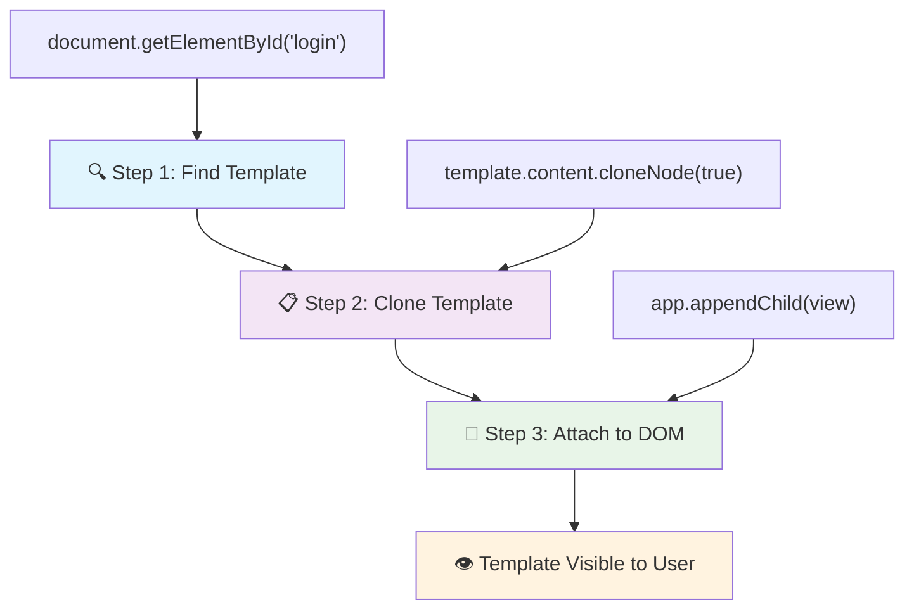
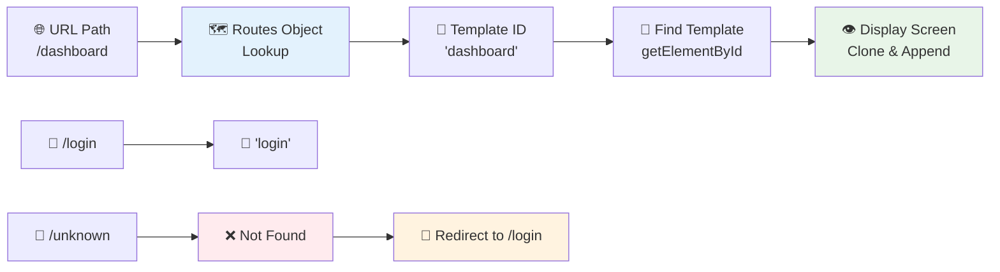
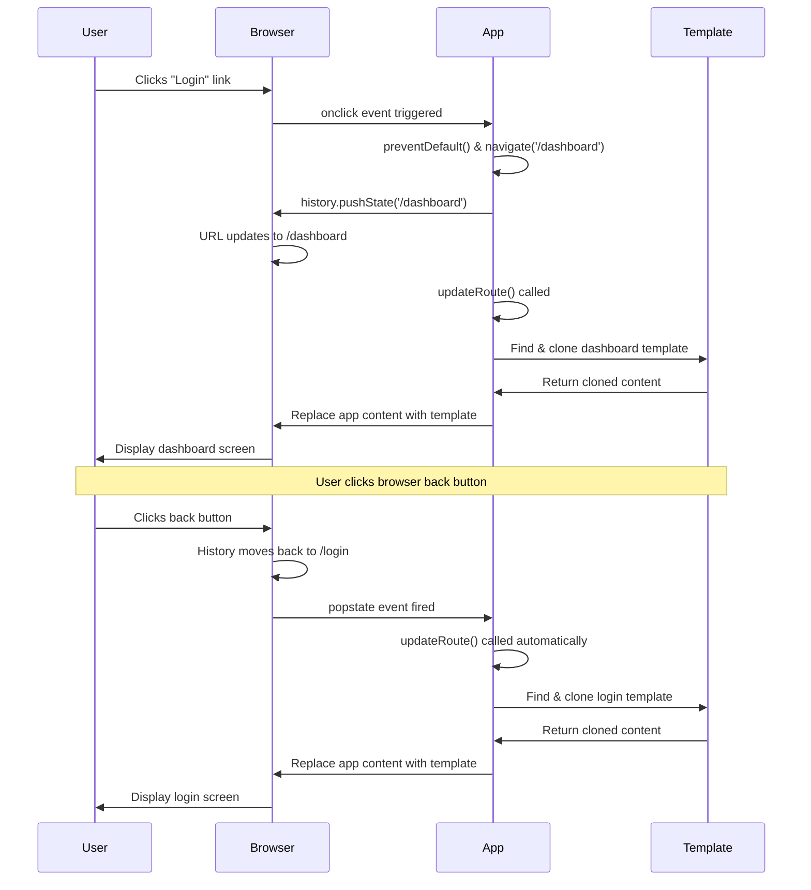
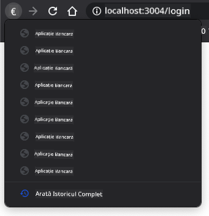

<!--
CO_OP_TRANSLATOR_METADATA:
{
  "original_hash": "5d259f6962464ad91e671083aa0398f4",
  "translation_date": "2025-10-24T22:11:56+00:00",
  "source_file": "7-bank-project/1-template-route/README.md",
  "language_code": "ro"
}
-->
# Construirea unei aplicații bancare Partea 1: Șabloane HTML și rute într-o aplicație web

Când computerul de ghidare al Apollo 11 a navigat spre Lună în 1969, a trebuit să comute între diferite programe fără a reporni întregul sistem. Aplicațiile web moderne funcționează într-un mod similar – ele schimbă ceea ce vezi fără a reîncărca totul de la zero. Acest lucru creează o experiență fluidă și receptivă pe care utilizatorii o așteaptă astăzi.

Spre deosebire de site-urile tradiționale care reîncarcă pagini întregi pentru fiecare interacțiune, aplicațiile web moderne actualizează doar părțile care necesită modificări. Această abordare, asemănătoare modului în care centrul de control comută între diferite afișaje menținând în același timp comunicarea constantă, creează acea experiență fluidă pe care am ajuns să o așteptăm.

Iată ce face diferența atât de dramatică:

| Aplicații tradiționale cu mai multe pagini | Aplicații moderne cu o singură pagină |
|-------------------------------------------|---------------------------------------|
| **Navigare** | Reîncărcare completă a paginii pentru fiecare ecran | Comutare instantanee a conținutului |
| **Performanță** | Mai lentă din cauza descărcării complete a HTML-ului | Mai rapidă cu actualizări parțiale |
| **Experiența utilizatorului** | Flash-uri de pagină deranjante | Tranziții fluide, asemănătoare aplicațiilor |
| **Partajarea datelor** | Dificilă între pagini | Gestionare ușoară a stării |
| **Dezvoltare** | Mai multe fișiere HTML de întreținut | Un singur HTML cu șabloane dinamice |

**Înțelegerea evoluției:**
- **Aplicațiile tradiționale** necesită cereri către server pentru fiecare acțiune de navigare
- **SPA-urile moderne** se încarcă o dată și actualizează conținutul dinamic folosind JavaScript
- **Așteptările utilizatorilor** favorizează acum interacțiunile instantanee și fluide
- **Beneficiile performanței** includ reducerea lățimii de bandă și răspunsuri mai rapide

În această lecție, vom construi o aplicație bancară cu mai multe ecrane care se îmbină perfect. Așa cum oamenii de știință folosesc instrumente modulare care pot fi reconfigurate pentru diferite experimente, vom folosi șabloane HTML ca componente reutilizabile care pot fi afișate după cum este necesar.

Vei lucra cu șabloane HTML (modele reutilizabile pentru diferite ecrane), rutare JavaScript (sistemul care comută între ecrane) și API-ul de istoric al browserului (care menține funcționarea butonului de întoarcere). Acestea sunt aceleași tehnici fundamentale utilizate de framework-uri precum React, Vue și Angular.

La final, vei avea o aplicație bancară funcțională care demonstrează principiile profesionale ale aplicațiilor cu o singură pagină.

## Chestionar înainte de lecție

[Chestionar înainte de lecție](https://ff-quizzes.netlify.app/web/quiz/41)

### De ce ai nevoie

Vom avea nevoie de un server web local pentru a testa aplicația bancară – nu te îngrijora, este mai simplu decât pare! Dacă nu ai deja unul configurat, instalează [Node.js](https://nodejs.org) și rulează `npx lite-server` din folderul proiectului tău. Această comandă utilă pornește un server local și deschide automat aplicația în browser.

### Pregătire

Pe computerul tău, creează un folder numit `bank` cu un fișier numit `index.html` în interiorul său. Vom începe cu acest [boilerplate HTML](https://en.wikipedia.org/wiki/Boilerplate_code):

```html
<!DOCTYPE html>
<html lang="en">
  <head>
    <meta charset="UTF-8">
    <meta name="viewport" content="width=device-width, initial-scale=1.0">
    <title>Bank App</title>
  </head>
  <body>
    <!-- This is where you'll work -->
  </body>
</html>
```

**Ce oferă acest boilerplate:**
- **Stabilește** structura documentului HTML5 cu declarația DOCTYPE corespunzătoare
- **Configurează** codificarea caracterelor ca UTF-8 pentru suport internațional al textului
- **Permite** designul receptiv cu meta tag-ul viewport pentru compatibilitate mobilă
- **Setează** un titlu descriptiv care apare în fila browserului
- **Creează** o secțiune curată a corpului unde vom construi aplicația

> 📁 **Previzualizare structură proiect**
> 
> **La finalul acestei lecții, proiectul tău va conține:**
> ```
> bank/
> ├── index.html      <!-- Main HTML with templates -->
> ├── app.js          <!-- Routing and navigation logic -->
> └── style.css       <!-- (Optional for future lessons) -->
> ```
> 
> **Responsabilitățile fișierelor:**
> - **index.html**: Conține toate șabloanele și oferă structura aplicației
> - **app.js**: Gestionează rutarea, navigarea și administrarea șabloanelor
> - **Șabloane**: Definirea interfeței pentru autentificare, tabloul de bord și alte ecrane

---

## Șabloane HTML

Șabloanele rezolvă o problemă fundamentală în dezvoltarea web. Când Gutenberg a inventat tiparul cu litere mobile în anii 1440, el a realizat că, în loc să sculpteze pagini întregi, putea crea blocuri de litere reutilizabile și să le aranjeze după cum era necesar. Șabloanele HTML funcționează pe același principiu – în loc să creezi fișiere HTML separate pentru fiecare ecran, definești structuri reutilizabile care pot fi afișate atunci când este necesar.

Gândește-te la șabloane ca la planuri pentru diferite părți ale aplicației tale. Așa cum un arhitect creează un singur plan și îl folosește de mai multe ori în loc să redeseneze camere identice, noi creăm șabloane o dată și le instanțiem după cum este necesar. Browserul păstrează aceste șabloane ascunse până când JavaScript le activează.

Dacă dorești să creezi mai multe ecrane pentru o pagină web, o soluție ar fi să creezi un fișier HTML pentru fiecare ecran pe care vrei să-l afișezi. Totuși, această soluție vine cu unele inconveniente:

- Trebuie să reîncarci întregul HTML atunci când schimbi ecranul, ceea ce poate fi lent.
- Este dificil să partajezi date între diferite ecrane.

O altă abordare este să ai un singur fișier HTML și să definești mai multe [șabloane HTML](https://developer.mozilla.org/docs/Web/HTML/Element/template) folosind elementul `<template>`. Un șablon este un bloc HTML reutilizabil care nu este afișat de browser și trebuie să fie instanțiat la runtime folosind JavaScript.

### Hai să construim

Vom crea o aplicație bancară cu două ecrane principale: o pagină de autentificare și un tablou de bord. Mai întâi, să adăugăm un element de tip placeholder în corpul HTML – aici vor apărea toate ecranele noastre diferite:

```html
<div id="app">Loading...</div>
```

**Înțelegerea acestui placeholder:**
- **Creează** un container cu ID-ul "app" unde vor fi afișate toate ecranele
- **Afișează** un mesaj de încărcare până când JavaScript inițializează primul ecran
- **Oferă** un punct unic de montare pentru conținutul nostru dinamic
- **Permite** țintirea ușoară din JavaScript folosind `document.getElementById()`

> 💡 **Sfat util**: Deoarece conținutul acestui element va fi înlocuit, putem pune un mesaj de încărcare sau un indicator care va fi afișat în timp ce aplicația se încarcă.

Apoi, să adăugăm mai jos șablonul HTML pentru pagina de autentificare. Deocamdată vom pune doar un titlu și o secțiune care conține un link pe care îl vom folosi pentru navigare.

```html
<template id="login">
  <h1>Bank App</h1>
  <section>
    <a href="/dashboard">Login</a>
  </section>
</template>
```

**Analiza acestui șablon de autentificare:**
- **Definește** un șablon cu identificator unic "login" pentru a fi țintit de JavaScript
- **Include** un titlu principal care stabilește branding-ul aplicației
- **Conține** un element semantic `<section>` pentru a grupa conținutul relevant
- **Oferă** un link de navigare care va direcționa utilizatorii către tablou de bord

Apoi vom adăuga un alt șablon HTML pentru pagina tabloului de bord. Această pagină va conține diferite secțiuni:

- Un antet cu un titlu și un link de deconectare
- Soldul curent al contului bancar
- O listă de tranzacții, afișată într-un tabel

```html
<template id="dashboard">
  <header>
    <h1>Bank App</h1>
    <a href="/login">Logout</a>
  </header>
  <section>
    Balance: 100$
  </section>
  <section>
    <h2>Transactions</h2>
    <table>
      <thead>
        <tr>
          <th>Date</th>
          <th>Object</th>
          <th>Amount</th>
        </tr>
      </thead>
      <tbody></tbody>
    </table>
  </section>
</template>
```

**Să înțelegem fiecare parte a acestui tablou de bord:**
- **Structura** paginii cu un element semantic `<header>` care conține navigarea
- **Afișează** titlul aplicației în mod constant pe toate ecranele pentru branding
- **Oferă** un link de deconectare care direcționează înapoi la ecranul de autentificare
- **Arată** soldul curent al contului într-o secțiune dedicată
- **Organizează** datele tranzacțiilor folosind un tabel HTML structurat corespunzător
- **Definește** anteturi de tabel pentru coloanele Date, Obiect și Suma
- **Lasă** corpul tabelului gol pentru injectarea dinamică a conținutului ulterior

> 💡 **Sfat util**: Când creezi șabloane HTML, dacă vrei să vezi cum arată, poți comenta liniile `<template>` și `</template>` înconjurându-le cu `<!-- -->`.

✅ De ce crezi că folosim atributele `id` pe șabloane? Am putea folosi altceva, cum ar fi clasele?

## Activarea șabloanelor cu JavaScript

Acum trebuie să facem șabloanele noastre funcționale. Așa cum o imprimantă 3D ia un plan digital și creează un obiect fizic, JavaScript ia șabloanele noastre ascunse și creează elemente vizibile, interactive, pe care utilizatorii le pot vedea și utiliza.

Procesul urmează trei pași constanți care formează fundamentul dezvoltării web moderne. Odată ce înțelegi acest model, îl vei recunoaște în multe framework-uri și biblioteci.

Dacă încerci fișierul HTML actual în browser, vei vedea că rămâne blocat afișând `Loading...`. Asta pentru că trebuie să adăugăm un cod JavaScript pentru a instanția și afișa șabloanele HTML.

Instanțierea unui șablon se face, de obicei, în 3 pași:

1. Se preia elementul șablon din DOM, de exemplu folosind [`document.getElementById`](https://developer.mozilla.org/docs/Web/API/Document/getElementById).
2. Se clonează elementul șablon, folosind [`cloneNode`](https://developer.mozilla.org/docs/Web/API/Node/cloneNode).
3. Se atașează la DOM sub un element vizibil, de exemplu folosind [`appendChild`](https://developer.mozilla.org/docs/Web/API/Node/appendChild).



**Analiza vizuală a procesului:**
- **Pasul 1** localizează șablonul ascuns în structura DOM
- **Pasul 2** creează o copie funcțională care poate fi modificată în siguranță
- **Pasul 3** inserează copia în zona vizibilă a paginii
- **Rezultatul** este un ecran funcțional pe care utilizatorii îl pot utiliza

✅ De ce trebuie să clonăm șablonul înainte de a-l atașa la DOM? Ce crezi că s-ar întâmpla dacă am sări peste acest pas?

### Sarcină

Creează un fișier nou numit `app.js` în folderul proiectului tău și importă acel fișier în secțiunea `<head>` a HTML-ului:

```html
<script src="app.js" defer></script>
```

**Înțelegerea acestui import de script:**
- **Leagă** fișierul JavaScript de documentul HTML
- **Folosește** atributul `defer` pentru a se asigura că scriptul rulează după ce analiza HTML este completă
- **Permite** accesul la toate elementele DOM, deoarece sunt complet încărcate înainte de execuția scriptului
- **Urmează** cele mai bune practici moderne pentru încărcarea scripturilor și performanță

Acum, în `app.js`, vom crea o funcție nouă numită `updateRoute`:

```js
function updateRoute(templateId) {
  const template = document.getElementById(templateId);
  const view = template.content.cloneNode(true);
  const app = document.getElementById('app');
  app.innerHTML = '';
  app.appendChild(view);
}
```

**Pas cu pas, iată ce se întâmplă:**
- **Localizează** elementul șablon folosind ID-ul său unic
- **Creează** o copie profundă a conținutului șablonului folosind `cloneNode(true)`
- **Găsește** containerul aplicației unde va fi afișat conținutul
- **Șterge** orice conținut existent din containerul aplicației
- **Inserează** conținutul șablonului clonat în DOM-ul vizibil

Acum apelează această funcție cu unul dintre șabloane și observă rezultatul.

```js
updateRoute('login');
```

**Ce realizează acest apel al funcției:**
- **Activează** șablonul de autentificare prin transmiterea ID-ului său ca parametru
- **Demonstrează** cum să comuți programatic între diferite ecrane ale aplicației
- **Afișează** ecranul de autentificare în locul mesajului "Loading..."

✅ Care este scopul acestui cod `app.innerHTML = '';`? Ce se întâmplă fără el?

## Crearea rutelor

Rutarea se referă, în esență, la conectarea URL-urilor la conținutul corespunzător. Gândește-te cum operatorii de telefonie din trecut foloseau panouri de comutare pentru a conecta apelurile – ei preluau o cerere și o direcționau către destinația corectă. Rutarea web funcționează similar, preluând o cerere URL și determinând ce conținut să afișeze.

În mod tradițional, serverele web gestionau acest lucru servind fișiere HTML diferite pentru URL-uri diferite. Deoarece construim o aplicație cu o singură pagină, trebuie să gestionăm această rutare noi înșine cu JavaScript. Această abordare ne oferă mai mult control asupra experienței utilizatorului și performanței.



**Înțelegerea fluxului de rutare:**
- **Schimbările URL-ului** declanșează o căutare în configurația rutelor noastre
- **Rutele valide** se mapează la ID-uri specifice de șabloane pentru redare
- **Rutele invalide** declanșează comportament de rezervă pentru a preveni stările defecte
- **Redarea șabloanelor** urmează procesul în trei pași pe care l-am învățat anterior

Când vorbim despre o aplicație web, numim *Rutare* intenția de a mapa **URL-urile** la ecranele specifice care ar trebui afișate. Pe un site web cu mai multe fișiere HTML, acest lucru se face automat, deoarece căile fișierelor sunt reflectate în URL. De exemplu, cu aceste fișiere în folderul proiectului tău:

```
mywebsite/index.html
mywebsite/login.html
mywebsite/admin/index.html
```

Dacă creezi un server web cu `mywebsite` ca root, maparea URL-urilor va fi:

```
https://site.com            --> mywebsite/index.html
https://site.com/login.html --> mywebsite/login.html
https://site.com/admin/     --> mywebsite/admin/index.html
```

Totuși, pentru aplicația noastră web folosim un singur fișier HTML care conține toate ecranele, așa că acest comportament implicit nu ne va ajuta. Trebuie să creăm această mapare manual și să actualizăm șablonul afișat folosind JavaScript.

### Sarcină

Vom folosi un obiect simplu pentru a implementa o [hartă](https://en.wikipedia.org/wiki/Associative_array) între căile URL și șabloanele noastre. Adaugă acest obiect în partea de sus a fișierului `app.js`.

```js
const routes = {
  '/login': { templateId: 'login' },
  '/dashboard': { templateId: 'dashboard' },
};
```

**Înțelegerea acestei configurații de rute:**
- **Definește** o mapare între căile URL și identificatorii de șabloane
- **Folosește** sintaxa obiectului unde cheile sunt căi URL, iar valorile conțin informații despre șabloane
- **Permite** o căutare ușoară a șablonului care trebuie afișat pentru orice URL dat
- **Oferă** o structură scalabilă pentru adăugarea de rute noi în viitor

Acum să modificăm puțin funcția `updateRoute`. În loc să transmitem direct `templateId` ca argument, dorim să-l obținem mai întâi analizând URL-ul curent și apoi să folosim harta noastră pentru a obține valoarea corespunzătoare a ID-ului șablonului. Putem folosi [`window.location.pathname`](https://developer.mozilla.org/docs/Web/API/Location/pathname) pentru a obține doar secțiunea de cale din URL.

```js
function updateRoute() {
  const path = window.location.pathname;
  const route = routes[path];

  const template = document.getElementById(route.templateId);
  const view = template.content.cloneNode(true);
  const app = document.getElementById('app');
  app.innerHTML = '';
  app.appendChild(view);
}
```

**Analiza a ceea ce se întâmplă aici:**
- **Extrage** calea curentă din URL-ul browserului folosind `window.location.pathname`
- **Caută** configurația
✅ Ce se întâmplă dacă introduci un drum necunoscut în URL? Cum am putea rezolva acest lucru?

## Adăugarea Navigației

Cu rutarea stabilită, utilizatorii au nevoie de o modalitate de a naviga prin aplicație. Site-urile web tradiționale reîncarcă pagini întregi atunci când se fac clic pe linkuri, dar noi dorim să actualizăm atât URL-ul, cât și conținutul, fără reîncărcarea paginii. Acest lucru creează o experiență mai fluidă, similară cu modul în care aplicațiile desktop comută între diferite vizualizări.

Trebuie să coordonăm două lucruri: actualizarea URL-ului browserului astfel încât utilizatorii să poată marca paginile și să partajeze linkuri și afișarea conținutului corespunzător. Când este implementat corect, acest lucru creează navigarea fluidă pe care utilizatorii o așteaptă de la aplicațiile moderne.

> 🏗️ **Perspectivă asupra Arhitecturii**: Componentele Sistemului de Navigație
>
> **Ce construiești:**
> - **🔄 Gestionarea URL-ului**: Actualizează bara de adrese a browserului fără reîncărcarea paginii
> - **📋 Sistem de Șabloane**: Schimbă conținutul dinamic în funcție de ruta curentă  
> - **📚 Integrarea Istoricului**: Menține funcționalitatea butoanelor de înainte/înapoi ale browserului
> - **🛡️ Gestionarea Erorilor**: Soluții de rezervă elegante pentru rute invalide sau lipsă
>
> **Cum funcționează componentele împreună:**
> - **Ascultă** evenimentele de navigare (clicuri, modificări ale istoricului)
> - **Actualizează** URL-ul folosind API-ul History
> - **Randează** șablonul corespunzător pentru noua rută
> - **Menține** o experiență fluidă pentru utilizator pe tot parcursul

Următorul pas pentru aplicația noastră este să adăugăm posibilitatea de a naviga între pagini fără a fi nevoie să schimbăm URL-ul manual. Acest lucru implică două aspecte:

  1. Actualizarea URL-ului curent
  2. Actualizarea șablonului afișat pe baza noului URL

Am rezolvat deja a doua parte cu funcția `updateRoute`, așa că trebuie să ne dăm seama cum să actualizăm URL-ul curent.

Va trebui să folosim JavaScript și, mai exact, [`history.pushState`](https://developer.mozilla.org/docs/Web/API/History/pushState), care permite actualizarea URL-ului și crearea unei noi intrări în istoricul de navigare, fără reîncărcarea HTML-ului.

> ⚠️ **Notă Importantă**: Deși elementul HTML de ancorare [`<a href>`](https://developer.mozilla.org/docs/Web/HTML/Element/a) poate fi utilizat singur pentru a crea hyperlinkuri către diferite URL-uri, acesta va face ca browserul să reîncarce HTML-ul în mod implicit. Este necesar să prevenim acest comportament atunci când gestionăm rutarea cu JavaScript personalizat, utilizând funcția preventDefault() pe evenimentul de clic.

### Sarcină

Să creăm o nouă funcție pe care o putem folosi pentru a naviga în aplicația noastră:

```js
function navigate(path) {
  window.history.pushState({}, path, path);
  updateRoute();
}
```

**Înțelegerea acestei funcții de navigare:**
- **Actualizează** URL-ul browserului la noua cale folosind `history.pushState`
- **Adaugă** o nouă intrare în stiva de istoric a browserului pentru suportul corect al butoanelor de înainte/înapoi
- **Declanșează** funcția `updateRoute()` pentru a afișa șablonul corespunzător
- **Menține** experiența aplicației cu o singură pagină fără reîncărcări

Această metodă actualizează mai întâi URL-ul curent pe baza căii date, apoi actualizează șablonul. Proprietatea `window.location.origin` returnează rădăcina URL-ului, permițându-ne să reconstruim un URL complet dintr-o cale dată.

Acum că avem această funcție, putem rezolva problema pe care o avem dacă o cale nu se potrivește cu nicio rută definită. Vom modifica funcția `updateRoute` adăugând o soluție de rezervă către una dintre rutele existente dacă nu putem găsi o potrivire.

```js
function updateRoute() {
  const path = window.location.pathname;
  const route = routes[path];

  if (!route) {
    return navigate('/login');
  }

  const template = document.getElementById(route.templateId);
  const view = template.content.cloneNode(true);
  const app = document.getElementById('app');
  app.innerHTML = '';
  app.appendChild(view);
}
```

**Puncte cheie de reținut:**
- **Verifică** dacă există o rută pentru calea curentă
- **Redirecționează** către pagina de autentificare atunci când se accesează o rută invalidă
- **Oferă** un mecanism de rezervă care previne navigarea defectuoasă
- **Asigură** că utilizatorii văd întotdeauna un ecran valid, chiar și cu URL-uri incorecte

Dacă nu se poate găsi o rută, acum vom redirecționa către pagina de autentificare `login`.

Acum să creăm o funcție pentru a obține URL-ul atunci când se face clic pe un link și pentru a preveni comportamentul implicit al browserului:

```js
function onLinkClick(event) {
  event.preventDefault();
  navigate(event.target.href);
}
```

**Analiza acestui handler de clic:**
- **Previne** comportamentul implicit al browserului pentru linkuri folosind `preventDefault()`
- **Extrage** URL-ul destinației din elementul de link pe care s-a făcut clic
- **Apelează** funcția noastră personalizată de navigare în loc să reîncarce pagina
- **Menține** experiența fluidă a aplicației cu o singură pagină

```html
<a href="/dashboard" onclick="onLinkClick(event)">Login</a>
...
<a href="/login" onclick="onLinkClick(event)">Logout</a>
```

**Ce realizează această legare onclick:**
- **Conectează** fiecare link la sistemul nostru personalizat de navigare
- **Transmite** evenimentul de clic către funcția noastră `onLinkClick` pentru procesare
- **Permite** navigarea fluidă fără reîncărcarea paginii
- **Menține** structura corectă a URL-ului pe care utilizatorii o pot marca sau partaja

Atributul [`onclick`](https://developer.mozilla.org/docs/Web/API/GlobalEventHandlers/onclick) leagă evenimentul de clic de codul JavaScript, aici apelul funcției `navigate()`.

Încearcă să faci clic pe aceste linkuri, ar trebui să poți naviga acum între diferitele ecrane ale aplicației tale.

✅ Metoda `history.pushState` face parte din standardul HTML5 și este implementată în [toate browserele moderne](https://caniuse.com/?search=pushState). Dacă construiești o aplicație web pentru browsere mai vechi, există un truc pe care îl poți folosi în locul acestui API: utilizând un [hash (`#`)](https://en.wikipedia.org/wiki/URI_fragment) înainte de cale, poți implementa rutarea care funcționează cu navigarea obișnuită prin ancorare și nu reîncarcă pagina, deoarece scopul său era să creeze linkuri interne în cadrul unei pagini.

## Funcționarea Butoanelor Înapoi și Înainte

Butoanele de înapoi și înainte sunt fundamentale pentru navigarea pe web, la fel cum controlorii de misiuni NASA pot revizui stările anterioare ale sistemului în timpul misiunilor spațiale. Utilizatorii se așteaptă ca aceste butoane să funcționeze, iar atunci când nu funcționează, se rupe experiența de navigare așteptată.

Aplicația noastră cu o singură pagină are nevoie de configurări suplimentare pentru a susține acest lucru. Browserul menține o stivă de istoric (pe care am adăugat-o cu `history.pushState`), dar când utilizatorii navighează prin acest istoric, aplicația noastră trebuie să răspundă actualizând conținutul afișat corespunzător.



**Puncte cheie de interacțiune:**
- **Acțiunile utilizatorului** declanșează navigarea prin clicuri sau butoanele browserului
- **Aplicația interceptează** clicurile pe linkuri pentru a preveni reîncărcarea paginii
- **API-ul History** gestionează modificările URL-ului și stiva de istoric a browserului
- **Șabloanele** oferă structura de conținut pentru fiecare ecran
- **Listenerii de evenimente** asigură că aplicația răspunde tuturor tipurilor de navigare

Utilizarea `history.pushState` creează noi intrări în istoricul de navigare al browserului. Poți verifica acest lucru ținând apăsat *butonul înapoi* al browserului, ar trebui să afișeze ceva de genul:



Dacă încerci să faci clic pe butonul înapoi de câteva ori, vei vedea că URL-ul curent se schimbă și istoricul este actualizat, dar același șablon continuă să fie afișat.

Acest lucru se întâmplă deoarece aplicația nu știe că trebuie să apeleze `updateRoute()` de fiecare dată când istoricul se schimbă. Dacă te uiți la documentația [`history.pushState`](https://developer.mozilla.org/docs/Web/API/History/pushState), poți vedea că, dacă starea se schimbă - adică ne-am mutat la un URL diferit - evenimentul [`popstate`](https://developer.mozilla.org/docs/Web/API/Window/popstate_event) este declanșat. Vom folosi acest lucru pentru a rezolva problema.

### Sarcină

Pentru a ne asigura că șablonul afișat este actualizat atunci când istoricul browserului se schimbă, vom atașa o nouă funcție care apelează `updateRoute()`. Vom face acest lucru la sfârșitul fișierului nostru `app.js`:

```js
window.onpopstate = () => updateRoute();
updateRoute();
```

**Înțelegerea acestei integrări a istoricului:**
- **Ascultă** evenimentele `popstate` care apar atunci când utilizatorii navighează cu butoanele browserului
- **Folosește** o funcție săgeată pentru o sintaxă concisă a handlerului de evenimente
- **Apelează** automat `updateRoute()` ori de câte ori starea istoricului se schimbă
- **Inițializează** aplicația apelând `updateRoute()` atunci când pagina se încarcă prima dată
- **Asigură** afișarea corectă a șablonului, indiferent de modul în care utilizatorii navighează

> 💡 **Sfat Util**: Am folosit o [funcție săgeată](https://developer.mozilla.org/docs/Web/JavaScript/Reference/Functions/Arrow_functions) aici pentru a declara handlerul de evenimente `popstate` pentru concizie, dar o funcție obișnuită ar funcționa la fel.

Iată un videoclip de reîmprospătare despre funcțiile săgeată:

[](https://youtube.com/watch?v=OP6eEbOj2sc "Funcții Săgeată")

> 🎥 Fă clic pe imaginea de mai sus pentru un videoclip despre funcțiile săgeată.

Acum încearcă să folosești butoanele de înapoi și înainte ale browserului și verifică dacă ruta afișată este actualizată corect de această dată.

---

## Provocarea Agentului GitHub Copilot 🚀

Folosește modul Agent pentru a finaliza următoarea provocare:

**Descriere:** Îmbunătățește aplicația bancară implementând gestionarea erorilor și un șablon de pagină 404 pentru rute invalide, îmbunătățind experiența utilizatorului atunci când navighează către pagini inexistente.

**Prompt:** Creează un nou șablon HTML cu id-ul "not-found" care afișează o pagină prietenoasă de eroare 404 cu stilizare. Apoi modifică logica de rutare JavaScript pentru a afișa acest șablon atunci când utilizatorii navighează către URL-uri invalide și adaugă un buton "Go Home" care navighează înapoi la pagina de autentificare.

Află mai multe despre [modul agent](https://code.visualstudio.com/blogs/2025/02/24/introducing-copilot-agent-mode) aici.

## 🚀 Provocare

Adaugă un nou șablon și o rută pentru o a treia pagină care afișează creditele pentru această aplicație.

**Obiectivele provocării:**
- **Creează** un nou șablon HTML cu o structură de conținut adecvată
- **Adaugă** noua rută în obiectul de configurare a rutelor
- **Include** linkuri de navigare către și dinspre pagina de credite
- **Testează** că toate navigările funcționează corect cu istoricul browserului

## Quiz Post-Lecție

[Quiz post-lecție](https://ff-quizzes.netlify.app/web/quiz/42)

## Recapitulare & Studiu Individual

Rutarea este una dintre părțile surprinzător de dificile ale dezvoltării web, mai ales pe măsură ce web-ul trece de la comportamentele de reîncărcare a paginilor la reîncărcările aplicațiilor cu o singură pagină. Citește puțin despre [cum serviciul Azure Static Web App](https://docs.microsoft.com/azure/static-web-apps/routes/?WT.mc_id=academic-77807-sagibbon) gestionează rutarea. Poți explica de ce unele dintre deciziile descrise în acel document sunt necesare?

**Resurse suplimentare de învățare:**
- **Explorează** cum implementează rutarea pe partea clientului framework-uri populare precum React Router și Vue Router
- **Cercetează** diferențele dintre rutarea bazată pe hash și rutarea cu API-ul History
- **Învață** despre randarea pe partea serverului (SSR) și cum afectează strategiile de rutare
- **Investighează** cum aplicațiile web progresive (PWAs) gestionează rutarea și navigarea

## Temă

[Îmbunătățește rutarea](assignment.md)

---

**Declinare de responsabilitate**:  
Acest document a fost tradus folosind serviciul de traducere AI [Co-op Translator](https://github.com/Azure/co-op-translator). Deși ne străduim să asigurăm acuratețea, vă rugăm să fiți conștienți că traducerile automate pot conține erori sau inexactități. Documentul original în limba sa maternă ar trebui considerat sursa autoritară. Pentru informații critice, se recomandă traducerea profesională realizată de un specialist uman. Nu ne asumăm responsabilitatea pentru eventualele neînțelegeri sau interpretări greșite care pot apărea din utilizarea acestei traduceri.