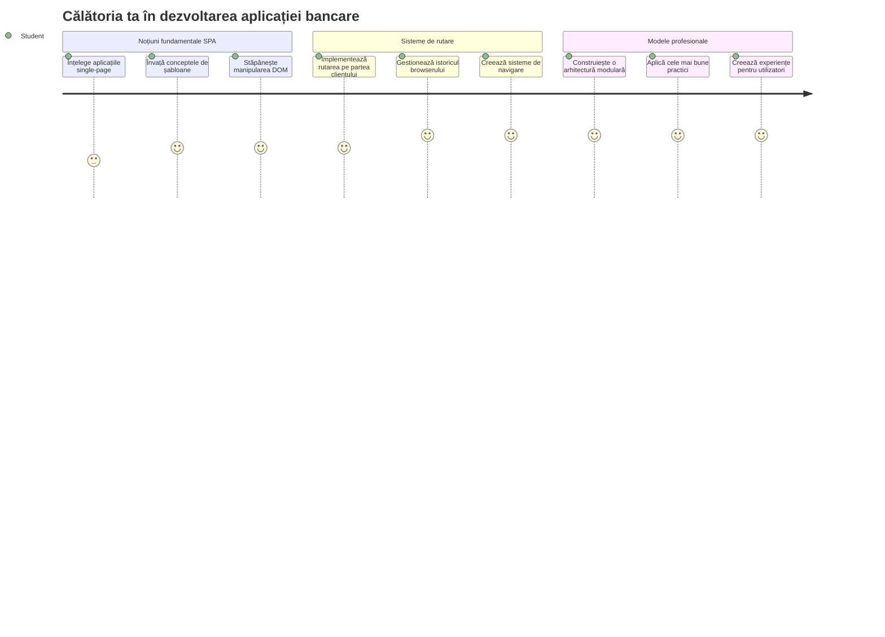
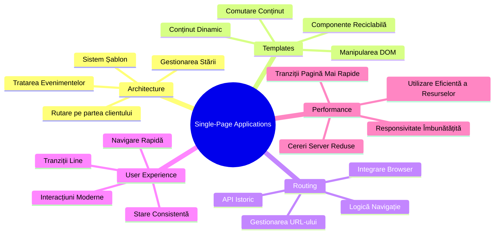
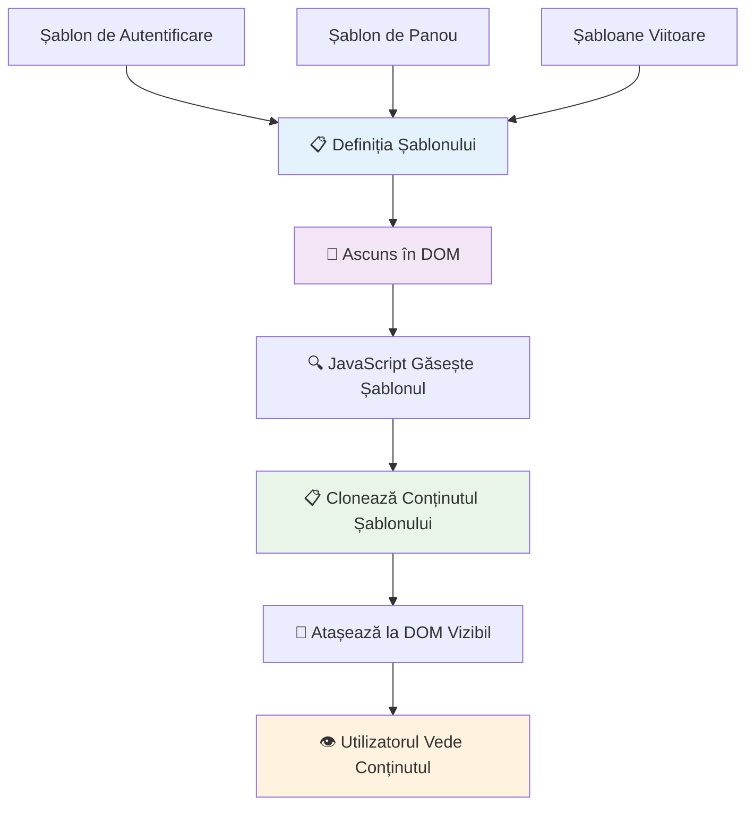
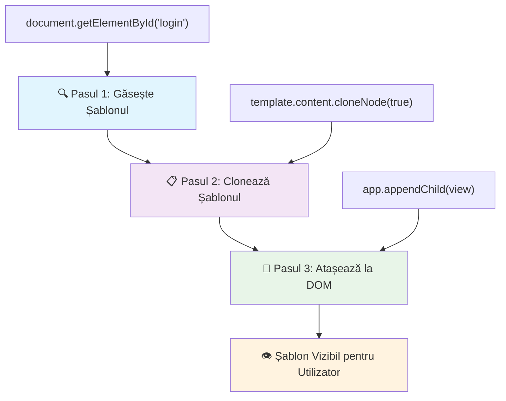
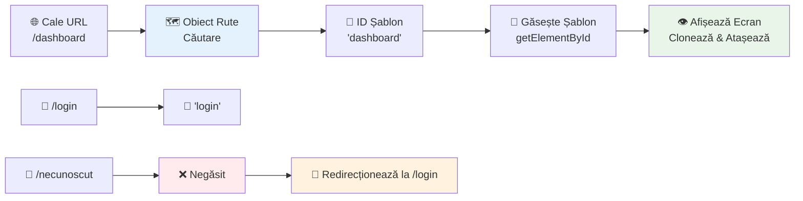
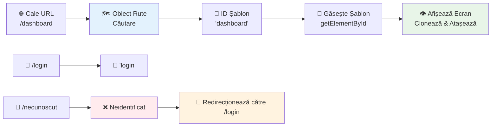
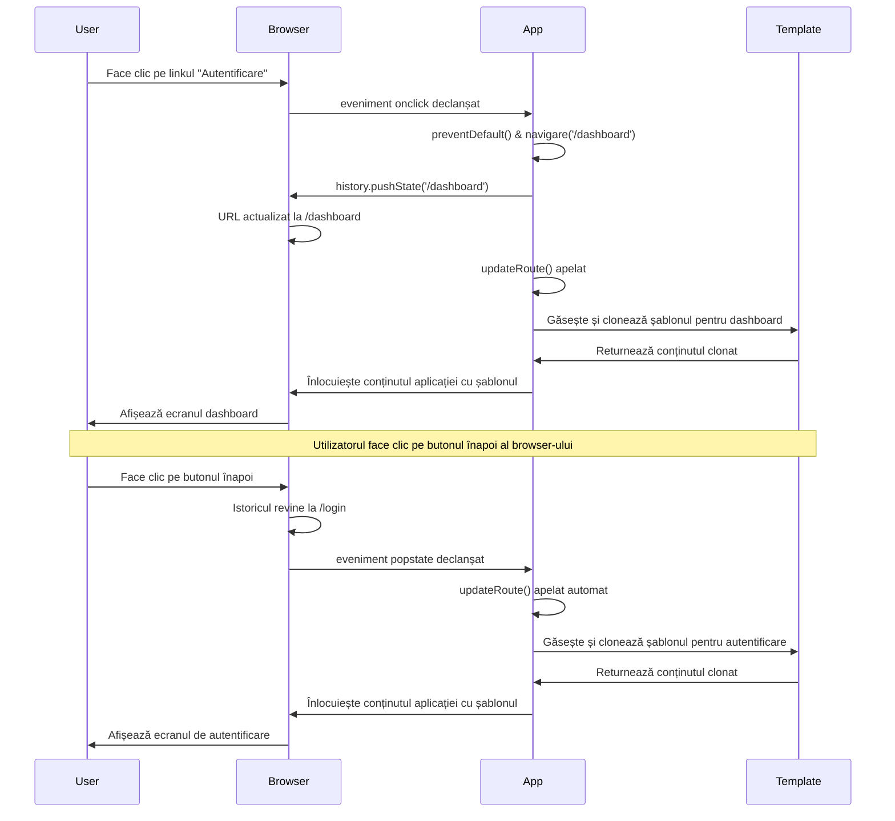
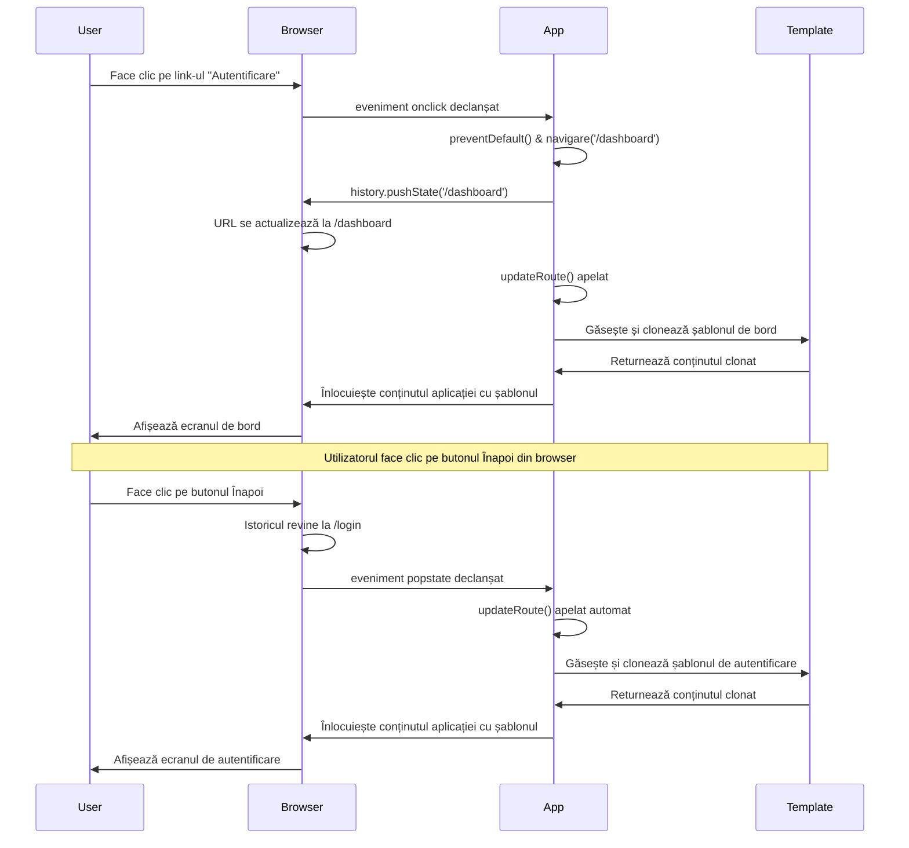
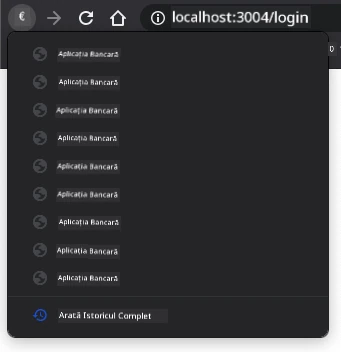
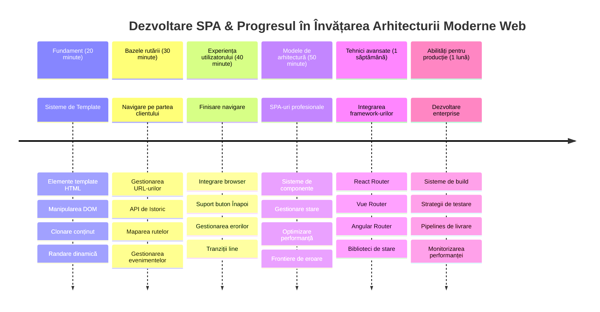

# Construiește o Aplicație Bancară Partea 1: Șabloane HTML și Rute într-o Aplicație Web


Când calculatorul de navigare Apollo 11 a navigat către lună în 1969, a trebuit să comute între diferite programe fără a reporni întregul sistem. Aplicațiile web moderne funcționează similar – schimbă ce vezi fără a reîncărca totul de la zero. Acest lucru creează experiența fluidă și receptivă pe care utilizatorii o așteaptă astăzi.

Spre deosebire de site-urile web tradiționale care reîncarcă pagini întregi pentru fiecare interacțiune, aplicațiile web moderne actualizează doar părțile care trebuie schimbate. Această abordare, la fel cum centrul de control al misiunii comută între diferite afișaje menținând comunicarea constantă, creează acea experiență fluidă la care ne-am obișnuit.

Iată ce face diferența atât de dramatică:

| Aplicații Multi-Pagină Tradiționale | Aplicații Moderne Single-Page |
|-------------------------------------|-------------------------------|
| **Navigare** | Reîncărcare completă a paginii pentru fiecare ecran | Comutare instantanee a conținutului |
| **Performanță** | Mai lentă din cauza descărcărilor complete HTML | Mai rapidă cu actualizări parțiale |
| **Experiență Utilizator** | Clipiri bruște ale paginii | Tranziții line, asemănătoare aplicațiilor |
| **Partajare Date** | Dificil între pagini | Management ușor al stării |
| **Dezvoltare** | Mai multe fișiere HTML de întreținut | Un singur HTML cu șabloane dinamice |

**Înțelegerea evoluției:**
- **Aplicațiile tradiționale** necesită cereri către server pentru fiecare acțiune de navigare
- **Spațiile moderne Single-Page** se încarcă o dată și actualizează conținutul dinamic folosind JavaScript
- **Așteptările utilizatorilor** favorizează acum interacțiuni instantanee, fluide
- **Beneficiile performanței** includ reducerea lățimii de bandă și răspunsuri mai rapide

În această lecție, vom construi o aplicație bancară cu mai multe ecrane care curg împreună fără întreruperi. La fel cum oamenii de știință folosesc instrumente modulare care pot fi reconfigurate pentru experimente diferite, vom folosi șabloane HTML ca componente reutilizabile care pot fi afișate după necesitate.

Vei lucra cu șabloane HTML (planșe reutilizabile pentru diferite ecrane), rutare JavaScript (sistemul care comută între ecrane) și API-ul de istorie al browserului (care menține butonul „înapoi” funcțional). Acestea sunt aceleași tehnici fundamentale folosite de frameworkuri precum React, Vue și Angular.

La final, vei avea o aplicație bancară funcțională care demonstrează principiile profesionale ale aplicațiilor single-page.


## Chestionar Pre-Lecție

[Chestionar pre-lectură](https://ff-quizzes.netlify.app/web/quiz/41)

### Ce Vei Avea Nevoie

Avem nevoie de un server web local pentru a testa aplicația bancară – nu-ți face griji, este mai ușor decât pare! Dacă nu ai deja unul configurat, instalează pur și simplu [Node.js](https://nodejs.org) și rulează `npx lite-server` din folderul proiectului tău. Această comandă utilă pornește un server local și deschide automat aplicația în browser.

### Pregătire

Pe calculatorul tău, creează un folder numit `bank` cu un fișier numit `index.html` în interior. Vom începe de la acest [boilerplate](https://en.wikipedia.org/wiki/Boilerplate_code) HTML:

```html
<!DOCTYPE html>
<html lang="en">
  <head>
    <meta charset="UTF-8">
    <meta name="viewport" content="width=device-width, initial-scale=1.0">
    <title>Bank App</title>
  </head>
  <body>
    <!-- This is where you'll work -->
  </body>
</html>
```

**Ce oferă acest boilerplate:**
- **Stabilește** structura documentului HTML5 cu declarația corectă DOCTYPE
- **Configurează** codarea caracterelor ca UTF-8 pentru suport internațional al textului
- **Activează** designul responsive cu tag-ul meta viewport pentru compatibilitate mobilă
- **Setează** un titlu descriptiv care apare în fila browserului
- **Creează** o secțiune body curată unde vom construi aplicația noastră

> 📁 **Previzualizare Structură Proiect**
> 
> **Până la finalul acestei lecții, proiectul tău va conține:**
> ```
> bank/
> ├── index.html      <!-- Main HTML with templates -->
> ├── app.js          <!-- Routing and navigation logic -->
> └── style.css       <!-- (Optional for future lessons) -->
> ```
> 
> **Responsabilitățile fișierelor:**
> - **index.html**: Conține toate șabloanele și oferă structura aplicației
> - **app.js**: Gestionează rutarea, navigarea și managementul șabloanelor
> - **Șabloane**: Definirea UI-ului pentru pagini de login, dashboard și alte ecrane

---

## Șabloane HTML

Șabloanele rezolvă o problemă fundamentală în dezvoltarea web. Când Gutenberg a inventat tiparul cu caractere mobile în anii 1440, și-a dat seama că în loc să sculpteze pagini întregi, poate crea blocuri de litere reutilizabile și să le aranjeze după necesitate. Șabloanele HTML funcționează pe același principiu – în loc să creezi fișiere HTML separate pentru fiecare ecran, definești structuri reutilizabile care pot fi afișate după nevoie.


Gândește șabloanele ca planuri pentru diferite părți ale aplicației tale. Așa cum un arhitect creează un plan o singură dată și îl folosește de mai multe ori în loc să redeseneze camere identice, noi creăm șabloane o dată și le instanțiem după nevoie. Browserul păstrează aceste șabloane ascunse până când JavaScript le activează.

Dacă vrei să creezi multiple ecrane pentru o pagină web, o soluție ar fi să creezi un fișier HTML pentru fiecare ecran pe care vrei să-l afișezi. Totuși, această soluție vine cu unele inconvenient:

- Trebuie să reîncarci întregul HTML când schimbi ecranul, ceea ce poate fi lent.
- Este dificil să partajezi date între diferite ecrane.

O altă abordare este să ai un singur fișier HTML și să definești multiple [șabloane HTML](https://developer.mozilla.org/docs/Web/HTML/Element/template) folosind elementul `<template>`. Un șablon este un bloc HTML reutilizabil care nu este afișat de browser și trebuie instanțiat la rulare folosind JavaScript.

### Hai să-l Construim

Vom crea o aplicație bancară cu două ecrane principale: o pagină de login și un dashboard. Mai întâi, să adăugăm un element placeholder în corpul HTML – aici vor apărea toate ecranele noastre diferite:

```html
<div id="app">Loading...</div>
```

**Înțelegerea acestui placeholder:**
- **Creează** un container cu ID-ul "app" unde vor fi afișate toate ecranele
- **Arată** un mesaj de încărcare până când JavaScript-ul inițializează primul ecran
- **Oferă** un singur punct de montare pentru conținutul nostru dinamic
- **Permite** o țintire ușoară din JavaScript folosind `document.getElementById()`

> 💡 **Sfaturi Profesionale**: Deoarece conținutul acestui element va fi înlocuit, putem pune un mesaj sau indicator de încărcare care va fi afișat în timp ce aplicația se încarcă.

În continuare, să adăugăm sub acesta șablonul HTML pentru pagina de login. Deocamdată vom pune acolo doar un titlu și o secțiune care conține un link pentru navigare.

```html
<template id="login">
  <h1>Bank App</h1>
  <section>
    <a href="/dashboard">Login</a>
  </section>
</template>
```

**Analiza acestui șablon de login:**
- **Definește** un șablon cu identificatorul unic "login" pentru țintirea din JavaScript
- **Include** un titlu principal care stabilește brandingul aplicației
- **Conține** un element semantic `<section>` pentru gruparea conținutului aferent
- **Oferă** un link de navigare care va direcționa utilizatorii către dashboard

Apoi vom adăuga un alt șablon HTML pentru pagina dashboard. Aceasta pagină va conține secțiuni diferite:

- Un antet cu un titlu și un link de logout
- Soldul curent al contului bancar
- O listă de tranzacții, afișată într-un tabel

```html
<template id="dashboard">
  <header>
    <h1>Bank App</h1>
    <a href="/login">Logout</a>
  </header>
  <section>
    Balance: 100$
  </section>
  <section>
    <h2>Transactions</h2>
    <table>
      <thead>
        <tr>
          <th>Date</th>
          <th>Object</th>
          <th>Amount</th>
        </tr>
      </thead>
      <tbody></tbody>
    </table>
  </section>
</template>
```

**Să înțelegem fiecare parte a acestui dashboard:**
- **Structura** pagina cu un element semantic `<header>` care conține navigația
- **Afișează** titlul aplicației consecvent pe toate ecranele pentru branding
- **Oferă** un link de logout care redirecționează înapoi la ecranul de login
- **Arată** soldul contului curent într-o secțiune dedicată
- **Organizează** datele despre tranzacții folosind un tabel HTML bine structurat
- **Definește** anteturile tabelului pentru coloanele Data, Obiect și Sumă
- **Lasă** corpul tabelului gol pentru a injecta conținut dinamic ulterior

> 💡 **Sfaturi Profesionale**: Când creezi șabloane HTML, dacă vrei să vezi cum va arăta, poți comenta liniile `<template>` și `</template>` învelindu-le cu `<!-- -->`.

### 🔄 **Verificare Pedagogică**
**Înțelegerea Sistemului de Șabloane**: Înainte de a implementa JavaScript, asigură-te că înțelegi:
- ✅ Cum diferă șabloanele de elementele HTML obișnuite
- ✅ De ce șabloanele rămân ascunse până când sunt activate de JavaScript
- ✅ Importanța structurii semantice HTML în șabloane
- ✅ Cum șabloanele permit componente UI reutilizabile

**Test Rapid:** Ce se întâmplă dacă elimini tag-urile `<template>` din jurul HTML-ului tău?
*Răspuns: Conținutul devine vizibil imediat și pierde funcționalitatea de șablon*

**Beneficiile Arhitecturii:** Șabloanele oferă:
- **Reutilizabilitate**: O definiție, multiple instanțe
- **Performanță**: Fără parsări HTML redundante
- **Întreținere**: Structură UI centralizată
- **Flexibilitate**: Comutare dinamică a conținutului

✅ De ce crezi că folosim atribute `id` pe șabloane? Am putea folosi altceva, precum clase?

## Aducerea Șabloanelor la Viață cu JavaScript

Acum trebuie să facem șabloanele noastre funcționale. Așa cum o imprimantă 3D ia un plan digital și creează un obiect fizic, JavaScript ia șabloanele noastre ascunse și generează elemente vizibile și interactive pe care utilizatorii le pot vedea și folosi.

Procesul urmează trei pași consecvenți care formează fundamentul dezvoltării web moderne. Odată ce înțelegi acest tipar, îl vei recunoaște în multe framework-uri și librării.

Dacă încerci fișierul tău HTML în browser, vei vedea că rămâne blocat afișând `Loading...`. Asta pentru că trebuie să adăugăm cod JavaScript pentru a instanția și afișa șabloanele HTML.

Instanțierea unui șablon se face de obicei în 3 pași:

1. Preluarea elementului șablon din DOM, de exemplu folosind [`document.getElementById`](https://developer.mozilla.org/docs/Web/API/Document/getElementById).
2. Clonarea elementului șablon, folosind [`cloneNode`](https://developer.mozilla.org/docs/Web/API/Node/cloneNode).
3. Atașarea lui la DOM sub un element vizibil, de exemplu folosind [`appendChild`](https://developer.mozilla.org/docs/Web/API/Node/appendChild).


**Analiză vizuală a procesului:**
- **Pasul 1** localizează șablonul ascuns în structura DOM
- **Pasul 2** creează o copie funcțională ce poate fi modificată în siguranță
- **Pasul 3** inserează copia în zona vizibilă a paginii
- **Rezultatul** este un ecran funcțional cu care utilizatorii pot interacționa

✅ De ce trebuie să clonăm șablonul înainte de a-l atașa la DOM? Ce crezi că s-ar întâmpla dacă am sări peste acest pas?

### Sarcină

Creează un fișier nou numit `app.js` în folderul proiectului tău și importă acel fișier în secțiunea `<head>` a HTML-ului tău:

```html
<script src="app.js" defer></script>
```

**Înțelegerea importului acestui script:**
- **Leagă** fișierul JavaScript la documentul HTML
- **Folosește** atributul `defer` pentru a asigura rularea scriptului după terminarea parsării HTML
- **Permite** accesul la toate elementele DOM deoarece acestea sunt complet încărcate înainte de rularea scriptului
- **Respectă** cele mai bune practici moderne pentru încărcarea scripturilor și performanță

Acum, în `app.js`, vom crea o funcție nouă `updateRoute`:

```js
function updateRoute(templateId) {
  const template = document.getElementById(templateId);
  const view = template.content.cloneNode(true);
  const app = document.getElementById('app');
  app.innerHTML = '';
  app.appendChild(view);
}
```

**Pas cu pas, ce se întâmplă:**
- **Localizează** elementul șablon folosind ID-ul său unic
- **Creează** o copie adâncă a conținutului șablonului folosind `cloneNode(true)`
- **Găsește** containerul aplicației unde va fi afișat conținutul
- **Șterge** orice conținut existent din containerul aplicației
- **Inserează** conținutul clonat al șablonului în DOM-ul vizibil

Acum apelează această funcție cu unul dintre șabloane și vezi rezultatul.

```js
updateRoute('login');
```

**Ce realizează această apelare a funcției:**
- **Activează** șablonul de login trecând ID-ul său ca parametru
- **Demonstrează** cum să comuți programatic între ecranele aplicației
- **Afișează** ecranul de login în locul mesajului „Loading...”

✅ Care este scopul codului `app.innerHTML = '';`? Ce se întâmplă fără el?

## Crearea Rutelor

Rutarea în esență înseamnă conectarea URL-urilor la conținutul corect. Gândește-te cum operatorii telefonici timpurii foloseau panouri de comutare pentru a conecta apelurile – preluau o cerere și o direcționau către destinația corectă. Rutarea web funcționează similar, preluând o solicitare URL și determinând ce conținut să afișeze.


Tradițional, serverele web gestionau acest lucru servind fișiere HTML diferite pentru URL-uri diferite. Deoarece construim o aplicație single-page, trebuie să gestionăm această rutare singuri folosind JavaScript. Această abordare ne oferă mai mult control asupra experienței utilizatorului și a performanței.


**Înțelegerea fluxului de rutare:**
- **Schimbările URL-ului** declanșează o căutare în configurația noastră de rute
- **Rutele valide** se mapează la ID-uri șabloane specifice pentru redare
- **Rutele invalide** declanșează un comportament fallback pentru a preveni stări incorecte
- **Redarea șabloanelor** urmează procesul în trei pași pe care l-am învățat anterior

Când vorbim despre o aplicație web, numim *Rutare* intenția de a mapa **URL-uri** către ecrane specifice care trebuie afișate. Pe un site cu mai multe fișiere HTML, acest lucru se face automat deoarece calea fișierului se reflectă în URL. De exemplu, cu aceste fișiere în folderul tău de proiect:

```
mywebsite/index.html
mywebsite/login.html
mywebsite/admin/index.html
```

Dacă creezi un server web cu `mywebsite` ca rădăcină, maparea URL-ului va fi:

```
https://site.com            --> mywebsite/index.html
https://site.com/login.html --> mywebsite/login.html
https://site.com/admin/     --> mywebsite/admin/index.html
```

Totuși, pentru aplicația noastră web folosim un singur fișier HTML care conține toate ecranele, deci acest comportament implicit nu ne ajută. Trebuie să creăm această mapare manual și să actualizăm șablonul afișat folosind JavaScript.

### Sarcină

Vom folosi un obiect simplu pentru a implementa o [hartă](https://en.wikipedia.org/wiki/Associative_array) între căile URL și șabloanele noastre. Adaugă acest obiect în partea de sus a fișierului `app.js`.

```js
const routes = {
  '/login': { templateId: 'login' },
  '/dashboard': { templateId: 'dashboard' },
};
```

**Înțelegerea acestei configurații de rute:**
- **Definește** o mapare între căile URL și identificatorii șabloanelor
- **Folosește** sintaxa obiectului unde cheile sunt căile URL și valorile conțin informații despre șablon
- **Permite** o căutare ușoară a șablonului care trebuie afișat pentru orice URL dat
- **Oferă** o structură scalabilă pentru adăugarea de rute noi în viitor
Acum să modificăm puțin funcția `updateRoute`. În loc să trimitem direct `templateId` ca argument, vrem să îl obținem mai întâi verificând URL-ul curent, apoi să folosim harta noastră pentru a obține valoarea ID-ului de șablon corespunzător. Putem folosi [`window.location.pathname`](https://developer.mozilla.org/docs/Web/API/Location/pathname) pentru a obține doar secțiunea de cale din URL.

```js
function updateRoute() {
  const path = window.location.pathname;
  const route = routes[path];

  const template = document.getElementById(route.templateId);
  const view = template.content.cloneNode(true);
  const app = document.getElementById('app');
  app.innerHTML = '';
  app.appendChild(view);
}
```

**Descompunând ce se întâmplă aici:**
- **Extrage** calea curentă din URL-ul browserului folosind `window.location.pathname`
- **Caută** configurația rutei corespunzătoare în obiectul nostru de rute
- **Recuperează** ID-ul șablonului din configurația rutei
- **Urmărește** același proces de redare a șablonului ca înainte
- **Creează** un sistem dinamic care răspunde la schimbările URL-ului

Aici am mapat rutele declarate la șabloanele corespunzătoare. Poți încerca să verifici că funcționează corect modificând manual URL-ul în browser.

✅ Ce se întâmplă dacă introduci o cale necunoscută în URL? Cum am putea rezolva asta?

## Adăugarea Navigării

Odată stabilit rutarea, utilizatorii au nevoie de o modalitate de a naviga prin aplicație. Site-urile tradiționale reîncărcă pagini întregi la clic pe link-uri, dar noi vrem să actualizăm atât URL-ul, cât și conținutul fără reîncărcări de pagină. Acest lucru creează o experiență mai fluidă, similară cu modul în care aplicațiile desktop comută între diferite vizualizări.

Trebuie să coordonăm două lucruri: actualizarea URL-ului browserului astfel încât utilizatorii să poată salva pagini în favorite și să partajeze link-uri, și afișarea conținutului adecvat. Dacă este implementat corect, acest lucru creează navigarea fluidă pe care utilizatorii o așteaptă de la aplicațiile moderne.


### 🔄 **Verificare Pedagogică**
**Arhitectura Single-Page Application**: Verifică-ți înțelegerea sistemului complet:
- ✅ Cum diferă rutarea pe client de rutarea tradițională pe server?
- ✅ De ce este API-ul History esențial pentru navigarea corectă într-un SPA?
- ✅ Cum permit șabloanele conținutului dinamic fără reîncărcarea paginii?
- ✅ Ce rol are gestionarea evenimentelor în interceptarea navigării?

**Integrarea Sistemului**: SPA-ul tău demonstrează:
- **Gestionarea Șabloanelor**: Componente UI reutilizabile cu conținut dinamic
- **Rutare pe Client**: Administrarea URL-urilor fără cereri de server
- **Arhitectură Eveniment-Driven**: Navigare și interacțiuni responsive
- **Integrare Browser**: Support pentru butoanele de înainte/înapoi și istoric
- **Optimizare Performanță**: Tranziții rapide și încărcare redusă pe server

**Pattern-uri Profesionale**: Ai implementat:
- **Separarea Model-Vedere**: Șabloane separate de logica aplicației
- **Gestionarea Stării**: Starea URL-ului sincronizată cu conținutul afișat
- **Îmbunătățire Progresivă**: JavaScript care îmbunătățește funcționalitatea HTML de bază
- **Experiență Utilizator**: Navigare fluidă, ca o aplicație, fără reîncărcări de pagină

> � **Insight Arhitectural**: Componentele Sistemului de Navigație
>
> **Ce construiești:**
> - **🔄 Gestionarea URL-ului**: Actualizează bara de adrese fără reîncărcarea paginii
> - **📋 Sistemul de Șabloane**: Schimbă conținutul dinamic în funcție de ruta curentă  
> - **📚 Integrarea Istoriei**: Menține funcționalitatea butoanelor înainte/înapoi
> - **🛡️ Gestionarea Erorilor**: Fallback-uri elegante pentru rute invalide sau lipsă
>
> **Cum funcționează împreună componentele:**
> - **Ascultă** evenimentele de navigare (clicuri, schimbări de istoric)
> - **Actualizează** URL-ul folosind API-ul History
> - **Redă** șablonul corespunzător noii rute
> - **Menține** o experiență seamless pentru utilizator pe tot parcursul

Următorul pas pentru aplicația noastră este să adăugăm posibilitatea de a naviga între pagini fără a schimba manual URL-ul. Aceasta implică două lucruri:

  1. Actualizarea URL-ului curent
  2. Actualizarea șablonului afișat pe baza noului URL

Am rezolvat deja partea a doua cu funcția `updateRoute`, deci trebuie să găsim cum să actualizăm URL-ul curent.

Va trebui să folosim JavaScript, mai exact [`history.pushState`](https://developer.mozilla.org/docs/Web/API/History/pushState), care permite actualizarea URL-ului și crearea unei noi intrări în istoricul de navigare, fără a reîncărca HTML-ul.

> ⚠️ **Notă Importantă**: În timp ce elementul HTML ancoră [`<a href>`](https://developer.mozilla.org/docs/Web/HTML/Element/a) poate fi folosit singur pentru a crea hyperlink-uri către URL-uri diferite, implicit va determina browserul să reîncarce HTML-ul. Este necesar să prevenim acest comportament când gestionăm rutarea cu JavaScript personalizat, folosind funcția preventDefault() la evenimentul click.

### Sarcină

Să creăm o funcție nouă pe care să o folosim pentru a naviga în aplicația noastră:

```js
function navigate(path) {
  window.history.pushState({}, path, path);
  updateRoute();
}
```

**Înțelegerea acestei funcții de navigare:**
- **Actualizează** URL-ul browserului către noua cale folosind `history.pushState`
- **Adaugă** o nouă intrare în stiva de istoric pentru suportul corect al butoanelor înainte/înapoi
- **Pornește** funcția `updateRoute()` pentru a afișa șablonul corespunzător
- **Menține** experiența SPA fără reîncărcări de pagină

Această metodă actualizează mai întâi URL-ul curent pe baza căii date, apoi actualizează șablonul. Proprietatea `window.location.origin` returnează rădăcina URL-ului, permițând reconstruirea unui URL complet dintr-o cale dată.

Acum că avem această funcție, putem rezolva problema dacă o cale nu se potrivește cu nicio rută definită. Vom modifica funcția `updateRoute` adăugând un fallback către una dintre rutele existente dacă nu găsim potrivire.

```js
function updateRoute() {
  const path = window.location.pathname;
  const route = routes[path];

  if (!route) {
    return navigate('/login');
  }

  const template = document.getElementById(route.templateId);
  const view = template.content.cloneNode(true);
  const app = document.getElementById('app');
  app.innerHTML = '';
  app.appendChild(view);
}
```

**Aspecte cheie de reținut:**
- **Verifică** dacă există o rută pentru calea curentă
- **Redirecționează** către pagina de login când se accesează o rută invalidă
- **Oferă** un mecanism fallback care previne navigarea stricat
- **Asigură** că utilizatorii văd întotdeauna un ecran valid, chiar și cu URL-uri incorecte

Dacă nu găsim o rută, redirecționăm acum către pagina `login`.

Acum să creăm o funcție care să preia URL-ul când se face clic pe un link și să prevină comportamentul implicit al browserului:

```js
function onLinkClick(event) {
  event.preventDefault();
  navigate(event.target.href);
}
```

**Descompunerea acestui handler pentru clic:**
- **Previne** comportamentul implicit al browserului pentru link folosind `preventDefault()`
- **Extrage** URL-ul destinației din elementul link clicat
- **Apelează** funcția noastră custom navigate în loc să reîncarce pagina
- **Menține** experiența fluidă de aplicație single-page

```html
<a href="/dashboard" onclick="onLinkClick(event)">Login</a>
...
<a href="/login" onclick="onLinkClick(event)">Logout</a>
```

**Ce realizează această legare onclick:**
- **Leagă** fiecare link la sistemul nostru personalizat de navigare
- **Trimite** evenimentul click funcției `onLinkClick` pentru procesare
- **Permite** navigare fluidă fără reîncărcarea paginii
- **Menține** structura corectă a URL-ului pentru salvare în favorite sau partajare

Atributul [`onclick`](https://developer.mozilla.org/docs/Web/API/GlobalEventHandlers/onclick) leagă evenimentul `click` de codul JavaScript, aici apelul către funcția `navigate()`.

Încearcă să dai clic pe aceste link-uri, ar trebui să poți acum să navighezi între ecranele aplicației tale.

✅ Metoda `history.pushState` face parte din standardul HTML5 și este implementată în [toate browserele moderne](https://caniuse.com/?search=pushState). Dacă construiești o aplicație web pentru browsere mai vechi, există un truc pe care îl poți folosi în loc de acest API: folosind un [hash (`#`)](https://en.wikipedia.org/wiki/URI_fragment) înaintea căii poți implementa o rutare care funcționează cu navigarea principală a ancorelor și care nu reîncarcă pagina, fiind destinată să creeze link-uri interne în cadrul unei pagini.

## Activarea Butoanelor Înapoi și Înainte

Butoanele înapoi și înainte sunt fundamentale pentru navigarea web, la fel cum controlorii misiunilor NASA pot revizui stările anterioare ale sistemului în timpul misiunilor spațiale. Utilizatorii se așteaptă ca aceste butoane să funcționeze, iar când nu funcționează, afectează experiența de navigare așteptată.

Aplicația noastră single-page necesită configurație suplimentară pentru a le susține. Browserul păstrează o stivă de istoric (pe care am adăugat-o folosind `history.pushState`), dar când utilizatorii navighează în acest istoric, aplicația trebuie să răspundă prin actualizarea conținutului afișat corespunzător.


**Puncte cheie de interacțiune:**
- **Acțiunile utilizatorilor** declanșează navigare prin clic-uri sau butoane browser
- **Aplicația interceptează** clicurile pe link-uri pentru a preveni reîncărcarea paginii
- **API-ul History** gestionează schimbările URL și stiva istorică a browserului
- **Șabloanele** oferă structura conținutului pentru fiecare ecran
- **Ascultătorii de evenimente** asigură că aplicația răspunde tuturor tipurilor de navigare

Folosirea `history.pushState` creează intrări noi în istoricul de navigare al browserului. Poți verifica ținând apăsat *butonul înapoi* al browserului, ar trebui să afișeze ceva de genul:



Dacă apeși butonul înapoi de câteva ori, vei vedea că URL-ul se schimbă și istoricul este actualizat, dar același șablon continuă să fie afișat.

Asta pentru că aplicația nu știe că trebuie să apelăm `updateRoute()` de fiecare dată când istoricul se schimbă. Dacă arunci o privire la documentația [`history.pushState`](https://developer.mozilla.org/docs/Web/API/History/pushState), vei observa că dacă starea se schimbă – ceea ce înseamnă că am trecut la un URL diferit – evenimentul [`popstate`](https://developer.mozilla.org/docs/Web/API/Window/popstate_event) este declanșat. Vom folosi acest lucru pentru a remedia problema.

### Sarcină

Pentru a ne asigura că șablonul afișat este actualizat când istoricul browserului se schimbă, vom atașa o nouă funcție care apelează `updateRoute()`. Vom face asta în partea de jos a fișierului nostru `app.js`:

```js
window.onpopstate = () => updateRoute();
updateRoute();
```

**Înțelegerea acestei integrări a istoricului:**
- **Ascultă** evenimentele `popstate` care apar când utilizatorii navighează cu butoanele browserului
- **Folosește** o funcție săgeată pentru sintaxă concisă a handler-ului
- **Apelează** `updateRoute()` automat ori de câte ori se schimbă starea istoricului
- **Inițializează** aplicația apelând `updateRoute()` la încărcarea paginii
- **Asigură** afișarea corectă a șablonului indiferent cum navighează utilizatorii

> 💡 **Sfat Profesional**: Am folosit aici o [funcție săgeată](https://developer.mozilla.org/docs/Web/JavaScript/Reference/Functions/Arrow_functions) pentru a declara handler-ul nostru de eveniment `popstate` pentru concizie, dar o funcție obișnuită ar funcționa la fel.

Iată un videoclip de recapitulare despre funcțiile săgeată:

[](https://youtube.com/watch?v=OP6eEbOj2sc "Arrow Functions")

> 🎥 Apasă imaginea de mai sus pentru un video despre funcțiile săgeată.

Acum încearcă să folosești butoanele înapoi și înainte ale browserului și verifică că ruta afișată este actualizată corect de această dată.

### ⚡ **Ce poți face în următoarele 5 minute**
- [ ] Testează navigarea aplicației tale bancare folosind butoanele înapoi/înainte ale browserului
- [ ] Încearcă să tastezi manual URL-uri diferite în bara de adrese pentru a testa rutarea
- [ ] Deschide DevTools și inspectează cum sunt clonate șabloanele în DOM
- [ ] Experimentează adăugând console.log pentru a urmări fluxul rutării

### 🎯 **Ce poți realiza în această oră**
- [ ] Completează chestionarul post-lecție și înțelege conceptele de arhitectură SPA
- [ ] Adaugă stil CSS pentru a face șabloanele aplicației bancare profesionale
- [ ] Implementează pagina de eroare 404 cu gestionare corectă a erorilor
- [ ] Creează pagina de credite cu funcționalități suplimentare de rutare
- [ ] Adaugă stări de încărcare și tranziții între schimbările de șabloane

### 📅 **Parcursul tău de dezvoltare SPA pe o săptămână**
- [ ] Finalizează aplicația bancară completă cu formulare, gestionare date și persistență
- [ ] Adaugă funcționalități avansate de rutare, cum ar fi parametri și rute încorporate
- [ ] Implementează gardieni de navigare și rutare bazată pe autentificare
- [ ] Creează componente de șabloane reutilizabile și o bibliotecă de componente
- [ ] Adaugă animații și tranziții pentru o experiență utilizator mai fluidă
- [ ] Publică SPA-ul pe o platformă de hosting și configurează rutarea corect

### 🌟 **Maestria ta în arhitectura frontend pe o lună**
- [ ] Construiește SPA-uri complexe folosind framework-uri moderne ca React, Vue sau Angular
- [ ] Învață pattern-uri și biblioteci avansate pentru gestionarea stării
- [ ] Stăpânește uneltele de build și fluxurile de lucru pentru dezvoltare SPA
- [ ] Implementează caracteristici Progressive Web App și funcționalitate offline
- [ ] Studiază tehnici de optimizare a performanței pentru SPA-uri de mari dimensiuni
- [ ] Contribuie la proiecte open source SPA și împărtășește-ți cunoștințele

## 🎯 Cronologia ta pentru Maestria Single-Page Application


### 🛠️ Rezumatul Toolkit-ului tău pentru Dezvoltarea SPA-urilor

După ce ai terminat această lecție, ai stăpânit acum:
- **Arhitectura Șabloanelor**: Componente HTML reutilizabile cu redare dinamică a conținutului
- **Rutare pe Client**: Gestionarea și navigarea URL fără reîncărcare de pagină
- **Integrarea Browserului**: Utilizarea API-ului History și suport pentru butoanele înainte/înapoi
- **Sisteme bazate pe Evenimente**: Gestionarea navigării și a interacțiunilor utilizator
- **Manipularea DOM**: Clonare șabloane, comutare conținut și gestionare elemente
- **Gestionarea Erorilor**: Fallback-uri elegante pentru rute invalide și conținut lipsă
- **Pattern-uri de Performanță**: Încărcare și redare eficiente ale conținutului

**Aplicații din lumea reală**: Abilitățile tale în dezvoltarea SPA sunt aplicabile direct în:
- **Aplicații Web Moderne**: Dezvoltare cu React, Vue, Angular și alte framework-uri
- **Aplicații Web Progresive**: Aplicații capabile offline cu experiență similară aplicațiilor
- **Dashboard-uri Enterprise**: Aplicații complexe de business cu multiple vizualizări
- **Platforme e-commerce**: Cataloage de produse, coșuri de cumpărături și fluxuri de checkout
- **Managementul Conținutului**: Crearea și editarea dinamică a conținutului
- **Dezvoltare Mobilă**: Aplicații hibride folosind tehnologii web

**Competențe profesionale dobândite**: Acum poți să:
- **Arhitectura** aplicațiilor single-page cu separarea adecvată a responsabilităților
- **Implementați** sisteme de rutare pe client care să se extindă odată cu complexitatea aplicației
- **Depanați** fluxuri complexe de navigare folosind uneltele de dezvoltare ale browserului
- **Optimizarea** performanței aplicației prin gestionarea eficientă a template-urilor
- **Proiectați** experiențe de utilizator care să pară native și responsive

**Concepte de Frontend dezbătute**:
- **Arhitectura componentelor**: modele UI reutilizabile și sisteme de template-uri
- **Sincronizarea stării**: gestionarea stării URL-ului și istoricul browserului
- **Programare orientată pe evenimente**: gestionarea interacțiunilor utilizatorului și navigarea
- **Optimizarea performanței**: manipularea eficientă a DOM-ului și încărcarea conținutului
- **Designul experienței utilizatorului**: tranziții fluide și navigare intuitivă

**Următorul nivel**: Ești pregătit să explorezi framework-uri moderne de frontend, gestionarea avansată a stării sau să construiești aplicații enterprise complexe!

🌟 **Performanță deblocată**: Ai construit o fundație profesională pentru aplicații single-page folosind modele moderne de arhitectură web!

---

## Provocarea GitHub Copilot Agent 🚀

Folosește modul Agent pentru a finaliza următoarea provocare:

**Descriere:** Îmbunătățește aplicația bancară prin implementarea gestionării erorilor și a unui template de pagină 404 pentru rutele invalide, îmbunătățind experiența utilizatorului în cazul navigării către pagini inexistente.

**Indicații:** Creează un nou template HTML cu id-ul "not-found" care să afișeze o pagină de eroare 404 prietenoasă utilizatorului, cu stilizare. Apoi modifică logica de rutare JavaScript pentru a afișa acest template când utilizatorii accesează URL-uri invalide, și adaugă un buton "Mergi acasă" care să navigheze înapoi la pagina de login.

Află mai multe despre [modul agent](https://code.visualstudio.com/blogs/2025/02/24/introducing-copilot-agent-mode) aici.

## 🚀 Provocare

Adaugă un nou template și o rută pentru o a treia pagină care să afișeze creditele pentru această aplicație.

**Obiectivele provocării:**
- **Creează** un nou template HTML cu o structură potrivită a conținutului
- **Adaugă** noua rută în obiectul de configurare a rutelor
- **Include** linkuri de navigare către și dinspre pagina de credite
- **Testează** că întreaga navigare funcționează corect împreună cu istoricul browserului

## Test post-lecture

[Test post-lecture](https://ff-quizzes.netlify.app/web/quiz/42)

## Revizuire și studiu individual

Rutarea este una dintre cele mai surprinzător de dificile părți ale dezvoltării web, mai ales pe măsură ce web-ul trece de la comportamentul de reîmprospătare a paginii la reîmprospătarea paginii în aplicații Single Page. Citește puțin despre [cum serviciul Azure Static Web App](https://docs.microsoft.com/azure/static-web-apps/routes/?WT.mc_id=academic-77807-sagibbon) gestionează rutarea. Poți explica de ce unele dintre deciziile descrise în document sunt necesare?

**Resurse suplimentare de învățare:**
- **Explorează** cum framework-uri populare precum React Router și Vue Router implementează rutarea pe client
- **Cercetează** diferențele dintre rutarea bazată pe hash și rutarea folosind API-ul history
- **Află** despre randarea pe server (SSR) și cum afectează strategiile de rutare
- **Investighează** cum aplicațiile progresive web (PWA) gestionează rutarea și navigarea

## Tema

[Îmbunătățește rutarea](assignment.md)

---

<!-- CO-OP TRANSLATOR DISCLAIMER START -->
**Declinare de responsabilitate**:
Acest document a fost tradus folosind serviciul de traducere AI [Co-op Translator](https://github.com/Azure/co-op-translator). Deși ne străduim pentru acuratețe, vă rugăm să rețineți că traducerile automate pot conține erori sau inexactități. Documentul original în limba sa nativă trebuie considerat sursa autorizată. Pentru informații critice, se recomandă traducerea profesională realizată de un specialist uman. Nu ne asumăm responsabilitatea pentru orice neînțelegeri sau interpretări eronate rezultate din utilizarea acestei traduceri.
<!-- CO-OP TRANSLATOR DISCLAIMER END -->