<!--
CO_OP_TRANSLATOR_METADATA:
{
  "original_hash": "7cbdbd132d39a2bb493e85bc2a9387cc",
  "translation_date": "2026-01-07T05:56:56+00:00",
  "source_file": "7-bank-project/2-forms/README.md",
  "language_code": "ro"
}
-->
# Construiește o Aplicație Bancară Partea 2: Construiește un Formular de Autentificare și Înregistrare

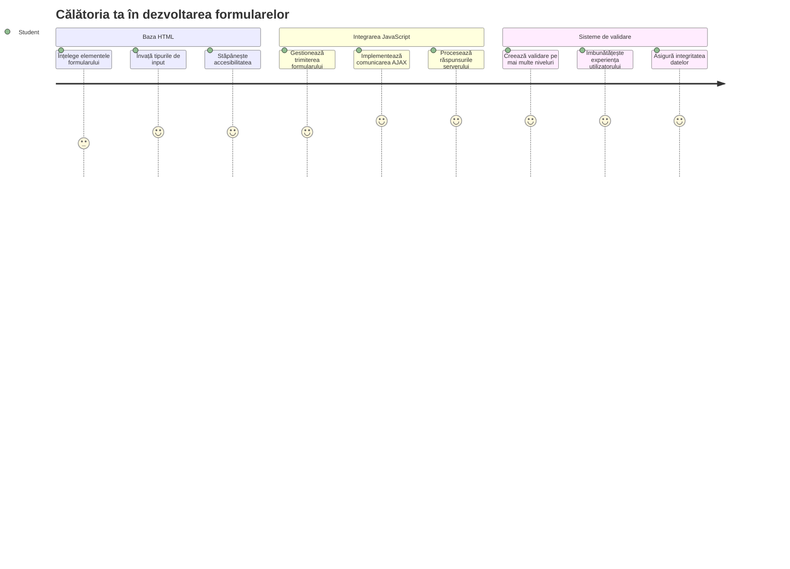
## Chestionar Pre-Prelecție

[Chestionar pre-prelecție](https://ff-quizzes.netlify.app/web/quiz/43)

Ți s-a întâmplat vreodată să completezi un formular online și să îți fie respins formatul de email? Sau să pierzi toate informațiile după ce ai apăsat trimite? Toți am experimentat astfel de frustrări.

Formularele sunt puntea dintre utilizatorii tăi și funcționalitatea aplicației tale. Așa cum protocoalele riguroase folosite de controlorii de trafic aerian ghidează avioanele în siguranță către destinațiile lor, formularele bine proiectate oferă feedback clar și previn erori costisitoare. În schimb, formularele prost realizate pot alunga utilizatorii mai repede decât o neînțelegere într-un aeroport aglomerat.

În această lecție, vom transforma aplicația ta bancară statică într-o aplicație interactivă. Vei învăța să construiești formulare care validează datele introduse de utilizatori, comunică cu serverele și oferă feedback util. Gândește-te la asta ca la crearea interfeței de control care permite utilizatorilor să navigheze funcționalitățile aplicației tale.

La final, vei avea un sistem complet de autentificare și înregistrare cu validare care îi ghidează pe utilizatori spre succes, nu spre frustrare.

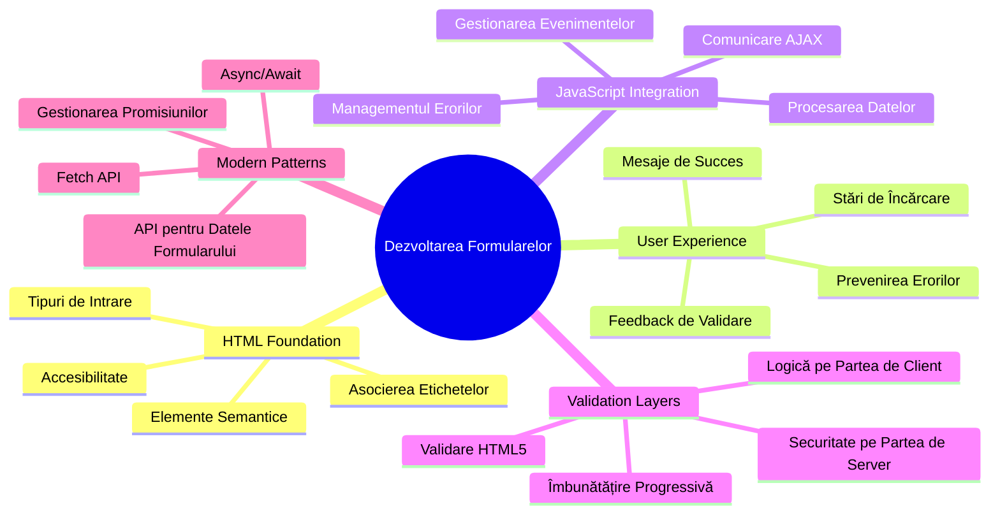
## Cerințe Prealabile

Înainte de a începe să construim formularele, să ne asigurăm că ai totul configurat corect. Această lecție continuă exact de unde am rămas în cea anterioară, așa că dacă ai sărit peste partea de bază, poate vrei să te întorci să o parcurgi mai întâi.

### Configurare necesară

| Componentă | Stare | Descriere |
|-----------|--------|-------------|
| [Șabloane HTML](../1-template-route/README.md) | ✅ Necesare | Structura de bază a aplicației tale bancare |
| [Node.js](https://nodejs.org) | ✅ Necesare | Mediu de execuție JavaScript pentru server |
| [Server API Bancar](../api/README.md) | ✅ Necesare | Serviciu backend pentru stocarea datelor |

> 💡 **Sfat de Dezvoltare**: Vei rula două servere separate simultan – unul pentru aplicația ta bancară frontend și altul pentru API-ul backend. Această configurare reflectă dezvoltarea din lumea reală, unde frontend-ul și backend-ul funcționează independent.

### Configurarea serverului

**Mediul tău de dezvoltare va include:**
- **Server frontend**: Deserveste aplicația ta bancară (de obicei portul `3000`)
- **Server API backend**: Gestionează stocarea și recuperarea datelor (portul `5000`)
- **Ambele servere** pot rula simultan fără conflicte

**Testarea conexiunii API:**
```bash
curl http://localhost:5000/api
# Răspuns așteptat: "Bank API v1.0.0"
```

**Dacă vezi răspunsul cu versiunea API, ești gata să continui!**

---

## Înțelegerea Formularelor HTML și a Controlurilor

Formularele HTML sunt modul prin care utilizatorii comunică cu aplicația ta web. Gândește-te la ele ca la sistemul de telegraf care conecta locuri îndepărtate în secolul al XIX-lea – ele sunt protocolul de comunicare între intenția utilizatorului și răspunsul aplicației. Când sunt concepute cu atenție, ele detectează erorile, ghidează formatul datelor și oferă sugestii utile.

Formularele moderne sunt mult mai sofisticate decât simple intrări text. HTML5 a introdus tipuri specializate de input care gestionează automat validarea emailurilor, formatarea numerelor și selecția datelor. Aceste îmbunătățiri aduc beneficii atât pentru accesibilitate, cât și pentru experiențele pe dispozitive mobile.

### Elemente esențiale de formular

**Blocurile de construcție de care are nevoie fiecare formular:**

```html
<!-- Basic form structure -->
<form id="userForm" method="POST">
  <label for="username">Username</label>
  <input id="username" name="username" type="text" required>
  
  <button type="submit">Submit</button>
</form>
```

**Iată ce face acest cod:**
- **Creează** un container pentru formular cu un identificator unic
- **Specifică** metoda HTTP pentru transmiterea datelor
- **Asociază** etichete (label) cu câmpurile pentru accesibilitate
- **Definește** un buton de trimitere pentru procesarea formularului

### Tipuri și atribute moderne pentru input

| Tip Input | Scop | Exemplu de utilizare |
|------------|---------|---------------|
| `text` | Intrare text generală | `<input type="text" name="username">` |
| `email` | Validare email | `<input type="email" name="email">` |
| `password` | Text ascuns | `<input type="password" name="password">` |
| `number` | Intrare numerică | `<input type="number" name="balance" min="0">` |
| `tel` | Numere de telefon | `<input type="tel" name="phone">` |

> 💡 **Avantaj HTML5 Modern**: Utilizarea unor tipuri specifice de input oferă validare automată, tastaturi mobile potrivite și suport mai bun pentru accesibilitate fără JavaScript suplimentar!

### Tipuri de butoane și comportamentul lor

```html
<!-- Different button behaviors -->
<button type="submit">Save Data</button>     <!-- Submits the form -->
<button type="reset">Clear Form</button>    <!-- Resets all fields -->
<button type="button">Custom Action</button> <!-- No default behavior -->
```

**Iată ce face fiecare tip de buton:**
- **Buton Submit**: Declanșează trimiterea formularului și trimite datele către endpoint-ul specificat
- **Buton Reset**: Resetează toate câmpurile formularului la starea inițială
- **Buton normal**: Nu oferă comportament implicit, fiind necesar JavaScript personalizat pentru funcționalitate

> ⚠️ **Notă Importantă**: Elementul `<input>` este autoînchis și nu necesită tag de închidere. Cea mai bună practică modernă este să scrii `<input>` fără bara oblică.

### Construirea formularului tău de autentificare

Acum să creăm un formular practic de autentificare care demonstrează bunele practici moderne pentru formulare HTML. Vom începe cu o structură de bază și o vom îmbunătăți treptat cu caracteristici de accesibilitate și validare.

```html
<template id="login">
  <h1>Bank App</h1>
  <section>
    <h2>Login</h2>
    <form id="loginForm" novalidate>
      <div class="form-group">
        <label for="username">Username</label>
        <input id="username" name="user" type="text" required 
               autocomplete="username" placeholder="Enter your username">
      </div>
      <button type="submit">Login</button>
    </form>
  </section>
</template>
```

**Descompunând ce se întâmplă aici:**
- **Structurarea** formularului cu elemente semantice HTML5
- **Gruparea** elementelor în containere `div` cu clase descriptive
- **Asocierea** etichetelor cu intrările folosind atributele `for` și `id`
- **Include** atribute moderne precum `autocomplete` și `placeholder` pentru o experiență mai bună
- **Adaugă** `novalidate` pentru a trata validarea cu JavaScript în locul validării implicite a browserului

### Puterea etichetelor corecte

**De ce contează etichetele pentru dezvoltarea web modernă:**

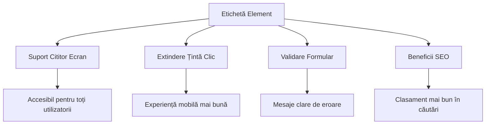
**Ce realizează etichetele corecte:**
- **Permite** cititoarelor de ecran să anunțe clar câmpurile de formular
- **Extinde** zona clicabilă (clic pe etichetă focalizează inputul)
- **Îmbunătățește** utilizarea pe mobil cu ținte tactice mai mari
- **Susține** validarea formularului cu mesaje de eroare relevante
- **Optimizează** SEO oferind semnificație semantică elementelor formularului

> 🎯 **Obiectiv Accesibilitate**: Fiecare câmp din formular ar trebui să aibă o etichetă asociată. Această practică simplă face formularele utilizabile pentru toată lumea, inclusiv pentru persoanele cu dizabilități, și îmbunătățește experiența tuturor utilizatorilor.

### Crearea formularului de înregistrare

Formularul de înregistrare necesită informații mai detaliate pentru a crea un cont complet de utilizator. Hai să-l construim cu caracteristici HTML5 moderne și accesibilitate îmbunătățită.

```html
<hr/>
<h2>Register</h2>
<form id="registerForm" novalidate>
  <div class="form-group">
    <label for="user">Username</label>
    <input id="user" name="user" type="text" required 
           autocomplete="username" placeholder="Choose a username">
  </div>
  
  <div class="form-group">
    <label for="currency">Currency</label>
    <input id="currency" name="currency" type="text" value="$" 
           required maxlength="3" placeholder="USD, EUR, etc.">
  </div>
  
  <div class="form-group">
    <label for="description">Account Description</label>
    <input id="description" name="description" type="text" 
           maxlength="100" placeholder="Personal savings, checking, etc.">
  </div>
  
  <div class="form-group">
    <label for="balance">Starting Balance</label>
    <input id="balance" name="balance" type="number" value="0" 
           min="0" step="0.01" placeholder="0.00">
  </div>
  
  <button type="submit">Create Account</button>
</form>
```

**În exemplul de mai sus am:**
- **Organizat** fiecare câmp în containere `div` pentru stilizare și layout mai bune
- **Adăugat** atributele `autocomplete` potrivite pentru suportul de completare automată a browserului
- **Includ** texte placeholder utile pentru a ghida utilizatorul
- **Setat** valori implicite rezonabile prin atributul `value`
- **Aplicat** atribute de validare precum `required`, `maxlength` și `min`
- **Folosind** `type="number"` pentru câmpul balansului cu suport pentru zecimale

### Explorarea tipurilor de input și comportamentului lor

**Tipurile moderne de input oferă funcționalități superioare:**

| Caracteristică | Beneficiu | Exemplu |
|---------|---------|----------|
| `type="number"` | Tastatură numerică pe mobil | Introducere mai ușoară a soldului |
| `step="0.01"` | Control precis pentru zecimale | Permite cenții în monedă |
| `autocomplete` | Completare automată în browser | Completare mai rapidă a formularului |
| `placeholder` | Indicații contextuale | Ghidează așteptările utilizatorului |

> 🎯 **Provocare Accesibilitate**: Încearcă să navighezi în formulare folosind doar tastatura! Folosește `Tab` pentru a trece între câmpuri, `Spațiu` pentru a bifa căsuțele și `Enter` pentru trimitere. Această experiență te ajută să înțelegi cum interacționează utilizatorii de cititoare de ecran cu formularele tale.

### 🔄 **Verificare Pedagogică**
**Înțelegerea Bazei Formularelor**: Înainte de a implementa JavaScript-ul, asigură-te că înțelegi:
- ✅ Cum crează HTML-ul semantic structuri accesibile pentru formular
- ✅ De ce contează tipurile de input pentru tastaturile mobile și validare
- ✅ Legătura dintre etichete și controalele formularelor
- ✅ Cum afectează atributele formularului comportamentul implicit al browserului

**Auto-Test rapid**: Ce se întâmplă dacă trimiți un formular fără manipularea JavaScript?
*Răspuns: Browserul efectuează trimiterea implicită, de regulă redirecționând către URL-ul specificat în atributul action*

**Beneficiile Formularelor HTML5**: Formularele moderne oferă:
- **Validare încorporată**: Verificare automată a formatului email și numerelor
- **Optimizare mobilă**: Tastaturi potrivite pentru diferite tipuri de input
- **Accesibilitate**: Suport pentru cititoare de ecran și navigare cu tastatura
- **Îmbunătățire progresivă**: Funcționează chiar și când JavaScript este dezactivat

## Înțelegerea Metodelor de Trimitere a Formularului

Când cineva completează formularul tău și apasă trimite, acele date trebuie să ajungă undeva – de obicei la un server care poate să le salveze. Există câteva moduri diferite în care poate să se întâmple asta, iar să știi care să folosești îți poate salva multe bătăi de cap mai târziu.

Hai să vedem ce se întâmplă exact când cineva apasă butonul de trimitere.

### Comportamentul implicit al formularului

Mai întâi, să observăm ce se întâmplă cu o trimitere simplă a formularului:

**Testează formularele curente:**
1. Apasă butonul *Înregistrează* din formularul tău
2. Observă schimbările din bara de adrese a browserului
3. Observă cum pagina se reîncarcă și apar date în URL


### Compararea metodelor HTTP

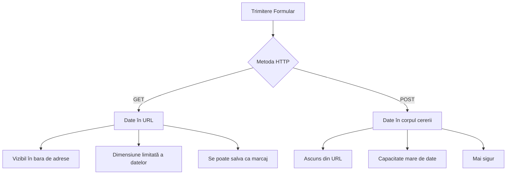
**Înțelegerea diferențelor:**

| Metodă | Caz de utilizare | Locul datelor | Nivel de securitate | Limită de mărime |
|--------|----------|---------------|----------------|-------------|
| `GET` | Căutări, filtre | Parametri în URL | Scăzut (vizibil) | ~2000 caractere |
| `POST` | Conturi utilizator, date sensibile | În corpul cererii | Mai mare (ascuns) | Fără limită practică |

**Înțelegerea diferențelor fundamentale:**
- **GET**: Atașează datele formularului la URL ca parametri de interogare (adecvat pentru operații de căutare)
- **POST**: Include datele în corpul cererii (esențial pentru informații sensibile)
- **Limitări GET**: Limită de mărime, date vizibile, istoric persistent în browser
- **Avantaje POST**: Capacitate mare de date, protecție a confidențialității, suport upload fișiere

> 💡 **Cea mai bună practică**: Folosește `GET` pentru formulare de căutare și filtre (retrageri de date), folosește `POST` pentru înregistrarea utilizatorului, autentificare și creare date.

### Configurarea trimiterii formularului

Să configurăm formularul tău de înregistrare să comunice corect cu API-ul backend folosind metoda POST:

```html
<form id="registerForm" action="//localhost:5000/api/accounts" 
      method="POST" novalidate>
```

**Ce face această configurare:**
- **Direcționează** trimiterea formularului către endpoint-ul API-ului tău
- **Folosește** metoda POST pentru transmisie securizată a datelor
- **Include** `novalidate` pentru a trata validarea cu JavaScript

### Testarea trimiterii formularului

**Urmează acești pași pentru a testa formularul:**
1. **Completează** formularul de înregistrare cu informațiile tale
2. **Apasă** butonul „Creare Cont”
3. **Observă** răspunsul serverului în browser

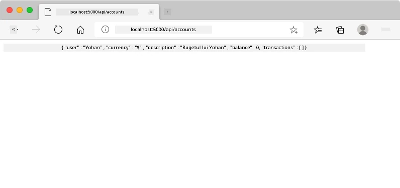

**Ce ar trebui să vezi:**
- **Browserul redirecționează** către URL-ul endpoint-ului API
- **Răspuns JSON** conținând datele contului tău nou creat
- **Confirmarea serverului** că contul a fost creat cu succes

> 🧪 **Moment de experiment**: Încearcă să te înregistrezi din nou cu același nume de utilizator. Ce răspuns primești? Aceasta te ajută să înțelegi cum serverul gestionează datele duplicate și condițiile de eroare.

### Înțelegerea răspunsurilor JSON

**Când serverul procesează cu succes formularul tău:**
```json
{
  "user": "john_doe",
  "currency": "$",
  "description": "Personal savings",
  "balance": 100,
  "id": "unique_account_id"
}
```

**Acest răspuns confirmă:**
- **Crează** un cont nou cu datele specificate
- **Atribuie** un identificator unic pentru referințe viitoare
- **Returnează** toate informațiile contului pentru verificare
- **Indică** stocarea cu succes în baza de date

## Gestionarea Modernă a Formularelor cu JavaScript

Trimiterile tradiționale de formulare determină reîncărcări complete ale paginii, asemănător modului în care misiunile spațiale timpurii necesitau resetări totale ale sistemului pentru corecții de curs. Această abordare perturbă experiența utilizatorului și pierde starea aplicației.

Gestionarea formularelor cu JavaScript funcționează ca sistemele continue de ghidare folosite de navele spațiale moderne – făcând ajustări în timp real fără a pierde contextul navigației. Putem intercepta trimiterea formularelor, oferi feedback imediat, gestiona erorile elegant și actualiza interfața pe baza răspunsurilor serverului în timp ce utilizatorul rămâne în aplicație.

### De ce să eviți reîncărcările paginii?

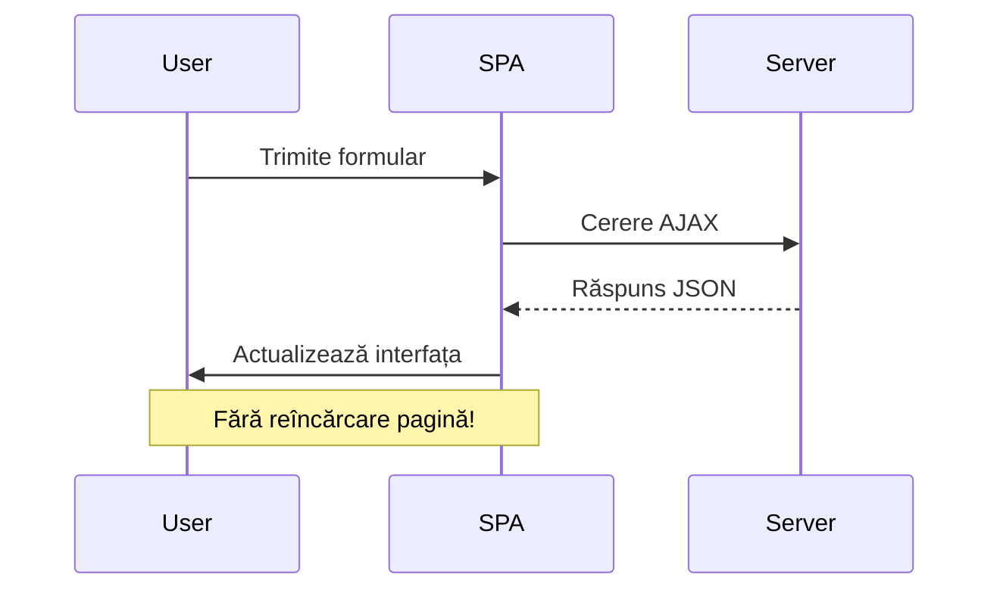
**Beneficiile gestionării formularului cu JavaScript:**
- **Menține** starea aplicației și contextul utilizatorului
- **Oferă** feedback instant și indicatori de încărcare
- **Permite** tratarea dinamică a erorilor și validarea
- **Creează** experiențe fluide, ca într-o aplicație
- **Permite** logică condiționată bazată pe răspunsuri de la server

### Tranziția de la formularele tradiționale la cele moderne

**Provocările metodei tradiționale:**
- **Redirectează** utilizatorii în afara aplicației tale
- **Pierde** starea și contextul aplicației curente
- **Necesită** reîncărcări complete pentru operații simple
- **Oferă** control limitat asupra feedback-ului utilizatorului

**Avantajele abordării moderne cu JavaScript:**
- **Păstrează** utilizatorii în cadrul aplicației
- **Menține** toată starea și datele aplicației
- **Permite** validare și feedback în timp real
- **Susține** îmbunătățirea progresivă și accesibilitatea

### Implementarea gestionării formularului cu JavaScript

Să înlocuim trimiterea tradițională a formularului cu gestionare modernă prin evenimente JavaScript:

```html
<!-- Remove the action attribute and add event handling -->
<form id="registerForm" method="POST" novalidate>
```

**Adaugă logica de înregistrare în fișierul tău `app.js`:**

```javascript
// Gestionare modernă a formularelor bazată pe evenimente
function register() {
  const registerForm = document.getElementById('registerForm');
  const formData = new FormData(registerForm);
  const data = Object.fromEntries(formData);
  const jsonData = JSON.stringify(data);
  
  console.log('Form data prepared:', data);
}

// Atașează ascultătorul de evenimente când se încarcă pagina
document.addEventListener('DOMContentLoaded', () => {
  const registerForm = document.getElementById('registerForm');
  registerForm.addEventListener('submit', (event) => {
    event.preventDefault(); // Previno trimiterea implicită a formularului
    register();
  });
});
```

**Descompunând ce se întâmplă aici:**
- **Previne** trimiterea implicită a formularului folosind `event.preventDefault()`
- **Recuperează** elementul formularului folosind selecția modernă DOM
- **Extrage** datele formularului folosind API-ul puternic `FormData`
- **Convertește** FormData într-un obiect simplu cu `Object.fromEntries()`
- **Serializează** datele în format JSON pentru comunicare cu serverul
- **Înregistrează** datele procesate pentru depanare și verificare

### Înțelegerea API-ului FormData

**API-ul FormData oferă o gestionare puternică a formularelor:**
```javascript
// Exemplu de ceea ce capturează FormData
const formData = new FormData(registerForm);

// FormData capturează automat:
// {
//   "user": "john_doe",
//   "currency": "$",
//   "description": "Cont personal",
//   "balance": "100"
// }
```

**Avantajele API-ului FormData:**
- **Colecție cuprinzătoare**: Captură toate elementele formularului, inclusiv text, fișiere și inputuri complexe
- **Conștientizare a tipului**: Gestionează diferite tipuri de input automat, fără cod personalizat
- **Eficiență**: Elimină colectarea manuală a câmpurilor printr-un singur apel API
- **Adaptabilitate**: Menține funcționalitatea pe măsură ce structura formularului evoluează

### Crearea Funcției de Comunicare cu Serverul

Acum să construim o funcție robustă pentru a comunica cu serverul API folosind modele moderne de JavaScript:

```javascript
async function createAccount(account) {
  try {
    const response = await fetch('//localhost:5000/api/accounts', {
      method: 'POST',
      headers: { 
        'Content-Type': 'application/json',
        'Accept': 'application/json'
      },
      body: account
    });
    
    // Verifică dacă răspunsul a fost de succes
    if (!response.ok) {
      throw new Error(`HTTP error! status: ${response.status}`);
    }
    
    return await response.json();
  } catch (error) {
    console.error('Account creation failed:', error);
    return { error: error.message || 'Network error occurred' };
  }
}
```

**Înțelegerea JavaScript asincron:**

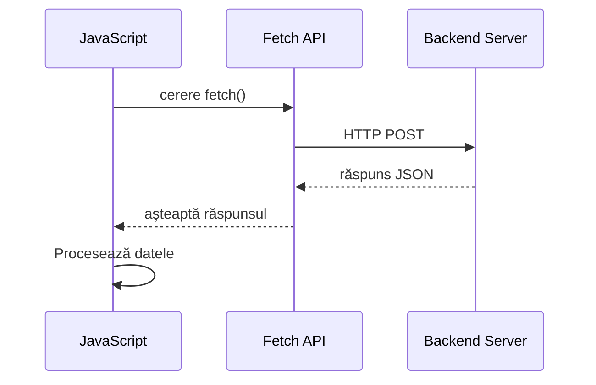
**Ce realizează această implementare modernă:**
- **Folosește** `async/await` pentru cod asincron ușor de citit
- **Include** gestionarea corectă a erorilor cu blocuri try/catch
- **Verifică** statusul răspunsului înainte de a procesa datele
- **Setează** header-ele corespunzătoare pentru comunicarea JSON
- **Oferă** mesaje detaliate de eroare pentru depanare
- **Returnează** o structură de date consecventă pentru cazurile de succes și eroare

### Puterea API-ului Modern Fetch

**Avantajele Fetch API față de metodele mai vechi:**

| Caracteristică | Beneficiu | Implementare |
|---------|---------|----------------|
| Bazat pe Promise | Cod asincron curat | `await fetch()` |
| Personalizarea cererii | Control complet HTTP | Headere, metode, corp |
| Gestionarea răspunsului | Parsare flexibilă a datelor | `.json()`, `.text()`, `.blob()` |
| Gestionarea erorilor | Captare completă a erorilor | Blocuri try/catch |

> 🎥 **Află mai mult**: [Tutorial Async/Await](https://youtube.com/watch?v=YwmlRkrxvkk) - Înțelegerea modelelor asincrone JavaScript pentru dezvoltarea web modernă.

**Concepte cheie pentru comunicarea cu serverul:**
- **Funcțiile asincrone** permit pauzarea execuției pentru a aștepta răspunsurile serverului
- **Cuvântul cheie await** face codul asincron să arate ca și cod sincron
- **Fetch API** oferă cereri HTTP moderne bazate pe promise
- **Gestionarea erorilor** asigură că aplicația răspunde elegant la problemele de rețea

### Completarea Funcției de Înregistrare

Să reunim totul cu o funcție completă și gata de producție pentru înregistrare:

```javascript
async function register() {
  const registerForm = document.getElementById('registerForm');
  const submitButton = registerForm.querySelector('button[type="submit"]');
  
  try {
    // Afișează starea de încărcare
    submitButton.disabled = true;
    submitButton.textContent = 'Creating Account...';
    
    // Procesează datele formularului
    const formData = new FormData(registerForm);
    const jsonData = JSON.stringify(Object.fromEntries(formData));
    
    // Trimite către server
    const result = await createAccount(jsonData);
    
    if (result.error) {
      console.error('Registration failed:', result.error);
      alert(`Registration failed: ${result.error}`);
      return;
    }
    
    console.log('Account created successfully!', result);
    alert(`Welcome, ${result.user}! Your account has been created.`);
    
    // Resetează formularul după înregistrarea cu succes
    registerForm.reset();
    
  } catch (error) {
    console.error('Unexpected error:', error);
    alert('An unexpected error occurred. Please try again.');
  } finally {
    // Restaurează starea butonului
    submitButton.disabled = false;
    submitButton.textContent = 'Create Account';
  }
}
```

**Această implementare îmbunătățită include:**
- **Oferă** feedback vizual în timpul trimiterii formularului
- **Dezactivează** butonul de trimitere pentru a preveni trimiterea dublă
- **Gestionează** erorile așteptate și neașteptate elegant
- **Afișează** mesaje prietenoase de succes și eroare către utilizator
- **Resetează** formularul după înregistrarea reușită
- **Restaurează** starea UI indiferent de rezultat

### Testarea Implementării

**Deschide instrumentele de dezvoltare ale browserului și testează înregistrarea:**

1. **Deschide** consola browserului (F12 → fila Console)
2. **Completează** formularul de înregistrare
3. **Apasă** pe "Creează cont"
4. **Observă** mesajele din consolă și feedback-ul utilizatorului

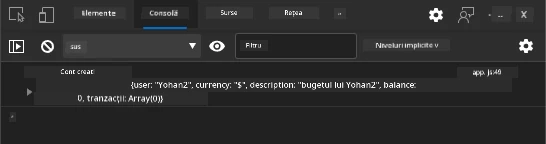

**Ce ar trebui să vezi:**
- **Stare de încărcare** apare pe butonul de trimitere
- **Log-uri în consolă** afișează informații detaliate despre proces
- **Mesaj de succes** apare când crearea contului reușește
- **Formularul se resetează** automat după trimiterea reușită

> 🔒 **Considerație de securitate**: Datele călătoresc momentan prin HTTP, care nu este sigur pentru producție. În aplicațiile reale, folosiți întotdeauna HTTPS pentru criptarea transmiterii datelor. Aflați mai multe despre [securitatea HTTPS](https://en.wikipedia.org/wiki/HTTPS) și de ce este esențială pentru protecția datelor utilizatorilor.

### 🔄 **Verificare pedagogică**
**Integrare Modernă JavaScript**: Verifică-ți înțelegerea manipulării asincrone a formularului:
- ✅ Cum schimbă `event.preventDefault()` comportamentul implicit al formularului?
- ✅ De ce API-ul FormData este mai eficient decât colectarea manuală a câmpurilor?
- ✅ Cum îmbunătățesc modelele async/await lizibilitatea codului?
- ✅ Ce rol joacă gestionarea erorilor în experiența utilizatorului?

**Arhitectura Sistemului**: Manipularea ta de formular demonstrează:
- **Programare bazată pe evenimente**: Formulare ce reacționează la acțiunile utilizatorului fără reîncărcarea paginii
- **Comunicare asincronă**: Cererile către server nu blochează interfața utilizatorului
- **Gestionarea erorilor**: Degradare elegantă când cererile de rețea eșuează
- **Managementul stării**: Actualizări UI care reflectă corect răspunsurile serverului
- **Îmbunătățire progresivă**: Funcționalitate de bază care funcționează, JavaScript o îmbunătățește

**Modele Profesionale**: Ai implementat:
- **Responsabilitate unică**: Funcții cu scopuri clare și concentrate
- **Frontiere de eroare**: Blocuri try/catch care previn prăbușirea aplicației
- **Feedback utilizator**: Stări de încărcare și mesaje de succes/eroare
- **Transformarea datelor**: FormData în JSON pentru comunicarea cu serverul

## Validarea Completă a Formularului

Validarea formularului previne experiența frustrantă de a afla erorile abia după trimitere. La fel ca sistemele multiple redundante de pe Stația Spațială Internațională, validarea eficientă utilizează mai multe niveluri de verificări de siguranță.

Abordarea optimă combină validarea la nivel de browser pentru feedback imediat, validarea JavaScript pentru experiență utilizator îmbunătățită și validarea pe server pentru securitate și integritatea datelor. Această redundanță asigură satisfacția utilizatorului și protecția sistemului.

### Înțelegerea Nivelurilor de Validare

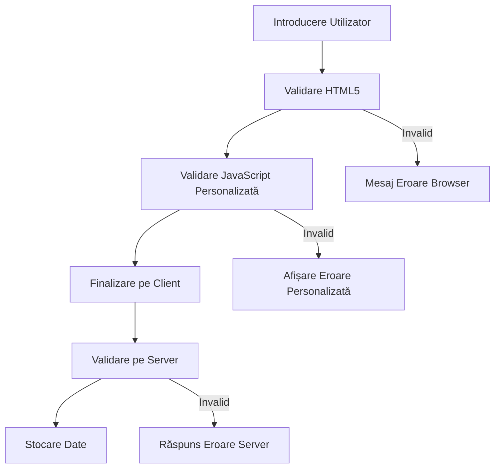
**Strategie de validare multi-strat:**
- **Validare HTML5**: Verificări imediate bazate pe browser
- **Validare JavaScript**: Logică personalizată și experiență utilizator
- **Validare pe server**: Verificări finale de securitate și integritate date
- **Îmbunătățire progresivă**: Funcționează chiar dacă JavaScript este dezactivat

### Atributele de Validare HTML5

**Instrumente moderne de validare la dispoziția ta:**

| Atribut | Scop | Exemplu de utilizare | Comportamentul browserului |
|-----------|---------|---------------|------------------|
| `required` | Câmpuri obligatorii | `<input required>` | Previnde trimiterea goală |
| `minlength`/`maxlength` | Limite pentru lungimea textului | `<input maxlength="20">` | Impune limite de caractere |
| `min`/`max` | Interval numeric | `<input min="0" max="1000">` | Validează limitele numerice |
| `pattern` | Reguli regex personalizate | `<input pattern="[A-Za-z]+">` | Potrivește formate specifice |
| `type` | Validare tip de date | `<input type="email">` | Validare specifică pentru format |

### Stilizarea Validării CSS

**Creează feedback vizual pentru stările de validare:**

```css
/* Valid input styling */
input:valid {
  border-color: #28a745;
  background-color: #f8fff9;
}

/* Invalid input styling */
input:invalid {
  border-color: #dc3545;
  background-color: #fff5f5;
}

/* Focus states for better accessibility */
input:focus:valid {
  box-shadow: 0 0 0 0.2rem rgba(40, 167, 69, 0.25);
}

input:focus:invalid {
  box-shadow: 0 0 0 0.2rem rgba(220, 53, 69, 0.25);
}
```

**Ce realizează aceste indicii vizuale:**
- **Chenar verde**: Indică validare cu succes, ca luminile verzi din controlul misiunii
- **Chenar roșu**: Semnalează erori de validare care necesită atenție
- **Evidențiere la focus**: Oferă context vizual clar pentru locația curentă a inputului
- **Stilizare consistentă**: Stabilește modele previzibile pe care utilizatorii le pot învăța

> 💡 **Sfat util**: Folosește pseudo-clasele CSS `:valid` și `:invalid` pentru a oferi feedback vizual imediat pe măsură ce utilizatorii tastează, creând o interfață receptivă și utilă.

### Implementarea Validării Cuprinzătoare

Să îmbunătățim formularul tău de înregistrare cu o validare robustă care oferă o experiență excelentă utilizatorului și calitatea datelor:

```html
<form id="registerForm" method="POST" novalidate>
  <div class="form-group">
    <label for="user">Username <span class="required">*</span></label>
    <input id="user" name="user" type="text" required 
           minlength="3" maxlength="20" 
           pattern="[a-zA-Z0-9_]+" 
           autocomplete="username"
           title="Username must be 3-20 characters, letters, numbers, and underscores only">
    <small class="form-text">Choose a unique username (3-20 characters)</small>
  </div>
  
  <div class="form-group">
    <label for="currency">Currency <span class="required">*</span></label>
    <input id="currency" name="currency" type="text" required 
           value="$" maxlength="3" 
           pattern="[A-Z$€£¥₹]+" 
           title="Enter a valid currency symbol or code">
    <small class="form-text">Currency symbol (e.g., $, €, £)</small>
  </div>
  
  <div class="form-group">
    <label for="description">Account Description</label>
    <input id="description" name="description" type="text" 
           maxlength="100" 
           placeholder="Personal savings, checking, etc.">
    <small class="form-text">Optional description (up to 100 characters)</small>
  </div>
  
  <div class="form-group">
    <label for="balance">Starting Balance</label>
    <input id="balance" name="balance" type="number" 
           value="0" min="0" step="0.01" 
           title="Enter a positive number for your starting balance">
    <small class="form-text">Initial account balance (minimum $0.00)</small>
  </div>
  
  <button type="submit">Create Account</button>
</form>
```

**Înțelegerea validării îmbunătățite:**
- **Combină** indicatori pentru câmpuri obligatorii cu descrieri utile
- **Include** atribute `pattern` pentru validarea formatului
- **Oferă** atribute `title` pentru accesibilitate și tooltip-uri
- **Adaugă** texte de ajutor pentru ghidarea inputului utilizatorului
- **Folosește** structură semantică HTML pentru o accesibilitate mai bună

### Reguli Avansate de Validare

**Ce realizează fiecare regulă de validare:**

| Câmp | Reguli de validare | Beneficiul utilizatorului |
|-------|------------------|--------------|
| Nume utilizator | `required`, `minlength="3"`, `maxlength="20"`, `pattern="[a-zA-Z0-9_]+"` | Asigură identificatori validați și unici |
| Monedă | `required`, `maxlength="3"`, `pattern="[A-Z$€£¥₹]+"` | Acceptă simboluri comune de monedă |
| Sold | `min="0"`, `step="0.01"`, `type="number"` | Previne solduri negative |
| Descriere | `maxlength="100"` | Limite rezonabile privind lungimea |

### Testarea Comportamentului Validării

**Încearcă aceste scenarii de validare:**
1. **Trimite** formularul cu câmpuri obligatorii goale
2. **Introdu** un nume de utilizator mai scurt de 3 caractere
3. **Încearcă** caractere speciale în câmpul de nume utilizator
4. **Introdu** o sumă negativă în sold

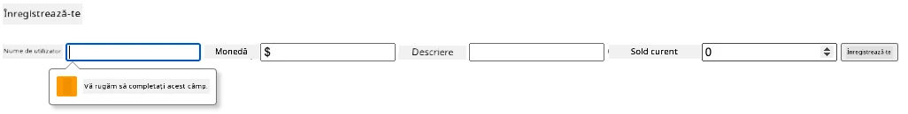

**Ce vei observa:**
- **Browserul afișează** mesaje native de validare
- **Stilizarea se modifică** în funcție de stările `:valid` și `:invalid`
- **Trimiterea formularului** este prevenită până când toate validările sunt satisfăcute
- **Focusul se mută automat** pe primul câmp invalid

### Validarea pe Client vs pe Server

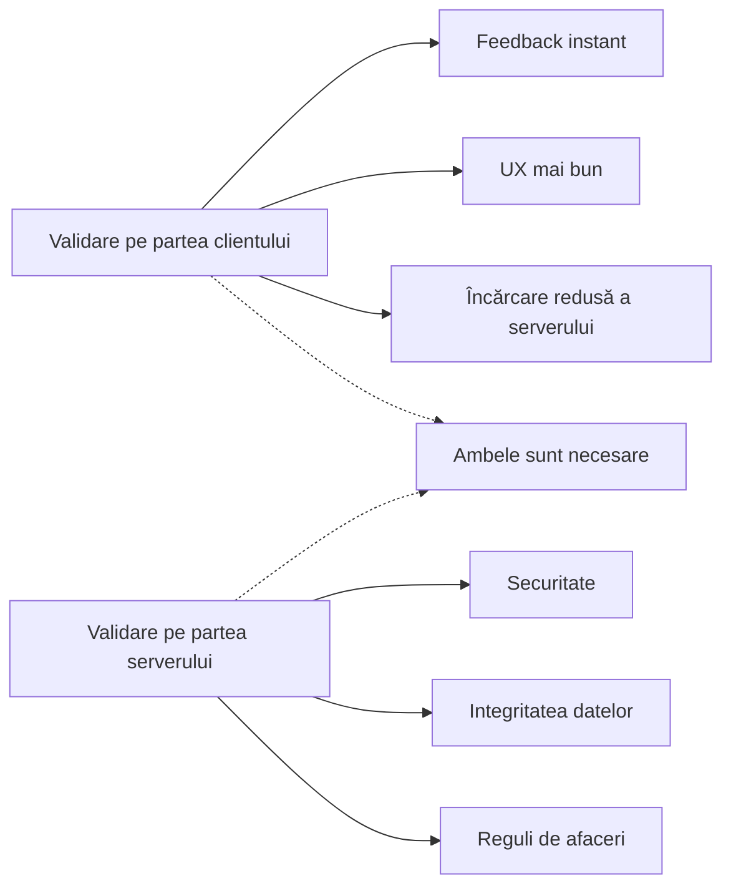
**De ce ai nevoie de ambele niveluri:**
- **Validarea pe client**: Oferă feedback imediat și îmbunătățește experiența utilizatorului
- **Validarea pe server**: Asigură securitatea și gestionează reguli de afaceri complexe
- **Abordare combinată**: Creează aplicații robuste, prietenoase și sigure
- **Îmbunătățire progresivă**: Funcționează chiar și când JavaScript este dezactivat

> 🛡️ **Reamintire de securitate**: Nu te baza niciodată doar pe validarea pe client! Utilizatorii rău intenționați pot ocoli verificările client, astfel validarea pe server este esențială pentru securitate și integritatea datelor.

### ⚡ **Ce poți face în următoarele 5 minute**
- [ ] Testează formularul cu date invalide pentru a vedea mesajele de validare
- [ ] Încearcă să trimiți formularul cu JavaScript dezactivat pentru a vedea validarea HTML5
- [ ] Deschide DevTools și inspectează datele formularului trimise către server
- [ ] Experimentează cu diferite tipuri de input pentru a vedea schimbările tastaturii pe mobil

### 🎯 **Ce poți realiza în această oră**
- [ ] Completează quiz-ul post-lectură și înțelege conceptele de manipulare a formularelor
- [ ] Implementează provocarea validării complete cu feedback în timp real
- [ ] Adaugă stiluri CSS pentru a crea formulare cu aspect profesional
- [ ] Creează gestionarea erorilor pentru nume utilizator duplicate și erori de server
- [ ] Adaugă câmpuri de confirmare parolă cu validare de potrivire

### 📅 **Drumul tău de o săptămână pentru stăpânirea formularelor**
- [ ] Completează aplicația bancară completă cu funcții avansate de formular
- [ ] Implementează încărcarea de fișiere pentru poze de profil sau documente
- [ ] Adaugă formulare în mai mulți pași cu indicatori de progres și managementul stării
- [ ] Creează formulare dinamice care se adaptează pe baza selecțiilor utilizatorului
- [ ] Implementează salvare automată și recuperare a formularului pentru experiență îmbunătățită
- [ ] Adaugă validare avansată, precum verificarea emailului și formatarea numerelor de telefon

### 🌟 **Drumul tău de o lună pentru stăpânirea dezvoltării frontend**
- [ ] Construiește aplicații complexe de formular cu logică condițională și fluxuri de lucru
- [ ] Învață biblioteci și framework-uri pentru formulare pentru dezvoltare rapidă
- [ ] Stăpânește ghidurile de accesibilitate și principiile designului incluziv
- [ ] Implementează internaționalizarea și localizarea pentru formulare globale
- [ ] Creează biblioteci de componente de formular reutilizabile și sisteme de design
- [ ] Contribuie la proiecte open source de formulare și împărtășește cele mai bune practici

## 🎯 Cronologia ta pentru Stăpânirea Dezvoltării de Formulare

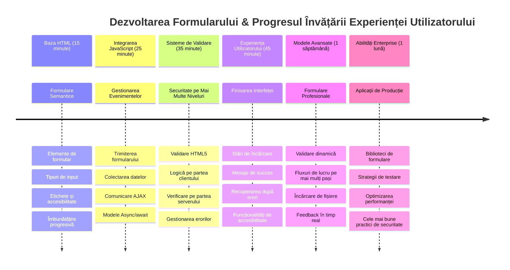
### 🛠️ Rezumatul Uneltei tale pentru Dezvoltarea Formularelor

După ce ai terminat această lecție, ai stăpânit acum:
- **Formulare HTML5**: Structură semantică, tipuri de input și caracteristici de accesibilitate
- **Manipulare JavaScript a formelor**: Gestionare de evenimente, colectare de date și comunicație AJAX
- **Arhitectura validării**: Validare multi-strat pentru securitate și experiența utilizatorului
- **Programare asincronă**: Modern fetch API și modele async/await
- **Managementul erorilor**: Gestionare cuprinzătoare a erorilor și sisteme de feedback
- **Design de experiență utilizator**: Stări de încărcare, mesaje de succes și recuperare la eroare
- **Îmbunătățire progresivă**: Formulare care funcționează în toate browserele și medii

**Aplicații din lumea reală**: Abilitățile tale de dezvoltare a formularelor se aplică direct la:
- **Aplicații e-commerce**: Procese de checkout, înregistrare cont și formulare de plată
- **Software enterprise**: Sisteme de introducere date, interfețe de raportare și aplicații de workflow
- **Management conținut**: Platforme de publicare, conținut generat de utilizatori și interfețe administrative
- **Aplicații financiare**: Interfețe bancare, platforme de investiții și sisteme de tranzacții
- **Sisteme medicale**: Portaluri pacient, programări și formulare cu istoricul medical
- **Platforme educaționale**: Înregistrare cursuri, instrumente de evaluare și management al învățării

**Competențe profesionale dobândite**: Acum poți:
- **Proiecta** formulare accesibile care funcționează pentru toți utilizatorii inclusiv cei cu dizabilități
- **Implementa** validare sigură a formularelor ce previne coruperea datelor și vulnerabilității de securitate
- **Crea** interfețe responsive care oferă feedback clar și ghidaj
- **Depana** interacțiuni complexe ale formularelor folosind DevTools și analiza rețelei browserului
- **Optimiza** performanța formularelor prin gestionarea eficientă a datelor și strategiilor de validare

**Concepte de dezvoltare frontend stăpânite**:
- **Arhitectură bazată pe evenimente**: Gestionare interacțiuni utilizator și sisteme de răspuns
- **Programare asincronă**: Comunicare server non-blocantă și gestionare erori
- **Validarea datelor**: Verificări de securitate și integritate pe client și server
- **Design experiență utilizator**: Interfețe intuitive ce ghidează utilizatorii spre succes
- **Inginerie accesibilitate**: Design incluziv care funcționează pentru diverse nevoi ale utilizatorilor

**Nivel următor**: Ești gata să explorezi biblioteci avansate de formulare, să implementezi reguli complexe de validare sau să construiești sisteme de colectare date la nivel enterprise!

🌟 **Realizare deblocheată**: Ai construit un sistem complet de gestionare a formularului cu validare profesională, gestionare erori și modele de experiență utilizator!

---


---

## Provocarea Agentului GitHub Copilot 🚀

Folosește modul Agent pentru a finaliza următoarea provocare:

**Descriere:** Îmbunătățește formularul de înregistrare cu o validare completă pe client și feedback pentru utilizator. Această provocare te va ajuta să exersezi validarea formularelor, gestionarea erorilor și îmbunătățirea experienței utilizatorilor cu feedback interactiv.
**Prompt:** Creează un sistem complet de validare a formularului pentru formularul de înregistrare care să includă: 1) Feedback de validare în timp real pentru fiecare câmp pe măsură ce utilizatorul tastează, 2) Mesaje de validare personalizate care apar sub fiecare câmp de input, 3) Un câmp de confirmare a parolei cu validare de potrivire, 4) Indicatori vizuali (cum ar fi bife verzi pentru câmpurile valide și avertismente roșii pentru cele invalide), 5) Un buton de trimitere care devine activ doar când toate validările sunt aprobate. Folosește atributele de validare HTML5, CSS pentru stilizarea stărilor de validare și JavaScript pentru comportamentul interactiv.

Află mai multe despre [agent mode](https://code.visualstudio.com/blogs/2025/02/24/introducing-copilot-agent-mode) aici.

## 🚀 Provocare

Afișează un mesaj de eroare în HTML dacă utilizatorul există deja.

Iată un exemplu de cum poate arăta pagina finală de login după un pic de stilizare:

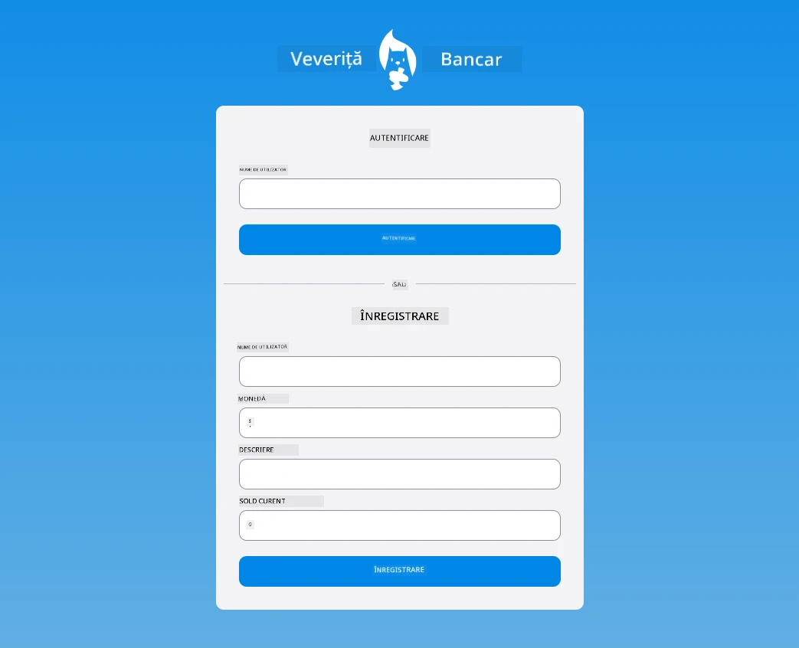

## Chestionar Post-Lecție

[Post-lecture quiz](https://ff-quizzes.netlify.app/web/quiz/44)

## Revizuire & Auto-studiu

Dezvoltatorii au devenit foarte creativi în eforturile lor de construire a formularelor, în special în ceea ce privește strategiile de validare. Explorează diferite fluxuri ale formularelor vizitând [CodePen](https://codepen.com); poți găsi formulare interesante și inspiraționale?

## Tema

[Stilizează aplicația ta bancară](assignment.md)

---

<!-- CO-OP TRANSLATOR DISCLAIMER START -->
**Declinare de responsabilitate**:  
Acest document a fost tradus folosind serviciul de traducere AI [Co-op Translator](https://github.com/Azure/co-op-translator). Deși ne străduim pentru acuratețe, vă rugăm să țineți cont că traducerile automate pot conține erori sau inexactități. Documentul original în limba sa nativă trebuie considerat sursa autorizată. Pentru informații critice, se recomandă traducerea profesionistă realizată de un traducător uman. Nu ne asumăm nicio răspundere pentru eventualele neînțelegeri sau interpretări greșite cauzate de utilizarea acestei traduceri.
<!-- CO-OP TRANSLATOR DISCLAIMER END -->