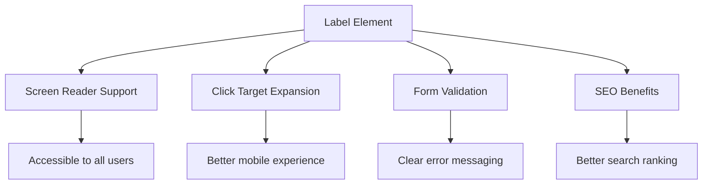
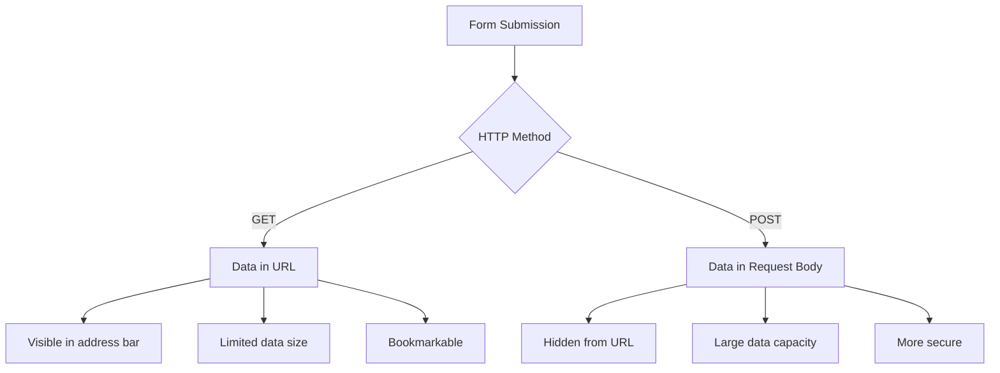
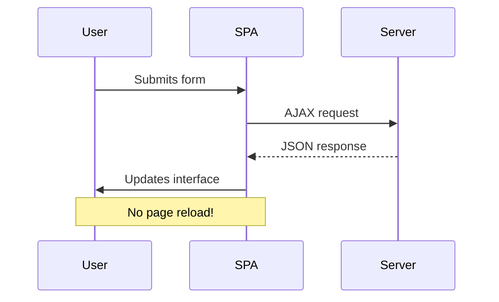
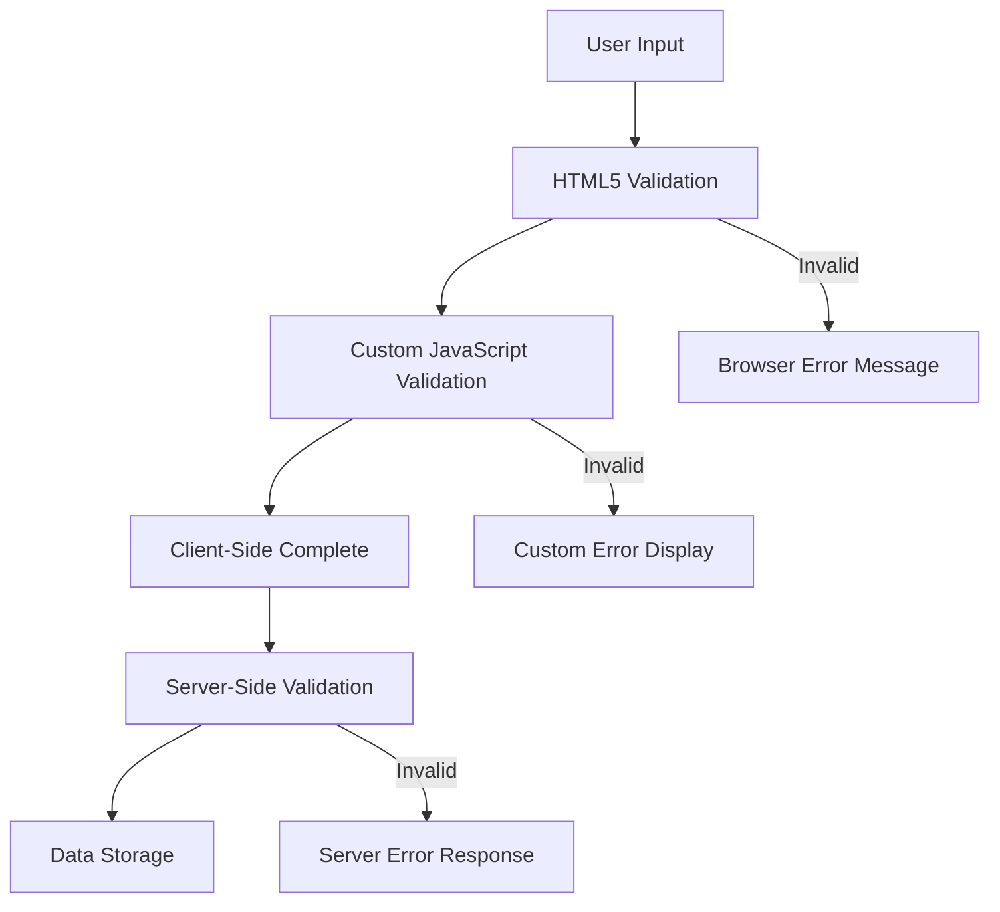
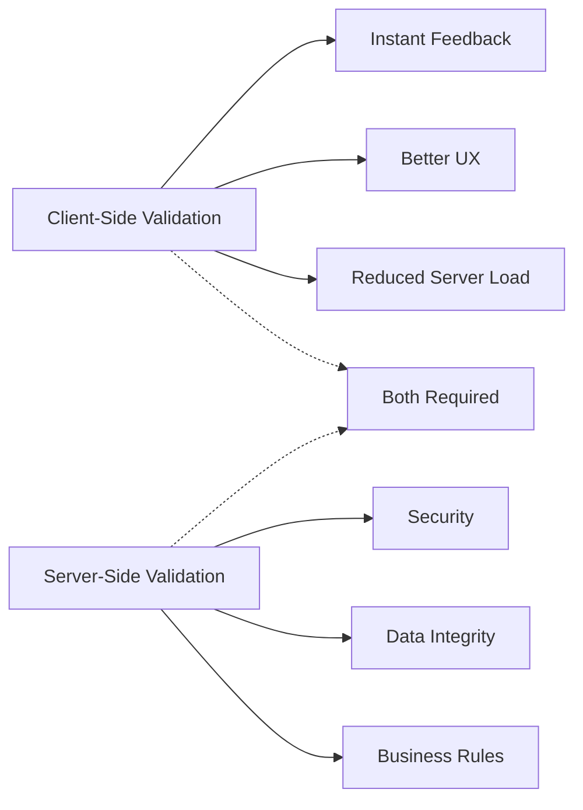

<!--
CO_OP_TRANSLATOR_METADATA:
{
  "original_hash": "b24f28fc46dd473aa9080f174182adde",
  "translation_date": "2025-10-24T22:13:36+00:00",
  "source_file": "7-bank-project/2-forms/README.md",
  "language_code": "ro"
}
-->
# Construirea unei aplicații bancare Partea 2: Crearea unui formular de autentificare și înregistrare

## Chestionar înainte de lecție

[Chestionar înainte de lecție](https://ff-quizzes.netlify.app/web/quiz/43)

Ai completat vreodată un formular online și ți-a respins formatul adresei de email? Sau ai pierdut toate informațiile când ai apăsat pe butonul de trimitere? Cu toții am întâlnit astfel de experiențe frustrante.

Formularele sunt puntea dintre utilizatori și funcționalitatea aplicației tale. Așa cum controlorii de trafic aerian folosesc protocoale precise pentru a ghida avioanele în siguranță la destinație, formularele bine concepute oferă feedback clar și previn erorile costisitoare. Formularele prost realizate, pe de altă parte, pot alunga utilizatorii mai repede decât o comunicare greșită într-un aeroport aglomerat.

În această lecție, vom transforma aplicația bancară statică într-o aplicație interactivă. Vei învăța să construiești formulare care validează datele introduse de utilizatori, comunică cu serverele și oferă feedback util. Gândește-te la asta ca la construirea unei interfețe de control care permite utilizatorilor să navigheze prin funcțiile aplicației tale.

La final, vei avea un sistem complet de autentificare și înregistrare cu validare, care ghidează utilizatorii spre succes, nu spre frustrare.

## Cerințe preliminare

Înainte de a începe să construim formulare, să ne asigurăm că ai totul configurat corect. Această lecție continuă de unde am rămas în cea anterioară, așa că, dacă ai sărit peste, poate vrei să te întorci și să pui bazele mai întâi.

### Configurare necesară

| Componentă | Status | Descriere |
|------------|--------|-----------|
| [Șabloane HTML](../1-template-route/README.md) | ✅ Necesare | Structura de bază a aplicației bancare |
| [Node.js](https://nodejs.org) | ✅ Necesare | Runtime JavaScript pentru server |
| [Server API bancar](../api/README.md) | ✅ Necesare | Serviciu backend pentru stocarea datelor |

> 💡 **Sfat pentru dezvoltare**: Vei rula simultan două servere separate – unul pentru aplicația bancară front-end și altul pentru API-ul backend. Această configurare reflectă dezvoltarea reală, unde serviciile front-end și backend funcționează independent.

### Configurarea serverului

**Mediul tău de dezvoltare va include:**
- **Serverul front-end**: Servește aplicația bancară (de obicei portul `3000`)
- **Serverul API backend**: Se ocupă de stocarea și recuperarea datelor (portul `5000`)
- **Ambele servere** pot funcționa simultan fără conflicte

**Testarea conexiunii API:**
```bash
curl http://localhost:5000/api
# Expected response: "Bank API v1.0.0"
```

**Dacă vezi răspunsul cu versiunea API, ești gata să continui!**

---

## Înțelegerea formularelor și controalelor HTML

Formularele HTML sunt modul prin care utilizatorii comunică cu aplicația ta web. Gândește-te la ele ca la sistemul de telegraf care conecta locuri îndepărtate în secolul al XIX-lea – ele sunt protocolul de comunicare între intenția utilizatorului și răspunsul aplicației. Când sunt concepute cu grijă, ele detectează erorile, ghidează formatul de introducere și oferă sugestii utile.

Formularele moderne sunt mult mai sofisticate decât simplele câmpuri de text. HTML5 a introdus tipuri de input specializate care gestionează validarea email-urilor, formatarea numerelor și selecția datelor în mod automat. Aceste îmbunătățiri sunt benefice atât pentru accesibilitate, cât și pentru experiențele utilizatorilor de pe dispozitivele mobile.

### Elemente esențiale ale formularelor

**Elemente de bază necesare fiecărui formular:**

```html
<!-- Basic form structure -->
<form id="userForm" method="POST">
  <label for="username">Username</label>
  <input id="username" name="username" type="text" required>
  
  <button type="submit">Submit</button>
</form>
```

**Ce face acest cod:**
- **Creează** un container de formular cu un identificator unic
- **Specifică** metoda HTTP pentru trimiterea datelor
- **Asociază** etichetele cu câmpurile de input pentru accesibilitate
- **Definește** un buton de trimitere pentru procesarea formularului

### Tipuri moderne de input și atribute

| Tip de input | Scop | Exemplu de utilizare |
|--------------|------|----------------------|
| `text` | Introducere text generală | `<input type="text" name="username">` |
| `email` | Validare email | `<input type="email" name="email">` |
| `password` | Introducere text ascuns | `<input type="password" name="password">` |
| `number` | Introducere numerică | `<input type="number" name="balance" min="0">` |
| `tel` | Numere de telefon | `<input type="tel" name="phone">` |

> 💡 **Avantajul HTML5 modern**: Utilizarea tipurilor specifice de input oferă validare automată, tastaturi mobile adecvate și suport mai bun pentru accesibilitate fără a fi nevoie de JavaScript suplimentar!

### Tipuri de butoane și comportament

```html
<!-- Different button behaviors -->
<button type="submit">Save Data</button>     <!-- Submits the form -->
<button type="reset">Clear Form</button>    <!-- Resets all fields -->
<button type="button">Custom Action</button> <!-- No default behavior -->
```

**Ce face fiecare tip de buton:**
- **Butoane de trimitere**: Declanșează trimiterea formularului și trimit datele către endpoint-ul specificat
- **Butoane de resetare**: Resetează toate câmpurile formularului la starea inițială
- **Butoane obișnuite**: Nu au un comportament implicit, necesitând JavaScript personalizat pentru funcționalitate

> ⚠️ **Notă importantă**: Elementul `<input>` este auto-închis și nu necesită un tag de închidere. Practica modernă recomandă scrierea `<input>` fără slash.

### Construirea formularului de autentificare

Acum să creăm un formular practic de autentificare care demonstrează practicile moderne ale formularelor HTML. Vom începe cu o structură de bază și o vom îmbunătăți treptat cu funcții de accesibilitate și validare.

```html
<template id="login">
  <h1>Bank App</h1>
  <section>
    <h2>Login</h2>
    <form id="loginForm" novalidate>
      <div class="form-group">
        <label for="username">Username</label>
        <input id="username" name="user" type="text" required 
               autocomplete="username" placeholder="Enter your username">
      </div>
      <button type="submit">Login</button>
    </form>
  </section>
</template>
```

**Analiză a ceea ce se întâmplă aici:**
- **Structurarea** formularului cu elemente semantice HTML5
- **Gruparea** elementelor conexe folosind containere `div` cu clase semnificative
- **Asocierea** etichetelor cu câmpurile de input folosind atributele `for` și `id`
- **Includerea** atributelor moderne precum `autocomplete` și `placeholder` pentru o experiență mai bună a utilizatorului
- **Adăugarea** atributului `novalidate` pentru a gestiona validarea cu JavaScript în loc de setările implicite ale browserului

### Importanța etichetelor corecte

**De ce contează etichetele pentru dezvoltarea web modernă:**



**Ce realizează etichetele corecte:**
- **Permite** cititoarelor de ecran să anunțe clar câmpurile formularului
- **Extinde** zona clicabilă (clicul pe etichetă focalizează input-ul)
- **Îmbunătățește** utilizarea pe mobil cu ținte tactile mai mari
- **Sprijină** validarea formularului cu mesaje de eroare semnificative
- **Îmbunătățește** SEO prin oferirea de semnificație semantică elementelor formularului

> 🎯 **Obiectiv de accesibilitate**: Fiecare câmp de input al formularului ar trebui să aibă o etichetă asociată. Această practică simplă face ca formularele tale să fie utilizabile de toată lumea, inclusiv de utilizatorii cu dizabilități, și îmbunătățește experiența pentru toți utilizatorii.

### Crearea formularului de înregistrare

Formularul de înregistrare necesită informații mai detaliate pentru a crea un cont complet de utilizator. Să-l construim folosind funcții moderne HTML5 și accesibilitate îmbunătățită.

```html
<hr/>
<h2>Register</h2>
<form id="registerForm" novalidate>
  <div class="form-group">
    <label for="user">Username</label>
    <input id="user" name="user" type="text" required 
           autocomplete="username" placeholder="Choose a username">
  </div>
  
  <div class="form-group">
    <label for="currency">Currency</label>
    <input id="currency" name="currency" type="text" value="$" 
           required maxlength="3" placeholder="USD, EUR, etc.">
  </div>
  
  <div class="form-group">
    <label for="description">Account Description</label>
    <input id="description" name="description" type="text" 
           maxlength="100" placeholder="Personal savings, checking, etc.">
  </div>
  
  <div class="form-group">
    <label for="balance">Starting Balance</label>
    <input id="balance" name="balance" type="number" value="0" 
           min="0" step="0.01" placeholder="0.00">
  </div>
  
  <button type="submit">Create Account</button>
</form>
```

**În codul de mai sus, am:**
- **Organizat** fiecare câmp în div-uri de container pentru o mai bună stilizare și aranjare
- **Adăugat** atribute `autocomplete` adecvate pentru suportul de completare automată al browserului
- **Inclus** text de ajutor în placeholder pentru a ghida introducerea utilizatorului
- **Setat** valori implicite sensibile folosind atributul `value`
- **Aplicat** atribute de validare precum `required`, `maxlength` și `min`
- **Utilizat** `type="number"` pentru câmpul de sold cu suport pentru zecimale

### Explorarea tipurilor de input și comportamentului

**Tipurile moderne de input oferă funcționalități îmbunătățite:**

| Funcție | Beneficiu | Exemplu |
|---------|-----------|---------|
| `type="number"` | Tastatură numerică pe mobil | Introducere mai ușoară a soldului |
| `step="0.01"` | Controlul preciziei zecimale | Permite introducerea centimilor în monedă |
| `autocomplete` | Completare automată în browser | Completare mai rapidă a formularului |
| `placeholder` | Indicii contextuale | Ghidează așteptările utilizatorului |

> 🎯 **Provocare de accesibilitate**: Încearcă să navighezi prin formulare folosind doar tastatura! Folosește `Tab` pentru a te deplasa între câmpuri, `Space` pentru a bifa casetele și `Enter` pentru a trimite. Această experiență te ajută să înțelegi cum utilizatorii de cititoare de ecran interacționează cu formularele tale.

## Înțelegerea metodelor de trimitere a formularelor

Când cineva completează formularul și apasă pe butonul de trimitere, datele trebuie să ajungă undeva – de obicei la un server care le poate salva. Există câteva moduri diferite în care acest lucru se poate întâmpla, iar cunoașterea celui potrivit te poate scuti de unele bătăi de cap mai târziu.

Să vedem ce se întâmplă de fapt când cineva apasă pe butonul de trimitere.

### Comportamentul implicit al formularului

Mai întâi, să observăm ce se întâmplă cu trimiterea de bază a unui formular:

**Testează formularele actuale:**
1. Apasă pe butonul *Înregistrează-te* din formularul tău
2. Observă schimbările din bara de adrese a browserului
3. Observă cum pagina se reîncarcă și datele apar în URL


### Compararea metodelor HTTP



**Înțelegerea diferențelor:**

| Metodă | Caz de utilizare | Locația datelor | Nivel de securitate | Limită de dimensiune |
|--------|------------------|-----------------|---------------------|----------------------|
| `GET` | Interogări de căutare, filtre | Parametri URL | Scăzut (vizibil) | ~2000 caractere |
| `POST` | Conturi de utilizator, date sensibile | Corpul cererii | Mai ridicat (ascuns) | Fără limită practică |

**Înțelegerea diferențelor fundamentale:**
- **GET**: Adaugă datele formularului la URL ca parametri de interogare (potrivit pentru operațiuni de căutare)
- **POST**: Include datele în corpul cererii (esențial pentru informații sensibile)
- **Limitări GET**: Constrângeri de dimensiune, date vizibile, istoric persistent al browserului
- **Avantaje POST**: Capacitate mare de date, protecția confidențialității, suport pentru încărcarea fișierelor

> 💡 **Practica optimă**: Folosește `GET` pentru formularele de căutare și filtre (recuperarea datelor), folosește `POST` pentru înregistrarea utilizatorilor, autentificare și crearea datelor.

### Configurarea trimiterii formularului

Să configurăm formularul de înregistrare pentru a comunica corect cu API-ul backend folosind metoda POST:

```html
<form id="registerForm" action="//localhost:5000/api/accounts" 
      method="POST" novalidate>
```

**Ce face această configurare:**
- **Direcționează** trimiterea formularului către endpoint-ul API
- **Folosește** metoda POST pentru transmiterea sigură a datelor
- **Include** `novalidate` pentru a gestiona validarea cu JavaScript

### Testarea trimiterii formularului

**Urmează acești pași pentru a testa formularul:**
1. **Completează** formularul de înregistrare cu informațiile tale
2. **Apasă** butonul "Creează cont"
3. **Observă** răspunsul serverului în browserul tău


**Ce ar trebui să vezi:**
- **Redirecționarea browserului** către URL-ul endpoint-ului API
- **Răspuns JSON** care conține datele noului cont creat
- **Confirmarea serverului** că contul a fost creat cu succes

> 🧪 **Timp de experimentare**: Încearcă să te înregistrezi din nou cu același nume de utilizator. Ce răspuns primești? Acest lucru te ajută să înțelegi cum serverul gestionează datele duplicate și condițiile de eroare.

### Înțelegerea răspunsurilor JSON

**Când serverul procesează formularul tău cu succes:**
```json
{
  "user": "john_doe",
  "currency": "$",
  "description": "Personal savings",
  "balance": 100,
  "id": "unique_account_id"
}
```

**Acest răspuns confirmă:**
- **Crearea** unui cont nou cu datele specificate
- **Atribuirea** unui identificator unic pentru referințe viitoare
- **Returnarea** tuturor informațiilor contului pentru verificare
- **Indică** stocarea cu succes în baza de date

## Gestionarea modernă a formularelor cu JavaScript

Trimiterea tradițională a formularelor cauzează reîncărcarea completă a paginii, similar cu modul în care misiunile spațiale timpurii necesitau resetări complete ale sistemului pentru corectarea traiectoriei. Această abordare perturbă experiența utilizatorului și pierde starea aplicației.

Gestionarea formularelor cu JavaScript funcționează ca sistemele moderne de ghidare continuă utilizate de navele spațiale – făcând ajustări în timp real fără a pierde contextul navigației. Putem intercepta trimiterea formularelor, oferi feedback imediat, gestiona erorile cu grație și actualiza interfața pe baza răspunsurilor serverului, menținând în același timp poziția utilizatorului în aplicație.

### De ce să evităm reîncărcările paginii?



**Beneficiile gestionării formularelor cu JavaScript:**
- **Menține** starea aplicației și contextul utilizatorului
- **Oferă** feedback instantaneu și indicatoare de încărcare
- **Permite** gestionarea dinamică a erorilor și validarea
- **Creează** experiențe fluide, asemănătoare aplicațiilor
- **Permite** logica condițională bazată pe răspunsurile serverului

### Tranziția de la formulare tradiționale la cele moderne

**Provocările abordării tradiționale:**
- **Redirecționează** utilizatorii în afara aplicației tale
- **Pierderea** stării și contextului aplicației curente
- **Necesită** reîncărcări complete ale paginii pentru operațiuni simple
- **Oferă** control limitat asupra feedback-ului utilizatorului

**Avantajele abordării moderne cu JavaScript:**
- **Menține** utilizatorii în cadrul aplicației tale
- **Păstrează** toate stările și datele aplicației
- **Permite** validarea și feedback-ul în timp real
- **Sprijină** îmbunătățirea progresivă și accesibilitatea

### Implementarea gestionării formularelor cu JavaScript

Să înlocuim trimiterea tradițională a formularelor cu gestionarea modernă a evenimentelor în JavaScript:

```html
<!-- Remove the action attribute and add event handling -->
<form id="registerForm" method="POST" novalidate>
```

**Adaugă logica de înregistrare în fișierul tău `app.js`:**

```javascript
// Modern event-driven form handling
function register() {
  const registerForm = document.getElementById('registerForm');
  const formData = new FormData(registerForm);
  const data = Object.fromEntries(formData);
  const jsonData = JSON.stringify(data);
  
  console.log('Form data prepared:', data);
}

// Attach event listener when the page loads
document.addEventListener('DOMContentLoaded', () => {
  const registerForm = document.getElementById('registerForm');
  registerForm.addEventListener('submit', (event) => {
    event.preventDefault(); // Prevent default form submission
    register();
  });
});
```

**Analiză a ceea ce se întâmplă aici:**
- **Previne** trimiterea implicită a formularului folosind `event.preventDefault()`
- **Recuperează** elementul formularului folosind selecția modernă DOM
- **Extrage** datele formularului folosind API-ul puternic `FormData`
- **Transformă** FormData într-un obiect simplu cu `Object.fromEntries()`
- **Serializă** datele în format JSON pentru comunicarea cu serverul
- **Înregistrează** datele procesate pentru depanare și verificare

### Înțelegerea API-ului FormData

**API-ul FormData oferă o gestionare puternică a formularelor:**

```javascript
// Example of what FormData captures
const formData = new FormData(registerForm);

// FormData automatically captures:
// {
//   "user": "john_doe",
//   "currency": "$", 
//   "description": "Personal account",
//   "balance": "100"
// }
```

**Avantajele API-
- **Oferă** mesaje detaliate de eroare pentru depanare  
- **Returnează** o structură de date consistentă pentru cazurile de succes și eroare  

### Puterea API-ului Modern Fetch  

**Avantajele API-ului Fetch față de metodele mai vechi:**  

| Caracteristică | Beneficiu | Implementare |  
|----------------|-----------|--------------|  
| Bazat pe Promisiuni | Cod asincron curat | `await fetch()` |  
| Personalizare cerere | Control complet HTTP | Headere, metode, corp |  
| Gestionarea răspunsului | Parsare flexibilă a datelor | `.json()`, `.text()`, `.blob()` |  
| Gestionarea erorilor | Capturare cuprinzătoare a erorilor | Blocuri Try/catch |  

> 🎥 **Află mai multe**: [Tutorial Async/Await](https://youtube.com/watch?v=YwmlRkrxvkk) - Înțelegerea modelelor asincrone din JavaScript pentru dezvoltarea web modernă.  

**Concepte cheie pentru comunicarea cu serverul:**  
- **Funcțiile asincrone** permit întreruperea execuției pentru a aștepta răspunsurile serverului  
- **Cuvântul cheie await** face ca codul asincron să fie citit ca și cum ar fi sincron  
- **API-ul Fetch** oferă cereri HTTP moderne, bazate pe promisiuni  
- **Gestionarea erorilor** asigură că aplicația ta răspunde elegant la problemele de rețea  

### Finalizarea Funcției de Înregistrare  

Să aducem totul împreună cu o funcție completă, pregătită pentru producție, de înregistrare:  

```javascript
async function register() {
  const registerForm = document.getElementById('registerForm');
  const submitButton = registerForm.querySelector('button[type="submit"]');
  
  try {
    // Show loading state
    submitButton.disabled = true;
    submitButton.textContent = 'Creating Account...';
    
    // Process form data
    const formData = new FormData(registerForm);
    const jsonData = JSON.stringify(Object.fromEntries(formData));
    
    // Send to server
    const result = await createAccount(jsonData);
    
    if (result.error) {
      console.error('Registration failed:', result.error);
      alert(`Registration failed: ${result.error}`);
      return;
    }
    
    console.log('Account created successfully!', result);
    alert(`Welcome, ${result.user}! Your account has been created.`);
    
    // Reset form after successful registration
    registerForm.reset();
    
  } catch (error) {
    console.error('Unexpected error:', error);
    alert('An unexpected error occurred. Please try again.');
  } finally {
    // Restore button state
    submitButton.disabled = false;
    submitButton.textContent = 'Create Account';
  }
}
```
  
**Această implementare îmbunătățită include:**  
- **Oferă** feedback vizual în timpul trimiterii formularului  
- **Dezactivează** butonul de trimitere pentru a preveni trimiterea duplicată  
- **Gestionează** atât erorile așteptate, cât și cele neașteptate, cu grație  
- **Afișează** mesaje prietenoase de succes și eroare  
- **Resetează** formularul după o înregistrare reușită  
- **Restabilește** starea interfeței indiferent de rezultat  

### Testarea Implementării  

**Deschide instrumentele de dezvoltare ale browserului și testează înregistrarea:**  

1. **Deschide** consola browserului (F12 → fila Console)  
2. **Completează** formularul de înregistrare  
3. **Apasă** "Creează cont"  
4. **Observă** mesajele din consolă și feedback-ul utilizatorului  

  

**Ce ar trebui să vezi:**  
- **Starea de încărcare** apare pe butonul de trimitere  
- **Logurile din consolă** arată informații detaliate despre proces  
- **Mesajul de succes** apare când crearea contului reușește  
- **Formularul se resetează** automat după trimiterea reușită  

> 🔒 **Considerație de securitate**: În prezent, datele sunt transmise prin HTTP, ceea ce nu este sigur pentru producție. În aplicațiile reale, folosește întotdeauna HTTPS pentru a cripta transmiterea datelor. Află mai multe despre [securitatea HTTPS](https://en.wikipedia.org/wiki/HTTPS) și de ce este esențială pentru protejarea datelor utilizatorilor.  

## Validare Completă a Formularului  

Validarea formularului previne experiența frustrantă de a descoperi erori doar după trimitere. La fel ca sistemele redundante multiple de pe Stația Spațială Internațională, validarea eficientă folosește mai multe straturi de verificare.  

Abordarea optimă combină validarea la nivel de browser pentru feedback imediat, validarea JavaScript pentru o experiență îmbunătățită a utilizatorului și validarea pe server pentru securitate și integritatea datelor. Această redundanță asigură atât satisfacția utilizatorului, cât și protecția sistemului.  

### Înțelegerea Straturilor de Validare  


  
**Strategia de validare pe mai multe straturi:**  
- **Validare HTML5**: Verificări imediate bazate pe browser  
- **Validare JavaScript**: Logică personalizată și experiență pentru utilizator  
- **Validare pe server**: Verificări finale de securitate și integritate a datelor  
- **Îmbunătățire progresivă**: Funcționează chiar dacă JavaScript este dezactivat  

### Atribute de Validare HTML5  

**Instrumente moderne de validare la dispoziția ta:**  

| Atribut | Scop | Exemplu de utilizare | Comportament browser |  
|---------|------|-----------------------|-----------------------|  
| `required` | Câmpuri obligatorii | `<input required>` | Previne trimiterea goală |  
| `minlength`/`maxlength` | Limite de lungime text | `<input maxlength="20">` | Impune limite de caractere |  
| `min`/`max` | Interval numeric | `<input min="0" max="1000">` | Validează limitele numerice |  
| `pattern` | Reguli regex personalizate | `<input pattern="[A-Za-z]+">` | Potrivește formate specifice |  
| `type` | Validare tip de date | `<input type="email">` | Validare specifică formatului |  

### Stilizare CSS pentru Validare  

**Creează feedback vizual pentru stările de validare:**  

```css
/* Valid input styling */
input:valid {
  border-color: #28a745;
  background-color: #f8fff9;
}

/* Invalid input styling */
input:invalid {
  border-color: #dc3545;
  background-color: #fff5f5;
}

/* Focus states for better accessibility */
input:focus:valid {
  box-shadow: 0 0 0 0.2rem rgba(40, 167, 69, 0.25);
}

input:focus:invalid {
  box-shadow: 0 0 0 0.2rem rgba(220, 53, 69, 0.25);
}
```
  
**Ce realizează aceste indicii vizuale:**  
- **Borduri verzi**: Indică validarea reușită, ca semafoarele verzi din centrul de control  
- **Borduri roșii**: Semnalează erori de validare care necesită atenție  
- **Evidențierea focusului**: Oferă context vizual clar pentru locația curentă a inputului  
- **Stilizare consistentă**: Stabilește modele de interfață previzibile pe care utilizatorii le pot învăța  

> 💡 **Sfat util**: Folosește pseudo-clasele CSS `:valid` și `:invalid` pentru a oferi feedback vizual imediat pe măsură ce utilizatorii tastează, creând o interfață receptivă și utilă.  

### Implementarea Validării Complete  

Să îmbunătățim formularul de înregistrare cu o validare robustă care oferă o experiență excelentă utilizatorului și calitate datelor:  

```html
<form id="registerForm" method="POST" novalidate>
  <div class="form-group">
    <label for="user">Username <span class="required">*</span></label>
    <input id="user" name="user" type="text" required 
           minlength="3" maxlength="20" 
           pattern="[a-zA-Z0-9_]+" 
           autocomplete="username"
           title="Username must be 3-20 characters, letters, numbers, and underscores only">
    <small class="form-text">Choose a unique username (3-20 characters)</small>
  </div>
  
  <div class="form-group">
    <label for="currency">Currency <span class="required">*</span></label>
    <input id="currency" name="currency" type="text" required 
           value="$" maxlength="3" 
           pattern="[A-Z$€£¥₹]+" 
           title="Enter a valid currency symbol or code">
    <small class="form-text">Currency symbol (e.g., $, €, £)</small>
  </div>
  
  <div class="form-group">
    <label for="description">Account Description</label>
    <input id="description" name="description" type="text" 
           maxlength="100" 
           placeholder="Personal savings, checking, etc.">
    <small class="form-text">Optional description (up to 100 characters)</small>
  </div>
  
  <div class="form-group">
    <label for="balance">Starting Balance</label>
    <input id="balance" name="balance" type="number" 
           value="0" min="0" step="0.01" 
           title="Enter a positive number for your starting balance">
    <small class="form-text">Initial account balance (minimum $0.00)</small>
  </div>
  
  <button type="submit">Create Account</button>
</form>
```
  
**Înțelegerea validării îmbunătățite:**  
- **Combină** indicatorii de câmpuri obligatorii cu descrieri utile  
- **Include** atribute `pattern` pentru validarea formatului  
- **Oferă** atribute `title` pentru accesibilitate și tooltip-uri  
- **Adaugă** text de ajutor pentru a ghida introducerea datelor de către utilizator  
- **Folosește** structura HTML semantică pentru o mai bună accesibilitate  

### Reguli Avansate de Validare  

**Ce realizează fiecare regulă de validare:**  

| Câmp | Reguli de validare | Beneficiul utilizatorului |  
|------|--------------------|---------------------------|  
| Nume utilizator | `required`, `minlength="3"`, `maxlength="20"`, `pattern="[a-zA-Z0-9_]+"` | Asigură identificatori valizi și unici |  
| Monedă | `required`, `maxlength="3"`, `pattern="[A-Z$€£¥₹]+"` | Acceptă simboluri comune ale monedelor |  
| Sold | `min="0"`, `step="0.01"`, `type="number"` | Previne soldurile negative |  
| Descriere | `maxlength="100"` | Limite rezonabile de lungime |  

### Testarea Comportamentului Validării  

**Încearcă aceste scenarii de validare:**  
1. **Trimite** formularul cu câmpuri obligatorii goale  
2. **Introdu** un nume de utilizator mai scurt de 3 caractere  
3. **Încearcă** caractere speciale în câmpul de nume utilizator  
4. **Introdu** o sumă negativă pentru sold  

  

**Ce vei observa:**  
- **Browserul afișează** mesaje native de validare  
- **Schimbări de stilizare** bazate pe stările `:valid` și `:invalid`  
- **Trimiterea formularului** este împiedicată până când toate validările sunt trecute  
- **Focusul se mută automat** pe primul câmp invalid  

### Validare pe Client vs Validare pe Server  


  
**De ce ai nevoie de ambele straturi:**  
- **Validarea pe client**: Oferă feedback imediat și îmbunătățește experiența utilizatorului  
- **Validarea pe server**: Asigură securitatea și gestionează regulile complexe de afaceri  
- **Abordare combinată**: Creează aplicații robuste, prietenoase și sigure  
- **Îmbunătățire progresivă**: Funcționează chiar și când JavaScript este dezactivat  

> 🛡️ **Reamintire de securitate**: Nu te baza doar pe validarea pe client! Utilizatorii rău intenționați pot ocoli verificările pe client, așa că validarea pe server este esențială pentru securitate și integritatea datelor.  

---

---

## Provocarea Agentului GitHub Copilot 🚀  

Folosește modul Agent pentru a finaliza următoarea provocare:  

**Descriere:** Îmbunătățește formularul de înregistrare cu validare completă pe client și feedback pentru utilizator. Această provocare te va ajuta să exersezi validarea formularelor, gestionarea erorilor și îmbunătățirea experienței utilizatorului cu feedback interactiv.  

**Instrucțiuni:** Creează un sistem complet de validare a formularului pentru înregistrare care să includă: 1) Feedback de validare în timp real pentru fiecare câmp pe măsură ce utilizatorul tastează, 2) Mesaje personalizate de validare care apar sub fiecare câmp de input, 3) Un câmp de confirmare a parolei cu validare de potrivire, 4) Indicatori vizuali (cum ar fi bife verzi pentru câmpuri valide și avertismente roșii pentru cele invalide), 5) Un buton de trimitere care devine activ doar când toate validările sunt trecute. Folosește atributele de validare HTML5, CSS pentru stilizarea stărilor de validare și JavaScript pentru comportamentul interactiv.  

Află mai multe despre [modul agent](https://code.visualstudio.com/blogs/2025/02/24/introducing-copilot-agent-mode) aici.  

## 🚀 Provocare  

Afișează un mesaj de eroare în HTML dacă utilizatorul există deja.  

Iată un exemplu de cum poate arăta pagina finală de autentificare după un pic de stilizare:  

  

## Test de evaluare post-lectură  

[Test de evaluare post-lectură](https://ff-quizzes.netlify.app/web/quiz/44)  

## Recapitulare & Studiu Individual  

Dezvoltatorii au devenit foarte creativi în eforturile lor de a construi formulare, mai ales în ceea ce privește strategiile de validare. Află despre diferite fluxuri de formulare explorând [CodePen](https://codepen.com); poți găsi formulare interesante și inspiratoare?  

## Temă  

[Stilizează aplicația ta bancară](assignment.md)  

---

**Declinare de responsabilitate**:  
Acest document a fost tradus folosind serviciul de traducere AI [Co-op Translator](https://github.com/Azure/co-op-translator). Deși ne străduim să asigurăm acuratețea, vă rugăm să fiți conștienți că traducerile automate pot conține erori sau inexactități. Documentul original în limba sa maternă ar trebui considerat sursa autoritară. Pentru informații critice, se recomandă traducerea profesională realizată de oameni. Nu ne asumăm responsabilitatea pentru neînțelegeri sau interpretări greșite care pot apărea din utilizarea acestei traduceri.