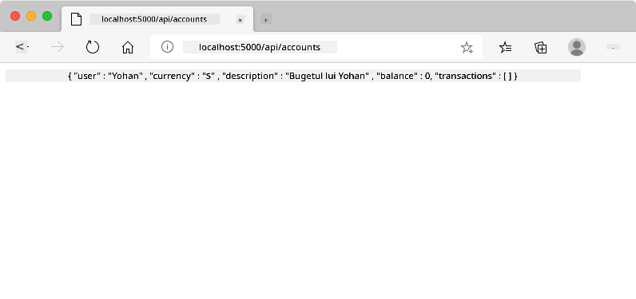
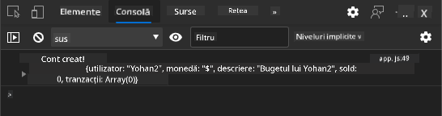
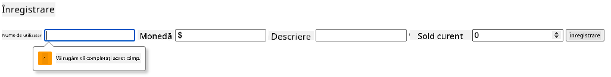
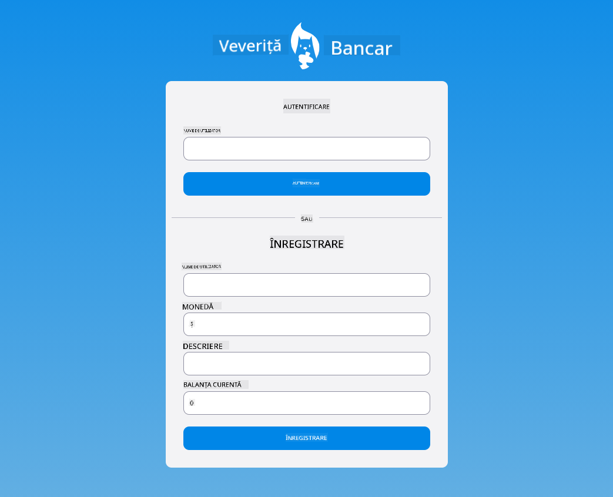

<!--
CO_OP_TRANSLATOR_METADATA:
{
  "original_hash": "b667b7d601e2ee19acb5aa9d102dc9f3",
  "translation_date": "2025-08-27T22:55:32+00:00",
  "source_file": "7-bank-project/2-forms/README.md",
  "language_code": "ro"
}
-->
# Construirea unei aplicații bancare Partea 2: Crearea unui formular de autentificare și înregistrare

## Chestionar înainte de lecție

[Chestionar înainte de lecție](https://ashy-river-0debb7803.1.azurestaticapps.net/quiz/43)

### Introducere

În aproape toate aplicațiile web moderne, poți crea un cont pentru a avea propriul spațiu privat. Deoarece mai mulți utilizatori pot accesa o aplicație web simultan, este nevoie de un mecanism pentru a stoca separat datele personale ale fiecărui utilizator și pentru a selecta ce informații să fie afișate. Nu vom acoperi modul de gestionare [securizată a identității utilizatorului](https://en.wikipedia.org/wiki/Authentication), deoarece este un subiect amplu în sine, dar vom asigura că fiecare utilizator poate crea unul (sau mai multe) conturi bancare în aplicația noastră.

În această parte vom folosi formulare HTML pentru a adăuga autentificare și înregistrare în aplicația noastră web. Vom vedea cum să trimitem datele către un API de server programatic și, în cele din urmă, cum să definim reguli de validare de bază pentru datele introduse de utilizator.

### Prerechizite

Trebuie să fi finalizat [șabloanele HTML și rutarea](../1-template-route/README.md) aplicației web pentru această lecție. De asemenea, trebuie să instalezi [Node.js](https://nodejs.org) și să [rulezi API-ul serverului](../api/README.md) local, astfel încât să poți trimite date pentru a crea conturi.

**Notă importantă**  
Vei avea două terminale deschise simultan, așa cum este indicat mai jos:  
1. Pentru aplicația bancară principală pe care am construit-o în lecția [șabloane HTML și rutare](../1-template-route/README.md)  
2. Pentru [API-ul serverului aplicației bancare](../api/README.md) pe care tocmai l-am configurat mai sus.  

Trebuie să ai ambele servere pornite pentru a putea urma restul lecției. Ele ascultă pe porturi diferite (portul `3000` și portul `5000`), astfel încât totul ar trebui să funcționeze bine.

Poți testa dacă serverul funcționează corect executând această comandă într-un terminal:

```sh
curl http://localhost:5000/api
# -> should return "Bank API v1.0.0" as a result
```

---

## Formular și controale

Elementul `<form>` încadrează o secțiune a unui document HTML unde utilizatorul poate introduce și trimite date folosind controale interactive. Există o mulțime de controale de interfață utilizator (UI) care pot fi utilizate într-un formular, cele mai comune fiind elementele `<input>` și `<button>`.

Există multe [tipuri](https://developer.mozilla.org/docs/Web/HTML/Element/input) de `<input>`. De exemplu, pentru a crea un câmp unde utilizatorul poate introduce numele de utilizator, poți folosi:

```html
<input id="username" name="username" type="text">
```

Atributul `name` va fi utilizat ca nume de proprietate atunci când datele formularului vor fi trimise. Atributul `id` este folosit pentru a asocia un `<label>` cu controlul formularului.

> Consultă lista completă de [tipuri de `<input>`](https://developer.mozilla.org/docs/Web/HTML/Element/input) și [alte controale de formular](https://developer.mozilla.org/docs/Learn/Forms/Other_form_controls) pentru a-ți face o idee despre toate elementele UI native pe care le poți folosi pentru a construi interfața ta.

✅ Reține că `<input>` este un [element gol](https://developer.mozilla.org/docs/Glossary/Empty_element) pe care *nu* ar trebui să adaugi o etichetă de închidere corespunzătoare. Totuși, poți folosi notația de auto-închidere `<input/>`, dar nu este necesar.

Elementul `<button>` dintr-un formular este puțin special. Dacă nu specifici atributul `type`, acesta va trimite automat datele formularului către server atunci când este apăsat. Iată valorile posibile pentru `type`:

- `submit`: Implicit într-un `<form>`, butonul declanșează acțiunea de trimitere a formularului.
- `reset`: Butonul resetează toate controalele formularului la valorile lor inițiale.
- `button`: Nu atribuie un comportament implicit când butonul este apăsat. Poți apoi să atribui acțiuni personalizate folosind JavaScript.

### Sarcină

Să începem prin a adăuga un formular în șablonul `login`. Vom avea nevoie de un câmp pentru *nume de utilizator* și un buton *Login*.

```html
<template id="login">
  <h1>Bank App</h1>
  <section>
    <h2>Login</h2>
    <form id="loginForm">
      <label for="username">Username</label>
      <input id="username" name="user" type="text">
      <button>Login</button>
    </form>
  </section>
</template>
```

Dacă te uiți mai atent, poți observa că am adăugat și un element `<label>` aici. Elementele `<label>` sunt folosite pentru a adăuga un nume controalelor UI, cum ar fi câmpul nostru pentru numele de utilizator. Etichetele sunt importante pentru lizibilitatea formularelor tale, dar vin și cu beneficii suplimentare:

- Prin asocierea unei etichete cu un control de formular, ajută utilizatorii care folosesc tehnologii asistive (cum ar fi cititoarele de ecran) să înțeleagă ce date trebuie să furnizeze.
- Poți face clic pe etichetă pentru a pune direct focus pe controlul asociat, făcându-l mai ușor de accesat pe dispozitivele cu ecran tactil.

> [Accesibilitatea](https://developer.mozilla.org/docs/Learn/Accessibility/What_is_accessibility) pe web este un subiect foarte important care este adesea trecut cu vederea. Datorită [elementelor HTML semantice](https://developer.mozilla.org/docs/Learn/Accessibility/HTML), nu este dificil să creezi conținut accesibil dacă le folosești corect. Poți [citi mai multe despre accesibilitate](https://developer.mozilla.org/docs/Web/Accessibility) pentru a evita greșelile comune și pentru a deveni un dezvoltator responsabil.

Acum vom adăuga un al doilea formular pentru înregistrare, chiar sub cel anterior:

```html
<hr/>
<h2>Register</h2>
<form id="registerForm">
  <label for="user">Username</label>
  <input id="user" name="user" type="text">
  <label for="currency">Currency</label>
  <input id="currency" name="currency" type="text" value="$">
  <label for="description">Description</label>
  <input id="description" name="description" type="text">
  <label for="balance">Current balance</label>
  <input id="balance" name="balance" type="number" value="0">
  <button>Register</button>
</form>
```

Folosind atributul `value`, putem defini o valoare implicită pentru un anumit câmp de introducere.  
Observă, de asemenea, că câmpul pentru `balance` are tipul `number`. Arată diferit față de celelalte câmpuri? Încearcă să interacționezi cu el.

✅ Poți naviga și interacționa cu formularele folosind doar tastatura? Cum ai face asta?

## Trimiterea datelor către server

Acum că avem o interfață funcțională, următorul pas este să trimitem datele către server. Să facem un test rapid folosind codul nostru actual: ce se întâmplă dacă faci clic pe butonul *Login* sau *Register*?

Ai observat schimbarea în secțiunea URL a browserului?


Acțiunea implicită pentru un `<form>` este să trimită formularul către URL-ul serverului curent folosind metoda [GET](https://www.w3.org/Protocols/rfc2616/rfc2616-sec9.html#sec9.3), adăugând datele formularului direct la URL. Totuși, această metodă are unele dezavantaje:

- Datele trimise sunt foarte limitate ca dimensiune (aproximativ 2000 de caractere)
- Datele sunt vizibile direct în URL (nu este ideal pentru parole)
- Nu funcționează cu încărcarea de fișiere

De aceea, poți schimba metoda pentru a folosi [POST](https://www.w3.org/Protocols/rfc2616/rfc2616-sec9.html#sec9.5), care trimite datele formularului către server în corpul cererii HTTP, fără limitările anterioare.

> Deși POST este metoda cea mai utilizată pentru trimiterea datelor, [în unele scenarii specifice](https://www.w3.org/2001/tag/doc/whenToUseGet.html) este preferabil să folosești metoda GET, de exemplu atunci când implementezi un câmp de căutare.

### Sarcină

Adaugă proprietățile `action` și `method` formularului de înregistrare:

```html
<form id="registerForm" action="//localhost:5000/api/accounts" method="POST">
```

Acum încearcă să înregistrezi un nou cont cu numele tău. După ce faci clic pe butonul *Register*, ar trebui să vezi ceva de genul acesta:



Dacă totul merge bine, serverul ar trebui să răspundă cererii tale cu un răspuns [JSON](https://www.json.org/json-en.html) care conține datele contului creat.

✅ Încearcă să te înregistrezi din nou cu același nume. Ce se întâmplă?

## Trimiterea datelor fără reîncărcarea paginii

După cum probabil ai observat, există o mică problemă cu abordarea pe care tocmai am folosit-o: când trimitem formularul, ieșim din aplicația noastră, iar browserul redirecționează către URL-ul serverului. Încercăm să evităm toate reîncărcările paginii în aplicația noastră web, deoarece construim o [aplicație cu o singură pagină (SPA)](https://en.wikipedia.org/wiki/Single-page_application).

Pentru a trimite datele formularului către server fără a forța o reîncărcare a paginii, trebuie să folosim cod JavaScript. În loc să punem un URL în proprietatea `action` a unui element `<form>`, poți folosi orice cod JavaScript precedat de șirul `javascript:` pentru a efectua o acțiune personalizată. Folosind aceasta înseamnă că va trebui să implementezi câteva sarcini care anterior erau realizate automat de browser:

- Preluarea datelor formularului
- Convertirea și codificarea datelor formularului într-un format adecvat
- Crearea cererii HTTP și trimiterea acesteia către server

### Sarcină

Înlocuiește `action` formularului de înregistrare cu:

```html
<form id="registerForm" action="javascript:register()">
```

Deschide `app.js` și adaugă o funcție nouă numită `register`:

```js
function register() {
  const registerForm = document.getElementById('registerForm');
  const formData = new FormData(registerForm);
  const data = Object.fromEntries(formData);
  const jsonData = JSON.stringify(data);
}
```

Aici preluăm elementul formularului folosind `getElementById()` și folosim ajutorul [`FormData`](https://developer.mozilla.org/docs/Web/API/FormData) pentru a extrage valorile din controalele formularului ca un set de perechi cheie/valoare. Apoi convertim datele într-un obiect obișnuit folosind [`Object.fromEntries()`](https://developer.mozilla.org/docs/Web/JavaScript/Reference/Global_Objects/Object/fromEntries) și, în cele din urmă, serializăm datele în [JSON](https://www.json.org/json-en.html), un format utilizat frecvent pentru schimbul de date pe web.

Datele sunt acum pregătite pentru a fi trimise către server. Creează o funcție nouă numită `createAccount`:

```js
async function createAccount(account) {
  try {
    const response = await fetch('//localhost:5000/api/accounts', {
      method: 'POST',
      headers: { 'Content-Type': 'application/json' },
      body: account
    });
    return await response.json();
  } catch (error) {
    return { error: error.message || 'Unknown error' };
  }
}
```

Ce face această funcție? În primul rând, observă cuvântul cheie `async` aici. Acesta înseamnă că funcția conține cod care va fi executat [**asincron**](https://developer.mozilla.org/docs/Web/JavaScript/Reference/Statements/async_function). Când este utilizat împreună cu cuvântul cheie `await`, permite așteptarea executării codului asincron - cum ar fi așteptarea răspunsului serverului aici - înainte de a continua.

Iată un videoclip rapid despre utilizarea `async/await`:

[](https://youtube.com/watch?v=YwmlRkrxvkk "Async și Await pentru gestionarea promisiunilor")

> 🎥 Fă clic pe imaginea de mai sus pentru un videoclip despre async/await.

Folosim API-ul `fetch()` pentru a trimite date JSON către server. Această metodă ia 2 parametri:

- URL-ul serverului, așa că punem `//localhost:5000/api/accounts` aici.
- Setările cererii. Aici setăm metoda la `POST` și furnizăm `body` pentru cerere. Deoarece trimitem date JSON către server, trebuie să setăm și antetul `Content-Type` la `application/json`, astfel încât serverul să știe cum să interpreteze conținutul.

Deoarece serverul va răspunde cererii cu JSON, putem folosi `await response.json()` pentru a analiza conținutul JSON și a returna obiectul rezultat. Reține că această metodă este asincronă, așa că folosim cuvântul cheie `await` aici înainte de a returna pentru a ne asigura că orice erori în timpul analizei sunt de asemenea capturate.

Acum adaugă ceva cod în funcția `register` pentru a apela `createAccount()`:

```js
const result = await createAccount(jsonData);
```

Deoarece folosim cuvântul cheie `await` aici, trebuie să adăugăm cuvântul cheie `async` înaintea funcției register:

```js
async function register() {
```

În cele din urmă, să adăugăm câteva loguri pentru a verifica rezultatul. Funcția finală ar trebui să arate astfel:

```js
async function register() {
  const registerForm = document.getElementById('registerForm');
  const formData = new FormData(registerForm);
  const jsonData = JSON.stringify(Object.fromEntries(formData));
  const result = await createAccount(jsonData);

  if (result.error) {
    return console.log('An error occurred:', result.error);
  }

  console.log('Account created!', result);
}
```

A fost un pic lung, dar am ajuns acolo! Dacă deschizi [instrumentele pentru dezvoltatori ale browserului](https://developer.mozilla.org/docs/Learn/Common_questions/What_are_browser_developer_tools) și încerci să înregistrezi un nou cont, nu ar trebui să vezi nicio schimbare pe pagina web, dar un mesaj va apărea în consolă confirmând că totul funcționează.



✅ Crezi că datele sunt trimise către server în mod securizat? Ce se întâmplă dacă cineva ar putea intercepta cererea? Poți citi despre [HTTPS](https://en.wikipedia.org/wiki/HTTPS) pentru a afla mai multe despre comunicarea securizată a datelor.

## Validarea datelor

Dacă încerci să înregistrezi un nou cont fără să setezi mai întâi un nume de utilizator, poți vedea că serverul returnează o eroare cu codul de stare [400 (Bad Request)](https://developer.mozilla.org/docs/Web/HTTP/Status/400#:~:text=The%20HyperText%20Transfer%20Protocol%20(HTTP,%2C%20or%20deceptive%20request%20routing).).

Înainte de a trimite date către un server, este o practică bună să [validezi datele formularului](https://developer.mozilla.org/docs/Learn/Forms/Form_validation) în prealabil, atunci când este posibil, pentru a te asigura că trimiți o cerere validă. Controalele formularului HTML5 oferă validare încorporată folosind diverse atribute:

- `required`: câmpul trebuie completat, altfel formularul nu poate fi trimis.
- `minlength` și `maxlength`: definește numărul minim și maxim de caractere în câmpurile text.
- `min` și `max`: definește valoarea minimă și maximă a unui câmp numeric.
- `type`: definește tipul de date așteptat, cum ar fi `number`, `email`, `file` sau [alte tipuri încorporate](https://developer.mozilla.org/docs/Web/HTML/Element/input). Acest atribut poate schimba și redarea vizuală a controlului formularului.
- `pattern`: permite definirea unui model [expresie regulată](https://developer.mozilla.org/docs/Web/JavaScript/Guide/Regular_Expressions) pentru a testa dacă datele introduse sunt valide sau nu.
> Sfat: poți personaliza aspectul controalelor formularului în funcție de validitatea lor, folosind pseudo-clasele CSS `:valid` și `:invalid`.
### Sarcină

Există 2 câmpuri obligatorii pentru a crea un cont nou valid: numele de utilizator și moneda, celelalte câmpuri fiind opționale. Actualizează HTML-ul formularului, folosind atât atributul `required`, cât și textul din eticheta câmpului pentru a face acest lucru:

```html
<label for="user">Username (required)</label>
<input id="user" name="user" type="text" required>
...
<label for="currency">Currency (required)</label>
<input id="currency" name="currency" type="text" value="$" required>
```

Deși această implementare specifică a serverului nu impune limite stricte asupra lungimii maxime a câmpurilor, este întotdeauna o practică bună să definești limite rezonabile pentru orice introducere de text de la utilizator.

Adaugă un atribut `maxlength` câmpurilor de text:

```html
<input id="user" name="user" type="text" maxlength="20" required>
...
<input id="currency" name="currency" type="text" value="$" maxlength="5" required>
...
<input id="description" name="description" type="text" maxlength="100">
```

Acum, dacă apeși butonul *Înregistrează-te* și un câmp nu respectă o regulă de validare pe care am definit-o, ar trebui să vezi ceva de genul acesta:



Validarea de acest tip, efectuată *înainte* de a trimite orice date către server, se numește validare **pe partea clientului**. Dar reține că nu este întotdeauna posibil să efectuezi toate verificările fără a trimite datele. De exemplu, nu putem verifica aici dacă există deja un cont cu același nume de utilizator fără a trimite o cerere către server. Validarea suplimentară efectuată pe server se numește validare **pe partea serverului**.

De obicei, ambele trebuie implementate, iar utilizarea validării pe partea clientului îmbunătățește experiența utilizatorului prin oferirea unui feedback instantaneu, însă validarea pe partea serverului este esențială pentru a te asigura că datele utilizatorului pe care le manipulezi sunt corecte și sigure.

---

## 🚀 Provocare

Afișează un mesaj de eroare în HTML dacă utilizatorul există deja.

Iată un exemplu despre cum poate arăta pagina finală de autentificare după un pic de stilizare:



## Chestionar post-lectură

[Chestionar post-lectură](https://ashy-river-0debb7803.1.azurestaticapps.net/quiz/44)

## Recapitulare și studiu individual

Dezvoltatorii au devenit foarte creativi în eforturile lor de a construi formulare, mai ales în ceea ce privește strategiile de validare. Află despre diferite fluxuri de formulare explorând [CodePen](https://codepen.com); poți găsi formulare interesante și inspiratoare?

## Temă

[Stilizează aplicația ta bancară](assignment.md)

---

**Declinare de responsabilitate**:  
Acest document a fost tradus folosind serviciul de traducere AI [Co-op Translator](https://github.com/Azure/co-op-translator). Deși ne străduim să asigurăm acuratețea, vă rugăm să rețineți că traducerile automate pot conține erori sau inexactități. Documentul original în limba sa natală ar trebui considerat sursa autoritară. Pentru informații critice, se recomandă traducerea profesională realizată de un specialist uman. Nu ne asumăm responsabilitatea pentru eventualele neînțelegeri sau interpretări greșite care pot apărea din utilizarea acestei traduceri.