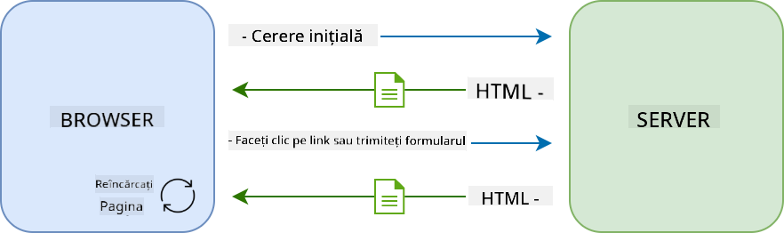
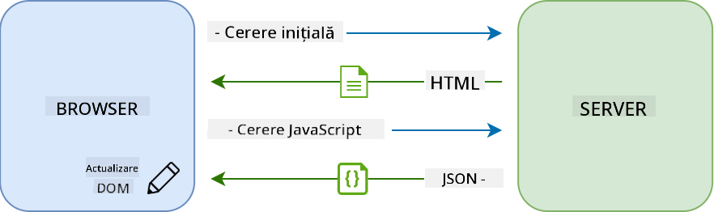

<!--
CO_OP_TRANSLATOR_METADATA:
{
  "original_hash": "f587e913e3f7c0b1c549a05dd74ee8e5",
  "translation_date": "2025-08-28T07:30:53+00:00",
  "source_file": "7-bank-project/3-data/README.md",
  "language_code": "ro"
}
-->
# Construirea unei aplicații bancare Partea 3: Metode de preluare și utilizare a datelor

## Chestionar înainte de curs

[Chestionar înainte de curs](https://ff-quizzes.netlify.app/web/quiz/45)

### Introducere

La baza fiecărei aplicații web se află *datele*. Datele pot lua multe forme, dar scopul lor principal este întotdeauna să afișeze informații utilizatorului. Pe măsură ce aplicațiile web devin din ce în ce mai interactive și complexe, modul în care utilizatorul accesează și interacționează cu informațiile a devenit o parte esențială a dezvoltării web.

În această lecție, vom vedea cum să preluăm date de la un server în mod asincron și să folosim aceste date pentru a afișa informații pe o pagină web fără a reîncărca HTML-ul.

### Cerințe preliminare

Trebuie să fi construit partea [Formular de autentificare și înregistrare](../2-forms/README.md) a aplicației web pentru această lecție. De asemenea, trebuie să instalați [Node.js](https://nodejs.org) și să [rulați API-ul serverului](../api/README.md) local pentru a obține datele contului.

Puteți testa dacă serverul funcționează corect executând această comandă într-un terminal:

```sh
curl http://localhost:5000/api
# -> should return "Bank API v1.0.0" as a result
```

---

## AJAX și preluarea datelor

Site-urile web tradiționale actualizează conținutul afișat atunci când utilizatorul selectează un link sau trimite date printr-un formular, reîncărcând întreaga pagină HTML. De fiecare dată când trebuie încărcate date noi, serverul web returnează o pagină HTML complet nouă care trebuie procesată de browser, întrerupând acțiunea curentă a utilizatorului și limitând interacțiunile în timpul reîncărcării. Acest flux de lucru este cunoscut și sub denumirea de *Aplicație Multi-Pagină* sau *MPA*.



Când aplicațiile web au început să devină mai complexe și interactive, a apărut o tehnică nouă numită [AJAX (JavaScript și XML asincron)](https://en.wikipedia.org/wiki/Ajax_(programming)). Această tehnică permite aplicațiilor web să trimită și să preia date de la un server în mod asincron folosind JavaScript, fără a reîncărca pagina HTML, rezultând actualizări mai rapide și interacțiuni mai fluide pentru utilizator. Când datele noi sunt primite de la server, pagina HTML curentă poate fi actualizată cu JavaScript folosind API-ul [DOM](https://developer.mozilla.org/docs/Web/API/Document_Object_Model). În timp, această abordare a evoluat în ceea ce acum se numește [*Aplicație cu o singură pagină* sau *SPA*](https://en.wikipedia.org/wiki/Single-page_application).



Când AJAX a fost introdus pentru prima dată, singurul API disponibil pentru preluarea datelor în mod asincron era [`XMLHttpRequest`](https://developer.mozilla.org/docs/Web/API/XMLHttpRequest/Using_XMLHttpRequest). Dar browserele moderne implementează acum și API-ul mai convenabil și mai puternic [`Fetch`](https://developer.mozilla.org/docs/Web/API/Fetch_API), care folosește promisiuni și este mai potrivit pentru manipularea datelor JSON.

> Deși toate browserele moderne acceptă `Fetch API`, dacă doriți ca aplicația dvs. web să funcționeze pe browsere vechi sau depășite, este întotdeauna o idee bună să verificați mai întâi [tabelul de compatibilitate pe caniuse.com](https://caniuse.com/fetch).

### Sarcină

În [lecția anterioară](../2-forms/README.md) am implementat formularul de înregistrare pentru a crea un cont. Acum vom adăuga cod pentru a ne autentifica folosind un cont existent și pentru a prelua datele acestuia. Deschideți fișierul `app.js` și adăugați o nouă funcție `login`:

```js
async function login() {
  const loginForm = document.getElementById('loginForm')
  const user = loginForm.user.value;
}
```

Aici începem prin a prelua elementul formularului cu `getElementById()`, iar apoi obținem numele de utilizator din câmpul de intrare cu `loginForm.user.value`. Fiecare control al formularului poate fi accesat prin numele său (setat în HTML folosind atributul `name`) ca proprietate a formularului.

În mod similar cu ceea ce am făcut pentru înregistrare, vom crea o altă funcție pentru a efectua o cerere către server, dar de data aceasta pentru a prelua datele contului:

```js
async function getAccount(user) {
  try {
    const response = await fetch('//localhost:5000/api/accounts/' + encodeURIComponent(user));
    return await response.json();
  } catch (error) {
    return { error: error.message || 'Unknown error' };
  }
}
```

Folosim API-ul `fetch` pentru a solicita datele în mod asincron de la server, dar de data aceasta nu avem nevoie de alți parametri în afară de URL-ul pe care îl apelăm, deoarece doar interogăm date. În mod implicit, `fetch` creează o cerere HTTP [`GET`](https://developer.mozilla.org/docs/Web/HTTP/Methods/GET), care este exact ceea ce căutăm aici.

✅ `encodeURIComponent()` este o funcție care scăpa caracterele speciale pentru URL. Ce probleme am putea avea dacă nu apelăm această funcție și folosim direct valoarea `user` în URL?

Acum să actualizăm funcția noastră `login` pentru a folosi `getAccount`:

```js
async function login() {
  const loginForm = document.getElementById('loginForm')
  const user = loginForm.user.value;
  const data = await getAccount(user);

  if (data.error) {
    return console.log('loginError', data.error);
  }

  account = data;
  navigate('/dashboard');
}
```

Mai întâi, deoarece `getAccount` este o funcție asincronă, trebuie să o potrivim cu cuvântul cheie `await` pentru a aștepta rezultatul serverului. Ca în cazul oricărei cereri către server, trebuie să gestionăm și cazurile de eroare. Deocamdată vom adăuga doar un mesaj de jurnal pentru a afișa eroarea și ne vom întoarce la aceasta mai târziu.

Apoi trebuie să stocăm datele undeva pentru a le putea folosi ulterior pentru a afișa informațiile din tabloul de bord. Deoarece variabila `account` nu există încă, vom crea o variabilă globală pentru aceasta în partea de sus a fișierului nostru:

```js
let account = null;
```

După ce datele utilizatorului sunt salvate într-o variabilă, putem naviga de la pagina de *login* la *dashboard* folosind funcția `navigate()` pe care o avem deja.

În cele din urmă, trebuie să apelăm funcția noastră `login` atunci când formularul de autentificare este trimis, modificând HTML-ul:

```html
<form id="loginForm" action="javascript:login()">
```

Testați că totul funcționează corect înregistrând un cont nou și încercând să vă autentificați folosind același cont.

Înainte de a trece la partea următoare, putem completa și funcția `register` adăugând acest lucru la sfârșitul funcției:

```js
account = result;
navigate('/dashboard');
```

✅ Știați că, în mod implicit, puteți apela API-uri de server doar de pe *același domeniu și port* ca pagina web pe care o vizualizați? Acesta este un mecanism de securitate impus de browsere. Dar stați, aplicația noastră web rulează pe `localhost:3000`, în timp ce API-ul serverului rulează pe `localhost:5000`, de ce funcționează? Folosind o tehnică numită [Partajare a resurselor între origini (CORS)](https://developer.mozilla.org/docs/Web/HTTP/CORS), este posibil să efectuați cereri HTTP între origini dacă serverul adaugă antete speciale la răspuns, permițând excepții pentru domenii specifice.

> Aflați mai multe despre API-uri urmând această [lecție](https://docs.microsoft.com/learn/modules/use-apis-discover-museum-art/?WT.mc_id=academic-77807-sagibbon)

## Actualizarea HTML-ului pentru a afișa date

Acum că avem datele utilizatorului, trebuie să actualizăm HTML-ul existent pentru a le afișa. Știm deja cum să preluăm un element din DOM folosind, de exemplu, `document.getElementById()`. După ce aveți un element de bază, iată câteva API-uri pe care le puteți folosi pentru a-l modifica sau pentru a adăuga elemente copil:

- Folosind proprietatea [`textContent`](https://developer.mozilla.org/docs/Web/API/Node/textContent) puteți schimba textul unui element. Rețineți că schimbarea acestei valori elimină toți copiii elementului (dacă există) și îi înlocuiește cu textul furnizat. Astfel, este și o metodă eficientă de a elimina toți copiii unui element dat atribuindu-i un șir gol `''`.

- Folosind [`document.createElement()`](https://developer.mozilla.org/docs/Web/API/Document/createElement) împreună cu metoda [`append()`](https://developer.mozilla.org/docs/Web/API/ParentNode/append) puteți crea și atașa unul sau mai multe elemente copil noi.

✅ Folosind proprietatea [`innerHTML`](https://developer.mozilla.org/docs/Web/API/Element/innerHTML) a unui element este, de asemenea, posibil să schimbați conținutul HTML al acestuia, dar aceasta ar trebui evitată deoarece este vulnerabilă la atacuri de tip [cross-site scripting (XSS)](https://developer.mozilla.org/docs/Glossary/Cross-site_scripting).

### Sarcină

Înainte de a trece la ecranul tabloului de bord, mai este un lucru pe care ar trebui să-l facem pe pagina de *login*. În prezent, dacă încercați să vă autentificați cu un nume de utilizator care nu există, un mesaj este afișat în consolă, dar pentru un utilizator obișnuit nu se întâmplă nimic și nu știți ce se întâmplă.

Să adăugăm un element de tip placeholder în formularul de autentificare unde putem afișa un mesaj de eroare, dacă este necesar. Un loc bun ar fi chiar înainte de butonul de *login*:

```html
...
<div id="loginError"></div>
<button>Login</button>
...
```

Acest element `<div>` este gol, ceea ce înseamnă că nimic nu va fi afișat pe ecran până când nu adăugăm conținut în el. De asemenea, îi atribuim un `id` pentru a-l putea prelua ușor cu JavaScript.

Reveniți la fișierul `app.js` și creați o nouă funcție helper `updateElement`:

```js
function updateElement(id, text) {
  const element = document.getElementById(id);
  element.textContent = text;
}
```

Aceasta este destul de simplă: dat fiind un *id* de element și un *text*, va actualiza conținutul text al elementului DOM cu `id`-ul corespunzător. Să folosim această metodă în locul mesajului de eroare anterior din funcția `login`:

```js
if (data.error) {
  return updateElement('loginError', data.error);
}
```

Acum, dacă încercați să vă autentificați cu un cont invalid, ar trebui să vedeți ceva de genul acesta:


Acum avem un text de eroare care apare vizual, dar dacă încercați să-l utilizați cu un cititor de ecran, veți observa că nu este anunțat nimic. Pentru ca textul adăugat dinamic pe o pagină să fie anunțat de cititoarele de ecran, va trebui să folosească ceva numit [Regiune Live](https://developer.mozilla.org/docs/Web/Accessibility/ARIA/ARIA_Live_Regions). Aici vom folosi un tip specific de regiune live numit alertă:

```html
<div id="loginError" role="alert"></div>
```

Implementați același comportament pentru erorile funcției `register` (nu uitați să actualizați HTML-ul).

## Afișarea informațiilor pe tabloul de bord

Folosind aceleași tehnici pe care tocmai le-am văzut, ne vom ocupa și de afișarea informațiilor despre cont pe pagina tabloului de bord.

Acesta este aspectul unui obiect de cont primit de la server:

```json
{
  "user": "test",
  "currency": "$",
  "description": "Test account",
  "balance": 75,
  "transactions": [
    { "id": "1", "date": "2020-10-01", "object": "Pocket money", "amount": 50 },
    { "id": "2", "date": "2020-10-03", "object": "Book", "amount": -10 },
    { "id": "3", "date": "2020-10-04", "object": "Sandwich", "amount": -5 }
  ],
}
```

> Notă: pentru a vă ușura munca, puteți folosi contul `test` preexistent, care este deja populat cu date.

### Sarcină

Să începem prin a înlocui secțiunea "Balance" din HTML pentru a adăuga elemente de tip placeholder:

```html
<section>
  Balance: <span id="balance"></span><span id="currency"></span>
</section>
```

Vom adăuga, de asemenea, o nouă secțiune chiar dedesubt pentru a afișa descrierea contului:

```html
<h2 id="description"></h2>
```

✅ Deoarece descrierea contului funcționează ca un titlu pentru conținutul de dedesubt, este marcată semantic ca un titlu. Aflați mai multe despre cum [structura titlurilor](https://www.nomensa.com/blog/2017/how-structure-headings-web-accessibility) este importantă pentru accesibilitate și analizați critic pagina pentru a determina ce altceva ar putea fi un titlu.

În continuare, vom crea o nouă funcție în `app.js` pentru a completa placeholder-ul:

```js
function updateDashboard() {
  if (!account) {
    return navigate('/login');
  }

  updateElement('description', account.description);
  updateElement('balance', account.balance.toFixed(2));
  updateElement('currency', account.currency);
}
```

Mai întâi, verificăm că avem datele contului de care avem nevoie înainte de a merge mai departe. Apoi folosim funcția `updateElement()` pe care am creat-o mai devreme pentru a actualiza HTML-ul.

> Pentru a face afișarea soldului mai atractivă, folosim metoda [`toFixed(2)`](https://developer.mozilla.org/docs/Web/JavaScript/Reference/Global_Objects/Number/toFixed) pentru a forța afișarea valorii cu 2 zecimale.

Acum trebuie să apelăm funcția noastră `updateDashboard()` de fiecare dată când tabloul de bord este încărcat. Dacă ați terminat deja [tema lecției 1](../1-template-route/assignment.md), acest lucru ar trebui să fie simplu, altfel puteți folosi următoarea implementare.

Adăugați acest cod la sfârșitul funcției `updateRoute()`:

```js
if (typeof route.init === 'function') {
  route.init();
}
```

Și actualizați definiția rutelor cu:

```js
const routes = {
  '/login': { templateId: 'login' },
  '/dashboard': { templateId: 'dashboard', init: updateDashboard }
};
```

Cu această modificare, de fiecare dată când pagina tabloului de bord este afișată, funcția `updateDashboard()` este apelată. După o autentificare, ar trebui să puteți vedea soldul contului, moneda și descrierea.

## Crearea rândurilor tabelului dinamic cu șabloane HTML

În [prima lecție](../1-template-route/README.md) am folosit șabloane HTML împreună cu metoda [`appendChild()`](https://developer.mozilla.org/docs/Web/API/Node/appendChild) pentru a implementa navigarea în aplicația noastră. Șabloanele pot fi, de asemenea, mai mici și utilizate pentru a popula dinamic părți repetitive ale unei pagini.

Vom folosi o abordare similară pentru a afișa lista tranzacțiilor în tabelul HTML.

### Sarcină

Adăugați un nou șablon în `<body>`-ul HTML:

```html
<template id="transaction">
  <tr>
    <td></td>
    <td></td>
    <td></td>
  </tr>
</template>
```

Acest șablon reprezintă un singur rând de tabel, cu cele 3 coloane pe care dorim să le populăm: *data*, *obiectul* și *suma* unei tranzacții.

Apoi, adăugați această proprietate `id` elementului `<tbody>` al tabelului din șablonul tabloului de bord pentru a-l face mai ușor de găsit folosind JavaScript:

```html
<tbody id="transactions"></tbody>
```

HTML-ul nostru este gata, să trecem la codul JavaScript și să creăm o nouă funcție `createTransactionRow`:

```js
function createTransactionRow(transaction) {
  const template = document.getElementById('transaction');
  const transactionRow = template.content.cloneNode(true);
  const tr = transactionRow.querySelector('tr');
  tr.children[0].textContent = transaction.date;
  tr.children[1].textContent = transaction.object;
  tr.children[2].textContent = transaction.amount.toFixed(2);
  return transactionRow;
}
```

Această funcție face exact ceea ce sugerează numele său: folosind șablonul pe care l-am creat mai devreme, creează un nou rând de tabel și completează conținutul acestuia folosind datele tranzacției. Vom folosi aceasta în funcția noastră `updateDashboard()` pentru a popula tabelul:

```js
const transactionsRows = document.createDocumentFragment();
for (const transaction of account.transactions) {
  const transactionRow = createTransactionRow(transaction);
  transactionsRows.appendChild(transactionRow);
}
updateElement('transactions', transactionsRows);
```

Aici folosim metoda [`document.createDocumentFragment()`](https://developer.mozilla.org/docs/Web/API/Document/createDocumentFragment) care creează un nou fragment DOM pe care putem lucra, înainte de a-l atașa în final tabelului nostru HTML.

Mai este un lucru pe care trebuie să-l facem înainte ca acest cod să funcționeze, deoarece funcția noastră `updateElement()` acceptă în prezent doar conținut text. Să schimbăm puțin codul acesteia:

```js
function updateElement(id, textOrNode) {
  const element = document.getElementById(id);
  element.textContent = ''; // Removes all children
  element.append(textOrNode);
}
```

Folosim metoda [`append()`](https://developer.mozilla.org/docs/Web/API/ParentNode/append) deoarece permite atașarea fie a textului, fie a [nodurilor DOM](https://developer.mozilla.org/docs/Web/API/Node) la un element părinte, ceea ce este perfect pentru toate cazurile noastre de utilizare.
Dacă încercați să vă autentificați folosind contul `test`, ar trebui să vedeți acum o listă de tranzacții pe tabloul de bord 🎉.

---

## 🚀 Provocare

Lucrați împreună pentru a face pagina tabloului de bord să arate ca o aplicație bancară reală. Dacă deja ați stilizat aplicația, încercați să folosiți [media queries](https://developer.mozilla.org/docs/Web/CSS/Media_Queries) pentru a crea un [design responsiv](https://developer.mozilla.org/docs/Web/Progressive_web_apps/Responsive/responsive_design_building_blocks) care funcționează bine atât pe dispozitive desktop, cât și pe cele mobile.

Iată un exemplu de pagină de tabloul de bord stilizată:


## Quiz de după lecție

[Quiz de după lecție](https://ff-quizzes.netlify.app/web/quiz/46)

## Temă

[Refactorizați și comentați codul](assignment.md)

---

**Declinare de responsabilitate**:  
Acest document a fost tradus folosind serviciul de traducere AI [Co-op Translator](https://github.com/Azure/co-op-translator). Deși ne străduim să asigurăm acuratețea, vă rugăm să fiți conștienți că traducerile automate pot conține erori sau inexactități. Documentul original în limba sa maternă ar trebui considerat sursa autoritară. Pentru informații critice, se recomandă traducerea profesională realizată de un specialist uman. Nu ne asumăm responsabilitatea pentru eventualele neînțelegeri sau interpretări greșite care pot apărea din utilizarea acestei traduceri.