<!--
CO_OP_TRANSLATOR_METADATA:
{
  "original_hash": "86ee5069f27ea3151389d8687c95fac9",
  "translation_date": "2026-01-07T06:01:54+00:00",
  "source_file": "7-bank-project/3-data/README.md",
  "language_code": "ro"
}
-->
# Construiește o Aplicație Bancară Partea 3: Metode de Preluare și Utilizare a Datelor

Gândește-te la computerul Enterprise din Star Trek - când Căpitanul Picard cere starea navei, informația apare instantaneu fără ca întreaga interfață să se închidă și să se reconstruiască. Acest flux lin de informații este exact ceea ce construim aici cu preluarea dinamică a datelor.

În acest moment, aplicația ta bancară este ca un ziar tipărit - informativă, dar statică. Vom transforma aplicația într-un ceva mai asemănător centrului de comandă de la NASA, unde datele curg continuu și se actualizează în timp real fără a întrerupe fluxul de lucru al utilizatorului.

Vei învăța cum să comunici cu serverele asincron, să gestionezi datele care sosesc în momente diferite și să transformi informațiile brute în ceva semnificativ pentru utilizatorii tăi. Aceasta este diferența dintre un demo și un software gata pentru producție.

## ⚡ Ce Poți Face în Următoarele 5 Minute

**Cale Rapidă pentru Dezvoltatori Ocupați**

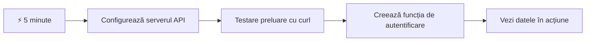
- **Minutele 1-2**: Pornește serverul tău API (`cd api && npm start`) și testează conexiunea
- **Minutul 3**: Creează o funcție simplă `getAccount()` folosind fetch
- **Minutul 4**: Leagă formularul de login cu `action="javascript:login()"`
- **Minutul 5**: Testează login-ul și urmărește cum datele contului apar în consolă

**Comenzi rapide pentru testare**:
```bash
# Verificați dacă API-ul rulează
curl http://localhost:5000/api

# Testați preluarea datelor contului
curl http://localhost:5000/api/accounts/test
```

**De ce este important**: În 5 minute vei vedea magia preluării asincrone a datelor care alimentează orice aplicație web modernă. Aceasta este fundația care face ca aplicațiile să pară receptive și vii.

## 🗺️ Călătoria Ta de Învățare prin Aplicații Web Bazate pe Date

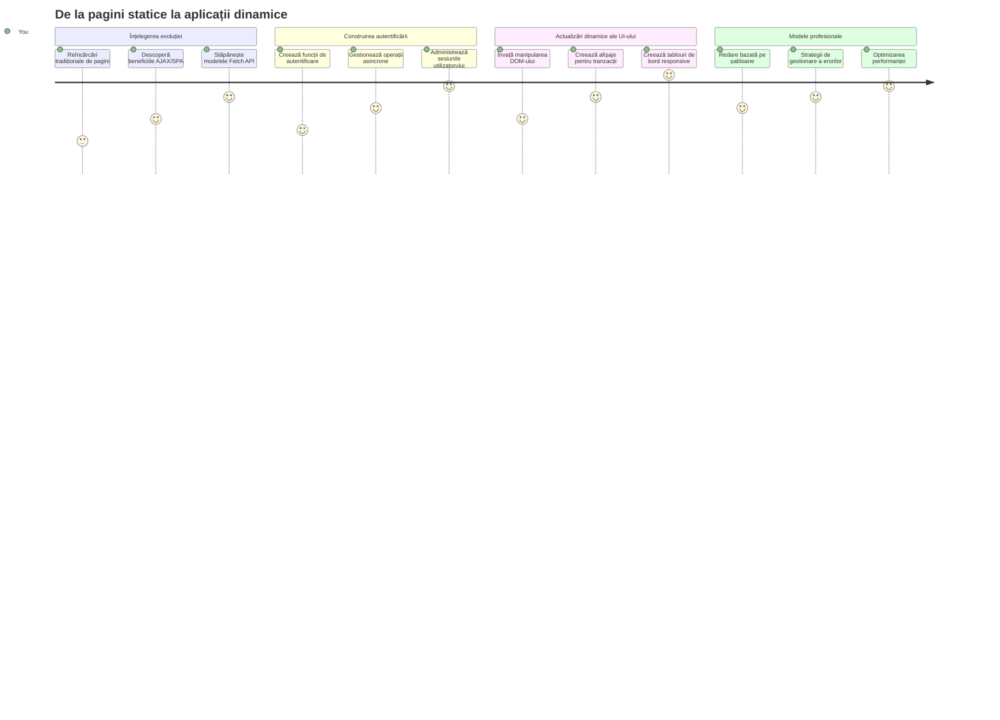
**Destinația Călătoriei Tale**: La finalul acestei lecții, vei înțelege cum aplicațiile web moderne preiau, procesează și afișează date dinamic, creând experiențe de utilizator fluide pe care le așteptăm de la aplicațiile profesionale.

## Test Preliminar

[Test preliminar](https://ff-quizzes.netlify.app/web/quiz/45)

### Cerințe Prealabile

Înainte de a te avânta în preluarea datelor, asigură-te că ai următoarele componente pregătite:

- **Lecția Anterioară**: Finalizează [Formularul de Login și Înregistrare](../2-forms/README.md) - vom construi pe această bază
- **Server Local**: Instalează [Node.js](https://nodejs.org) și [pornește serverul API](../api/README.md) pentru a furniza datele contului
- **Conexiune API**: Testează conexiunea serverului cu această comandă:

```bash
curl http://localhost:5000/api
# Răspuns așteptat: "Bank API v1.0.0"
```

Acest test rapid asigură că toate componentele comunică corect:
- Verifică că Node.js rulează corect pe sistemul tău
- Confirmă că serverul tău API este activ și răspunde
- Validatează că aplicația ta poate accesa serverul (ca un control radio înainte de o misiune)

## 🧠 Prezentare Generală a Ecosistemului de Management al Datelor

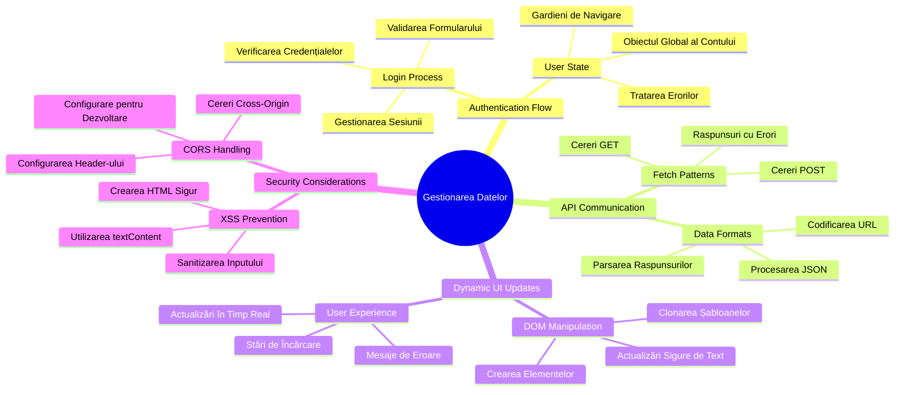
**Principiu de bază**: Aplicațiile web moderne sunt sisteme de orchestrare a datelor - ele coordonează între interfețele utilizator, API-urile serverelor și modelele de securitate ale browserelor pentru a crea experiențe fluide și receptive.

---

## Înțelegerea Preluării Datelor în Aplicațiile Web Moderne

Modul în care aplicațiile web gestionează datele s-a schimbat dramatic în ultimele două decenii. Înțelegerea acestei evoluții te va ajuta să apreciezi de ce tehnici moderne precum AJAX și Fetch API sunt atât de puternice și de ce au devenit instrumente esențiale pentru dezvoltatorii web.

Să explorăm cum funcționau site-urile tradiționale comparativ cu aplicațiile dinamice și receptive pe care le construim astăzi.

### Aplicații Multi-Pagină Tradiționale (MPA)

În primele zile ale web-ului, fiecare clic era ca schimbarea canalelor la un televizor vechi - ecranul devenea gol, apoi se ajusta încet către noul conținut. Aceasta era realitatea aplicațiilor web timpurii, unde fiecare interacțiune însemna reconstrucția completă a întregii pagini de la zero.

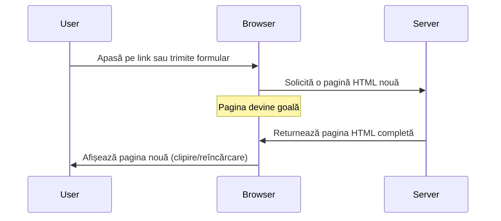


**De ce această abordare părea stângace:**
- Fiecare clic implica reconstruirea completă a paginii de la zero
- Utilizatorii erau întrerupți în miezul gândului de acele flash-uri enervante ale paginii
- Conexiunea ta la internet lucra în exces descărcând repetat același antet și subsol
- Aplicațiile păreau mai mult ca navigarea prin dosare fizice decât ca utilizarea unui software

### Aplicații Moderne Single-Page (SPA)

AJAX (JavaScript asincron și XML) a schimbat complet acest paradigm. Ca designul modular al Stației Spațiale Internaționale, unde astronauții pot înlocui componente individuale fără a reconstrui întreaga structură, AJAX ne permite să actualizăm părți specifice ale unei pagini web fără a reîncărca totul. Deși numele menționează XML, folosim în principal JSON astăzi, dar principiul de bază rămâne: actualizează doar ceea ce trebuie schimbat.

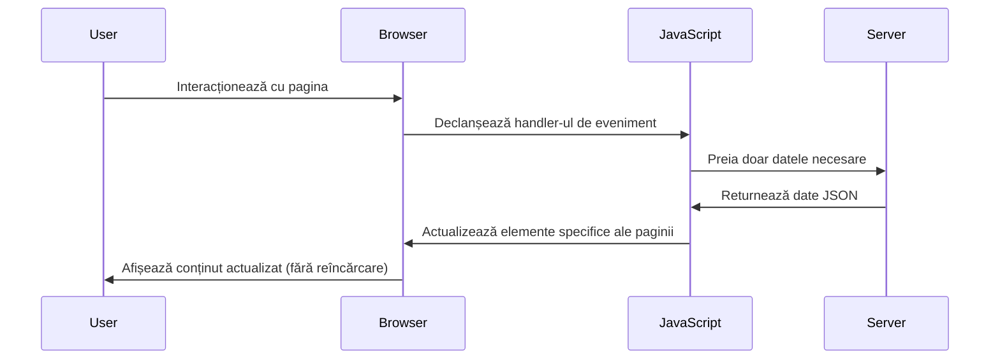


**De ce SPA-urile se simt mult mai bine:**
- Doar părțile care s-au schimbat de fapt sunt actualizate (inteligent, nu?)
- Fără întreruperi deranjante - utilizatorii rămân în fluxul lor
- Mai puține date călătorind în rețea înseamnă încărcare mai rapidă
- Totul se simte rapid și receptiv, ca aplicațiile de pe telefonul tău

### Evoluția către API-ul Modern Fetch

Browserele moderne oferă [`Fetch` API](https://developer.mozilla.org/docs/Web/API/Fetch_API), care înlocuiește vechiul [`XMLHttpRequest`](https://developer.mozilla.org/docs/Web/API/XMLHttpRequest/Using_XMLHttpRequest). Ca diferența dintre a opera un telegraf și a folosi email-ul, Fetch API folosește promisiuni pentru un cod asincron mai curat și gestionează JSON-ul în mod natural.

| Caracteristică | XMLHttpRequest | Fetch API |
|---------|----------------|----------|
| **Sintaxă** | Bazată pe callback-uri complexe | Curată, bazată pe promisiuni |
| **Gestionarea JSON** | Necesită parsare manuală | Metodă `.json()` integrată |
| **Gestionarea erorilor** | Informații limitate despre erori | Detalii complete despre erori |
| **Compatibilitate modernă** | Compatibilitate legacy | Promisiuni ES6+ și async/await |

> 💡 **Compatibilitatea browserelor**: Vești bune - Fetch API funcționează în toate browserele moderne! Dacă ești curios despre versiuni specifice, [caniuse.com](https://caniuse.com/fetch) are povestea completă a compatibilității.
> 
**Pe scurt:**
- Funcționează excelent în Chrome, Firefox, Safari și Edge (practic oriunde se află utilizatorii tăi)
- Doar Internet Explorer are nevoie de ajutor suplimentar (și sincer, e timpul să îl lași în urmă)
- Te pregătește perfect pentru elegantele modele async/await pe care le vom folosi mai târziu

### Implementarea Login-ului și Preluarea Datelor

Acum să implementăm sistemul de autentificare care transformă aplicația ta bancară dintr-un afișaj static într-o aplicație funcțională. Ca protocoalele de autentificare folosite în facilități militare sigure, vom verifica credențialele utilizatorului și apoi vom oferi acces la datele specifice ale acestuia.

Vom construi acest sistem incremental, începând cu autentificarea de bază și apoi adăugând capabilitățile de preluare a datelor.

#### Pasul 1: Creează Baza Funcției de Login

Deschide fișierul `app.js` și adaugă o nouă funcție `login`. Aceasta va gestiona procesul de autentificare a utilizatorului:

```javascript
async function login() {
  const loginForm = document.getElementById('loginForm');
  const user = loginForm.user.value;
}
```

**Să descompunem acest cod:**
- Cuvântul cheie `async`? Indică JavaScript-ului „hei, această funcție s-ar putea să aștepte niște lucruri”
- Luăm formularul de pe pagină (nimic complicat, doar îl găsim după ID)
- Extragem ceea ce a introdus utilizatorul ca nume de utilizator
- Un truc util: poți accesa orice câmp de formular după atributul său `name` - fără apeluri suplimentare getElementById!

> 💡 **Model de acces la Formular**: Fiecare control al formularului poate fi accesat prin numele său (setat în HTML folosind atributul `name`) ca o proprietate a elementului formular. Acesta oferă o modalitate curată și lizibilă de a obține datele formularului.

#### Pasul 2: Creează Funcția pentru Preluarea Datelor Contului

Apoi, vom crea o funcție dedicată pentru a prelua datele contului de la server. Aceasta urmează același model ca funcția ta de înregistrare, dar se concentrează pe preluarea datelor:

```javascript
async function getAccount(user) {
  try {
    const response = await fetch('//localhost:5000/api/accounts/' + encodeURIComponent(user));
    return await response.json();
  } catch (error) {
    return { error: error.message || 'Unknown error' };
  }
}
```

**Ce face acest cod:**
- **Folosește** API-ul modern `fetch` pentru a cere date asincron
- **Construiește** un URL pentru o cerere GET cu parametrul numelui de utilizator
- **Aplică** `encodeURIComponent()` pentru a trata în siguranță caractere speciale din URL
- **Convertește** răspunsul în format JSON pentru manipulare ușoară
- **Gestionează** erorile într-un mod grațios, întorcând un obiect eroare în loc să se prăbușească

> ⚠️ **Notă de securitate**: Funcția `encodeURIComponent()` gestionează caracterele speciale din URL-uri. Ca sistemele de codare folosite în comunicațiile navale, se asigură că mesajul tău ajunge exact așa cum l-ai trimis, prevenind interpretarea greșită a caracterelor precum "#" sau "&".
> 
**De ce contează asta:**
- Previne problemele cauzate de caractere speciale în URL-uri
- Protejează împotriva atacurilor de manipulare URL
- Asigură că serverul primește datele așa cum trebuie
- Urmează practici de codare securizate

#### Înțelegerea Cererilor HTTP GET

Iată ceva ce te-ar putea surprinde: când folosești `fetch` fără opțiuni suplimentare, acesta creează automat o cerere [`GET`](https://developer.mozilla.org/docs/Web/HTTP/Methods/GET). Acest lucru este perfect pentru ceea ce facem noi – cerem serverului „hei, pot vedea datele contului acestui utilizator?”

Gândește-te la cererile GET ca la a cere politicos să împrumuți o carte de la bibliotecă - ceri să vezi ceva ce există deja. Cererile POST (pe care le-am folosit la înregistrare) sunt mai mult ca a trimite o carte nouă pentru a fi adăugată în colecție.

| Cerere GET | Cerere POST |
|-------------|-------------|
| **Scop** | Preluare date existente | Trimitere date noi către server |
| **Parametri** | În URL (cale/șir de interogare) | În corpul cererii |
| **Caching** | Poate fi cached de browsere | De obicei nu este cached |
| **Securitate** | Vizibil în URL/jurnale | Ascuns în corpul cererii |

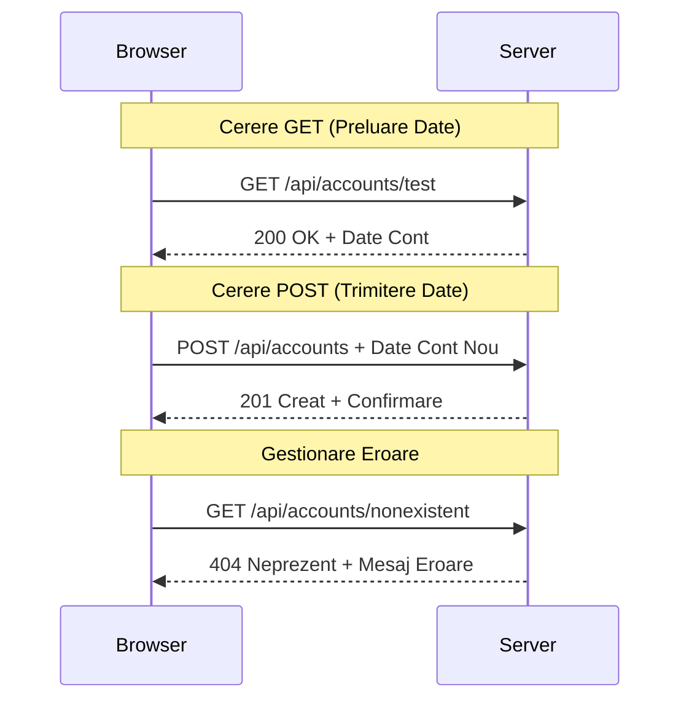
#### Pasul 3: Asamblarea Întregului Proces

Acum partea satisfăcătoare - să conectăm funcția de preluare a contului cu procesul de login. Aici totul se leagă:

```javascript
async function login() {
  const loginForm = document.getElementById('loginForm');
  const user = loginForm.user.value;
  const data = await getAccount(user);

  if (data.error) {
    return console.log('loginError', data.error);
  }

  account = data;
  navigate('/dashboard');
}
```

Această funcție urmează o secvență clară:
- Extrage numele de utilizator din input-ul formularului
- Cere datele contului acestui utilizator de la server
- Gestionează eventualele erori
- Stochează datele contului și navighează către dashboard la succes

> 🎯 **Model Async/Await**: Deoarece `getAccount` este o funcție asincronă, folosim cuvântul cheie `await` pentru a opri execuția până când serverul răspunde. Astfel prevenim continuarea codului cu date nedefinite.

#### Pasul 4: Creează un Loc pentru Datele Tale

Aplicația ta are nevoie de un loc unde să păstreze informațiile contului odată ce sunt încărcate. Gândește-te la asta ca la memoria pe termen scurt a aplicației – un loc unde să ții datele utilizatorului curent la îndemână. Adaugă această linie în partea de sus a fișierului `app.js`:

```javascript
// Acesta conține datele contului utilizatorului curent
let account = null;
```

**De ce avem nevoie de asta:**
- Menține datele contului accesibile din orice parte a aplicației
- Pornind de la `null` înseamnă „nimeni nu este logat încă”
- Se actualizează când cineva se loghează sau se înregistrează cu succes
- Acționează ca o sursă unică de adevăr - fără confuzie cine este logat

#### Pasul 5: Leagă Formularul Tău

Acum să conectăm funcția ta nouă de login la formularul HTML. Actualizează tag-ul formular astfel:

```html
<form id="loginForm" action="javascript:login()">
  <!-- Your existing form inputs -->
</form>
```

**Ce face această mică schimbare:**
- Oprește formularul să facă comportamentul lui implicit de „reîncărcare a întregii pagini”
- Apelează funcția ta personalizată JavaScript în loc
- Menține totul fluid și cu aspectul unei aplicații single-page
- Îți oferă controlul complet asupra a ceea ce se întâmplă când utilizatorii apasă „Login”

#### Pasul 6: Îmbunătățește Funcția ta de Înregistrare

Pentru consistență, actualizează funcția `register` să salveze și ea datele contului și să navigheze către dashboard:

```javascript
// Adaugă aceste linii la sfârșitul funcției tale de înregistrare
account = result;
navigate('/dashboard');
```

**Această îmbunătățire oferă:**
- **Tranziție lină** de la înregistrare la dashboard
- **Experiență consistentă** pentru utilizatori între fluxurile de login și înregistrare
- **Acces imediat** la datele contului după înregistrare reușită

#### Testarea Implementării Tale

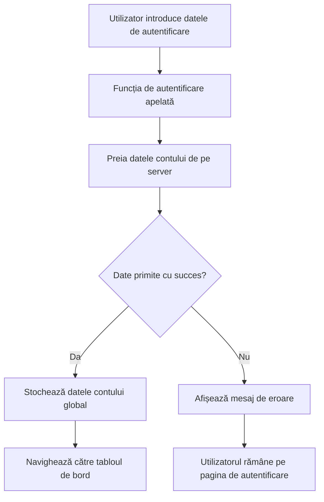
**E timpul să testezi implementarea:**
1. Creează un cont nou pentru a verifica dacă totul funcționează
2. Încearcă să te loghezi cu aceleași credențiale
3. Aruncă o privire în consola browserului (F12) dacă ceva pare în neregulă
4. Asigură-te că ajungi pe dashboard după un login reușit

Dacă ceva nu funcționează, nu intra în panică! Majoritatea problemelor sunt corectări simple, cum ar fi greșeli de scriere sau uitarea de a porni serverul API.

#### Un Cuvânt Rapid Despre Magia Cross-Origin

Te-ai putea întreba: „Cum conversa aplicația mea web cu acest server API dacă rulează pe porturi diferite?” Bună întrebare! Aceasta atinge un aspect cu care orice dezvoltator web se confruntă la un moment dat.

> 🔒 **Securitate Cross-Origin**: Browserele aplică o „politică de același origini” pentru a preveni comunicările neautorizate între domenii diferite. Ca un sistem de control la Pentagon, ele verifică dacă comunicarea este autorizată înainte de a permite transferul de date.
> 
**În configurația noastră:**
- Aplicația web rulează pe `localhost:3000` (server de dezvoltare)
- Serverul API rulează pe `localhost:5000` (server backend)
- Serverul API include [anteturile CORS](https://developer.mozilla.org/docs/Web/HTTP/CORS) care autorizează explicit comunicarea din partea aplicației web

Această configurație reflectă dezvoltarea reală unde aplicațiile frontend și backend rulează de obicei pe servere separate.

> 📚 **Află mai multe**: Explorează mai profund API-urile și preluarea datelor cu acest modul complet [Microsoft Learn despre API-uri](https://docs.microsoft.com/learn/modules/use-apis-discover-museum-art/?WT.mc_id=academic-77807-sagibbon).

## Transformă Datele în Viață în HTML

Acum vom face datele preluate vizibile utilizatorilor prin manipularea DOM-ului. Ca procesul de dezvoltare a fotografiilor într-o cameră obscură, luăm date invizibile și le redăm într-un format pe care utilizatorii îl pot vedea și cu care pot interacționa.
Manipularea DOM este tehnica care transformă paginile web statice în aplicații dinamice care își actualizează conținutul în funcție de interacțiunile utilizatorilor și răspunsurile serverului.

### Alegerea Uneltei Potrivite pentru Fiecare Sarcină

Când vine vorba de actualizarea HTML-ului cu JavaScript, ai mai multe opțiuni. Gândește-le ca pe diferite unelte dintr-o cutie de scule - fiecare perfectă pentru anumite joburi:

| Metodă | Pentru ce este excelentă | Când să o folosești | Nivel de siguranță |
|--------|-------------------------|--------------------|--------------------|
| `textContent` | Afișarea sigură a datelor utilizatorului | Oricând afișezi text | ✅ Foarte sigur |
| `createElement()` + `append()` | Construirea de layout-uri complexe | Crearea de secțiuni/listări noi | ✅ Impecabil |
| `innerHTML` | Setarea conținutului HTML | ⚠️ Încearcă să eviți aceasta | ❌ Riscuri mari |

#### Modalitatea Sigură de a Afișa Text: textContent

Proprietatea [`textContent`](https://developer.mozilla.org/docs/Web/API/Node/textContent) este cea mai bună prietenă când afișezi date provenite de la utilizatori. E ca un portar la intrarea în pagina ta web - nu lasă să treacă nimic periculos:

```javascript
// Mod sigur și fiabil de a actualiza textul
const balanceElement = document.getElementById('balance');
balanceElement.textContent = account.balance;
```

**Beneficiile textContent:**
- Tratează totul ca text simplu (previne executarea scripturilor)
- Șterge automat conținutul existent
- Eficient pentru actualizări simple de text
- Oferă securitate încorporată împotriva conținutului rău intenționat

#### Crearea Elementelor HTML Dinamice

Pentru conținut mai complex, combină [`document.createElement()`](https://developer.mozilla.org/docs/Web/API/Document/createElement) cu metoda [`append()`](https://developer.mozilla.org/docs/Web/API/ParentNode/append):

```javascript
// Mod sigur de a crea elemente noi
const transactionItem = document.createElement('div');
transactionItem.className = 'transaction-item';
transactionItem.textContent = `${transaction.date}: ${transaction.description}`;
container.append(transactionItem);
```

**Cum funcționează această abordare:**
- **Creează** elemente DOM noi programatic
- **Păstrează** control complet asupra atributelor și conținutului elementelor
- **Permite** structuri complexe și imbricate de elemente
- **Asigură** securitate prin separarea structurii de conținut

> ⚠️ **Considerații de Securitate**: Deși [`innerHTML`](https://developer.mozilla.org/docs/Web/API/Element/innerHTML) apare în multe tutoriale, poate executa scripturi încorporate. La fel ca protocoalele de securitate CERN care previn execuția neautorizată de cod, folosirea `textContent` și `createElement` oferă alternative mai sigure.
> 
**Riscurile innerHTML:**
- Execută orice tag `<script>` din datele utilizatorului
- Vulnerabil la atacuri de tip injectare de cod
- Creează potențiale breșe de securitate
- Alternativele mai sigure pe care le folosim oferă funcționalitate echivalentă

### Transformarea Erorilor în Mesaje Prietenoase pentru Utilizatori

În prezent, erorile de autentificare apar doar în consola browserului, care este invizibilă pentru utilizatori. La fel cum diferă diagnosticul intern al unui pilot de sistemul de informare pentru pasageri, trebuie să comunicăm informații importante prin canale potrivite.

Implementarea mesajelor de eroare vizibile oferă utilizatorilor un feedback imediat despre ce nu a mers bine și cum să procedeze.

#### Pasul 1: Adaugă un Loc pentru Mesajele de Eroare

Mai întâi, oferă un spațiu pentru mesajele de eroare în HTML-ul tău. Adaugă asta fix înaintea butonului de login, ca utilizatorii să îl vadă natural:

```html
<!-- This is where error messages will appear -->
<div id="loginError" role="alert"></div>
<button>Login</button>
```

**Ce se întâmplă aici:**
- Creăm un container gol care rămâne invizibil până e nevoie
- Este poziționat unde utilizatorii se uită natural după ce apasă pe „Login”
- Atributul `role="alert"` este o atenție pentru cititoarele de ecran - spune tehnologiei asistive „hei, asta e important!”
- ID-ul unic oferă JavaScript-ului nostru o țintă ușoară

#### Pasul 2: Creează o Funcție Utilitară Practică

Să facem o funcție mică care poate actualiza textul oricărui element. Este un gen de funcție „scrie o dată, folosește oriunde” ce îți va economisi timp:

```javascript
function updateElement(id, text) {
  const element = document.getElementById(id);
  element.textContent = text;
}
```

**Beneficiile funcției:**
- Interfață simplă, care cere doar ID-ul elementului și textul
- Găsește și actualizează elementele DOM în siguranță
- Model reutilizabil ce reduce codul duplicat
- Menține o actualizare consistentă în întreaga aplicație

#### Pasul 3: Afișează Erorile Unde Le Pot Vedea Utilizatorii

Acum să înlocuim mesajul ascuns din consolă cu ceva vizibil utilizatorilor. Actualizează funcția ta de login:

```javascript
// În loc să înregistrezi doar în consolă, arată utilizatorului ce este în neregulă
if (data.error) {
  return updateElement('loginError', data.error);
}
```

**Această schimbare mică aduce un beneficiu mare:**
- Mesajele de eroare apar fix acolo unde utilizatorii se uită
- Niciun eșec misterios și tăcut
- Utilizatorii primesc feedback imediat și util
- Aplicația ta devine mai profesională și atentă la utilizator

Acum, când testezi cu un cont invalid, vei vedea un mesaj de eroare util chiar pe pagină!


#### Pasul 4: Incluzivitate și Accesibilitate

Un lucru fain la atributul `role="alert"` adăugat mai devreme - nu e doar decorativ! Acest atribut creează o [Regiune Live](https://developer.mozilla.org/docs/Web/Accessibility/ARIA/ARIA_Live_Regions) care anunță imediat schimbările către cititoarele de ecran:

```html
<div id="loginError" role="alert"></div>
```

**De ce contează asta:**
- Utilizatorii cu cititoare de ecran aud mesajul de eroare imediat ce apare
- Toată lumea primește aceeași informație importantă, indiferent cum navighează
- Este o metodă simplă de a face aplicația ta accesibilă pentru mai mulți oameni
- Arată că îți pasă de experiențe incluzive

Detalii mici ca acestea diferențiază dezvoltatorii buni de cei grozavi!

### 🎯 Verificare Pedagogică: Modele de Autentificare

**Pauză și Reflectare**: Tocmai ai implementat un flux complet de autentificare. Acesta este un model fundamental în dezvoltarea web.

**Autoevaluare rapidă**:
- Poți explica de ce folosim async/await pentru apelurile API?
- Ce s-ar întâmpla dacă am uita funcția `encodeURIComponent()`?
- Cum îmbunătățește tratarea erorilor experiența utilizatorului?

**Legătura cu lumea reală**: Modelele învățate aici (preluarea asincronă a datelor, tratarea erorilor, feedback-ul utilizatorului) se folosesc în toate aplicațiile web majore, de la platforme sociale la site-uri de comerț electronic. Îți construiești abilități la nivel de producție!

**Întrebare provocatoare**: Cum ai modifica sistemul de autentificare să suporte roluri multiple de utilizatori (client, administrator, casier)? Gândește-te la structura datelor și la schimbările UI necesare.

#### Pasul 5: Aplică Același Model și la Înregistrare

Pentru consecvență, implementează aceeași tratare a erorilor în formularul de înregistrare:

1. **Adaugă** un element pentru afișarea erorilor în HTML-ul de înregistrare:
```html
<div id="registerError" role="alert"></div>
```

2. **Actualizează** funcția de înregistrare să folosească același model de afișare a erorilor:
```javascript
if (data.error) {
  return updateElement('registerError', data.error);
}
```

**Beneficiile tratării consecvente a erorilor:**
- **Oferă** o experiență uniformă pe toate formularele
- **Reduce** încărcarea cognitivă folosind modele familiare
- **Simplifică** întreținerea prin cod reutilizabil
- **Asigură** respectarea standardelor de accesibilitate în aplicație

## Crearea unui Dashboard Dinamic

Acum vom transforma dashboard-ul tău static într-o interfață dinamică ce afișează date reale de cont. La fel cum diferența este între un orar de zbor tipărit și panourile live din aeroporturi, trecem de la informație statică la afișări în timp real și reactive.

Folosind tehnicile de manipulare DOM învățate, vom crea un dashboard care sare în evidență prin actualizarea automată cu informații curente despre cont.

### Să Cunoaștem Datele Tale

Înainte să începem construcția, să aruncăm o privire la ce tip de date trimite serverul. Când cineva se autentifică cu succes, iată comoara de informații la care ai acces:

```json
{
  "user": "test",
  "currency": "$",
  "description": "Test account",
  "balance": 75,
  "transactions": [
    { "id": "1", "date": "2020-10-01", "object": "Pocket money", "amount": 50 },
    { "id": "2", "date": "2020-10-03", "object": "Book", "amount": -10 },
    { "id": "3", "date": "2020-10-04", "object": "Sandwich", "amount": -5 }
  ]
}
```

**Această structură de date oferă:**
- **`user`**: Perfect pentru personalizarea experienței („Bine ai revenit, Sarah!”)
- **`currency`**: Asigură afișarea corectă a sumelor de bani
- **`description`**: Un nume prietenos pentru cont
- **`balance`**: Soldul curent, cel mai important
- **`transactions`**: Istoricul complet al tranzacțiilor cu toate detaliile

Tot ce ai nevoie ca să construiești un dashboard bancar profesional!

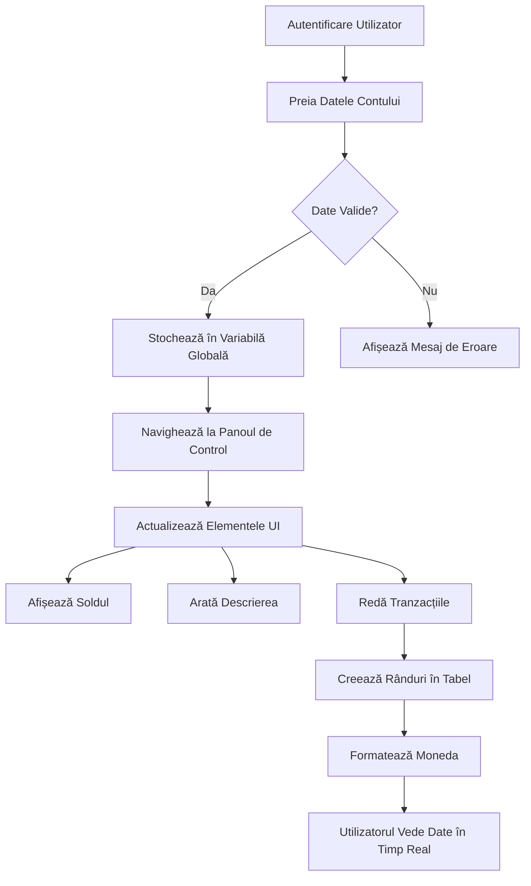
> 💡 **Sfat practic**: Vrei să vezi dashboard-ul în acțiune imediat? Folosește numele de utilizator `test` când te loghezi — vine deja încărcat cu date de exemplu ca să vezi totul funcționând fără să creezi tranzacții mai întâi.
> 
**De ce e contul de test util:**
- Vine cu date realiste deja încărcate
- Perfect pentru a vedea cum se afișează tranzacțiile
- Grozav pentru testarea funcțiilor dashboard-ului tău
- Te scutește de crearea manuală a datelor false

### Crearea Elementelor de Afișare ale Dashboard-ului

Să construim interfața dashboard-ului pas cu pas, începând cu informația sumar a contului, apoi trecând la caracteristici mai complexe cum sunt listele de tranzacții.

#### Pasul 1: Actualizează Structura HTML

În primul rând, înlocuiește secțiunea statică „Balance” cu elemente dinamice placeholder pe care JavaScript-ul tău să le completeze:

```html
<section>
  Balance: <span id="balance"></span><span id="currency"></span>
</section>
```

Adaugă apoi o secțiune pentru descrierea contului. Pentru că asta funcționează ca titlu al conținutului dashboard-ului, folosește HTML semantic:

```html
<h2 id="description"></h2>
```

**Ce înțelegem din structura HTML:**
- **Folosește** elemente `<span>` separate pentru sold și monedă, pentru control individual
- **Aplică** ID-uri unice fiecărui element ca să poată fi accesat de JavaScript
- **Respectă** semantică HTML folosind `<h2>` pentru descrierea contului
- **Creează** o ierarhie logică pentru cititoarele de ecran și SEO

> ✅ **Observație de accesibilitate**: Descrierea contului funcționează ca titlu pentru conținutul dashboard-ului, așa că e marcată semantic ca un heading. Află mai multe despre cum [structura heading](https://www.nomensa.com/blog/2017/how-structure-headings-web-accessibility) impactează accesibilitatea. Poți identifica și alte elemente de pe pagina ta care ar beneficia de taguri de titlu?

#### Pasul 2: Creează Funcția de Actualizare a Dashboard-ului

Acum creează o funcție care populatează dashboard-ul cu date reale ale contului:

```javascript
function updateDashboard() {
  if (!account) {
    return navigate('/login');
  }

  updateElement('description', account.description);
  updateElement('balance', account.balance.toFixed(2));
  updateElement('currency', account.currency);
}
```

**Pas cu pas, ce face această funcție:**
- **Verifică** existența datelor de cont înainte de a continua
- **Redirecționează** utilizatorii neinregistrați înapoi la pagina de login
- **Actualizează** descrierea contului folosind funcția reutilizabilă `updateElement`
- **Formatează** soldul să afișeze mereu două zecimale
- **Afișează** simbolul corect al monedei

> 💰 **Formatarea banilor**: Metoda [`toFixed(2)`](https://developer.mozilla.org/docs/Web/JavaScript/Reference/Global_Objects/Number/toFixed) este salvatoare! Asigură că soldul tău arată mereu ca niște bani adevărați – „75.00” în loc de „75”. Utilizatorii tăi vor aprecia afișarea familiară a monedei.

#### Pasul 3: Asigură-te că Dashboard-ul se Actualizează

Ca să se reîmprospăteze dashboard-ul cu date actualizate de fiecare dată când cineva îl vizitează, trebuie să te conectezi la sistemul tău de navigație. Dacă ai finalizat [tema lecției 1](../1-template-route/assignment.md), asta ar trebui să îți fie familiar. Dacă nu, iată ce ai nevoie:

Adaugă asta la finalul funcției tale `updateRoute()`:

```javascript
if (typeof route.init === 'function') {
  route.init();
}
```

Apoi actualizează-ți rutele să includă inițializarea dashboard-ului:

```javascript
const routes = {
  '/login': { templateId: 'login' },
  '/dashboard': { templateId: 'dashboard', init: updateDashboard }
};
```

**Ce face această setare istetă:**
- Verifică dacă o rută are cod special de inițializare
- Rulează automat acel cod când ruta se încarcă
- Asigură că dashboard-ul tău afișează întotdeauna date proaspete, actuale
- Menține logica de rutare curată și organizată

#### Testează-ți Dashboard-ul

După ce ai făcut aceste modificări, testează dashboard-ul:

1. **Loghează-te** cu un cont de test
2. **Verifică** dacă ești redirecționat către dashboard
3. **Verifică** dacă descrierea contului, soldul și moneda se afișează corect
4. **Încearcă să te deloghezi și să te loghezi din nou** ca să te asiguri că datele se reîmprospătează corespunzător

Dashboard-ul tău ar trebui să afișeze acum informații dinamice despre cont, actualizate în funcție de datele utilizatorului autentificat!

## Construirea Listelor Inteligente de Tranzacții cu Template-uri

În loc să creezi manual HTML pentru fiecare tranzacție, vom folosi template-uri pentru a genera automat formatarea consecventă. La fel cum componentele standardizate utilizate în fabricarea navelor spațiale asigură că fiecare piesă este uniformă, template-urile garantează că fiecare rând de tranzacție are aceeași structură și aspect.

Această tehnică scalează eficient de la câteva tranzacții până la mii, menținând performanța și prezentarea constantă.

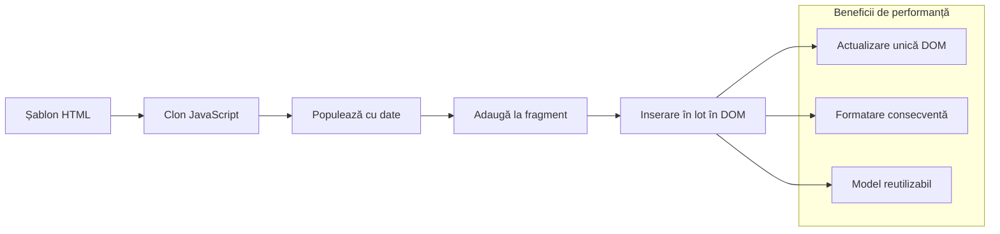
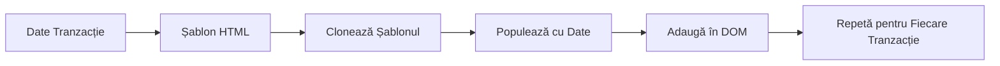
### Pasul 1: Creează Template-ul pentru Tranzacție

Mai întâi, adaugă un template reutilizabil pentru rândurile de tranzacții în `<body>`-ul tău HTML:

```html
<template id="transaction">
  <tr>
    <td></td>
    <td></td>
    <td></td>
  </tr>
</template>
```

**Înțelegerea template-urilor HTML:**
- **Definește** structura pentru un singur rând de tabel
- **Rămâne** invizibil până este clonat și populat cu JavaScript
- **Include** trei celule pentru dată, descriere și sumă
- **Oferă** un model reutilizabil pentru formatare consistentă

### Pasul 2: Pregătește Tabelul Pentru Conținut Dinamic

Apoi, adaugă un `id` la corpul tabelului ca JavaScript să îl poată accesa ușor:

```html
<tbody id="transactions"></tbody>
```

**Ce realizează asta:**
- **Creează** o țintă clară pentru inserarea rândurilor de tranzacții
- **Separă** structura tabelului de conținutul dinamic
- **Permite** golirea și reumplerea ușoară a datelor tranzacțiilor

### Pasul 3: Creează Funcția Fabrica de Rânduri de Tranzacții

Acum creează o funcție care transformă datele tranzacțiilor în elemente HTML:

```javascript
function createTransactionRow(transaction) {
  const template = document.getElementById('transaction');
  const transactionRow = template.content.cloneNode(true);
  const tr = transactionRow.querySelector('tr');
  tr.children[0].textContent = transaction.date;
  tr.children[1].textContent = transaction.object;
  tr.children[2].textContent = transaction.amount.toFixed(2);
  return transactionRow;
}
```

**Detalierea funcției fabrica:**
- **Recuperează** elementul template după ID
- **Clonează** conținutul template-ului pentru manipulare sigură
- **Selectează** rândul de tabel din conținutul clonat
- **Completează** fiecare celulă cu datele tranzacției
- **Formatează** suma să afișeze numărul corect de zecimale
- **Returnează** rândul gata de inserare

### Pasul 4: Generează Eficient Mai Multe Rânduri de Tranzacții

Adaugă acest cod în funcția ta `updateDashboard()` pentru a afișa toate tranzacțiile:

```javascript
const transactionsRows = document.createDocumentFragment();
for (const transaction of account.transactions) {
  const transactionRow = createTransactionRow(transaction);
  transactionsRows.appendChild(transactionRow);
}
updateElement('transactions', transactionsRows);
```

**De ce este eficientă această abordare:**
- **Creează** un fragment de document pentru a grupa operațiunile pe DOM
- **Iterează** prin toate tranzacțiile din datele contului
- **Generează** un rând pentru fiecare tranzacție folosind funcția fabrica
- **Colectează** toate rândurile în fragment înainte de a le adăuga în DOM
- **Execută** o singură actualizare a DOM-ului în loc de multiple inserții individuale și ineficiente
> ⚡ **Optimizarea Performanței**: [`document.createDocumentFragment()`](https://developer.mozilla.org/docs/Web/API/Document/createDocumentFragment) funcționează ca procesul de asamblare la Boeing - componentele sunt pregătite în afara liniei principale, apoi instalate ca o unitate completă. Această abordare în loturi minimizează reflow-urile DOM prin efectuarea unei singure inserții în loc de multiple operațiuni individuale.

### Pasul 5: Îmbunătățește Funcția Update pentru Conținut Mixt

Funcția ta `updateElement()` se ocupă în prezent doar de conținut text. Actualizeaz-o să funcționeze atât cu text, cât și cu noduri DOM:

```javascript
function updateElement(id, textOrNode) {
  const element = document.getElementById(id);
  element.textContent = ''; // Removes all children
  element.append(textOrNode);
}
```

**Îmbunătățirile cheie în această actualizare:**
- **Șterge** conținutul existent înainte de a adăuga conținut nou
- **Acceptă** fie șiruri de text, fie noduri DOM ca parametri
- **Folosește** metoda [`append()`](https://developer.mozilla.org/docs/Web/API/ParentNode/append) pentru flexibilitate
- **Menține** compatibilitatea inversă cu utilizarea bazată pe text existentă

### Testează-ți Dashboard-ul

Momentul adevărului! Hai să vedem dashboard-ul tău dinamic în acțiune:

1. Conectează-te folosind contul `test` (are date de probă gata pregătite)
2. Navighează la dashboard-ul tău
3. Verifică dacă rândurile de tranzacții apar cu formatarea corectă
4. Asigură-te că datele, descrierile și sumele arată bine

Dacă totul funcționează, ar trebui să vezi o listă complet funcțională de tranzacții pe dashboard-ul tău! 🎉

**Ce ai realizat:**
- Ai construit un dashboard care se scalează cu orice cantitate de date
- Ai creat șabloane reutilizabile pentru formatare consistentă
- Ai implementat tehnici eficiente de manipulare a DOM-ului
- Ai dezvoltat funcționalități comparabile cu aplicații bancare de producție

Ai transformat cu succes o pagină web statică într-o aplicație web dinamică.

### 🎯 Verificare Pedagogică: Generarea de Conținut Dinamic

**Înțelegerea Arhitecturii**: Ai implementat un pipeline sofisticat de date către UI care reflectă modelele folosite în framework-uri precum React, Vue și Angular.

**Concepte Cheie Stăpânite**:
- **Randare bazată pe șabloane**: Crearea de componente UI reutilizabile
- **Fragmente de document**: Optimizarea performanței DOM
- **Manipulare sigură a DOM-ului**: Prevenirea vulnerabilităților de securitate
- **Transformarea datelor**: Conversia datelor serverului în interfețe pentru utilizator

**Legătura cu Industria**: Aceste tehnici formează baza framework-urilor frontend moderne. DOM-ul virtual al React, sistemul de șabloane din Vue și arhitectura componentelor din Angular se bazează toate pe aceste concepte fundamentale.

**Întrebare de reflecție**: Cum ai extinde acest sistem pentru a gestiona actualizările în timp real (de exemplu, tranzacții noi care apar automat)? Ia în considerare WebSockets sau Server-Sent Events.

---

## 📈 Cronologia Stăpânirii Managementului Datelor

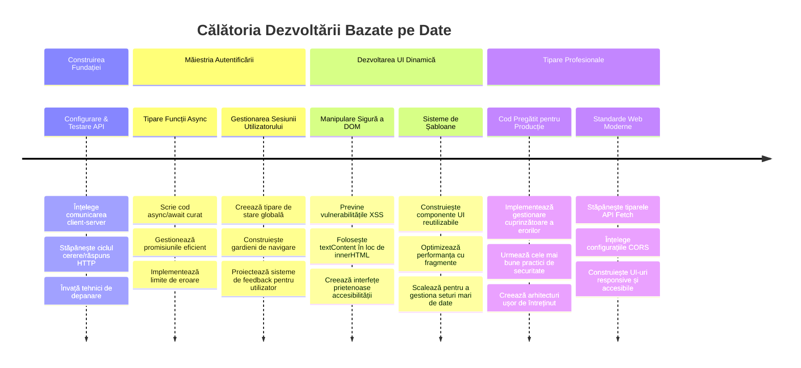
**🎓 Pragul absolvirii**: Ai construit cu succes o aplicație web complet bazată pe date folosind modele moderne JavaScript. Aceste abilități se traduc direct în lucru cu framework-uri precum React, Vue sau Angular.

**🔄 Capacități de nivel următor**:
- Pregătit să explorezi framework-uri frontend care se bazează pe aceste concepte
- Pregătit să implementezi funcții în timp real cu WebSockets
- Echipat să construiești aplicații web progresive cu capabilități offline
- Fundament pus pentru învățarea unor modele avansate de gestionare a stării

## Provocarea Agentului GitHub Copilot 🚀

Folosește modul Agent pentru a completa următoarea provocare:

**Descriere:** Îmbunătățește aplicația bancară prin implementarea unei funcții de căutare și filtrare a tranzacțiilor care permite utilizatorilor să găsească tranzacții specifice după interval de date, sumă sau descriere.

**Prompt:** Creează o funcționalitate de căutare pentru aplicația bancară care să includă: 1) Un formular de căutare cu câmpuri de introducere pentru intervalul de date (de la/până la), suma minimă/maximă și cuvinte cheie din descrierea tranzacției, 2) O funcție `filterTransactions()` care filtrează array-ul account.transactions pe baza criteriilor de căutare, 3) Actualizează funcția `updateDashboard()` pentru a afișa rezultatele filtrate și 4) Adaugă un buton "Clear Filters" pentru resetarea vizualizării. Folosește metode moderne de array în JavaScript precum `filter()` și gestionează cazurile limită pentru criterii de căutare goale.

Află mai multe despre [modul agent](https://code.visualstudio.com/blogs/2025/02/24/introducing-copilot-agent-mode) aici.

## 🚀 Provocare

Ești gata să duci aplicația ta bancară la nivelul următor? Hai să o facem să arate și să se simtă ca ceva ce chiar ai vrea să folosești. Iată câteva idei pentru a-ți stimula creativitatea:

**Fă-o frumoasă**: Adaugă stiluri CSS pentru a transforma dashboard-ul funcțional într-unul vizual atractiv. Gândește-te la linii curate, spațiere bună și poate chiar niște animații subtile.

**Fă-o responsivă**: Încearcă să folosești [media queries](https://developer.mozilla.org/docs/Web/CSS/Media_Queries) pentru a crea un [design responsiv](https://developer.mozilla.org/docs/Web/Progressive_web_apps/Responsive/responsive_design_building_blocks) care să funcționeze excelent pe telefoane, tablete și desktop-uri. Utilizatorii tăi îți vor mulțumi!

**Adaugă un plus de farmec**: Ia în considerare codificarea tranzacțiilor după culoare (verde pentru venituri, roșu pentru cheltuieli), adăugarea de icoane sau crearea de efecte hover care să facă interfața să pară interactivă.

Iată cum ar putea arăta un dashboard finisat:


Nu trebuie să se potrivească exact - folosește-l ca inspirație și fă-l să fie al tău!

## Quiz Post-Lecție

[Quiz post-lectură](https://ff-quizzes.netlify.app/web/quiz/46)

## Tema

[Refactorizează și comentează codul](assignment.md)

---

<!-- CO-OP TRANSLATOR DISCLAIMER START -->
**Declinare de responsabilitate**:  
Acest document a fost tradus utilizând serviciul de traducere AI [Co-op Translator](https://github.com/Azure/co-op-translator). Deși ne străduim să asigurăm acuratețea, vă rugăm să rețineți că traducerile automate pot conține erori sau inexactități. Documentul original în limba sa nativă trebuie considerat sursa autorizată. Pentru informații critice, se recomandă traducerea profesională realizată de un traducător uman. Nu suntem responsabili pentru eventualele neînțelegeri sau interpretări greșite care pot apărea în urma utilizării acestei traduceri.
<!-- CO-OP TRANSLATOR DISCLAIMER END -->