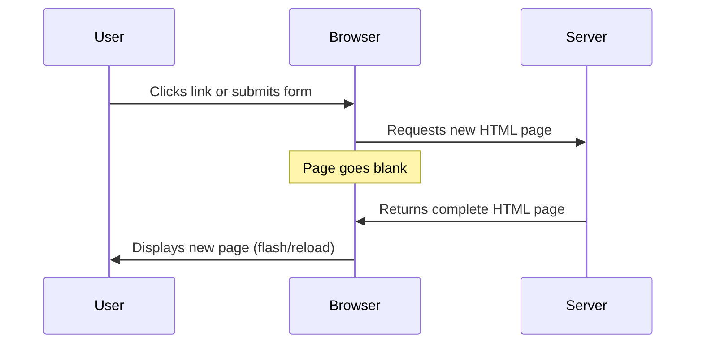
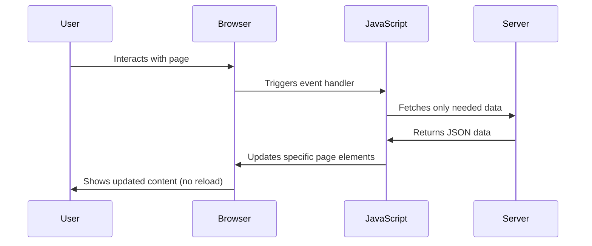
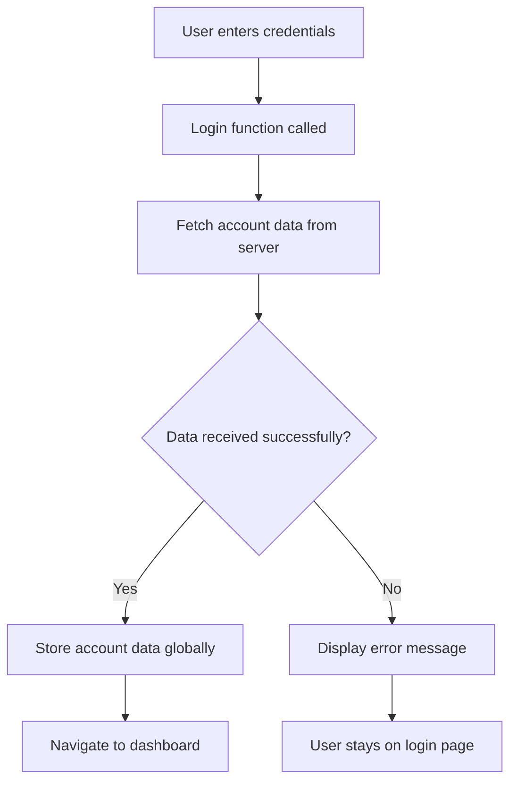
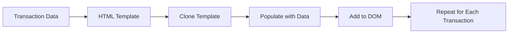

<!--
CO_OP_TRANSLATOR_METADATA:
{
  "original_hash": "2c1164912414820c8efd699b43f64954",
  "translation_date": "2025-10-24T22:10:46+00:00",
  "source_file": "7-bank-project/3-data/README.md",
  "language_code": "ro"
}
-->
# Construirea unei aplicații bancare Partea 3: Metode de preluare și utilizare a datelor

Gândește-te la computerul Enterprise din Star Trek - când căpitanul Picard cere starea navei, informațiile apar instantaneu fără ca întreaga interfață să se oprească și să se reconstruiască. Acest flux fluid de informații este exact ceea ce construim aici, prin preluarea dinamică a datelor.

În momentul de față, aplicația ta bancară este ca un ziar tipărit - informativ, dar static. O vom transforma în ceva asemănător cu centrul de control al misiunilor NASA, unde datele circulă continuu și se actualizează în timp real fără a întrerupe fluxul de lucru al utilizatorului.

Vei învăța cum să comunici cu serverele în mod asincron, să gestionezi datele care sosesc la momente diferite și să transformi informațiile brute în ceva semnificativ pentru utilizatorii tăi. Aceasta este diferența dintre o demonstrație și un software pregătit pentru producție.

## Chestionar înainte de lecție

[Chestionar înainte de lecție](https://ff-quizzes.netlify.app/web/quiz/45)

### Cerințe preliminare

Înainte de a începe cu preluarea datelor, asigură-te că ai următoarele componente pregătite:

- **Lecția anterioară**: Finalizează [Formularul de autentificare și înregistrare](../2-forms/README.md) - vom construi pe baza acestui fundament
- **Server local**: Instalează [Node.js](https://nodejs.org) și [rulează API-ul serverului](../api/README.md) pentru a furniza datele contului
- **Conexiune API**: Testează conexiunea serverului cu această comandă:

```bash
curl http://localhost:5000/api
# Expected response: "Bank API v1.0.0"
```

Acest test rapid asigură că toate componentele comunică corect:
- Verifică dacă Node.js funcționează corect pe sistemul tău
- Confirmă că serverul API este activ și răspunde
- Validează că aplicația ta poate accesa serverul (ca verificarea contactului radio înainte de o misiune)

---

## Înțelegerea preluării datelor în aplicațiile web moderne

Modul în care aplicațiile web gestionează datele a evoluat dramatic în ultimele două decenii. Înțelegerea acestei evoluții te va ajuta să apreciezi de ce tehnici moderne precum AJAX și Fetch API sunt atât de puternice și de ce au devenit instrumente esențiale pentru dezvoltatorii web.

Să explorăm cum funcționau site-urile tradiționale comparativ cu aplicațiile dinamice și responsive pe care le construim astăzi.

### Aplicații tradiționale multi-pagină (MPA)

În primele zile ale web-ului, fiecare clic era ca schimbarea canalelor pe un televizor vechi - ecranul se golea, apoi se regla încet pe noul conținut. Aceasta era realitatea aplicațiilor web timpurii, unde fiecare interacțiune însemna reconstruirea completă a paginii de la zero.




**De ce această abordare părea greoaie:**
- Fiecare clic însemna reconstruirea completă a paginii de la zero
- Utilizatorii erau întrerupți în mijlocul gândurilor de acele flash-uri enervante ale paginii
- Conexiunea ta la internet lucra excesiv descărcând același antet și subsol în mod repetat
- Aplicațiile păreau mai mult ca navigarea printr-un dosar decât utilizarea unui software

### Aplicații moderne cu o singură pagină (SPA)

AJAX (JavaScript și XML asincron) a schimbat complet acest paradigm. La fel ca designul modular al Stației Spațiale Internaționale, unde astronauții pot înlocui componente individuale fără a reconstrui întreaga structură, AJAX ne permite să actualizăm părți specifice ale unei pagini web fără a reîncărca totul. Deși numele menționează XML, astăzi folosim în principal JSON, dar principiul de bază rămâne: actualizează doar ceea ce trebuie să se schimbe.




**De ce SPA-urile sunt mai bune:**
- Doar părțile care s-au schimbat efectiv sunt actualizate (inteligent, nu?)
- Fără întreruperi deranjante - utilizatorii rămân concentrați
- Mai puține date care circulă pe rețea înseamnă încărcare mai rapidă
- Totul se simte rapid și receptiv, la fel ca aplicațiile de pe telefonul tău

### Evoluția către API-ul modern Fetch

Browserele moderne oferă [`Fetch` API](https://developer.mozilla.org/docs/Web/API/Fetch_API), care înlocuiește vechiul [`XMLHttpRequest`](https://developer.mozilla.org/docs/Web/API/XMLHttpRequest/Using_XMLHttpRequest). La fel ca diferența dintre operarea unui telegraf și utilizarea e-mailului, Fetch API folosește promisiuni pentru un cod asincron mai curat și gestionează JSON în mod natural.

| Caracteristică | XMLHttpRequest | Fetch API |
|----------------|----------------|-----------|
| **Sintaxă** | Bazată pe callback-uri complexe | Bazată pe promisiuni clare |
| **Gestionarea JSON** | Necesită analiză manuală | Metoda încorporată `.json()` |
| **Gestionarea erorilor** | Informații limitate despre erori | Detalii complete despre erori |
| **Suport modern** | Compatibilitate cu versiuni vechi | Promisiuni ES6+ și async/await |

> 💡 **Compatibilitate cu browserele**: Veste bună - Fetch API funcționează în toate browserele moderne! Dacă ești curios despre versiuni specifice, [caniuse.com](https://caniuse.com/fetch) are toate detaliile despre compatibilitate.
> 
**Concluzia:**
- Funcționează excelent în Chrome, Firefox, Safari și Edge (practic peste tot unde sunt utilizatorii tăi)
- Doar Internet Explorer are nevoie de ajutor suplimentar (și sincer, e timpul să renunțăm la IE)
- Te pregătește perfect pentru modelele elegante async/await pe care le vom folosi mai târziu

### Implementarea autentificării utilizatorului și preluarea datelor

Acum să implementăm sistemul de autentificare care transformă aplicația ta bancară dintr-un afișaj static într-o aplicație funcțională. La fel ca protocoalele de autentificare utilizate în facilitățile militare securizate, vom verifica acreditările utilizatorului și apoi vom oferi acces la datele specifice ale acestuia.

Vom construi acest lucru treptat, începând cu autentificarea de bază și apoi adăugând capacitățile de preluare a datelor.

#### Pasul 1: Crearea funcției de bază pentru autentificare

Deschide fișierul `app.js` și adaugă o nouă funcție `login`. Aceasta va gestiona procesul de autentificare al utilizatorului:

```javascript
async function login() {
  const loginForm = document.getElementById('loginForm');
  const user = loginForm.user.value;
}
```

**Să descompunem acest lucru:**
- Cuvântul cheie `async`? Spune JavaScript-ului "hei, această funcție ar putea avea nevoie să aștepte lucruri"
- Luăm formularul de pe pagină (nimic sofisticat, doar îl găsim după ID-ul său)
- Apoi extragem ceea ce utilizatorul a tastat ca nume de utilizator
- Iată un truc interesant: poți accesa orice câmp de formular prin atributul său `name` - nu este nevoie de apeluri suplimentare getElementById!

> 💡 **Model de acces la formular**: Fiecare control al formularului poate fi accesat prin numele său (setat în HTML folosind atributul `name`) ca proprietate a elementului formularului. Acest lucru oferă o modalitate curată și ușor de citit pentru a obține datele din formular.

#### Pasul 2: Crearea funcției de preluare a datelor contului

În continuare, vom crea o funcție dedicată pentru a prelua datele contului de la server. Aceasta urmează același model ca funcția de înregistrare, dar se concentrează pe preluarea datelor:

```javascript
async function getAccount(user) {
  try {
    const response = await fetch('//localhost:5000/api/accounts/' + encodeURIComponent(user));
    return await response.json();
  } catch (error) {
    return { error: error.message || 'Unknown error' };
  }
}
```

**Ce realizează acest cod:**
- **Folosește** API-ul modern `fetch` pentru a solicita date în mod asincron
- **Construiește** un URL de cerere GET cu parametrul de nume de utilizator
- **Aplică** `encodeURIComponent()` pentru a gestiona în siguranță caracterele speciale din URL-uri
- **Transformă** răspunsul în format JSON pentru manipularea ușoară a datelor
- **Gestionează** erorile în mod elegant, returnând un obiect de eroare în loc să se blocheze

> ⚠️ **Notă de securitate**: Funcția `encodeURIComponent()` gestionează caracterele speciale din URL-uri. La fel ca sistemele de codificare utilizate în comunicațiile navale, asigură că mesajul tău ajunge exact așa cum a fost intenționat, prevenind interpretarea greșită a caracterelor precum "#" sau "&".
> 
**De ce contează:**
- Previne ca caracterele speciale să strice URL-urile
- Protejează împotriva atacurilor de manipulare a URL-urilor
- Asigură că serverul primește datele intenționate
- Urmează practici de codare securizate

#### Înțelegerea cererilor HTTP GET

Iată ceva ce te-ar putea surprinde: când folosești `fetch` fără opțiuni suplimentare, creează automat o cerere [`GET`](https://developer.mozilla.org/docs/Web/HTTP/Methods/GET). Acest lucru este perfect pentru ceea ce facem - cerem serverului "hei, pot să văd datele contului acestui utilizator?"

Gândește-te la cererile GET ca la cererea politicosă de a împrumuta o carte de la bibliotecă - soliciți să vezi ceva ce există deja. Cererile POST (pe care le-am folosit pentru înregistrare) sunt mai mult ca trimiterea unei noi cărți pentru a fi adăugată în colecție.

| Cerere GET | Cerere POST |
|------------|-------------|
| **Scop** | Preluarea datelor existente | Trimiterea de date noi către server |
| **Parametri** | În calea URL/șirul de interogare | În corpul cererii |
| **Caching** | Poate fi stocată în cache de browsere | De obicei, nu este stocată în cache |
| **Securitate** | Vizibilă în URL/jurnale | Ascunsă în corpul cererii |

#### Pasul 3: Punerea tuturor lucrurilor împreună

Acum partea satisfăcătoare - să conectăm funcția de preluare a datelor contului la procesul de autentificare. Aici totul se leagă:

```javascript
async function login() {
  const loginForm = document.getElementById('loginForm');
  const user = loginForm.user.value;
  const data = await getAccount(user);

  if (data.error) {
    return console.log('loginError', data.error);
  }

  account = data;
  navigate('/dashboard');
}
```

Această funcție urmează o secvență clară:
- Extrage numele de utilizator din câmpul de introducere al formularului
- Solicită datele contului utilizatorului de la server
- Gestionează orice erori care apar în timpul procesului
- Stochează datele contului și navighează la tabloul de bord în caz de succes

> 🎯 **Modelul Async/Await**: Deoarece `getAccount` este o funcție asincronă, folosim cuvântul cheie `await` pentru a opri execuția până când serverul răspunde. Acest lucru împiedică continuarea codului cu date nedefinite.

#### Pasul 4: Crearea unui spațiu pentru datele tale

Aplicația ta are nevoie de un loc unde să păstreze informațiile contului odată ce sunt încărcate. Gândește-te la acest lucru ca la memoria pe termen scurt a aplicației tale - un loc pentru a păstra datele utilizatorului curent la îndemână. Adaugă această linie în partea de sus a fișierului `app.js`:

```javascript
// This holds the current user's account data
let account = null;
```

**De ce avem nevoie de acest lucru:**
- Păstrează datele contului accesibile de oriunde în aplicația ta
- Începerea cu `null` înseamnă "nimeni nu este autentificat încă"
- Se actualizează când cineva se autentifică sau se înregistrează cu succes
- Acționează ca o sursă unică de adevăr - fără confuzii despre cine este autentificat

#### Pasul 5: Conectarea formularului tău

Acum să conectăm noua ta funcție de autentificare la formularul HTML. Actualizează eticheta formularului astfel:

```html
<form id="loginForm" action="javascript:login()">
  <!-- Your existing form inputs -->
</form>
```

**Ce face această mică modificare:**
- Oprește formularul din comportamentul său implicit de "reîncărcare a întregii pagini"
- Apelează funcția ta personalizată JavaScript în schimb
- Păstrează totul fluid și în stilul aplicațiilor cu o singură pagină
- Îți oferă control complet asupra a ceea ce se întâmplă când utilizatorii apasă "Autentificare"

#### Pasul 6: Îmbunătățirea funcției de înregistrare

Pentru consistență, actualizează funcția ta `register` pentru a stoca și datele contului și pentru a naviga la tabloul de bord:

```javascript
// Add these lines at the end of your register function
account = result;
navigate('/dashboard');
```

**Această îmbunătățire oferă:**
- **Tranziție lină** de la înregistrare la tabloul de bord
- **Experiență consistentă** pentru utilizator între fluxurile de autentificare și înregistrare
- **Acces imediat** la datele contului după înregistrarea cu succes

#### Testarea implementării tale



**Este timpul să testezi:**
1. Creează un cont nou pentru a te asigura că totul funcționează
2. Încearcă să te autentifici cu aceleași acreditări
3. Aruncă o privire în consola browserului tău (F12) dacă ceva pare în neregulă
4. Asigură-te că ajungi pe tabloul de bord după o autentificare reușită

Dacă ceva nu funcționează, nu te panica! Majoritatea problemelor sunt ușor de rezolvat, cum ar fi greșelile de tastare sau uitarea de a porni serverul API.

#### Un cuvânt rapid despre magia Cross-Origin

Te-ai putea întreba: "Cum comunică aplicația mea web cu acest server API când rulează pe porturi diferite?" Întrebare excelentă! Acest lucru atinge un subiect pe care fiecare dezvoltator web îl întâlnește la un moment dat.

> 🔒 **Securitatea Cross-Origin**: Browserele aplică o "politică de origine comună" pentru a preveni comunicarea neautorizată între domenii diferite. La fel ca sistemul de verificare la Pentagon, ele verifică dacă comunicarea este autorizată înainte de a permite transferul de date.
> 
**În configurația noastră:**
- Aplicația ta web rulează pe `localhost:3000` (server de dezvoltare)
- Serverul API rulează pe `localhost:5000` (server backend)
- Serverul API include anteturi [CORS](https://developer.mozilla.org/docs/Web/HTTP/CORS) care autorizează explicit comunicarea din aplicația ta web

Această configurație reflectă dezvoltarea reală, unde aplicațiile frontend și backend rulează de obicei pe servere separate.

> 📚 **Află mai multe**: Explorează mai profund API-urile și preluarea datelor cu acest modul cuprinzător [Microsoft Learn despre API-uri](https://docs.microsoft.com/learn/modules/use-apis-discover-museum-art/?WT.mc_id=academic-77807-sagibbon).

## Adăugarea datelor în HTML

Acum vom face ca datele preluate să fie vizibile utilizatorilor prin manipularea DOM. La fel ca procesul de dezvoltare a fotografiilor într-o cameră obscură, transformăm datele invizibile în ceva ce utilizatorii pot vedea și interacționa.

Manipularea DOM este tehnica care transformă paginile web statice în aplicații dinamice care își actualizează conținutul pe baza interacțiunilor utilizatorilor și a răspunsurilor serverului.

### Alegerea instrumentului potrivit pentru sarcină

Când vine vorba de actualizarea HTML-ului cu JavaScript, ai mai multe opțiuni. Gândește-te la acestea ca la diferite instrumente dintr-o trusă - fiecare perfect pentru sarcini specifice:

| Metodă | Pentru ce este excelentă | Când să o folosești | Nivel de siguranță |
|--------|--------------------------|---------------------|--------------------|
| `textContent` | Afișarea datelor utilizatorului în siguranță | Oricând afișezi text | ✅ Foarte sigur |
| `createElement()` + `append()` | Construirea layout-urilor complexe | Crearea de secțiuni/listări noi | ✅ Sigur |
| `innerHTML` | Setarea conținutului HTML | ⚠️ Încearcă să eviți această metodă | ❌ Riscuri mari |

#### Modul sigur de a afișa text: textContent

Proprietatea [`textContent
Pentru conținut mai complex, combină [`document.createElement()`](https://developer.mozilla.org/docs/Web/API/Document/createElement) cu metoda [`append()`](https://developer.mozilla.org/docs/Web/API/ParentNode/append):

```javascript
// Safe way to create new elements
const transactionItem = document.createElement('div');
transactionItem.className = 'transaction-item';
transactionItem.textContent = `${transaction.date}: ${transaction.description}`;
container.append(transactionItem);
```

**Înțelegerea acestei abordări:**
- **Creează** elemente DOM noi programatic
- **Oferă** control complet asupra atributelor și conținutului elementelor
- **Permite** structuri complexe, cu elemente imbricate
- **Asigură** securitatea prin separarea structurii de conținut

> ⚠️ **Considerație de securitate**: Deși [`innerHTML`](https://developer.mozilla.org/docs/Web/API/Element/innerHTML) apare în multe tutoriale, poate executa scripturi încorporate. La fel ca protocoalele de securitate de la CERN care previn executarea codului neautorizat, utilizarea `textContent` și `createElement` oferă alternative mai sigure.
> 
**Riscurile utilizării innerHTML:**
- Execută orice taguri `<script>` din datele utilizatorului
- Vulnerabil la atacuri de injectare de cod
- Creează potențiale vulnerabilități de securitate
- Alternativele mai sigure pe care le folosim oferă funcționalitate echivalentă

### Transformarea erorilor în mesaje prietenoase pentru utilizatori

În prezent, erorile de autentificare apar doar în consola browserului, ceea ce este invizibil pentru utilizatori. La fel cum diferența dintre diagnosticele interne ale unui pilot și sistemul de informare pentru pasageri este importantă, trebuie să comunicăm informații importante prin canalul potrivit.

Implementarea mesajelor de eroare vizibile oferă utilizatorilor feedback imediat despre ce a mers prost și cum să procedeze.

#### Pasul 1: Adăugarea unui loc pentru mesaje de eroare

Mai întâi, să oferim mesajelor de eroare un loc în HTML-ul tău. Adaugă acest element chiar înainte de butonul de autentificare, astfel încât utilizatorii să-l vadă în mod natural:

```html
<!-- This is where error messages will appear -->
<div id="loginError" role="alert"></div>
<button>Login</button>
```

**Ce se întâmplă aici:**
- Creăm un container gol care rămâne invizibil până când este necesar
- Este poziționat acolo unde utilizatorii se uită în mod natural după ce apasă "Autentificare"
- Acel `role="alert"` este un detaliu util pentru cititoarele de ecran - informează tehnologia asistivă că "hei, asta este important!"
- ID-ul unic oferă o țintă ușor de identificat pentru JavaScript

#### Pasul 2: Crearea unei funcții ajutătoare utile

Să facem o mică funcție utilitară care poate actualiza textul oricărui element. Este una dintre acele funcții "scrie o dată, folosește peste tot" care îți va economisi timp:

```javascript
function updateElement(id, text) {
  const element = document.getElementById(id);
  element.textContent = text;
}
```

**Beneficiile funcției:**
- Interfață simplă care necesită doar un ID de element și conținut text
- Localizează și actualizează în siguranță elementele DOM
- Model reutilizabil care reduce duplicarea codului
- Menține un comportament consistent de actualizare în întreaga aplicație

#### Pasul 3: Afișarea erorilor acolo unde utilizatorii le pot vedea

Acum să înlocuim acel mesaj ascuns din consolă cu ceva ce utilizatorii pot vedea efectiv. Actualizează funcția de autentificare:

```javascript
// Instead of just logging to console, show the user what's wrong
if (data.error) {
  return updateElement('loginError', data.error);
}
```

**Această mică schimbare face o mare diferență:**
- Mesajele de eroare apar exact acolo unde utilizatorii se uită
- Fără mai multe eșecuri silențioase misterioase
- Utilizatorii primesc feedback imediat și util
- Aplicația ta începe să pară profesională și bine gândită

Acum, când testezi cu un cont invalid, vei vedea un mesaj de eroare util direct pe pagină!


#### Pasul 4: Fiind incluziv cu accesibilitatea

Iată ceva interesant despre acel `role="alert"` pe care l-am adăugat mai devreme - nu este doar decorativ! Acest mic atribut creează ceea ce se numește [Live Region](https://developer.mozilla.org/docs/Web/Accessibility/ARIA/ARIA_Live_Regions) care anunță imediat modificările cititoarelor de ecran:

```html
<div id="loginError" role="alert"></div>
```

**De ce contează acest lucru:**
- Utilizatorii de cititoare de ecran aud mesajul de eroare imediat ce apare
- Toată lumea primește aceeași informație importantă, indiferent de modul în care navighează
- Este o modalitate simplă de a face aplicația să funcționeze pentru mai mulți oameni
- Arată că îți pasă de crearea unor experiențe incluzive

Detalii mici ca acesta diferențiază dezvoltatorii buni de cei excelenți!

#### Pasul 5: Aplicarea aceluiași model la înregistrare

Pentru consistență, implementează același tratament al erorilor în formularul de înregistrare:

1. **Adaugă** un element de afișare a erorilor în HTML-ul formularului de înregistrare:
```html
<div id="registerError" role="alert"></div>
```

2. **Actualizează** funcția de înregistrare pentru a utiliza același model de afișare a erorilor:
```javascript
if (data.error) {
  return updateElement('registerError', data.error);
}
```

**Beneficiile tratamentului consistent al erorilor:**
- **Oferă** o experiență uniformă utilizatorilor pe toate formularele
- **Reduce** sarcina cognitivă prin utilizarea unor modele familiare
- **Simplifică** întreținerea cu cod reutilizabil
- **Asigură** respectarea standardelor de accesibilitate în întreaga aplicație

## Crearea unui tablou de bord dinamic

Acum vom transforma tabloul tău de bord static într-o interfață dinamică care afișează date reale ale contului. La fel ca diferența dintre un program de zbor tipărit și panourile de plecare live din aeroporturi, trecem de la informații statice la afișaje în timp real, responsive.

Folosind tehnicile de manipulare DOM pe care le-ai învățat, vom crea un tablou de bord care se actualizează automat cu informațiile curente ale contului.

### Cunoașterea datelor tale

Înainte să începem construcția, să aruncăm o privire la tipul de date pe care serverul tău le trimite înapoi. Când cineva se autentifică cu succes, iată comoara de informații cu care ai de-a face:

```json
{
  "user": "test",
  "currency": "$",
  "description": "Test account",
  "balance": 75,
  "transactions": [
    { "id": "1", "date": "2020-10-01", "object": "Pocket money", "amount": 50 },
    { "id": "2", "date": "2020-10-03", "object": "Book", "amount": -10 },
    { "id": "3", "date": "2020-10-04", "object": "Sandwich", "amount": -5 }
  ]
}
```

**Această structură de date oferă:**
- **`user`**: Perfect pentru personalizarea experienței ("Bine ai revenit, Sarah!")
- **`currency`**: Asigură afișarea corectă a sumelor de bani
- **`description`**: Un nume prietenos pentru cont
- **`balance`**: Soldul curent, extrem de important
- **`transactions`**: Istoricul complet al tranzacțiilor cu toate detaliile

Tot ce ai nevoie pentru a construi un tablou de bord profesional pentru banking!

> 💡 **Sfat util**: Vrei să vezi tabloul de bord în acțiune imediat? Folosește numele de utilizator `test` când te autentifici - vine preîncărcat cu date de exemplu, astfel încât să poți vedea totul funcționând fără să creezi mai întâi tranzacții.
> 
**De ce este util contul de testare:**
- Vine cu date de exemplu realiste deja încărcate
- Perfect pentru a vedea cum se afișează tranzacțiile
- Excelent pentru testarea funcțiilor tabloului de bord
- Te scutește de crearea manuală a datelor fictive

### Crearea elementelor de afișare ale tabloului de bord

Să construim interfața tabloului de bord pas cu pas, începând cu informațiile sumare ale contului și apoi trecând la funcții mai complexe, cum ar fi listele de tranzacții.

#### Pasul 1: Actualizarea structurii HTML

Mai întâi, înlocuiește secțiunea statică "Balance" cu elemente de tip placeholder dinamic pe care JavaScript-ul tău le poate popula:

```html
<section>
  Balance: <span id="balance"></span><span id="currency"></span>
</section>
```

Apoi, adaugă o secțiune pentru descrierea contului. Deoarece aceasta acționează ca un titlu pentru conținutul tabloului de bord, folosește HTML semantic:

```html
<h2 id="description"></h2>
```

**Înțelegerea structurii HTML:**
- **Folosește** elemente `<span>` separate pentru sold și monedă pentru un control individual
- **Aplică** ID-uri unice fiecărui element pentru a fi țintite de JavaScript
- **Respectă** HTML-ul semantic utilizând `<h2>` pentru descrierea contului
- **Creează** o ierarhie logică pentru cititoarele de ecran și SEO

> ✅ **Informații despre accesibilitate**: Descrierea contului funcționează ca un titlu pentru conținutul tabloului de bord, așa că este marcată semantic ca un titlu. Află mai multe despre cum [structura titlurilor](https://www.nomensa.com/blog/2017/how-structure-headings-web-accessibility) influențează accesibilitatea. Poți identifica alte elemente pe pagina ta care ar putea beneficia de taguri de titlu?

#### Pasul 2: Crearea funcției de actualizare a tabloului de bord

Acum creează o funcție care să populeze tabloul de bord cu date reale ale contului:

```javascript
function updateDashboard() {
  if (!account) {
    return navigate('/login');
  }

  updateElement('description', account.description);
  updateElement('balance', account.balance.toFixed(2));
  updateElement('currency', account.currency);
}
```

**Pas cu pas, iată ce face această funcție:**
- **Validează** existența datelor contului înainte de a continua
- **Redirecționează** utilizatorii neautentificați înapoi la pagina de autentificare
- **Actualizează** descrierea contului folosind funcția reutilizabilă `updateElement`
- **Formatează** soldul pentru a afișa întotdeauna două zecimale
- **Afișează** simbolul valutei corespunzătoare

> 💰 **Formatarea banilor**: Metoda [`toFixed(2)`](https://developer.mozilla.org/docs/Web/JavaScript/Reference/Global_Objects/Number/toFixed) este salvatoare! Asigură că soldul arată întotdeauna ca bani reali - "75.00" în loc de doar "75". Utilizatorii tăi vor aprecia să vadă formatul familiar al valutei.

#### Pasul 3: Asigurarea actualizării tabloului de bord

Pentru a te asigura că tabloul de bord se actualizează cu datele curente de fiecare dată când cineva îl vizitează, trebuie să te conectezi la sistemul tău de navigare. Dacă ai finalizat [tema lecției 1](../1-template-route/assignment.md), acest lucru ar trebui să îți fie familiar. Dacă nu, nu-ți face griji - iată ce trebuie să faci:

Adaugă acest cod la sfârșitul funcției tale `updateRoute()`:

```javascript
if (typeof route.init === 'function') {
  route.init();
}
```

Apoi actualizează rutele pentru a include inițializarea tabloului de bord:

```javascript
const routes = {
  '/login': { templateId: 'login' },
  '/dashboard': { templateId: 'dashboard', init: updateDashboard }
};
```

**Ce face acest setup ingenios:**
- Verifică dacă o rută are cod de inițializare special
- Rulează acel cod automat când ruta se încarcă
- Asigură că tabloul de bord arată întotdeauna date proaspete, curente
- Menține logica rutării curată și organizată

#### Testarea tabloului de bord

După implementarea acestor modificări, testează tabloul de bord:

1. **Autentifică-te** cu un cont de test
2. **Verifică** dacă ești redirecționat către tabloul de bord
3. **Asigură-te** că descrierea contului, soldul și valuta sunt afișate corect
4. **Încearcă să te deconectezi și să te autentifici din nou** pentru a te asigura că datele se actualizează corect

Tabloul tău de bord ar trebui acum să afișeze informații dinamice despre cont, care se actualizează în funcție de datele utilizatorului autentificat!

## Construirea listelor inteligente de tranzacții cu șabloane

În loc să creezi manual HTML pentru fiecare tranzacție, vom folosi șabloane pentru a genera automat formatarea consistentă. La fel ca componentele standardizate utilizate în fabricarea navelor spațiale, șabloanele asigură că fiecare rând de tranzacție urmează aceeași structură și aspect.

Această tehnică se scalează eficient de la câteva tranzacții la mii, menținând performanța și prezentarea consistente.



### Pasul 1: Crearea șablonului de tranzacție

Mai întâi, adaugă un șablon reutilizabil pentru rândurile de tranzacții în `<body>`-ul HTML:

```html
<template id="transaction">
  <tr>
    <td></td>
    <td></td>
    <td></td>
  </tr>
</template>
```

**Înțelegerea șabloanelor HTML:**
- **Definește** structura pentru un singur rând de tabel
- **Rămâne** invizibil până când este clonat și populat cu JavaScript
- **Include** trei celule pentru dată, descriere și sumă
- **Oferă** un model reutilizabil pentru formatare consistentă

### Pasul 2: Pregătirea tabelului pentru conținut dinamic

Apoi, adaugă un `id` la corpul tabelului pentru ca JavaScript să-l poată ținti ușor:

```html
<tbody id="transactions"></tbody>
```

**Ce realizează acest lucru:**
- **Creează** o țintă clară pentru inserarea rândurilor de tranzacții
- **Separă** structura tabelului de conținutul dinamic
- **Permite** ștergerea și repopularea ușoară a datelor tranzacției

### Pasul 3: Construirea funcției fabrică pentru rândurile de tranzacții

Acum creează o funcție care transformă datele tranzacției în elemente HTML:

```javascript
function createTransactionRow(transaction) {
  const template = document.getElementById('transaction');
  const transactionRow = template.content.cloneNode(true);
  const tr = transactionRow.querySelector('tr');
  tr.children[0].textContent = transaction.date;
  tr.children[1].textContent = transaction.object;
  tr.children[2].textContent = transaction.amount.toFixed(2);
  return transactionRow;
}
```

**Analiza funcției fabrică:**
- **Recuperează** elementul șablon prin ID-ul său
- **Clonează** conținutul șablonului pentru manipulare sigură
- **Selectează** rândul tabelului din conținutul clonat
- **Populează** fiecare celulă cu datele tranzacției
- **Formatează** suma pentru a afișa zecimale corect
- **Returnează** rândul complet, gata de inserare

### Pasul 4: Generarea eficientă a mai multor rânduri de tranzacții

Adaugă acest cod în funcția `updateDashboard()` pentru a afișa toate tranzacțiile:

```javascript
const transactionsRows = document.createDocumentFragment();
for (const transaction of account.transactions) {
  const transactionRow = createTransactionRow(transaction);
  transactionsRows.appendChild(transactionRow);
}
updateElement('transactions', transactionsRows);
```

**Înțelegerea acestei abordări eficiente:**
- **Creează** un fragment de document pentru operațiuni DOM în lot
- **Iterează** prin toate tranzacțiile din datele contului
- **Generează** un rând pentru fiecare tranzacție folosind funcția fabrică
- **Colectează** toate rândurile în fragment înainte de a le adăuga în DOM
- **Efectuează** o singură actualizare DOM în loc de multiple inserții individuale

> ⚡ **Optimizare de performanță**: [`document.createDocumentFragment()`](https://developer.mozilla.org/docs/Web/API/Document/createDocumentFragment) funcționează ca procesul de asamblare la Boeing - componentele sunt pregătite în afara liniei principale, apoi instalate ca o unitate completă. Această abordare în lot minimizează reflow-urile DOM prin efectuarea unei singure inserții în loc de multiple operațiuni individuale.

### Pasul 5: Îmbunătățirea funcției de actualizare pentru conținut mixt

Funcția ta `updateElement()` gestionează în prezent doar conținut text. Actualizeaz-o pentru a funcționa atât cu text, cât și cu noduri DOM:

```javascript
function updateElement(id, textOrNode) {
  const element = document.getElementById(id);
  element.textContent = ''; // Removes all children
  element.append(textOrNode);
}
```

**Îmbunătățiri cheie în această actualizare:**
- **Șterge** conținutul existent înainte de a adăuga conținut nou
- **Acceptă** fie șiruri de text, fie noduri DOM ca parametri
- **Folosește** metoda [`append()`](https://developer.mozilla.org/docs/Web/API/ParentNode/append) pentru flexibilitate
- **Menține** compatibilitatea retroactivă cu utilizarea bazată pe text existentă

### Testarea tabloului de bord

Momentul adevărului! Să vedem tabloul tău de bord dinamic în acțiune:

1. Autentifică-te folosind contul `test` (are date de exemplu gata de utilizare)
2. Navighează la tabloul de bord
3. Verifică dacă rândurile de tranzacții apar cu formatarea corectă
4. Asigură-te că datele, descrierile și sumele arată bine

Dacă totul funcționează, ar trebui să vezi o listă complet funcțională de tranzacții pe tabloul de bord! 🎉

**Ce ai realizat:**
- Ai construit un tablou de bord care se scalează cu orice cantitate de date
- Ai creat șabloane reutilizabile pentru formatare consistentă
- Ai implementat tehnici eficiente de manipul
**Prompt:** Creează o funcționalitate de căutare pentru aplicația bancară care include: 1) Un formular de căutare cu câmpuri de introducere pentru intervalul de date (de la/până la), suma minimă/maximă și cuvinte cheie din descrierea tranzacției, 2) O funcție `filterTransactions()` care filtrează array-ul account.transactions pe baza criteriilor de căutare, 3) Actualizează funcția `updateDashboard()` pentru a afișa rezultatele filtrate, și 4) Adaugă un buton "Clear Filters" pentru a reseta vizualizarea. Folosește metode moderne de array din JavaScript, cum ar fi `filter()`, și gestionează cazurile speciale pentru criterii de căutare goale.

Află mai multe despre [modul agent](https://code.visualstudio.com/blogs/2025/02/24/introducing-copilot-agent-mode) aici.

## 🚀 Provocare

Ești gata să duci aplicația bancară la următorul nivel? Hai să o facem să arate și să se simtă ca ceva ce ai vrea cu adevărat să folosești. Iată câteva idei pentru a-ți stimula creativitatea:

**Fă-o frumoasă**: Adaugă stiluri CSS pentru a transforma tabloul de bord funcțional într-unul atrăgător vizual. Gândește-te la linii curate, spațiere bună și poate chiar câteva animații subtile.

**Fă-o responsivă**: Încearcă să folosești [media queries](https://developer.mozilla.org/docs/Web/CSS/Media_Queries) pentru a crea un [design responsiv](https://developer.mozilla.org/docs/Web/Progressive_web_apps/Responsive/responsive_design_building_blocks) care funcționează excelent pe telefoane, tablete și desktopuri. Utilizatorii tăi îți vor mulțumi!

**Adaugă un strop de stil**: Ia în considerare codificarea culorilor pentru tranzacții (verde pentru venituri, roșu pentru cheltuieli), adăugarea de pictograme sau crearea de efecte hover care fac interfața să pară interactivă.

Iată cum ar putea arăta un tablou de bord finisat:


Nu simți că trebuie să îl copiezi exact - folosește-l ca inspirație și fă-l unic!

## Quiz post-lectură

[Quiz post-lectură](https://ff-quizzes.netlify.app/web/quiz/46)

## Temă

[Refactorizează și comentează codul tău](assignment.md)

---

**Declinare de responsabilitate**:  
Acest document a fost tradus folosind serviciul de traducere AI [Co-op Translator](https://github.com/Azure/co-op-translator). Deși ne străduim să asigurăm acuratețea, vă rugăm să fiți conștienți că traducerile automate pot conține erori sau inexactități. Documentul original în limba sa maternă ar trebui considerat sursa autoritară. Pentru informații critice, se recomandă traducerea profesională realizată de un specialist uman. Nu ne asumăm responsabilitatea pentru eventualele neînțelegeri sau interpretări greșite care pot apărea din utilizarea acestei traduceri.