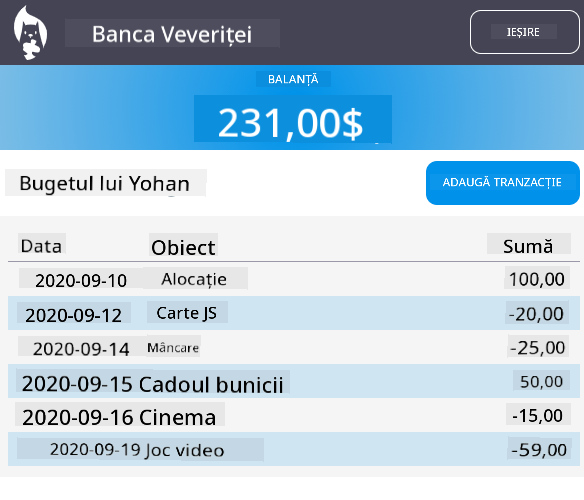

<!--
CO_OP_TRANSLATOR_METADATA:
{
  "original_hash": "f587e913e3f7c0b1c549a05dd74ee8e5",
  "translation_date": "2025-08-27T22:58:44+00:00",
  "source_file": "7-bank-project/3-data/README.md",
  "language_code": "ro"
}
-->
# Construirea unei aplicații bancare Partea 3: Metode de preluare și utilizare a datelor

## Chestionar înainte de lecție

[Chestionar înainte de lecție](https://ashy-river-0debb7803.1.azurestaticapps.net/quiz/45)

### Introducere

La baza fiecărei aplicații web se află *datele*. Datele pot lua multe forme, dar scopul lor principal este întotdeauna să afișeze informații utilizatorului. Pe măsură ce aplicațiile web devin din ce în ce mai interactive și complexe, modul în care utilizatorul accesează și interacționează cu informațiile a devenit o parte esențială a dezvoltării web.

În această lecție, vom vedea cum să preluăm date de la un server în mod asincron și să utilizăm aceste date pentru a afișa informații pe o pagină web fără a reîncărca HTML-ul.

### Cerințe preliminare

Trebuie să fi construit [Formularul de autentificare și înregistrare](../2-forms/README.md) al aplicației web pentru această lecție. De asemenea, trebuie să instalați [Node.js](https://nodejs.org) și să [rulați API-ul serverului](../api/README.md) local pentru a obține datele contului.

Puteți testa dacă serverul funcționează corect executând această comandă într-un terminal:

```sh
curl http://localhost:5000/api
# -> should return "Bank API v1.0.0" as a result
```

---

## AJAX și preluarea datelor

Site-urile web tradiționale actualizează conținutul afișat atunci când utilizatorul selectează un link sau trimite date printr-un formular, reîncărcând întreaga pagină HTML. De fiecare dată când trebuie încărcate date noi, serverul web returnează o pagină HTML complet nouă care trebuie procesată de browser, întrerupând acțiunea curentă a utilizatorului și limitând interacțiunile în timpul reîncărcării. Acest flux de lucru este cunoscut și sub denumirea de *Aplicație Multi-Pagină* sau *MPA*.


Pe măsură ce aplicațiile web au început să devină mai complexe și interactive, a apărut o tehnică nouă numită [AJAX (JavaScript și XML asincron)](https://en.wikipedia.org/wiki/Ajax_(programming)). Această tehnică permite aplicațiilor web să trimită și să preia date de la un server în mod asincron folosind JavaScript, fără a reîncărca pagina HTML, rezultând actualizări mai rapide și interacțiuni mai fluide. Când datele noi sunt primite de la server, pagina HTML curentă poate fi actualizată cu JavaScript folosind API-ul [DOM](https://developer.mozilla.org/docs/Web/API/Document_Object_Model). În timp, această abordare a evoluat în ceea ce este acum cunoscut sub numele de [*Aplicație Single-Pagină* sau *SPA*](https://en.wikipedia.org/wiki/Single-page_application).


Când AJAX a fost introdus pentru prima dată, singurul API disponibil pentru preluarea datelor în mod asincron era [`XMLHttpRequest`](https://developer.mozilla.org/docs/Web/API/XMLHttpRequest/Using_XMLHttpRequest). Dar browserele moderne implementează acum API-ul mai convenabil și mai puternic [`Fetch`](https://developer.mozilla.org/docs/Web/API/Fetch_API), care folosește promisiuni și este mai potrivit pentru manipularea datelor JSON.

> Deși toate browserele moderne acceptă API-ul `Fetch`, dacă doriți ca aplicația web să funcționeze pe browsere vechi sau de generație anterioară, este întotdeauna o idee bună să verificați [tabelul de compatibilitate pe caniuse.com](https://caniuse.com/fetch) mai întâi.

### Sarcină

În [lecția anterioară](../2-forms/README.md) am implementat formularul de înregistrare pentru a crea un cont. Acum vom adăuga cod pentru autentificarea utilizând un cont existent și preluarea datelor acestuia. Deschideți fișierul `app.js` și adăugați o nouă funcție `login`:

```js
async function login() {
  const loginForm = document.getElementById('loginForm')
  const user = loginForm.user.value;
}
```

Începem prin a prelua elementul formularului cu `getElementById()`, apoi obținem numele de utilizator din câmpul de introducere cu `loginForm.user.value`. Fiecare control de formular poate fi accesat prin numele său (setat în HTML folosind atributul `name`) ca proprietate a formularului.

În mod similar cu ceea ce am făcut pentru înregistrare, vom crea o altă funcție pentru a efectua o cerere către server, dar de această dată pentru preluarea datelor contului:

```js
async function getAccount(user) {
  try {
    const response = await fetch('//localhost:5000/api/accounts/' + encodeURIComponent(user));
    return await response.json();
  } catch (error) {
    return { error: error.message || 'Unknown error' };
  }
}
```

Folosim API-ul `fetch` pentru a solicita date în mod asincron de la server, dar de această dată nu avem nevoie de alți parametri în afară de URL-ul pe care îl apelăm, deoarece doar interogăm date. În mod implicit, `fetch` creează o cerere HTTP [`GET`](https://developer.mozilla.org/docs/Web/HTTP/Methods/GET), ceea ce ne dorim aici.

✅ `encodeURIComponent()` este o funcție care escapează caracterele speciale pentru URL. Ce probleme am putea avea dacă nu apelăm această funcție și folosim direct valoarea `user` în URL?

Acum să actualizăm funcția `login` pentru a utiliza `getAccount`:

```js
async function login() {
  const loginForm = document.getElementById('loginForm')
  const user = loginForm.user.value;
  const data = await getAccount(user);

  if (data.error) {
    return console.log('loginError', data.error);
  }

  account = data;
  navigate('/dashboard');
}
```

Mai întâi, deoarece `getAccount` este o funcție asincronă, trebuie să o potrivim cu cuvântul cheie `await` pentru a aștepta rezultatul serverului. Ca în cazul oricărei cereri către server, trebuie să gestionăm și cazurile de eroare. Deocamdată vom adăuga doar un mesaj de log pentru a afișa eroarea și vom reveni la aceasta mai târziu.

Apoi trebuie să stocăm datele undeva pentru a le putea utiliza ulterior pentru a afișa informațiile pe tabloul de bord. Deoarece variabila `account` nu există încă, vom crea o variabilă globală pentru aceasta în partea de sus a fișierului nostru:

```js
let account = null;
```

După ce datele utilizatorului sunt salvate într-o variabilă, putem naviga de la pagina *login* la *dashboard* folosind funcția `navigate()` pe care o avem deja.

În cele din urmă, trebuie să apelăm funcția `login` atunci când formularul de autentificare este trimis, modificând HTML-ul:

```html
<form id="loginForm" action="javascript:login()">
```

Testați dacă totul funcționează corect prin înregistrarea unui cont nou și încercarea de a vă autentifica utilizând același cont.

Înainte de a trece la partea următoare, putem completa funcția `register` adăugând acest cod la sfârșitul funcției:

```js
account = result;
navigate('/dashboard');
```

✅ Știați că, în mod implicit, puteți apela API-uri ale serverului doar de pe *același domeniu și port* ca pagina web pe care o vizualizați? Acesta este un mecanism de securitate impus de browsere. Dar stați, aplicația noastră web rulează pe `localhost:3000`, în timp ce API-ul serverului rulează pe `localhost:5000`, de ce funcționează? Prin utilizarea unei tehnici numite [Cross-Origin Resource Sharing (CORS)](https://developer.mozilla.org/docs/Web/HTTP/CORS), este posibil să efectuați cereri HTTP cross-origin dacă serverul adaugă anteturi speciale la răspuns, permițând excepții pentru domenii specifice.

> Aflați mai multe despre API-uri urmând această [lecție](https://docs.microsoft.com/learn/modules/use-apis-discover-museum-art/?WT.mc_id=academic-77807-sagibbon)

## Actualizarea HTML-ului pentru afișarea datelor

Acum că avem datele utilizatorului, trebuie să actualizăm HTML-ul existent pentru a le afișa. Știm deja cum să preluăm un element din DOM folosind, de exemplu, `document.getElementById()`. După ce aveți un element de bază, iată câteva API-uri pe care le puteți utiliza pentru a-l modifica sau pentru a adăuga elemente copil:

- Utilizând proprietatea [`textContent`](https://developer.mozilla.org/docs/Web/API/Node/textContent) puteți schimba textul unui element. Rețineți că schimbarea acestei valori elimină toți copiii elementului (dacă există) și îi înlocuiește cu textul furnizat. Astfel, este și o metodă eficientă de a elimina toți copiii unui element dat prin atribuirea unui șir gol `''`.

- Utilizând [`document.createElement()`](https://developer.mozilla.org/docs/Web/API/Document/createElement) împreună cu metoda [`append()`](https://developer.mozilla.org/docs/Web/API/ParentNode/append) puteți crea și atașa unul sau mai multe elemente copil noi.

✅ Utilizând proprietatea [`innerHTML`](https://developer.mozilla.org/docs/Web/API/Element/innerHTML) a unui element este posibil să schimbați conținutul HTML al acestuia, dar aceasta ar trebui evitată deoarece este vulnerabilă la atacuri de tip [cross-site scripting (XSS)](https://developer.mozilla.org/docs/Glossary/Cross-site_scripting).

### Sarcină

Înainte de a trece la ecranul tabloului de bord, mai este un lucru pe care ar trebui să-l facem pe pagina *login*. În prezent, dacă încercați să vă autentificați cu un nume de utilizator care nu există, un mesaj este afișat în consolă, dar pentru un utilizator obișnuit nimic nu se schimbă și nu știți ce se întâmplă.

Să adăugăm un element placeholder în formularul de autentificare unde putem afișa un mesaj de eroare, dacă este necesar. Un loc bun ar fi chiar înainte de butonul de autentificare `<button>`:

```html
...
<div id="loginError"></div>
<button>Login</button>
...
```

Acest element `<div>` este gol, ceea ce înseamnă că nimic nu va fi afișat pe ecran până când nu adăugăm conținut în el. De asemenea, îi atribuim un `id` pentru a-l putea prelua ușor cu JavaScript.

Reveniți la fișierul `app.js` și creați o nouă funcție helper `updateElement`:

```js
function updateElement(id, text) {
  const element = document.getElementById(id);
  element.textContent = text;
}
```

Aceasta este destul de simplă: dat fiind un *id* de element și un *text*, va actualiza conținutul text al elementului DOM care corespunde `id`-ului. Să utilizăm această metodă în locul mesajului de eroare anterior din funcția `login`:

```js
if (data.error) {
  return updateElement('loginError', data.error);
}
```

Acum, dacă încercați să vă autentificați cu un cont invalid, ar trebui să vedeți ceva de genul acesta:


Acum avem un text de eroare care apare vizual, dar dacă încercați să-l utilizați cu un cititor de ecran, veți observa că nimic nu este anunțat. Pentru ca textul adăugat dinamic pe o pagină să fie anunțat de cititoarele de ecran, va trebui să folosească ceva numit [Live Region](https://developer.mozilla.org/docs/Web/Accessibility/ARIA/ARIA_Live_Regions). Aici vom folosi un tip specific de live region numit alertă:

```html
<div id="loginError" role="alert"></div>
```

Implementați același comportament pentru erorile funcției `register` (nu uitați să actualizați HTML-ul).

## Afișarea informațiilor pe tabloul de bord

Folosind aceleași tehnici pe care tocmai le-am văzut, ne vom ocupa și de afișarea informațiilor contului pe pagina tabloului de bord.

Acesta este aspectul unui obiect cont primit de la server:

```json
{
  "user": "test",
  "currency": "$",
  "description": "Test account",
  "balance": 75,
  "transactions": [
    { "id": "1", "date": "2020-10-01", "object": "Pocket money", "amount": 50 },
    { "id": "2", "date": "2020-10-03", "object": "Book", "amount": -10 },
    { "id": "3", "date": "2020-10-04", "object": "Sandwich", "amount": -5 }
  ],
}
```

> Notă: pentru a vă ușura munca, puteți utiliza contul `test` preexistent, care este deja populat cu date.

### Sarcină

Să începem prin a înlocui secțiunea "Balance" din HTML pentru a adăuga elemente placeholder:

```html
<section>
  Balance: <span id="balance"></span><span id="currency"></span>
</section>
```

Vom adăuga și o nouă secțiune chiar dedesubt pentru a afișa descrierea contului:

```html
<h2 id="description"></h2>
```

✅ Deoarece descrierea contului funcționează ca un titlu pentru conținutul de dedesubt, este marcată semantic ca un heading. Aflați mai multe despre cum [structura heading-urilor](https://www.nomensa.com/blog/2017/how-structure-headings-web-accessibility) este importantă pentru accesibilitate și analizați critic pagina pentru a determina ce altceva ar putea fi un heading.

Apoi, vom crea o nouă funcție în `app.js` pentru a completa placeholder-ul:

```js
function updateDashboard() {
  if (!account) {
    return navigate('/login');
  }

  updateElement('description', account.description);
  updateElement('balance', account.balance.toFixed(2));
  updateElement('currency', account.currency);
}
```

Mai întâi, verificăm că avem datele contului necesare înainte de a merge mai departe. Apoi folosim funcția `updateElement()` pe care am creat-o anterior pentru a actualiza HTML-ul.

> Pentru a face afișarea soldului mai atractivă, folosim metoda [`toFixed(2)`](https://developer.mozilla.org/docs/Web/JavaScript/Reference/Global_Objects/Number/toFixed) pentru a forța afișarea valorii cu 2 cifre după punctul zecimal.

Acum trebuie să apelăm funcția `updateDashboard()` de fiecare dată când tabloul de bord este încărcat. Dacă ați terminat deja [tema lecției 1](../1-template-route/assignment.md), acest lucru ar trebui să fie simplu, altfel puteți utiliza următoarea implementare.

Adăugați acest cod la sfârșitul funcției `updateRoute()`:

```js
if (typeof route.init === 'function') {
  route.init();
}
```

Și actualizați definiția rutelor cu:

```js
const routes = {
  '/login': { templateId: 'login' },
  '/dashboard': { templateId: 'dashboard', init: updateDashboard }
};
```

Cu această modificare, de fiecare dată când pagina tabloului de bord este afișată, funcția `updateDashboard()` este apelată. După autentificare, ar trebui să puteți vedea soldul contului, moneda și descrierea.

## Crearea rândurilor tabelului dinamic cu șabloane HTML

În [prima lecție](../1-template-route/README.md) am folosit șabloane HTML împreună cu metoda [`appendChild()`](https://developer.mozilla.org/docs/Web/API/Node/appendChild) pentru a implementa navigarea în aplicația noastră. Șabloanele pot fi și mai mici și utilizate pentru a popula dinamic părți repetitive ale unei pagini.

Vom folosi o abordare similară pentru a afișa lista tranzacțiilor în tabelul HTML.

### Sarcină

Adăugați un nou șablon în `<body>`-ul HTML:

```html
<template id="transaction">
  <tr>
    <td></td>
    <td></td>
    <td></td>
  </tr>
</template>
```

Acest șablon reprezintă un singur rând de tabel, cu cele 3 coloane pe care dorim să le populăm: *data*, *obiectul* și *suma* unei tranzacții.

Apoi, adăugați această proprietate `id` la elementul `<tbody>` al tabelului din șablonul tabloului de bord pentru a-l găsi mai ușor folosind JavaScript:

```html
<tbody id="transactions"></tbody>
```

HTML-ul nostru este gata, să trecem la codul JavaScript și să creăm o nouă funcție `createTransactionRow`:

```js
function createTransactionRow(transaction) {
  const template = document.getElementById('transaction');
  const transactionRow = template.content.cloneNode(true);
  const tr = transactionRow.querySelector('tr');
  tr.children[0].textContent = transaction.date;
  tr.children[1].textContent = transaction.object;
  tr.children[2].textContent = transaction.amount.toFixed(2);
  return transactionRow;
}
```

Această funcție face exact ceea ce sugerează numele său: folosind șablonul pe care l-am creat mai devreme, creează un nou rând de tabel și completează conținutul acestuia folosind datele tranzacției. Vom folosi aceasta în funcția `updateDashboard()` pentru a popula tabelul:

```js
const transactionsRows = document.createDocumentFragment();
for (const transaction of account.transactions) {
  const transactionRow = createTransactionRow(transaction);
  transactionsRows.appendChild(transactionRow);
}
updateElement('transactions', transactionsRows);
```

Aici folosim metoda [`document.createDocumentFragment()`](https://developer.mozilla.org/docs/Web/API/Document/createDocumentFragment) care creează un nou fragment DOM pe care putem lucra, înainte de a-l atașa în final tabelului HTML.

Mai este un lucru pe care trebuie să-l facem înainte ca acest cod să funcționeze, deoarece funcția noastră `updateElement()` acceptă în prezent doar conținut text. Să schimbăm puțin codul acesteia:

```js
function updateElement(id, textOrNode) {
  const element = document.getElementById(id);
  element.textContent = ''; // Removes all children
  element.append(textOrNode);
}
```

Folosim metoda [`append()`](https://developer.mozilla.org/docs/Web/API/ParentNode/append) deoarece permite atașarea fie a textului, fie a [nodurilor DOM](https://developer.mozilla.org/docs/Web/API/Node) la un element părinte, ceea ce este perfect pentru toate cazurile noastre de utilizare.
Dacă încerci să te autentifici folosind contul `test`, ar trebui să vezi acum o listă de tranzacții pe tabloul de bord 🎉.

---

## 🚀 Provocare

Lucrați împreună pentru a face pagina tabloului de bord să arate ca o aplicație bancară reală. Dacă deja ați stilizat aplicația, încercați să folosiți [media queries](https://developer.mozilla.org/docs/Web/CSS/Media_Queries) pentru a crea un [design responsiv](https://developer.mozilla.org/docs/Web/Progressive_web_apps/Responsive/responsive_design_building_blocks) care funcționează bine atât pe dispozitive desktop, cât și pe cele mobile.

Iată un exemplu de pagină de tabloul de bord stilizată:



## Quiz de după lecție

[Quiz de după lecție](https://ashy-river-0debb7803.1.azurestaticapps.net/quiz/46)

## Temă

[Refactorizați și comentați codul](assignment.md)

---

**Declinare de responsabilitate**:  
Acest document a fost tradus folosind serviciul de traducere AI [Co-op Translator](https://github.com/Azure/co-op-translator). Deși ne străduim să asigurăm acuratețea, vă rugăm să fiți conștienți că traducerile automate pot conține erori sau inexactități. Documentul original în limba sa natală ar trebui considerat sursa autoritară. Pentru informații critice, se recomandă traducerea profesională realizată de un specialist uman. Nu ne asumăm responsabilitatea pentru eventualele neînțelegeri sau interpretări greșite care pot apărea din utilizarea acestei traduceri.