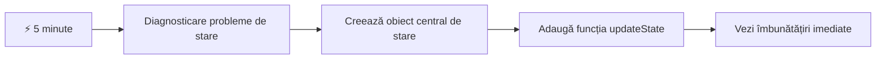
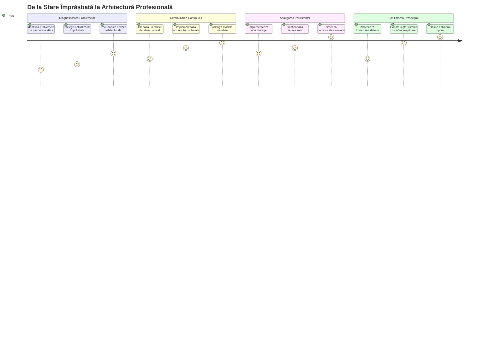
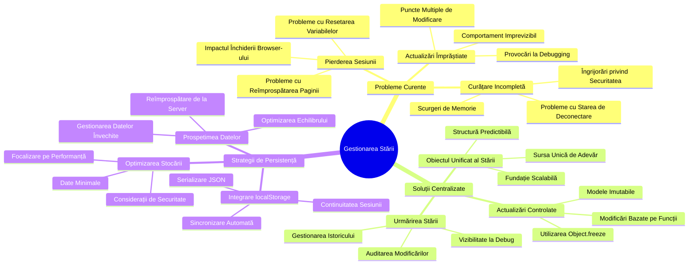
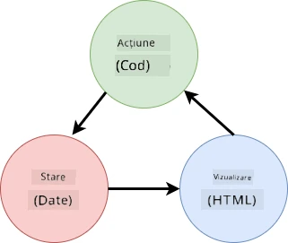
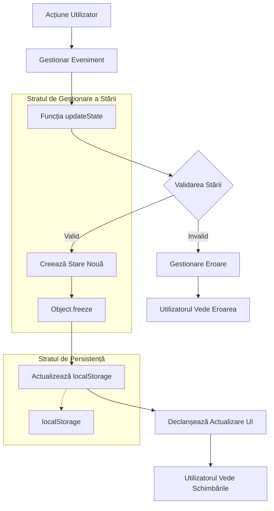
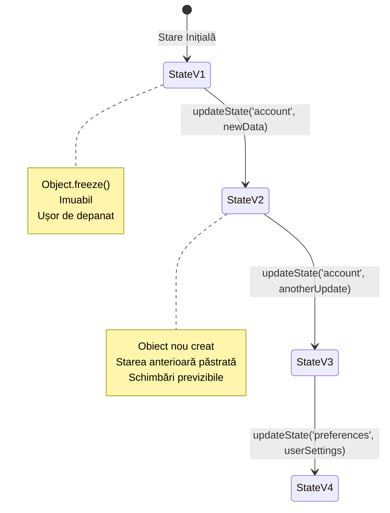
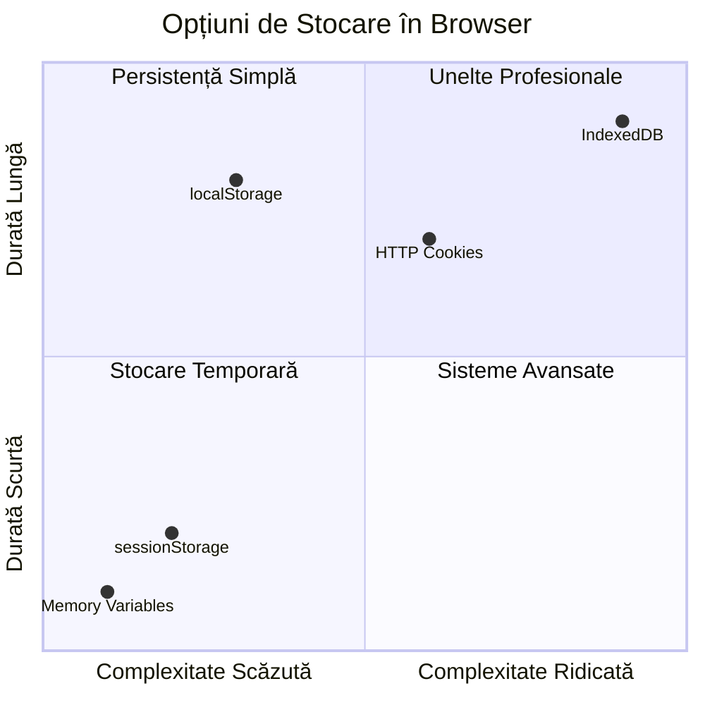
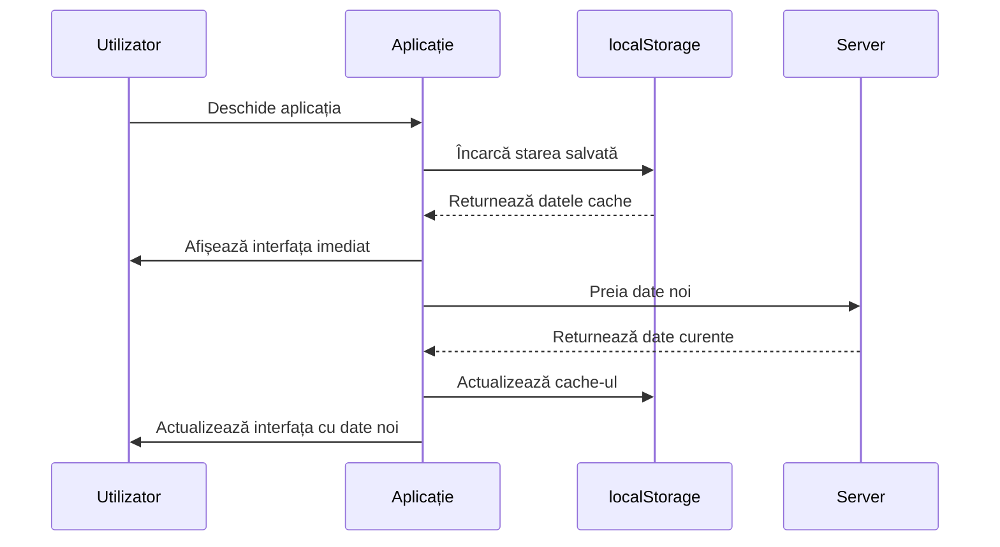
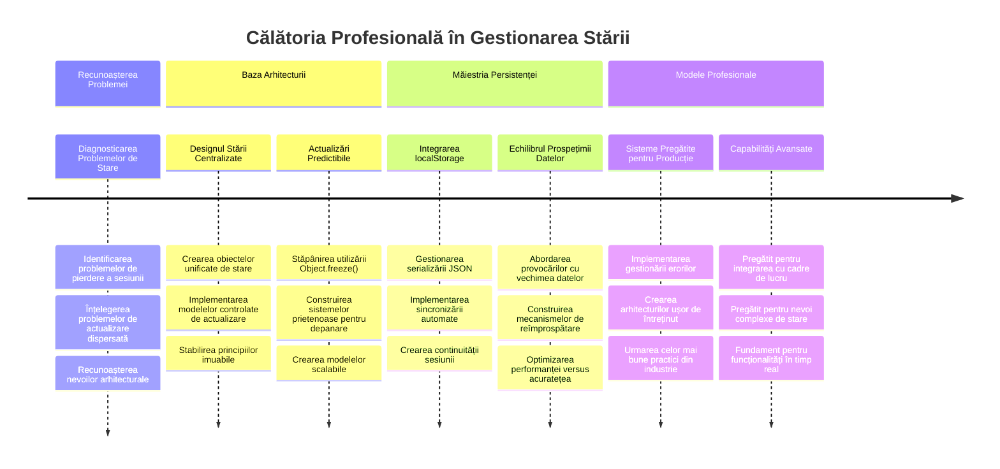
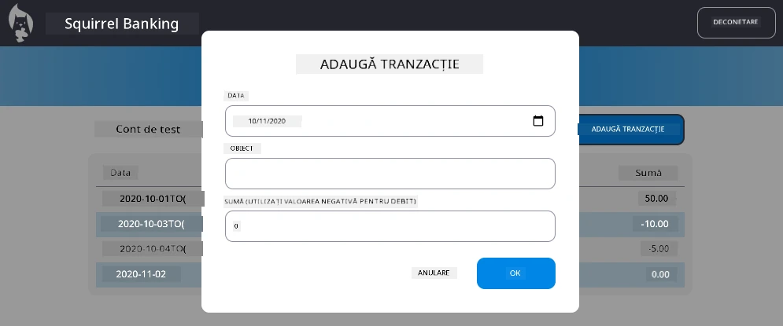

<!--
CO_OP_TRANSLATOR_METADATA:
{
  "original_hash": "b807b09df716dc48a2b750835bf8e933",
  "translation_date": "2026-01-07T06:04:49+00:00",
  "source_file": "7-bank-project/4-state-management/README.md",
  "language_code": "ro"
}
-->
# Construiește o Aplicație Bancară Partea 4: Concepte de Gestionare a Stării

## ⚡ Ce Poți Face în Următoarele 5 Minute

**Cale rapidă de început pentru dezvoltatori ocupați**


- **Minutul 1**: Testează problema actuală cu starea - autentifică-te, reîmprospătează pagina, observă deconectarea
- **Minutul 2**: Înlocuiește `let account = null` cu `let state = { account: null }`
- **Minutul 3**: Creează o funcție simplă `updateState()` pentru actualizări controlate
- **Minutul 4**: Actualizează o funcție să folosească noul model
- **Minutul 5**: Testează predictibilitatea și capacitatea de depanare îmbunătățite

**Test de diagnostic rapid**:
```javascript
// Înainte: Stare dispersată
let account = null; // Pierdut la reîmprospătare!

// După: Stare centralizată
let state = Object.freeze({ account: null }); // Controlată și urmăribilă!
```

**De ce contează asta**: În 5 minute, vei experimenta transformarea de la o gestionare haotică a stării la modele predictibile și ușor de depanat. Aceasta este fundația care face aplicațiile complexe ușor de întreținut.

## 🗺️ Călătoria ta de învățare prin măiestria gestionării stării


**Destinația călătoriei tale**: Până la finalul acestei lecții, vei fi construit un sistem profesional de gestionare a stării care se ocupă de persistență, actualitatea datelor și actualizări previzibile - aceleași modele folosite în aplicațiile de producție.

## Quiz Pre-Lecție

[Quiz pre-lectură](https://ff-quizzes.netlify.app/web/quiz/47)

## Introducere

Gestionarea stării este ca sistemul de navigație de pe nava Voyager – când totul funcționează bine, abia o observi. Dar când ceva nu merge, devine diferența între a ajunge în spațiul interstelar și a pluti pierdut în vidul cosmic. În dezvoltarea web, starea reprezintă tot ceea ce aplicația ta trebuie să-și amintească: statusul autentificării utilizatorului, datele din formulare, istoricul navigării și stările temporare ale interfeței.

Pe măsură ce aplicația ta bancară a evoluat de la un formular simplu de autentificare la o aplicație mai sofisticată, probabil ai întâmpinat câteva provocări comune. Reîmprospătează pagina și utilizatorii sunt deconectați neașteptat. Închide browserul și tot progresul dispare. Depanezi o problemă și cauți prin mai multe funcții care toate modifică aceleași date în moduri diferite.

Acestea nu sunt semne de cod prost – sunt durerile naturale de creștere care apar când aplicațiile ating un anumit nivel de complexitate. Fiecare dezvoltator se confruntă cu aceste provocări pe măsură ce aplicațiile lor trec de la „prototip” la „pregătit pentru producție”.

În această lecție, vom implementa un sistem centralizat de gestionare a stării care transformă aplicația ta bancară într-una fiabilă, profesională. Vei învăța să gestionezi fluxurile de date în mod predictibil, să persiști sesiunile utilizatorilor corespunzător și să creezi o experiență lină pentru utilizator, așa cum cer aplicațiile moderne web.

## Precondiții

Înainte să te adâncești în conceptele gestionării stării, trebuie să ai mediul de dezvoltare configurat corect și fundamentul aplicației bancare în loc. Această lecție se bazează direct pe conceptele și codul din părțile anterioare ale acestui serial.

Asigură-te că ai următoarele componente pregătite înainte de a continua:

**Configurare necesară:**
- Finalizează [lecția despre extragerea datelor](../3-data/README.md) - aplicația ta trebuie să încarce și să afișeze cu succes datele contului
- Instalează [Node.js](https://nodejs.org) pe sistemul tău pentru a rula backend-ul API
- Pornește [serverul API](../api/README.md) local pentru a gestiona operațiunile cu datele contului

**Testarea mediului tău:**

Verifică dacă serverul API este funcțional executând această comandă într-un terminal:

```sh
curl http://localhost:5000/api
# -> ar trebui să returneze "Bank API v1.0.0" ca rezultat
```

**Ce face această comandă:**
- **Trimite** o cerere GET către serverul tău API local
- **Testează** conexiunea și verifică dacă serverul răspunde
- **Returnează** informații despre versiunea API dacă totul funcționează corect

## 🧠 Prezentare generală a arhitecturii gestiunii stării


**Principiul de bază**: Gestionarea profesională a stării echilibrează predictibilitatea, persistența și performanța pentru a crea experiențe fiabile pentru utilizatori care pot scala de la interacțiuni simple la fluxuri complexe de lucru ale aplicațiilor.

---

## Diagnosticarea problemelor actuale cu starea

Ca Sherlock Holmes examinând o scenă de crimă, trebuie să înțelegem exact ce se întâmplă în implementarea noastră actuală înainte să putem rezolva misterul sesiunilor utilizatorilor care dispar.

Să facem un experiment simplu care dezvăluie provocările fundamentale ale gestionării stării:

**🧪 Încearcă acest test de diagnostic:**
1. Autentifică-te în aplicația bancară și navighează către tabloul de bord
2. Reîmprospătează pagina browserului
3. Observă ce se întâmplă cu statusul tău de autentificare

Dacă ești redirecționat înapoi la ecranul de autentificare, ai descoperit problema clasică a persistenței stării. Acest comportament apare deoarece implementarea noastră actuală stochează datele utilizatorului în variabile JavaScript care se resetează la fiecare încărcare de pagină.

**Problemele implementării curente:**

Variabila simplă `account` din lecția noastră [anterioră](../3-data/README.md) creează trei probleme semnificative, care afectează atât experiența utilizatorului cât și mentenabilitatea codului:

| Problemă | Cauză Tehnică | Impact asupra Utilizatorului |
|---------|--------|----------------|
| **Pierderea sesiunii** | Reîmprospătarea paginii șterge variabilele JavaScript | Utilizatorii trebuie să se autentifice frecvent |
| **Actualizări împrăștiate** | Mai multe funcții modifică starea direct | Debuggingul devine din ce în ce mai dificil |
| **Curățare incompletă** | Deconectarea nu șterge toate referințele din stare | Riscuri potențiale de securitate și confidențialitate |

**Provocarea arhitecturală:**

Ca designul compartimentalizat al Titanicului care părea robust până când mai multe compartimente s-au inundat simultan, rezolvarea acestor probleme individual nu va aborda problema arhitecturală de bază. Avem nevoie de o soluție cuprinzătoare de gestionare a stării.

> 💡 **Ce încercăm cu adevărat să realizăm aici?**

[Gestionarea stării](https://en.wikipedia.org/wiki/State_management) este de fapt rezolvarea a două enigme fundamentale:

1. **Unde sunt datele mele?**: Urmărirea ce informații avem și de unde provin
2. **Sunt toți pe aceeași pagină?**: Asigurarea că utilizatorii văd ceea ce se întâmplă cu adevărat

**Planul nostru de acțiune:**

În loc să ne învârtim în cerc, vom crea un sistem **centralizat de gestionare a stării**. Gândește-te la asta ca la o persoană foarte organizată care răspunde de toate lucrurile importante:




**Înțelegerea acestui flux de date:**
- **Centralizează** toată starea aplicației într-un singur loc
- **Dirijează** toate schimbările de stare prin funcții controlate
- **Asigură** că UI rămâne sincronizat cu starea curentă
- **Oferă** un tipar clar și predictibil pentru gestionarea datelor

> 💡 **Insight profesional**: Această lecție este concentrată pe conceptele fundamentale. Pentru aplicații complexe, biblioteci precum [Redux](https://redux.js.org) oferă funcții de gestionare a stării mai avansate. Înțelegerea acestor principii de bază te va ajuta să stăpânești orice bibliotecă de gestionare a stării.

> ⚠️ **Subiect avansat**: Nu vom acoperi actualizările automate ale UI cauzate de schimbările în stare, deoarece implică concepte de [Programare Reactivă](https://en.wikipedia.org/wiki/Reactive_programming). Consideră asta următorul pas excelent în călătoria ta de învățare!

### Sarcina: Centralizarea Structurii Stării

Să începem transformarea gestionării noastre dispersate a stării într-un sistem centralizat. Acest prim pas stabilește baza pentru toate îmbunătățirile care urmează.

**Pasul 1: Creează un obiect central de stare**

Înlocuiește declarația simplă `account`:

```js
let account = null;
```

Cu un obiect structurat de stare:

```js
let state = {
  account: null
};
```

**De ce contează această schimbare:**
- **Centralizează** toate datele aplicației într-un singur loc
- **Pregătește** structura pentru adăugarea mai multor proprietăți ale stării ulterior
- **Creează** o graniță clară între stare și alte variabile
- **Stabilește** un model care poate scala pe măsură ce aplicația ta crește

**Pasul 2: Actualizează modelele de acces la stare**

Actualizează funcțiile pentru a folosi noua structură de stare:

**În funcțiile `register()` și `login()`**, înlocuiește:
```js
account = ...
```

Cu:
```js
state.account = ...
```

**În funcția `updateDashboard()`**, adaugă această linie în partea de sus:
```js
const account = state.account;
```

**Ce realizează aceste actualizări:**
- **Menține** funcționalitatea existentă, în timp ce îmbunătățește structura
- **Pregătește** codul pentru o gestiune a stării mai sofisticată
- **Creează** modele consistente pentru accesarea datelor din stare
- **Stabilește** fundația pentru actualizări centralizate ale stării

> 💡 **Notă**: Această refactorizare nu rezolvă imediat problemele, dar creează fundația esențială pentru îmbunătățirile puternice ce vor urma!

### 🎯 Verificare pedagogică: Principiile centralizării

**Pauză și reflecție**: Tocmai ai implementat baza gestionării centralizate a stării. Aceasta este o decizie arhitecturală crucială.

**Autoevaluare rapidă**:
- Poți explica de ce centralizarea stării într-un singur obiect este mai bună decât variabilele împrăștiate?
- Ce s-ar întâmpla dacă ai uita să actualizezi o funcție să folosească `state.account`?
- Cum pregătește acest model codul pentru funcționalități mai avansate?

**Conexiune cu lumea reală**: Pattern-ul de centralizare învățat este fundația framework-urilor moderne ca Redux, Vuex și React Context. Construiești aceeași gândire arhitecturală folosită în aplicațiile majore.

**Întrebare provocatoare**: Dacă ar trebui să adaugi preferințe ale utilizatorului (temă, limbă) în aplicația ta, unde le-ai adăuga în structura stării? Cum ar escala acesta?

## Implementarea Actualizărilor Controlate ale Stării

Odată ce starea noastră este centralizată, următorul pas este să stabilim mecanisme controlate pentru modificarea datelor. Această abordare asigură schimbări de stare previzibile și depanare mai ușoară.

Principiul de bază seamănă cu controlul traficului aerian: în loc să permitem ca mai multe funcții să modifice starea independent, vom canaliza toate schimbările printr-o singură funcție controlată. Acest model oferă o supraveghere clară a momentului și modului în care apar modificările.

**Gestionarea stării imutabile:**

Vom trata obiectul nostru `state` ca pe unul [*imutabil*](https://en.wikipedia.org/wiki/Immutable_object), adică nu-l modificăm direct niciodată. În schimb, fiecare schimbare creează un nou obiect de stare cu datele actualizate.

Deși această abordare poate părea inițial ineficientă comparativ cu modificările directe, oferă avantaje semnificative pentru depanare, testare și menținerea predictibilității aplicației.

**Beneficiile gestionării imuabile a stării:**

| Beneficiu | Descriere | Impact |
|---------|-------------|--------|
| **Predictibilitate** | Schimbările apar doar prin funcții controlate | Mai ușor de depanat și testat |
| **Urmărirea istoricului** | Fiecare schimbare creează un obiect nou | Permite funcționalități undo/redo |
| **Prevenirea efectelor secundare** | Nici o modificare accidentală | Previne erori misterioase |
| **Optimizarea performanței** | Ușor de detectat când starea s-a schimbat realmente | Permite actualizări eficiente ale UI |

**Imutabilitatea în JavaScript cu `Object.freeze()`:**

JavaScript oferă [`Object.freeze()`](https://developer.mozilla.org/docs/Web/JavaScript/Reference/Global_Objects/Object/freeze) pentru a preveni modificările obiectelor:

```js
const immutableState = Object.freeze({ account: userData });
// Orice încercare de a modifica immutableState va genera o eroare
```

**Ce se întâmplă aici:**
- **Previne** atribuiri sau ștergeri directe de proprietăți
- **Aruncă** excepții dacă se încearcă modificări
- **Asigură** că schimbările stării trebuie să treacă prin funcții controlate
- **Creează** un contract clar despre cum poate fi actualizată starea

> 💡 **Explorați în profunzime**: Află diferența dintre obiectele imuabile *superficial* și cele *profund* în documentația [MDN](https://developer.mozilla.org/docs/Web/JavaScript/Reference/Global_Objects/Object/freeze#What_is_shallow_freeze). Înțelegerea acestei distincții este crucială pentru structuri complexe de stare.


### Sarcina

Să creăm o nouă funcție `updateState()`:

```js
function updateState(property, newData) {
  state = Object.freeze({
    ...state,
    [property]: newData
  });
}
```

În această funcție, creăm un nou obiect de stare și copiem datele din starea precedentă folosind [operatorul *spread (`...`)*](https://developer.mozilla.org/docs/Web/JavaScript/Reference/Operators/Spread_syntax#Spread_in_object_literals). Apoi suprascriem o proprietate anume a obiectului de stare cu noile date folosind notația cu [paranteze pătrate](https://developer.mozilla.org/docs/Web/JavaScript/Guide/Working_with_Objects#Objects_and_properties) `[property]` pentru atribuire. În final, blocăm obiectul pentru a preveni modificările folosind `Object.freeze()`. Deocamdată în stare avem doar proprietatea `account`, dar cu această abordare poți adăuga câte proprietăți dorești.

De asemenea, vom actualiza inițializarea stării pentru a ne asigura că starea inițială este și ea blocată:

```js
let state = Object.freeze({
  account: null
});
```

După aceea, actualizează funcția `register` înlocuind atribuirile `state.account = result;` cu:

```js
updateState('account', result);
```

Fă același lucru cu funcția `login`, înlocuind `state.account = data;` cu:

```js
updateState('account', data);
```

Acum vom profita de ocazie pentru a rezolva problema faptului că datele contului nu se șterg când utilizatorul face clic pe *Logout*.

Creează o nouă funcție `logout()`:

```js
function logout() {
  updateState('account', null);
  navigate('/login');
}
```

În `updateDashboard()`, înlocuiește redirecționarea `return navigate('/login');` cu `return logout()`;

Încearcă să înregistrezi un cont nou, să te deconectezi și să te autentifici din nou pentru a verifica că totul funcționează corect.

> Sfat: poți vedea toate schimbările de stare adăugând `console.log(state)` la finalul funcției `updateState()` și deschizând consola în uneltelor de dezvoltare ale browserului.

## Implementarea persistentei datelor

Problema pierderii sesiunii pe care am identificat-o anterior necesită o soluție de persistență care menține starea utilizatorului între sesiunile browserului. Aceasta transformă aplicația noastră dintr-o experiență temporară într-un instrument fiabil și profesional.

Gândește-te cum ceasurile atomice mențin timpul precis chiar și în timpul unor pene de curent prin stocarea stării critice în memorie non-volatile. În mod similar, aplicațiile web au nevoie de mecanisme de stocare persistentă pentru a păstra datele esențiale ale utilizatorului între sesiunile browserului și reîmprospătări de pagină.

**Întrebări strategice pentru persistența datelor:**

Înainte de a implementa persistența, ia în considerare acești factori critici:

| Întrebare | Contextul aplicației bancare | Impactul deciziei |
|----------|-------------------|----------------|
| **Datele sunt sensibile?** | Sold cont, istoricul tranzacțiilor | Alege metode sigure de stocare |
| **Cât timp ar trebui să persiste?** | Starea de autentificare vs. preferințe UI temporare | Selectați durata de stocare potrivită |
| **Serverul are nevoie de asta?** | Token-uri de autentificare vs. setări UI | Determinați cerințele de partajare |

**Opțiuni de stocare în browser:**

Browserele moderne oferă mai multe mecanisme de stocare, fiecare conceput pentru cazuri de utilizare diferite:

**API-uri principale de stocare:**

1. **[`localStorage`](https://developer.mozilla.org/docs/Web/API/Window/localStorage)**: Stocare persistentă [cheie/valoare](https://en.wikipedia.org/wiki/Key%E2%80%93value_database)
   - **Persistă** datele între sesiunile browserului pe termen nelimitat  
   - **Supraviețuiește** repornirilor browserului și calculatorului
   - **Este limitat** la domeniul specific al site-ului web
   - **Perfect** pentru preferințele utilizatorilor și stările de autentificare

2. **[`sessionStorage`](https://developer.mozilla.org/docs/Web/API/Window/sessionStorage)**: Stocare temporară în sesiune
   - **Funcționează** identic cu localStorage în timpul sesiunilor active
   - **Se golește** automat când se închide fila browserului
   - **Ideal** pentru date temporare care nu trebuie să persiste

3. **[Cookie-uri HTTP](https://developer.mozilla.org/docs/Web/HTTP/Cookies)**: Stocare partajată pe server
   - **Sunt trimise automat** cu fiecare cerere către server
   - **Perfecte** pentru token-uri de [autentificare](https://en.wikipedia.org/wiki/Authentication)
   - **Au dimensiuni limitate** și pot afecta performanța

**Cerere de serializare a datelor:**

Atât `localStorage`, cât și `sessionStorage` stochează numai [șiruri de caractere](https://developer.mozilla.org/docs/Web/JavaScript/Reference/Global_Objects/String):

```js
// Conversia obiectelor în șiruri JSON pentru stocare
const accountData = { user: 'john', balance: 150 };
localStorage.setItem('account', JSON.stringify(accountData));

// Analizează șirurile JSON înapoi în obiecte la preluare
const savedAccount = JSON.parse(localStorage.getItem('account'));
```

**Înțelegerea serializării:**
- **Convertește** obiectele JavaScript în șiruri JSON folosind [`JSON.stringify()`](https://developer.mozilla.org/docs/Web/JavaScript/Reference/Global_Objects/JSON/stringify)
- **Reconstruiește** obiectele din JSON folosind [`JSON.parse()`](https://developer.mozilla.org/docs/Web/JavaScript/Reference/Global_Objects/JSON/parse)
- **Gestionează** automat obiecte și array-uri complexe și imbricate
- **Eșuează** pentru funcții, valori nedefinite și referințe circulare

> 💡 **Opțiune avansată**: Pentru aplicații offline complexe cu seturi mari de date, luați în considerare API-ul [`IndexedDB`](https://developer.mozilla.org/docs/Web/API/IndexedDB_API). Acesta oferă o bază de date completă pe client, dar necesită o implementare mai complexă.


### Sarcină: Implementați persistența localStorage

Să implementăm stocarea persistentă astfel încât utilizatorii să rămână conectați până se deconectează explicit. Vom folosi `localStorage` pentru a stoca datele contului pe parcursul sesiunilor browserului.

**Pasul 1: Definiți configurația de stocare**

```js
const storageKey = 'savedAccount';
```

**Ce oferă această constantă:**
- **Creează** un identificator consistent pentru datele stocate
- **Previne** greșelile de scriere în referințele la cheia de stocare
- **Facilitează** modificarea cheii de stocare la nevoie
- **Urmărește** cele mai bune practici pentru cod ușor de întreținut

**Pasul 2: Adăugați persistența automată**

Adăugați această linie la finalul funcției `updateState()`:

```js
localStorage.setItem(storageKey, JSON.stringify(state.account));
```

**Ce se întâmplă aici:**
- **Convertește** obiectul contului într-un șir JSON pentru stocare
- **Salvează** datele folosind cheia noastră consistentă de stocare
- **Se execută** automat de fiecare dată când apar modificări de stare
- **Asigură** că datele stocate sunt întotdeauna sincronizate cu starea curentă

> 💡 **Beneficiu arhitectural**: Deoarece am centralizat toate actualizările de stare prin `updateState()`, adăugarea persistenței a necesitat doar o linie de cod. Acesta este un exemplu al puterii deciziilor arhitecturale bune!

**Pasul 3: Restaurarea stării la încărcarea aplicației**

Creați o funcție de inițializare pentru a restaura datele salvate:

```js
function init() {
  const savedAccount = localStorage.getItem(storageKey);
  if (savedAccount) {
    updateState('account', JSON.parse(savedAccount));
  }

  // Codul nostru anterior de inițializare
  window.onpopstate = () => updateRoute();
  updateRoute();
}

init();
```

**Înțelegerea procesului de inițializare:**
- **Recuperează** orice date salvate anterior despre cont din localStorage
- **Parsează** șirul JSON înapoi într-un obiect JavaScript
- **Actualizează** starea folosind funcția noastră de actualizare controlată
- **Restaurează** automat sesiunea utilizatorului la încărcarea paginii
- **Se execută** înainte de actualizările rutei pentru a asigura disponibilitatea stării

**Pasul 4: Optimizarea rutei implicite**

Actualizați ruta implicită pentru a profita de persistență:

În `updateRoute()`, înlocuiți:
```js
// Înlocuiește: return navigate('/login');
return navigate('/dashboard');
```

**De ce acest schimb este potrivit:**
- **Valorifică** noul nostru sistem de persistență eficient
- **Permite** panoului de control să gestioneze verificările de autentificare
- **Redirecționează** automat către autentificare dacă nu există sesiune salvată
- **Creează** o experiență utilizator mai fluidă

**Testarea implementării:**

1. Autentificați-vă în aplicația bancară
2. Reîncărcați pagina browserului
3. Verificați că rămâneți autentificat și pe dashboard
4. Închideți și redeschideți browserul
5. Navigați înapoi la aplicație și confirmați că sunteți încă autentificat

🎉 **Realizare de succes**: Ați implementat cu succes managementul stării persistente! Aplicația dvs. se comportă acum ca o aplicație web profesională.

### 🎯 Verificare pedagogică: Arhitectura persistenței

**Înțelegerea arhitecturii**: Ați implementat un strat sofisticat de persistență care echilibrează experiența utilizatorului cu complexitatea gestionării datelor.

**Concepte-cheie stăpânite**:
- **Serializare JSON**: conversia obiectelor complexe în șiruri stocabile
- **Sincronizare automată**: modificările stării declanșează salvarea persistentă
- **Recuperarea sesiunii**: aplicațiile pot restaura contextul utilizatorului după întreruperi
- **Persistență centralizată**: o singură funcție de actualizare se ocupă de toată stocarea

**Legătura cu industrie**: Acest pattern de persistență este fundamental pentru Progressive Web Apps (PWA), aplicații offline-first și experiențe web mobile moderne. Construirea capabilităților la nivel de producție este asigurată.

**Întrebare de reflecție**: Cum ați modifica acest sistem pentru a gestiona mai multe conturi de utilizatori pe același dispozitiv? Luați în considerare implicațiile pentru confidențialitate și securitate.

## Echilibrarea persistenței cu prospețimea datelor

Sistemul nostru de persistență menține cu succes sesiunile utilizatorilor, dar introduce o nouă provocare: învechirea datelor. Când mai mulți utilizatori sau aplicații modifică aceleași date pe server, informațiile memorate în cache local devin depășite.

Această situație este asemănătoare cu navigatorii vikingi care se bazau atât pe hărți stelare memorate, cât și pe observații cerești actuale. Hărțile ofereau consistență, dar navigatorii aveau nevoie de observații proaspete pentru a ține cont de condițiile schimbătoare. Similar, aplicația noastră are nevoie atât de starea utilizatorului persistentă, cât și de date server actualizate.

**🧪 Descoperirea problemei învechirii datelor:**

1. Autentificați-vă în dashboard cu contul `test`
2. Rulați această comandă în terminal pentru a simula o tranzacție dintr-o altă sursă:

```sh
curl --request POST \
     --header "Content-Type: application/json" \
     --data "{ \"date\": \"2020-07-24\", \"object\": \"Bought book\", \"amount\": -20 }" \
     http://localhost:5000/api/accounts/test/transactions
```

3. Reîncărcați pagina dashboard în browser
4. Observați dacă vedeți tranzacția nouă

**Ce demonstrează acest test:**
- **Arată** cum stocarea locală poate deveni „învechită” (depășită)
- **Simulează** scenarii reale unde datele se schimbă în afara aplicației
- **Relevă** tensiunea dintre persistență și prospețimea datelor

**Provocarea datelor învechite:**

| Problemă | Cauză | Impact asupra utilizatorului |
|---------|-------|-----------------------------|
| **Date învechite** | localStorage nu expiră automat | Utilizatorii văd informații depășite |
| **Modificări pe server** | Alte aplicații/utilizatori modifică aceleași date | Vizualizări inconsistente pe platforme |
| **Cache vs. realitate** | Cache-ul local nu corespunde stării serverului | Experiență proastă și confuzie pentru utilizatori |

**Strategie de soluție:**

Vom implementa un pattern „refresh la încărcare” care echilibrează beneficiile persistenței cu nevoia de date proaspete. Această abordare menține experiența fluidă a utilizatorului, asigurând în același timp acuratețea datelor.


### Sarcină: Implementați sistemul de actualizare a datelor

Vom crea un sistem care preia automat date proaspete de pe server, menținând avantajele gestionării stării persistente.

**Pasul 1: Creați funcția de actualizare a datelor contului**

```js
async function updateAccountData() {
  const account = state.account;
  if (!account) {
    return logout();
  }

  const data = await getAccount(account.user);
  if (data.error) {
    return logout();
  }

  updateState('account', data);
}
```

**Logica acestei funcții:**
- **Verifică** dacă utilizatorul este autentificat (există state.account)
- **Redirecționează** către logout dacă nu există o sesiune validă
- **Preia** date noi despre cont de la server folosind funcția `getAccount()` existentă
- **Gestionează** cu eleganță erorile serverului prin logout pentru sesiunile invalide
- **Actualizează** starea cu date proaspete utilizând sistemul nostru controlat de update
- **Declanșează** persistența automată în localStorage prin funcția `updateState()`

**Pasul 2: Creați handlerul de actualizare a dashboardului**

```js
async function refresh() {
  await updateAccountData();
  updateDashboard();
}
```

**Ce realizează această funcție de reîmprospătare:**
- **Coordonează** procesul de actualizare a datelor și actualizarea UI
- **Așteaptă** ca datele proaspete să se încarce înainte de actualizarea vizualizării
- **Asigură** că dashboardul afișează cele mai recente informații
- **Menține** o separare clară între gestionarea datelor și actualizările UI

**Pasul 3: Integrați cu sistemul de rutare**

Actualizați configurația rutei pentru a declanșa automat reîmprospătarea:

```js
const routes = {
  '/login': { templateId: 'login' },
  '/dashboard': { templateId: 'dashboard', init: refresh }
};
```

**Cum funcționează această integrare:**
- **Execută** funcția de reîmprospătare de fiecare dată când se încarcă ruta dashboard
- **Asigură** afișarea datelor proaspete când utilizatorii navighează spre dashboard
- **Menține** structura rutelor existente adăugând prospețimea datelor
- **Oferă** un pattern consistent pentru inițializarea specifică fiecărei rute

**Testarea sistemului de actualizare a datelor:**

1. Autentificați-vă în aplicația bancară
2. Rulați comanda curl menționată anterior pentru a crea o nouă tranzacție
3. Reîncărcați pagina dashboard sau navigați în altă pagină și apoi înapoi
4. Verificați că noua tranzacție apare imediat

🎉 **Echilibrul perfect atins**: Aplicația dvs. combină acum experiența fluidă a stării persistente cu acuratețea datelor proaspete de pe server!

## 📈 Cronologia stăpânirii managementului de stare


**🎓 Milestone de absolvire**: Ați construit cu succes un sistem complet de management al stării folosind aceleași principii care alimentează Redux, Vuex și alte biblioteci profesionale de stare. Aceste pattern-uri scală de la aplicații simple la aplicații enterprise.

**🔄 Capabilități de nivel următor**:
- Pregătit să stăpâniți framework-uri de management al stării (Redux, Zustand, Pinia)
- Pregătit să implementați funcționalități în timp real cu WebSockets
- Echipat să construiți Progressive Web Apps offline-first
- Fundamente puse pentru pattern-uri avansate precum mașini de stare și observatori

## Provocarea agentului GitHub Copilot 🚀

Folosiți modul Agent pentru a finaliza următoarea provocare:

**Descriere:** Implementați un sistem cuprinzător de management al stării cu funcționalitate undo/redo pentru aplicația bancară. Această provocare vă va ajuta să exersați concepte avansate de management al stării, inclusiv urmărirea istoricului stării, actualizări imutabile și sincronizarea interfeței utilizator.

**Prompt:** Creați un sistem îmbunătățit de management al stării care să includă: 1) un array pentru istoricul stărilor care să urmărească toate stările anterioare, 2) funcții undo și redo care să revină la stări anterioare, 3) butoane UI pentru operațiunile undo/redo în dashboard, 4) o limită maximă de istoric de 10 stări pentru a preveni problemele de memorie, și 5) curățarea corespunzătoare a istoricului când utilizatorul se deconectează. Asigurați funcționarea undo/redo cu modificările soldului contului și persistența în urma reîncărcărilor browserului.

Aflați mai multe despre [modul agent](https://code.visualstudio.com/blogs/2025/02/24/introducing-copilot-agent-mode) aici.

## 🚀 Provocare: Optimizarea stocării

Implementarea dvs. gestionează acum eficient sesiunile utilizatorilor, reîmprospătarea datelor și managementul stării. Totuși, luați în considerare dacă abordarea curentă echilibrează optim eficiența stocării cu funcționalitatea.

Ca maeștrii șahului care disting între piese esențiale și pioni sacrificabili, un management eficient al stării necesită identificarea datelor care trebuie să persiste față de cele care trebuie mereu obținute proaspete de pe server.

**Analiză de optimizare:**

Evaluați implementarea actuală a localStorage și reflectați asupra acestor întrebări strategice:
- Care este informația minimă necesară pentru a menține autentificarea utilizatorului?
- Ce date se schimbă suficient de frecvent încât caching-ul local aduce puțin beneficiu?
- Cum poate optimizarea stocării să îmbunătățească performanța fără a degrada experiența utilizatorului?

Acest tip de analiză arhitecturală îi diferențiază pe dezvoltatorii experimentați care consideră atât funcționalitatea, cât și eficiența în soluțiile lor.

**Strategie de implementare:**
- **Identificați** datele esențiale care trebuie să persiste (probabil doar identificarea utilizatorului)
- **Modificați** implementarea localStorage pentru a stoca doar datele critice de sesiune
- **Asigurați** încărcarea întotdeauna a datelor proaspete de pe server la vizitele pe dashboard
- **Testați** că abordarea optimizată menține aceeași experiență a utilizatorului

**Considerații avansate:**
- **Comparați** compromisurile între stocarea datelor complete ale contului versus doar a token-urilor de autentificare
- **Documentați** deciziile și raționamentele pentru membrii echipei viitori

Această provocare vă va ajuta să gândiți ca un dezvoltator profesionist, care ia în calcul atât experiența utilizatorului, cât și eficiența aplicației. Luați-vă timpul să experimentați diferite abordări!

## Chestionar post-lectură

[Chestionar post-lectură](https://ff-quizzes.netlify.app/web/quiz/48)

## Tema

[Implementați dialogul „Adaugă tranzacție”](assignment.md)

Iată un exemplu de rezultat după finalizarea temei:



---

<!-- CO-OP TRANSLATOR DISCLAIMER START -->
**Avertisment**:  
Acest document a fost tradus folosind serviciul de traducere automată AI [Co-op Translator](https://github.com/Azure/co-op-translator). Deși ne străduim pentru acuratețe, vă rugăm să rețineți că traducerile automate pot conține erori sau inexactități. Documentul original în limba sa nativă trebuie considerat sursa autoritară. Pentru informații critice, se recomandă traducerea profesională realizată de un specialist uman. Nu ne asumăm răspunderea pentru orice neînțelegeri sau interpretări greșite rezultate din utilizarea acestei traduceri.
<!-- CO-OP TRANSLATOR DISCLAIMER END -->