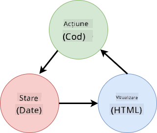

<!--
CO_OP_TRANSLATOR_METADATA:
{
  "original_hash": "b46acf79da8550d76445eed00b06c878",
  "translation_date": "2025-10-03T13:15:19+00:00",
  "source_file": "7-bank-project/4-state-management/README.md",
  "language_code": "ro"
}
-->
# Construirea unei aplicații bancare Partea 4: Concepte de gestionare a stării

## Chestionar înainte de lecție

[Chestionar înainte de lecție](https://ff-quizzes.netlify.app/web/quiz/47)

### Introducere

Pe măsură ce o aplicație web crește, devine o provocare să urmărești toate fluxurile de date. Ce cod obține datele, ce pagină le consumă, unde și când trebuie actualizate... este ușor să ajungi la un cod dezordonat, dificil de întreținut. Acest lucru este cu atât mai adevărat atunci când trebuie să partajezi date între diferite pagini ale aplicației tale, de exemplu datele utilizatorului. Conceptul de *gestionare a stării* a existat întotdeauna în toate tipurile de programe, dar pe măsură ce aplicațiile web devin din ce în ce mai complexe, acesta a devenit un punct cheie de luat în considerare în timpul dezvoltării.

În această ultimă parte, vom analiza aplicația pe care am construit-o pentru a regândi modul în care este gestionată starea, permițând suportul pentru reîmprospătarea browserului în orice moment și păstrarea datelor între sesiunile utilizatorului.

### Prerechizite

Trebuie să fi finalizat partea de [preluare a datelor](../3-data/README.md) a aplicației web pentru această lecție. De asemenea, trebuie să instalați [Node.js](https://nodejs.org) și să [rulați serverul API](../api/README.md) local pentru a putea gestiona datele contului.

Puteți testa dacă serverul funcționează corect executând această comandă într-un terminal:

```sh
curl http://localhost:5000/api
# -> should return "Bank API v1.0.0" as a result
```

---

## Regândirea gestionării stării

În [lecția anterioară](../3-data/README.md), am introdus un concept de bază al stării în aplicația noastră cu variabila globală `account`, care conține datele bancare ale utilizatorului conectat în prezent. Totuși, implementarea noastră actuală are câteva defecte. Încercați să reîmprospătați pagina când sunteți pe tabloul de bord. Ce se întâmplă?

Există 3 probleme cu codul actual:

- Starea nu este păstrată, deoarece o reîmprospătare a browserului vă duce înapoi la pagina de autentificare.
- Există mai multe funcții care modifică starea. Pe măsură ce aplicația crește, acest lucru poate face dificilă urmărirea modificărilor și este ușor să uitați să actualizați una.
- Starea nu este curățată, astfel încât atunci când faceți clic pe *Logout*, datele contului sunt încă acolo, deși sunteți pe pagina de autentificare.

Am putea actualiza codul nostru pentru a aborda aceste probleme una câte una, dar acest lucru ar crea mai multă duplicare a codului și ar face aplicația mai complexă și dificil de întreținut. Sau am putea să ne oprim câteva minute și să ne regândim strategia.

> Ce probleme încercăm cu adevărat să rezolvăm aici?

[Gestionarea stării](https://en.wikipedia.org/wiki/State_management) se referă la găsirea unei abordări bune pentru a rezolva aceste două probleme particulare:

- Cum să păstrăm fluxurile de date dintr-o aplicație ușor de înțeles?
- Cum să păstrăm datele stării mereu sincronizate cu interfața utilizatorului (și viceversa)?

Odată ce ați rezolvat aceste probleme, orice alte probleme pe care le-ați putea avea fie sunt deja rezolvate, fie au devenit mai ușor de rezolvat. Există multe abordări posibile pentru rezolvarea acestor probleme, dar vom merge cu o soluție comună care constă în **centralizarea datelor și a modurilor de a le modifica**. Fluxurile de date ar arăta astfel:



> Nu vom acoperi aici partea în care datele declanșează automat actualizarea vizualizării, deoarece este legată de concepte mai avansate de [Programare Reactivă](https://en.wikipedia.org/wiki/Reactive_programming). Este un subiect bun de aprofundare dacă sunteți interesat.

✅ Există multe biblioteci care oferă abordări diferite pentru gestionarea stării, [Redux](https://redux.js.org) fiind o opțiune populară. Aruncați o privire asupra conceptelor și modelelor utilizate, deoarece este adesea o modalitate bună de a învăța ce probleme potențiale puteți întâmpina în aplicațiile web mari și cum pot fi rezolvate.

### Sarcină

Vom începe cu puțină refactorizare. Înlocuiți declarația `account`:

```js
let account = null;
```

Cu:

```js
let state = {
  account: null
};
```

Ideea este să *centralizăm* toate datele aplicației noastre într-un singur obiect de stare. Deocamdată avem doar `account` în stare, deci nu se schimbă prea mult, dar creează o cale pentru evoluții.

De asemenea, trebuie să actualizăm funcțiile care îl folosesc. În funcțiile `register()` și `login()`, înlocuiți `account = ...` cu `state.account = ...`;

La începutul funcției `updateDashboard()`, adăugați această linie:

```js
const account = state.account;
```

Această refactorizare în sine nu a adus multe îmbunătățiri, dar ideea a fost să punem bazele pentru următoarele modificări.

## Urmărirea modificărilor datelor

Acum că am pus în aplicare obiectul `state` pentru a stoca datele noastre, următorul pas este să centralizăm actualizările. Scopul este să fie mai ușor să urmărim orice modificări și când se întâmplă.

Pentru a evita modificările făcute obiectului `state`, este de asemenea o practică bună să îl considerăm [*imobil*](https://en.wikipedia.org/wiki/Immutable_object), ceea ce înseamnă că nu poate fi modificat deloc. De asemenea, înseamnă că trebuie să creați un nou obiect de stare dacă doriți să schimbați ceva în el. Procedând astfel, construiți o protecție împotriva [efectelor secundare](https://en.wikipedia.org/wiki/Side_effect_(computer_science)) nedorite și deschideți posibilități pentru noi funcționalități în aplicația dvs., cum ar fi implementarea funcțiilor de anulare/refacere, în timp ce faceți mai ușor de depanat. De exemplu, ați putea înregistra fiecare modificare făcută stării și păstra un istoric al modificărilor pentru a înțelege sursa unei erori.

În JavaScript, puteți utiliza [`Object.freeze()`](https://developer.mozilla.org/docs/Web/JavaScript/Reference/Global_Objects/Object/freeze) pentru a crea o versiune imobilă a unui obiect. Dacă încercați să faceți modificări unui obiect imobil, va fi generată o excepție.

✅ Știți diferența dintre un obiect imobil *superficial* și unul *profund*? Puteți citi despre asta [aici](https://developer.mozilla.org/docs/Web/JavaScript/Reference/Global_Objects/Object/freeze#What_is_shallow_freeze).

### Sarcină

Să creăm o nouă funcție `updateState()`:

```js
function updateState(property, newData) {
  state = Object.freeze({
    ...state,
    [property]: newData
  });
}
```

În această funcție, creăm un nou obiect de stare și copiem datele din starea anterioară folosind [operatorul *spread (`...`)*](https://developer.mozilla.org/docs/Web/JavaScript/Reference/Operators/Spread_syntax#Spread_in_object_literals). Apoi suprascriem o anumită proprietate a obiectului de stare cu noile date folosind [notația cu paranteze](https://developer.mozilla.org/docs/Web/JavaScript/Guide/Working_with_Objects#Objects_and_properties) `[property]` pentru atribuire. În final, blocăm obiectul pentru a preveni modificările folosind `Object.freeze()`. Deocamdată avem doar proprietatea `account` stocată în stare, dar cu această abordare puteți adăuga câte proprietăți aveți nevoie în stare.

Vom actualiza și inițializarea `state` pentru a ne asigura că starea inițială este de asemenea blocată:

```js
let state = Object.freeze({
  account: null
});
```

După aceea, actualizați funcția `register` înlocuind atribuirea `state.account = result;` cu:

```js
updateState('account', result);
```

Faceți același lucru cu funcția `login`, înlocuind `state.account = data;` cu:

```js
updateState('account', data);
```

Vom profita acum de ocazie pentru a rezolva problema datelor contului care nu sunt șterse atunci când utilizatorul face clic pe *Logout*.

Creați o nouă funcție `logout()`:

```js
function logout() {
  updateState('account', null);
  navigate('/login');
}
```

În `updateDashboard()`, înlocuiți redirecționarea `return navigate('/login');` cu `return logout()`;

Încercați să înregistrați un nou cont, să vă deconectați și să vă conectați din nou pentru a verifica dacă totul funcționează corect.

> Sfat: puteți analiza toate modificările stării adăugând `console.log(state)` la sfârșitul funcției `updateState()` și deschizând consola în instrumentele de dezvoltare ale browserului.

## Păstrarea stării

Majoritatea aplicațiilor web trebuie să păstreze datele pentru a funcționa corect. Toate datele critice sunt de obicei stocate într-o bază de date și accesate printr-un API de server, cum ar fi datele contului utilizatorului în cazul nostru. Dar uneori, este de asemenea interesant să păstrăm unele date în aplicația client care rulează în browser, pentru o experiență mai bună a utilizatorului sau pentru a îmbunătăți performanța la încărcare.

Când doriți să păstrați datele în browser, există câteva întrebări importante pe care ar trebui să vi le puneți:

- *Sunt datele sensibile?* Ar trebui să evitați stocarea oricăror date sensibile pe client, cum ar fi parolele utilizatorului.
- *Pentru cât timp aveți nevoie să păstrați aceste date?* Plănuiți să accesați aceste date doar pentru sesiunea curentă sau doriți să fie stocate permanent?

Există mai multe modalități de a stoca informații într-o aplicație web, în funcție de ceea ce doriți să realizați. De exemplu, puteți utiliza URL-urile pentru a stoca o interogare de căutare și a o face partajabilă între utilizatori. De asemenea, puteți utiliza [cookie-uri HTTP](https://developer.mozilla.org/docs/Web/HTTP/Cookies) dacă datele trebuie să fie partajate cu serverul, cum ar fi informațiile de [autentificare](https://en.wikipedia.org/wiki/Authentication).

O altă opțiune este să utilizați una dintre numeroasele API-uri ale browserului pentru stocarea datelor. Două dintre ele sunt deosebit de interesante:

- [`localStorage`](https://developer.mozilla.org/docs/Web/API/Window/localStorage): un [Key/Value store](https://en.wikipedia.org/wiki/Key%E2%80%93value_database) care permite păstrarea datelor specifice site-ului web curent între diferite sesiuni. Datele salvate în acesta nu expiră niciodată.
- [`sessionStorage`](https://developer.mozilla.org/docs/Web/API/Window/sessionStorage): acesta funcționează la fel ca `localStorage`, cu excepția faptului că datele stocate în acesta sunt șterse când sesiunea se termină (când browserul este închis).

Rețineți că ambele API-uri permit doar stocarea [șirurilor de caractere](https://developer.mozilla.org/docs/Web/JavaScript/Reference/Global_Objects/String). Dacă doriți să stocați obiecte complexe, va trebui să le serializați în formatul [JSON](https://developer.mozilla.org/docs/Web/JavaScript/Reference/Global_Objects/JSON) folosind [`JSON.stringify()`](https://developer.mozilla.org/docs/Web/JavaScript/Reference/Global_Objects/JSON/stringify).

✅ Dacă doriți să creați o aplicație web care nu funcționează cu un server, este de asemenea posibil să creați o bază de date pe client folosind API-ul [`IndexedDB`](https://developer.mozilla.org/docs/Web/API/IndexedDB_API). Acesta este rezervat pentru cazuri de utilizare avansate sau dacă aveți nevoie să stocați o cantitate semnificativă de date, deoarece este mai complex de utilizat.

### Sarcină

Ne dorim ca utilizatorii noștri să rămână conectați până când fac clic explicit pe butonul *Logout*, așa că vom folosi `localStorage` pentru a stoca datele contului. Mai întâi, să definim o cheie pe care o vom folosi pentru a stoca datele noastre.

```js
const storageKey = 'savedAccount';
```

Apoi adăugați această linie la sfârșitul funcției `updateState()`:

```js
localStorage.setItem(storageKey, JSON.stringify(state.account));
```

Cu aceasta, datele contului utilizatorului vor fi păstrate și mereu actualizate, deoarece am centralizat anterior toate actualizările stării. Acesta este momentul în care începem să beneficiem de toate refactorizările anterioare 🙂.

Deoarece datele sunt salvate, trebuie să ne ocupăm și de restaurarea lor atunci când aplicația este încărcată. Deoarece vom începe să avem mai mult cod de inițializare, ar putea fi o idee bună să creăm o nouă funcție `init`, care include și codul nostru anterior de la sfârșitul `app.js`:

```js
function init() {
  const savedAccount = localStorage.getItem(storageKey);
  if (savedAccount) {
    updateState('account', JSON.parse(savedAccount));
  }

  // Our previous initialization code
  window.onpopstate = () => updateRoute();
  updateRoute();
}

init();
```

Aici recuperăm datele salvate, iar dacă există, actualizăm starea în consecință. Este important să facem acest lucru *înainte* de actualizarea rutei, deoarece ar putea exista cod care se bazează pe stare în timpul actualizării paginii.

De asemenea, putem face pagina *Dashboard* pagina implicită a aplicației noastre, deoarece acum păstrăm datele contului. Dacă nu se găsesc date, tabloul de bord se ocupă de redirecționarea către pagina *Login*. În `updateRoute()`, înlocuiți fallback-ul `return navigate('/login');` cu `return navigate('/dashboard');`.

Acum conectați-vă în aplicație și încercați să reîmprospătați pagina. Ar trebui să rămâneți pe tabloul de bord. Cu această actualizare, am rezolvat toate problemele inițiale...

## Reîmprospătarea datelor

...Dar s-ar putea să fi creat și o nouă problemă. Ups!

Accesați tabloul de bord folosind contul `test`, apoi rulați această comandă într-un terminal pentru a crea o nouă tranzacție:

```sh
curl --request POST \
     --header "Content-Type: application/json" \
     --data "{ \"date\": \"2020-07-24\", \"object\": \"Bought book\", \"amount\": -20 }" \
     http://localhost:5000/api/accounts/test/transactions
```

Încercați să reîmprospătați pagina tabloului de bord în browser acum. Ce se întâmplă? Vedeți noua tranzacție?

Starea este păstrată pe termen nelimitat datorită `localStorage`, dar asta înseamnă și că nu este niciodată actualizată până când nu vă deconectați din aplicație și vă conectați din nou!

O strategie posibilă pentru a rezolva acest lucru este să reîncărcăm datele contului de fiecare dată când tabloul de bord este încărcat, pentru a evita datele învechite.

### Sarcină

Creați o nouă funcție `updateAccountData`:

```js
async function updateAccountData() {
  const account = state.account;
  if (!account) {
    return logout();
  }

  const data = await getAccount(account.user);
  if (data.error) {
    return logout();
  }

  updateState('account', data);
}
```

Această metodă verifică dacă suntem conectați în prezent, apoi reîncarcă datele contului de pe server.

Creați o altă funcție numită `refresh`:

```js
async function refresh() {
  await updateAccountData();
  updateDashboard();
}
```

Aceasta actualizează datele contului, apoi se ocupă de actualizarea HTML-ului paginii tabloului de bord. Este ceea ce trebuie să apelăm atunci când ruta tabloului de bord este încărcată. Actualizați definiția rutei cu:

```js
const routes = {
  '/login': { templateId: 'login' },
  '/dashboard': { templateId: 'dashboard', init: refresh }
};
```

Încercați să reîmprospătați tabloul de bord acum, ar trebui să afișeze datele contului actualizate.

---

## 🚀 Provocare

Acum că reîncărcăm datele contului de fiecare dată când tabloul de bord este încărcat, credeți că mai trebuie să păstrăm *toate datele contului*?

Încercați să lucrați împreună pentru a schimba ceea ce este salvat și încărcat din `localStorage` astfel încât să includă doar ceea ce este absolut necesar pentru ca aplicația să funcționeze.

## Chestionar după lecție
[Chestionar post-lectură](https://ff-quizzes.netlify.app/web/quiz/48)

## Temă

[Implementați dialogul "Adaugă tranzacție"](assignment.md)

Iată un exemplu de rezultat după finalizarea temei:


---

**Declinarea responsabilității**:  
Acest document a fost tradus utilizând serviciul de traducere AI [Co-op Translator](https://github.com/Azure/co-op-translator). Deși depunem eforturi pentru acuratețe, vă rugăm să aveți în vedere că traducerile automate pot conține erori sau inexactități. Documentul original în limba sa nativă trebuie considerat sursa autoritară. Pentru informații critice, se recomandă traducerea realizată de un profesionist uman. Nu ne asumăm răspunderea pentru eventualele neînțelegeri sau interpretări greșite care pot apărea din utilizarea acestei traduceri.