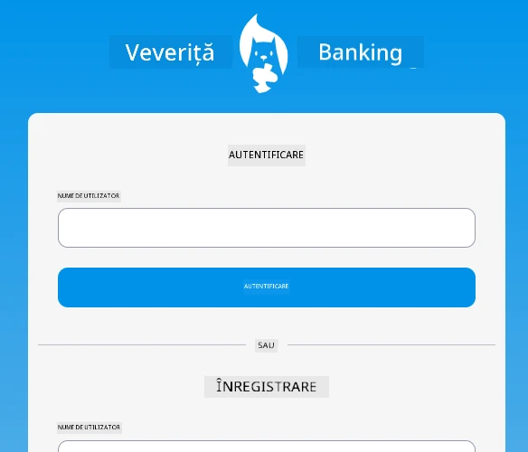
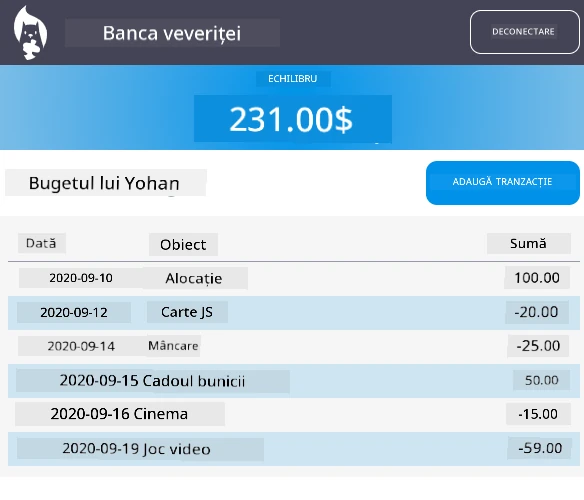

# :dollar: Construiește o Bancă

În acest proiect, vei învăța cum să construiești o bancă fictivă. Aceste lecții includ instrucțiuni despre cum să creezi structura unei aplicații web și să oferi rute, să construiești formulare, să gestionezi starea, și să obții date de la un API de unde poți prelua informațiile băncii.

|  |  |
|--------------------------------|--------------------------------|

## Lecții

1. [Șabloane HTML și Rute într-o Aplicație Web](1-template-route/README.md)
2. [Construiește un Formular de Autentificare și Înregistrare](2-forms/README.md)
3. [Metode de Preluare și Utilizare a Datelor](3-data/README.md)
4. [Concepte de Gestionare a Stării](4-state-management/README.md)

### Credite

Aceste lecții au fost scrise cu :hearts: de [Yohan Lasorsa](https://twitter.com/sinedied).

Dacă ești interesat să înveți cum să construiești [API-ul serverului](/7-bank-project/api/README.md) utilizat în aceste lecții, poți urmări [această serie de videoclipuri](https://aka.ms/NodeBeginner) (în special videoclipurile 17 până la 21).

De asemenea, poți arunca o privire la [acest tutorial interactiv Learn](https://aka.ms/learn/express-api).

---

**Declinare de responsabilitate**:  
Acest document a fost tradus folosind serviciul de traducere AI [Co-op Translator](https://github.com/Azure/co-op-translator). Deși ne străduim să asigurăm acuratețea, vă rugăm să rețineți că traducerile automate pot conține erori sau inexactități. Documentul original în limba sa natală ar trebui considerat sursa autoritară. Pentru informații critice, se recomandă traducerea profesională realizată de un specialist. Nu ne asumăm responsabilitatea pentru eventualele neînțelegeri sau interpretări greșite care pot apărea din utilizarea acestei traduceri.