# Folosirea unui Editor de Cod: Stăpânirea VSCode.dev

Țineți minte în *The Matrix* când Neo trebuia să se conecteze la un terminal uriaș pentru a accesa lumea digitală? Instrumentele de dezvoltare web de azi spun povestea opusă – capabilități incredibil de puternice accesibile de oriunde. VSCode.dev este un editor de cod bazat pe browser care aduce unelte profesionale de dezvoltare pe orice dispozitiv cu conexiune la internet.

Exact așa cum tiparnița a făcut cărțile accesibile tuturor, nu doar călugărilor din mănăstiri, VSCode.dev democratizează programarea. Poți lucra la proiecte de pe un calculator din bibliotecă, dintr-un laborator școlar sau de oriunde ai acces la browser. Fără instalări, fără limitări de genul „am nevoie de configurarea mea specifică”.

La finalul acestei lecții vei înțelege cum să navighezi în VSCode.dev, să deschizi direct în browser depozite GitHub și să folosești Git pentru controlul versiunilor – toate abilități de care dezvoltatorii profesioniști depind zilnic.

## ⚡ Ce Poți Face în Următoarele 5 Minute

**Cale Rapidă pentru Dezvoltatori Ocupați**

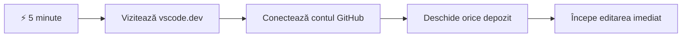
- **Minutul 1**: Accesează [vscode.dev](https://vscode.dev) - fără nevoie de instalare  
- **Minutul 2**: Autentifică-te cu GitHub pentru a conecta depozitele tale  
- **Minutul 3**: Încearcă trucul cu URL-ul: schimbă `github.com` în `vscode.dev/github` în orice URL de repo  
- **Minutul 4**: Creează un fișier nou și urmărește cum funcționează evidențierea sintaxei automat  
- **Minutul 5**: Fă o modificare și comite-o prin panoul de Source Control  

**URL de Test Rapid**:  
```
# Transform this:
github.com/microsoft/Web-Dev-For-Beginners

# Into this:
vscode.dev/github/microsoft/Web-Dev-For-Beginners
```
  
**De ce contează asta**: În 5 minute vei experimenta libertatea de a programa oriunde cu unelte profesionale. Acesta reprezintă viitorul dezvoltării - accesibil, puternic și imediat.

## 🗺️ Călătoria Ta de Învățare prin Dezvoltare în Cloud

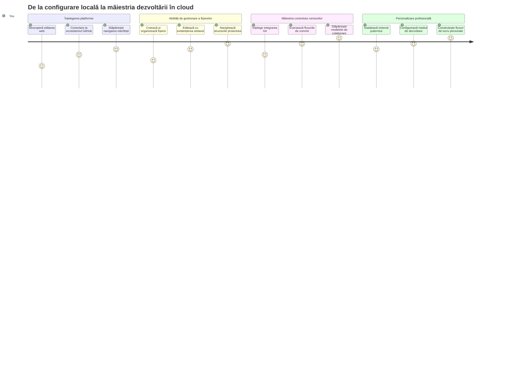
**Destinația Călătoriei Tale**: La finalul acestei lecții, vei stăpâni un mediu profesional de dezvoltare în cloud care funcționează de pe orice dispozitiv, permițându-ți să codezi cu aceleași unelte folosite de dezvoltatorii marilor companii tech.

## Ce Vei Învăța

După ce vom parcurge împreună acest proces, vei fi capabil să:

- Navighezi în VSCode.dev ca și cum ar fi a doua ta casă – găsind tot ce ai nevoie fără să te rătăcești  
- Deschizi orice depozit GitHub în browser și să începi editarea imediat (asta e chiar magie!)  
- Folosești Git pentru a urmări modificările și a-ți salva progresul ca un profesionist  
- Îți îmbunătățești editorul cu extensii care fac programarea mai rapidă și mai distractivă  
- Creezi și organizezi fișierele proiectelor cu încredere  

## Ce Vei Avea Nevoie

Cerințele sunt simple:

- Un cont gratuit [GitHub](https://github.com) (te vom ghida cum să-l creezi dacă nu ai)  
- Familiaritate de bază cu browserele web  
- Lecția GitHub Basics oferă o pregătire utilă, deși nu este esențială  

> 💡 **Ești nou pe GitHub?** Crearea unui cont este gratuită și durează câteva minute. La fel cum un abonament la bibliotecă îți oferă acces la cărți din întreaga lume, un cont GitHub deschide uși la depozite de cod de pe internet.

## 🧠 Prezentare Generală a Ecosistemului de Dezvoltare Cloud

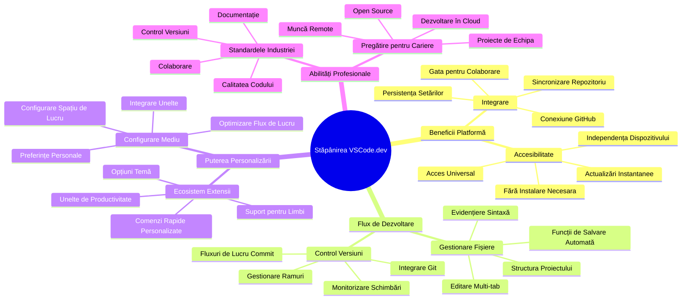
**Principiul de Bază**: Mediile de dezvoltare bazate pe cloud reprezintă viitorul programării - oferind unelte profesionale accesibile, colaborative și independente de platformă.

## De Ce Contează Editorii de Cod Bazati pe Web

Înainte de internet, oamenii de știință de la diverse universități nu puteau să-și împărtășească ușor cercetările. Apoi a apărut ARPANET în anii 1960, conectând computere la distanță. Editorii de cod bazati pe web urmează același principiu – fac unelte puternice accesibile indiferent de locația fizică sau dispozitiv.

Un editor de cod servește ca spațiu de lucru pentru dezvoltare, unde scrii, editezi și organizezi fișierele de cod. Spre deosebire de editoarele simple de text, edițiile profesionale oferă evidențierea sintaxei, detectarea erorilor și facilități de management al proiectului.

VSCode.dev aduce aceste capacități în browserul tău:

**Avantaje ale editării bazate pe web:**

| Funcționalitate | Descriere | Beneficiu Practic |
|-----------------|-----------|-------------------|
| **Independență de platformă** | Rulează pe orice dispozitiv cu browser | Lucrezi de pe diferite computere fără probleme |
| **Fără nevoie de instalare** | Acces printr-un URL web | Ocolești restricțiile de instalare software |
| **Actualizări automate** | Rulează întotdeauna cea mai nouă versiune | Ai acces la funcții noi fără actualizări manuale |
| **Integrare cu depozite** | Conexiune directă cu GitHub | Editezi codul fără să gestionezi fișiere local |

**Implicații practice:**  
- Continuitate în muncă pe diferite medii  
- Interfață consistentă indiferent de sistemul de operare  
- Capacități imediate de colaborare  
- Cerințe reduse de stocare locală  

## Explorând VSCode.dev

Așa cum laboratorul lui Marie Curie conținea echipamente sofisticate într-un spațiu relativ simplu, VSCode.dev încorporează unelte profesionale de dezvoltare într-o interfață de browser. Această aplicație web oferă aceeași funcționalitate de bază ca editoarele desktop.

Începe prin a accesa [vscode.dev](https://vscode.dev) în browserul tău. Interfața se încarcă fără niciun download sau instalare – o aplicare directă a principiilor cloud computing.

### Conectarea Contului Tău GitHub

Așa cum telefonul lui Alexander Graham Bell conecta locații îndepărtate, conectarea contului tău GitHub leagă VSCode.dev de depozitele tale de cod. Când ți se cere să te autentifici cu GitHub, este recomandat să accepți această conexiune.

**Integrarea GitHub oferă:**  
- Acces direct la depozitele tale în editor  
- Setări și extensii sincronizate pe dispozitive  
- Flux de lucru simplificat pentru salvare pe GitHub  
- Mediu de dezvoltare personalizat  

### Familiarizează-te cu Noul Tău Spațiu de Lucru

Odată ce totul s-a încărcat, vei vedea un spațiu de lucru frumos curat, conceput să te mențină concentrat pe ceea ce contează – codul tău!

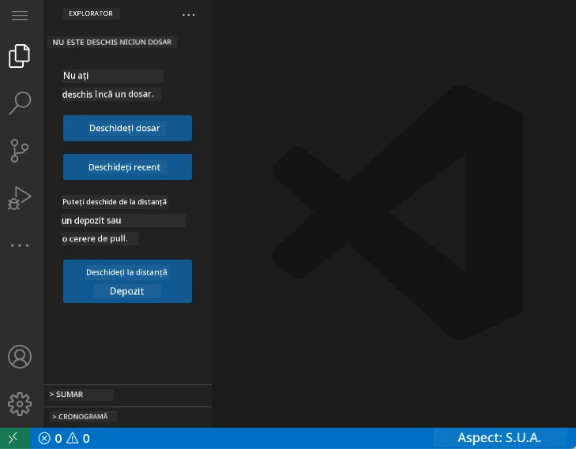

**Iată un tur al cartierului:**  
- **Bară de Activitate** (această bandă din stânga): Navigarea ta principală cu Explorer 📁, Search 🔍, Source Control 🌿, Extensions 🧩 și Settings ⚙️  
- **Sidebar** (panoul alăturat): Se schimbă pentru a-ți arăta informații relevante în funcție de ce ai selectat  
- **Zona Editorului** (spațiul mare din mijloc): Aici se întâmplă magia – zona ta principală de codare  

**Ia un moment să explorezi:**  
- Apasă pe pictogramele din Bara de Activitate și vezi ce face fiecare  
- Observă cum sidebar-ul se actualizează pentru a afișa informații diferite – drăguț, nu?  
- Vizualizarea Explorer (📁) probabil că e locul unde vei petrece cea mai mare parte a timpului, așa că obișnuiește-te cu ea  

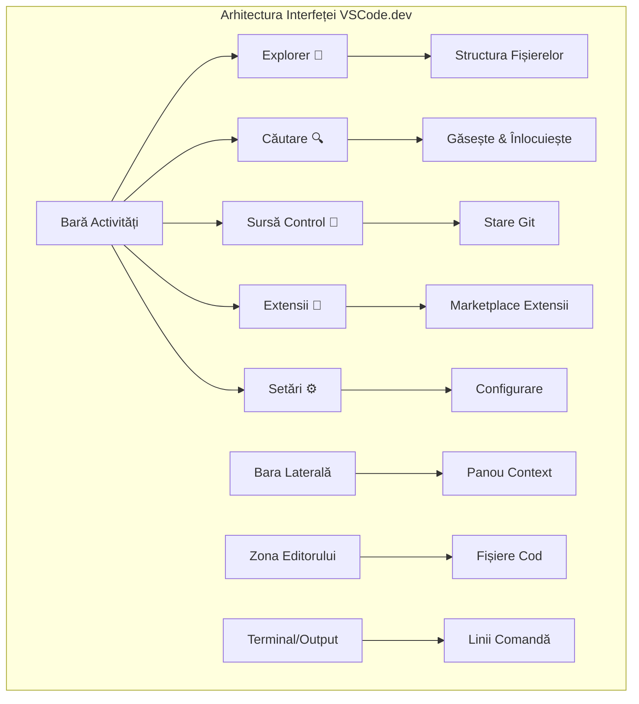
## Deschiderea Depozitelor GitHub

Înainte de internet, cercetătorii trebuiau să călătorească fizic la biblioteci pentru a accesa documente. Depozitele GitHub funcționează similar – sunt colecții de cod stocate la distanță. VSCode.dev elimină pasul tradițional de a descărca depozitele pe mașina locală înainte de editare.

Această capabilitate oferă acces imediat la orice depozit public pentru vizualizare, editare sau contribuție. Iată două metode de deschidere a depozitelor:

### Metoda 1: Varianta Point-and-Click

Perfectă când începi în VSCode.dev și vrei să deschizi un depozit specific. Simplu și prietenos pentru începători:

**Cum se face:**  

1. Mergi la [vscode.dev](https://vscode.dev) dacă nu ești deja acolo  
2. Caută butonul "Open Remote Repository" pe ecranul de bun venit și dă click pe el  

   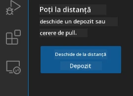  

3. Lipsește orice URL GitHub de depozit (încearcă asta: `https://github.com/microsoft/Web-Dev-For-Beginners`)  
4. Apasă Enter și privește magia!

**Sfat de profesionist – Comanda rapidă Command Palette:**  

Vrei să te simți ca un vrăjitor al codului? Încearcă comanda rapidă Ctrl+Shift+P (sau Cmd+Shift+P pe Mac) pentru a deschide Command Palette:

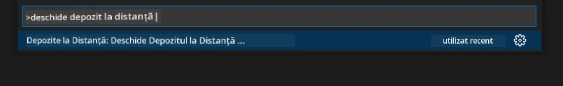

**Command Palette este ca un motor de căutare pentru tot ce poți face:**  
- Tastează „open remote” și va găsi deschizătorul de depozite pentru tine  
- Își amintește depozitele deschise recent (foarte util!)  
- Când te obișnuiești, vei simți că programezi cu viteza luminii  
- E practic versiunea VSCode.dev a „Hei Siri, dar pentru programare”  

### Metoda 2: Tehnica Modificării URL-ului

Așa cum HTTP și HTTPS folosesc protocoale diferite păstrând structura domeniului aceeași, VSCode.dev folosește un tipar de URL care oglindește sistemul de adresare GitHub. Orice URL de depozit GitHub poate fi modificat pentru a se deschide direct în VSCode.dev.

**Model de transformare URL:**  

| Tip Depozit | URL GitHub | URL VSCode.dev |  
|-------------|------------|----------------|  
| **Depozit Public** | `github.com/microsoft/Web-Dev-For-Beginners` | `vscode.dev/github/microsoft/Web-Dev-For-Beginners` |  
| **Proiect Personal** | `github.com/numele-tau/my-project` | `vscode.dev/github/numele-tau/my-project` |  
| **Orice Repo Accesibil** | `github.com/numele-lor/awesome-repo` | `vscode.dev/github/numele-lor/awesome-repo` |  

**Implementare:**  
- Înlocuiește `github.com` cu `vscode.dev/github`  
- Păstrează toate celelalte componente ale URL-ului neschimbate  
- Funcționează cu orice depozit public accesibil  
- Oferă acces imediat pentru editare  

> 💡 **Sfat care îți schimbă viața**: Marchează versiunea VSCode.dev a depozitelor tale preferate. Eu am bookmark-uri ca „Editează Portofoliul” sau „Corectează Documentația” care mă duc direct în modul de editare!

**Pe care metodă să o folosești?**  
- **Varianta interfață**: Excelentă când explorezi sau nu-ți amintești exact numele depozitelor  
- **Trucul URL**: Perfect pentru acces ultra-rapid când știi exact unde vrei să ajungi  

### 🎯 Verificare Pedagogică: Accesul la Dezvoltarea în Cloud

**Opresc și Reflect:** Tocmai ai învățat două metode de accesare a depozitelor de cod prin browser. Aceasta reprezintă o schimbare fundamentală în modul în care funcționează dezvoltarea.

**Autoevaluare rapidă:**  
- Poți explica de ce editarea bazată pe web elimină pasul tradițional „configurarea mediului de dezvoltare”?  
- Ce avantaje oferă tehnica modificării URL-ului față de clonarea locală cu git?  
- Cum schimbă această abordare modul în care ai putea contribui la proiecte open source?  

**Conexiune cu lumea reală:** Companii majore precum GitHub, GitLab și Replit și-au construit platformele de dezvoltare pe aceste principii cloud-first. Înveți aceleași fluxuri de lucru folosite de echipe profesionale din întreaga lume.

**Întrebare provocatoare:** Cum ar putea dezvolatarea bazată pe cloud să schimbe modul în care se predă programarea în școli? Ia în considerare cerințele legate de dispozitive, managementul software-ului și posibilitățile colaborative.

## Lucrul cu Fișiere și Proiecte

Acum că ai un depozit deschis, hai să începem să construim! VSCode.dev îți oferă tot ce ai nevoie pentru a crea, edita și organiza fișierele de cod. Gândește-te la el ca la atelierul tău digital – fiecare unealtă este exact unde trebuie.

Hai să intrăm în sarcinile de zi cu zi care vor constitui majoritatea fluxului tău de lucru.

### Crearea Fișierelor Noi

Ca atunci când organizezi planuri într-un birou de arhitect, crearea fișierelor în VSCode.dev urmează o abordare structurată. Sistemul acceptă toate tipurile standard de fișiere web.

**Procesul de creare fișier:**

1. Navighează în folderul țintă din sidebar Explorer  
2. Trece cursorul peste numele folderului pentru a scoate la iveală iconița „New File” (📄+)  
3. Introdu numele fișierului cu extensia potrivită (`style.css`, `script.js`, `index.html`)  
4. Apasă Enter pentru a crea fișierul  

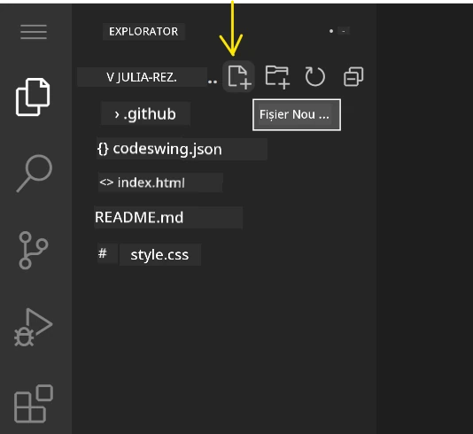

**Convenții de denumire:**  
- Folosește nume descriptive care indică scopul fișierului  
- Include extensiile pentru evidențiere corectă a sintaxei  
- Urmează un model consecvent de denumire în toate proiectele  
- Folosește litere mici și cratime în loc de spații  

### Editarea și Salvarea Fișierelor

Aici începe distracția adevărată! Editorul VSCode.dev este plin de caracteristici utile ce fac programarea lină și intuitivă. E ca și cum ai avea un asistent de scris foarte deștept, dar pentru cod.

**Fluxul tău de editare:**

1. Dă click pe orice fișier în Explorer pentru al deschide în zona principală  
2. Începe să tastezi și privește cum VSCode.dev te ajută cu culori, sugestii și detectarea erorilor  
3. Salvează-ți munca cu Ctrl+S (Windows/Linux) sau Cmd+S (Mac) – deși editorul salvează automat!  

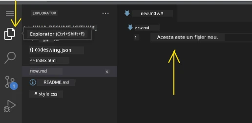

**Ce se întâmplă în timp ce codezi:**  
- Codul tău este frumos colorat pentru o lectură ușoară  
- VSCode.dev sugerează completări pe măsură ce tastezi (ca un autocorrect, dar mult mai inteligent)  
- Depistează greșelile și erorile înainte să salvezi  
- Poți avea mai multe fișiere deschise în tab-uri, ca într-un browser  
- Totul se salvează automat în fundal  

> ⚠️ **Sfat rapid**: Chiar dacă auto-save te ajută, a obișnui să apeși Ctrl+S sau Cmd+S rămâne o practică bună. Salvează imediat orice și declanșează funcții suplimentare utile precum verificarea erorilor.

### Controlul Versiunilor cu Git

Așa cum arheologii creează înregistrări detaliate ale straturilor de săpătură, Git urmărește modificările codului tău în timp. Acest sistem păstrează istoricul proiectului și îți permite să revii la versiuni anterioare când e nevoie. VSCode.dev include funcționalitate Git integrată.

**Interfața Source Control:**  

1. Accesează panoul Source Control prin iconița 🌿 din Bara de Activitate  
2. Fișierele modificate apar în secțiunea „Changes”  
3. Codarea color indică tipurile de schimbări: verde pentru adaosuri, roșu pentru ștergeri  

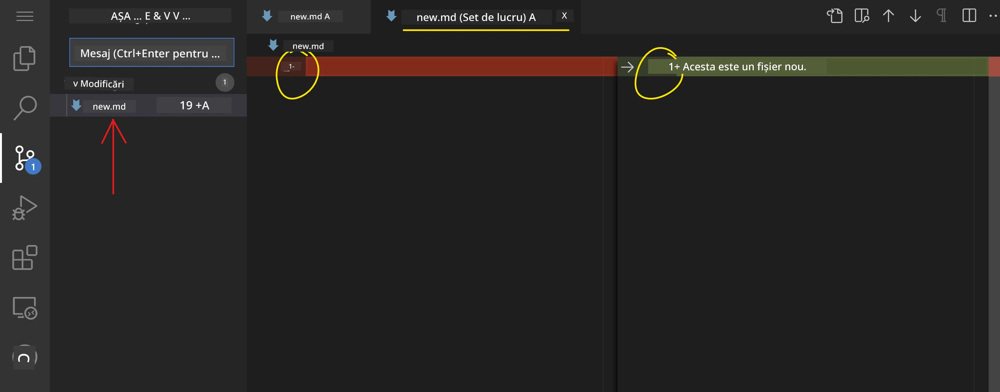

**Salvarea muncii tale (fluxul de commit):**

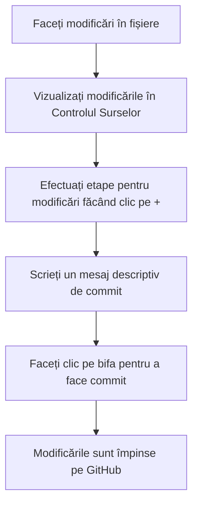
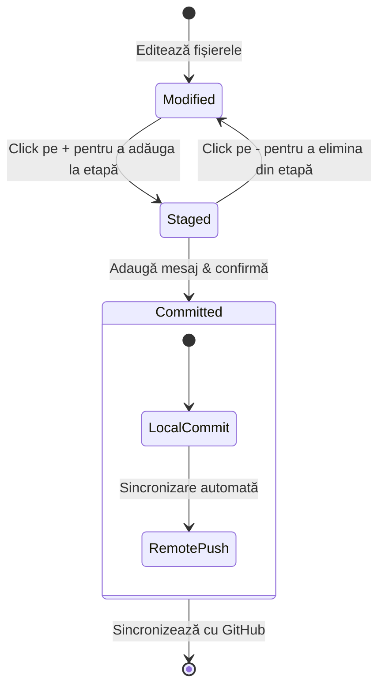
**Iată pașii tăi:**  
- Apasă pe iconița "+" din dreptul fișierelor pe care vrei să le salvezi (astfel „stage”-ezi modificările)
- Verifică încă o dată dacă ești mulțumit de toate modificările pregătite
- Scrie o notă scurtă explicând ce ai făcut (asta este „mesajul tău de commit”)
- Apasă butonul cu bifa pentru a salva totul pe GitHub
- Dacă te răzgândești în legătură cu ceva, pictograma undo îți permite să renunți la modificări

**Scrierea de mesaje bune de commit (este mai ușor decât crezi!):**
- Doar descrie ce ai făcut, de exemplu „Adaugă formular de contact” sau „Remediază navigația stricată”
- Păstrează-l scurt și la obiect – gândește-te la lungimea unui tweet, nu la un eseu
- Începe cu verbe de acțiune ca „Adaugă”, „Remediază”, „Actualizează” sau „Elimină”
- **Exemple bune**: „Adaugă meniu de navigare responsive”, „Remediază problemele layout-ului pe mobil”, „Actualizează culorile pentru accesibilitate mai bună”

> 💡 **Sfat rapid de navigare**: Folosește meniul hamburger (☰) din stânga sus pentru a reveni la depozitul tău GitHub și a vedea schimbările făcute online. Este ca un portal între mediul tău de editare și „acasă” pe GitHub!

## Îmbunătățirea Funcționalității cu Extensii

Așa cum atelierul unui meșteșugar conține unelte specializate pentru diverse sarcini, VSCode.dev poate fi personalizat cu extensii care adaugă capabilități specifice. Aceste pluginuri dezvoltate de comunitate răspund nevoilor comune de dezvoltare, cum ar fi formatarea codului, previzualizarea live și integrarea avansată cu Git.

Marketplace-ul de extensii găzduiește mii de unelte gratuite create de dezvoltatori din întreaga lume. Fiecare extensie rezolvă provocări particulare de flux de lucru, permițându-ți să construiești un mediu de dezvoltare personalizat, adaptat nevoilor și preferințelor tale.

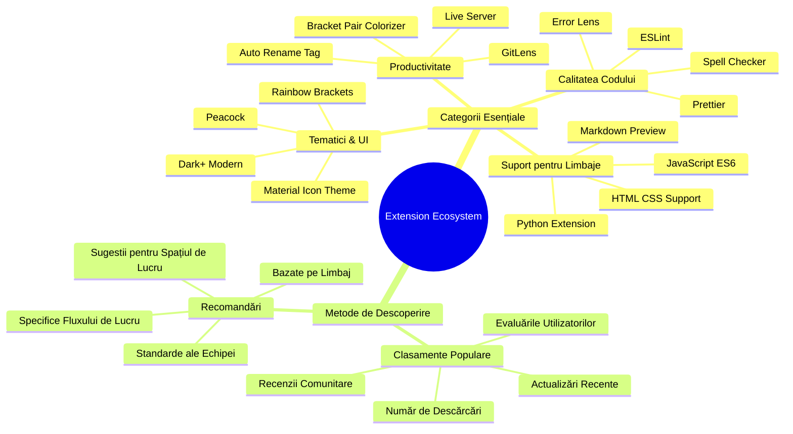
### Găsirea Extensiilor Perfecte pentru Tine

Marketplace-ul extensiilor este foarte bine organizat, astfel încât să nu te pierzi încercând să găsești ce ai nevoie. Este conceput să te ajute să descoperi atât unelte specifice, cât și chestii cool de care nici nu știai!

**Cum ajungi la marketplace:**

1. Apasă pe pictograma Extensii (🧩) din Bara de Activitate
2. Răsfoiește sau caută ceva anume
3. Apasă pe orice arată interesant ca să afli mai multe

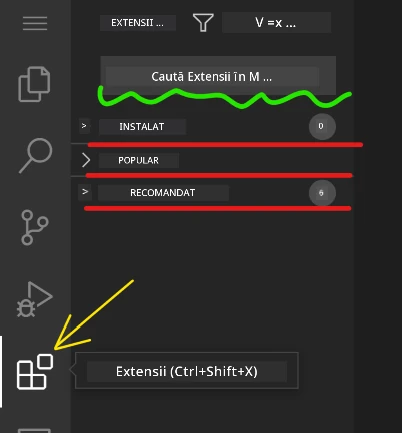

**Ce vei vedea acolo:**

| Secțiune | Ce conține | De ce este utilă |
|----------|------------|-----------------|
| **Instalate** | Extensiile pe care le-ai adăugat deja | Kitul tău personal de unelte de codare |
| **Populare** | Favoritele mulțimii | Ce folosesc majoritatea dezvoltatorilor |
| **Recomandate** | Sugestii inteligente pentru proiectul tău | Recomandările utile ale VSCode.dev |

**Ce face navigarea ușoară:**
- Fiecare extensie afișează evaluări, numărul de descărcări și review-uri reale de la utilizatori
- Vezi capturi de ecran și descrieri clare despre ce face fiecare extensie
- Totul este clar marcat cu informații de compatibilitate
- Sunt sugerate extensii similare pentru a putea compara opțiunile

### Instalarea Extensiilor (Este Foarte Simplu!)

Adăugarea de puteri noi editorului tău este la fel de simplă ca apăsarea unui buton. Extensiile se instalează în câteva secunde și încep să funcționeze imediat – fără reporniri, fără așteptări.

**Iată ce trebuie să faci:**

1. Caută ce vrei (încearcă „live server” sau „prettier”)
2. Apasă pe una care pare bună pentru mai multe detalii
3. Citește ce face și verifică evaluările
4. Apasă butonul albastru „Install” și gata!


**Ce se întâmplă în fundal:**
- Extensia se descarcă și se configurează automat
- Funcționalitățile noi apar imediat în interfața ta
- Totul începe să funcționeze instantaneu (serios, chiar așa de rapid!)
- Dacă ești autentificat, extensia se sincronizează cu toate dispozitivele tale

**Câteva extensii pe care ți le recomand:**
- **Live Server**: Vezi site-ul actualizându-se în timp real pe măsură ce scrii cod (asta e magic!)
- **Prettier**: Face codul să arate curat și profesional automat
- **Auto Rename Tag**: Schimbi o etichetă HTML și cealaltă pereche se actualizează
- **Bracket Pair Colorizer**: Codifică culoarea parantezelor ca să nu te mai pierzi niciodată
- **GitLens**: Îmbunătățește funcțiile Git cu o mulțime de informații utile

### Personalizarea Extensiilor Tale

Majoritatea extensiilor vin cu setări pe care le poți ajusta ca să funcționeze exact cum îți place. Gândește-te ca și cum ți-ai ajusta scaunul și oglinzile într-o mașină – fiecare are preferințele sale!

**Cum să modifici setările extensiei:**

1. Găsește extensia instalată în panoul Extensii
2. Caută pictograma mică cu rotiță (⚙️) lângă numele ei și apasă pe ea
3. Alege „Extension Settings” din meniul derulant
4. Ajustează ce trebuie până când se potrivește perfect fluxului tău de lucru

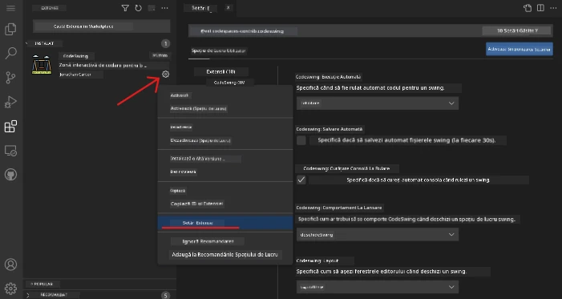

**Setări comune pe care s-ar putea să vrei să le modifici:**
- Cum este formatat codul tău (taburi vs spații, lungimea liniei etc.)
- Ce comenzi rapide de tastatură declanșează acțiuni diferite
- Cu ce tipuri de fișiere ar trebui să funcționeze extensia
- Activarea sau dezactivarea anumitor funcții pentru a păstra ordinea

### Menținerea Extensiilor Organizate

Pe măsură ce descoperi mai multe extensii interesante, vei vrea să-ți păstrezi colecția ordonată și să funcționeze fără probleme. VSCode.dev face acest lucru foarte ușor de gestionat.

**Opțiunile tale de gestionare a extensiilor:**

| Ce poți face | Când este util | Sfat util |
|--------------|----------------|-----------|
| **Dezactivează** | Când testezi dacă o extensie cauzează probleme | Mai bine decât să o dezinstalezi dacă vrei să o păstrezi |
| **Dezinstalează** | Pentru a elimina complet extensiile nefolositoare | Păstrează-ți mediul curat și rapid |
| **Actualizează** | Pentru a obține cele mai noi funcții și corecții | De obicei se întâmplă automat, dar merită verificat |

**Cum îmi place să gestionez extensiile:**
- La câteva luni, revizuiesc ce am instalat și elimin ce nu mai folosesc
- Păstrez extensiile actualizate pentru a avea cele mai noi îmbunătățiri și patch-uri de securitate
- Dacă ceva pare lent, dezactivez temporar extensiile pentru a vedea dacă una e de vină
- Citesc notele de actualizare când extensiile primesc update-uri majore – uneori apar funcții noi faine!

> ⚠️ **Sfat de performanță**: Extensiile sunt grozave, dar prea multe pot încetini mediul. Concentrează-te pe cele care îți fac viața mai ușoară și nu te teme să dezinstalezi pe cele pe care nu le folosești niciodată.

### 🎯 Verificare Pedagogică: Personalizarea Mediului de Dezvoltare

**Înțelegerea Arhitecturii**: Ai învățat să personalizezi un mediu profesional de dezvoltare folosind extensii create de comunitate. Aceasta reflectă modul în care echipele enterprise construiesc toolchain-uri standardizate.

**Concepte cheie asimilate**:
- **Descoperirea extensiilor**: Găsirea uneltelor care rezolvă provocări specifice de dezvoltare
- **Configurarea mediului**: Personalizarea uneltelor pentru a se potrivi preferințelor personale sau de echipă
- **Optimizarea performanței**: Echilibrarea funcționalității cu performanța sistemului
- **Colaborarea comunitară**: Folosirea uneltelor create de comunitatea globală de dezvoltatori

**Legătura cu industrie**: Ecosistemele de extensii alimentează platforme majore de dezvoltare precum VS Code, Chrome DevTools și IDE-uri moderne. Înțelegerea modului de evaluare, instalare și configurare a extensiilor este esențială pentru fluxurile profesionale de dezvoltare.

**Întrebare de reflecție**: Cum ai aborda configurarea unui mediu de dezvoltare standardizat pentru o echipă de 10 dezvoltatori? Ține cont de consistență, performanță și preferințele individuale.

## 📈 Cronologia Stăpânirii Dezvoltării în Cloud

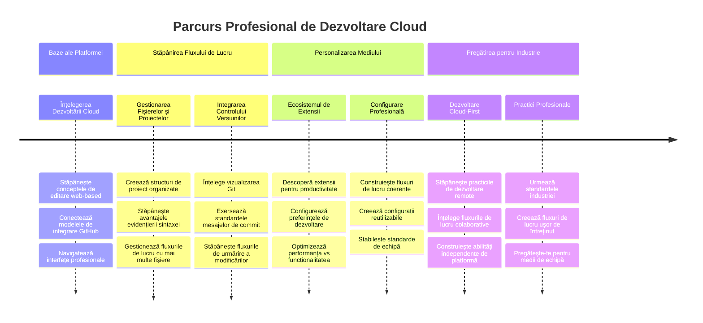
**🎓 Punct de absolvire**: Ai stăpânit cu succes dezvoltarea în cloud folosind aceleași unelte și fluxuri folosite de dezvoltatorii profesioniști ai marilor companii tech. Aceste competențe reprezintă viitorul dezvoltării software.

**🔄 Abilități la nivel următor**:
- Pregătit să explorezi platforme avansate de dezvoltare cloud (Codespaces, GitPod)
- Echipat pentru a lucra în echipe distribuite de dezvoltare
- Capabil să contribui la proiecte open source la nivel global
- Fundament pus pentru DevOps moderne și practici de integrare continuă

## Provocarea Agentului GitHub Copilot 🚀

Ca abordarea structurată folosită de NASA pentru misiuni spațiale, această provocare implică aplicarea sistematică a abilităților VSCode.dev într-un scenariu complet de flux de lucru.

**Obiectiv:** Demonstrează competența cu VSCode.dev stabilind un flux complet de dezvoltare web.

**Cerințe proiect:** Folosind modul Agent, finalizează aceste sarcini:
1. Fă fork la un depozit existent sau creează unul nou
2. Configurează o structură funcțională de proiect cu fișiere HTML, CSS și JavaScript
3. Instalează și configurează trei extensii care îmbunătățesc dezvoltarea
4. Practică controlul versiunilor cu mesaje de commit descriptive
5. Experimentează crearea și modificarea de branch-uri pentru funcționalități
6. Documentează procesul și ce ai învățat într-un fișier README.md

Acest exercițiu consolidează toate conceptele VSCode.dev într-un flux de lucru practic aplicabil la proiecte viitoare.

Află mai multe despre [modul agent](https://code.visualstudio.com/blogs/2025/02/24/introducing-copilot-agent-mode) aici.

## Temă

Este timpul să testezi aceste abilități în practică! Am un proiect hands-on care te va lăsa să exersezi tot ce am acoperit: [Creează un site de CV folosind VSCode.dev](./assignment.md)

Această temă te ghidează pas cu pas pentru a construi un site profesional de CV complet în browser. Vei folosi toate funcțiile VSCode.dev pe care le-am explorat, iar la final vei avea un site bine realizat și o mare încredere în noul tău flux de lucru.

## Continuă să Explorezi și să-ți Dezvolți Abilitățile

Ai o bază solidă acum, dar mai sunt o mulțime de chestii faine de descoperit! Iată câteva resurse și idei pentru a-ți duce abilitățile VSCode.dev la nivelul următor:

**Documentație oficială ce merită salvată:**
- [Documentația VSCode Web](https://code.visualstudio.com/docs/editor/vscode-web?WT.mc_id=academic-0000-alfredodeza) – Ghidul complet pentru editare în browser
- [GitHub Codespaces](https://docs.github.com/en/codespaces) – Pentru când vrei mai multă putere în cloud

**Funcții faine de încercat:**
- **Comenzi rapide de tastatură**: Învață combinațiile care te vor face să te simți ca un ninja al codării
- **Setări workspace**: Configurează medii diferite pentru tipuri diferite de proiecte
- **Multi-root Workspaces**: Lucrează la mai multe depozite simultan (super util!)
- **Integrare terminal**: Accesează unelte de linie de comandă direct în browser

**Idei pentru practică:**
- Implică-te în proiecte open source și contribuie folosind VSCode.dev – e o modalitate grozavă de a da înapoi comunității!
- Încearcă diferite extensii pentru a-ți găsi configurarea perfectă
- Creează template-uri de proiecte pentru tipurile de site-uri pe care le faci cel mai des
- Exersează fluxuri Git precum branching și merging – aceste aptitudini sunt aur pentru proiecte în echipă

---

**Ai stăpânit dezvoltarea în browser!** 🎉 Așa cum invenția instrumentelor portabile a permis oamenilor de știință să cerceteze în locuri îndepărtate, VSCode.dev îți permite să codezi profesionist de pe orice dispozitiv conectat la internet.

Aceste competențe reflectă practicile curente din industrie – mulți dezvoltatori profesioniști folosesc medii de dezvoltare în cloud pentru flexibilitate și accesibilitate. Ai învățat un flux de lucru scalabil de la proiecte individuale până la colaborări mari în echipă.

Aplică aceste tehnici în următorul tău proiect de dezvoltare! 🚀

---

<!-- CO-OP TRANSLATOR DISCLAIMER START -->
**Declinare de responsabilitate**:  
Acest document a fost tradus folosind serviciul de traducere automatizată AI [Co-op Translator](https://github.com/Azure/co-op-translator). Deși ne străduim pentru acuratețe, vă rugăm să rețineți că traducerile automate pot conține erori sau inexactități. Documentul original în limba sa nativă ar trebui considerat sursa autoritară. Pentru informații critice, se recomandă utilizarea unei traduceri profesionale realizate de un traducător uman. Nu ne asumăm responsabilitatea pentru eventualele neînțelegeri sau interpretări greșite rezultate din utilizarea acestei traduceri.
<!-- CO-OP TRANSLATOR DISCLAIMER END -->