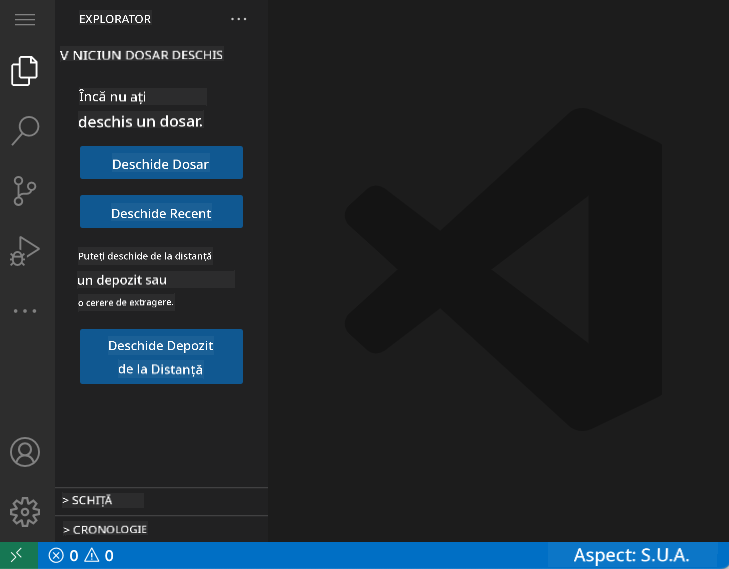
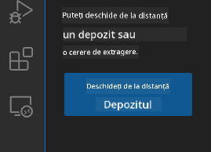
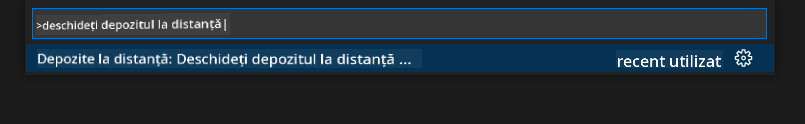
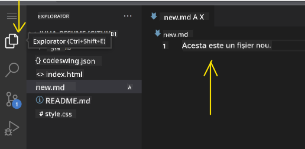
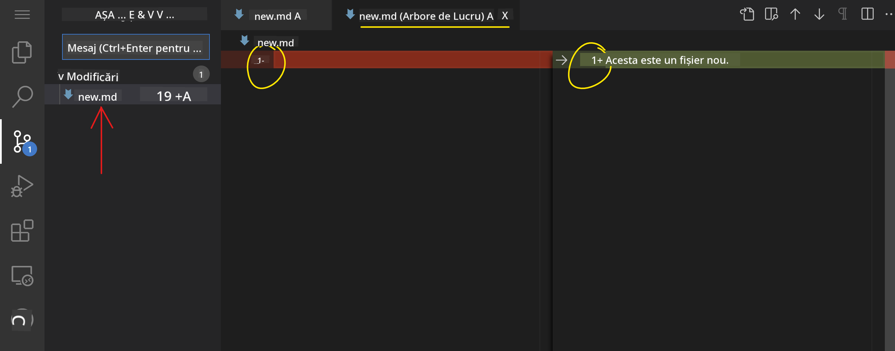
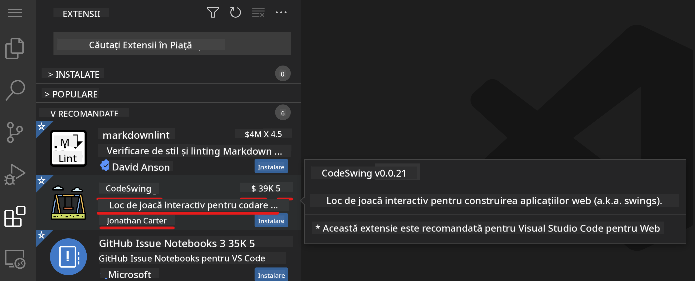
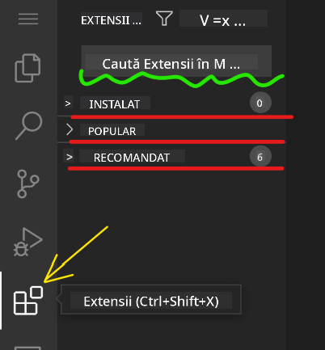
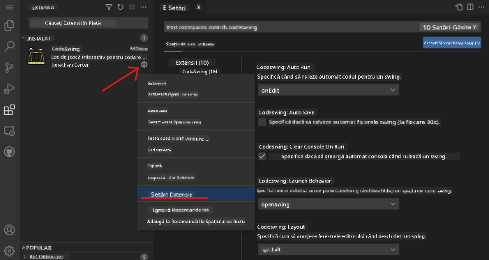

<!--
CO_OP_TRANSLATOR_METADATA:
{
  "original_hash": "1ba61d96a11309a2a6ea507496dcf7e5",
  "translation_date": "2025-08-29T11:37:05+00:00",
  "source_file": "8-code-editor/1-using-a-code-editor/README.md",
  "language_code": "ro"
}
-->
# Utilizarea unui editor de cod

Această lecție acoperă elementele de bază ale utilizării [VSCode.dev](https://vscode.dev), un editor de cod bazat pe web, astfel încât să poți face modificări în codul tău și să contribui la un proiect fără a instala nimic pe computerul tău.

## Obiectivele învățării

În această lecție, vei învăța cum să:

- Utilizezi un editor de cod într-un proiect de cod
- Urmărești modificările cu ajutorul controlului versiunilor
- Personalizezi editorul pentru dezvoltare

### Cerințe preliminare

Înainte de a începe, va trebui să îți creezi un cont pe [GitHub](https://github.com). Accesează [GitHub](https://github.com/) și creează un cont dacă nu ai deja unul.

### Introducere

Un editor de cod este un instrument esențial pentru scrierea programelor și colaborarea la proiecte de cod existente. Odată ce înțelegi elementele de bază ale unui editor și cum să utilizezi funcțiile acestuia, vei putea să le aplici atunci când scrii cod.

## Începutul cu VSCode.dev

[VSCode.dev](https://vscode.dev) este un editor de cod pe web. Nu trebuie să instalezi nimic pentru a-l utiliza, la fel ca atunci când deschizi orice alt site web. Pentru a începe cu editorul, deschide următorul link: [https://vscode.dev](https://vscode.dev). Dacă nu ești conectat la [GitHub](https://github.com/), urmează instrucțiunile pentru a te conecta sau pentru a crea un cont nou și apoi conectează-te.

După ce se încarcă, ar trebui să arate similar cu această imagine:



Există trei secțiuni principale, începând din partea stângă și mergând spre dreapta:

1. _Bara de activitate_ care include câteva pictograme, cum ar fi lupa 🔎, roata dințată ⚙️ și altele câteva.
2. Bara de activitate extinsă, care implicit este _Explorer_, numită _bara laterală_.
3. Și, în final, zona de cod din dreapta.

Fă clic pe fiecare dintre pictograme pentru a afișa un meniu diferit. După ce ai terminat, fă clic pe _Explorer_ pentru a reveni la starea inițială.

Când începi să creezi cod sau să modifici cod existent, acest lucru se va întâmpla în cea mai mare zonă din dreapta. Vei folosi această zonă și pentru a vizualiza codul existent, ceea ce vei face în continuare.

## Deschide un depozit GitHub

Primul lucru pe care trebuie să-l faci este să deschizi un depozit GitHub. Există mai multe moduri de a deschide un depozit. În această secțiune vei vedea două moduri diferite prin care poți deschide un depozit pentru a începe să lucrezi la modificări.

### 1. Cu editorul

Folosește editorul pentru a deschide un depozit de la distanță. Dacă accesezi [VSCode.dev](https://vscode.dev), vei vedea un buton _"Open Remote Repository"_:



Poți folosi și paleta de comenzi. Paleta de comenzi este o casetă de introducere unde poți tasta orice cuvânt care face parte dintr-o comandă sau o acțiune pentru a găsi comanda potrivită de executat. Folosește meniul din stânga sus, apoi selectează _View_ și alege _Command Palette_, sau folosește următoarea combinație de taste: Ctrl-Shift-P (pe MacOS ar fi Command-Shift-P).



După ce meniul se deschide, tastează _open remote repository_ și apoi selectează prima opțiune. Vor apărea mai multe depozite din care faci parte sau pe care le-ai deschis recent. Poți folosi și un URL complet GitHub pentru a selecta unul. Folosește următorul URL și lipește-l în casetă:

```
https://github.com/microsoft/Web-Dev-For-Beginners
```

✅ Dacă totul a fost realizat cu succes, vei vedea toate fișierele acestui depozit încărcate în editorul de text.

### 2. Utilizând URL-ul

Poți folosi și un URL direct pentru a încărca un depozit. De exemplu, URL-ul complet pentru depozitul curent este [https://github.com/microsoft/Web-Dev-For-Beginners](https://github.com/microsoft/Web-Dev-For-Beginners), dar poți înlocui domeniul GitHub cu `VSCode.dev/github` și să încarci depozitul direct. URL-ul rezultat ar fi [https://vscode.dev/github/microsoft/Web-Dev-For-Beginners](https://vscode.dev/github/microsoft/Web-Dev-For-Beginners).

## Editează fișiere

După ce ai deschis depozitul în browser/vscode.dev, următorul pas este să faci actualizări sau modificări la proiect.

### 1. Creează un fișier nou

Poți crea un fișier fie într-un folder existent, fie în directorul/folderul rădăcină. Pentru a crea un fișier nou, deschide locația/directorul în care vrei să salvezi fișierul și selectează pictograma _'New file ...'_ din bara de activitate _(stânga)_, dă-i un nume și apasă Enter.


### 2. Editează și salvează un fișier în depozit

Utilizarea vscode.dev este utilă ori de câte ori vrei să faci actualizări rapide la proiectul tău fără a încărca vreun software local.

Pentru a-ți actualiza codul, fă clic pe pictograma 'Explorer', situată tot pe bara de activitate, pentru a vizualiza fișierele și folderele din depozit. Selectează un fișier pentru a-l deschide în zona de cod, fă modificările și salvează.



După ce ai terminat de actualizat proiectul, selectează pictograma _`source control`_, care conține toate modificările noi pe care le-ai făcut în depozit.

Pentru a vizualiza modificările pe care le-ai făcut în proiect, selectează fișierul(ele) din folderul `Changes` din bara de activitate extinsă. Acest lucru va deschide un 'Working Tree' pentru a vedea vizual modificările pe care le-ai făcut în fișier. Roșu indică o omisiune din proiect, în timp ce verdele semnifică o adăugare.



Dacă ești mulțumit de modificările pe care le-ai făcut, treci cu mouse-ul peste folderul `Changes` și fă clic pe butonul `+` pentru a stabili modificările. Stabilirea înseamnă pur și simplu pregătirea modificărilor pentru a le trimite pe GitHub.

Dacă, totuși, nu ești confortabil cu unele modificări și vrei să le anulezi, treci cu mouse-ul peste folderul `Changes` și selectează pictograma `undo`.

Apoi, tastează un `commit message` _(O descriere a modificării pe care ai făcut-o proiectului)_, fă clic pe pictograma `check` pentru a confirma și trimite modificările.

După ce ai terminat de lucrat la proiectul tău, selectează pictograma `hamburger menu` din stânga sus pentru a reveni la depozitul de pe github.com.


## Utilizarea extensiilor

Instalarea extensiilor în VSCode îți permite să adaugi funcții noi și opțiuni personalizate pentru mediul de dezvoltare în editorul tău, pentru a-ți îmbunătăți fluxul de lucru. Aceste extensii te ajută, de asemenea, să adaugi suport pentru mai multe limbaje de programare și sunt adesea fie extensii generice, fie extensii bazate pe limbaj.

Pentru a naviga prin lista tuturor extensiilor disponibile, fă clic pe pictograma _`Extensions`_ din bara de activitate și începe să tastezi numele extensiei în câmpul de text etichetat _'Search Extensions in Marketplace'_.

Vei vedea o listă de extensii, fiecare conținând **numele extensiei, numele editorului, o descriere de o propoziție, numărul de descărcări** și **un rating cu stele**.



Poți vizualiza, de asemenea, toate extensiile instalate anterior extinzând folderul _`Installed`_, extensiile populare utilizate de majoritatea dezvoltatorilor în folderul _`Popular`_ și extensiile recomandate pentru tine fie de utilizatori din același workspace, fie pe baza fișierelor deschise recent în folderul _`Recommended`_.



### 1. Instalează extensii

Pentru a instala o extensie, tastează numele extensiei în câmpul de căutare și fă clic pe ea pentru a vizualiza informații suplimentare despre extensie în zona de cod, odată ce apare în bara de activitate extinsă.

Poți face clic pe _butonul albastru de instalare_ din bara de activitate extinsă pentru a instala sau poți folosi butonul de instalare care apare în zona de cod odată ce selectezi extensia pentru a încărca informații suplimentare.


### 2. Personalizează extensiile

După instalarea extensiei, este posibil să fie nevoie să îi modifici comportamentul și să o personalizezi în funcție de preferințele tale. Pentru a face acest lucru, selectează pictograma Extensions, iar de această dată extensia ta va apărea în folderul _Installed_, fă clic pe _**pictograma Gear**_ și navighează la _Extensions Setting_.



### 3. Gestionează extensiile

După instalarea și utilizarea extensiei, vscode.dev oferă opțiuni pentru a gestiona extensia în funcție de diferite nevoi. De exemplu, poți alege să:

- **Dezactivezi:** _(Dezactivezi temporar o extensie atunci când nu mai ai nevoie de ea, dar nu vrei să o dezinstalezi complet)_

    Selectează extensia instalată din bara de activitate extinsă > fă clic pe pictograma Gear > selectează 'Disable' sau 'Disable (Workspace)' **SAU** Deschide extensia în zona de cod și fă clic pe butonul albastru Disable.

- **Dezinstalezi:** Selectează extensia instalată din bara de activitate extinsă > fă clic pe pictograma Gear > selectează 'Uninstall' **SAU** Deschide extensia în zona de cod și fă clic pe butonul albastru Uninstall.

---

## Temă

[Crează un site de tip CV folosind vscode.dev](https://github.com/microsoft/Web-Dev-For-Beginners/blob/main/8-code-editor/1-using-a-code-editor/assignment.md)

## Recapitulare și studiu individual

Citește mai multe despre [VSCode.dev](https://code.visualstudio.com/docs/editor/vscode-web?WT.mc_id=academic-0000-alfredodeza) și alte funcții ale acestuia.

---

**Declinarea responsabilității**:  
Acest document a fost tradus utilizând serviciul de traducere AI [Co-op Translator](https://github.com/Azure/co-op-translator). Deși depunem eforturi pentru a asigura acuratețea, vă rugăm să aveți în vedere că traducerile automate pot conține erori sau inexactități. Documentul original în limba sa nativă ar trebui considerat sursa autoritară. Pentru informații critice, se recomandă traducerea realizată de un profesionist uman. Nu ne asumăm răspunderea pentru eventualele neînțelegeri sau interpretări greșite care pot apărea din utilizarea acestei traduceri.