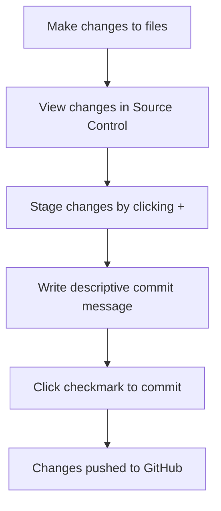

<!--
CO_OP_TRANSLATOR_METADATA:
{
  "original_hash": "cfd4a15974168ca426d50c67682ab9d4",
  "translation_date": "2025-10-24T21:55:50+00:00",
  "source_file": "8-code-editor/1-using-a-code-editor/README.md",
  "language_code": "ro"
}
-->
# Utilizarea unui Editor de Cod: Stăpânirea VSCode.dev

Îți amintești în *The Matrix* când Neo trebuia să se conecteze la un terminal uriaș pentru a accesa lumea digitală? Instrumentele de dezvoltare web de astăzi spun o poveste complet diferită – capabilități incredibil de puternice accesibile de oriunde. VSCode.dev este un editor de cod bazat pe browser care aduce instrumente profesionale de dezvoltare pe orice dispozitiv cu conexiune la internet.

Așa cum tiparul a făcut cărțile accesibile tuturor, nu doar scribilor din mănăstiri, VSCode.dev democratizează programarea. Poți lucra la proiecte de pe un computer din bibliotecă, un laborator școlar sau de oriunde ai acces la un browser. Fără instalări, fără limitări de tipul "Am nevoie de configurația mea specifică".

Până la sfârșitul acestei lecții, vei înțelege cum să navighezi în VSCode.dev, să deschizi depozite GitHub direct în browser și să folosești Git pentru controlul versiunilor – toate abilități pe care dezvoltatorii profesioniști se bazează zilnic.

## Ce vei învăța

După ce parcurgem acest material împreună, vei putea:

- Naviga în VSCode.dev ca și cum ar fi a doua ta casă – găsind tot ce ai nevoie fără să te pierzi
- Deschide orice depozit GitHub în browser și să începi să editezi imediat (asta e destul de magic!)
- Folosi Git pentru a urmări modificările și a-ți salva progresul ca un profesionist
- Îmbunătăți editorul cu extensii care fac programarea mai rapidă și mai distractivă
- Crea și organiza fișierele proiectului cu încredere

## Ce vei avea nevoie

Cerințele sunt simple:

- Un cont gratuit [GitHub](https://github.com) (te vom ghida cum să-l creezi dacă este necesar)
- Familiaritate de bază cu browserele web
- Lecția de Baze GitHub oferă informații utile, deși nu este esențială

> 💡 **Nou pe GitHub?** Crearea unui cont este gratuită și durează câteva minute. Așa cum un card de bibliotecă îți oferă acces la cărți din întreaga lume, un cont GitHub deschide uși către depozite de cod de pe internet.

## De ce contează editorii de cod bazat pe web

Înainte de internet, oamenii de știință de la diferite universități nu puteau împărtăși ușor cercetările. Apoi a apărut ARPANET în anii 1960, conectând computerele la distanță. Editorii de cod bazat pe web urmează același principiu – făcând instrumentele puternice accesibile indiferent de locația fizică sau dispozitiv.

Un editor de cod servește ca spațiu de lucru pentru dezvoltare, unde scrii, editezi și organizezi fișierele de cod. Spre deosebire de editorii de text simpli, editorii de cod profesioniști oferă evidențierea sintaxei, detectarea erorilor și funcții de gestionare a proiectelor.

VSCode.dev aduce aceste capabilități în browserul tău:

**Avantajele editării bazate pe web:**

| Caracteristică | Descriere | Beneficiu Practic |
|----------------|-----------|-------------------|
| **Independență de platformă** | Rulează pe orice dispozitiv cu browser | Lucrează de pe diferite computere fără probleme |
| **Fără instalare necesară** | Acces printr-un URL web | Evită restricțiile de instalare a software-ului |
| **Actualizări automate** | Rulează mereu cea mai recentă versiune | Acces la funcții noi fără actualizări manuale |
| **Integrare cu depozite** | Conexiune directă la GitHub | Editează codul fără gestionarea fișierelor locale |

**Implicații practice:**
- Continuitatea muncii în diferite medii
- Interfață consistentă indiferent de sistemul de operare
- Capacități imediate de colaborare
- Reducerea cerințelor de stocare locală

## Explorarea VSCode.dev

Așa cum laboratorul lui Marie Curie conținea echipamente sofisticate într-un spațiu relativ simplu, VSCode.dev înglobează instrumente profesionale de dezvoltare într-o interfață de browser. Această aplicație web oferă aceeași funcționalitate de bază ca editorii de cod desktop.

Începe prin a naviga la [vscode.dev](https://vscode.dev) în browserul tău. Interfața se încarcă fără descărcări sau instalări de sistem – o aplicare directă a principiilor calculului în cloud.

### Conectarea contului GitHub

Așa cum telefonul lui Alexander Graham Bell conecta locații îndepărtate, conectarea contului tău GitHub face legătura între VSCode.dev și depozitele tale de cod. Când ți se cere să te autentifici cu GitHub, este recomandat să accepți această conexiune.

**Integrarea cu GitHub oferă:**
- Acces direct la depozitele tale din editor
- Setări și extensii sincronizate pe diferite dispozitive
- Flux de lucru simplificat pentru salvarea pe GitHub
- Mediu de dezvoltare personalizat

### Familiarizarea cu noul tău spațiu de lucru

După ce totul se încarcă, vei vedea un spațiu de lucru frumos și curat, conceput pentru a te ajuta să te concentrezi pe ceea ce contează – codul tău!

**Iată un tur al zonei:**
- **Activity Bar** (acea bandă din stânga): Navigarea principală cu Explorer 📁, Search 🔍, Source Control 🌿, Extensions 🧩 și Settings ⚙️
- **Sidebar** (panoul de lângă): Se schimbă pentru a-ți arăta informații relevante în funcție de ceea ce ai selectat
- **Editor Area** (spațiul mare din mijloc): Aici se întâmplă magia – zona ta principală de codare

**Ia-ți un moment să explorezi:**
- Dă click pe pictogramele din Activity Bar și vezi ce face fiecare
- Observă cum se actualizează sidebar-ul pentru a afișa informații diferite – destul de interesant, nu-i așa?
- Vizualizarea Explorer (📁) este probabil locul unde vei petrece cel mai mult timp, așa că familiarizează-te cu ea

## Deschiderea depozitelor GitHub

Înainte de internet, cercetătorii trebuiau să călătorească fizic la biblioteci pentru a accesa documente. Depozitele GitHub funcționează similar – sunt colecții de cod stocate la distanță. VSCode.dev elimină pasul tradițional de descărcare a depozitelor pe mașina locală înainte de editare.

Această capacitate permite accesul imediat la orice depozit public pentru vizualizare, editare sau contribuție. Iată două metode pentru deschiderea depozitelor:

### Metoda 1: Calea simplă prin click

Aceasta este perfectă atunci când începi de la zero în VSCode.dev și vrei să deschizi un depozit specific. Este simplă și prietenoasă pentru începători:

**Cum să faci:**

1. Accesează [vscode.dev](https://vscode.dev) dacă nu ești deja acolo
2. Caută butonul "Open Remote Repository" pe ecranul de bun venit și dă click pe el

   

3. Introdu URL-ul unui depozit GitHub (încearcă acesta: `https://github.com/microsoft/Web-Dev-For-Beginners`)
4. Apasă Enter și privește magia!

**Sfat profesionist - Scurtătura Command Palette:**

Vrei să te simți ca un vrăjitor al codării? Încearcă această scurtătură de la tastatură: Ctrl+Shift+P (sau Cmd+Shift+P pe Mac) pentru a deschide Command Palette:

**Command Palette este ca un motor de căutare pentru tot ce poți face:**
- Tastează "open remote" și va găsi deschizătorul de depozite pentru tine
- Își amintește depozitele pe care le-ai deschis recent (super util!)
- Odată ce te obișnuiești cu ea, te vei simți ca și cum ai codifica cu viteza luminii
- Este practic versiunea VSCode.dev de "Hei Siri, dar pentru codare"

### Metoda 2: Tehnica modificării URL-ului

Așa cum HTTP și HTTPS folosesc protocoale diferite, dar mențin aceeași structură de domeniu, VSCode.dev folosește un model de URL care oglindește sistemul de adresare al GitHub. Orice URL de depozit GitHub poate fi modificat pentru a se deschide direct în VSCode.dev.

**Model de transformare a URL-ului:**

| Tip de depozit | URL GitHub | URL VSCode.dev |
|----------------|------------|----------------|
| **Depozit public** | `github.com/microsoft/Web-Dev-For-Beginners` | `vscode.dev/github/microsoft/Web-Dev-For-Beginners` |
| **Proiect personal** | `github.com/your-username/my-project` | `vscode.dev/github/your-username/my-project` |
| **Orice depozit accesibil** | `github.com/their-username/awesome-repo` | `vscode.dev/github/their-username/awesome-repo` |

**Implementare:**
- Înlocuiește `github.com` cu `vscode.dev/github`
- Menține toate celelalte componente ale URL-ului neschimbate
- Funcționează cu orice depozit public accesibil
- Oferă acces imediat la editare

> 💡 **Sfat care îți poate schimba viața**: Salvează în marcaje versiunile VSCode.dev ale depozitelor tale preferate. Eu am marcaje precum "Edit My Portfolio" și "Fix Documentation" care mă duc direct în modul de editare!

**Ce metodă ar trebui să folosești?**
- **Calea prin interfață**: Excelentă când explorezi sau nu îți amintești exact numele depozitelor
- **Trucul URL-ului**: Perfect pentru acces rapid când știi exact unde vrei să ajungi

## Lucrul cu fișiere și proiecte

Acum că ai deschis un depozit, să începem să construim! VSCode.dev îți oferă tot ce ai nevoie pentru a crea, edita și organiza fișierele de cod. Gândește-te la el ca la atelierul tău digital – fiecare unealtă este exact acolo unde ai nevoie.

Să explorăm sarcinile zilnice care vor face parte din fluxul tău de lucru de programare.

### Crearea de fișiere noi

Așa cum organizarea planurilor într-un birou de arhitectură urmează o abordare structurată, crearea fișierelor în VSCode.dev urmează un proces bine definit. Sistemul suportă toate tipurile standard de fișiere pentru dezvoltarea web.

**Procesul de creare a fișierelor:**

1. Navighează la folderul țintă în bara laterală Explorer
2. Plasează cursorul peste numele folderului pentru a dezvălui pictograma "New File" (📄+)
3. Introdu numele fișierului, inclusiv extensia corespunzătoare (`style.css`, `script.js`, `index.html`)
4. Apasă Enter pentru a crea fișierul

**Convenții de denumire:**
- Folosește nume descriptive care indică scopul fișierului
- Include extensii de fișiere pentru evidențierea corectă a sintaxei
- Urmează modele de denumire consistente în proiecte
- Folosește litere mici și cratime în loc de spații

### Editarea și salvarea fișierelor

Aici începe distracția adevărată! Editorul VSCode.dev este plin de funcții utile care fac codarea să se simtă fluidă și intuitivă. Este ca și cum ai avea un asistent inteligent pentru scris, dar pentru cod.

**Fluxul tău de editare:**

1. Dă click pe orice fișier din Explorer pentru a-l deschide în zona principală
2. Începe să tastezi și observă cum VSCode.dev te ajută cu culori, sugestii și detectarea erorilor
3. Salvează-ți munca cu Ctrl+S (Windows/Linux) sau Cmd+S (Mac) – deși salvează automat și el!

**Lucruri interesante care se întâmplă în timp ce codezi:**
- Codul tău este evidențiat frumos, astfel încât să fie ușor de citit
- VSCode.dev sugerează completări pe măsură ce tastezi (ca autocorect, dar mult mai inteligent)
- Detectează greșelile și erorile înainte să salvezi
- Poți avea mai multe fișiere deschise în tab-uri, la fel ca într-un browser
- Totul se salvează automat în fundal

> ⚠️ **Sfat rapid**: Deși auto-save te ajută, apăsarea Ctrl+S sau Cmd+S este încă un obicei bun. Salvează imediat totul și declanșează câteva funcții suplimentare utile, cum ar fi verificarea erorilor.

### Controlul versiunilor cu Git

Așa cum arheologii creează înregistrări detaliate ale straturilor de excavare, Git urmărește modificările din codul tău de-a lungul timpului. Acest sistem păstrează istoria proiectului și îți permite să revii la versiunile anterioare atunci când este necesar. VSCode.dev include funcționalitate Git integrată.

**Interfața Source Control:**

1. Accesează panoul Source Control prin pictograma 🌿 din Activity Bar
2. Fișierele modificate apar în secțiunea "Changes"
3. Codarea culorilor indică tipurile de modificări: verde pentru adăugiri, roșu pentru ștergeri

**Salvarea muncii tale (fluxul de lucru pentru commit):**

**Iată procesul pas cu pas:**
- Dă click pe pictograma "+" de lângă fișierele pe care vrei să le salvezi (asta le "pregătește")
- Verifică dacă ești mulțumit de toate modificările pregătite
- Scrie o notă scurtă care să explice ce ai făcut (acesta este "commit message-ul" tău)
- Dă click pe butonul cu bifa pentru a salva totul pe GitHub
- Dacă te răzgândești în privința a ceva, pictograma de anulare îți permite să renunți la modificări

**Scrierea unor mesaje de commit bune (mai ușor decât crezi!):**
- Descrie pur și simplu ce ai făcut, cum ar fi "Adaugă formular de contact" sau "Rezolvă navigarea defectă"
- Fii scurt și la obiect – gândește-te la lungimea unui tweet, nu la un eseu
- Începe cu verbe de acțiune precum "Adaugă", "Rezolvă", "Actualizează" sau "Șterge"
- **Exemple bune**: "Adaugă meniu de navigare responsiv", "Rezolvă problemele de aspect pe mobil", "Actualizează culorile pentru o mai bună accesibilitate"

> 💡 **Sfat rapid de navigare**: Folosește meniul hamburger (☰) din stânga sus pentru a reveni la depozitul tău GitHub și a vedea modificările tale online. Este ca un portal între mediul tău de editare și pagina principală a proiectului tău pe GitHub!

## Îmbunătățirea funcționalității cu extensii

Așa cum atelierul unui meșteșugar conține instrumente specializate pentru diferite sarcini, VSCode.dev poate fi personalizat cu extensii care adaugă capabilități specifice. Aceste pluginuri dezvoltate de comunitate abordează nevoile comune de dezvoltare, cum ar fi formatarea codului, previzualizarea în timp real și integrarea îmbunătățită cu Git.

Piața de extensii găzduiește mii de instrumente gratuite create de dezvoltatori din întreaga lume. Fiecare extensie rezolvă provocări specifice ale fluxului de lucru, permițându-ți să construiești un mediu de dezvoltare personalizat, adaptat nevoilor și preferințelor tale.

### Găsirea extensiilor perfecte

Piața de extensii este foarte bine organizată, astfel încât să nu te pierzi încercând să găsești ceea ce ai nevoie. Este concepută pentru a te ajuta să descoperi atât instrumente specifice, cât și lucruri interesante pe care nici măcar nu știai că le cauți!

**Accesarea pieț
- Fiecare extensie afișează evaluări, numărul de descărcări și recenzii reale ale utilizatorilor
- Primești capturi de ecran și descrieri clare despre ce face fiecare extensie
- Totul este marcat clar cu informații despre compatibilitate
- Sunt sugerate extensii similare pentru a putea compara opțiunile

### Instalarea extensiilor (E super simplu!)

Adăugarea de funcționalități noi editorului tău este la fel de simplă ca apăsarea unui buton. Extensiile se instalează în câteva secunde și încep să funcționeze imediat – fără restartări, fără așteptări.

**Tot ce trebuie să faci este:**

1. Caută ceea ce îți dorești (încearcă să cauți "live server" sau "prettier")
2. Apasă pe extensia care pare interesantă pentru a vedea mai multe detalii
3. Citește ce face și verifică evaluările
4. Apasă butonul albastru "Install" și ai terminat!

**Ce se întâmplă în culise:**
- Extensia se descarcă și se configurează automat
- Funcționalitățile noi apar imediat în interfața ta
- Totul începe să funcționeze imediat (serios, e atât de rapid!)
- Dacă ești autentificat, extensia se sincronizează pe toate dispozitivele tale

**Câteva extensii pe care le recomand pentru început:**
- **Live Server**: Vezi cum site-ul tău se actualizează în timp real pe măsură ce scrii cod (e magic!)
- **Prettier**: Face ca codul tău să arate curat și profesionist automat
- **Auto Rename Tag**: Modifică un tag HTML și partenerul său se actualizează automat
- **Bracket Pair Colorizer**: Codifică culorile parantezelor astfel încât să nu te pierzi
- **GitLens**: Îmbunătățește funcționalitățile Git cu o mulțime de informații utile

### Personalizarea extensiilor tale

Majoritatea extensiilor vin cu setări pe care le poți ajusta pentru a le face să funcționeze exact cum îți place. Gândește-te la asta ca la ajustarea scaunului și oglinzilor într-o mașină – fiecare are preferințele sale!

**Cum să ajustezi setările extensiilor:**

1. Găsește extensia instalată în panoul Extensii
2. Caută pictograma mică de rotiță (⚙️) lângă numele ei și apasă pe ea
3. Alege "Extension Settings" din meniul derulant
4. Ajustează setările până când se potrivesc perfect cu stilul tău de lucru

**Lucruri comune pe care ai putea dori să le ajustezi:**
- Cum este formatat codul tău (taburi vs spații, lungimea liniilor etc.)
- Ce combinații de taste declanșează diferite acțiuni
- Tipurile de fișiere cu care extensia ar trebui să funcționeze
- Activarea sau dezactivarea anumitor funcționalități pentru a păstra lucrurile simple

### Organizarea extensiilor tale

Pe măsură ce descoperi mai multe extensii interesante, vei dori să îți păstrezi colecția ordonată și funcțională. VSCode.dev face acest lucru foarte ușor de gestionat.

**Opțiuni pentru gestionarea extensiilor:**

| Ce poți face | Când este util | Sfat |
|--------|---------|----------|
| **Dezactivează** | Testarea dacă o extensie cauzează probleme | Mai bine decât să o dezinstalezi dacă crezi că vei avea nevoie de ea din nou |
| **Dezinstalează** | Eliminarea completă a extensiilor de care nu ai nevoie | Menține mediul curat și rapid |
| **Actualizează** | Obținerea celor mai noi funcționalități și remedieri de erori | De obicei se întâmplă automat, dar merită verificat |

**Cum îmi place să gestionez extensiile:**
- La fiecare câteva luni, revizuiesc ce am instalat și elimin ceea ce nu folosesc
- Mențin extensiile actualizate pentru a beneficia de cele mai noi îmbunătățiri și remedieri de securitate
- Dacă ceva pare lent, dezactivez temporar extensiile pentru a vedea dacă una dintre ele este cauza
- Citesc notele de actualizare când extensiile primesc actualizări majore – uneori apar funcționalități noi interesante!

> ⚠️ **Sfat pentru performanță**: Extensiile sunt grozave, dar prea multe pot încetini lucrurile. Concentrează-te pe cele care îți fac cu adevărat viața mai ușoară și nu ezita să dezinstalezi cele pe care nu le folosești niciodată.

## Provocarea Agentului GitHub Copilot 🚀

La fel ca abordarea structurată pe care NASA o folosește pentru misiunile spațiale, această provocare implică aplicarea sistematică a abilităților VSCode.dev într-un scenariu complet de flux de lucru.

**Obiectiv:** Demonstrează competența în utilizarea VSCode.dev prin stabilirea unui flux de lucru complet pentru dezvoltarea web.

**Cerințele proiectului:** Folosind asistența modului Agent, completează aceste sarcini:
1. Clonează un depozit existent sau creează unul nou
2. Stabilește o structură funcțională de proiect cu fișiere HTML, CSS și JavaScript
3. Instalează și configurează trei extensii care îmbunătățesc dezvoltarea
4. Exersează controlul versiunilor cu mesaje descriptive de commit
5. Experimentează cu crearea și modificarea ramurilor de funcționalitate
6. Documentează procesul și învățăturile într-un fișier README.md

Acest exercițiu consolidează toate conceptele VSCode.dev într-un flux de lucru practic care poate fi aplicat la proiecte viitoare de dezvoltare.

Află mai multe despre [modul agent](https://code.visualstudio.com/blogs/2025/02/24/introducing-copilot-agent-mode) aici.

## Temă

E timpul să testezi aceste abilități! Am pregătit un proiect practic care îți va permite să exersezi tot ce am discutat: [Creează un site web de tip CV folosind VSCode.dev](./assignment.md)

Această temă te ghidează în construirea unui site web profesional de tip CV, complet în browserul tău. Vei folosi toate funcționalitățile VSCode.dev pe care le-am explorat, iar la final vei avea atât un site web bine realizat, cât și încredere solidă în noul tău flux de lucru.

## Continuă să explorezi și să îți dezvolți abilitățile

Acum ai o bază solidă, dar există atât de multe lucruri interesante de descoperit! Iată câteva resurse și idei pentru a-ți duce abilitățile VSCode.dev la nivelul următor:

**Documentație oficială de reținut:**
- [Documentația VSCode Web](https://code.visualstudio.com/docs/editor/vscode-web?WT.mc_id=academic-0000-alfredodeza) – Ghidul complet pentru editarea în browser
- [GitHub Codespaces](https://docs.github.com/en/codespaces) – Pentru momentele în care vrei și mai multă putere în cloud

**Funcționalități interesante de experimentat:**
- **Scurtături de tastatură**: Învață combinațiile de taste care te vor face să te simți ca un ninja al codării
- **Setări pentru spațiul de lucru**: Configurează medii diferite pentru diferite tipuri de proiecte
- **Spații de lucru multi-root**: Lucrează pe mai multe depozite în același timp (foarte util!)
- **Integrarea terminalului**: Accesează instrumentele de linie de comandă direct din browser

**Idei pentru exersare:**
- Implică-te în proiecte open-source și contribuie folosind VSCode.dev – e o modalitate excelentă de a da ceva înapoi!
- Testează diferite extensii pentru a găsi configurația perfectă
- Creează șabloane de proiect pentru tipurile de site-uri pe care le construiești cel mai des
- Exersează fluxurile de lucru Git, cum ar fi ramificarea și îmbinarea – aceste abilități sunt de aur în proiectele de echipă

---

**Ai stăpânit dezvoltarea în browser!** 🎉 La fel cum invenția instrumentelor portabile le-a permis oamenilor de știință să facă cercetări în locații îndepărtate, VSCode.dev îți permite să scrii cod profesional de pe orice dispozitiv conectat la internet.

Aceste abilități reflectă practicile actuale din industrie – mulți dezvoltatori profesioniști folosesc medii de dezvoltare bazate pe cloud pentru flexibilitatea și accesibilitatea lor. Ai învățat un flux de lucru care se potrivește atât proiectelor individuale, cât și colaborărilor în echipă.

Aplică aceste tehnici la următorul tău proiect de dezvoltare! 🚀

---

**Declinare de responsabilitate**:  
Acest document a fost tradus folosind serviciul de traducere AI [Co-op Translator](https://github.com/Azure/co-op-translator). Deși ne străduim să asigurăm acuratețea, vă rugăm să fiți conștienți că traducerile automate pot conține erori sau inexactități. Documentul original în limba sa natală ar trebui considerat sursa autoritară. Pentru informații critice, se recomandă traducerea profesională realizată de oameni. Nu ne asumăm responsabilitatea pentru eventualele neînțelegeri sau interpretări greșite care pot apărea din utilizarea acestei traduceri.