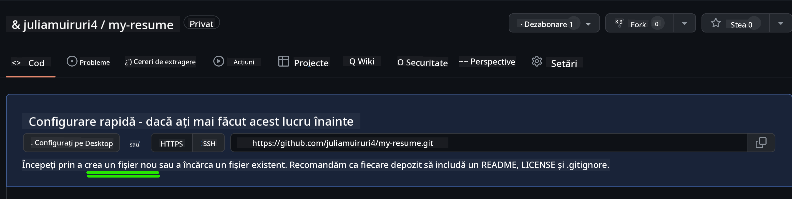
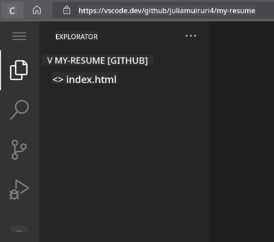
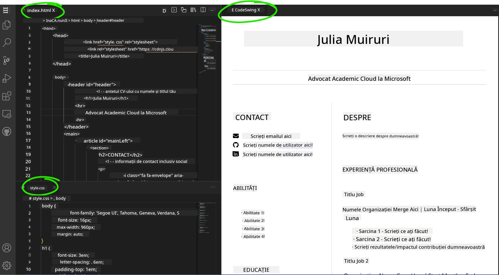

<!--
CO_OP_TRANSLATOR_METADATA:
{
  "original_hash": "2fcb983b8dbadadb1bc2e97f8c12dac5",
  "translation_date": "2025-08-27T22:39:35+00:00",
  "source_file": "8-code-editor/1-using-a-code-editor/assignment.md",
  "language_code": "ro"
}
-->
# Creează un site de tip CV folosind vscode.dev

_Cât de tare ar fi ca un recrutor să îți ceară CV-ul și tu să îi trimiți un link?_ 😎

## Obiective

După această activitate, vei învăța cum să:

- Creezi un site pentru a-ți prezenta CV-ul

### Cerințe preliminare

1. Un cont GitHub. Accesează [GitHub](https://github.com/) și creează un cont dacă nu ai deja unul.

## Pași

**Pasul 1:** Creează un nou repository GitHub și dă-i numele `my-resume`

**Pasul 2:** Creează un fișier `index.html` în repository-ul tău. Vom adăuga cel puțin un fișier direct pe github.com, deoarece nu poți deschide un repository gol pe vscode.dev.

Apasă pe linkul `creating a new file`, scrie numele `index.html` și selectează butonul `Commit new file`.



**Pasul 3:** Deschide [VSCode.dev](https://vscode.dev) și selectează butonul `Open Remote Repository`.

Copiază URL-ul repository-ului pe care tocmai l-ai creat pentru site-ul tău de CV și lipește-l în caseta de input:

_Înlocuiește `your-username` cu numele tău de utilizator GitHub._

```
https://github.com/your-username/my-resume
```

✅ Dacă totul a fost realizat cu succes, vei vedea proiectul tău și fișierul index.html deschise în editorul de text din browser.



**Pasul 4:** Deschide fișierul `index.html`, lipește codul de mai jos în zona de cod și salvează.

<details>
    <summary><b>Cod HTML responsabil pentru conținutul site-ului tău de CV.</b></summary>
    
        <html>

            <head>
                <link href="style.css" rel="stylesheet">
                <link rel="stylesheet" href="https://cdnjs.cloudflare.com/ajax/libs/font-awesome/5.15.4/css/all.min.css">
                <title>Numele Tău Aici!</title>
            </head>
            <body>
                <header id="header">
                    <!-- antetul CV-ului cu numele și titlul tău -->
                    <h1>Numele Tău Aici!</h1>
                    <hr>
                    Rolul Tău!
                    <hr>
                </header>
                <main>
                    <article id="mainLeft">
                        <section>
                            <h2>CONTACT</h2>
                            <!-- informații de contact, inclusiv social media -->
                            <p>
                                <i class="fa fa-envelope" aria-hidden="true"></i>
                                <a href="mailto:username@domain.top-level domain">Scrie emailul tău aici</a>
                            </p>
                            <p>
                                <i class="fab fa-github" aria-hidden="true"></i>
                                <a href="github.com/yourGitHubUsername">Scrie numele tău de utilizator aici!</a>
                            </p>
                            <p>
                                <i class="fab fa-linkedin" aria-hidden="true"></i>
                                <a href="linkedin.com/yourLinkedInUsername">Scrie numele tău de utilizator aici!</a>
                            </p>
                        </section>
                        <section>
                            <h2>ABILITĂȚI</h2>
                            <!-- abilitățile tale -->
                            <ul>
                                <li>Abilitatea 1!</li>
                                <li>Abilitatea 2!</li>
                                <li>Abilitatea 3!</li>
                                <li>Abilitatea 4!</li>
                            </ul>
                        </section>
                        <section>
                            <h2>EDUCAȚIE</h2>
                            <!-- educația ta -->
                            <h3>Scrie cursul tău aici!</h3>
                            <p>
                                Scrie instituția ta aici!
                            </p>
                            <p>
                                Data de început - Data de final
                            </p>
                        </section>            
                    </article>
                    <article id="mainRight">
                        <section>
                            <h2>DESPRE</h2>
                            <!-- despre tine -->
                            <p>Scrie câteva cuvinte despre tine!</p>
                        </section>
                        <section>
                            <h2>EXPERIENȚĂ PROFESIONALĂ</h2>
                            <!-- experiența ta profesională -->
                            <h3>Titlul Jobului</h3>
                            <p>
                                Numele Organizației Aici | Luna de început – Luna de final
                            </p>
                            <ul>
                                    <li>Sarcina 1 - Scrie ce ai făcut!</li>
                                    <li>Sarcina 2 - Scrie ce ai făcut!</li>
                                    <li>Scrie rezultatele/impactul contribuției tale</li>
                                    
                            </ul>
                            <h3>Titlul Jobului 2</h3>
                            <p>
                                Numele Organizației Aici | Luna de început – Luna de final
                            </p>
                            <ul>
                                    <li>Sarcina 1 - Scrie ce ai făcut!</li>
                                    <li>Sarcina 2 - Scrie ce ai făcut!</li>
                                    <li>Scrie rezultatele/impactul contribuției tale</li>
                                    
                            </ul>
                        </section>
                    </article>
                </main>
            </body>
        </html>
</details>

Adaugă detaliile CV-ului tău pentru a înlocui _textul de tip placeholder_ din codul HTML.

**Pasul 5:** Plasează cursorul pe folderul My-Resume, apasă pe pictograma `New File ...` și creează 2 fișiere noi în proiectul tău: `style.css` și `codeswing.json`.

**Pasul 6:** Deschide fișierul `style.css`, lipește codul de mai jos și salvează.

<details>
        <summary><b>Cod CSS pentru formatul layout-ului site-ului.</b></summary>
            
            body {
                font-family: 'Segoe UI', Tahoma, Geneva, Verdana, sans-serif;
                font-size: 16px;
                max-width: 960px;
                margin: auto;
            }
            h1 {
                font-size: 3em;
                letter-spacing: .6em;
                padding-top: 1em;
                padding-bottom: 1em;
            }

            h2 {
                font-size: 1.5em;
                padding-bottom: 1em;
            }

            h3 {
                font-size: 1em;
                padding-bottom: 1em;
            }
            main { 
                display: grid;
                grid-template-columns: 40% 60%;
                margin-top: 3em;
            }
            header {
                text-align: center;
                margin: auto 2em;
            }

            section {
                margin: auto 1em 4em 2em;
            }

            i {
                margin-right: .5em;
            }

            p {
                margin: .2em auto
            }

            hr {
                border: none;
                background-color: lightgray;
                height: 1px;
            }

            h1, h2, h3 {
                font-weight: 100;
                margin-bottom: 0;
            }
            #mainLeft {
                border-right: 1px solid lightgray;
            }
            
</details>

**Pasul 6:** Deschide fișierul `codeswing.json`, lipește codul de mai jos și salvează.

    {
    "scripts": [],
    "styles": []
    }

**Pasul 7:** Instalează extensia `Codeswing` pentru a vizualiza site-ul CV-ului în zona de cod.

Apasă pe pictograma _`Extensions`_ din bara de activități și tastează Codeswing. Fie apasă pe _butonul albastru de instalare_ din bara de activități extinsă pentru a instala, fie folosește butonul de instalare care apare în zona de cod odată ce selectezi extensia pentru a încărca informații suplimentare. Imediat după instalarea extensiei, observă schimbările din proiectul tău 😃.


Aceasta este ceea ce vei vedea pe ecranul tău după instalarea extensiei.



Dacă ești mulțumit de schimbările pe care le-ai făcut, plasează cursorul pe folderul `Changes` și apasă pe butonul `+` pentru a stoca modificările.

Scrie un mesaj de commit _(O descriere a modificării pe care ai făcut-o proiectului)_ și confirmă modificările apăsând pe `check`. După ce ai terminat de lucrat la proiectul tău, selectează pictograma meniului hamburger din colțul stâng sus pentru a reveni la repository-ul de pe GitHub.

Felicitări 🎉 Tocmai ai creat un site de tip CV folosind vscode.dev în câțiva pași.

## 🚀 Provocare

Deschide un repository remote la care ai permisiuni să faci modificări și actualizează câteva fișiere. Apoi, încearcă să creezi un nou branch cu modificările tale și să faci un Pull Request.

## Recapitulare și Studiu Individual

Citește mai multe despre [VSCode.dev](https://code.visualstudio.com/docs/editor/vscode-web?WT.mc_id=academic-0000-alfredodeza) și alte funcționalități ale acestuia.

---

**Declinare de responsabilitate**:  
Acest document a fost tradus folosind serviciul de traducere AI [Co-op Translator](https://github.com/Azure/co-op-translator). Deși ne străduim să asigurăm acuratețea, vă rugăm să fiți conștienți că traducerile automate pot conține erori sau inexactități. Documentul original în limba sa natală ar trebui considerat sursa autoritară. Pentru informații critice, se recomandă traducerea profesională realizată de un specialist uman. Nu ne asumăm responsabilitatea pentru eventualele neînțelegeri sau interpretări greșite care pot apărea din utilizarea acestei traduceri.