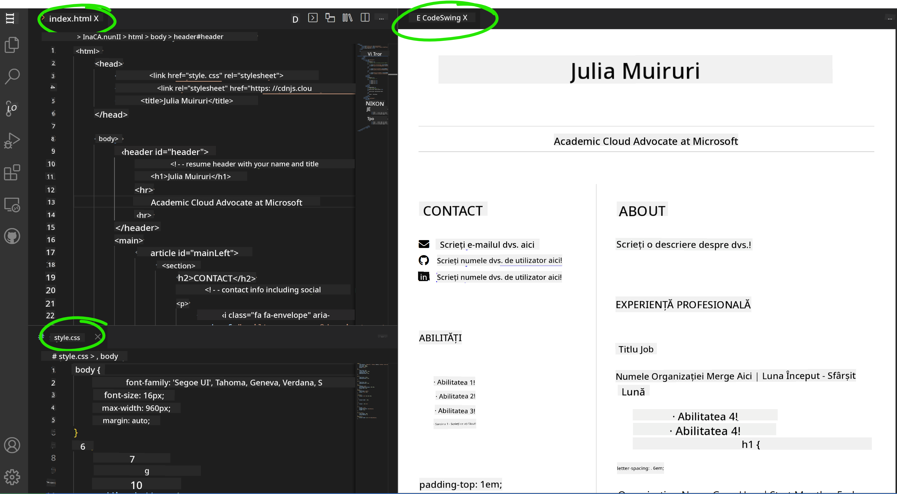

<!--
CO_OP_TRANSLATOR_METADATA:
{
  "original_hash": "effe56ba51c38d7bdfad1ea38288666b",
  "translation_date": "2025-10-24T21:56:34+00:00",
  "source_file": "8-code-editor/1-using-a-code-editor/assignment.md",
  "language_code": "ro"
}
-->
# Creează un site de CV folosind VSCode.dev

Transformă-ți perspectivele de carieră construind un site profesional de CV care să îți prezinte abilitățile și experiența într-un format interactiv și modern. În loc să trimiți PDF-uri tradiționale, imaginează-ți că oferi recrutorilor un site web elegant și receptiv care demonstrează atât calificările tale, cât și abilitățile tale de dezvoltare web.

Această activitate practică îți va pune în aplicare toate abilitățile de utilizare a VSCode.dev, în timp ce creezi ceva cu adevărat util pentru cariera ta. Vei experimenta întregul flux de lucru al dezvoltării web – de la crearea unui depozit până la implementare – totul direct din browserul tău.

Finalizând acest proiect, vei avea o prezență online profesională care poate fi ușor împărtășită cu potențiali angajatori, actualizată pe măsură ce îți dezvolți abilitățile și personalizată pentru a se potrivi brandului tău personal. Acesta este exact tipul de proiect practic care demonstrează abilități reale de dezvoltare web.

## Obiective de învățare

După finalizarea acestei activități, vei fi capabil să:

- **Creezi** și să gestionezi un proiect complet de dezvoltare web folosind VSCode.dev
- **Structurezi** un site profesional utilizând elemente semantice HTML
- **Stilizezi** layout-uri responsive cu tehnici moderne CSS
- **Implementezi** funcționalități interactive folosind tehnologii web de bază
- **Publici** un site live accesibil printr-un URL partajabil
- **Demonstrezi** cele mai bune practici de control al versiunilor pe parcursul procesului de dezvoltare

## Cerințe preliminare

Înainte de a începe această activitate, asigură-te că ai:

- Un cont GitHub (creează unul pe [github.com](https://github.com/) dacă este necesar)
- Finalizat lecția VSCode.dev care acoperă navigarea în interfață și operațiunile de bază
- Înțelegerea de bază a structurii HTML și a conceptelor de stilizare CSS

## Configurarea proiectului și crearea depozitului

Să începem prin configurarea fundației proiectului. Acest proces reflectă fluxurile de lucru reale de dezvoltare, unde proiectele încep cu inițializarea corectă a depozitului și planificarea structurii.

### Pasul 1: Creează depozitul GitHub

Configurarea unui depozit dedicat asigură că proiectul tău este organizat corespunzător și controlat în versiuni încă de la început.

1. **Accesează** [GitHub.com](https://github.com) și autentifică-te în contul tău
2. **Apasă** butonul verde "New" sau pictograma "+" din colțul din dreapta sus
3. **Denumește** depozitul `my-resume` (sau alege un nume personalizat, cum ar fi `john-smith-resume`)
4. **Adaugă** o descriere scurtă: "Site profesional de CV construit cu HTML și CSS"
5. **Selectează** "Public" pentru a face CV-ul accesibil potențialilor angajatori
6. **Bifează** "Add a README file" pentru a crea o descriere inițială a proiectului
7. **Apasă** "Create repository" pentru a finaliza configurarea

> 💡 **Sfat pentru denumirea depozitului**: Folosește nume descriptive și profesionale care indică clar scopul proiectului. Acest lucru ajută la partajarea cu angajatorii sau în timpul revizuirilor portofoliului.

### Pasul 2: Inițializează structura proiectului

Deoarece VSCode.dev necesită cel puțin un fișier pentru a deschide un depozit, vom crea fișierul nostru principal HTML direct pe GitHub înainte de a trece la editorul web.

1. **Apasă** pe linkul "creating a new file" din noul tău depozit
2. **Tastează** `index.html` ca nume de fișier
3. **Adaugă** această structură HTML inițială:

```html
<!DOCTYPE html>
<html lang="en">
<head>
    <meta charset="UTF-8">
    <meta name="viewport" content="width=device-width, initial-scale=1.0">
    <title>Your Name - Professional Resume</title>
</head>
<body>
    <h1>Your Name</h1>
    <p>Professional Resume Website</p>
</body>
</html>
```

4. **Scrie** un mesaj de commit: "Adaugă structura HTML inițială"
5. **Apasă** "Commit new file" pentru a salva modificările


**Iată ce realizează această configurare inițială:**
- **Stabilește** structura corectă a documentului HTML5 cu elemente semantice
- **Include** meta tag-ul viewport pentru compatibilitate cu designul responsive
- **Setează** un titlu descriptiv al paginii care apare în filele browserului
- **Creează** fundația pentru organizarea conținutului profesional

## Lucrul în VSCode.dev

Acum că fundația depozitului tău este stabilită, să trecem la VSCode.dev pentru munca principală de dezvoltare. Acest editor bazat pe web oferă toate instrumentele necesare pentru dezvoltarea web profesională.

### Pasul 3: Deschide proiectul în VSCode.dev

1. **Accesează** [vscode.dev](https://vscode.dev) într-o filă nouă a browserului
2. **Apasă** "Open Remote Repository" pe ecranul de bun venit
3. **Copiază** URL-ul depozitului tău de pe GitHub și lipește-l în câmpul de introducere

   Format: `https://github.com/your-username/my-resume`
   
   *Înlocuiește `your-username` cu numele tău de utilizator GitHub*

4. **Apasă** Enter pentru a încărca proiectul

✅ **Indicator de succes**: Ar trebui să vezi fișierele proiectului tău în bara laterală Explorer și `index.html` disponibil pentru editare în zona principală a editorului.


**Ce vei vedea în interfață:**
- **Bara laterală Explorer**: **Afișează** fișierele și structura folderelor depozitului tău
- **Zona editorului**: **Arată** conținutul fișierelor selectate pentru editare
- **Bara de activități**: **Oferă** acces la funcții precum Controlul sursei și Extensii
- **Bara de stare**: **Indică** starea conexiunii și informații despre ramura curentă

### Pasul 4: Construiește conținutul CV-ului tău

Înlocuiește conținutul placeholder din `index.html` cu o structură completă de CV. Acest HTML oferă fundația pentru o prezentare profesională a calificărilor tale.

<details>
<summary><b>Structură completă HTML pentru CV</b></summary>

```html
<!DOCTYPE html>
<html lang="en">
<head>
    <meta charset="UTF-8">
    <meta name="viewport" content="width=device-width, initial-scale=1.0">
    <link href="style.css" rel="stylesheet">
    <link rel="stylesheet" href="https://cdnjs.cloudflare.com/ajax/libs/font-awesome/5.15.4/css/all.min.css">
    <title>Your Name - Professional Resume</title>
</head>
<body>
    <header id="header">
        <h1>Your Full Name</h1>
        <hr>
        <p class="role">Your Professional Title</p>
        <hr>
    </header>
    
    <main>
        <article id="mainLeft">
            <section>
                <h2>CONTACT</h2>
                <p>
                    <i class="fa fa-envelope" aria-hidden="true"></i>
                    <a href="mailto:your.email@domain.com">your.email@domain.com</a>
                </p>
                <p>
                    <i class="fab fa-github" aria-hidden="true"></i>
                    <a href="https://github.com/your-username">github.com/your-username</a>
                </p>
                <p>
                    <i class="fab fa-linkedin" aria-hidden="true"></i>
                    <a href="https://linkedin.com/in/your-profile">linkedin.com/in/your-profile</a>
                </p>
            </section>
            
            <section>
                <h2>SKILLS</h2>
                <ul>
                    <li>HTML5 & CSS3</li>
                    <li>JavaScript (ES6+)</li>
                    <li>Responsive Web Design</li>
                    <li>Version Control (Git)</li>
                    <li>Problem Solving</li>
                </ul>
            </section>
            
            <section>
                <h2>EDUCATION</h2>
                <h3>Your Degree or Certification</h3>
                <p>Institution Name</p>
                <p>Start Date - End Date</p>
            </section>
        </article>
        
        <article id="mainRight">
            <section>
                <h2>ABOUT</h2>
                <p>Write a compelling summary that highlights your passion for web development, key achievements, and career goals. This section should give employers insight into your personality and professional approach.</p>
            </section>
            
            <section>
                <h2>WORK EXPERIENCE</h2>
                <div class="job">
                    <h3>Job Title</h3>
                    <p class="company">Company Name | Start Date – End Date</p>
                    <ul>
                        <li>Describe a key accomplishment or responsibility</li>
                        <li>Highlight specific skills or technologies used</li>
                        <li>Quantify impact where possible (e.g., "Improved efficiency by 25%")</li>
                    </ul>
                </div>
                
                <div class="job">
                    <h3>Previous Job Title</h3>
                    <p class="company">Previous Company | Start Date – End Date</p>
                    <ul>
                        <li>Focus on transferable skills and achievements</li>
                        <li>Demonstrate growth and learning progression</li>
                        <li>Include any leadership or collaboration experiences</li>
                    </ul>
                </div>
            </section>
            
            <section>
                <h2>PROJECTS</h2>
                <div class="project">
                    <h3>Project Name</h3>
                    <p>Brief description of what the project accomplishes and technologies used.</p>
                    <a href="#" target="_blank">View Project</a>
                </div>
            </section>
        </article>
    </main>
</body>
</html>
```
</details>

**Ghiduri de personalizare:**
- **Înlocuiește** tot textul placeholder cu informațiile tale reale
- **Ajustează** secțiunile în funcție de nivelul tău de experiență și de focusul carierei
- **Adaugă** sau elimină secțiuni după cum este necesar (ex.: Certificări, Voluntariat, Limbi străine)
- **Include** linkuri către profilurile și proiectele tale reale

### Pasul 5: Creează fișiere suport

Site-urile profesionale necesită structuri organizate de fișiere. Creează foaia de stil CSS și fișierele de configurare necesare pentru un proiect complet.

1. **Plasează cursorul** peste numele folderului proiectului în bara laterală Explorer
2. **Apasă** pictograma "New File" (📄+) care apare
3. **Creează** aceste fișiere unul câte unul:
   - `style.css` (pentru stilizare și layout)
   - `codeswing.json` (pentru configurarea extensiei de previzualizare)

**Crearea fișierului CSS (`style.css`):**

<details>
<summary><b>Stilizare CSS profesională</b></summary>

```css
/* Modern Resume Styling */
body {
    font-family: 'Segoe UI', Tahoma, Geneva, Verdana, sans-serif;
    font-size: 16px;
    line-height: 1.6;
    max-width: 960px;
    margin: 0 auto;
    padding: 20px;
    color: #333;
    background-color: #f9f9f9;
}

/* Header Styling */
header {
    text-align: center;
    margin-bottom: 3em;
    padding: 2em;
    background: linear-gradient(135deg, #667eea 0%, #764ba2 100%);
    color: white;
    border-radius: 10px;
    box-shadow: 0 4px 6px rgba(0, 0, 0, 0.1);
}

h1 {
    font-size: 3em;
    letter-spacing: 0.1em;
    margin-bottom: 0.2em;
    font-weight: 300;
}

.role {
    font-size: 1.3em;
    font-weight: 300;
    margin: 1em 0;
}

/* Main Content Layout */
main {
    display: grid;
    grid-template-columns: 35% 65%;
    gap: 3em;
    margin-top: 3em;
    background: white;
    padding: 2em;
    border-radius: 10px;
    box-shadow: 0 2px 10px rgba(0, 0, 0, 0.1);
}

/* Typography */
h2 {
    font-size: 1.4em;
    font-weight: 600;
    margin-bottom: 1em;
    color: #667eea;
    border-bottom: 2px solid #667eea;
    padding-bottom: 0.3em;
}

h3 {
    font-size: 1.1em;
    font-weight: 600;
    margin-bottom: 0.5em;
    color: #444;
}

/* Section Styling */
section {
    margin-bottom: 2.5em;
}

#mainLeft {
    border-right: 1px solid #e0e0e0;
    padding-right: 2em;
}

/* Contact Links */
section a {
    color: #667eea;
    text-decoration: none;
    transition: color 0.3s ease;
}

section a:hover {
    color: #764ba2;
    text-decoration: underline;
}

/* Icons */
i {
    margin-right: 0.8em;
    width: 20px;
    text-align: center;
    color: #667eea;
}

/* Lists */
ul {
    list-style: none;
    padding-left: 0;
}

li {
    margin: 0.5em 0;
    padding: 0.3em 0;
    position: relative;
}

li:before {
    content: "▸";
    color: #667eea;
    margin-right: 0.5em;
}

/* Work Experience */
.job, .project {
    margin-bottom: 2em;
    padding-bottom: 1.5em;
    border-bottom: 1px solid #f0f0f0;
}

.company {
    font-style: italic;
    color: #666;
    margin-bottom: 0.5em;
}

/* Responsive Design */
@media (max-width: 768px) {
    main {
        grid-template-columns: 1fr;
        gap: 2em;
    }
    
    #mainLeft {
        border-right: none;
        border-bottom: 1px solid #e0e0e0;
        padding-right: 0;
        padding-bottom: 2em;
    }
    
    h1 {
        font-size: 2.2em;
    }
    
    body {
        padding: 10px;
    }
}

/* Print Styles */
@media print {
    body {
        background: white;
        color: black;
        font-size: 12pt;
    }
    
    header {
        background: none;
        color: black;
        box-shadow: none;
    }
    
    main {
        box-shadow: none;
    }
}
```
</details>

**Crearea fișierului de configurare (`codeswing.json`):**

```json
{
    "scripts": [],
    "styles": []
}
```

**Înțelegerea caracteristicilor CSS:**
- **Folosește** CSS Grid pentru o structură de layout responsive și profesională
- **Implementează** scheme de culori moderne cu anteturi gradient
- **Include** efecte hover și tranziții line pentru interactivitate
- **Oferă** design responsive care funcționează pe toate dimensiunile dispozitivelor
- **Adaugă** stiluri prietenoase pentru imprimare pentru generarea PDF-urilor

### Pasul 6: Instalează și configurează extensii

Extensiile îmbunătățesc experiența de dezvoltare oferind capabilități de previzualizare live și instrumente de flux de lucru îmbunătățite. Extensia CodeSwing este deosebit de utilă pentru proiectele de dezvoltare web.

**Instalarea extensiei CodeSwing:**

1. **Apasă** pictograma Extensii (🧩) din Bara de activități
2. **Caută** "CodeSwing" în caseta de căutare a marketplace-ului
3. **Selectează** extensia CodeSwing din rezultatele căutării
4. **Apasă** butonul albastru "Install"


**Ce oferă CodeSwing:**
- **Permite** previzualizarea live a site-ului tău pe măsură ce editezi
- **Afișează** modificările în timp real fără a fi nevoie de reîmprospătare manuală
- **Suportă** mai multe tipuri de fișiere, inclusiv HTML, CSS și JavaScript
- **Oferă** o experiență integrată de mediu de dezvoltare

**Rezultate imediate după instalare:**
Odată ce CodeSwing este instalat, vei vedea o previzualizare live a site-ului tău de CV apărând în editor. Acest lucru îți permite să vezi exact cum arată site-ul tău pe măsură ce faci modificări.



**Înțelegerea interfeței îmbunătățite:**
- **Vizualizare divizată**: **Afișează** codul pe o parte și previzualizarea live pe cealaltă
- **Actualizări în timp real**: **Reflectă** modificările imediat ce tastezi
- **Previzualizare interactivă**: **Permite** testarea linkurilor și interacțiunilor
- **Simulare mobilă**: **Oferă** capabilități de testare a designului responsive

### Pasul 7: Controlul versiunilor și publicarea

Acum că site-ul tău de CV este complet, folosește Git pentru a-ți salva munca și a o face disponibilă online.

**Comiterea modificărilor:**

1. **Apasă** pictograma Controlul sursei (🌿) din Bara de activități
2. **Revizuiește** toate fișierele pe care le-ai creat și modificat în secțiunea "Changes"
3. **Stagiază** modificările apăsând pictograma "+" de lângă fiecare fișier
4. **Scrie** un mesaj descriptiv de commit, cum ar fi:
   - "Adaugă site complet de CV cu design responsive"
   - "Implementează stilizare profesională și structură de conținut"
5. **Apasă** bifa (✓) pentru a comite și a trimite modificările

**Exemple de mesaje de commit eficiente:**
- "Adaugă conținut și stilizare profesională pentru CV"
- "Implementează design responsive pentru compatibilitate mobilă"
- "Actualizează informațiile de contact și linkurile proiectelor"

> 💡 **Sfat profesional**: Mesajele de commit bine scrise ajută la urmărirea evoluției proiectului și demonstrează atenția la detalii – calități apreciate de angajatori.

**Accesarea site-ului publicat:**
Odată ce ai comis modificările, poți reveni la depozitul tău GitHub folosind meniul hamburger (☰) din colțul din stânga sus. Site-ul tău de CV este acum controlat în versiuni și gata de implementare sau partajare.

## Rezultate și pași următori

**Felicitări! 🎉** Ai creat cu succes un site profesional de CV folosind VSCode.dev. Proiectul tău demonstrează:
**Abilități tehnice demonstrate:**
- **Gestionarea depozitelor**: Crearea și organizarea unei structuri complete de proiect
- **Dezvoltare web**: Construirea unui site responsive folosind HTML5 modern și CSS3
- **Controlul versiunilor**: Implementarea unui flux Git corect cu commit-uri semnificative
- **Proficiență în instrumente**: Utilizarea eficientă a interfeței și sistemului de extensii VSCode.dev

**Rezultate profesionale obținute:**
- **Prezență online**: Un URL partajabil care îți prezintă calificările
- **Format modern**: O alternativă interactivă la CV-urile tradiționale în format PDF
- **Abilități demonstrabile**: Dovezi concrete ale capacităților tale de dezvoltare web
- **Actualizări ușoare**: O fundație pe care o poți îmbunătăți și personaliza continuu

### Opțiuni de implementare

Pentru a face CV-ul tău accesibil angajatorilor, ia în considerare aceste opțiuni de găzduire:

**GitHub Pages (Recomandat):**
1. Accesează Setările depozitului tău pe GitHub
2. Derulează la secțiunea "Pages"
3. Selectează "Deploy from a branch" și alege "main"
4. Site-ul tău va fi disponibil la `https://your-username.github.io/my-resume`

**Platforme alternative:**
- **Netlify**: Implementare automată cu domenii personalizate
- **Vercel**: Implementare rapidă cu funcții moderne de găzduire
- **GitHub Codespaces**: Mediu de dezvoltare cu previzualizare integrată

### Sugestii de îmbunătățire

Continuă să-ți dezvolți abilitățile adăugând aceste funcționalități:

**Îmbunătățiri tehnice:**
- **Interactivitate JavaScript**: Adaugă derulare lină sau elemente interactive
- **Comutator mod întunecat**: Implementează schimbarea temei pentru preferințele utilizatorului
- **Formular de contact**: Permite comunicarea directă cu potențialii angajatori
- **Optimizare SEO**: Adaugă meta tag-uri și date structurate pentru o vizibilitate mai bună în căutări

**Îmbunătățiri de conținut:**
- **Portofoliu de proiecte**: Linkuri către depozite GitHub și demonstrații live
- **Vizualizarea abilităților**: Creează bare de progres sau sisteme de evaluare a abilităților
- **Secțiunea de testimoniale**: Include recomandări de la colegi sau instructori
- **Integrarea unui blog**: Adaugă o secțiune de blog pentru a-ți prezenta parcursul de învățare

## Provocarea GitHub Copilot Agent 🚀

Folosește modul Agent pentru a finaliza următoarea provocare:

**Descriere:** Îmbunătățește site-ul tău de CV cu funcționalități avansate care să demonstreze capacități profesionale de dezvoltare web și principii moderne de design.

**Provocare:** Pe baza site-ului tău de CV existent, implementează aceste funcționalități avansate:
1. Adaugă un comutator de temă întunecată/luminoasă cu tranziții line
2. Creează o secțiune interactivă de abilități cu bare de progres animate
3. Implementează un formular de contact cu validare
4. Adaugă o secțiune de portofoliu de proiecte cu efecte hover și ferestre pop-up
5. Include o secțiune de blog cu cel puțin 3 postări despre parcursul tău de învățare
6. Optimizează pentru SEO cu meta tag-uri corespunzătoare, date structurate și performanță
7. Publică site-ul îmbunătățit folosind GitHub Pages sau Netlify
8. Documentează toate funcționalitățile noi în README.md cu capturi de ecran

Site-ul tău îmbunătățit ar trebui să demonstreze stăpânirea practicilor moderne de dezvoltare web, inclusiv designul responsive, interactivitatea JavaScript și fluxurile de lucru profesionale de implementare.

## Extinderea provocării

Ești pregătit să îți dezvolți și mai mult abilitățile? Încearcă aceste provocări avansate:

**📱 Redesign orientat pe mobil:** Reconstruiește complet site-ul folosind o abordare orientată pe mobil cu CSS Grid și Flexbox

**
- **Accesibilitate**: Învață liniile directoare WCAG pentru un design web incluziv  
- **Performanță**: Explorează instrumente precum Lighthouse pentru optimizare  
- **SEO**: Înțelege fundamentele optimizării pentru motoarele de căutare  

**Dezvoltare Profesională:**  
- **Construirea Portofoliului**: Creează proiecte suplimentare pentru a demonstra abilități diverse  
- **Open Source**: Contribuie la proiecte existente pentru a câștiga experiență în colaborare  
- **Networking**: Distribuie site-ul tău de prezentare în comunități de dezvoltatori pentru feedback  
- **Învățare Continuă**: Rămâi la curent cu tendințele și tehnologiile din dezvoltarea web  

---

**Următorii Pași:** Distribuie site-ul tău de prezentare prietenilor, familiei sau mentorilor pentru feedback. Folosește sugestiile lor pentru a îmbunătăți și a perfecționa designul. Amintește-ți, acest proiect nu este doar un CV – este o demonstrație a progresului tău ca dezvoltator web!

---

**Declinare de responsabilitate**:  
Acest document a fost tradus folosind serviciul de traducere AI [Co-op Translator](https://github.com/Azure/co-op-translator). Deși ne străduim să asigurăm acuratețea, vă rugăm să fiți conștienți că traducerile automate pot conține erori sau inexactități. Documentul original în limba sa maternă ar trebui considerat sursa autoritară. Pentru informații critice, se recomandă traducerea profesională realizată de un specialist uman. Nu ne asumăm responsabilitatea pentru eventualele neînțelegeri sau interpretări greșite care pot apărea din utilizarea acestei traduceri.