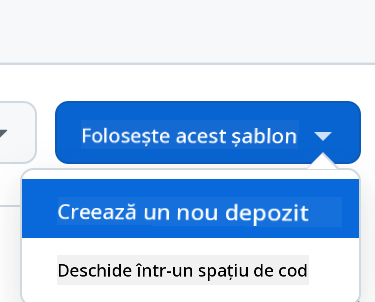

<!--
CO_OP_TRANSLATOR_METADATA:
{
  "original_hash": "11cf36165c243947b6cd85b88cf6faa6",
  "translation_date": "2025-09-01T17:01:42+00:00",
  "source_file": "9-chat-project/README.md",
  "language_code": "ro"
}
-->
# Proiect Chat

Acest proiect de chat arată cum să construiești un Asistent Chat folosind Modelele GitHub.

Iată cum arată proiectul finalizat:


Un pic de context: construirea asistenților de chat folosind AI generativ este o modalitate excelentă de a începe să înveți despre inteligența artificială. Ce vei învăța este cum să integrezi AI generativ într-o aplicație web pe parcursul acestei lecții. Să începem.

## Conectarea la AI generativ

Pentru partea de backend, folosim Modelele GitHub. Este un serviciu excelent care îți permite să folosești AI gratuit. Accesează playground-ul său și obține codul corespunzător limbajului de backend ales. Iată cum arată la [GitHub Models Playground](https://github.com/marketplace/models/azure-openai/gpt-4o-mini/playground)


Așa cum am spus, selectează fila "Code" și runtime-ul ales.


### Utilizarea Python

În acest caz, selectăm Python, ceea ce înseamnă că alegem acest cod:

```python
"""Run this model in Python

> pip install openai
"""
import os
from openai import OpenAI

# To authenticate with the model you will need to generate a personal access token (PAT) in your GitHub settings. 
# Create your PAT token by following instructions here: https://docs.github.com/en/authentication/keeping-your-account-and-data-secure/managing-your-personal-access-tokens
client = OpenAI(
    base_url="https://models.github.ai/inference",
    api_key=os.environ["GITHUB_TOKEN"],
)

response = client.chat.completions.create(
    messages=[
        {
            "role": "system",
            "content": "",
        },
        {
            "role": "user",
            "content": "What is the capital of France?",
        }
    ],
    model="openai/gpt-4o-mini",
    temperature=1,
    max_tokens=4096,
    top_p=1
)

print(response.choices[0].message.content)
```

Să curățăm puțin acest cod pentru a fi reutilizabil:

```python
def call_llm(prompt: str, system_message: str):
    response = client.chat.completions.create(
        messages=[
            {
                "role": "system",
                "content": system_message,
            },
            {
                "role": "user",
                "content": prompt,
            }
        ],
        model="openai/gpt-4o-mini",
        temperature=1,
        max_tokens=4096,
        top_p=1
    )

    return response.choices[0].message.content
```

Cu această funcție `call_llm`, putem acum să luăm un prompt și un prompt de sistem, iar funcția va returna rezultatul.

### Personalizarea Asistentului AI

Dacă dorești să personalizezi asistentul AI, poți specifica cum vrei să se comporte prin completarea promptului de sistem astfel:

```python
call_llm("Tell me about you", "You're Albert Einstein, you only know of things in the time you were alive")
```

## Expunerea printr-un API Web

Excelent, am terminat partea de AI, să vedem cum putem integra aceasta într-un API Web. Pentru API-ul Web, alegem să folosim Flask, dar orice framework web ar trebui să fie bun. Să vedem codul pentru aceasta:

### Utilizarea Python

```python
# api.py
from flask import Flask, request, jsonify
from llm import call_llm
from flask_cors import CORS

app = Flask(__name__)
CORS(app)   # *   example.com

@app.route("/", methods=["GET"])
def index():
    return "Welcome to this API. Call POST /hello with 'message': 'my message' as JSON payload"


@app.route("/hello", methods=["POST"])
def hello():
    # get message from request body  { "message": "do this taks for me" }
    data = request.get_json()
    message = data.get("message", "")

    response = call_llm(message, "You are a helpful assistant.")
    return jsonify({
        "response": response
    })

if __name__ == "__main__":
    app.run(host="0.0.0.0", port=5000)
```

Aici, creăm un API Flask și definim o rută implicită "/" și "/chat". Ultima este destinată să fie utilizată de frontend-ul nostru pentru a transmite întrebări către backend.

Pentru a integra *llm.py*, iată ce trebuie să facem:

- Importă funcția `call_llm`:

   ```python
   from llm import call_llm
   from flask import Flask, request
   ```

- Apelează funcția din ruta "/chat":

   ```python
   @app.route("/hello", methods=["POST"])
   def hello():
      # get message from request body  { "message": "do this taks for me" }
      data = request.get_json()
      message = data.get("message", "")

      response = call_llm(message, "You are a helpful assistant.")
      return jsonify({
         "response": response
      })
   ```

   Aici analizăm cererea primită pentru a prelua proprietatea `message` din corpul JSON. Ulterior, apelăm LLM cu acest apel:

   ```python
   response = call_llm(message, "You are a helpful assistant")

   # return the response as JSON
   return jsonify({
      "response": response 
   })
   ```

Excelent, acum am făcut ce era necesar.

## Configurarea Cors

Trebuie să menționăm că am configurat ceva numit CORS, partajarea resurselor între origini. Acest lucru înseamnă că, deoarece backend-ul și frontend-ul nostru vor rula pe porturi diferite, trebuie să permitem frontend-ului să apeleze backend-ul.

### Utilizarea Python

Există un fragment de cod în *api.py* care configurează acest lucru:

```python
from flask_cors import CORS

app = Flask(__name__)
CORS(app)   # *   example.com
```

În prezent, este configurat să permită "*" ceea ce înseamnă toate originile, și asta este puțin nesigur. Ar trebui să restricționăm acest lucru odată ce trecem la producție.

## Rulează proiectul

Pentru a rula proiectul, trebuie să pornești mai întâi backend-ul și apoi frontend-ul.

### Utilizarea Python

Ok, avem *llm.py* și *api.py*, cum putem face să funcționeze cu un backend? Ei bine, sunt două lucruri pe care trebuie să le facem:

- Instalează dependențele:

   ```sh
   cd backend
   python -m venv venv
   source ./venv/bin/activate

   pip install openai flask flask-cors openai
   ```

- Pornește API-ul

   ```sh
   python api.py
   ```

   Dacă ești în Codespaces, trebuie să mergi la Ports în partea de jos a editorului, să dai clic dreapta pe el și să selectezi "Port Visibility" și să alegi "Public".

### Lucrează la un frontend

Acum că avem un API funcțional, să creăm un frontend pentru acesta. Un frontend minim pe care îl vom îmbunătăți treptat. Într-un folder *frontend*, creează următoarele:

```text
backend/
frontend/
index.html
app.js
styles.css
```

Să începem cu **index.html**:

```html
<html>
    <head>
        <link rel="stylesheet" href="styles.css">
    </head>
    <body>
      <form>
        <textarea id="messages"></textarea>
        <input id="input" type="text" />
        <button type="submit" id="sendBtn">Send</button>  
      </form>  
      <script src="app.js" />
    </body>
</html>    
```

Acesta este minimul absolut necesar pentru a susține o fereastră de chat, deoarece constă într-un textarea unde mesajele vor fi afișate, un input pentru a scrie mesajul și un buton pentru a trimite mesajul către backend. Să vedem următorul cod JavaScript în *app.js*

**app.js**

```js
// app.js

(function(){
  // 1. set up elements  
  const messages = document.getElementById("messages");
  const form = document.getElementById("form");
  const input = document.getElementById("input");

  const BASE_URL = "change this";
  const API_ENDPOINT = `${BASE_URL}/hello`;

  // 2. create a function that talks to our backend
  async function callApi(text) {
    const response = await fetch(API_ENDPOINT, {
      method: "POST",
      headers: { "Content-Type": "application/json" },
      body: JSON.stringify({ message: text })
    });
    let json = await response.json();
    return json.response;
  }

  // 3. add response to our textarea
  function appendMessage(text, role) {
    const el = document.createElement("div");
    el.className = `message ${role}`;
    el.innerHTML = text;
    messages.appendChild(el);
  }

  // 4. listen to submit events
  form.addEventListener("submit", async(e) => {
    e.preventDefault();
   // someone clicked the button in the form
   
   // get input
   const text = input.value.trim();

   appendMessage(text, "user")

   // reset it
   input.value = '';

   const reply = await callApi(text);

   // add to messages
   appendMessage(reply, "assistant");

  })
})();
```

Să parcurgem codul pe secțiuni:

- 1) Aici obținem o referință la toate elementele pe care le vom folosi mai târziu în cod.
- 2) În această secțiune, creăm o funcție care folosește metoda încorporată `fetch` pentru a apela backend-ul nostru.
- 3) `appendMessage` ajută la adăugarea răspunsurilor, precum și a ceea ce tastezi ca utilizator.
- 4) Aici ascultăm evenimentul de submit și citim câmpul de input, plasăm mesajul utilizatorului în textarea, apelăm API-ul și afișăm răspunsul în textarea.

Să vedem stilizarea, unde poți fi creativ și să faci să arate cum dorești, dar iată câteva sugestii:

**styles.css**

```
.message {
    background: #222;
    box-shadow: 0 0 0 10px orange;
    padding: 10px:
    margin: 5px;
}

.message.user {
    background: blue;
}

.message.assistant {
    background: grey;
} 
```

Cu aceste trei clase, vei stiliza mesajele diferit în funcție de sursa lor: asistent sau utilizator. Dacă vrei să te inspiri, verifică folderul `solution/frontend/styles.css`.

### Schimbă URL-ul de bază

Există un lucru pe care nu l-am setat aici și acesta este `BASE_URL`, care nu este cunoscut până când backend-ul tău este pornit. Pentru a-l seta:

- Dacă rulezi API-ul local, ar trebui să fie ceva de genul `http://localhost:5000`.
- Dacă rulezi în Codespaces, ar trebui să arate ceva de genul "[name]app.github.dev".

## Temă

Creează propriul folder *project* cu conținutul astfel:

```text
project/
  frontend/
    index.html
    app.js
    styles.css
  backend/
    ...
```

Copiază conținutul din ceea ce a fost instruit mai sus, dar simte-te liber să personalizezi după preferințe.

## Soluție

[Soluție](./solution/README.md)

## Bonus

Încearcă să schimbi personalitatea asistentului AI.

### Pentru Python

Când apelezi `call_llm` în *api.py*, poți schimba al doilea argument cu ceea ce dorești, de exemplu:

```python
call_llm(message, "You are Captain Picard")
```

### Frontend

Schimbă și CSS-ul și textul după preferințe, astfel încât să faci modificări în *index.html* și *styles.css*.

## Rezumat

Excelent, ai învățat de la zero cum să creezi un asistent personal folosind AI. Am făcut acest lucru folosind Modelele GitHub, un backend în Python și un frontend în HTML, CSS și JavaScript.

## Configurare cu Codespaces

- Navighează la: [Repo Web Dev For Beginners](https://github.com/microsoft/Web-Dev-For-Beginners)
- Creează dintr-un template (asigură-te că ești autentificat în GitHub) în colțul din dreapta sus:

    

- Odată ajuns în repo-ul tău, creează un Codespace:

    

    Acesta ar trebui să pornească un mediu cu care poți lucra acum.

---

**Declinare de responsabilitate**:  
Acest document a fost tradus folosind serviciul de traducere AI [Co-op Translator](https://github.com/Azure/co-op-translator). Deși ne străduim să asigurăm acuratețea, vă rugăm să fiți conștienți că traducerile automate pot conține erori sau inexactități. Documentul original în limba sa natală ar trebui considerat sursa autoritară. Pentru informații critice, se recomandă traducerea profesională realizată de un specialist uman. Nu ne asumăm responsabilitatea pentru eventualele neînțelegeri sau interpretări greșite care pot apărea din utilizarea acestei traduceri.