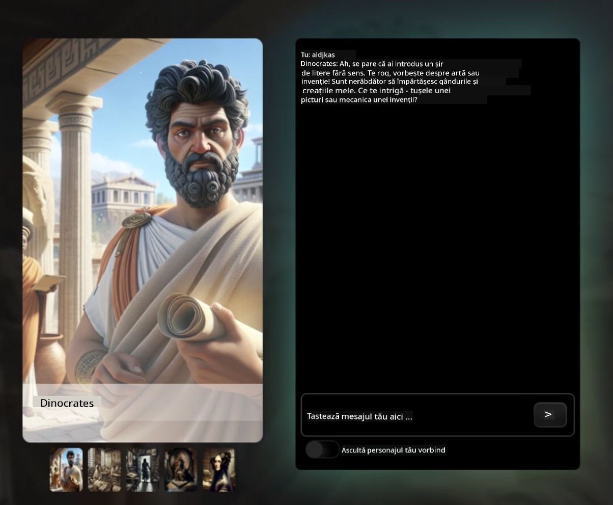
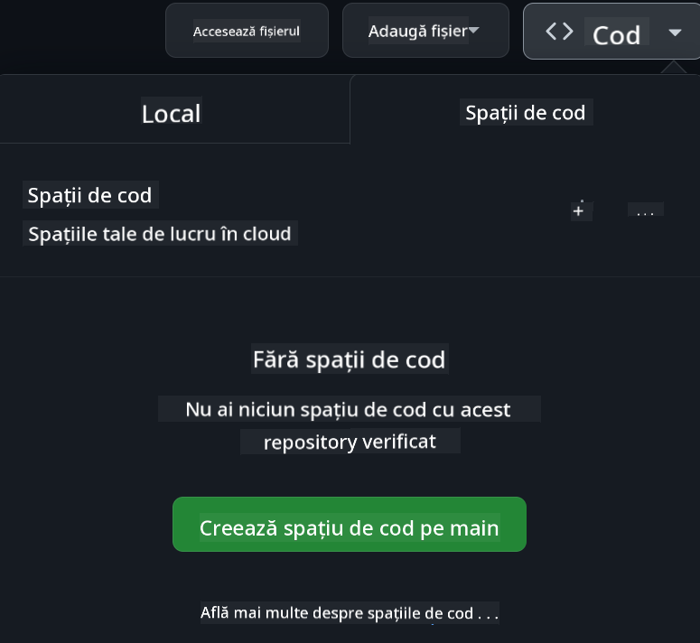

<!--
CO_OP_TRANSLATOR_METADATA:
{
  "original_hash": "8b9d0562ea649b6012d1a67acc630681",
  "translation_date": "2025-10-24T21:52:36+00:00",
  "source_file": "README.md",
  "language_code": "ro"
}
-->
[](https://github.com/microsoft/Web-Dev-For-Beginners/blob/master/LICENSE)
[](https://GitHub.com/microsoft/Web-Dev-For-Beginners/graphs/contributors/)
[](https://GitHub.com/microsoft/Web-Dev-For-Beginners/issues/)
[](https://GitHub.com/microsoft/Web-Dev-For-Beginners/pulls/)
[](http://makeapullrequest.com)

[](https://GitHub.com/microsoft/Web-Dev-For-Beginners/watchers/)
[](https://GitHub.com/microsoft/Web-Dev-For-Beginners/network/)
[](https://GitHub.com/microsoft/Web-Dev-For-Beginners/stargazers/)

[](https://discord.gg/zxKYvhSnVp?WT.mc_id=academic-000002-leestott)

# Dezvoltare Web pentru Începători - Un Curriculum

Învață fundamentele dezvoltării web cu cursul nostru cuprinzător de 12 săptămâni oferit de Microsoft Cloud Advocates. Fiecare dintre cele 24 de lecții explorează JavaScript, CSS și HTML prin proiecte practice precum terarii, extensii de browser și jocuri spațiale. Implică-te în teste, discuții și teme practice. Îmbunătățește-ți abilitățile și optimizează-ți retenția cunoștințelor cu pedagogia noastră bazată pe proiecte. Începe-ți călătoria în programare astăzi!

Alătură-te comunității Azure AI Foundry Discord

[](https://discord.com/invite/ByRwuEEgH4)

Urmează acești pași pentru a începe să folosești aceste resurse:
1. **Forkează Repositorul**: Click [](https://GitHub.com/microsoft/Web-Dev-For-Beginners/fork)
2. **Clonează Repositorul**:   `git clone https://github.com/microsoft/Web-Dev-For-Beginners.git`
3. [**Alătură-te comunității Azure AI Foundry Discord și întâlnește experți și alți dezvoltatori**](https://discord.com/invite/ByRwuEEgH4)

### 🌐 Suport Multi-Limbă

#### Suportat prin GitHub Action (Automat & Mereu Actualizat)

[Arabic](../ar/README.md) | [Bengali](../bn/README.md) | [Bulgarian](../bg/README.md) | [Burmese (Myanmar)](../my/README.md) | [Chinese (Simplified)](../zh/README.md) | [Chinese (Traditional, Hong Kong)](../hk/README.md) | [Chinese (Traditional, Macau)](../mo/README.md) | [Chinese (Traditional, Taiwan)](../tw/README.md) | [Croatian](../hr/README.md) | [Czech](../cs/README.md) | [Danish](../da/README.md) | [Dutch](../nl/README.md) | [Estonian](../et/README.md) | [Finnish](../fi/README.md) | [French](../fr/README.md) | [German](../de/README.md) | [Greek](../el/README.md) | [Hebrew](../he/README.md) | [Hindi](../hi/README.md) | [Hungarian](../hu/README.md) | [Indonesian](../id/README.md) | [Italian](../it/README.md) | [Japanese](../ja/README.md) | [Korean](../ko/README.md) | [Lithuanian](../lt/README.md) | [Malay](../ms/README.md) | [Marathi](../mr/README.md) | [Nepali](../ne/README.md) | [Norwegian](../no/README.md) | [Persian (Farsi)](../fa/README.md) | [Polish](../pl/README.md) | [Portuguese (Brazil)](../br/README.md) | [Portuguese (Portugal)](../pt/README.md) | [Punjabi (Gurmukhi)](../pa/README.md) | [Romanian](./README.md) | [Russian](../ru/README.md) | [Serbian (Cyrillic)](../sr/README.md) | [Slovak](../sk/README.md) | [Slovenian](../sl/README.md) | [Spanish](../es/README.md) | [Swahili](../sw/README.md) | [Swedish](../sv/README.md) | [Tagalog (Filipino)](../tl/README.md) | [Tamil](../ta/README.md) | [Thai](../th/README.md) | [Turkish](../tr/README.md) | [Ukrainian](../uk/README.md) | [Urdu](../ur/README.md) | [Vietnamese](../vi/README.md)

**Dacă dorești să fie suportate alte limbi, acestea sunt listate [aici](https://github.com/Azure/co-op-translator/blob/main/getting_started/supported-languages.md)**

[](https://open.vscode.dev/microsoft/Web-Dev-For-Beginners)

#### 🧑‍🎓 _Ești student?_

Vizitează [**pagina Student Hub**](https://docs.microsoft.com/learn/student-hub/?WT.mc_id=academic-77807-sagibbon) unde vei găsi resurse pentru începători, pachete pentru studenți și chiar modalități de a obține un voucher pentru certificare gratuită. Aceasta este pagina pe care vrei să o salvezi la favorite și să o verifici periodic, deoarece conținutul este actualizat lunar.

### 📣 Anunț - Noi provocări cu modul Agent GitHub Copilot de completat!

Provocare nouă adăugată, caută "Provocarea Agentului GitHub Copilot 🚀" în majoritatea capitolelor. Este o nouă provocare pentru tine de completat folosind GitHub Copilot și modul Agent. Dacă nu ai folosit modul Agent înainte, acesta este capabil nu doar să genereze text, ci și să creeze și să editeze fișiere, să ruleze comenzi și multe altele.

### 📣 Anunț - _Proiect nou de construit folosind AI Generativ_

Un nou proiect de asistent AI tocmai a fost adăugat, verifică [proiectul](./09-chat-project/README.md)

### 📣 Anunț - _Curriculum nou_ despre AI Generativ pentru JavaScript tocmai a fost lansat

Nu rata noul nostru curriculum despre AI Generativ!

Vizitează [https://aka.ms/genai-js-course](https://aka.ms/genai-js-course) pentru a începe!


- Lecții care acoperă totul, de la bazele AI la RAG.
- Interacționează cu personaje istorice folosind GenAI și aplicația noastră companion.
- Narațiune distractivă și captivantă, vei călători în timp!



Fiecare lecție include o temă de completat, o verificare a cunoștințelor și o provocare pentru a te ghida în învățarea subiectelor precum:
- Crearea și optimizarea prompturilor
- Generarea de aplicații text și imagine
- Aplicații de căutare

Vizitează [https://aka.ms/genai-js-course](../../[https:/aka.ms/genai-js-course) pentru a începe!


## 🌱 Începe

> **Profesori**, am [inclus câteva sugestii](for-teachers.md) despre cum să folosiți acest curriculum. Ne-ar plăcea să primim feedback-ul vostru [în forumul nostru de discuții](https://github.com/microsoft/Web-Dev-For-Beginners/discussions/categories/teacher-corner)!

**[Cursanți](https://aka.ms/student-page/?WT.mc_id=academic-77807-sagibbon)**, pentru fiecare lecție, începeți cu un test pre-lectură și continuați cu citirea materialului de curs, completarea diferitelor activități și verificați-vă înțelegerea cu testul post-lectură.

Pentru a îmbunătăți experiența de învățare, conectați-vă cu colegii pentru a lucra împreună la proiecte! Discuțiile sunt încurajate în [forum-ul nostru de discuții](https://github.com/microsoft/Web-Dev-For-Beginners/discussions), unde echipa noastră de moderatori va fi disponibilă pentru a răspunde întrebărilor voastre.

Pentru a vă continua educația, recomandăm cu tărie explorarea [Microsoft Learn](https://learn.microsoft.com/users/wirelesslife/collections/p1ddcy5jwy0jkm?WT.mc_id=academic-77807-sagibbon) pentru materiale de studiu suplimentare.

### 📋 Configurarea mediului de lucru

Acest curriculum are un mediu de dezvoltare gata de utilizare! Pe măsură ce începeți, puteți alege să rulați curriculum-ul într-un [Codespace](https://github.com/features/codespaces/) (_un mediu bazat pe browser, fără instalări necesare_), sau local pe computerul vostru folosind un editor de text precum [Visual Studio Code](https://code.visualstudio.com/?WT.mc_id=academic-77807-sagibbon).

#### Creați propriul repository
Pentru a vă salva cu ușurință munca, este recomandat să creați propria copie a acestui repository. Puteți face acest lucru făcând clic pe butonul **Use this template** din partea de sus a paginii. Acest lucru va crea un nou repository în contul vostru GitHub cu o copie a curriculum-ului.

Urmați acești pași:
1. **Forkează Repositorul**: Faceți clic pe butonul "Fork" din colțul din dreapta sus al acestei pagini.
2. **Clonează Repositorul**:   `git clone https://github.com/microsoft/Web-Dev-For-Beginners.git`

#### Rularea curriculum-ului într-un Codespace

În copia voastră a acestui repository pe care ați creat-o, faceți clic pe butonul **Code** și selectați **Open with Codespaces**. Acest lucru va crea un nou Codespace pentru a lucra.



#### Rularea curriculum-ului local pe computerul vostru

Pentru a rula acest curriculum local pe computerul vostru, veți avea nevoie de un editor de text, un browser și un instrument de linie de comandă. Prima noastră lecție, [Introducere în Limbaje de Programare și Instrumente de Lucru](../../1-getting-started-lessons/1-intro-to-programming-languages), vă va ghida prin diverse opțiuni pentru fiecare dintre aceste instrumente, astfel încât să puteți selecta ceea ce funcționează cel mai bine pentru voi.

Recomandarea noastră este să folosiți [Visual Studio Code](https://code.visualstudio.com/?WT.mc_id=academic-77807-sagibbon) ca editor, care are și un [Terminal](https://code.visualstudio.com/docs/terminal/basics/?WT.mc_id=academic-77807-sagibbon) integrat. Puteți descărca Visual Studio Code [aici](https://code.visualstudio.com/?WT.mc_id=academic-77807-sagibbon).

1. Clonați repository-ul pe computerul vostru. Puteți face acest lucru făcând clic pe butonul **Code** și copiind URL-ul:

    [CodeSpace](./images/createcodespace.png)

    Apoi, deschideți [Terminal](https://code.visualstudio.com/docs/terminal/basics/?WT.mc_id=academic-77807-sagibbon) în [Visual Studio Code](https://code.visualstudio.com/?WT.mc_id=academic-77807-sagibbon) și rulați următoarea comandă, înlocuind `<your-repository-url>` cu URL-ul pe care tocmai l-ați copiat:

    ```bash 
    git clone <your-repository-url>
    ```

2. Deschideți folderul în Visual Studio Code. Puteți face acest lucru făcând clic pe **File** > **Open Folder** și selectând folderul pe care tocmai l-ați clonat.

> Extensii recomandate pentru Visual Studio Code:
>
> * [Live Server](https://marketplace.visualstudio.com/items?itemName=ritwickdey.LiveServer&WT.mc_id=academic-77807-sagibbon) - pentru a previzualiza paginile HTML în Visual Studio Code  
> * [Copilot](https://marketplace.visualstudio.com/items?itemName=GitHub.copilot&WT.mc_id=academic-77807-sagibbon) - pentru a te ajuta să scrii cod mai rapid  

## 📂 Fiecare lecție include:

- schiță opțională  
- videoclip suplimentar opțional  
- quiz de încălzire înainte de lecție  
- lecție scrisă  
- pentru lecțiile bazate pe proiect, ghiduri pas cu pas despre cum să construiești proiectul  
- verificări de cunoștințe  
- o provocare  
- lectură suplimentară  
- temă  
- [quiz după lecție](https://ff-quizzes.netlify.app/web/)  

> **O notă despre quiz-uri**: Toate quiz-urile sunt incluse în folderul Quiz-app, 48 de quiz-uri în total, fiecare având trei întrebări. Acestea sunt disponibile [aici](https://ff-quizzes.netlify.app/web/). Aplicația de quiz poate fi rulată local sau implementată pe Azure; urmează instrucțiunile din folderul `quiz-app`.

## 🗃️ Lecții

|     |                       Numele Proiectului                       |                            Concepte Învățate                             | Obiective de Învățare                                                                                                                 |                                                         Lecția Linkată                                                          |         Autor          |
| :-: | :------------------------------------------------------------: | :-----------------------------------------------------------------------: | ------------------------------------------------------------------------------------------------------------------------------------- | :-----------------------------------------------------------------------------------------------------------------------------: | :---------------------: |
| 01  |                     Începutul                      |           Introducere în Programare și Instrumentele Utilizate           | Învață bazele majorității limbajelor de programare și despre software-ul care ajută dezvoltatorii profesioniști să-și facă treaba     | [Introducere în Limbaje de Programare și Instrumentele Utilizate](./1-getting-started-lessons/1-intro-to-programming-languages/README.md) |         Jasmine         |
| 02  |                     Începutul                      |             Bazele GitHub, inclusiv lucrul în echipă                     | Cum să folosești GitHub în proiectul tău, cum să colaborezi cu alții pe o bază de cod                                                 |                            [Introducere în GitHub](./1-getting-started-lessons/2-github-basics/README.md)                             |          Floor          |
| 03  |                     Începutul                      |                             Accesibilitate                              | Învață bazele accesibilității web                                                                                                     |                       [Fundamentele Accesibilității](./1-getting-started-lessons/3-accessibility/README.md)                       |       Christopher       |
| 04  |                        Bazele JS                         |                         Tipuri de Date în JavaScript                          | Bazele tipurilor de date în JavaScript                                                                                               |                                       [Tipuri de Date](./2-js-basics/1-data-types/README.md)                                        |         Jasmine         |
| 05  |                        Bazele JS                         |                         Funcții și Metode                          | Învață despre funcții și metode pentru a gestiona fluxul logic al unei aplicații                                                      |                              [Funcții și Metode](./2-js-basics/2-functions-methods/README.md)                               | Jasmine și Christopher |
| 06  |                        Bazele JS                         |                        Luarea Deciziilor cu JS                        | Învață cum să creezi condiții în codul tău folosind metode de luare a deciziilor                                                      |                                 [Luarea Deciziilor](./2-js-basics/3-making-decisions/README.md)                                  |         Jasmine         |
| 07  |                        Bazele JS                         |                            Tablouri și Buclă                            | Lucrează cu date folosind tablouri și bucle în JavaScript                                                                             |                                   [Tablouri și Buclă](./2-js-basics/4-arrays-loops/README.md)                                    |         Jasmine         |
| 08  |       [Terariu](./3-terrarium/solution/README.md)       |                            HTML în Practică                            | Construiește HTML-ul pentru a crea un terariu online, concentrându-te pe crearea unui layout                                          |                                 [Introducere în HTML](./3-terrarium/1-intro-to-html/README.md)                                 |           Jen           |
| 09  |       [Terariu](./3-terrarium/solution/README.md)       |                            CSS în Practică                             | Construiește CSS-ul pentru a stiliza terariul online, concentrându-te pe bazele CSS, inclusiv pe crearea unei pagini responsive       |                                  [Introducere în CSS](./3-terrarium/2-intro-to-css/README.md)                                  |           Jen           |
| 10  |            [Terariu](./3-terrarium/solution/README.md)            |                 Închideri JavaScript, manipularea DOM                  | Construiește JavaScript-ul pentru a face terariul să funcționeze ca o interfață drag/drop, concentrându-te pe închideri și manipularea DOM |                  [Închideri JavaScript, manipularea DOM](./3-terrarium/3-intro-to-DOM-and-closures/README.md)                   |           Jen           |
| 11  |          [Joc de Tastare](./4-typing-game/solution/README.md)          |                          Construiește un Joc de Tastare                           | Învață cum să folosești evenimentele tastaturii pentru a conduce logica aplicației tale JavaScript                                    |                                [Programare Bazată pe Evenimente](./4-typing-game/typing-game/README.md)                                |       Christopher       |
| 12  | [Extensie Browser Verde](./5-browser-extension/solution/README.md) |                         Lucrul cu Browsere                          | Învață cum funcționează browserele, istoria lor și cum să construiești primele elemente ale unei extensii de browser                  |                               [Despre Browsere](./5-browser-extension/1-about-browsers/README.md)                                |           Jen           |
| 13  | [Extensie Browser Verde](./5-browser-extension/solution/README.md) | Construirea unui formular, apelarea unui API și stocarea variabilelor în memoria locală | Construiește elementele JavaScript ale extensiei de browser pentru a apela un API folosind variabile stocate în memoria locală       |                [API-uri, Formulare și Memoria Locală](./5-browser-extension/2-forms-browsers-local-storage/README.md)                 |           Jen           |
| 14  | [Extensie Browser Verde](./5-browser-extension/solution/README.md) |          Procese de fundal în browser, performanța web          | Folosește procesele de fundal ale browserului pentru a gestiona pictograma extensiei; învață despre performanța web și unele optimizări |             [Sarcini de Fundal și Performanță](./5-browser-extension/3-background-tasks-and-performance/README.md)              |           Jen           |
| 15  |           [Joc Spațial](./6-space-game/solution/README.md)           |             Dezvoltare Avansată de Jocuri cu JavaScript             | Învață despre Moștenire folosind atât Clase, cât și Compoziție și modelul Pub/Sub, în pregătirea pentru construirea unui joc          |                      [Introducere în Dezvoltarea Avansată de Jocuri](./6-space-game/1-introduction/README.md)                       |          Chris          |
| 16  |           [Joc Spațial](./6-space-game/solution/README.md)           |                           Desenarea pe canvas                            | Învață despre API-ul Canvas, utilizat pentru a desena elemente pe ecran                                                              |                                [Desenarea pe Canvas](./6-space-game/2-drawing-to-canvas/README.md)                                |          Chris          |
| 17  |           [Joc Spațial](./6-space-game/solution/README.md)           |                   Mișcarea elementelor pe ecran                    | Descoperă cum elementele pot obține mișcare folosind coordonatele carteziene și API-ul Canvas                                        |                           [Mișcarea Elementelor](./6-space-game/3-moving-elements-around/README.md)                           |          Chris          |
| 18  |           [Joc Spațial](./6-space-game/solution/README.md)           |                          Detectarea coliziunilor                           | Fă ca elementele să se ciocnească și să reacționeze între ele folosind apăsări de taste și oferă o funcție de cooldown pentru performanța jocului |                              [Detectarea Coliziunilor](./6-space-game/4-collision-detection/README.md)                              |          Chris          |
| 19  |           [Joc Spațial](./6-space-game/solution/README.md)           |                             Păstrarea scorului                              | Efectuează calcule matematice bazate pe starea și performanța jocului                                                                |                                    [Păstrarea Scorului](./6-space-game/5-keeping-score/README.md)                                    |          Chris          |
| 20  |           [Joc Spațial](./6-space-game/solution/README.md)           |                     Terminarea și reluarea jocului                     | Învață despre terminarea și reluarea jocului, inclusiv curățarea resurselor și resetarea valorilor variabile                         |                                [Condiția de Terminare](./6-space-game/6-end-condition/README.md)                                 |          Chris          |
| 21  |         [Aplicație Bancară](./7-bank-project/solution/README.md)          |                 Șabloane HTML și Rute într-o Aplicație Web                 | Învață cum să creezi structura arhitecturii unui site web cu mai multe pagini folosind rutare și șabloane HTML                       |                            [Șabloane HTML și Rute](./7-bank-project/1-template-route/README.md)                             |          Yohan          |
| 22  |         [Aplicație Bancară](./7-bank-project/solution/README.md)          |                  Construirea unui Formular de Login și Înregistrare                   | Învață despre construirea formularelor și gestionarea rutinei de validare                                                            |                                           [Formulare](./7-bank-project/2-forms/README.md)                                           |          Yohan          |
| 23  |         [Aplicație Bancară](./7-bank-project/solution/README.md)          |                   Metode de Preluare și Utilizare a Datelor                   | Cum circulă datele în și din aplicația ta, cum să le preiei, să le stochezi și să le elimini                                         |                                            [Date](./7-bank-project/3-data/README.md)                                            |          Yohan          |
| 24  |         [Aplicație Bancară](./7-bank-project/solution/README.md)          |                      Concepte de Gestionare a Stării                      | Învață cum aplicația ta păstrează starea și cum să o gestionezi programatic                                                          |                                [Gestionarea Stării](./7-bank-project/4-state-management/README.md)                                |          Yohan          |
| 25 | [Browser/VScode Code](../../8-code-editor) | Lucrul cu VScode | Învață cum să folosești un editor de cod | [Utilizarea Editorului de Cod VScode](./8-code-editor/1-using-a-code-editor/README.md) | Chris |
| 26 | [Asistenți AI](./9-chat-project/README.md) | Lucrul cu AI | Învață cum să construiești propriul asistent AI | [Proiect Asistent AI](./9-chat-project/README.md) | Chris |

## 🏫 Pedagogie

Curriculum-ul nostru este conceput având în vedere două principii pedagogice cheie:  
* învățarea bazată pe proiecte  
* quiz-uri frecvente  

Programul predă fundamentele JavaScript, HTML și CSS, precum și cele mai recente instrumente și tehnici utilizate de dezvoltatorii web de astăzi. Studenții vor avea oportunitatea de a dezvolta experiență practică construind un joc de tastare, un terariu virtual, o extensie de browser eco-friendly, un joc în stil space-invader și o aplicație bancară pentru afaceri. Până la sfârșitul seriei, studenții vor avea o înțelegere solidă a dezvoltării web.

> 🎓 Poți parcurge primele câteva lecții din acest curriculum ca un [Learn Path](https://docs.microsoft.com/learn/paths/web-development-101/?WT.mc_id=academic-77807-sagibbon) pe Microsoft Learn!

Prin asigurarea că conținutul se aliniază cu proiectele, procesul devine mai captivant pentru studenți, iar retenția conceptelor va fi augmentată. De asemenea, am scris câteva lecții introductive în JavaScript pentru a introduce concepte, însoțite de un videoclip din colecția "[Beginners Series to: JavaScript](https://channel9.msdn.com/Series/Beginners-Series-to-JavaScript/?WT.mc_id=academic-77807-sagibbon)" de tutoriale video, unii dintre autori contribuind la acest curriculum.

În plus, un quiz cu miză redusă înainte de o clasă setează intenția studentului spre învățarea unui subiect, în timp ce un al doilea quiz după clasă asigură o retenție suplimentară. Acest curriculum a fost conceput să fie flexibil și distractiv și poate fi parcurs în întregime sau parțial. Proiectele încep mici și devin din ce în ce mai complexe până la sfârșitul ciclului de 12 săptămâni.

Deși am evitat intenționat introducerea framework-urilor JavaScript pentru a ne concentra pe abilitățile de bază necesare unui dezvoltator web înainte de adoptarea unui framework, un pas bun următor după finalizarea acestui curriculum ar fi învățarea despre Node.js printr-o altă colecție de videoclipuri: "[Beginner Series to: Node.js](https://channel9.msdn.com/Series/Beginners-Series-to-Nodejs/?WT.mc_id=academic-77807-sagibbon)".

> Vizitează [Codul nostru de Conduită](CODE_OF_CONDUCT.md) și ghidurile de [Contribuire](CONTRIBUTING.md). Apreciem feedback-ul tău constructiv!


## 🧭 Acces offline

Poți rula această documentație offline folosind [Docsify](https://docsify.js.org/#/). Clonează acest repo, [instalează Docsify](https://docsify.js.org/#/quickstart) pe mașina ta locală, apoi în folderul rădăcină al acestui repo, tastează `docsify serve`. Website-ul va fi servit pe portul 3000 pe localhost-ul tău: `localhost:3000`.

## 📘 PDF

Un PDF cu toate lecțiile poate fi găsit [aici](https://microsoft.github.io/Web-Dev-For-Beginners/pdf/readme.pdf).


## 🎒 Alte Cursuri

Echipa noastră produce și alte cursuri! Verifică:

### Azure / Edge / MCP / Agenți  
[](https://github.com/microsoft/AZD-for-beginners?WT.mc_id=academic-105485-koreyst)
[](https://github.com/microsoft/edgeai-for-beginners?WT.mc_id=academic-105485-koreyst)  
[](https://github.com/microsoft/mcp-for-beginners?WT.mc_id=academic-105485-koreyst)  
[](https://github.com/microsoft/ai-agents-for-beginners?WT.mc_id=academic-105485-koreyst)  

---

### Seria AI Generativ  
[](https://github.com/microsoft/generative-ai-for-beginners?WT.mc_id=academic-105485-koreyst)  
[-9333EA?style=for-the-badge&labelColor=E5E7EB&color=9333EA)](https://github.com/microsoft/Generative-AI-for-beginners-dotnet?WT.mc_id=academic-105485-koreyst)  
[-C084FC?style=for-the-badge&labelColor=E5E7EB&color=C084FC)](https://github.com/microsoft/generative-ai-for-beginners-java?WT.mc_id=academic-105485-koreyst)  
[-E879F9?style=for-the-badge&labelColor=E5E7EB&color=E879F9)](https://github.com/microsoft/generative-ai-with-javascript?WT.mc_id=academic-105485-koreyst)  

---

### Învățare de Bază  
[](https://aka.ms/ml-beginners?WT.mc_id=academic-105485-koreyst)  
[](https://aka.ms/datascience-beginners?WT.mc_id=academic-105485-koreyst)  
[](https://aka.ms/ai-beginners?WT.mc_id=academic-105485-koreyst)  
[](https://github.com/microsoft/Security-101?WT.mc_id=academic-96948-sayoung)  
[](https://aka.ms/webdev-beginners?WT.mc_id=academic-105485-koreyst)  
[](https://aka.ms/iot-beginners?WT.mc_id=academic-105485-koreyst)  
[](https://github.com/microsoft/xr-development-for-beginners?WT.mc_id=academic-105485-koreyst)  

---

### Seria Copilot  
[](https://aka.ms/GitHubCopilotAI?WT.mc_id=academic-105485-koreyst)  
[](https://github.com/microsoft/mastering-github-copilot-for-dotnet-csharp-developers?WT.mc_id=academic-105485-koreyst)  
[](https://github.com/microsoft/CopilotAdventures?WT.mc_id=academic-105485-koreyst)  
<!-- CO-OP TRANSLATOR ALTE CURSURI FINAL -->

## Obținerea Ajutorului  

Dacă întâmpinați dificultăți sau aveți întrebări despre crearea aplicațiilor AI, alăturați-vă:  

[](https://aka.ms/foundry/discord)  

Dacă aveți feedback despre produs sau întâmpinați erori în timpul dezvoltării, vizitați:  

[](https://aka.ms/foundry/forum)  

## Licență  

Acest depozit este licențiat sub licența MIT. Consultați fișierul [LICENSE](../../LICENSE) pentru mai multe informații.  

---

**Declinare de responsabilitate**:  
Acest document a fost tradus folosind serviciul de traducere AI [Co-op Translator](https://github.com/Azure/co-op-translator). Deși ne străduim să asigurăm acuratețea, vă rugăm să fiți conștienți că traducerile automate pot conține erori sau inexactități. Documentul original în limba sa natală ar trebui considerat sursa autoritară. Pentru informații critice, se recomandă traducerea profesională realizată de un specialist uman. Nu ne asumăm responsabilitatea pentru eventualele neînțelegeri sau interpretări greșite care pot apărea din utilizarea acestei traduceri.