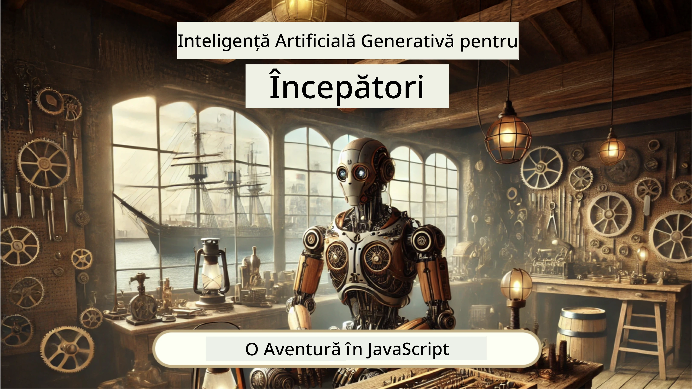
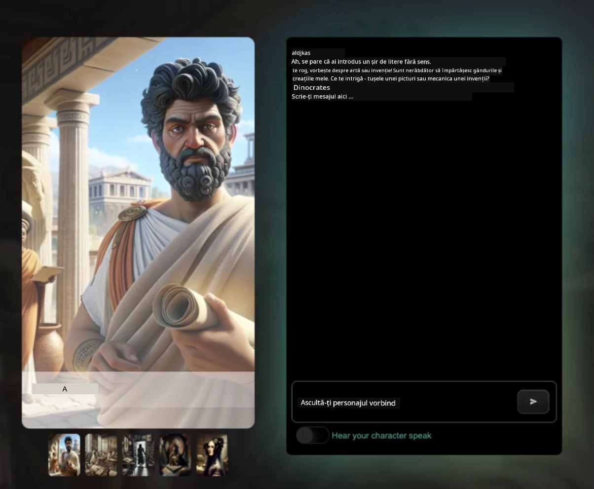
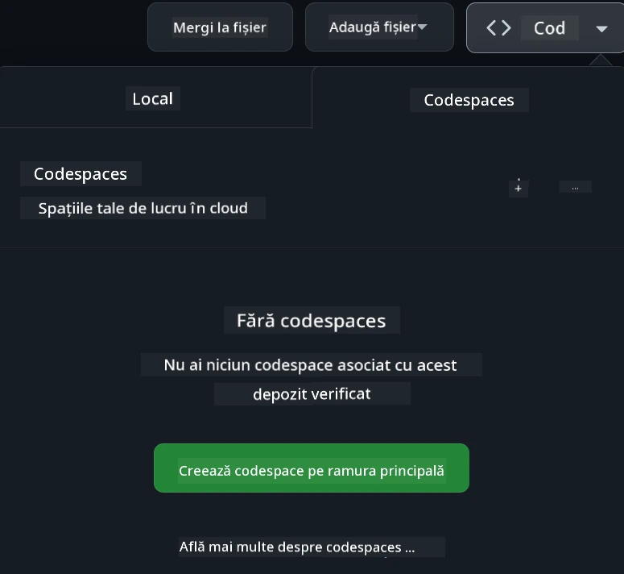

<!--
CO_OP_TRANSLATOR_METADATA:
{
  "original_hash": "fea3a0fceb8ad86fd640c09cf63a2aac",
  "translation_date": "2026-01-07T05:21:44+00:00",
  "source_file": "README.md",
  "language_code": "ro"
}
-->
[](https://github.com/microsoft/Web-Dev-For-Beginners/blob/master/LICENSE)
[](https://GitHub.com/microsoft/Web-Dev-For-Beginners/graphs/contributors/)
[](https://GitHub.com/microsoft/Web-Dev-For-Beginners/issues/)
[](https://GitHub.com/microsoft/Web-Dev-For-Beginners/pulls/)
[](http://makeapullrequest.com)

[](https://GitHub.com/microsoft/Web-Dev-For-Beginners/watchers/)
[](https://GitHub.com/microsoft/Web-Dev-For-Beginners/network/)
[](https://GitHub.com/microsoft/Web-Dev-For-Beginners/stargazers/)

[](https://discord.gg/nTYy5BXMWG)

# Dezvoltare Web pentru Începători - Un Curriculum

Învață elementele fundamentale ale dezvoltării web cu cursul nostru cuprinzător de 12 săptămâni oferit de Microsoft Cloud Advocates. Fiecare dintre cele 24 de lecții explorează JavaScript, CSS și HTML prin proiecte practice precum terarii, extensii pentru browser și jocuri spațiale. Participă la chestionare, discuții și teme practice. Îmbunătățește-ți abilitățile și optimizează reținerea cunoștințelor cu pedagogia noastră eficientă bazată pe proiecte. Începe-ți călătoria în programare astăzi!

Alătură-te comunității Discord Azure AI Foundry

[](https://discord.gg/nTYy5BXMWG)

Urmează acești pași pentru a începe să folosești aceste resurse:
1. **Fork Repository-ul**: Click pe [](https://GitHub.com/microsoft/Web-Dev-For-Beginners/fork)
2. **Clonează Repository-ul**:   `git clone https://github.com/microsoft/Web-Dev-For-Beginners.git`
3. [**Alătură-te Discord Azure AI Foundry și întâlnește experți și alți dezvoltatori**](https://discord.com/invite/ByRwuEEgH4)

### 🌐 Suport Multilingv

#### Susținut prin GitHub Action (Automat și Întotdeauna Actualizat)

<!-- CO-OP TRANSLATOR LANGUAGES TABLE START -->
[Arabic](../ar/README.md) | [Bengali](../bn/README.md) | [Bulgarian](../bg/README.md) | [Burmese (Myanmar)](../my/README.md) | [Chinese (Simplified)](../zh/README.md) | [Chinese (Traditional, Hong Kong)](../hk/README.md) | [Chinese (Traditional, Macau)](../mo/README.md) | [Chinese (Traditional, Taiwan)](../tw/README.md) | [Croatian](../hr/README.md) | [Czech](../cs/README.md) | [Danish](../da/README.md) | [Dutch](../nl/README.md) | [Estonian](../et/README.md) | [Finnish](../fi/README.md) | [French](../fr/README.md) | [German](../de/README.md) | [Greek](../el/README.md) | [Hebrew](../he/README.md) | [Hindi](../hi/README.md) | [Hungarian](../hu/README.md) | [Indonesian](../id/README.md) | [Italian](../it/README.md) | [Japanese](../ja/README.md) | [Kannada](../kn/README.md) | [Korean](../ko/README.md) | [Lithuanian](../lt/README.md) | [Malay](../ms/README.md) | [Malayalam](../ml/README.md) | [Marathi](../mr/README.md) | [Nepali](../ne/README.md) | [Nigerian Pidgin](../pcm/README.md) | [Norwegian](../no/README.md) | [Persian (Farsi)](../fa/README.md) | [Polish](../pl/README.md) | [Portuguese (Brazil)](../br/README.md) | [Portuguese (Portugal)](../pt/README.md) | [Punjabi (Gurmukhi)](../pa/README.md) | [Romanian](./README.md) | [Russian](../ru/README.md) | [Serbian (Cyrillic)](../sr/README.md) | [Slovak](../sk/README.md) | [Slovenian](../sl/README.md) | [Spanish](../es/README.md) | [Swahili](../sw/README.md) | [Swedish](../sv/README.md) | [Tagalog (Filipino)](../tl/README.md) | [Tamil](../ta/README.md) | [Telugu](../te/README.md) | [Thai](../th/README.md) | [Turkish](../tr/README.md) | [Ukrainian](../uk/README.md) | [Urdu](../ur/README.md) | [Vietnamese](../vi/README.md)

> **Preferi să Clonazi Local?**

> Acest repository include peste 50 de traduceri, sporind semnificativ dimensiunea descărcării. Pentru a clona fără traduceri, folosește sparse checkout:
> ```bash
> git clone --filter=blob:none --sparse https://github.com/microsoft/Web-Dev-For-Beginners.git
> cd Web-Dev-For-Beginners
> git sparse-checkout set --no-cone '/*' '!translations' '!translated_images'
> ```
> Acest lucru îți oferă tot ce ai nevoie pentru a parcurge cursul cu o descărcare mult mai rapidă.
<!-- CO-OP TRANSLATOR LANGUAGES TABLE END -->

**Dacă dorești să fie susținute și alte limbi de traducere, acestea sunt listate [aici](https://github.com/Azure/co-op-translator/blob/main/getting_started/supported-languages.md)**

[](https://open.vscode.dev/microsoft/Web-Dev-For-Beginners)

#### 🧑‍🎓 _Ești student?_

Vizitează [**pagina Student Hub**](https://docs.microsoft.com/learn/student-hub/?WT.mc_id=academic-77807-sagibbon) unde vei găsi resurse de început, pachete pentru studenți și chiar modalități de a obține un voucher gratuit pentru certificare. Aceasta este pagina pe care dorești să o adaugi la favorite și să o verifici din când în când, deoarece schimbăm conținutul lunar.

### 📣 Anunț - Provocări noi pentru modul Agent GitHub Copilot de completat!

Provocare nouă adăugată, caută "GitHub Copilot Agent Challenge 🚀" în majoritatea capitolelor. Este o provocare nouă pe care să o completezi folosind GitHub Copilot și modul Agent. Dacă nu ai folosit modul Agent până acum, acesta este capabil nu doar să genereze text, ci și să creeze și editeze fișiere, să ruleze comenzi și mai mult.

### 📣 Anunț - _Proiect Nou de construit folosind Generative AI_ 

Proiectul nou Asistent AI a fost adăugat recent, vezi [proiectul](./9-chat-project/README.md)

### 📣 Anunț - _Curriculum Nou_ despre Generative AI pentru JavaScript a fost lansat

Nu rata noul nostru curriculum pentru Generative AI!

Vizitează [https://aka.ms/genai-js-course](https://aka.ms/genai-js-course) pentru a începe!



- Lecții acoperind totul, de la elementele de bază până la RAG.
- Interacționează cu personaje istorice folosind GenAI și aplicația noastră companion.
- Narațiune distractivă și captivantă, vei călători în timp!




Fiecare lecție include o temă de completat, o verificare a cunoștințelor și o provocare pentru a te ghida în învățarea unor subiecte precum:
- Prompting și ingineria prompturilor
- Generarea de aplicații text și imagine
- Aplicații de căutare

Vizitează [https://aka.ms/genai-js-course](../../[https:/aka.ms/genai-js-course) pentru a începe!


## 🌱 Începe

> **Profesori**, am inclus [câteva sugestii](for-teachers.md) despre cum să folosiți acest curriculum. Ne-ar plăcea să primim feedback-ul vostru [în forumul nostru de discuții](https://github.com/microsoft/Web-Dev-For-Beginners/discussions/categories/teacher-corner)!

**[Elevi](https://aka.ms/student-page/?WT.mc_id=academic-77807-sagibbon)**, pentru fiecare lecție, începeți cu un chestionar pre-lecture și urmați parcurgerea materialului didactic, completarea diverselor activități și verificați-vă înțelegerea cu chestionarul post-lecture.

Pentru a vă îmbunătăți experiența de învățare, conectați-vă cu colegii pentru a lucra împreună la proiecte! Discuțiile sunt încurajate în [forumul nostru de discuții](https://github.com/microsoft/Web-Dev-For-Beginners/discussions) unde echipa noastră de moderatori va fi disponibilă să vă răspundă la întrebări.

Pentru a vă extinde educația, recomandăm cu căldură explorarea [Microsoft Learn](https://learn.microsoft.com/users/wirelesslife/collections/p1ddcy5jwy0jkm?WT.mc_id=academic-77807-sagibbon) pentru materiale de studiu suplimentare.

### 📋 Configurarea mediului de lucru

Acest curriculum are un mediu de dezvoltare gata de utilizare! Pe măsură ce începi, poți alege să rulezi curriculum-ul într-un [Codespace](https://github.com/features/codespaces/) (_un mediu bazat pe browser, fără instalări necesare_), sau local pe calculatorul tău folosind un editor de text precum [Visual Studio Code](https://code.visualstudio.com/?WT.mc_id=academic-77807-sagibbon).

#### Creează-ți repository-ul
Pentru a-ți salva munca mai ușor, este recomandat să îți creezi propria copie a acestui repository. Poți face asta dând click pe butonul **Use this template** din partea de sus a paginii. Aceasta va crea un nou repository în contul tău GitHub cu o copie a curriculumului.

Urmărește acești pași:
1. **Fork Repository-ul**: Click pe butonul "Fork" din colțul din dreapta sus al acestei pagini.
2. **Clonează Repository-ul**:   `git clone https://github.com/microsoft/Web-Dev-For-Beginners.git`

#### Rularea curriculum-ului într-un Codespace

În copia ta de repository pe care ai creat-o, dă click pe butonul **Code** și selectează **Open with Codespaces**. Aceasta va crea un nou Codespace pentru tine unde să lucrezi.



#### Rularea curriculum-ului local pe calculatorul tău

Pentru a rula acest curriculum local pe calculator, vei avea nevoie de un editor de text, un browser și un instrument de linie de comandă. Prima lecție, [Introducere în limbajele de programare și uneltele meseriei](../../1-getting-started-lessons/1-intro-to-programming-languages), te va ghida prin diverse opțiuni pentru fiecare dintre aceste unelte, pentru a putea selecta ce funcționează cel mai bine pentru tine.

Recomandarea noastră este să folosești [Visual Studio Code](https://code.visualstudio.com/?WT.mc_id=academic-77807-sagibbon) ca editor, care de asemenea are un [Terminal](https://code.visualstudio.com/docs/terminal/basics/?WT.mc_id=academic-77807-sagibbon) integrat. Poți descărca Visual Studio Code [aici](https://code.visualstudio.com/?WT.mc_id=academic-77807-sagibbon).


1. Clonează repository-ul pe calculatorul tău. Poți face asta dând click pe butonul **Code** și copiază URL-ul:

    [CodeSpace](./images/createcodespace.png)
    Apoi, deschide [Terminal](https://code.visualstudio.com/docs/terminal/basics/?WT.mc_id=academic-77807-sagibbon) în cadrul [Visual Studio Code](https://code.visualstudio.com/?WT.mc_id=academic-77807-sagibbon) și execută următoarea comandă, înlocuind `<your-repository-url>` cu URL-ul pe care tocmai l-ai copiat:

    ```bash 
    git clone <your-repository-url>
    ```

2. Deschide folderul în Visual Studio Code. Poți face asta făcând clic pe **File** > **Open Folder** și selectând folderul pe care tocmai l-ai clonat.


>  Extensii Visual Studio Code recomandate:
>
> * [Live Server](https://marketplace.visualstudio.com/items?itemName=ritwickdey.LiveServer&WT.mc_id=academic-77807-sagibbon) - pentru a previzualiza pagini HTML în Visual Studio Code
> * [Copilot](https://marketplace.visualstudio.com/items?itemName=GitHub.copilot&WT.mc_id=academic-77807-sagibbon) - pentru a te ajuta să scrii cod mai rapid

## 📂 Fiecare lecție include:

- schiță opțională
- videoclip suplimentar opțional
- quiz de încălzire înainte de lecție
- lecție scrisă
- pentru lecțiile bazate pe proiect, ghiduri pas cu pas despre cum să construiești proiectul
- verificări ale cunoștințelor
- o provocare
- lectură suplimentară
- temă
- [quiz după lecție](https://ff-quizzes.netlify.app/web/)

> **O notă despre quizuri**: Toate quizurile sunt conținute în folderul Quiz-app, 48 de quizuri în total, fiecare cu câte trei întrebări. Sunt disponibile [aici](https://ff-quizzes.netlify.app/web/); aplicația de quiz poate fi rulată local sau implementată pe Azure; urmează instrucțiunile din folderul `quiz-app`.

## 🗃️ Lecții

|     |                       Numele Proiectului                       |                            Concepte Învățate                            | Obiectivele de Învățare                                                                                                            |                                                         Lecția Legată                                                          |         Autor          |
| :-: | :------------------------------------------------------: | :--------------------------------------------------------------------: | --------------------------------------------------------------------------------------------------------------------------------- | :----------------------------------------------------------------------------------------------------------------------------: | :---------------------: |
| 01  |                     Început                              |           Introducere în programare și uneltele meseriei             | Învață bazele fundamentale din spatele celor mai multe limbaje de programare și despre software care ajută dezvoltatorii profesioniști să-și facă munca | [Introducere în limbaje de programare și unelte ale meseriei](./1-getting-started-lessons/1-intro-to-programming-languages/README.md) |         Jasmine         |
| 02  |                     Început                              |             Bazele GitHub, inclusiv lucrul în echipă                  | Cum să folosești GitHub în proiectul tău, cum să colaborezi cu alții pe o bază de cod                                             |                            [Introducere în GitHub](./1-getting-started-lessons/2-github-basics/README.md)                            |          Floor          |
| 03  |                     Început                              |                             Accesibilitate                            | Învață bazele accesibilității web                                                                                                  |                       [Fundamentele accesibilității](./1-getting-started-lessons/3-accessibility/README.md)                       |       Christopher       |
| 04  |                        Bazele JS                         |                         Tipuri de date în JavaScript                  | Bazele tipurilor de date în JavaScript                                                                                             |                                       [Tipuri de date](./2-js-basics/1-data-types/README.md)                                        |         Jasmine         |
| 05  |                        Bazele JS                         |                         Funcții și metode                            | Învață despre funcții și metode pentru a gestiona fluxul logicii unei aplicații                                                    |                              [Funcții și Metode](./2-js-basics/2-functions-methods/README.md)                                       | Jasmine și Christopher  |
| 06  |                        Bazele JS                         |                        Luarea deciziilor cu JS                        | Învață cum să creezi condiții în codul tău folosind metode de luare a deciziilor                                                  |                                 [Luarea deciziilor](./2-js-basics/3-making-decisions/README.md)                                   |         Jasmine         |
| 07  |                        Bazele JS                         |                            Arrays și Loops                            | Lucrează cu date folosind arrays și bucle în JavaScript                                                                           |                                   [Arrays și Loops](./2-js-basics/4-arrays-loops/README.md)                                      |         Jasmine         |
| 08  |       [Terrarium](./3-terrarium/solution/README.md)      |                           HTML în practică                           | Construiește HTML-ul pentru a crea un terariu online, concentrându-se pe crearea unui layout                                        |                                 [Introducere în HTML](./3-terrarium/1-intro-to-html/README.md)                                   |           Jen           |
| 09  |       [Terrarium](./3-terrarium/solution/README.md)      |                           CSS în practică                            | Construiește CSS-ul pentru a stiliza terariul online, concentrându-se pe bazele CSS, inclusiv realizarea unei pagini responsive    |                                  [Introducere în CSS](./3-terrarium/2-intro-to-css/README.md)                                   |           Jen           |
| 10  |            [Terrarium](./3-terrarium/solution/README.md)           |                Închideri JavaScript, manipularea DOM                 | Construiește JavaScript pentru a face terariul să funcționeze ca o interfață drag-and-drop, concentrându-se pe închideri și manipularea DOM |                  [Închideri JS, manipularea DOM](./3-terrarium/3-intro-to-DOM-and-closures/README.md)                              |           Jen           |
| 11  |          [Typing Game](./4-typing-game/solution/README.md)          |                          Construirea unui joc de tastare             | Învață cum să folosești evenimentele de tastatură pentru a conduce logica aplicației tale JavaScript                              |                                [Programare bazată pe evenimente](./4-typing-game/typing-game/README.md)                              |       Christopher       |
| 12  | [Green Browser Extension](./5-browser-extension/solution/README.md) |                         Lucrul cu browserele                         | Învață cum funcționează browserele, istoria lor și cum să creezi elementele de început ale unei extensii pentru browser           |                               [Despre browsere](./5-browser-extension/1-about-browsers/README.md)                                 |           Jen           |
| 13  | [Green Browser Extension](./5-browser-extension/solution/README.md) | Construirea unui formular, apelarea unui API și stocarea variabilelor în stocarea locală | Construiește elementele JavaScript ale extensiei tale pentru browser pentru a apela un API folosind variabile stocate local        |                [API-uri, formulare și stocare locală](./5-browser-extension/2-forms-browsers-local-storage/README.md)             |           Jen           |
| 14  | [Green Browser Extension](./5-browser-extension/solution/README.md) |          Procese de fundal în browser, performanța web              | Folosește procesele de fundal ale browserului pentru a gestiona iconița extensiei; învață despre performanța web și unele optimizări pentru a îmbunătăți performanța |             [Sarcini de fundal și performanță](./5-browser-extension/3-background-tasks-and-performance/README.md)               |           Jen           |
| 15  |           [Space Game](./6-space-game/solution/README.md)           |             Dezvoltare avansată a jocurilor cu JavaScript           | Învață despre moștenire folosind atât Clase cât și Compoziție și modelul Pub/Sub, ca pregătire pentru construirea unui joc          |                      [Introducere în dezvoltare avansată de jocuri](./6-space-game/1-introduction/README.md)                       |          Chris          |
| 16  |           [Space Game](./6-space-game/solution/README.md)           |                           Desen pe canvas                            | Învață despre API-ul Canvas, folosit pentru a desena elemente pe ecran                                                            |                                [Desen pe Canvas](./6-space-game/2-drawing-to-canvas/README.md)                                   |          Chris          |
| 17  |           [Space Game](./6-space-game/solution/README.md)           |                   Mutarea elementelor pe ecran                       | Descoperă cum pot elementele să capete mișcare folosind coordonatele carteziene și API-ul Canvas                                  |                           [Mutarea elementelor](./6-space-game/3-moving-elements-around/README.md)                              |          Chris          |
| 18  |           [Space Game](./6-space-game/solution/README.md)           |                          Detectarea coliziunilor                     | Fă elementele să se ciocnească și să reacționeze unele la altele folosind apăsări de taste și oferă o funcție de cooldown pentru a asigura performanța jocului |                              [Detectarea coliziunilor](./6-space-game/4-collision-detection/README.md)                            |          Chris          |
| 19  |           [Space Game](./6-space-game/solution/README.md)           |                             Păstrarea scorului                       | Efectuează calcule matematice bazate pe starea și performanța jocului                                                             |                                    [Păstrarea scorului](./6-space-game/5-keeping-score/README.md)                               |          Chris          |
| 20  |           [Space Game](./6-space-game/solution/README.md)           |                     Terminarea și repornirea jocului                 | Învață despre terminarea și repornirea jocului, incluzând curățarea resurselor și resetarea valorilor variabile                    |                                [Condiția de terminare](./6-space-game/6-end-condition/README.md)                                 |          Chris          |
| 21  |         [Banking App](./7-bank-project/solution/README.md)          |                 Șabloane HTML și rute într-o aplicație web          | Învață cum să creezi scheletul arhitecturii unui site multipagină folosind rutare și șabloane HTML                                 |                            [Șabloane HTML și rute](./7-bank-project/1-template-route/README.md)                                 |          Yohan          |
| 22  |         [Banking App](./7-bank-project/solution/README.md)          |                  Construirea unui formular de autentificare și înregistrare | Învață despre construirea formularelor și gestionarea rutinei de validare                                                        |                                           [Formulare](./7-bank-project/2-forms/README.md)                                       |          Yohan          |
| 23  |         [Banking App](./7-bank-project/solution/README.md)          |                   Metode de preluare și utilizare a datelor         | Cum circulă datele în și din aplicația ta, cum să le preiei, stochezi și elimini                                                  |                                            [Date](./7-bank-project/3-data/README.md)                                          |          Yohan          |
| 24  |         [Banking App](./7-bank-project/solution/README.md)          |                      Concepte de gestionare a stării                | Învață cum aplicația ta păstrează starea și cum să o gestionezi programatic                                                     |                                [Gestionarea stării](./7-bank-project/4-state-management/README.md)                              |          Yohan          |
| 25  | [Browser/VScode Code](../../8-code-editor) | Lucru cu VScode | Învață cum să folosești un editor de cod | [Folosește editorul de cod VScode](./8-code-editor/1-using-a-code-editor/README.md) | Chris |
| 26  | [AI Assistants](./9-chat-project/README.md) | Lucru cu AI | Învață cum să construiești propriul tău asistent AI | [Proiect asistent AI](./9-chat-project/README.md) | Chris |

## 🏫 Pedagogie

Curricula noastră este proiectată având în vedere două principii pedagogice-cheie:
* învățare bazată pe proiecte
* quizuri frecvente

Programul predă fundamentele JavaScript, HTML și CSS, precum și cele mai noi unelte și tehnici folosite de dezvoltatorii web din ziua de azi. Studenții vor avea ocazia să dobândească experiență practică construind un joc de tastare, un terariu virtual, o extensie pentru browser eco-friendly, un joc în stil Space Invaders și o aplicație bancară pentru afaceri. La finalul seriei, studenții vor avea o înțelegere solidă a dezvoltării web.

> 🎓 Poți urma primele câteva lecții din această curriculum ca un [Learn Path](https://docs.microsoft.com/learn/paths/web-development-101/?WT.mc_id=academic-77807-sagibbon) pe Microsoft Learn!

Asigurând că conținutul se aliniază cu proiectele, procesul devine mai captivant pentru studenți și retenția conceptelor va fi augmentată. Am scris de asemenea mai multe lecții introductive în bazele JavaScript pentru a introduce conceptele, însoțite de un videoclip din colecția „[Beginners Series to: JavaScript](https://channel9.msdn.com/Series/Beginners-Series-to-JavaScript/?WT.mc_id=academic-77807-sagibbon)”, al cărui autori au contribuit și la această curriculă.

În plus, un quiz cu miză redusă înainte de clasă setează intenția studentului către învățarea subiectului, iar un al doilea quiz după clasă asigură o retenție mai bună. Această curriculă a fost concepută să fie flexibilă și distractivă și poate fi urmată integral sau parțial. Proiectele încep mici și devin din ce în ce mai complexe până la finalul ciclului de 12 săptămâni.

Deși am evitat intenționat introducerea framework-urilor JavaScript pentru a ne concentra pe abilitățile de bază necesare ca dezvoltator web înainte de a adopta un framework, un pas următor bun după această curriculă este să înveți despre Node.js printr-o altă colecție de videoclipuri: „[Beginner Series to: Node.js](https://channel9.msdn.com/Series/Beginners-Series-to-Nodejs/?WT.mc_id=academic-77807-sagibbon)”.

> Vizitează ghidurile noastre [Cod de conduită](CODE_OF_CONDUCT.md) și [Contribuire](CONTRIBUTING.md). Apreciem feedback-ul tău constructiv!


## 🧭 Acces offline

Poți rula această documentație offline folosind [Docsify](https://docsify.js.org/#/). Fă fork la acest repo, [instalează Docsify](https://docsify.js.org/#/quickstart) pe mașina ta locală și apoi în folderul rădăcină al acestui repo tastează `docsify serve`. Site-ul va fi servit pe portul 3000 pe localhost-ul tău: `localhost:3000`.

## 📘 PDF

Un PDF cu toate lecțiile poate fi găsit [aici](https://microsoft.github.io/Web-Dev-For-Beginners/pdf/readme.pdf).


## 🎒 Alte cursuri
Echipa noastră produce și alte cursuri! Consultați:

<!-- CO-OP TRANSLATOR OTHER COURSES START -->
### LangChain
[](https://aka.ms/langchain4j-for-beginners)
[](https://aka.ms/langchainjs-for-beginners?WT.mc_id=m365-94501-dwahlin)

---

### Azure / Edge / MCP / Agenți
[](https://github.com/microsoft/AZD-for-beginners?WT.mc_id=academic-105485-koreyst)
[](https://github.com/microsoft/edgeai-for-beginners?WT.mc_id=academic-105485-koreyst)
[](https://github.com/microsoft/mcp-for-beginners?WT.mc_id=academic-105485-koreyst)
[](https://github.com/microsoft/ai-agents-for-beginners?WT.mc_id=academic-105485-koreyst)

---
 
### Seria Inteligenței Generative
[](https://github.com/microsoft/generative-ai-for-beginners?WT.mc_id=academic-105485-koreyst)
[-9333EA?style=for-the-badge&labelColor=E5E7EB&color=9333EA)](https://github.com/microsoft/Generative-AI-for-beginners-dotnet?WT.mc_id=academic-105485-koreyst)
[-C084FC?style=for-the-badge&labelColor=E5E7EB&color=C084FC)](https://github.com/microsoft/generative-ai-for-beginners-java?WT.mc_id=academic-105485-koreyst)
[-E879F9?style=for-the-badge&labelColor=E5E7EB&color=E879F9)](https://github.com/microsoft/generative-ai-with-javascript?WT.mc_id=academic-105485-koreyst)

---
 
### Învățare de bază
[](https://aka.ms/ml-beginners?WT.mc_id=academic-105485-koreyst)
[](https://aka.ms/datascience-beginners?WT.mc_id=academic-105485-koreyst)
[](https://aka.ms/ai-beginners?WT.mc_id=academic-105485-koreyst)
[](https://github.com/microsoft/Security-101?WT.mc_id=academic-96948-sayoung)
[](https://aka.ms/webdev-beginners?WT.mc_id=academic-105485-koreyst)
[](https://aka.ms/iot-beginners?WT.mc_id=academic-105485-koreyst)
[](https://github.com/microsoft/xr-development-for-beginners?WT.mc_id=academic-105485-koreyst)

---
 
### Seria Copilot
[](https://aka.ms/GitHubCopilotAI?WT.mc_id=academic-105485-koreyst)
[](https://github.com/microsoft/mastering-github-copilot-for-dotnet-csharp-developers?WT.mc_id=academic-105485-koreyst)
[](https://github.com/microsoft/CopilotAdventures?WT.mc_id=academic-105485-koreyst)
<!-- CO-OP TRANSLATOR OTHER COURSES END -->

## Obținerea ajutorului

Dacă întâmpinați dificultăți sau aveți întrebări despre construirea aplicațiilor AI. Alăturați-vă altor cursanți și dezvoltatori experimentați în discuții despre MCP. Este o comunitate de sprijin unde întrebările sunt binevenite și cunoștințele sunt împărtășite liber.

[](https://discord.gg/nTYy5BXMWG)

Dacă aveți feedback despre produs sau erori în timpul construcției, vizitați:

[](https://aka.ms/foundry/forum)

## Licență

Acest depozit este licențiat sub licența MIT. Consultați fișierul [LICENSE](../../LICENSE) pentru mai multe informații.

---

<!-- CO-OP TRANSLATOR DISCLAIMER START -->
**Declinare de responsabilitate**:
Acest document a fost tradus folosind serviciul de traducere AI [Co-op Translator](https://github.com/Azure/co-op-translator). Deși ne străduim să oferim o traducere exactă, vă rugăm să rețineți că traducerile automate pot conține erori sau inexactități. Documentul original, în limba sa nativă, trebuie considerat sursa autoritară. Pentru informații critice, se recomandă traducerea profesională realizată de un specialist. Nu ne asumăm responsabilitatea pentru eventualele neînțelegeri sau interpretări eronate rezultate din utilizarea acestei traduceri.
<!-- CO-OP TRANSLATOR DISCLAIMER END -->