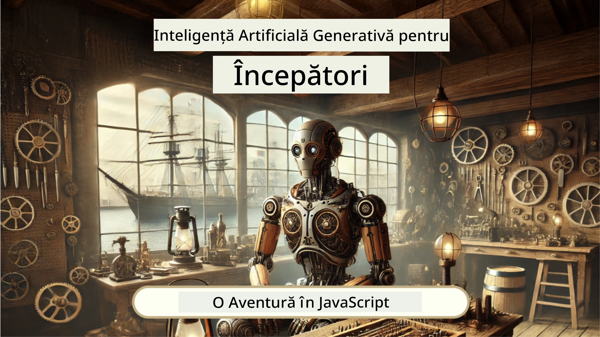
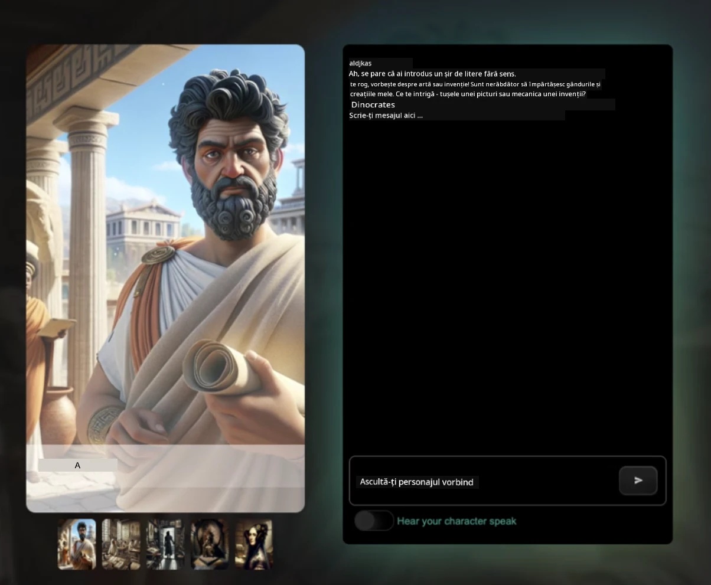
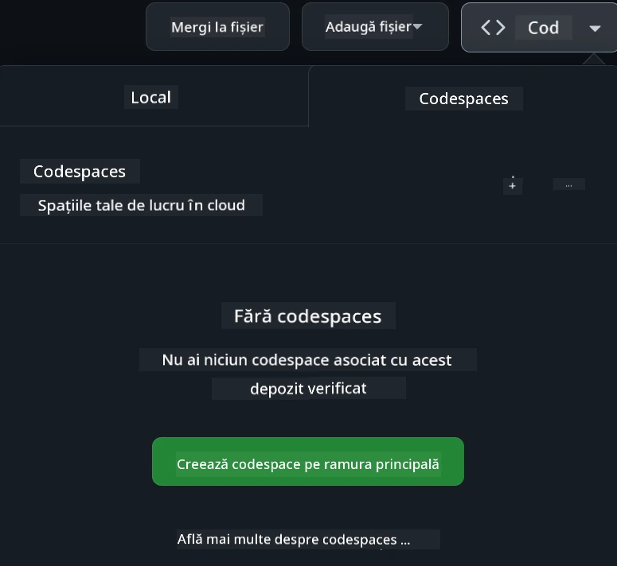

[](https://github.com/microsoft/Web-Dev-For-Beginners/blob/master/LICENSE)
[](https://GitHub.com/microsoft/Web-Dev-For-Beginners/graphs/contributors/)
[](https://GitHub.com/microsoft/Web-Dev-For-Beginners/issues/)
[](https://GitHub.com/microsoft/Web-Dev-For-Beginners/pulls/)
[](http://makeapullrequest.com) 

[](https://GitHub.com/microsoft/Web-Dev-For-Beginners/watchers/)
[](https://GitHub.com/microsoft/Web-Dev-For-Beginners/network/)
[](https://GitHub.com/microsoft/Web-Dev-For-Beginners/stargazers/)

[](https://discord.gg/nTYy5BXMWG)

# Dezvoltare Web pentru Începători - Un Curriculum

Învață noțiunile fundamentale ale dezvoltării web cu cursul nostru cuprinzător de 12 săptămâni creat de Microsoft Cloud Advocates. Fiecare dintre cele 24 de lecții explorează JavaScript, CSS și HTML prin proiecte practice precum terarii, extensii pentru browser și jocuri spațiale. Participă la chestionare, discuții și teme practice. Îmbunătățește-ți abilitățile și optimizează-ți retenția cunoștințelor cu pedagogia noastră eficientă bazată pe proiecte. Începe-ți călătoria în programare astăzi!

Alătură-te comunității Azure AI Foundry pe Discord

[](https://discord.gg/nTYy5BXMWG)

Urmărește acești pași pentru a începe folosirea acestor resurse:
1. **Clonează depozitul**: Click pe [](https://GitHub.com/microsoft/Web-Dev-For-Beginners/fork)
2. **Clonează depozitul local**:   `git clone https://github.com/microsoft/Web-Dev-For-Beginners.git`
3. [**Alătură-te Discordului Azure AI Foundry și întâlnește experți și alți dezvoltatori**](https://discord.com/invite/ByRwuEEgH4)

### 🌐 Suport Multilingv

#### Suportat prin GitHub Action (automatizat și întotdeauna actualizat)

<!-- CO-OP TRANSLATOR LANGUAGES TABLE START -->
[Arabic](../ar/README.md) | [Bengali](../bn/README.md) | [Bulgarian](../bg/README.md) | [Burmese (Myanmar)](../my/README.md) | [Chinese (Simplified)](../zh-CN/README.md) | [Chinese (Traditional, Hong Kong)](../zh-HK/README.md) | [Chinese (Traditional, Macau)](../zh-MO/README.md) | [Chinese (Traditional, Taiwan)](../zh-TW/README.md) | [Croatian](../hr/README.md) | [Czech](../cs/README.md) | [Danish](../da/README.md) | [Dutch](../nl/README.md) | [Estonian](../et/README.md) | [Finnish](../fi/README.md) | [French](../fr/README.md) | [German](../de/README.md) | [Greek](../el/README.md) | [Hebrew](../he/README.md) | [Hindi](../hi/README.md) | [Hungarian](../hu/README.md) | [Indonesian](../id/README.md) | [Italian](../it/README.md) | [Japanese](../ja/README.md) | [Kannada](../kn/README.md) | [Khmer](../km/README.md) | [Korean](../ko/README.md) | [Lithuanian](../lt/README.md) | [Malay](../ms/README.md) | [Malayalam](../ml/README.md) | [Marathi](../mr/README.md) | [Nepali](../ne/README.md) | [Nigerian Pidgin](../pcm/README.md) | [Norwegian](../no/README.md) | [Persian (Farsi)](../fa/README.md) | [Polish](../pl/README.md) | [Portuguese (Brazil)](../pt-BR/README.md) | [Portuguese (Portugal)](../pt-PT/README.md) | [Punjabi (Gurmukhi)](../pa/README.md) | [Romanian](./README.md) | [Russian](../ru/README.md) | [Serbian (Cyrillic)](../sr/README.md) | [Slovak](../sk/README.md) | [Slovenian](../sl/README.md) | [Spanish](../es/README.md) | [Swahili](../sw/README.md) | [Swedish](../sv/README.md) | [Tagalog (Filipino)](../tl/README.md) | [Tamil](../ta/README.md) | [Telugu](../te/README.md) | [Thai](../th/README.md) | [Turkish](../tr/README.md) | [Ukrainian](../uk/README.md) | [Urdu](../ur/README.md) | [Vietnamese](../vi/README.md)

> **Preferi să clonezi local?**
>
> Acest depozit include peste 50 de traduceri care cresc semnificativ dimensiunea descărcării. Pentru a clona fără traduceri, folosește sparse checkout:
>
> **Bash / macOS / Linux:**
> ```bash
> git clone --filter=blob:none --sparse https://github.com/microsoft/Web-Dev-For-Beginners.git
> cd Web-Dev-For-Beginners
> git sparse-checkout set --no-cone '/*' '!translations' '!translated_images'
> ```
>
> **CMD (Windows):**
> ```cmd
> git clone --filter=blob:none --sparse https://github.com/microsoft/Web-Dev-For-Beginners.git
> cd Web-Dev-For-Beginners
> git sparse-checkout set --no-cone "/*" "!translations" "!translated_images"
> ```
>
> Acest lucru îți oferă tot ce ai nevoie pentru a finaliza cursul cu o descărcare mult mai rapidă.
<!-- CO-OP TRANSLATOR LANGUAGES TABLE END -->

**Dacă dorești să fie suportate alte limbi pentru traduceri, acestea sunt listate [aici](https://github.com/Azure/co-op-translator/blob/main/getting_started/supported-languages.md)**

[](https://open.vscode.dev/microsoft/Web-Dev-For-Beginners)

#### 🧑‍🎓 _Ești student?_

Vizitează [**pagina Student Hub**](https://docs.microsoft.com/learn/student-hub/?WT.mc_id=academic-77807-sagibbon) unde vei găsi resurse pentru începători, pachete pentru studenți și chiar modalități de a obține un voucher gratuit pentru certificat. Aceasta este pagina pe care vrei să o salvezi la favorite și să o verifici din când în când deoarece conținutul este actualizat lunar.

### 📣 Anunț - Noi provocări GitHub Copilot Agent de completat!

Provocare nouă adăugată, caută "GitHub Copilot Agent Challenge 🚀" în cele mai multe capitole. Este o provocare nouă pentru tine de finalizat folosind GitHub Copilot și modul Agent. Dacă nu ai folosit modul Agent înainte, acesta nu doar generează text, ci poate crea și edita fișiere, rula comenzi și multe altele.

### 📣 Anunț - _Proiect nou de construit folosind Generative AI_ 

Proiect nou pentru Asistent AI tocmai adăugat, verifică [proiectul](./9-chat-project/README.md)

### 📣 Anunț - _Curriculum nou_ despre Generative AI pentru JavaScript a fost lansat recent

Nu rata noul nostru curriculum Generative AI!

Vizitează [https://aka.ms/genai-js-course](https://aka.ms/genai-js-course) pentru a începe!



- Lecții care acoperă totul, de la bazele până la RAG.
- Interacționează cu personaje istorice folosind GenAI și aplicația noastră companion.
- Narațiune amuzantă și captivantă, vei călători în timp!




Fiecare lecție include o temă de completat, un test de verificare a cunoștințelor și o provocare pentru a te ghida în învățarea unor subiecte precum:
- Promptarea și ingineria prompturilor
- Generarea aplicațiilor de text și imagine
- Aplicații de căutare

Vizitează [https://aka.ms/genai-js-course](https://aka.ms/genai-js-course) pentru a începe!


## 🌱 Începutul

> **Profesori**, am inclus [unele sugestii](for-teachers.md) despre cum să folosiți acest curriculum. Ne-ar plăcea să primim feedback-ul vostru [în forumul nostru de discuții](https://github.com/microsoft/Web-Dev-For-Beginners/discussions/categories/teacher-corner)!

**[Elevi](https://aka.ms/student-page/?WT.mc_id=academic-77807-sagibbon)**, pentru fiecare lecție, începeți cu un chestionar pre-lectură și continuați cu lectura materialului, realizarea activităților și verificarea înțelegerii cu chestionarul post-lectură.

Pentru a vă îmbunătăți experiența de învățare, conectați-vă cu colegii pentru a lucra împreună la proiecte! Discuțiile sunt încurajate în [forumul nostru de discuții](https://github.com/microsoft/Web-Dev-For-Beginners/discussions), unde echipa noastră de moderatori vă va răspunde la întrebări.

Pentru a vă extinde educația, recomandăm cu tărie explorarea [Microsoft Learn](https://learn.microsoft.com/users/wirelesslife/collections/p1ddcy5jwy0jkm?WT.mc_id=academic-77807-sagibbon) pentru materiale suplimentare de studiu.

### 📋 Configurarea mediului tău

Acest curriculum vine cu un mediu de dezvoltare gata de folosit! Pe măsură ce începi, poți alege să rulezi curriculum-ul într-un [Codespace](https://github.com/features/codespaces/) (_un mediu bazat pe browser, fără necesitatea instalărilor_), sau local pe calculatorul tău folosind un editor de text precum [Visual Studio Code](https://code.visualstudio.com/?WT.mc_id=academic-77807-sagibbon).

#### Creează-ți repository-ul
Pentru a-ți salva ușor munca, se recomandă să-ți creezi propria copie a acestui depozit. Poți face acest lucru făcând click pe butonul **Use this template** din partea de sus a paginii. Aceasta va crea un repository nou în contul tău de GitHub cu o copie a curriculum-ului.

Urmează acești pași:
1. **Fork the Repository**: Apasă butonul "Fork" din colțul din dreapta sus al acestei pagini.
2. **Clonează repository-ul**:   `git clone https://github.com/microsoft/Web-Dev-For-Beginners.git`

#### Rularea curriculum-ului într-un Codespace

În copia ta a acestui repository pe care ai creat-o, apasă pe butonul **Code** și selectează **Open with Codespaces**. Aceasta va crea un nou Codespace unde să lucrezi.



#### Rularea curriculum-ului local pe calculatorul tău

Pentru a rula acest curriculum local, ai nevoie de un editor de text, un browser și un instrument de linie de comandă. Prima noastră lecție, [Introducere în limbajele de programare și uneltele din domeniu](../../1-getting-started-lessons/1-intro-to-programming-languages), îți va prezenta diverse opțiuni pentru fiecare dintre aceste unelte astfel încât să le poți alege pe cele care ți se potrivesc cel mai bine.

Recomandarea noastră este să folosești [Visual Studio Code](https://code.visualstudio.com/?WT.mc_id=academic-77807-sagibbon) ca editor, care are și un [Terminal](https://code.visualstudio.com/docs/terminal/basics/?WT.mc_id=academic-77807-sagibbon) integrat. Poți descărca Visual Studio Code [aici](https://code.visualstudio.com/?WT.mc_id=academic-77807-sagibbon).
1. Clonează-ți depozitul pe calculatorul tău. Poți face acest lucru făcând clic pe butonul **Code** și copiind URL-ul:

    [CodeSpace](./images/createcodespace.png)

    Apoi, deschide [Terminal](https://code.visualstudio.com/docs/terminal/basics/?WT.mc_id=academic-77807-sagibbon) în cadrul [Visual Studio Code](https://code.visualstudio.com/?WT.mc_id=academic-77807-sagibbon) și rulează următoarea comandă, înlocuind `<your-repository-url>` cu URL-ul pe care tocmai l-ai copiat:

    ```bash 
    git clone <your-repository-url>
    ```

2. Deschide folderul în Visual Studio Code. Poți face acest lucru făcând clic pe **File** > **Open Folder** și selectând folderul pe care tocmai l-ai clonat.


>  Extensii recomandate pentru Visual Studio Code:
>
> * [Live Server](https://marketplace.visualstudio.com/items?itemName=ritwickdey.LiveServer&WT.mc_id=academic-77807-sagibbon) - pentru previzualizarea paginilor HTML direct în Visual Studio Code
> * [Copilot](https://marketplace.visualstudio.com/items?itemName=GitHub.copilot&WT.mc_id=academic-77807-sagibbon) - pentru a te ajuta să scrii cod mai rapid

## 📂 Fiecare lecție include:

- notițe grafice opționale
- videoclip suplimentar opțional
- quiz de încălzire înainte de lecție
- lecție scrisă
- pentru lecțiile bazate pe proiecte, ghiduri pas cu pas pentru a construi proiectul
- verificări de cunoștințe
- o provocare
- lecturi suplimentare
- temă
- [quiz post-lecție](https://ff-quizzes.netlify.app/web/)

> **O notă despre quiz-uri**: Toate quiz-urile se află în folderul Quiz-app, 48 de quiz-uri în total, fiecare cu câte trei întrebări. Sunt disponibile [aici](https://ff-quizzes.netlify.app/web/). Aplicația quiz poate fi rulată local sau implementată pe Azure; urmează instrucțiunile din folderul `quiz-app`.

## 🗃️ Lecții

|     |                       Numele Proiectului                      |                            Concepte Predate                             | Obiective de Învățare                                                                                                             |                                                         Lecția Asociată                                                          |         Autor          |
| :-: | :------------------------------------------------------------: | :----------------------------------------------------------------------: | --------------------------------------------------------------------------------------------------------------------------------- | :----------------------------------------------------------------------------------------------------------------------------: | :---------------------: |
| 01  |                     Începutul                                |           Introducere în Programare și Unelte de Lucru                   | Învață bazele fundamentale ale majorității limbajelor de programare și despre software-ul care ajută dezvoltatorii profesioniști să-și facă treaba | [Intro în limbaje de programare și unelte](./1-getting-started-lessons/1-intro-to-programming-languages/README.md)               |         Jasmine         |
| 02  |                     Începutul                                |             Bazele GitHub, inclusiv colaborarea într-o echipă             | Cum să folosești GitHub în proiectul tău, cum să colaborezi cu alții pe un cod                                                  |                            [Intro în GitHub](./1-getting-started-lessons/2-github-basics/README.md)                             |          Floor          |
| 03  |                     Începutul                                |                             Accesibilitate                               | Învață elementele de bază ale accesibilității web                                                                                 |                       [Fundamente ale accesibilității](./1-getting-started-lessons/3-accessibility/README.md)                     |       Christopher       |
| 04  |                        Bazele JS                             |                         Tipuri de date în JavaScript                      | Bazele tipurilor de date în JavaScript                                                                                            |                                       [Tipuri de date](./2-js-basics/1-data-types/README.md)                                        |         Jasmine         |
| 05  |                        Bazele JS                             |                         Funcții și metode                                | Învață despre funcții și metode pentru a gestiona fluxul logic al unei aplicații                                                  |                              [Funcții și metode](./2-js-basics/2-functions-methods/README.md)                                     | Jasmine și Christopher  |
| 06  |                        Bazele JS                             |                        Luarea deciziilor în JavaScript                   | Cum să creezi condiții în codul tău folosind metode de luare a deciziilor                                                         |                                 [Luarea deciziilor](./2-js-basics/3-making-decisions/README.md)                                  |         Jasmine         |
| 07  |                        Bazele JS                             |                            Array-uri și bucle                            | Lucrează cu date folosind array-uri și bucle în JavaScript                                                                        |                                   [Array-uri și bucle](./2-js-basics/4-arrays-loops/README.md)                                    |         Jasmine         |
| 08  |       [Terrarium](./3-terrarium/solution/README.md)          |                            HTML în practică                              | Construiește HTML-ul pentru crearea unui terrariu online, concentrându-te pe construirea unui layout                               |                                 [Introducere în HTML](./3-terrarium/1-intro-to-html/README.md)                                 |           Jen           |
| 09  |       [Terrarium](./3-terrarium/solution/README.md)          |                            CSS în practică                               | Construiește CSS-ul pentru a stiliza terrariul online, concentrându-te pe bazele CSS, inclusiv realizarea unei pagini responsive    |                                  [Introducere în CSS](./3-terrarium/2-intro-to-css/README.md)                                  |           Jen           |
| 10  |            [Terrarium](./3-terrarium/solution/README.md)             |                 Închideri JavaScript, manipulare DOM                     | Construiește JavaScript-ul pentru a face terrariul să funcționeze ca o interfață drag/drop, concentrându-te pe închideri și manipulare DOM |                  [Închideri JavaScript, manipulare DOM](./3-terrarium/3-intro-to-DOM-and-closures/README.md)                   |           Jen           |
| 11  |          [Typing Game](./4-typing-game/solution/README.md)          |                          Construirea unui joc de tastare                 | Învață cum să folosești evenimente de tastatură pentru a conduce logica aplicației JavaScript                                      |                                [Programare bazată pe evenimente](./4-typing-game/typing-game/README.md)                          |       Christopher       |
| 12  | [Green Browser Extension](./5-browser-extension/solution/README.md) |                         Lucrul cu browsere                              | Învață cum funcționează browserele, istoria lor și cum să schițezi primele elemente ale unei extensii de browser                  |                               [Despre browsere](./5-browser-extension/1-about-browsers/README.md)                                |           Jen           |
| 13  | [Green Browser Extension](./5-browser-extension/solution/README.md) | Construirea unui formular, apelarea unui API și stocarea variabilelor în stocarea locală | Construiește elementele JavaScript ale extensiei de browser pentru a apela un API folosind variabile stocate local                 |                [API-uri, formulare și stocare locală](./5-browser-extension/2-forms-browsers-local-storage/README.md)           |           Jen           |
| 14  | [Green Browser Extension](./5-browser-extension/solution/README.md) |          Procese de fundal în browser, performanța web                  | Folosește procesele din background ale browserului pentru a gestiona iconița extensiei; învață despre performanța web și optimizări |             [Task-uri de fundal și performanță](./5-browser-extension/3-background-tasks-and-performance/README.md)            |           Jen           |
| 15  |           [Space Game](./6-space-game/solution/README.md)           |             Dezvoltare mai avansată de jocuri cu JavaScript             | Învață despre moștenire folosind atât clase cât și compoziție și modelul Pub/Sub, pregătindu-te pentru construirea unui joc       |                      [Introducere în dezvoltarea avansată de jocuri](./6-space-game/1-introduction/README.md)                     |          Chris          |
| 16  |           [Space Game](./6-space-game/solution/README.md)           |                           Desenarea pe canvas                            | Învață despre API-ul Canvas, folosit pentru a desena elemente pe ecran                                                             |                                [Desenarea pe Canvas](./6-space-game/2-drawing-to-canvas/README.md)                            |          Chris          |
| 17  |           [Space Game](./6-space-game/solution/README.md)           |                   Mutarea elementelor pe ecran                           | Descoperă cum elementele pot căpăta mișcare folosind coordonate carteziene și API-ul Canvas                                         |                           [Mutarea elementelor](./6-space-game/3-moving-elements-around/README.md)                             |          Chris          |
| 18  |           [Space Game](./6-space-game/solution/README.md)           |                          Detectarea coliziunilor                         | Fă elementele să se ciocnească și să reacționeze între ele folosind apăsări de taste și oferă o funcție cooldown pentru performanța jocului |                              [Detectarea coliziunilor](./6-space-game/4-collision-detection/README.md)                             |          Chris          |
| 19  |           [Space Game](./6-space-game/solution/README.md)           |                             Ținerea scorului                             | Efectuează calcule matematice bazate pe statusul și performanța jocului                                                             |                                    [Ținerea scorului](./6-space-game/5-keeping-score/README.md)                                 |          Chris          |
| 20  |           [Space Game](./6-space-game/solution/README.md)           |                     Terminarea și repornirea jocului                     | Învață despre terminarea și repornirea jocului, inclusiv curățarea resurselor și resetarea valorilor variabile                       |                                [Condiția de terminare](./6-space-game/6-end-condition/README.md)                               |          Chris          |
| 21  |         [Banking App](./7-bank-project/solution/README.md)          |                 Șabloane HTML și rute într-o aplicație web              | Învață cum să creezi arhitectura unei pagini web cu mai multe pagini folosind rutare și șabloane HTML                             |                            [Șabloane HTML și rute](./7-bank-project/1-template-route/README.md)                               |          Yohan          |
| 22  |         [Banking App](./7-bank-project/solution/README.md)          |                  Construirea unui formular de autentificare             | Învață despre construire de formulare și gestionarea validărilor                                                                    |                                           [Formulare](./7-bank-project/2-forms/README.md)                                      |          Yohan          |
| 23  |         [Banking App](./7-bank-project/solution/README.md)          |                   Metode de preluare și utilizare a datelor              | Cum circulă datele în și din aplicația ta, cum să le preiei, stochezi și elimini                                                    |                                            [Date](./7-bank-project/3-data/README.md)                                          |          Yohan          |
| 24  |         [Banking App](./7-bank-project/solution/README.md)          |                      Concepte de gestionare a stării                     | Învață cum reține aplicația ta starea și cum să o gestionezi programatic                                                           |                                [Managementul stării](./7-bank-project/4-state-management/README.md)                              |          Yohan          |
| 25  | [Browser/VScode Code](../../8-code-editor) | Lucrul cu VScode | Învață cum să folosești un editor de cod | [Folosirea editorului VScode](./8-code-editor/1-using-a-code-editor/README.md) | Chris |
| 26  | [AI Assistants](./9-chat-project/README.md) | Lucrul cu AI | Învață cum să-ți construiești propriul asistent AI | [Proiect asistent AI](./9-chat-project/README.md) | Chris |

## 🏫 Pedagogie

Curriculumul nostru este conceput cu două principii pedagogice cheie în minte:
* învățare bazată pe proiecte
* quiz-uri frecvente

Programul predă fundamentele JavaScript, HTML și CSS, precum și cele mai noi unelte și tehnici folosite de dezvoltatorii web din prezent. Studenții vor avea oportunitatea să dezvolte experiență practică construind un joc de tastare, un terrariu virtual, o extensie de browser eco-friendly, un joc în stil space-invader și o aplicație bancară pentru afaceri. La finalul seriei, studenții vor fi dobândit o înțelegere solidă a dezvoltării web.

> 🎓 Poți parcurge primele lecții din acest curriculum ca un [Learn Path](https://docs.microsoft.com/learn/paths/web-development-101/?WT.mc_id=academic-77807-sagibbon) pe Microsoft Learn!

Prin asigurarea alinierii conținutului cu proiectele, procesul devine mai captivant pentru studenți și retenția conceptelor va fi îmbunătățită. De asemenea, am scris mai multe lecții introductive în bazele JavaScript pentru a introduce conceptele, împreună cu un videoclip din colecția de tutoriale video "[Beginners Series to: JavaScript](https://channel9.msdn.com/Series/Beginners-Series-to-JavaScript/?WT.mc_id=academic-77807-sagibbon)", a căror autori au contribuit la acest curriculum.

În plus, un quiz cu miză redusă înaintea unei clase stabilește intenția studentului pentru învățarea unui subiect, în timp ce un al doilea quiz după clasă asigură o retenție suplimentară. Acest curriculum a fost conceput să fie flexibil și distractiv, putând fi parcurs integral sau parțial. Proiectele încep mici și devin din ce în ce mai complexe până la finalul ciclului de 12 săptămâni.

Deși am evitat intenționat introducerea framework-urilor JavaScript pentru a ne concentra pe abilitățile de bază necesare ca dezvoltator web înainte de a adopta un framework, un pas bun următor după finalizarea acestui curriculum ar fi să înveți despre Node.js printr-o altă colecție de videoclipuri: "[Beginner Series to: Node.js](https://channel9.msdn.com/Series/Beginners-Series-to-Nodejs/?WT.mc_id=academic-77807-sagibbon)".

> Vizitează [Codul nostru de Conduită](CODE_OF_CONDUCT.md) și ghidul [Contribuie](CONTRIBUTING.md). Așteptăm cu interes feedback-ul tău constructiv!


## 🧭 Acces offline

Poți rula această documentație offline folosind [Docsify](https://docsify.js.org/#/). Fork-uiește acest repo, [instalează Docsify](https://docsify.js.org/#/quickstart) pe mașina ta locală, apoi în folderul rădăcină al acestui repo, tastează `docsify serve`. Site-ul va fi servit pe portul 3000 la localhost-ul tău: `localhost:3000`.

## 📘 PDF
Un PDF cu toate lecțiile poate fi găsit [aici](https://microsoft.github.io/Web-Dev-For-Beginners/pdf/readme.pdf).


## 🎒 Alte Cursuri

Echipa noastră produce și alte cursuri! Verifică:

<!-- CO-OP TRANSLATOR OTHER COURSES START -->
### LangChain
[](https://aka.ms/langchain4j-for-beginners)
[](https://aka.ms/langchainjs-for-beginners?WT.mc_id=m365-94501-dwahlin)
[](https://github.com/microsoft/langchain-for-beginners?WT.mc_id=m365-94501-dwahlin)
---

### Azure / Edge / MCP / Agenți
[](https://github.com/microsoft/AZD-for-beginners?WT.mc_id=academic-105485-koreyst)
[](https://github.com/microsoft/edgeai-for-beginners?WT.mc_id=academic-105485-koreyst)
[](https://github.com/microsoft/mcp-for-beginners?WT.mc_id=academic-105485-koreyst)
[](https://github.com/microsoft/ai-agents-for-beginners?WT.mc_id=academic-105485-koreyst)

---
 
### Seria Inteligență Artificială Generativă
[](https://github.com/microsoft/generative-ai-for-beginners?WT.mc_id=academic-105485-koreyst)
[-9333EA?style=for-the-badge&labelColor=E5E7EB&color=9333EA)](https://github.com/microsoft/Generative-AI-for-beginners-dotnet?WT.mc_id=academic-105485-koreyst)
[-C084FC?style=for-the-badge&labelColor=E5E7EB&color=C084FC)](https://github.com/microsoft/generative-ai-for-beginners-java?WT.mc_id=academic-105485-koreyst)
[-E879F9?style=for-the-badge&labelColor=E5E7EB&color=E879F9)](https://github.com/microsoft/generative-ai-with-javascript?WT.mc_id=academic-105485-koreyst)

---
 
### Învățare De Bază
[](https://aka.ms/ml-beginners?WT.mc_id=academic-105485-koreyst)
[](https://aka.ms/datascience-beginners?WT.mc_id=academic-105485-koreyst)
[](https://aka.ms/ai-beginners?WT.mc_id=academic-105485-koreyst)
[](https://github.com/microsoft/Security-101?WT.mc_id=academic-96948-sayoung)
[](https://aka.ms/webdev-beginners?WT.mc_id=academic-105485-koreyst)
[](https://aka.ms/iot-beginners?WT.mc_id=academic-105485-koreyst)
[](https://github.com/microsoft/xr-development-for-beginners?WT.mc_id=academic-105485-koreyst)

---
 
### Seria Copilot
[](https://aka.ms/GitHubCopilotAI?WT.mc_id=academic-105485-koreyst)
[](https://github.com/microsoft/mastering-github-copilot-for-dotnet-csharp-developers?WT.mc_id=academic-105485-koreyst)
[](https://github.com/microsoft/CopilotAdventures?WT.mc_id=academic-105485-koreyst)
<!-- CO-OP TRANSLATOR OTHER COURSES END -->

## Obținerea Ajutorului

Dacă te blochezi sau ai întrebări despre construirea aplicațiilor AI. Alătură-te altor cursanți și dezvoltatori experimentați în discuții despre MCP. Este o comunitate suportivă unde întrebările sunt binevenite și cunoștințele sunt împărtășite liber.

[](https://discord.gg/nTYy5BXMWG)

Dacă ai feedback despre produs sau erori în timpul construirii, vizitează:

[](https://aka.ms/foundry/forum)

## Licență

Acest depozit este licențiat sub licența MIT. Vezi fișierul [LICENSE](../../LICENSE) pentru mai multe informații.

---

<!-- CO-OP TRANSLATOR DISCLAIMER START -->
**Declinare a responsabilității**:
Acest document a fost tradus folosind serviciul de traducere AI [Co-op Translator](https://github.com/Azure/co-op-translator). Deși ne străduim pentru acuratețe, vă rugăm să rețineți că traducerile automate pot conține erori sau inexactități. Documentul original în limba sa nativă trebuie considerat sursa autoritară. Pentru informații critice, se recomandă traducerea profesională realizată de un specialist uman. Nu ne asumăm responsabilitatea pentru orice neînțelegeri sau interpretări greșite rezultând din utilizarea acestei traduceri.
<!-- CO-OP TRANSLATOR DISCLAIMER END -->