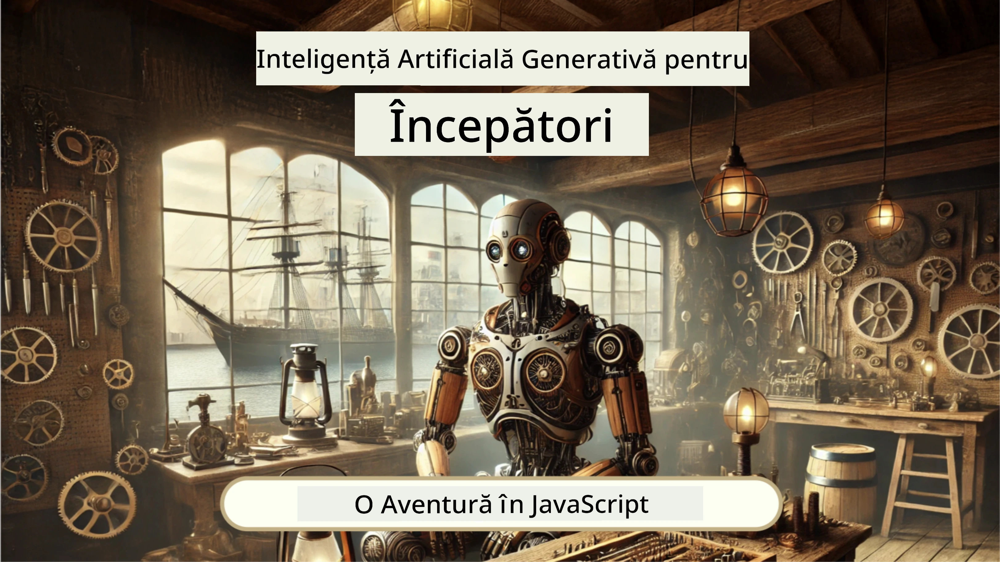
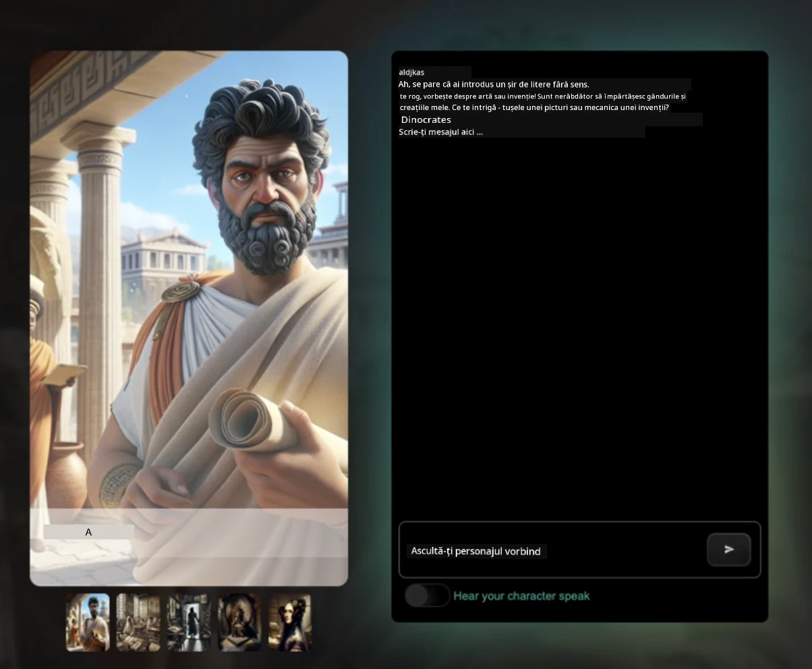
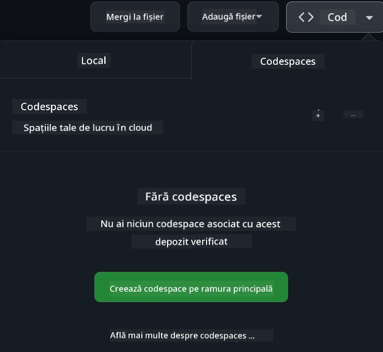

[](https://github.com/microsoft/Web-Dev-For-Beginners/blob/master/LICENSE)
[](https://GitHub.com/microsoft/Web-Dev-For-Beginners/graphs/contributors/)
[](https://GitHub.com/microsoft/Web-Dev-For-Beginners/issues/)
[](https://GitHub.com/microsoft/Web-Dev-For-Beginners/pulls/)
[](http://makeapullrequest.com) 

[](https://GitHub.com/microsoft/Web-Dev-For-Beginners/watchers/)
[](https://GitHub.com/microsoft/Web-Dev-For-Beginners/network/)
[](https://GitHub.com/microsoft/Web-Dev-For-Beginners/stargazers/)

[](https://discord.gg/nTYy5BXMWG)

# Dezvoltare Web pentru Începători - Un Curriculum

Învățați elementele fundamentale ale dezvoltării web cu cursul nostru cuprinzător de 12 săptămâni oferit de Microsoft Cloud Advocates. Fiecare dintre cele 24 de lecții explorează JavaScript, CSS și HTML prin proiecte practice precum terarii, extensii pentru browser și jocuri spațiale. Participați la chestionare, discuții și teme practice. Îmbunătățiți-vă abilitățile și optimizați reținerea cunoștințelor cu pedagogia noastră eficientă bazată pe proiecte. Începeți-vă călătoria în programare astăzi!

Alăturați-vă Discord-ului Azure AI Foundry și întâlniți experți și colegi dezvoltatori.

[](https://discord.gg/nTYy5BXMWG)

Urmați acești pași pentru a începe să utilizați aceste resurse:
1. **Faceți Fork la Repositoriu**: Click pe [](https://GitHub.com/microsoft/Web-Dev-For-Beginners/fork)
2. **Clonați Repositoriu**:   `git clone https://github.com/microsoft/Web-Dev-For-Beginners.git`
3. [**Alăturați-vă Discord Azure AI Foundry și întâlniți experți și colegi dezvoltatori**](https://discord.com/invite/ByRwuEEgH4)

### 🌐 Suport Multilingv

#### Suportat prin GitHub Action (Automat și Întotdeauna la Zi)

<!-- CO-OP TRANSLATOR LANGUAGES TABLE START -->
[Arabic](../ar/README.md) | [Bengali](../bn/README.md) | [Bulgarian](../bg/README.md) | [Burmese (Myanmar)](../my/README.md) | [Chinese (Simplified)](../zh-CN/README.md) | [Chinese (Traditional, Hong Kong)](../zh-HK/README.md) | [Chinese (Traditional, Macau)](../zh-MO/README.md) | [Chinese (Traditional, Taiwan)](../zh-TW/README.md) | [Croatian](../hr/README.md) | [Czech](../cs/README.md) | [Danish](../da/README.md) | [Dutch](../nl/README.md) | [Estonian](../et/README.md) | [Finnish](../fi/README.md) | [French](../fr/README.md) | [German](../de/README.md) | [Greek](../el/README.md) | [Hebrew](../he/README.md) | [Hindi](../hi/README.md) | [Hungarian](../hu/README.md) | [Indonesian](../id/README.md) | [Italian](../it/README.md) | [Japanese](../ja/README.md) | [Kannada](../kn/README.md) | [Khmer](../km/README.md) | [Korean](../ko/README.md) | [Lithuanian](../lt/README.md) | [Malay](../ms/README.md) | [Malayalam](../ml/README.md) | [Marathi](../mr/README.md) | [Nepali](../ne/README.md) | [Nigerian Pidgin](../pcm/README.md) | [Norwegian](../no/README.md) | [Persian (Farsi)](../fa/README.md) | [Polish](../pl/README.md) | [Portuguese (Brazil)](../pt-BR/README.md) | [Portuguese (Portugal)](../pt-PT/README.md) | [Punjabi (Gurmukhi)](../pa/README.md) | [Romanian](./README.md) | [Russian](../ru/README.md) | [Serbian (Cyrillic)](../sr/README.md) | [Slovak](../sk/README.md) | [Slovenian](../sl/README.md) | [Spanish](../es/README.md) | [Swahili](../sw/README.md) | [Swedish](../sv/README.md) | [Tagalog (Filipino)](../tl/README.md) | [Tamil](../ta/README.md) | [Telugu](../te/README.md) | [Thai](../th/README.md) | [Turkish](../tr/README.md) | [Ukrainian](../uk/README.md) | [Urdu](../ur/README.md) | [Vietnamese](../vi/README.md)

> **Preferi să clonezi local?**
>
> Acest repository include peste 50 de traduceri în limbi diferite, ceea ce crește semnificativ dimensiunea descarcării. Pentru a clona fără traduceri, folosește sparse checkout:
>
> **Bash / macOS / Linux:**
> ```bash
> git clone --filter=blob:none --sparse https://github.com/microsoft/Web-Dev-For-Beginners.git
> cd Web-Dev-For-Beginners
> git sparse-checkout set --no-cone '/*' '!translations' '!translated_images'
> ```
>
> **CMD (Windows):**
> ```cmd
> git clone --filter=blob:none --sparse https://github.com/microsoft/Web-Dev-For-Beginners.git
> cd Web-Dev-For-Beginners
> git sparse-checkout set --no-cone "/*" "!translations" "!translated_images"
> ```
>
> Aceasta vă oferă tot ce aveți nevoie pentru a finaliza cursul cu o descărcare mult mai rapidă.
<!-- CO-OP TRANSLATOR LANGUAGES TABLE END -->

**Dacă doriți să aveți traduceri suplimentare, limbile suportate sunt listate aici. [aici](https://github.com/Azure/co-op-translator/blob/main/getting_started/supported-languages.md)**

[](https://open.vscode.dev/microsoft/Web-Dev-For-Beginners)

#### 🧑‍🎓 _Ești student?_

Vizitează pagina [**Student Hub**](https://docs.microsoft.com/learn/student-hub/?WT.mc_id=academic-77807-sagibbon) unde vei găsi resurse pentru începători, pachete pentru studenți și chiar modalități de a obține un voucher gratuit pentru certificat. Aceasta este pagina pe care vrei să o adaugi la favorite și să o verifici din când în când, pentru că schimbăm conținutul lunar.

### 📣 Anunț - Provocări noi în GitHub Copilot Agent mode de completat!

Provocare nouă adăugată, caută "GitHub Copilot Agent Challenge 🚀" în majoritatea capitolelor. Este o provocare nouă pentru tine să o completezi folosind GitHub Copilot și modul Agent. Dacă nu ai folosit înainte modul Agent, acesta poate nu doar să genereze text, ci și să creeze și să editeze fișiere, să ruleze comenzi și altele.

### 📣 Anunț - _Proiect Nou de construit folosind Generative AI_

Proiectul nou AI Assistant tocmai a fost adăugat, vezi detalii [project](./9-chat-project/README.md)

### 📣 Anunț - _Curriculum Nou_ despre Generative AI pentru JavaScript a fost lansat

Nu rata noul nostru curriculum Generative AI!

Vizitează [https://aka.ms/genai-js-course](https://aka.ms/genai-js-course) pentru a începe!



- Lecții care acoperă totul, de la elementele de bază până la RAG.
- Interacționează cu personaje istorice folosind GenAI și aplicația noastră companion.
- Narațiune amuzantă și captivantă, vei călători în timp!




Fiecare lecție include o temă de completat, un test de verificare a cunoștințelor și o provocare pentru a te ghida în învățarea subiectelor precum:
- Promptarea și ingineria prompturilor
- Generarea de aplicații text și imagine
- Aplicații de căutare

Vizitează [https://aka.ms/genai-js-course](https://aka.ms/genai-js-course) pentru a începe!


## 🌱 Începutul

> **Profesori**, am inclus [câteva sugestii](for-teachers.md) despre cum să folosiți acest curriculum. Ne-ar plăcea să primim feedbackul vostru [în forumul nostru de discuții](https://github.com/microsoft/Web-Dev-For-Beginners/discussions/categories/teacher-corner)!

**[Elevi](https://aka.ms/student-page/?WT.mc_id=academic-77807-sagibbon)**, pentru fiecare lecție, începeți cu un chestionar pre-lecture și continuați cu lectura materialului de curs, realizați diverse activități și verificați-vă înțelegerea cu chestionarul post-lecture.

Pentru a vă îmbunătăți experiența de învățare, conectați-vă cu colegii pentru a lucra împreună la proiecte! Discuțiile sunt încurajate în [forumul nostru de discuții](https://github.com/microsoft/Web-Dev-For-Beginners/discussions) unde echipa noastră de moderatori va fi disponibilă pentru a răspunde întrebărilor voastre.

Pentru aprofundare, vă recomandăm să explorați [Microsoft Learn](https://learn.microsoft.com/users/wirelesslife/collections/p1ddcy5jwy0jkm?WT.mc_id=academic-77807-sagibbon) pentru materiale suplimentare de studiu.

### 📋 Configurarea mediului tău de lucru

Acest curriculum are un mediu de dezvoltare gata pentru utilizare! Pe măsură ce începi, poți alege să rulezi curriculumul într-un [Codespace](https://github.com/features/codespaces/) (_un mediu în browser, fără nevoie de instalări_), sau local pe calculatorul tău folosind un editor de text precum [Visual Studio Code](https://code.visualstudio.com/?WT.mc_id=academic-77807-sagibbon).

#### Creează-ți propriul repository
Pentru a-ți salva ușor munca, se recomandă să creezi propria copie a acestui repository. Poți face asta dând click pe butonul **Use this template** din partea de sus a paginii. Aceasta va crea un nou repository în contul tău de GitHub cu o copie a curriculumului.

Urmează acești pași:
1. **Faceți Fork la Repositoriu**: Apasă pe butonul „Fork” din colțul dreapta sus al acestei pagini.
2. **Clonați Repositoriu**:   `git clone https://github.com/microsoft/Web-Dev-For-Beginners.git`

#### Rularea curriculumului într-un Codespace

În copia ta a repository-ului creată, dă click pe butonul **Code** și selectează **Open with Codespaces**. Aceasta va crea un nou Codespace în care să lucrezi.



#### Rularea curriculumului local pe calculatorul tău

Pentru a rula acest curriculum local pe calculatorul tău, vei avea nevoie de un editor de text, un browser și un instrument linie de comandă. Prima noastră lecție, [Introducere în Limbajele de Programare și Unelte](../../1-getting-started-lessons/1-intro-to-programming-languages), te va ghida prin diverse opțiuni pentru fiecare dintre aceste unelte, pentru a alege ce ți se potrivește cel mai bine.

Recomandarea noastră este să folosești [Visual Studio Code](https://code.visualstudio.com/?WT.mc_id=academic-77807-sagibbon) ca editor, care are și un [Terminal](https://code.visualstudio.com/docs/terminal/basics/?WT.mc_id=academic-77807-sagibbon) încorporat. Poți descărca Visual Studio Code [aici](https://code.visualstudio.com/?WT.mc_id=academic-77807-sagibbon).
1. Clonează-ți depozitul pe calculatorul tău. Poți face acest lucru apăsând butonul **Code** și copiind URL-ul:

    [CodeSpace](./images/createcodespace.png)

    Apoi, deschide [Terminal](https://code.visualstudio.com/docs/terminal/basics/?WT.mc_id=academic-77807-sagibbon) în cadrul [Visual Studio Code](https://code.visualstudio.com/?WT.mc_id=academic-77807-sagibbon) și execută următoarea comandă, înlocuind `<your-repository-url>` cu URL-ul copiat:

    ```bash 
    git clone <your-repository-url>
    ```

2. Deschide folderul în Visual Studio Code. Poți face acest lucru apăsând pe **File** > **Open Folder** și selectând folderul pe care tocmai l-ai clonat.


>  Extensii recomandate pentru Visual Studio Code:
>
> * [Live Server](https://marketplace.visualstudio.com/items?itemName=ritwickdey.LiveServer&WT.mc_id=academic-77807-sagibbon) - pentru previzualizarea paginilor HTML în Visual Studio Code
> * [Copilot](https://marketplace.visualstudio.com/items?itemName=GitHub.copilot&WT.mc_id=academic-77807-sagibbon) - pentru a te ajuta să scrii cod mai rapid

## 📂 Fiecare lecție include:

- schiță opțională
- video suplimentar opțional
- test preliminar de încălzire înaintea lecției
- lecție scrisă
- pentru lecțiile bazate pe proiecte, ghiduri pas cu pas pentru construirea proiectului
- verificări de cunoștințe
- o provocare
- lectură suplimentară
- temă
- [test post-lectie](https://ff-quizzes.netlify.app/web/)

> **O notă despre teste**: Toate testele sunt conținute în folderul Quiz-app, în total 48 de teste cu câte trei întrebări fiecare. Sunt disponibile [aici](https://ff-quizzes.netlify.app/web/); aplicația de teste poate fi rulată local sau implementată pe Azure; urmează instrucțiunile din folderul `quiz-app`.

## 🗃️ Lecții

|     |                       Numele Proiectului                       |                            Concepte Prezentate                             | Obiective de Învățare                                                                                                                 |                                                         Lecția Legată                                                          |         Autor          |
| :-: | :------------------------------------------------------------: | :-----------------------------------------------------------------------: | ------------------------------------------------------------------------------------------------------------------------------------ | :----------------------------------------------------------------------------------------------------------------------------: | :---------------------: |
| 01  |                     Începutul Programării                      |           Introducere în Programare și Unelte                               | Învață elementele de bază ale majorității limbajelor de programare și despre software-ul care ajută dezvoltatorii profesioniști       | [Introducere în Limbaje de Programare și Unelte](./1-getting-started-lessons/1-intro-to-programming-languages/README.md)      |         Jasmine         |
| 02  |                     Începutul Programării                      |             Bazele GitHub, inclusiv colaborarea în echipă                  | Cum se folosește GitHub în proiectul tău, cum să colaborezi cu alții pe o bază de cod                                                |                            [Introducere în GitHub](./1-getting-started-lessons/2-github-basics/README.md)                     |          Floor          |
| 03  |                     Începutul Programării                      |                            Accesibilitate                                  | Învață elementele de bază ale accesibilității web                                                                                    |                       [Fundamentele Accesibilității](./1-getting-started-lessons/3-accessibility/README.md)                   |       Christopher       |
| 04  |                        JS Basics                               |                         Tipuri de date în JavaScript                       | Elementele de bază ale tipurilor de date JavaScript                                                                                  |                                       [Tipuri de Date](./2-js-basics/1-data-types/README.md)                                  |         Jasmine         |
| 05  |                        JS Basics                               |                         Funcții și Metode                                  | Învață despre funcții și metode pentru gestionarea fluxului logic al aplicației                                                     |                              [Funcții și Metode](./2-js-basics/2-functions-methods/README.md)                                 | Jasmine și Christopher  |
| 06  |                        JS Basics                               |                        Luarea Deciziilor cu JS                             | Învață să creezi condiții în codul tău folosind metode de luare a deciziilor                                                        |                                 [Luarea Deciziilor](./2-js-basics/3-making-decisions/README.md)                              |         Jasmine         |
| 07  |                        JS Basics                               |                           Array-uri și Buclă                              | Lucrează cu date folosind array-uri și bucle în JavaScript                                                                          |                                   [Array-uri și Buclă](./2-js-basics/4-arrays-loops/README.md)                               |         Jasmine         |
| 08  |       [Terrarium](./3-terrarium/solution/README.md)           |                           HTML în Practică                                | Construiește HTML pentru a crea un terariu online, concentrându-te pe construirea unui layout                                        |                                 [Introducere în HTML](./3-terrarium/1-intro-to-html/README.md)                               |           Jen           |
| 09  |       [Terrarium](./3-terrarium/solution/README.md)           |                           CSS în Practică                                 | Construiește CSS pentru a stiliza terariul online, concentrându-te pe bazele CSS inclusiv realizarea paginii responsive              |                                  [Introducere în CSS](./3-terrarium/2-intro-to-css/README.md)                                |           Jen           |
| 10  |            [Terrarium](./3-terrarium/solution/README.md)      |                  Închideri JavaScript, manipularea DOM                   | Construiește JavaScript-ul pentru a face funcțional terariul ca o interfață drag/drop, concentrându-te pe închideri și manipularea DOM |                  [Închideri JavaScript, manipularea DOM](./3-terrarium/3-intro-to-DOM-and-closures/README.md)                  |           Jen           |
| 11  |          [Typing Game](./4-typing-game/solution/README.md)     |                             Construiește un joc de tastare                | Învață cum să folosești evenimentele de tastatură pentru a conduce logica aplicației tale JavaScript                                 |                                [Programare bazată pe evenimente](./4-typing-game/typing-game/README.md)                        |       Christopher       |
| 12  | [Green Browser Extension](./5-browser-extension/solution/README.md) |                          Lucrul cu browsere                              | Învață cum funcționează browserele, istoria lor, și cum să creezi elementele inițiale ale unei extensii de browser                  |                               [Despre browsere](./5-browser-extension/1-about-browsers/README.md)                              |           Jen           |
| 13  | [Green Browser Extension](./5-browser-extension/solution/README.md) |      Construirea unui formular, apelarea unui API și stocarea variabilelor în local storage     | Construiește elementele JavaScript ale extensiei browser-ului pentru a apela un API folosind variabile stocate în local storage      |                [API-uri, formulare și local storage](./5-browser-extension/2-forms-browsers-local-storage/README.md)          |           Jen           |
| 14  | [Green Browser Extension](./5-browser-extension/solution/README.md) |      Procese de fundal în browser, performanța web                       | Folosește procesele de fundal ale browserului pentru a gestiona iconița extensiei; învață despre performanța web și unele optimizări |             [Sarcini de fundal și performanță](./5-browser-extension/3-background-tasks-and-performance/README.md)            |           Jen           |
| 15  |           [Space Game](./6-space-game/solution/README.md)      |   Dezvoltare jocuri avansată cu JavaScript                              | Învață despre moștenire folosind atât clase, cât și compoziție, și modelul Pub/Sub, în pregătirea construirii unui joc              |                      [Introducere în dezvoltarea jocurilor avansate](./6-space-game/1-introduction/README.md)                   |          Chris          |
| 16  |           [Space Game](./6-space-game/solution/README.md)      |                          Desenarea pe canvas                            | Învață despre API-ul Canvas, folosit pentru desenarea elementelor pe ecran                                                          |                                [Desenarea pe Canvas](./6-space-game/2-drawing-to-canvas/README.md)                             |          Chris          |
| 17  |           [Space Game](./6-space-game/solution/README.md)      |                        Mutarea elementelor pe ecran                     | Descoperă cum elementele pot căpăta mișcare folosind coordonate carteziene și API-ul Canvas                                         |                           [Mutarea elementelor pe ecran](./6-space-game/3-moving-elements-around/README.md)                   |          Chris          |
| 18  |           [Space Game](./6-space-game/solution/README.md)      |                          Detectarea coliziunilor                        | Fă ca elementele să se ciocnească și să reacționeze unele la altele folosind apăsări de taste și oferă o funcție de cooldown        |                              [Detectarea coliziunilor](./6-space-game/4-collision-detection/README.md)                         |          Chris          |
| 19  |           [Space Game](./6-space-game/solution/README.md)      |                             Ținerea scorului                            | Realizează calcule matematice bazate pe statusul și performanța jocului                                                              |                                    [Ținerea scorului](./6-space-game/5-keeping-score/README.md)                                |          Chris          |
| 20  |           [Space Game](./6-space-game/solution/README.md)      |                       Terminarea și repornirea jocului                  | Învață despre terminarea și repornirea jocului, inclusiv curățarea resurselor și resetarea valorilor variabile                       |                                [Condiția de terminare](./6-space-game/6-end-condition/README.md)                               |          Chris          |
| 21  |         [Banking App](./7-bank-project/solution/README.md)     |                 Șabloane HTML și Rute într-o aplicație web              | Învață cum să creezi scheletul arhitecturii unui website multipagină folosind rutare și șabloane HTML                               |                            [Șabloane HTML și rute](./7-bank-project/1-template-route/README.md)                                |          Yohan          |
| 22  |         [Banking App](./7-bank-project/solution/README.md)     |                  Construiește un formular de autentificare și înregistrare | Învață despre construirea formularelor și gestionarea validărilor                                                                     |                                           [Formulare](./7-bank-project/2-forms/README.md)                                     |          Yohan          |
| 23  |         [Banking App](./7-bank-project/solution/README.md)     |                   Metode de preluare și utilizare a datelor             | Cum circulă datele în și din aplicația ta, cum să le preiei, să le stochezi și să le elimini                                          |                                            [Date](./7-bank-project/3-data/README.md)                                        |          Yohan          |
| 24  |         [Banking App](./7-bank-project/solution/README.md)     |                      Concepte de Management al Stării                   | Învață cum aplicația ta păstrează starea și cum să o gestionezi programatic                                                         |                                [Managementul stării](./7-bank-project/4-state-management/README.md)                             |          Yohan          |
| 25  | [Browser/VScode Code](../../8-code-editor)                        | Lucrul cu VScode                                                       | Învață cum să folosești un editor de cod                                                                                             | [Folosește editorul de cod VScode](./8-code-editor/1-using-a-code-editor/README.md)                                          | Chris                 |
| 26  | [AI Assistants](./9-chat-project/README.md)                    | Lucru cu AI                                                           | Învață cum să construiești propriul asistent AI                                                                                      | [Proiect Asistent AI](./9-chat-project/README.md)                                                                              | Chris                 |

## 🏫 Pedagogie

Curriculum-ul nostru este conceput având în vedere două principii pedagogice cheie:
* învățarea bazată pe proiecte
* teste frecvente

Programul predă fundamentele JavaScript, HTML și CSS, precum și cele mai noi unelte și tehnici folosite de dezvoltatorii web de azi. Studenții vor avea oportunitatea să dobândească experiență practică construind un joc de tastare, un terariu virtual, o extensie de browser ecologică, un joc de tip space invader și o aplicație bancară pentru afaceri. Până la finalul seriei, studenții vor avea o înțelegere solidă a dezvoltării web.

> 🎓 Poți parcurge primele lecții din acest curriculum ca un [Curs de învățare](https://docs.microsoft.com/learn/paths/web-development-101/?WT.mc_id=academic-77807-sagibbon) pe Microsoft Learn!

Prin asigurarea alinierii conținutului cu proiectele, procesul devine mai captivant pentru studenți și reținerea conceptelor este îmbunătățită. Am scris, de asemenea, câteva lecții introductive în elementele de bază ale JavaScript pentru a introduce conceptele, alături de un video din colecția de tutoriale video "[Seria pentru Începători la: JavaScript](https://channel9.msdn.com/Series/Beginners-Series-to-JavaScript/?WT.mc_id=academic-77807-sagibbon)", al cărei autori au contribuit și la acest curriculum.

În plus, un test cu miză mică înaintea unei clase setează intenția studentului de a învăța un subiect, în timp ce un al doilea test după clasă asigură o reținere suplimentară. Acest curriculum a fost conceput să fie flexibil și amuzant și poate fi parcurs integral sau parțial. Proiectele sunt mici la început și devin din ce în ce mai complexe până la finalul ciclului de 12 săptămâni.

Deși am evitat intenționat introducerea framework-urilor JavaScript pentru a ne concentra pe abilitățile de bază necesare unui dezvoltator web înainte de a adopta un framework, un pas următor bun după finalizarea acestui curriculum ar fi să înveți despre Node.js printr-o altă colecție de videoclipuri: "[Seria pentru Începători la: Node.js](https://channel9.msdn.com/Series/Beginners-Series-to-Nodejs/?WT.mc_id=academic-77807-sagibbon)".

> Vizitează [Codul nostru de Conduită](CODE_OF_CONDUCT.md) și [Ghidul de Contribuție](CONTRIBUTING.md). Apreciem feedback-ul tău constructiv!


## 🧭 Acces offline

Poți rula această documentație offline folosind [Docsify](https://docsify.js.org/#/). Fă un fork al acestui depozit, [instalează Docsify](https://docsify.js.org/#/quickstart) pe calculatorul tău local, apoi în folderul rădăcină al acestui depozit tastează `docsify serve`. Site-ul va fi servit pe portul 3000 pe localhost-ul tău: `localhost:3000`.

## 📘 PDF
Un PDF cu toate lecțiile poate fi găsit [aici](https://microsoft.github.io/Web-Dev-For-Beginners/pdf/readme.pdf).


## 🎒 Alte Cursuri

Echipa noastră produce și alte cursuri! Aruncă o privire:

<!-- CO-OP TRANSLATOR OTHER COURSES START -->
### LangChain
[](https://aka.ms/langchain4j-for-beginners)
[](https://aka.ms/langchainjs-for-beginners?WT.mc_id=m365-94501-dwahlin)
[](https://github.com/microsoft/langchain-for-beginners?WT.mc_id=m365-94501-dwahlin)
---

### Azure / Edge / MCP / Agents
[](https://github.com/microsoft/AZD-for-beginners?WT.mc_id=academic-105485-koreyst)
[](https://github.com/microsoft/edgeai-for-beginners?WT.mc_id=academic-105485-koreyst)
[](https://github.com/microsoft/mcp-for-beginners?WT.mc_id=academic-105485-koreyst)
[](https://github.com/microsoft/ai-agents-for-beginners?WT.mc_id=academic-105485-koreyst)

---
 
### Seria AI Generativ
[](https://github.com/microsoft/generative-ai-for-beginners?WT.mc_id=academic-105485-koreyst)
[-9333EA?style=for-the-badge&labelColor=E5E7EB&color=9333EA)](https://github.com/microsoft/Generative-AI-for-beginners-dotnet?WT.mc_id=academic-105485-koreyst)
[-C084FC?style=for-the-badge&labelColor=E5E7EB&color=C084FC)](https://github.com/microsoft/generative-ai-for-beginners-java?WT.mc_id=academic-105485-koreyst)
[-E879F9?style=for-the-badge&labelColor=E5E7EB&color=E879F9)](https://github.com/microsoft/generative-ai-with-javascript?WT.mc_id=academic-105485-koreyst)

---
 
### Învățare de Bază
[](https://aka.ms/ml-beginners?WT.mc_id=academic-105485-koreyst)
[](https://aka.ms/datascience-beginners?WT.mc_id=academic-105485-koreyst)
[](https://aka.ms/ai-beginners?WT.mc_id=academic-105485-koreyst)
[](https://github.com/microsoft/Security-101?WT.mc_id=academic-96948-sayoung)
[](https://aka.ms/webdev-beginners?WT.mc_id=academic-105485-koreyst)
[](https://aka.ms/iot-beginners?WT.mc_id=academic-105485-koreyst)
[](https://github.com/microsoft/xr-development-for-beginners?WT.mc_id=academic-105485-koreyst)

---
 
### Seria Copilot
[](https://aka.ms/GitHubCopilotAI?WT.mc_id=academic-105485-koreyst)
[](https://github.com/microsoft/mastering-github-copilot-for-dotnet-csharp-developers?WT.mc_id=academic-105485-koreyst)
[](https://github.com/microsoft/CopilotAdventures?WT.mc_id=academic-105485-koreyst)
<!-- CO-OP TRANSLATOR OTHER COURSES END -->

## Obținerea Ajutorului

Dacă întâmpini dificultăți sau ai întrebări despre construirea aplicațiilor AI. Alătură-te altor cursanți și dezvoltatori experimentați în discuții despre MCP. Este o comunitate de suport unde întrebările sunt binevenite, iar cunoștințele sunt împărtășite liber.

[](https://discord.gg/nTYy5BXMWG)

Dacă ai feedback despre produs sau întâmpini erori în timpul dezvoltării, vizitează:

[](https://aka.ms/foundry/forum)

## Licență

Acest depozit este licențiat sub licența MIT. Vezi fișierul [LICENSE](../../LICENSE) pentru mai multe informații.

---

<!-- CO-OP TRANSLATOR DISCLAIMER START -->
**Declinare a responsabilității**:  
Acest document a fost tradus utilizând serviciul de traducere AI [Co-op Translator](https://github.com/Azure/co-op-translator). Deși ne străduim pentru acuratețe, vă rugăm să rețineți că traducerile automate pot conține erori sau inexactități. Documentul original în limba sa nativă trebuie considerat sursa autorizată. Pentru informații critice, se recomandă traducerea profesională realizată de un traducător uman. Nu ne asumăm răspunderea pentru eventualele neînțelegeri sau interpretări greșite care decurg din utilizarea acestei traduceri.
<!-- CO-OP TRANSLATOR DISCLAIMER END -->