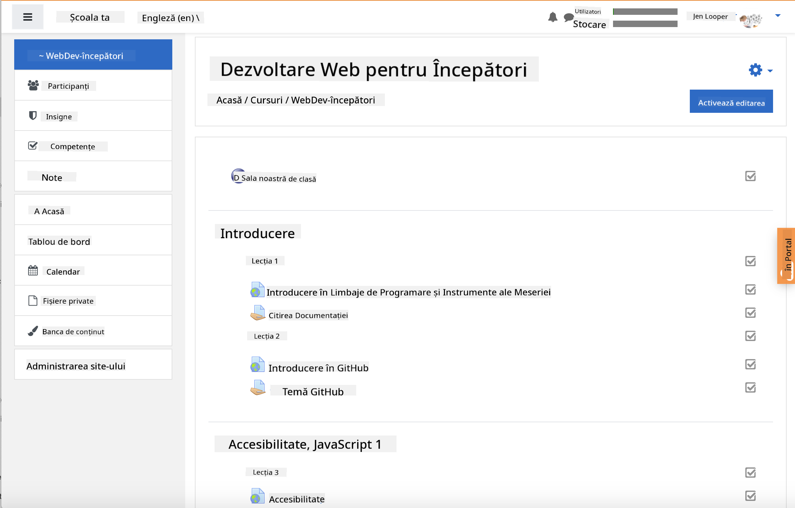
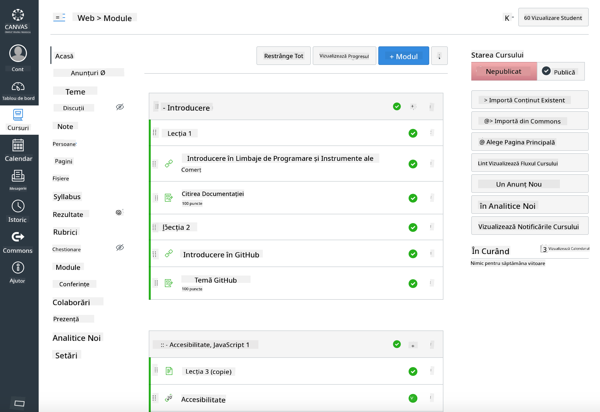

<!--
CO_OP_TRANSLATOR_METADATA:
{
  "original_hash": "75cb51f7ca9ea0b097ef4a1287e9290c",
  "translation_date": "2025-08-27T21:56:53+00:00",
  "source_file": "for-teachers.md",
  "language_code": "ro"
}
-->
## Pentru Educatori

Doriți să folosiți acest curriculum în sala de clasă? Vă rugăm să o faceți!

De fapt, îl puteți utiliza direct pe GitHub folosind GitHub Classroom.

Pentru a face acest lucru, faceți un fork al acestui repo. Va trebui să creați un repo pentru fiecare lecție, așa că va trebui să extrageți fiecare folder într-un repo separat. În acest fel, [GitHub Classroom](https://classroom.github.com/classrooms) poate prelua fiecare lecție separat.

Aceste [instrucțiuni complete](https://github.blog/2020-03-18-set-up-your-digital-classroom-with-github-classroom/) vă vor oferi o idee despre cum să vă configurați sala de clasă.

## Utilizarea în Moodle, Canvas sau Blackboard

Acest curriculum funcționează bine în aceste sisteme de management al învățării! Utilizați [fișierul de încărcare Moodle](../../../../../../../teaching-files/webdev-moodle.mbz) pentru conținutul complet sau încercați [fișierul Common Cartridge](../../../../../../../teaching-files/webdev-common-cartridge.imscc), care conține o parte din conținut. Moodle Cloud nu suportă exporturile complete Common Cartridge, așa că este de preferat să folosiți fișierul de descărcare Moodle, care poate fi încărcat în Canvas. Vă rugăm să ne spuneți cum putem îmbunătăți această experiență.

  
> Curriculumul într-o clasă Moodle

  
> Curriculumul în Canvas

## Utilizarea repo-ului așa cum este

Dacă doriți să utilizați acest repo în forma sa actuală, fără a folosi GitHub Classroom, acest lucru este posibil. Va trebui să comunicați cu studenții despre lecția pe care să o parcurgeți împreună.

Într-un format online (Zoom, Teams sau altul), puteți forma săli de discuții pentru chestionare și să ghidați studenții pentru a-i ajuta să fie pregătiți să învețe. Apoi, invitați studenții să participe la chestionare și să își trimită răspunsurile ca 'issues' la un anumit moment. Puteți face același lucru cu temele, dacă doriți ca studenții să lucreze colaborativ în mod deschis.

Dacă preferați un format mai privat, cereți studenților să facă fork curriculumului, lecție cu lecție, în propriile lor repo-uri GitHub private și să vă ofere acces. Apoi, aceștia pot completa chestionarele și temele în mod privat și vi le pot trimite prin issues pe repo-ul clasei.

Există multe moduri de a face acest lucru să funcționeze într-un format de clasă online. Vă rugăm să ne spuneți ce funcționează cel mai bine pentru dumneavoastră!

## Vă rugăm să ne oferiți feedback-ul dumneavoastră!

Dorim să facem acest curriculum cât mai util pentru dumneavoastră și studenții dumneavoastră. Conectați-vă cu noi în [Teacher corner](https://github.com/microsoft/Web-Dev-For-Beginners/discussions/categories/teacher-corner) și deschideți un [**issue nou**](https://github.com/microsoft/Web-Dev-For-Beginners/issues/new/choose) pentru orice solicitări, erori sau feedback.

---

**Declinare de responsabilitate**:  
Acest document a fost tradus folosind serviciul de traducere AI [Co-op Translator](https://github.com/Azure/co-op-translator). Deși ne străduim să asigurăm acuratețea, vă rugăm să rețineți că traducerile automate pot conține erori sau inexactități. Documentul original în limba sa natală ar trebui considerat sursa autoritară. Pentru informații critice, se recomandă traducerea profesională realizată de un specialist uman. Nu ne asumăm responsabilitatea pentru eventualele neînțelegeri sau interpretări greșite care pot apărea din utilizarea acestei traduceri.