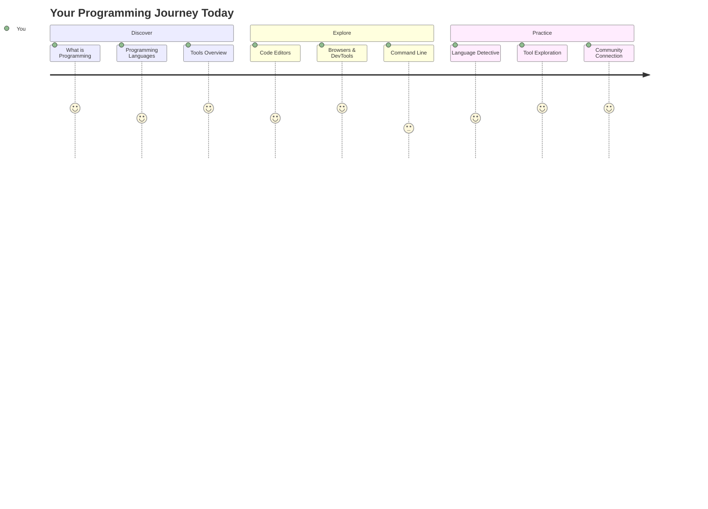
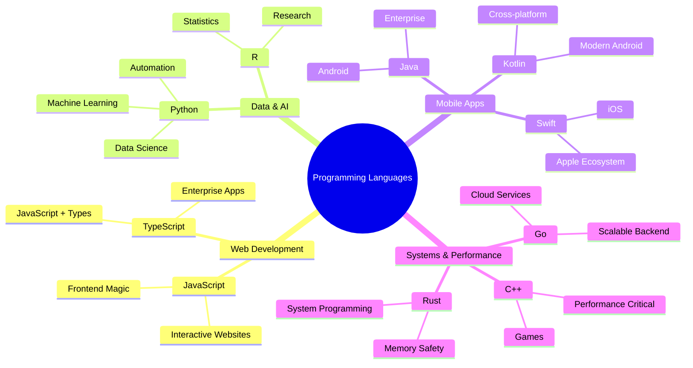
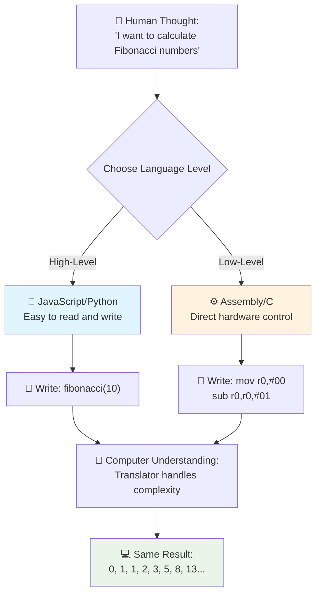
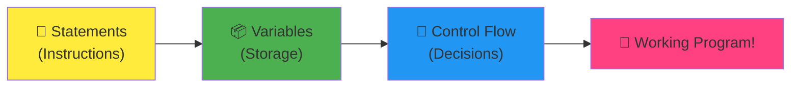
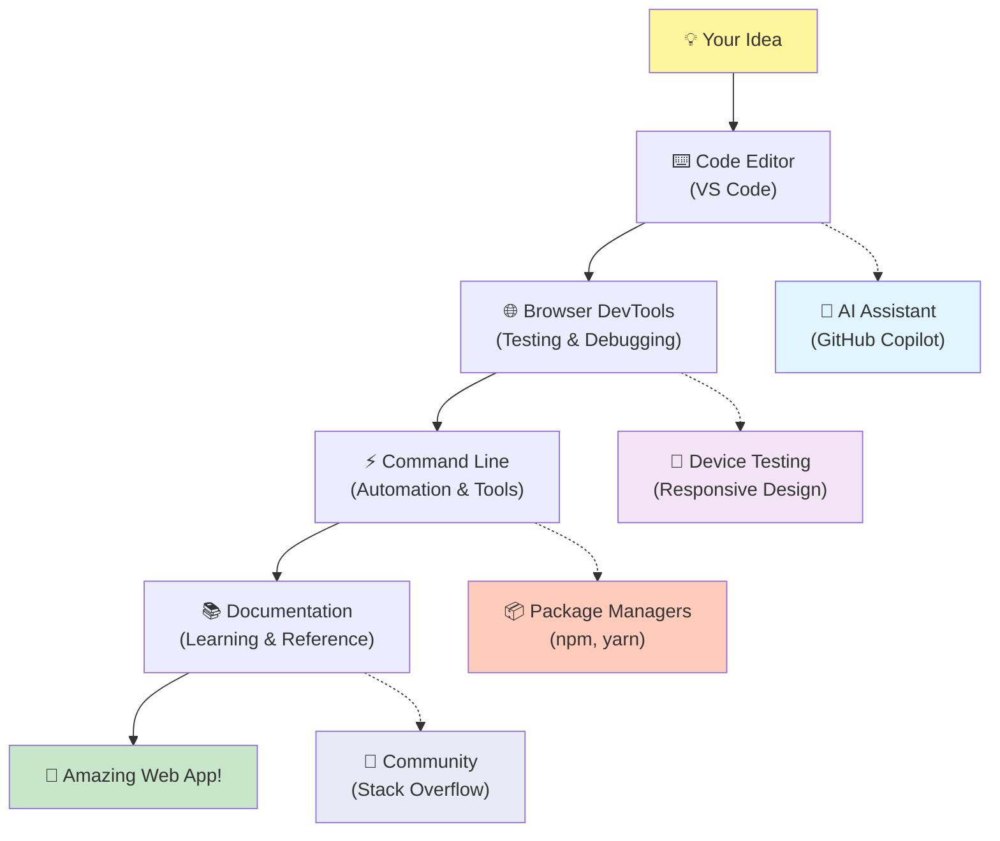
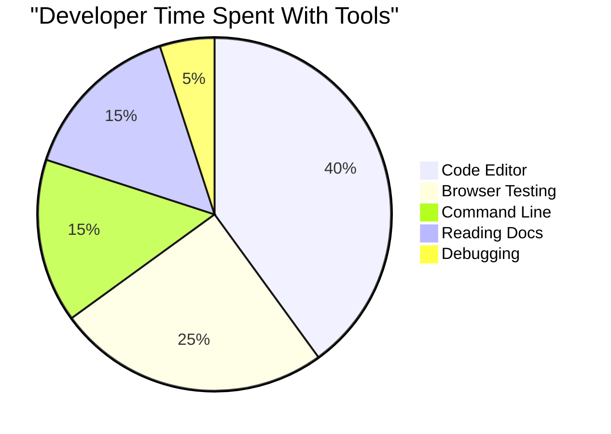
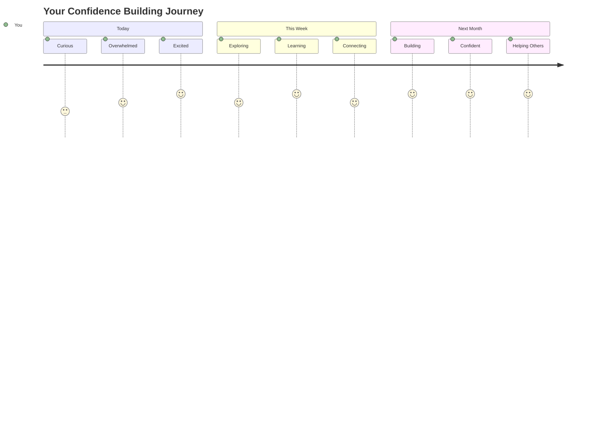

<!--
CO_OP_TRANSLATOR_METADATA:
{
  "original_hash": "d45ddcc54eb9232a76d08328b09d792e",
  "translation_date": "2025-11-03T23:14:20+00:00",
  "source_file": "1-getting-started-lessons/1-intro-to-programming-languages/README.md",
  "language_code": "ru"
}
-->
# Введение в языки программирования и современные инструменты разработчика

Привет, будущий разработчик! 👋 Могу я рассказать тебе кое-что, что до сих пор вызывает у меня мурашки каждый день? Ты собираешься узнать, что программирование — это не просто работа с компьютерами, это настоящая суперсила, которая позволяет воплощать в жизнь самые смелые идеи!

Ты знаешь тот момент, когда пользуешься любимым приложением, и все работает идеально? Когда нажимаешь кнопку, и происходит что-то абсолютно волшебное, заставляющее тебя задуматься: «Вау, как они ЭТО сделали?» Так вот, кто-то, возможно, такой же, как ты — сидя в любимой кофейне в два часа ночи с третьим эспрессо — написал код, который создал эту магию. И вот что тебя удивит: к концу этого урока ты не только поймешь, как они это сделали, но и захочешь попробовать сам!

Слушай, я прекрасно понимаю, если программирование кажется тебе пугающим прямо сейчас. Когда я только начинал, я честно думал, что для этого нужно быть каким-то математическим гением или заниматься кодированием с пяти лет. Но вот что полностью изменило мое представление: программирование — это как изучение нового языка. Ты начинаешь с «привет» и «спасибо», затем переходишь к заказу кофе, а потом, не успеешь оглянуться, как уже ведешь глубокие философские беседы! Только в данном случае ты разговариваешь с компьютерами, и, честно говоря, они самые терпеливые собеседники — они никогда не осуждают твои ошибки и всегда готовы попробовать снова!

Сегодня мы изучим невероятные инструменты, которые делают современную веб-разработку не только возможной, но и по-настоящему увлекательной. Я говорю о тех же редакторах, браузерах и рабочих процессах, которые разработчики Netflix, Spotify и твоей любимой студии приложений используют каждый день. И вот что заставит тебя пуститься в пляс от радости: большинство этих профессиональных инструментов, которые являются стандартом в индустрии, абсолютно бесплатны!


> Скетчноут от [Tomomi Imura](https://twitter.com/girlie_mac)



## Давайте узнаем, что вы уже знаете!

Прежде чем мы перейдем к интересным вещам, мне любопытно — что вы уже знаете о мире программирования? И слушайте, если вы смотрите на эти вопросы и думаете: «Я вообще ничего об этом не знаю», это не просто нормально, это идеально! Это значит, что вы находитесь в правильном месте. Подумайте об этом тесте как о разминке перед тренировкой — мы просто разогреваем мозг!

[Пройдите предварительный тест](https://forms.office.com/r/dru4TE0U9n?origin=lprLink)

## Приключение, которое мы начнем вместе

Окей, я искренне в восторге от того, что мы будем изучать сегодня! Честно, я бы хотел видеть ваше лицо, когда некоторые из этих концепций станут понятны. Вот невероятное путешествие, которое мы совершим вместе:

- **Что такое программирование (и почему это самое крутое занятие!)** — Мы узнаем, как код буквально является невидимой магией, которая управляет всем вокруг нас, от будильника, который знает, что наступило утро понедельника, до алгоритма, который идеально подбирает рекомендации на Netflix.
- **Языки программирования и их удивительные особенности** — Представьте, что вы пришли на вечеринку, где каждый человек обладает уникальными суперспособностями и способами решения задач. Именно так выглядит мир языков программирования, и вам понравится знакомиться с ними!
- **Основные строительные блоки, которые создают цифровую магию** — Подумайте о них как о самом креативном наборе LEGO. Как только вы поймете, как эти элементы соединяются, вы осознаете, что можете построить буквально все, что придет вам в голову.
- **Профессиональные инструменты, которые заставят вас почувствовать себя волшебником** — Я не преувеличиваю — эти инструменты действительно дадут вам ощущение суперсилы, и самое лучшее? Это те же инструменты, которые используют профессионалы!

> 💡 **Вот что важно**: Даже не думайте пытаться запомнить все сегодня! Сейчас я просто хочу, чтобы вы почувствовали искру вдохновения о том, что возможно. Детали запомнятся сами собой, когда мы будем практиковаться вместе — именно так происходит настоящее обучение!

> Вы можете пройти этот урок на [Microsoft Learn](https://docs.microsoft.com/learn/modules/web-development-101/introduction-programming/?WT.mc_id=academic-77807-sagibbon)!

## Так что же такое *программирование*?

Хорошо, давайте разберемся с вопросом на миллион: что же такое программирование на самом деле?

Я расскажу вам историю, которая полностью изменила мое представление об этом. На прошлой неделе я пытался объяснить маме, как пользоваться новым пультом от нашего умного телевизора. Я поймал себя на том, что говорю что-то вроде: «Нажми красную кнопку, но не большую красную кнопку, а маленькую красную кнопку слева... нет, с твоей другой стороны... хорошо, теперь держи ее две секунды, не одну, не три...» Знакомо? 😅

Это и есть программирование! Это искусство давать невероятно детализированные, пошаговые инструкции чему-то очень мощному, но нуждающемуся в абсолютно точных указаниях. Только вместо объяснений маме (которая может спросить: «Какую красную кнопку?!»), вы объясняете компьютеру (который просто делает именно то, что вы сказали, даже если то, что вы сказали, не совсем то, что вы имели в виду).

Вот что меня поразило, когда я впервые узнал об этом: компьютеры на самом деле довольно просты в своей основе. Они буквально понимают только две вещи — 1 и 0, что по сути означает «да» и «нет» или «включено» и «выключено». И все! Но вот где начинается магия — нам не нужно говорить на языке 1 и 0, как будто мы в «Матрице». Здесь на помощь приходят **языки программирования**. Они как лучшие переводчики в мире, которые берут ваши совершенно нормальные человеческие мысли и переводят их на язык компьютера.

И вот что до сих пор вызывает у меня мурашки каждое утро, когда я просыпаюсь: буквально *все* цифровое в вашей жизни началось с кого-то, возможно, сидящего в пижаме с чашкой кофе, печатающего код на своем ноутбуке. Тот фильтр в Instagram, который делает вас безупречным? Кто-то закодировал это. Рекомендация, которая привела вас к вашей новой любимой песне? Разработчик создал этот алгоритм. Приложение, которое помогает вам делить счет за ужин с друзьями? Да, кто-то подумал: «Это неудобно, я могу это исправить», и затем... они сделали это!

Когда вы учитесь программировать, вы не просто осваиваете новый навык — вы становитесь частью этого невероятного сообщества решателей проблем, которые каждый день думают: «А что, если я смогу создать что-то, что сделает чей-то день немного лучше?» Честно, есть ли что-то круче этого?

✅ **Интересный факт**: Вот что стоит поискать, когда у вас будет свободная минутка — как вы думаете, кто был первым программистом в мире? Подскажу: это может быть не тот, кого вы ожидаете! История этого человека абсолютно увлекательна и показывает, что программирование всегда было связано с творческим решением задач и нестандартным мышлением.

### 🧠 **Время проверки: как вы себя чувствуете?**

**Возьмите минутку, чтобы подумать:**
- Идея «давать инструкции компьютерам» теперь понятна?
- Можете ли вы придумать ежедневную задачу, которую хотели бы автоматизировать с помощью программирования?
- Какие вопросы у вас возникают о программировании?

> **Помните**: Это совершенно нормально, если некоторые концепции пока кажутся вам неясными. Изучение программирования — это как изучение нового языка, вашему мозгу нужно время, чтобы построить эти нейронные связи. Вы молодцы!

## Языки программирования — как разные вкусы магии

Окей, это может звучать странно, но доверьтесь мне — языки программирования очень похожи на разные жанры музыки. Подумайте: есть джаз, который плавный и импровизационный, рок — мощный и прямолинейный, классика — элегантная и структурированная, и хип-хоп — креативный и выразительный. У каждого стиля есть своя атмосфера, свое сообщество страстных поклонников, и каждый из них идеально подходит для разных настроений и случаев.

Языки программирования работают точно так же! Вы не будете использовать один и тот же язык для создания веселой мобильной игры и для обработки огромных объемов климатических данных, так же как вы не будете включать дэт-метал на занятии йогой (ну, на большинстве занятий йогой! 😄).

Но вот что меня поражает каждый раз, когда я думаю об этом: эти языки — как самый терпеливый и блестящий переводчик в мире, сидящий рядом с вами. Вы можете выражать свои идеи так, как это естественно для вашего человеческого мозга, а они берут на себя всю невероятно сложную работу по переводу этого на язык 1 и 0, который понимают компьютеры. Это как иметь друга, который идеально владеет и «человеческим творчеством», и «компьютерной логикой» — и он никогда не устает, не нуждается в перерывах на кофе и не осуждает вас за то, что вы задаете один и тот же вопрос дважды!

### Популярные языки программирования и их применение



| Язык | Лучшее применение | Почему он популярен |
|------|-------------------|---------------------|
| **JavaScript** | Веб-разработка, пользовательские интерфейсы | Работает в браузерах и обеспечивает интерактивность сайтов |
| **Python** | Наука о данных, автоматизация, ИИ | Легкий для чтения и изучения, мощные библиотеки |
| **Java** | Корпоративные приложения, Android-приложения | Независимость от платформы, надежность для крупных систем |
| **C#** | Windows-приложения, разработка игр | Сильная поддержка экосистемы Microsoft |
| **Go** | Облачные сервисы, серверные системы | Быстрый, простой, создан для современных вычислений |

### Высокоуровневые и низкоуровневые языки

Окей, это была концепция, которая буквально взорвала мой мозг, когда я только начинал учиться, поэтому я поделюсь аналогией, которая наконец помогла мне понять — и надеюсь, она поможет и вам!

Представьте, что вы посещаете страну, где не говорите на местном языке, и вам срочно нужно найти ближайший туалет (мы все были в такой ситуации, правда? 😅):

- **Низкоуровневое программирование** — это как изучение местного диалекта настолько хорошо, что вы можете общаться с бабушкой, продающей фрукты на углу, используя культурные отсылки, местный сленг и внутренние шутки, которые понимают только те, кто вырос там. Очень впечатляюще и невероятно эффективно... если вы случайно владеете языком! Но довольно сложно, если вы просто пытаетесь найти туалет.

- **Высокоуровневое программирование** — это как иметь того удивительного местного друга, который просто понимает вас. Вы можете сказать: «Мне действительно нужно найти туалет» на обычном английском, и он берет на себя весь культурный перевод и дает вам инструкции, которые имеют смысл для вашего не местного мозга.

В терминах программирования:
- **Низкоуровневые языки** (например, Assembly или C) позволяют вести невероятно детализированные разговоры с аппаратным обеспечением компьютера, но вам нужно думать как машина, что... ну, скажем так, это довольно серьезный сдвиг в мышлении!
- **Высокоуровневые языки** (например, JavaScript, Python или C#) позволяют вам думать как человек, пока они берут на себя всю машинную речь. Кроме того, у них есть невероятно дружелюбные сообщества, полные людей, которые помнят, каково это быть новичком, и искренне хотят помочь!

Угадайте, с каких я предложу вам начать? 😉 Высокоуровневые языки — это как тренировочные колеса, которые вы никогда не захотите снимать, потому что они делают весь процесс намного приятнее!



### Позвольте мне показать, почему высокоуровневые языки намного дружелюбнее

Хорошо, я собираюсь показать вам кое-что, что идеально демонстрирует, почему я влюбился в высокоуровневые языки, но сначала — мне нужно, чтобы вы пообещали мне кое-что. Когда вы увидите первый пример кода, не паникуйте! Он должен выглядеть пугающе. Именно это я хочу показать!

Мы посмотрим на одну и ту же задачу, написанную в двух совершенно разных стилях. Оба создают так называемую последовательность Фибоначчи — это красивый математический узор, где каждое число является суммой двух предыдущих: 0, 1, 1, 2, 3, 5, 8, 13... (Интересный факт: этот узор можно найти буквально везде в природе — спирали семян подсолнуха, узоры шишек, даже в форме галактик!)

Готовы увидеть разницу? Поехали!

**Высокоуровневый язык (JavaScript) — дружелюбный для человека:**

```javascript
// Step 1: Basic Fibonacci setup
const fibonacciCount = 10;
let current = 0;
let next = 1;

console.log('Fibonacci sequence:');
```

**Что делает этот код:**
- **Объявляет** константу для указания количества чисел Фибоначчи, которые мы хотим сгенерировать
- **Инициализирует** две переменные для отслеживания текущего и следующего чисел в последовательности
- **Устанавливает** начальные значения (0 и 1), которые определяют узор Фибоначчи
- **Выводит** заголовок, чтобы обозначить наш результат

```javascript
// Step 2: Generate the sequence with a loop
for (let i = 0; i < fibonacciCount; i++) {
  console.log(`Position ${i + 1}: ${current}`);
  
  // Calculate next number in sequence
  const sum = current + next;
  current = next;
  next = sum;
}
```

**Разберем, что здесь происходит:**
- **Цикл** проходит по каждой позиции в нашей последовательности, используя цикл `for`
- **Выводит** каждое число с его позицией, используя форматирование шаблонных строк
- **Вычисляет** следующее число Фибоначчи, складывая текущие и следующие значения
- **Обновляет** наши переменные для отслеживания, чтобы перейти к следующей итерации

```javascript
// Step 3: Modern functional approach
const generateFibonacci = (count) => {
  const sequence = [0, 1];
  
  for (let i = 2; i < count; i++) {
    sequence[i] = sequence[i - 1] + sequence[i - 2];
  }
  
  return sequence;
};

// Usage example
const fibSequence = generateFibonacci(10);
console.log(fibSequence);
```

**В приведенном выше коде мы:**
- **Создали** многоразовую функцию, используя современный синтаксис стрелочных функций
- **Построили** массив для хранения всей последовательности вместо вывода по одному числу
- **Использовали** индексацию массива для вычисления каждого нового числа на основе предыдущих значений
- **Вернули** полную последовательность для гибкого использования в других частях программы

**Низкоуровневый язык (ARM Assembly) — дружелюбный для компьютера:**

```assembly
 area ascen,code,readonly
 entry
 code32
 adr r0,thumb+1
 bx r0
 code16
thumb
 mov r0,#00
 sub r0,r0,#01
 mov r1,#01
 mov r4,#10
 ldr r2,=0x40000000
back add r0,r1
 str r0,[r2]
 add r2,#04
 mov r3,r0
 mov r0,r1
 mov r1,r3
 sub r4,#01
 cmp r4,#00
 bne back
 end
```

Обратите внимание, как версия на JavaScript читается почти как инструкции на английском языке, в то время как версия на Assembly использует загадочные команды, которые напрямую управляют процессором компьютера. Оба выполняют одну и ту же задачу, но высокоуровневый язык гораздо проще для понимания, написания и поддержки.

**Основные различия, которые вы заметите:**
- **Читаемость**: JavaScript использует описательные названия, такие как `fibonacciCount`, в то время как Assembly использует загадочные метки, такие как `r0`, `r1`.
- **Комментарии**: Высокоуровневые языки программирования поощряют пояснительные комментарии, которые делают код самодокументируемым.
- **Структура**: Логика JavaScript соответствует тому, как люди мыслят о решении задач шаг за шагом.
- **Поддержка**: Обновление версии JavaScript для различных требований выполняется просто и понятно.

✅ **О последовательности Фибоначчи**: Этот невероятно красивый числовой узор (где каждое число равно сумме двух предыдущих: 0, 1, 1, 2, 3, 5, 8...) встречается буквально *везде* в природе! Вы найдете его в спиралях подсолнухов, узорах шишек, изгибах раковин наутилуса и даже в том, как растут ветви деревьев. Просто потрясающе, как математика и код помогают нам понять и воссоздать узоры, которые природа использует для создания красоты!


## Основные элементы, которые создают магию

Хорошо, теперь, когда вы увидели, как выглядят языки программирования в действии, давайте разберем фундаментальные части, которые составляют буквально каждую программу, когда-либо написанную. Представьте их как основные ингредиенты вашего любимого рецепта – как только вы поймете, что делает каждый из них, вы сможете читать и писать код практически на любом языке!

Это похоже на изучение грамматики программирования. Помните, как в школе вы изучали существительные, глаголы и то, как составлять предложения? У программирования есть своя версия грамматики, и честно говоря, она намного логичнее и проще, чем грамматика английского языка! 😄

### Операторы: Пошаговые инструкции

Начнем с **операторов** – это как отдельные предложения в разговоре с вашим компьютером. Каждый оператор говорит компьютеру выполнить одно конкретное действие, как будто вы даете указания: "Поверни налево здесь", "Остановись на красный свет", "Припаркуйся на этом месте".

Мне нравится, насколько читаемыми обычно бывают операторы. Смотрите:

```javascript
// Basic statements that perform single actions
const userName = "Alex";                    
console.log("Hello, world!");              
const sum = 5 + 3;                         
```

**Что делает этот код:**
- **Объявляет** постоянную переменную для хранения имени пользователя.
- **Выводит** приветственное сообщение в консоль.
- **Вычисляет** и сохраняет результат математической операции.

```javascript
// Statements that interact with web pages
document.title = "My Awesome Website";      
document.body.style.backgroundColor = "lightblue";
```

**Шаг за шагом, что происходит:**
- **Изменяет** заголовок веб-страницы, который отображается на вкладке браузера.
- **Меняет** цвет фона всего тела страницы.

### Переменные: Система памяти вашей программы

Хорошо, **переменные** – это, честно говоря, одна из моих любимых концепций для объяснения, потому что они так похожи на вещи, которые вы уже используете каждый день!

Подумайте о списке контактов в вашем телефоне. Вы не запоминаете номера всех – вместо этого вы сохраняете "Мама", "Лучший друг" или "Пиццерия, которая доставляет до 2 ночи", и ваш телефон запоминает сами номера. Переменные работают точно так же! Они как подписанные контейнеры, где ваша программа может хранить информацию и извлекать ее позже, используя имя, которое действительно имеет смысл.

Вот что действительно круто: переменные могут изменяться по мере выполнения вашей программы (отсюда и название "переменная" – видите, что они сделали?). Точно так же, как вы можете обновить контакт пиццерии, когда найдете место получше, переменные могут обновляться, когда ваша программа узнает новую информацию или когда ситуация меняется!

Позвольте показать, как это просто и красиво:

```javascript
// Step 1: Creating basic variables
const siteName = "Weather Dashboard";        
let currentWeather = "sunny";               
let temperature = 75;                       
let isRaining = false;                      
```

**Понимание этих концепций:**
- **Храните** неизменяемые значения в переменных `const` (например, название сайта).
- **Используйте** `let` для значений, которые могут изменяться в ходе программы.
- **Присваивайте** разные типы данных: строки (текст), числа и логические значения (true/false).
- **Выбирайте** описательные имена, которые объясняют, что содержит каждая переменная.

```javascript
// Step 2: Working with objects to group related data
const weatherData = {                       
  location: "San Francisco",
  humidity: 65,
  windSpeed: 12
};
```

**В приведенном выше примере мы:**
- **Создали** объект для группировки связанных данных о погоде.
- **Организовали** несколько частей данных под одним именем переменной.
- **Использовали** пары ключ-значение для четкой маркировки каждой части информации.

```javascript
// Step 3: Using and updating variables
console.log(`${siteName}: Today is ${currentWeather} and ${temperature}°F`);
console.log(`Wind speed: ${weatherData.windSpeed} mph`);

// Updating changeable variables
currentWeather = "cloudy";                  
temperature = 68;                          
```

**Давайте разберем каждую часть:**
- **Отображение** информации с использованием шаблонных строк с синтаксисом `${}`.
- **Доступ** к свойствам объекта с помощью точечной нотации (`weatherData.windSpeed`).
- **Обновление** переменных, объявленных с `let`, чтобы отразить изменения условий.
- **Комбинирование** нескольких переменных для создания значимых сообщений.

```javascript
// Step 4: Modern destructuring for cleaner code
const { location, humidity } = weatherData; 
console.log(`${location} humidity: ${humidity}%`);
```

**Что нужно знать:**
- **Извлечение** конкретных свойств из объектов с помощью деструктурирующего присваивания.
- **Создание** новых переменных автоматически с теми же именами, что и ключи объекта.
- **Упрощение** кода, избегая повторяющейся точечной нотации.

### Управление потоком: Учим программу думать

Хорошо, вот где программирование становится абсолютно потрясающим! **Управление потоком** – это, по сути, обучение вашей программы принимать умные решения, точно так же, как вы делаете это каждый день, даже не задумываясь.

Представьте: сегодня утром вы, вероятно, прошли через что-то вроде "Если идет дождь, я возьму зонт. Если холодно, я надену куртку. Если я опаздываю, я пропущу завтрак и возьму кофе по пути." Ваш мозг естественным образом следует этой логике "если-то" десятки раз каждый день!

Это то, что делает программы умными и живыми, а не просто следующими скучному, предсказуемому сценарию. Они могут действительно смотреть на ситуацию, оценивать, что происходит, и реагировать соответствующим образом. Это как дать вашей программе мозг, который может адаптироваться и принимать решения!

Хотите увидеть, как это работает? Позвольте показать:

```javascript
// Step 1: Basic conditional logic
const userAge = 17;

if (userAge >= 18) {
  console.log("You can vote!");
} else {
  const yearsToWait = 18 - userAge;
  console.log(`You'll be able to vote in ${yearsToWait} year(s).`);
}
```

**Что делает этот код:**
- **Проверяет**, соответствует ли возраст пользователя требованиям для голосования.
- **Выполняет** разные блоки кода в зависимости от результата условия.
- **Вычисляет** и отображает, сколько времени осталось до возможности голосования, если возраст меньше 18.
- **Предоставляет** конкретную, полезную обратную связь для каждого сценария.

```javascript
// Step 2: Multiple conditions with logical operators
const userAge = 17;
const hasPermission = true;

if (userAge >= 18 && hasPermission) {
  console.log("Access granted: You can enter the venue.");
} else if (userAge >= 16) {
  console.log("You need parent permission to enter.");
} else {
  console.log("Sorry, you must be at least 16 years old.");
}
```

**Разберем, что здесь происходит:**
- **Комбинирует** несколько условий с помощью оператора `&&` (и).
- **Создает** иерархию условий с помощью `else if` для нескольких сценариев.
- **Обрабатывает** все возможные случаи с финальным оператором `else`.
- **Предоставляет** четкую, действенную обратную связь для каждой ситуации.

```javascript
// Step 3: Concise conditional with ternary operator
const votingStatus = userAge >= 18 ? "Can vote" : "Cannot vote yet";
console.log(`Status: ${votingStatus}`);
```

**Что нужно помнить:**
- **Используйте** тернарный оператор (`? :`) для простых условий с двумя вариантами.
- **Пишите** условие сначала, затем `?`, затем результат для true, затем `:`, затем результат для false.
- **Применяйте** этот шаблон, когда нужно присвоить значения на основе условий.

```javascript
// Step 4: Handling multiple specific cases
const dayOfWeek = "Tuesday";

switch (dayOfWeek) {
  case "Monday":
  case "Tuesday":
  case "Wednesday":
  case "Thursday":
  case "Friday":
    console.log("It's a weekday - time to work!");
    break;
  case "Saturday":
  case "Sunday":
    console.log("It's the weekend - time to relax!");
    break;
  default:
    console.log("Invalid day of the week");
}
```

**Этот код выполняет следующее:**
- **Сравнивает** значение переменной с несколькими конкретными случаями.
- **Группирует** похожие случаи вместе (будни против выходных).
- **Выполняет** соответствующий блок кода, когда найдено совпадение.
- **Включает** случай `default` для обработки неожиданных значений.
- **Использует** операторы `break`, чтобы предотвратить выполнение следующего случая.

> 💡 **Аналогия из реального мира**: Представьте управление потоком как самый терпеливый GPS, который дает вам указания. Он может сказать: "Если на Main Street пробка, поезжайте по шоссе. Если на шоссе идет ремонт, попробуйте живописный маршрут." Программы используют точно такую же условную логику, чтобы реагировать разумно на разные ситуации и всегда предоставлять пользователям лучший возможный опыт.

### 🎯 **Проверка концепции: освоение основ**

**Давайте проверим, как вы справляетесь с основами:**
- Можете ли вы объяснить разницу между переменной и оператором своими словами?
- Придумайте реальную ситуацию, где вы бы использовали решение "если-то" (например, наш пример с голосованием).
- Что вас удивило в логике программирования?

**Быстрый заряд уверенности:**


✅ **Что будет дальше**: Мы будем с огромным удовольствием углубляться в эти концепции, продолжая это невероятное путешествие вместе! Сейчас просто сосредоточьтесь на том, чтобы почувствовать волнение от всех удивительных возможностей, которые вас ждут впереди. Конкретные навыки и техники запомнятся естественным образом, когда мы будем практиковаться вместе – обещаю, это будет намного веселее, чем вы могли ожидать!

## Инструменты для работы

Хорошо, вот здесь я действительно так взволнован, что едва могу сдержаться! 🚀 Мы собираемся поговорить об удивительных инструментах, которые заставят вас почувствовать, будто вам только что вручили ключи от цифрового космического корабля.

Знаете, как у шеф-повара есть идеально сбалансированные ножи, которые ощущаются как продолжение его рук? Или как у музыканта есть та самая гитара, которая начинает "петь", как только он касается ее? У разработчиков есть своя версия этих волшебных инструментов, и вот что вас абсолютно поразит – большинство из них совершенно бесплатны!

Я буквально подпрыгиваю на стуле, думая о том, чтобы поделиться ими с вами, потому что они полностью революционизировали то, как мы создаем программное обеспечение. Мы говорим о помощниках программирования с искусственным интеллектом, которые могут помочь писать ваш код (я не шучу!), облачных средах, где вы можете создавать целые приложения буквально из любого места с Wi-Fi, и инструментах отладки, настолько сложных, что они похожи на рентгеновское зрение для ваших программ.

И вот часть, которая до сих пор вызывает у меня мурашки: это не "инструменты для начинающих", которые вы перерастете. Это те же самые профессиональные инструменты, которые разработчики Google, Netflix и той инди-студии приложений, которую вы любите, используют прямо сейчас. Вы будете чувствовать себя настоящим профессионалом, используя их!



### Редакторы кода и IDE: ваши новые цифровые лучшие друзья

Давайте поговорим о редакторах кода – они серьезно станут вашими новыми любимыми местами для работы! Представьте их как ваше личное убежище для кодирования, где вы будете проводить большую часть времени, создавая и совершенствуя свои цифровые творения.

Но вот что абсолютно волшебно в современных редакторах: это не просто красивые текстовые редакторы. Это как если бы рядом с вами 24/7 сидел самый блестящий и поддерживающий наставник по программированию. Они ловят ваши опечатки, прежде чем вы их заметите, предлагают улучшения, которые заставляют вас выглядеть гением, помогают понять, что делает каждый кусочек кода, и некоторые из них даже предсказывают, что вы собираетесь написать, и предлагают закончить ваши мысли!

Я помню, когда впервые открыл для себя автодополнение – я буквально почувствовал, что живу в будущем. Вы начинаете писать что-то, и ваш редактор говорит: "Эй, вы думали об этой функции, которая делает именно то, что вам нужно?" Это как если бы у вас был читающий мысли напарник по кодированию!

**Что делает эти редакторы такими невероятными?**

Современные редакторы кода предлагают впечатляющий набор функций, разработанных для повышения вашей продуктивности:

| Функция | Что она делает | Почему это помогает |
|---------|----------------|---------------------|
| **Подсветка синтаксиса** | Раскрашивает разные части вашего кода | Упрощает чтение кода и поиск ошибок |
| **Автодополнение** | Предлагает код, пока вы печатаете | Ускоряет кодирование и уменьшает количество опечаток |
| **Инструменты отладки** | Помогают находить и исправлять ошибки | Экономят часы на устранение неполадок |
| **Расширения** | Добавляют специализированные функции | Настраивают редактор для любой технологии |
| **AI-помощники** | Предлагают код и объяснения | Ускоряют обучение и продуктивность |

> 🎥 **Видео-ресурс**: Хотите увидеть эти инструменты в действии? Посмотрите [видео о инструментах для работы](https://youtube.com/watch?v=69WJeXGBdxg) для подробного обзора.

#### Рекомендуемые редакторы для веб-разработки

**[Visual Studio Code](https://code.visualstudio.com/?WT.mc_id=academic-77807-sagibbon)** (Бесплатно)
- Самый популярный среди веб-разработчиков.
- Отличная экосистема расширений.
- Встроенный терминал и интеграция с Git.
- **Обязательные расширения**:
  - [GitHub Copilot](https://marketplace.visualstudio.com/items?itemName=GitHub.copilot) - предложения кода с поддержкой AI.
  - [Live Share](https://marketplace.visualstudio.com/items?itemName=MS-vsliveshare.vsliveshare) - совместная работа в реальном времени.
  - [Prettier](https://marketplace.visualstudio.com/items?itemName=esbenp.prettier-vscode) - автоматическое форматирование кода.
  - [Code Spell Checker](https://marketplace.visualstudio.com/items?itemName=streetsidesoftware.code-spell-checker) - поиск опечаток в коде.

**[JetBrains WebStorm](https://www.jetbrains.com/webstorm/)** (Платно, бесплатно для студентов)
- Расширенные инструменты отладки и тестирования.
- Интеллектуальное автодополнение кода.
- Встроенный контроль версий.

**Облачные IDE** (Различные цены)
- [GitHub Codespaces](https://github.com/features/codespaces) - Полный VS Code в вашем браузере.
- [Replit](https://replit.com/) - Отлично подходит для обучения и обмена кодом.
- [StackBlitz](https://stackblitz.com/) - Мгновенная разработка веб-приложений полного стека.

> 💡 **Совет для начала**: Начните с Visual Studio Code – он бесплатный, широко используется в индустрии и имеет огромное сообщество, создающее полезные учебные материалы и расширения.


### Веб-браузеры: ваша секретная лаборатория для разработки

Хорошо, приготовьтесь к тому, чтобы ваш разум был полностью поражен! Знаете, как вы использовали браузеры для прокрутки социальных сетей и просмотра видео? Оказывается, они скрывали эту невероятную секретную лабораторию разработчика все это время, просто ожидая, когда вы ее откроете!

Каждый раз, когда вы нажимаете правой кнопкой мыши на веб-странице и выбираете "Inspect Element", вы открываете скрытый мир инструментов разработчика, которые, честно говоря, мощнее, чем некоторые дорогие программы, за которые я раньше платил сотни долларов. Это как обнаружить, что ваша обычная кухня скрывает профессиональную лабораторию шеф-повара за секретной панелью!
Когда мне впервые показали инструменты разработчика в браузере, я провел около трех часов, просто нажимая на разные кнопки и восклицая: "ПОДОЖДИ, ОН МОЖЕТ ДЕЛАТЬ И ЭТО?!" Вы буквально можете редактировать любой сайт в реальном времени, видеть, как быстро загружается каждая его часть, тестировать, как ваш сайт выглядит на разных устройствах, и даже отлаживать JavaScript, как настоящий профессионал. Это просто потрясающе!

**Почему браузеры — ваш секретное оружие:**

Когда вы создаете сайт или веб-приложение, вам нужно увидеть, как оно выглядит и работает в реальном мире. Браузеры не только отображают вашу работу, но и предоставляют подробную информацию о производительности, доступности и возможных проблемах.

#### Инструменты разработчика в браузере (DevTools)

Современные браузеры включают в себя комплексные наборы инструментов для разработчиков:

| Категория инструмента | Что он делает | Пример использования |
|------------------------|---------------|-----------------------|
| **Инспектор элементов** | Просмотр и редактирование HTML/CSS в реальном времени | Настройка стилей с мгновенным результатом |
| **Консоль** | Просмотр сообщений об ошибках и тестирование JavaScript | Отладка проблем и эксперименты с кодом |
| **Монитор сети** | Отслеживание загрузки ресурсов | Оптимизация производительности и времени загрузки |
| **Проверка доступности** | Тестирование инклюзивного дизайна | Убедитесь, что ваш сайт доступен для всех пользователей |
| **Симулятор устройств** | Предварительный просмотр на экранах разных размеров | Тестирование адаптивного дизайна без множества устройств |

#### Рекомендуемые браузеры для разработки

- **[Chrome](https://developers.google.com/web/tools/chrome-devtools/)** - Инструменты разработчика, ставшие стандартом в индустрии, с обширной документацией
- **[Firefox](https://developer.mozilla.org/docs/Tools)** - Отличные инструменты для работы с CSS Grid и доступностью
- **[Edge](https://docs.microsoft.com/microsoft-edge/devtools-guide-chromium/?WT.mc_id=academic-77807-sagibbon)** - Основан на Chromium, с ресурсами для разработчиков от Microsoft

> ⚠️ **Важный совет по тестированию**: Всегда тестируйте свои сайты в нескольких браузерах! То, что идеально работает в Chrome, может выглядеть иначе в Safari или Firefox. Профессиональные разработчики тестируют свои проекты во всех основных браузерах, чтобы обеспечить единообразный пользовательский опыт.

### Инструменты командной строки: ваш путь к суперспособностям разработчика

Давайте будем честными: когда я впервые увидел командную строку — этот пугающий черный экран с мигающим текстом — я буквально подумал: "Нет, ни за что! Это выглядит как что-то из хакерского фильма 80-х, и я точно недостаточно умён для этого!" 😅

Но вот что я хотел бы знать тогда, и что я говорю вам сейчас: командная строка не страшная — на самом деле, это как прямой разговор с вашим компьютером. Представьте, что это как разница между заказом еды через модное приложение с картинками и меню (что, конечно, удобно) и походом в любимый местный ресторан, где шеф-повар знает, что вам нравится, и может приготовить что-то идеальное, просто услышав "удивите меня чем-нибудь вкусным".

Командная строка — это место, где разработчики чувствуют себя настоящими волшебниками. Вы вводите несколько, казалось бы, магических слов (хорошо, это просто команды, но они действительно кажутся магическими!), нажимаете Enter, и БАЦ — вы создаете целые структуры проектов, устанавливаете мощные инструменты со всего мира или размещаете свое приложение в интернете для миллионов пользователей. Как только вы почувствуете эту силу, это становится действительно увлекательным!

**Почему командная строка станет вашим любимым инструментом:**

Хотя графические интерфейсы отлично подходят для многих задач, командная строка превосходит их в автоматизации, точности и скорости. Многие инструменты для разработки работают преимущественно через интерфейсы командной строки, и умение эффективно ими пользоваться может значительно повысить вашу продуктивность.

```bash
# Step 1: Create and navigate to project directory
mkdir my-awesome-website
cd my-awesome-website
```

**Что делает этот код:**
- **Создает** новую директорию под названием "my-awesome-website" для вашего проекта
- **Переходит** в только что созданную директорию, чтобы начать работу

```bash
# Step 2: Initialize project with package.json
npm init -y

# Install modern development tools
npm install --save-dev vite prettier eslint
npm install --save-dev @eslint/js
```

**Пошагово, что происходит:**
- **Инициализирует** новый проект Node.js с настройками по умолчанию, используя `npm init -y`
- **Устанавливает** Vite как современный инструмент сборки для быстрой разработки и сборки
- **Добавляет** Prettier для автоматического форматирования кода и ESLint для проверки качества кода
- **Использует** флаг `--save-dev`, чтобы отметить их как зависимости только для разработки

```bash
# Step 3: Create project structure and files
mkdir src assets
echo '<!DOCTYPE html><html><head><title>My Site</title></head><body><h1>Hello World</h1></body></html>' > index.html

# Start development server
npx vite
```

**В приведенном выше примере мы:**
- **Организовали** наш проект, создав отдельные папки для исходного кода и ресурсов
- **Сгенерировали** базовый HTML-файл с правильной структурой документа
- **Запустили** сервер разработки Vite для живого обновления и замены модулей на лету

#### Основные инструменты командной строки для веб-разработки

| Инструмент | Назначение | Зачем он нужен |
|------------|------------|----------------|
| **[Git](https://git-scm.com/)** | Контроль версий | Отслеживание изменений, совместная работа, резервное копирование |
| **[Node.js & npm](https://nodejs.org/)** | Среда выполнения JavaScript и управление пакетами | Запуск JavaScript вне браузеров, установка современных инструментов разработки |
| **[Vite](https://vitejs.dev/)** | Инструмент сборки и сервер разработки | Молниеносная разработка с заменой модулей на лету |
| **[ESLint](https://eslint.org/)** | Качество кода | Автоматический поиск и исправление проблем в JavaScript |
| **[Prettier](https://prettier.io/)** | Форматирование кода | Поддержание кода в едином формате и удобочитаемости |

#### Платформо-зависимые варианты

**Windows:**
- **[Windows Terminal](https://docs.microsoft.com/windows/terminal/?WT.mc_id=academic-77807-sagibbon)** - Современный терминал с множеством функций
- **[PowerShell](https://docs.microsoft.com/powershell/?WT.mc_id=academic-77807-sagibbon)** 💻 - Мощная среда для скриптов
- **[Command Prompt](https://docs.microsoft.com/windows-server/administration/windows-commands/?WT.mc_id=academic-77807-sagibbon)** 💻 - Традиционная командная строка Windows

**macOS:**
- **[Terminal](https://support.apple.com/guide/terminal/)** 💻 - Встроенное приложение терминала
- **[iTerm2](https://iterm2.com/)** - Улучшенный терминал с расширенными функциями

**Linux:**
- **[Bash](https://www.gnu.org/software/bash/)** 💻 - Стандартная оболочка Linux
- **[KDE Konsole](https://docs.kde.org/trunk5/en/konsole/konsole/index.html)** - Продвинутый эмулятор терминала

> 💻 = Предустановлено в операционной системе

> 🎯 **Путь обучения**: Начните с базовых команд, таких как `cd` (смена директории), `ls` или `dir` (список файлов) и `mkdir` (создание папки). Практикуйтесь с командами современного рабочего процесса, такими как `npm install`, `git status` и `code .` (открывает текущую директорию в VS Code). По мере того, как вы будете чувствовать себя более уверенно, вы естественным образом освоите более сложные команды и техники автоматизации.

### Документация: ваш всегда доступный наставник

Позвольте мне поделиться небольшим секретом, который заставит вас почувствовать себя намного лучше в роли новичка: даже самые опытные разработчики проводят огромное количество времени, читая документацию. И это не потому, что они не знают, что делают – это на самом деле признак мудрости!

Думайте о документации как о доступе к самым терпеливым и знающим учителям, которые доступны 24/7. Застряли с проблемой в 2 часа ночи? Документация всегда рядом с теплым виртуальным объятием и точным ответом, который вам нужен. Хотите узнать о какой-то крутой новой функции, о которой все говорят? Документация поможет вам с пошаговыми примерами. Пытаетесь понять, почему что-то работает именно так? Угадайте что – документация готова объяснить это так, что наконец-то станет понятно!

Вот что полностью изменило мое восприятие: мир веб-разработки движется невероятно быстро, и никто (абсолютно никто!) не держит все в памяти. Я видел, как старшие разработчики с опытом более 15 лет искали базовый синтаксис, и знаете что? Это не стыдно – это умно! Дело не в идеальной памяти, а в умении быстро находить надежные ответы и понимать, как их применять.

**Вот где происходит настоящая магия:**

Профессиональные разработчики значительную часть времени проводят за чтением документации – не потому, что они не знают, что делают, а потому что мир веб-разработки развивается так быстро, что для того, чтобы быть в курсе, требуется постоянное обучение. Хорошая документация помогает понять не только *как* использовать что-то, но и *почему* и *когда* это использовать.

#### Основные ресурсы документации

**[Mozilla Developer Network (MDN)](https://developer.mozilla.org/docs/Web)**
- Золотой стандарт документации по веб-технологиям
- Полные руководства по HTML, CSS и JavaScript
- Включает информацию о совместимости с браузерами
- Содержит практические примеры и интерактивные демонстрации

**[Web.dev](https://web.dev)** (от Google)
- Лучшие практики современной веб-разработки
- Руководства по оптимизации производительности
- Принципы доступности и инклюзивного дизайна
- Кейсы из реальных проектов

**[Microsoft Developer Documentation](https://docs.microsoft.com/microsoft-edge/#microsoft-edge-for-developers)**
- Ресурсы для разработки в браузере Edge
- Руководства по прогрессивным веб-приложениям
- Инсайты по кросс-платформенной разработке

**[Frontend Masters Learning Paths](https://frontendmasters.com/learn/)**
- Структурированные учебные программы
- Видеокурсы от экспертов индустрии
- Практические упражнения по программированию

> 📚 **Стратегия обучения**: Не пытайтесь запомнить документацию – вместо этого научитесь эффективно ориентироваться в ней. Сохраняйте закладки на часто используемые ссылки и практикуйтесь в использовании функций поиска для быстрого нахождения нужной информации.

### 🔧 **Проверка мастерства инструментов: что вам откликается?**

**Подумайте:**
- Какой инструмент вам больше всего хочется попробовать в первую очередь? (Нет неправильных ответов!)
- Командная строка все еще кажется пугающей, или вы уже заинтересованы?
- Можете ли вы представить, как используете инструменты разработчика браузера, чтобы заглянуть за кулисы ваших любимых сайтов?



> **Интересный факт**: Большинство разработчиков проводят около 40% своего времени в редакторе кода, но обратите внимание, сколько времени уходит на тестирование, обучение и решение проблем. Программирование – это не только написание кода, но и создание впечатлений!

✅ **Пища для размышлений**: Вот что интересно – как вы думаете, чем инструменты для создания сайтов (разработка) могут отличаться от инструментов для проектирования их внешнего вида (дизайн)? Это как разница между архитектором, который проектирует красивый дом, и подрядчиком, который его строит. Оба важны, но им нужны разные наборы инструментов! Такой подход поможет вам увидеть общую картину того, как создаются сайты.

## Вызов GitHub Copilot Agent 🚀

Используйте режим Agent, чтобы выполнить следующий вызов:

**Описание:** Исследуйте функции современного редактора кода или IDE и продемонстрируйте, как он может улучшить ваш рабочий процесс как веб-разработчика.

**Задание:** Выберите редактор кода или IDE (например, Visual Studio Code, WebStorm или облачный IDE). Перечислите три функции или расширения, которые помогают вам писать, отлаживать или поддерживать код более эффективно. Для каждого предоставьте краткое объяснение, как оно улучшает ваш рабочий процесс.

---

## 🚀 Вызов

**Ну что, детектив, готовы к первому делу?**

Теперь, когда у вас есть эта потрясающая база, у меня есть задание, которое поможет вам увидеть, насколько разнообразным и увлекательным может быть мир программирования. И послушайте – это не про написание кода, так что никакого давления! Представьте, что вы детектив, исследующий языки программирования, на своем первом захватывающем деле!

**Ваша миссия, если вы решите ее принять:**
1. **Станьте исследователем языков**: Выберите три языка программирования из совершенно разных областей – возможно, один для создания сайтов, другой для разработки мобильных приложений, и третий для анализа данных для ученых. Найдите примеры выполнения одной и той же простой задачи на каждом языке. Обещаю, вы будете поражены, насколько они могут отличаться, выполняя одну и ту же задачу!

2. **Раскройте их истории происхождения**: Что делает каждый язык особенным? Вот интересный факт – каждый язык программирования был создан, потому что кто-то подумал: "Знаете что? Должен быть лучший способ решить эту конкретную проблему." Можете ли вы выяснить, какие это были проблемы? Некоторые из этих историй действительно увлекательны!

3. **Познакомьтесь с сообществами**: Узнайте, насколько приветливы и увлечены сообщества каждого языка. У некоторых миллионы разработчиков делятся знаниями и помогают друг другу, другие меньше, но невероятно сплоченные и поддерживающие. Вам понравится видеть разные "личности" этих сообществ!

4. **Прислушайтесь к своим ощущениям**: Какой язык кажется вам наиболее доступным на данный момент? Не переживайте о "идеальном" выборе – просто доверьтесь своим инстинктам! Здесь нет неправильных ответов, и вы всегда можете изучить другие позже.

**Бонусное задание детектива**: Узнайте, какие крупные сайты или приложения созданы на каждом языке. Гарантирую, вы будете удивлены, узнав, что стоит за Instagram, Netflix или той мобильной игрой, от которой вы не можете оторваться!

> 💡 **Помните**: Вы не пытаетесь стать экспертом в этих языках сегодня. Вы просто знакомитесь с "районом", прежде чем решить, где хотите обосноваться. Не торопитесь, получайте удовольствие и позвольте вашему любопытству вести вас!

## Давайте отпразднуем ваши открытия!

Ого, вы узнали столько невероятной информации сегодня! Я искренне рад видеть, сколько из этого удивительного путешествия осталось с вами. И помните – это не тест, где нужно все сделать идеально. Это скорее праздник всего того классного, что вы узнали о этом увлекательном мире, в который вы собираетесь погрузиться!

[Пройдите тест после урока](https://ff-quizzes.netlify.app/web/)
## Обзор и самостоятельное изучение

**Не торопитесь, исследуйте и получайте удовольствие!**

Сегодня вы узнали много нового, и это повод для гордости! А теперь начинается самое интересное – изучение тем, которые вас заинтересовали. Помните, это не домашнее задание – это приключение!

**Погрузитесь в то, что вас вдохновляет:**

**Практикуйтесь с языками программирования:**
- Посетите официальные сайты 2-3 языков, которые привлекли ваше внимание. У каждого из них есть своя уникальная история и особенности!
- Попробуйте онлайн-площадки для кодинга, такие как [CodePen](https://codepen.io/), [JSFiddle](https://jsfiddle.net/) или [Replit](https://replit.com/). Не бойтесь экспериментировать – вы ничего не сломаете!
- Почитайте о том, как появился ваш любимый язык программирования. Серьезно, некоторые из этих историй очень увлекательны и помогут вам понять, почему языки работают именно так.

**Освойте новые инструменты:**
- Скачайте Visual Studio Code, если вы еще этого не сделали – он бесплатный, и вам точно понравится!
- Потратьте несколько минут на изучение магазина расширений. Это как магазин приложений для вашего редактора кода!
- Откройте инструменты разработчика в вашем браузере и просто изучите их. Не переживайте, если что-то непонятно – просто привыкните к интерфейсу.

**Присоединяйтесь к сообществу:**
- Подпишитесь на сообщества разработчиков на [Dev.to](https://dev.to/), [Stack Overflow](https://stackoverflow.com/) или [GitHub](https://github.com/). Сообщество программистов невероятно дружелюбно к новичкам!
- Посмотрите обучающие видео по программированию на YouTube. Есть множество отличных авторов, которые помнят, каково это – быть новичком.
- Подумайте о том, чтобы присоединиться к местным встречам или онлайн-сообществам. Поверьте, разработчики любят помогать новичкам!

> 🎯 **Запомните, что важно**: От вас не ожидают, что вы станете мастером программирования за одну ночь! Сейчас вы просто знакомитесь с этим удивительным миром, частью которого вам предстоит стать. Не торопитесь, наслаждайтесь процессом и помните – каждый разработчик, которым вы восхищаетесь, когда-то был на вашем месте, испытывая волнение и, возможно, немного растерянность. Это абсолютно нормально, и это значит, что вы на правильном пути!


## Задание

[Чтение документации](assignment.md)

> 💡 **Небольшой совет для выполнения задания**: Мне бы очень хотелось, чтобы вы исследовали инструменты, которые мы еще не обсуждали! Пропустите редакторы, браузеры и инструменты командной строки, о которых мы уже говорили – существует целая невероятная вселенная удивительных инструментов для разработки, которые ждут, чтобы их открыли. Ищите те, которые активно поддерживаются и имеют живые, дружелюбные сообщества (у таких инструментов обычно лучшие учебные материалы и самые отзывчивые люди, готовые помочь, когда вы столкнетесь с трудностями).

---

## 🚀 Таймлайн вашего пути в программировании

### ⚡ **Что можно сделать за следующие 5 минут**
- [ ] Добавьте в закладки 2-3 сайта языков программирования, которые вас заинтересовали
- [ ] Скачайте Visual Studio Code, если вы еще этого не сделали
- [ ] Откройте инструменты разработчика в браузере (F12) и изучите любой сайт
- [ ] Присоединитесь к одному сообществу программистов (Dev.to, Reddit r/webdev или Stack Overflow)

### ⏰ **Что можно достичь за час**
- [ ] Пройдите тест после урока и проанализируйте свои ответы
- [ ] Настройте VS Code с расширением GitHub Copilot
- [ ] Попробуйте пример "Hello World" на 2 разных языках программирования онлайн
- [ ] Посмотрите видео "День из жизни разработчика" на YouTube
- [ ] Начните исследование выбранного языка программирования (из задания)

### 📅 **Ваше недельное приключение**
- [ ] Выполните задание и изучите 3 новых инструмента для разработки
- [ ] Подпишитесь на 5 разработчиков или аккаунтов о программировании в социальных сетях
- [ ] Попробуйте создать что-то небольшое в CodePen или Replit (хотя бы "Привет, [Ваше имя]!")
- [ ] Прочитайте блог разработчика о его пути в программировании
- [ ] Присоединитесь к виртуальной встрече или посмотрите доклад о программировании
- [ ] Начните изучение выбранного языка с помощью онлайн-уроков

### 🗓️ **Ваше месячное преобразование**
- [ ] Создайте свой первый небольшой проект (даже простой веб-сайт подойдет!)
- [ ] Внесите вклад в проект с открытым исходным кодом (начните с исправления документации)
- [ ] Станьте наставником для кого-то, кто только начинает изучать программирование
- [ ] Создайте свой сайт-портфолио разработчика
- [ ] Свяжитесь с местными сообществами разработчиков или учебными группами
- [ ] Начните планировать свою следующую учебную цель

### 🎯 **Итоговая рефлексия**

**Прежде чем двигаться дальше, сделайте паузу и отпразднуйте:**
- Что вас больше всего вдохновило в программировании сегодня?
- Какой инструмент или концепцию вы хотите изучить в первую очередь?
- Как вы себя чувствуете, начиная этот путь в программировании?
- Какой вопрос вы бы хотели задать разработчику прямо сейчас?



> 🌟 **Помните**: Каждый эксперт когда-то был новичком. Каждый опытный разработчик когда-то чувствовал себя так же, как вы сейчас – вдохновленным, возможно, немного растерянным, но определенно любопытным к тому, что возможно. Вы в отличной компании, и это путешествие будет невероятным. Добро пожаловать в удивительный мир программирования! 🎉

---

**Отказ от ответственности**:  
Этот документ был переведен с использованием сервиса автоматического перевода [Co-op Translator](https://github.com/Azure/co-op-translator). Хотя мы стремимся к точности, пожалуйста, учитывайте, что автоматические переводы могут содержать ошибки или неточности. Оригинальный документ на его родном языке следует считать авторитетным источником. Для получения критически важной информации рекомендуется профессиональный перевод человеком. Мы не несем ответственности за любые недоразумения или неправильные интерпретации, возникающие в результате использования данного перевода.