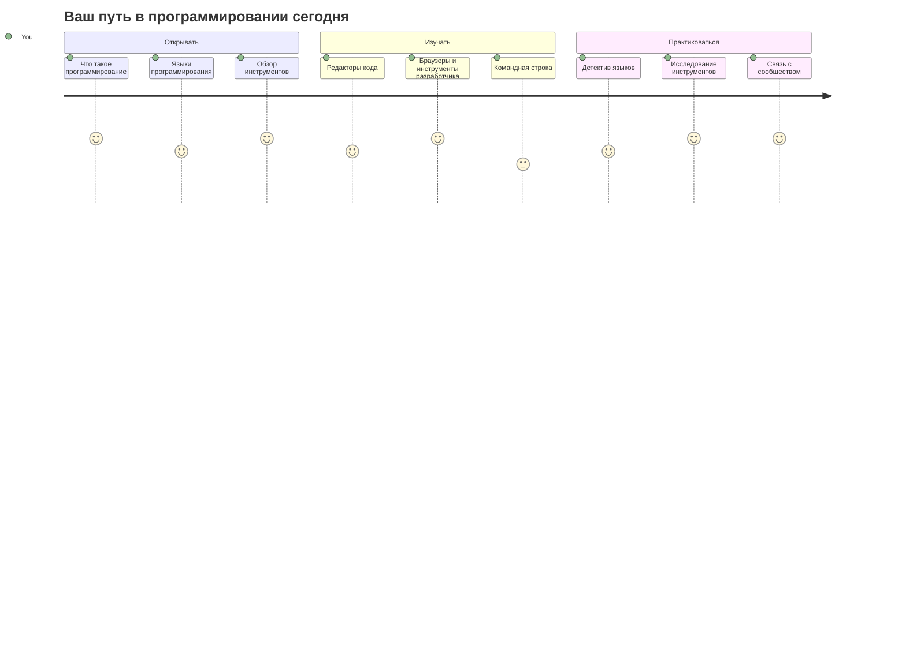
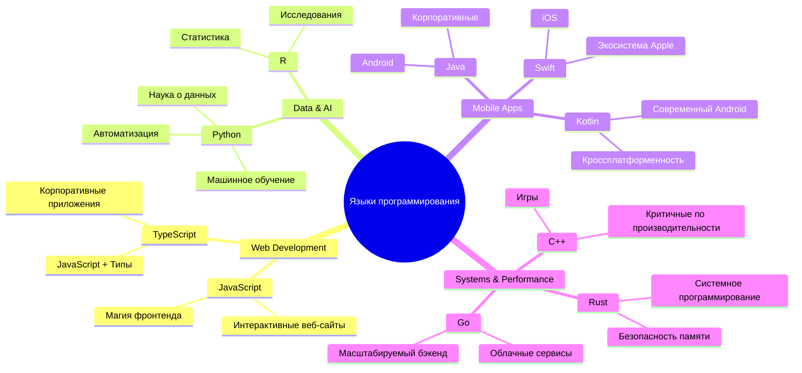
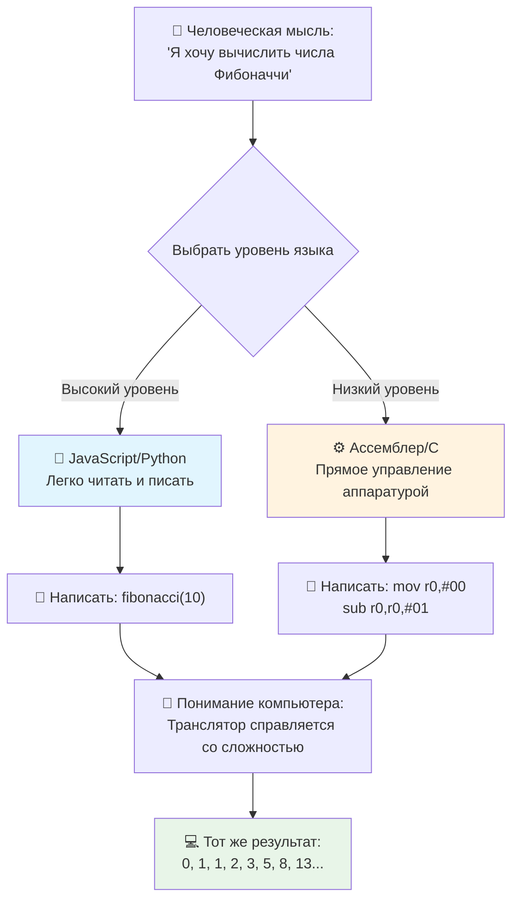
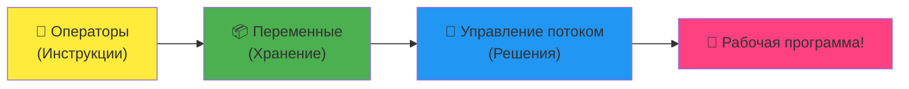
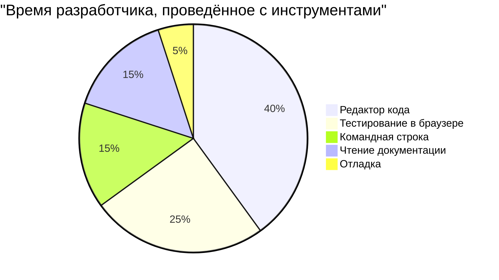
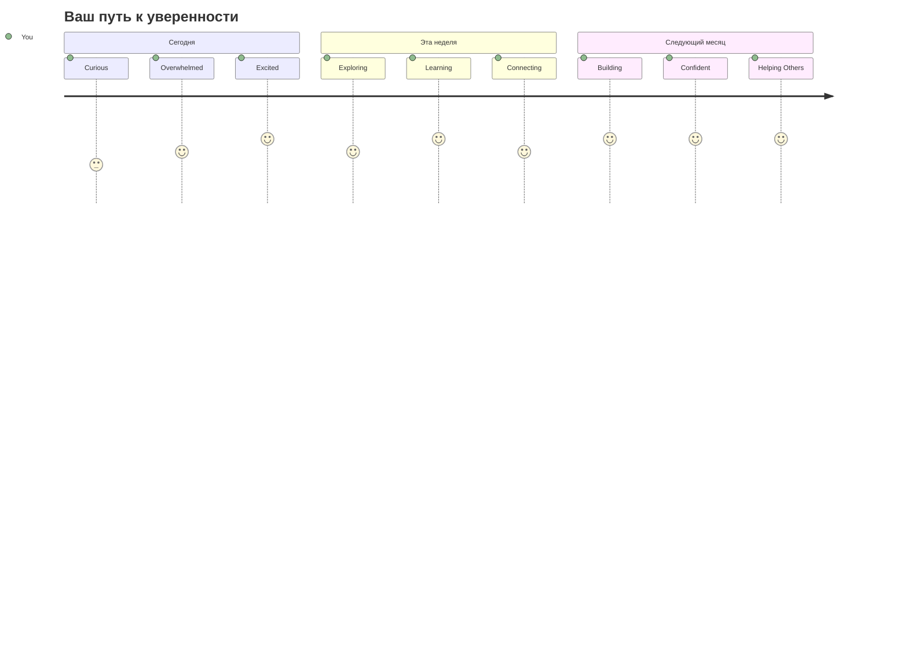

# Введение в языки программирования и современные инструменты разработчика
 
Привет, будущий разработчик! 👋 Могу я рассказать тебе кое-что, что до сих пор каждый божий день заставляет меня испытывать трепет? Ты вот-вот откроешь для себя, что программирование — это не просто про компьютеры, это про настоящие суперспособности, с помощью которых можно воплотить в жизнь самые сумасшедшие идеи!

Ты знаешь тот момент, когда пользуешься своим любимым приложением, и всё просто складывается идеально? Когда нажимаешь кнопку, и происходит нечто волшебное, из-за чего думаешь: «Вау, а как они ЭТО сделали?» Так вот, кто-то, такой же как ты — вероятно, сидящий в своём любимом кафе в 2 часа ночи с третьим эспрессо — написал код, который создаёт эту магию. И сейчас тебя поразит вот что: к концу этого урока ты не только поймёшь, как это было сделано, но ещё и зажжёшься попробовать сделать это сам!

Послушай, я отлично понимаю, если программирование сейчас кажется пугающим. Когда я начал, честно думал, что нужно быть каким-то математическим гением или кодить с пяти лет. Но вот что полностью изменило моё восприятие: программирование — это как учиться разговаривать на новом языке. Сначала «привет» и «спасибо», потом уже можешь заказать кофе, а через некоторое время ведёшь глубокие философские беседы! Только в этом случае ты разговариваешь с компьютерами, и, честно? Они самые терпеливые собеседники, которых ты когда-либо встречал — они никогда не осуждают ошибки и всегда рады попробовать снова!

Сегодня мы познакомимся с невероятными инструментами, которые делают современную веб-разработку не просто возможной, а по-настоящему увлекательной. Речь идёт именно о тех редакторах, браузерах и рабочих процессах, которыми ежедневно пользуются разработчики Netflix, Spotify и твоей любимой инди-студии. И вот что заставит тебя танцевать от счастья: большинство этих профессиональных, отраслевых инструментов совершенно бесплатны!


> Скетчноут от [Tomomi Imura](https://twitter.com/girlie_mac)


```mermaid
journey
    title Ваш путь в программировании сегодня
    section Открывать
      Что такое программирование: 5: You
      Языки программирования: 4: You
      Обзор инструментов: 5: You
    section Изучать
      Редакторы кода: 4: You
      Браузеры и инструменты разработчика: 5: You
      Командная строка: 3: You
    section Практиковаться
      Детектив языков: 4: You
      Исследование инструментов: 5: You
      Связь с сообществом: 5: You
```
## Давай узнаем, что ты уже знаешь!

Прежде чем перейти к развлечениям, мне интересно — что ты уже знаешь о мире программирования? И слушай, если при взгляде на эти вопросы ты думаешь: «У меня абсолютно ноль понятия обо всём этом», это не просто нормально, это идеально! Значит, ты в самом правильном месте. Считай этот тест как разминку перед тренировкой — просто разогреваем мозговые мышцы!

[Пройти пре-уроковый тест](https://ff-quizzes.netlify.app/web/)


## Приключение, которое мы начинаем вместе

Хорошо, я действительно радуюсь и бьюсь в дрожь от того, что мы сегодня будем изучать! Серьёзно, хотел бы я видеть твоё лицо, когда какие-то концепции прямо «щелкнут». Вот наше невероятное путешествие:

- **Что такое программирование на самом деле (и почему это самая крутая вещь!)** — мы узнаем, как код — это буквально невидимая магия, которая запускает всё вокруг, начиная от будильника, который почему-то знает, что сегодня понедельник, и заканчивая алгоритмом, который подбирает тебе идеальные рекомендации Netflix.
- **Языки программирования и их удивительные личности** — представь, что ты приходишь на вечеринку, где каждый человек обладает совершенно разными суперспособностями и способами решения проблем. Таков мир языков программирования, и тебе понравится их знакомство!
- **Основные строительные блоки, создающие цифровую магию** — подумай об этом, как об идеальном творческом наборе LEGO. Когда ты поймёшь, как эти элементы сочетаются, осознаешь, что можешь построить буквально всё, что вздумается воображению.
- **Профессиональные инструменты, которые заставят тебя почувствовать, что тебе только что вручили волшебную палочку** — я не шучу — эти инструменты действительно заставят тебя почувствовать, что у тебя суперспособности, и самое классное? Это те же самые инструменты, что используют профи!

> 💡 **Вот в чём дело**: даже не пытайся сегодня всё запомнить! Сейчас я лишь хочу, чтобы тебя вдохновило то, что возможно. Детали закрепятся сами собой, когда мы будем практиковаться вместе — именно так происходит настоящее обучение!

> Ты можешь пройти этот урок на [Microsoft Learn](https://learn.microsoft.com/en-us/learn/modules/web-development-101/introduction-programming/?WT.mc_id=academic-77807-sagibbon)!

## Итак, что же такое программирование?

Хорошо, давай решим миллионный вопрос: что же такое программирование на самом деле?

Я расскажу историю, которая полностью изменила моё восприятие. На прошлой неделе я пытался объяснить маме, как пользоваться нашим новым пультом от смарт-ТВ. Я ловил себя на фразах вроде: «Нажми красную кнопку, но не большую красную, маленькую красную слева... нет, с другой левой стороны... хорошо, теперь держи её две секунды, не одну, не три...» Звучит знакомо? 😅

Это и есть программирование! Искусство давать невероятно подробные, пошаговые инструкции для чего-то мощного, но требующего, чтобы всё было разъяснено до мелочей. Только вместо объяснений маме (которая может спросить: «какую красную кнопку?!») ты объясняешь компьютеру (который делает ровно то, что ты сказал, даже если ты имел в виду не совсем то).

Вот что ошеломило меня, когда я впервые это понял: компьютеры на самом деле довольно просты в своей основе. Они буквально понимают только две вещи — 1 и 0, что по сути значит «да» и «нет» или «вкл» и «выкл». Вот и всё! Но вот где начинается магия — нам не нужно говорить на 1 и 0, как в Матрице. Здесь на помощь приходят **языки программирования**. Это словно лучший переводчик в мире, который берёт твои вполне обычные человеческие мысли и переводит их на язык компьютера.

И вот что до сих пор будоражит меня каждое утро: буквально *всё* цифровое в твоей жизни началось с кого-то такого же, как ты, наверное, сидящего в пижаме с чашкой кофе и печатающего код на ноутбуке. Тот фильтр в Instagram, который делает тебя безупречным? Кто-то написал этот код. Рекомендация, которая привела тебя к новой любимой песне? Разработчик создал этот алгоритм. Приложение, которое помогает делить счёт в ресторане с друзьями? Да, кто-то подумал: «Это неудобно, я могу это исправить» — и сделал это!

Когда ты учишься программировать, ты не просто осваиваешь новый навык — ты становишься частью потрясающего сообщества решателей задач, которые тратят свои дни на размышления: «А что, если я создам что-то, что сделает чей-то день чуточку лучше?» Честно, разве может быть что-то круче?

✅ **Задачка для ума**: Вот что здорово поискать, когда будет свободная минутка — кто, по твоему мнению, был первым программистом в мире? Дам подсказку: это может быть не тот человек, кого ты ожидаешь! История этого человека совершенно потрясающая и показывает, что программирование всегда было про творческое решение задач и нестандартное мышление.

### 🧠 **Проверочные вопросы: Как ты себя чувствуешь?**

**Подумай на минутку:**
- Понятна ли тебе теперь идея «давать инструкции компьютерам»?
- Можешь ли ты представить какую-нибудь повседневную задачу, которую хотел бы автоматизировать с помощью программирования?
- Какие вопросы пока вертятся у тебя в голове про этот мир программирования?

> **Помни**: это абсолютно нормально, если некоторые понятия кажутся размытыми сейчас. Учиться программировать — это как учить новый язык — мозгу нужно время, чтобы построить новые нейронные связи. Ты делаешь отлично!

## Языки программирования похожи на разные вкусы магии

Ладно, это прозвучит странно, но держись — языки программирования очень похожи на разные типы музыки. Представь: у тебя есть джаз — гладкий и импровизационный, рок — мощный и прямолинейный, классика — элегантная и структурированная, и хип-хоп — креативный и выразительный. Каждый стиль имеет свой вайб, своё сообщество страстных поклонников, и каждый идеально подходит под разное настроение и случаи.

Языки программирования работают точно так же! Ты бы не стал использовать тот же язык для создания забавной мобильной игры и для обработки громадного массива климатических данных, так же как ты бы не стал играть дэт-метал на занятиях йогой (ну, по крайней мере на большинстве из них! 😄).

А вот что меня каждый раз поражает до глубины души: эти языки — это как самый терпеливый и блестящий переводчик в мире, который сидит рядом с тобой. Ты можешь выражать свои идеи так, как удобно твоему человеческому мозгу, а он берёт на себя всю невероятно сложную работу по переводу на 1 и 0, на которых на самом деле говорит компьютер. Это как иметь друга, который идеально владеет и «человеческим творчеством», и «компьютерной логикой» — и он никогда не устает, не берёт перерыв на кофе и не осуждает тебя за повторные вопросы!

### Популярные языки программирования и их применения


```mermaid
mindmap
  root((Языки программирования))
    Web Development
      JavaScript
        Магия фронтенда
        Интерактивные веб-сайты
      TypeScript
        JavaScript + Типы
        Корпоративные приложения
    Data & AI
      Python
        Наука о данных
        Машинное обучение
        Автоматизация
      R
        Статистика
        Исследования
    Mobile Apps
      Java
        Android
        Корпоративные
      Swift
        iOS
        Экосистема Apple
      Kotlin
        Современный Android
        Кроссплатформенность
    Systems & Performance
      C++
        Игры
        Критичные по производительности
      Rust
        Безопасность памяти
        Системное программирование
      Go
        Облачные сервисы
        Масштабируемый бэкенд
```
| Язык | Лучшее применение | Почему популярен |
|----------|----------|------------------|
| **JavaScript** | Веб-разработка, пользовательские интерфейсы | Работает в браузерах и поддерживает интерактивные сайты |
| **Python** | Наука о данных, автоматизация, ИИ | Легко читать и учить, мощные библиотеки |
| **Java** | Корпоративные приложения, Android-приложения | Независим от платформы, надёжен для крупных систем |
| **C#** | Windows-приложения, разработка игр | Сильная поддержка экосистемы Microsoft |
| **Go** | Облачные сервисы, серверная часть | Быстрый, простой, создан для современной вычислительной техники |

### Языки высокого и низкого уровня

Честно, именно эта концепция взорвала мне мозг при первом знакомстве с программированием, так что расскажу аналогию, которая помогла мне её понять — надеюсь, она поможет и тебе!

Представь, что ты приехал в страну, где не говоришь на языке, и отчаянно пытаешься найти туалет (мы туда все попадали, правда? 😅):

- **Языки низкого уровня** — это как если бы ты так хорошо изучил местный диалект, что можешь общаться с бабушкой, что торгует фруктами на углу, используя культурные отсылки, местный сленг и внутренние шутки, понятные только местным. Супер впечатляет и очень эффективно… если ты действительно свободно говоришь! Но довольно сложно, когда ты просто пытаешься найти туалет.

- **Языки высокого уровня** — это как если бы рядом был замечательный местный друг, который просто понимает тебя. Ты можешь сказать «Мне очень нужен туалет» на обычном английском, а он позаботится о культурном переводе и даст тебе понятные указания, подходящие для твоего неродного ума.

На языке программирования:
- **Языки низкого уровня** (например, Assembly или C) позволяют говорить с самим оборудованием компьютера невероятно подробно, но для этого нужно мыслить как машина, что... скажем так, довольно сильный сдвиг в мышлении!
- **Языки высокого уровня** (такие как JavaScript, Python или C#) позволяют думать как человек, в то время как они решают всю «машинную речь» за кулисами. Плюс у них есть невероятно дружелюбные сообщества, где много людей, которые помнят, каким страшным было быть новеньким, и искренне хотят помочь!

Угадай, с чего я советую тебе начинать? 😉 Языки высокого уровня — как тренировочные колёса, которые ты на самом деле никогда не захочешь снимать, потому что они делают весь опыт намного приятнее!


```mermaid
flowchart TB
    A["👤 Человеческая мысль:<br/>'Я хочу вычислить числа Фибоначчи'"] --> B{Выбрать уровень языка}
    
    B -->|Высокий уровень| C["🌟 JavaScript/Python<br/>Легко читать и писать"]
    B -->|Низкий уровень| D["⚙️ Ассемблер/C<br/>Прямое управление аппаратурой"]
    
    C --> E["📝 Написать: fibonacci(10)"]
    D --> F["📝 Написать: mov r0,#00<br/>sub r0,r0,#01"]
    
    E --> G["🤖 Понимание компьютера:<br/>Транслятор справляется со сложностью"]
    F --> G
    
    G --> H["💻 Тот же результат:<br/>0, 1, 1, 2, 3, 5, 8, 13..."]
    
    style C fill:#e1f5fe
    style D fill:#fff3e0
    style H fill:#e8f5e8
```
### Позволь показать, почему языки высокого уровня намного дружелюбнее

Ладно, сейчас я покажу тебе пример, который идеально иллюстрирует, почему я влюбился в языки высокого уровня, но сначала — обещай мне кое-что. Когда увидишь первый пример кода, не паникуй! Он должен казаться пугающим. Это именно та точка, которую я хочу сделать!

Мы посмотрим на одну и ту же задачу, написанную в двух совершенно разных стилях. Обе создают так называемую последовательность Фибоначчи — это прекрасный математический паттерн, где каждое число равно сумме двух предыдущих: 0, 1, 1, 2, 3, 5, 8, 13... (Маленькая радость: эту последовательность можно найти буквально везде в природе — спирали подсолнуха, узоры на шишках, даже формирование галактик!)

Готов увидеть разницу? Поехали!

**Язык высокого уровня (JavaScript) — человеко-дружелюбный:**

```javascript
// Шаг 1: Основная настройка Фибоначчи
const fibonacciCount = 10;
let current = 0;
let next = 1;

console.log('Fibonacci sequence:');
```

**Вот что делает этот код:**
- **Объявляет** константу, чтобы указать, сколько чисел Фибоначчи мы хотим сгенерировать
- **Инициализирует** две переменные для отслеживания текущего и следующего чисел в последовательности
- **Устанавливает** стартовые значения (0 и 1), которые задают паттерн Фибоначчи
- **Выводит** заголовок для идентификации нашего результата

```javascript
// Шаг 2: Сгенерировать последовательность с помощью цикла
for (let i = 0; i < fibonacciCount; i++) {
  console.log(`Position ${i + 1}: ${current}`);
  
  // Вычислить следующее число в последовательности
  const sum = current + next;
  current = next;
  next = sum;
}
```

**Разбор того, что происходит далее:**
- **Перебирает** каждую позицию в последовательности с помощью цикла `for`
- **Выводит** каждое число с его позицией с использованием шаблонной строки
- **Вычисляет** следующее число Фибоначчи как сумму текущего и следующего
- **Обновляет** переменные для перехода к следующей итерации

```javascript
// Шаг 3: Современный функциональный подход
const generateFibonacci = (count) => {
  const sequence = [0, 1];
  
  for (let i = 2; i < count; i++) {
    sequence[i] = sequence[i - 1] + sequence[i - 2];
  }
  
  return sequence;
};

// Пример использования
const fibSequence = generateFibonacci(10);
console.log(fibSequence);
```

**В приведённом выше коде мы:**
- **Создали** переиспользуемую функцию, используя современный синтаксис стрелочных функций
- **Построили** массив для хранения всей последовательности вместо показа по одному числу
- **Использовали** индексацию массива, чтобы вычислять новое число на основе предыдущих
- **Вернули** полную последовательность для гибкого использования в других частях программы

**Язык низкого уровня (ARM Assembly) — компьютеро-дружелюбный:**

```assembly
 area ascen,code,readonly
 entry
 code32
 adr r0,thumb+1
 bx r0
 code16
thumb
 mov r0,#00
 sub r0,r0,#01
 mov r1,#01
 mov r4,#10
 ldr r2,=0x40000000
back add r0,r1
 str r0,[r2]
 add r2,#04
 mov r3,r0
 mov r0,r1
 mov r1,r3
 sub r4,#01
 cmp r4,#00
 bne back
 end
```

Обрати внимание, как версия на JavaScript читается почти как инструкция на английском, а версия на Assembly использует загадочные команды, которые управляют процессором напрямую. Оба решают одну и ту же задачу, но язык высокого уровня намного удобнее для понимания, написания и поддержки человеком.

**Ключевые различия, которые ты заметишь:**
- **Читаемость**: JavaScript использует описательные имена, такие как `fibonacciCount`, в то время как Assembly использует загадочные метки, такие как `r0`, `r1`
- **Комментарии**: Языки высокого уровня поощряют объяснительные комментарии, которые делают код самодокументируемым
- **Структура**: Логический поток JavaScript совпадает с тем, как люди думают о проблемах шаг за шагом
- **Поддержка**: Обновление версии на JavaScript для разных требований простое и понятное

✅ **О последовательности Фибоначчи**: Эта абсолютно красивая числовая последовательность (где каждое число равно сумме двух предыдущих: 0, 1, 1, 2, 3, 5, 8...) встречается буквально *везде* в природе! Вы найдете её в спиралях подсолнуха, узорах шишек, изгибах раковины наутилуса и даже в том, как растут ветви деревьев. Впечатляет, как математика и код могут помочь нам понять и воссоздать узоры, которые природа использует для создания красоты!


## Строительные блоки, которые создают магию

Итак, теперь, когда вы увидели, как выглядят языки программирования на практике, давайте разберём основные элементы, которые составляют буквально каждую написанную программу. Представьте их как базовые ингредиенты вашего любимого рецепта – как только вы поймёте, что делает каждый из них, вы сможете читать и писать код практически на любом языке!

Это похоже на изучение грамматики программирования. Помните, как в школе учили существительные, глаголы и как строить предложения? Программирование имеет свою грамматику, и честно говоря, она намного логичнее и снисходительнее, чем английская! 😄

### Инструкции: пошаговые команды

Начнём с **инструкций** — это как отдельные предложения в разговоре с вашим компьютером. Каждая инструкция говорит компьютеру сделать одну конкретную вещь, почти как указания: «Поверни налево здесь», «Стой на красный свет», «Запаркуйся там».

Мне нравится, как обычно читается код с инструкциями. Посмотрите:

```javascript
// Основные операторы, выполняющие отдельные действия
const userName = "Alex";                    
console.log("Hello, world!");              
const sum = 5 + 3;                         
```

**Вот что делает этот код:**
- **Объявляет** константную переменную для хранения имени пользователя
- **Отображает** приветственное сообщение в консоли
- **Вычисляет** и сохраняет результат математической операции

```javascript
// Операторы, взаимодействующие с веб-страницами
document.title = "My Awesome Website";      
document.body.style.backgroundColor = "lightblue";
```

**Шаг за шагом, вот что происходит:**
- **Изменяет** заголовок страницы, который отображается во вкладке браузера
- **Меняет** цвет фона всего тела страницы

### Переменные: память вашей программы

Хорошо, **переменные** — честно, одна из моих абсолютных любимых концепций для обучения, потому что они очень похожи на вещи, которые вы уже используете каждый день!

Подумайте о списке контактов на вашем телефоне. Вы не запоминаете номера всех — вместо этого сохраняете «Мама», «Лучший друг» или «Пиццерия, которая доставляет до 2 ночи», а телефон запоминает номера. Переменные работают точно так же! Они – как подписанные контейнеры, где ваша программа может хранить информацию и потом получать к ней доступ по понятному имени.

Вот что действительно круто: переменные могут изменяться во время выполнения программы (отсюда и название «переменная» – видите, что сделали?). Так же, как вы можете обновить контакт пиццерии, когда находите место получше, переменные могут обновляться, когда программа узнаёт новую информацию или ситуация меняется!

Позвольте показать, насколько это просто:

```javascript
// Шаг 1: Создание основных переменных
const siteName = "Weather Dashboard";        
let currentWeather = "sunny";               
let temperature = 75;                       
let isRaining = false;                      
```

**Понимание этих концепций:**
- **Храните** неизменяемые значения в `const` переменных (например, название сайта)
- **Используйте** `let` для значений, которые могут меняться в процессе работы программы
- **Присваивайте** разные типы данных: строки (текст), числа и булевы значения (true/false)
- **Выбирайте** описательные имена, которые объясняют, что хранит каждая переменная

```javascript
// Шаг 2: Работа с объектами для группировки связанных данных
const weatherData = {                       
  location: "San Francisco",
  humidity: 65,
  windSpeed: 12
};
```

**В приведённом выше примере мы:**
- **Создали** объект для группировки связанных данных о погоде
- **Организовали** несколько кусков данных под одним именем переменной
- **Использовали** пары ключ-значение для чёткого обозначения каждой информации

```javascript
// Шаг 3: Использование и обновление переменных
console.log(`${siteName}: Today is ${currentWeather} and ${temperature}°F`);
console.log(`Wind speed: ${weatherData.windSpeed} mph`);

// Обновление изменяемых переменных
currentWeather = "cloudy";                  
temperature = 68;                          
```

**Давайте разберём каждую часть:**
- **Отображаем** информацию с помощью шаблонных строк и синтаксиса `${}`
- **Получаем доступ** к свойствам объекта через точечную нотацию (`weatherData.windSpeed`)
- **Обновляем** переменные, объявленные с помощью `let`, чтобы отражать меняющиеся условия
- **Объединяем** несколько переменных для создания осмысленных сообщений

```javascript
// Шаг 4: Современное деструктурирование для более чистого кода
const { location, humidity } = weatherData; 
console.log(`${location} humidity: ${humidity}%`);
```

**Что нужно знать:**
- **Извлекайтe** конкретные свойства из объектов с помощью деструктуризации
- **Создавайте** новые переменные автоматически с теми же именами, что и ключи объекта
- **Упрощайте** код, избегая повторяющейся точечной нотации

### Управление потоком: учим программу думать

Хорошо, здесь программирование становится по-настоящему удивительным! **Управление потоком** — это, по сути, обучение вашей программы принимать умные решения, именно так, как вы делаете это каждый день, не задумываясь.

Представьте, что сегодня утром вы скорее всего подумали: «Если идёт дождь, возьму зонт. Если холодно — надену куртку. Если опаздываю — пропущу завтрак и возьму кофе по пути». Ваш мозг естественным образом следует этой логике «если-то» десятки раз в день!

Вот что делает программы умными и живыми, а не просто скучным исполнением предсказуемого сценария. Они могут реально смотреть на ситуацию, оценивать происходящее и отвечать соответственно. Это как дать программе мозг, который может адаптироваться и принимать решения!

Хотите увидеть, как это здорово работает? Позвольте показать:

```javascript
// Шаг 1: Основная условная логика
const userAge = 17;

if (userAge >= 18) {
  console.log("You can vote!");
} else {
  const yearsToWait = 18 - userAge;
  console.log(`You'll be able to vote in ${yearsToWait} year(s).`);
}
```

**Этот код делает следующее:**
- **Проверяет**, соответствует ли возраст пользователя требованиям для голосования
- **Выполняет** разные блоки кода в зависимости от результата условия
- **Рассчитывает** и показывает, сколько осталось до возможности голосовать, если пользователь младше 18
- **Предоставляет** конкретную, полезную обратную связь для каждой ситуации

```javascript
// Шаг 2: Несколько условий с логическими операторами
const userAge = 17;
const hasPermission = true;

if (userAge >= 18 && hasPermission) {
  console.log("Access granted: You can enter the venue.");
} else if (userAge >= 16) {
  console.log("You need parent permission to enter.");
} else {
  console.log("Sorry, you must be at least 16 years old.");
}
```

**Разберём, что происходит здесь:**
- **Комбинирует** несколько условий с помощью оператора `&&` (и)
- **Создаёт** иерархию условий с использованием `else if` для нескольких сценариев
- **Обрабатывает** все возможные случаи с помощью финального `else`
- **Предоставляет** ясную и полезную обратную связь для каждой ситуации

```javascript
// Шаг 3: Краткое условие с тернарным оператором
const votingStatus = userAge >= 18 ? "Can vote" : "Cannot vote yet";
console.log(`Status: ${votingStatus}`);
```

**Что надо запомнить:**
- **Используйте** тернарный оператор (`? :`) для простых условий с двумя вариантами
- **Пишите** условие сначала, затем `?`, потом результат для true, потом `:`, затем результат для false
- **Применяйте** этот шаблон для присвоения значений на основе условий

```javascript
// Шаг 4: Обработка нескольких конкретных случаев
const dayOfWeek = "Tuesday";

switch (dayOfWeek) {
  case "Monday":
  case "Tuesday":
  case "Wednesday":
  case "Thursday":
  case "Friday":
    console.log("It's a weekday - time to work!");
    break;
  case "Saturday":
  case "Sunday":
    console.log("It's the weekend - time to relax!");
    break;
  default:
    console.log("Invalid day of the week");
}
```

**Этот код выполняет следующее:**
- **Сравнивает** значение переменной с несколькими конкретными случаями
- **Группирует** похожие случаи вместе (будние дни против выходных)
- **Выполняет** соответствующий блок кода при совпадении
- **Включает** `default` для обработки неожиданных значений
- **Использует** `break` для предотвращения продолжения к следующему случаю

> 💡 **Реальный пример**: Представьте, что управление потоком — это как самый терпеливый GPS в мире, который даёт вам указания. Он может сказать: «Если на Главной улице пробка, езжайте по шоссе. Если шоссе перекрыто строительством, выберите живописный маршрут». Программы используют тот же тип условной логики, чтобы умно реагировать на разные ситуации и всегда обеспечивать лучший пользовательский опыт.

### 🎯 **Проверка знаний: Мастерство строительных блоков**

**Давайте проверим, как вы усвоили основы:**
- Можете ли вы своими словами объяснить разницу между переменной и инструкцией?
- Придумайте реальный пример, где бы вы использовали условие if-then (как в нашем примере с голосованием)
- Что из логики программирования вас удивило больше всего?

**Быстрый заряд уверенности:**

```mermaid
flowchart LR
    A["📝 Операторы<br/>(Инструкции)"] --> B["📦 Переменные<br/>(Хранение)"] --> C["🔀 Управление потоком<br/>(Решения)"] --> D["🎉 Рабочая программа!"]
    
    style A fill:#ffeb3b
    style B fill:#4caf50
    style C fill:#2196f3
    style D fill:#ff4081
```
✅ **Что будет дальше**: Мы с огромным удовольствием погрузимся глубже в эти концепции, продолжая это невероятное путешествие вместе! А пока просто сосредоточьтесь на том волнении от всех удивительных возможностей впереди. Специфические навыки и техники придут естественно по мере практики — обещаю, это будет гораздо веселее, чем вы ожидаете!

## Инструменты профессии

Итак, честно говоря, сейчас я так взволнован, что еле сдерживаюсь! 🚀 Сейчас мы поговорим о невероятных инструментах, которые заставят вас почувствовать, будто вам только что вручили ключи от цифрового космического корабля.

Вы знаете, как у шеф-повара есть идеально сбалансированные ножи, которые кажутся продолжением его рук? Или как у музыканта есть гитара, которая начинает петь, как только он к ней прикасается? У разработчиков тоже есть свои волшебные инструменты, и вот что вас по-настоящему ошеломит — большая часть из них абсолютно бесплатна!

Я буквально подпрыгиваю от нетерпения поделиться ими с вами, потому что эти инструменты полностью изменили то, как мы создаём софт. Речь идёт об помощниках на основе ИИ, которые помогают писать код (и это не шутка!), облачных средах, где можно создавать целые приложения буквально из любой точки с Wi-Fi, и инструментах отладки настолько продвинутых, что это как иметь рентгеновское зрение для ваших программ.

И вот что до сих пор приводит меня в восторг: это не просто «начинающие» инструменты, которые вы перерастёте. Это те же профессиональные средства, что используют разработчики из Google, Netflix и той независимой студии, что вам нравится, здесь и сейчас. Вы почувствуете себя настоящим профи, используя их!


```mermaid
graph TD
    A["💡 Ваша Идея"] --> B["⌨️ Редактор Кода<br/>(VS Code)"] 
    B --> C["🌐 Инструменты Браузера<br/>(Тестирование и Отладка)"]
    C --> D["⚡ Командная Строка<br/>(Автоматизация и Инструменты)"]
    D --> E["📚 Документация<br/>(Обучение и Справка)"]
    E --> F["🚀 Потрясающее Веб-приложение!"]
    
    B -.-> G["🤖 AI Ассистент<br/>(GitHub Copilot)"]
    C -.-> H["📱 Тестирование Устройств<br/>(Адаптивный Дизайн)"]
    D -.-> I["📦 Менеджеры Пакетов<br/>(npm, yarn)"]
    E -.-> J["👥 Сообщество<br/>(Stack Overflow)"]
    
    style A fill:#fff59d
    style F fill:#c8e6c9
    style G fill:#e1f5fe
    style H fill:#f3e5f5
    style I fill:#ffccbc
    style J fill:#e8eaf6
```
### Редакторы кода и IDE: ваши новые цифровые лучшие друзья

Поговорим о редакторах кода — они буквально станут вашим новым любимым местом! Представьте их как личное святилище программирования, где вы будете проводить большую часть времени, создавая и совершенствуя свои цифровые творения.

Но вот что по-настоящему волшебно в современных редакторах: это не просто красивые текстовые редакторы. Это как самый блестящий и поддерживающий наставник по программированию, сидящий рядом с вами круглосуточно. Они ловят опечатки ещё до того, как вы их заметите, предлагают улучшения, которые заставят вас выглядеть гением, помогают понять, что делает каждая строчка кода, а некоторые даже предугадывают, что вы собираетесь написать, и предлагают дополнить ваши мысли!

Я помню, как впервые открыл для себя автодополнение — я буквально почувствовал, что живу в будущем. Начинаешь печатать, и редактор такой: «Эй, ты, наверное, хотел использовать эту функцию, которая делает как раз то, что нужно?» Это как иметь друга, который читает мысли во время кодинга!

**Что делает эти редакторы такими невероятными?**

Современные редакторы предлагают впечатляющий набор функций, направленных на повышение вашей продуктивности:

| Функция | Что делает | Зачем нужна |
|---------|------------|-------------|
| **Подсветка синтаксиса** | Красит разные части кода | Делает код проще для чтения и поиска ошибок |
| **Автодополнение** | Предлагает код по мере набора | Ускоряет программирование и снижает количество опечаток |
| **Инструменты отладки** | Помогают находить и исправлять ошибки | Экономит часы на поиске проблем |
| **Расширения** | Добавляют специализированные функции | Настраивают редактор под любую технологию |
| **Ассистенты на базе ИИ** | Предлагают код и объяснения | Ускоряют обучение и повышают эффективность |

> 🎥 **Видео ресурс**: Хотите увидеть эти инструменты в действии? Посмотрите [видео “Tools of the Trade”](https://youtube.com/watch?v=69WJeXGBdxg) для полного обзора.

#### Рекомендуемые редакторы для веб-разработки

**[Visual Studio Code](https://code.visualstudio.com/?WT.mc_id=academic-77807-sagibbon)** (бесплатно)
- Самый популярный у веб-разработчиков
- Отличная экосистема расширений
- Встроенный терминал и интеграция с Git
- **Обязательные расширения**:
  - [GitHub Copilot](https://marketplace.visualstudio.com/items?itemName=GitHub.copilot) — предложения кода на базе ИИ
  - [Live Share](https://marketplace.visualstudio.com/items?itemName=MS-vsliveshare.vsliveshare) — совместная работа в реальном времени
  - [Prettier](https://marketplace.visualstudio.com/items?itemName=esbenp.prettier-vscode) — автоформатирование кода
  - [Code Spell Checker](https://marketplace.visualstudio.com/items?itemName=streetsidesoftware.code-spell-checker) — проверка орфографии в коде

**[JetBrains WebStorm](https://www.jetbrains.com/webstorm/)** (платно, бесплатно для студентов)
- Продвинутые инструменты отладки и тестирования
- Интеллектуальное автодополнение кода
- Встроенная система контроля версий

**Облачные IDE** (разные цены)
- [GitHub Codespaces](https://github.com/features/codespaces) — полноценный VS Code в браузере
- [Replit](https://replit.com/) — отлично подходит для обучения и обмена кодом
- [StackBlitz](https://stackblitz.com/) — мгновенная разработка веб-приложений full-stack

> 💡 **Совет для начала**: Начинайте с Visual Studio Code — это бесплатно, широко используется в индустрии и имеет огромную сообщество с полезными туториалами и расширениями.


### Веб-браузеры: ваша секретная лаборатория разработки

Хорошо, приготовьтесь к тому, что ваш мозг будет взорван! Вы знаете, что вы используете браузеры, чтобы листать соцсети и смотреть видео? Оказывается, они всё это время прятали невероятную секретную лабораторию разработчика, которая просто ждала, чтобы вы её обнаружили!

Каждый раз, когда вы кликаете правой кнопкой мыши на веб-странице и выбираете «Просмотр кода» или «Инспектировать элемент», вы открываете скрытый мир инструментов разработчика, которые честно говоря мощнее, чем некоторые дорогие программы, за которые я раньше платил сотни долларов. Это как понять, что ваша обычная кухня на самом деле скрывает лабораторию профессионального шефа за тайной дверью!
Впервые, когда кто-то показал мне DevTools в браузере, я потратил около трёх часов просто кликая и восклицая: «ПОДОЖДИ, ОН ЕЩЁ И ЭТО МОЖЕТ?!» Ты буквально можешь редактировать любой сайт в реальном времени, видеть, как быстро всё загружается, тестировать, как твой сайт выглядит на разных устройствах, и даже отлаживать JavaScript, как настоящий профи. Это просто потрясающе!

**Вот почему браузеры — ваше секретное оружие:**

Когда вы создаёте сайт или веб-приложение, вам нужно видеть, как оно выглядит и ведёт себя в реальной среде. Браузеры не только отображают вашу работу, но и предоставляют подробную обратную связь о производительности, доступности и возможных проблемах.

#### Инструменты разработчика браузера (DevTools)

Современные браузеры включают комплексные наборы инструментов:

| Категория инструмента | Что делает | Пример использования |
|-----------------------|------------|---------------------|
| **Инспектор элементов** | Просмотр и редактирование HTML/CSS в реальном времени | Настройка стиля с мгновенным результатом |
| **Консоль** | Просмотр сообщений об ошибках и тестирование JavaScript | Отладка проблем и эксперименты с кодом |
| **Монитор сети** | Отслеживание загрузки ресурсов | Оптимизация производительности и времени загрузки |
| **Проверка доступности** | Тестирование инклюзивного дизайна | Гарантия работы сайта для всех пользователей |
| **Симулятор устройств** | Просмотр на разных размерах экранов | Тестирование отзывчивого дизайна без нескольких устройств |

#### Рекомендуемые браузеры для разработки

- **[Chrome](https://developers.google.com/web/tools/chrome-devtools/)** — отраслевой стандарт DevTools с обширной документацией
- **[Firefox](https://developer.mozilla.org/docs/Tools)** — отличные инструменты для CSS Grid и доступности
- **[Edge](https://docs.microsoft.com/microsoft-edge/devtools-guide-chromium/?WT.mc_id=academic-77807-sagibbon)** — построен на Chromium с ресурсами для разработчиков от Microsoft

> ⚠️ **Важный совет по тестированию**: всегда проверяйте свои сайты в нескольких браузерах! То, что идеально работает в Chrome, может выглядеть иначе в Safari или Firefox. Профессиональные разработчики тестируют во всех основных браузерах, чтобы обеспечить одинаковый пользовательский опыт.


### Командная строка: ваш путь к суперспособностям разработчика

Хорошо, давайте честно поговорим о командной строке, потому что я хочу, чтобы вы услышали это от человека, который действительно это понимает. Когда я впервые увидел её — этот страшный чёрный экран с мигающим текстом — я буквально подумал: «Нет, ни в коем случае! Выглядит как что-то из хакерского фильма 80-х, и я определённо не настолько умный для этого!» 😅

Но вот что я хотел бы, чтобы мне сказали тогда, и что говорю вам сейчас: командная строка не страшна — это как прямой разговор с вашим компьютером. Представьте, что это разница между заказом еды через крутое приложение с картинками и меню (что удобно и просто) и походом в ваш любимый местный ресторан, где шеф знает точно, что вы любите, и может приготовить что-то идеальное, просто сказав «удиви меня чем-то потрясающим».

Командная строка — это место, куда разработчики приходят, чтобы почувствовать себя настоящими волшебниками. Вы вводите несколько, казалось бы, волшебных слов (ну, это просто команды, но они кажутся волшебными!), нажимаете Enter, и БА-БАХ — вы создали целые структуры проектов, установили мощные инструменты со всего мира или развернули своё приложение в интернете для миллионов людей. Как только попробуете эту мощь, она становится по-настоящему затягивающей!

**Почему командная строка станет вашим любимым инструментом:**

Хотя графические интерфейсы хороши для многих задач, командная строка превосходна в автоматизации, точности и скорости. Многие инструменты разработки работают именно через командную строку, и изучение эффективного использования значительно повысит вашу продуктивность.

```bash
# Шаг 1: Создайте и перейдите в каталог проекта
mkdir my-awesome-website
cd my-awesome-website
```

**Что делает этот код:**
- **Создаёт** новую папку с именем "my-awesome-website" для вашего проекта
- **Переходит** в только что созданную папку для начала работы

```bash
# Шаг 2: Инициализируйте проект с package.json
npm init -y

# Установите современные инструменты разработки
npm install --save-dev vite prettier eslint
npm install --save-dev @eslint/js
```

**Пошагово, что происходит:**
- **Инициализирует** новый проект Node.js с настройками по умолчанию через `npm init -y`
- **Устанавливает** Vite как современный инструмент сборки для быстрой разработки и продакшн-сборок
- **Добавляет** Prettier для автоматического форматирования кода и ESLint для проверки качества кода
- **Использует** флаг `--save-dev` для обозначения зависимостей только для разработки

```bash
# Шаг 3: Создать структуру проекта и файлы
mkdir src assets
echo '<!DOCTYPE html><html><head><title>My Site</title></head><body><h1>Hello World</h1></body></html>' > index.html

# Запустить сервер разработки
npx vite
```

**В итоге мы:**
- **Организовали** проект, создав отдельные папки для исходного кода и ресурсов
- **Сгенерировали** базовый HTML-файл с правильной структурой документа
- **Запустили** сервер разработки Vite для живой перезагрузки и горячей замены модулей

#### Необходимые инструменты командной строки для веб-разработки

| Инструмент | Назначение | Зачем нужен |
|------------|------------|-------------|
| **[Git](https://git-scm.com/)** | Контроль версий | Отслеживание изменений, совместная работа, резервное копирование |
| **[Node.js & npm](https://nodejs.org/)** | Среда выполнения JavaScript и менеджер пакетов | Запуск JavaScript вне браузера, установка современных инструментов разработки |
| **[Vite](https://vitejs.dev/)** | Инструмент сборки и dev-сервер | Молниеносная разработка с горячей заменой модулей |
| **[ESLint](https://eslint.org/)** | Качество кода | Автоматический поиск и исправление проблем в JavaScript |
| **[Prettier](https://prettier.io/)** | Форматирование кода | Поддержание единого и читаемого стиля кода |

#### Особенности платформ

**Windows:**
- **[Windows Terminal](https://docs.microsoft.com/windows/terminal/?WT.mc_id=academic-77807-sagibbon)** — современный и функциональный терминал
- **[PowerShell](https://docs.microsoft.com/powershell/?WT.mc_id=academic-77807-sagibbon)** 💻 — мощная среда для скриптов
- **[Командная строка](https://docs.microsoft.com/windows-server/administration/windows-commands/?WT.mc_id=academic-77807-sagibbon)** 💻 — традиционная командная строка Windows

**macOS:**
- **[Terminal](https://support.apple.com/guide/terminal/)** 💻 — встроенное терминальное приложение
- **[iTerm2](https://iterm2.com/)** — расширенный терминал с дополнительными функциями

**Linux:**
- **[Bash](https://www.gnu.org/software/bash/)** 💻 — стандартная оболочка Linux
- **[KDE Konsole](https://docs.kde.org/trunk5/en/konsole/konsole/index.html)** — продвинутый эмулятор терминала

> 💻 = предустановлено в операционной системе

> 🎯 **Путь обучения**: начните с базовых команд, таких как `cd` (смена каталога), `ls` или `dir` (список файлов) и `mkdir` (создание папки). Практикуйтесь с современными командами рабочего процесса, такими как `npm install`, `git status` и `code .` (открыть текущую папку в VS Code). По мере уверенного освоения вы естественно освоите более продвинутые команды и методы автоматизации.


### Документация: ваш всегда доступный наставник по обучению

Хорошо, расскажу маленький секрет, который поможет вам не переживать из-за того, что вы новичок: даже самые опытные разработчики тратят огромное количество времени на чтение документации. И это не потому, что они не знают, что делают — это признак мудрости!

Думайте о документации как о доступе к самым терпеливым, знающим учителям в мире, которые всегда на связи. Застряли над проблемой в 2 часа ночи? Документация там, чтобы обнять виртуальным теплом и дать именно тот ответ, который вам нужен. Хотите узнать про какую-то новую крутецкую функцию, о которой все говорят? Документация поддержит вас пошаговыми примерами. Пытаетесь понять, почему что-то работает именно так? Вы угадали — документация объяснит это так, что наконец-то всё станет ясно!

Вот что кардинально изменило мой взгляд: мир веб-разработки развивается бешеными темпами, и никто (никто!) не держит всё в памяти. Я видел, как старшие разработчики с опытом 15+ лет ищут базовый синтаксис, и знаете что? Это не стыдно — это умно! Дело не в совершенной памяти, а в умении быстро находить надёжные ответы и понимании, как их применять.

**Вот где происходит настоящая магия:**

Профессиональные разработчики проводят много времени за чтением документации — не потому что не знают, что делают, а потому что в быстро меняющемся мире веб-разработки нужно постоянно учиться. Хорошая документация помогает понять не только *как* использовать что-то, но и *почему* и *когда* это делать.

#### Основные ресурсы документации

**[Mozilla Developer Network (MDN)](https://developer.mozilla.org/docs/Web)**
- Золотой стандарт документации по веб-технологиям
- Полные руководства по HTML, CSS и JavaScript
- Включает информацию о совместимости с браузерами
- Практические примеры и интерактивные демо

**[Web.dev](https://web.dev)** (от Google)
- Современные лучшие практики веб-разработки
- Руководства по оптимизации производительности
- Принципы доступности и инклюзивного дизайна
- Кейсы из реальных проектов

**[Microsoft Developer Documentation](https://docs.microsoft.com/microsoft-edge/#microsoft-edge-for-developers)**
- Ресурсы для разработки в браузере Edge
- Руководства по Progressive Web App
- Информация по кроссплатформенной разработке

**[Frontend Masters Learning Paths](https://frontendmasters.com/learn/)**
- Структурированные учебные курсы
- Видео от экспертов отрасли
- Практические задания по программированию

> 📚 **Стратегия изучения**: не пытайтесь запомнить документацию — учитесь эффективно её использовать. Добавляйте в закладки часто используемые ссылки и учитесь быстро находить конкретную информацию через поиск.

### 🔧 **Проверка мастерства: что вас больше всего заинтересовало?**

**Подумайте немного:**
- Какой инструмент вы больше всего хотите опробовать первым? (Правильного или неправильного ответа нет!)
- Командная строка всё ещё кажется пугающей или вы уже заинтересованы?
- Можете ли вы представить, как использовать DevTools браузера, чтобы заглянуть за кулисы ваших любимых сайтов?


```mermaid
pie title "Время разработчика, проведённое с инструментами"
    "Редактор кода" : 40
    "Тестирование в браузере" : 25
    "Командная строка" : 15
    "Чтение документации" : 15
    "Отладка" : 5
```
> **Забавный факт**: большинство разработчиков проводят около 40% времени в своём редакторе кода, но обратите внимание, сколько времени уходит на тестирование, обучение и решение проблем. Программирование — это не только написание кода, это создание впечатлений!

✅ **Пища для размышлений**: вот интересный вопрос — как вы думаете, чем инструменты для создания сайтов (разработка) отличаются от инструментов для их дизайна? Это как разница между архитектором, который проектирует красивый дом, и подрядчиком, который его строит. Оба важны, но у них разные наборы инструментов! Такое мышление поможет вам увидеть общую картину того, как рождаются сайты.

## Вызов GitHub Copilot Agent 🚀

Используйте режим Агент для выполнения следующего задания:

**Описание:** Изучите функции современного редактора кода или IDE и покажите, как он может улучшить ваш рабочий процесс веб-разработчика.

**Задание:** Выберите редактор кода или IDE (например Visual Studio Code, WebStorm или облачную IDE). Перечислите три функции или расширения, которые помогают писать, отлаживать или поддерживать код более эффективно. Для каждой дайте краткое объяснение, как это улучшает ваш рабочий процесс.

---

## 🚀 Вызов

**Ну что, детектив, готовы к вашему первому делу?**

Теперь, когда у вас есть отличная база, у меня для вас приключение, которое поможет увидеть, насколько разнообразен и увлекателен мир программирования. И слушайте — пока что это не про написание кода, так что без давления! Представьте себя детективом в мире языков программирования с вашим первым захватывающим делом!

**Ваша миссия, если вы решите её принять:**
1. **Станьте исследователем языков**: выберите три языка программирования из совершенно разных областей — может быть, один для создания сайтов, другой для мобильных приложений и третий для анализа данных учёными. Найдите примеры простейшей задачи, написанные на каждом из этих языков. Обещаю, вы будете поражены, как по-разному они выглядят, выполняя одну и ту же функцию!

2. **Раскройте их истории создания**: что делает каждый язык особенным? Вот интересный факт — каждый язык программирования был создан, потому что кто-то подумал: «Знаете что? Должен быть лучший способ решить эту конкретную проблему.» Сможете понять, какие были эти проблемы? Некоторые истории действительно увлекательны!

3. **Познакомьтесь с сообществами**: посмотрите, насколько дружелюбны и страстны сообщества каждого языка. У одних миллионы разработчиков, которые делятся знаниями и помогают друг другу, у других — меньше, но очень сплочённые и поддерживающие. Вам понравится увидеть разнообразие характеров этих сообществ!

4. **Доверьтесь своей интуиции**: какой язык вам кажется самым доступным прямо сейчас? Не переживайте о «идеальном» выборе — просто прислушайтесь к своим ощущениям! Правильного или неправильного здесь нет, и вы всегда сможете изучить другие позже.

**Бонусное детективное задание**: попробуйте узнать, какие крупные сайты или приложения созданы с помощью каждого языка. Гарантирую, вас поразит, что стоит за Instagram, Netflix или той мобильной игрой, в которую вы не можете перестать играть!

> 💡 **Помните**: вы не пытаетесь стать экспертом в этих языках сегодня. Вы просто знакомитесь с окружающим миром, прежде чем выбрать, где хотите остановиться. Не торопитесь, получайте удовольствие и позвольте своему любопытству вести вас!

## Давайте отпразднуем ваши открытия!

Ничего себе, вы усвоили столько удивительной информации сегодня! Я искренне рад видеть, сколько вы уже впитали в этом невероятном путешествии. И помните — это не экзамен с необходимостью быть безупречным. Это своего рода праздник всех классных вещей, которые вы узнали о захватывающем мире, в который собираетесь погрузиться!

[Пройти тест после урока](https://ff-quizzes.netlify.app/web/)

## Повторение и самостоятельное изучение

**Не торопитесь, исследуйте и получайте удовольствие!**
Вы сегодня многое узнали, и этим можно гордиться! А теперь начинается самое интересное – исследовать темы, которые вызвали у вас любопытство. Помните, это не домашнее задание – это приключение!

**Погрузитесь глубже в то, что вас вдохновляет:**

**Работайте с языками программирования на практике:**
- Посетите официальные сайты 2-3 языков, которые привлекли ваше внимание. У каждого из них своя личность и история!
- Попробуйте онлайн-песочницы для кодирования, такие как [CodePen](https://codepen.io/), [JSFiddle](https://jsfiddle.net/), или [Replit](https://replit.com/). Не бойтесь экспериментировать – вы ничего не сломаете!
- Почитайте, как появился ваш любимый язык. Серьёзно, некоторые истории его создания увлекательны и помогут понять, почему языки работают именно так.

**Освойте ваши новые инструменты:**
- Скачайте Visual Studio Code, если ещё не сделали этого – он бесплатен, и вам обязательно понравится!
- Проведите пару минут, изучая магазин расширений. Это как магазин приложений для вашего редактора кода!
- Откройте инструменты разработчика в вашем браузере и просто кликайте. Не волнуйтесь, если пока не понимаете всё – просто познакомьтесь с тем, что там есть.

**Вступайте в сообщество:**
- Подписывайтесь на сообщества разработчиков на [Dev.to](https://dev.to/), [Stack Overflow](https://stackoverflow.com/), или [GitHub](https://github.com/). Сообщество программистов очень дружелюбно к новичкам!
- Смотрите обучающие видео для начинающих на YouTube. Там много отличных авторов, которые помнят, каково это — начинать.
- Рассмотрите возможность присоединиться к местным митапам или онлайн-сообществам. Поверьте, разработчики любят помогать новичкам!

> 🎯 **Слушайте, что я хочу, чтобы вы запомнили**: от вас не ждут, что вы станете мастером программирования за одну ночь! Сейчас вы только знакомитесь с удивительным новым миром, частью которого скоро станете. Не спешите, наслаждайтесь путешествием и помните – каждый разработчик, которым вы восхищаетесь, когда-то сидел ровно там же, где и вы сейчас, чувствуя восторг и, возможно, немного растерянности. Это совершенно нормально и значит, что вы всё делаете правильно!


## Задание

[Reading the Docs](assignment.md)

> 💡 **Небольшой совет для вашего задания**: мне очень хотелось бы, чтобы вы изучили инструменты, о которых мы ещё не говорили! Пропустите редакторы, браузеры и инструменты командной строки, которые мы уже обсуждали – ведь существует целая удивительная вселенная замечательных инструментов для разработки, которые ждут, чтобы их открыли. Ищите те, которые активно поддерживаются и имеют живые, дружелюбные сообщества (именно у них лучшие учебники и самые поддерживающие люди, когда вы неизбежно столкнётесь с трудностями и понадобится помощь).

---

## 🚀 Ваш план путешествия в программировании

### ⚡ **Что вы можете сделать за следующие 5 минут**
- [ ] Добавить в закладки 2-3 сайта языков программирования, которые заинтересовали вас
- [ ] Скачать Visual Studio Code, если ещё не сделали этого
- [ ] Открыть инструменты разработчика браузера (F12) и исследовать любой сайт
- [ ] Вступить в одно сообщество программистов (Dev.to, Reddit r/webdev, или Stack Overflow)

### ⏰ **Что вы можете успеть сделать за этот час**
- [ ] Пройти постурочное тестирование и обдумать полученные ответы
- [ ] Настроить VS Code с расширением GitHub Copilot
- [ ] Попробовать пример «Hello World» на 2 разных языках программирования онлайн
- [ ] Посмотреть видео «День из жизни программиста» на YouTube
- [ ] Начать расследование по языкам программирования (из челленджа)

### 📅 **Ваше недельное приключение**
- [ ] Выполнить задание и изучить 3 новых инструмента для разработки
- [ ] Подписаться на 5 разработчиков или программных аккаунтов в соцсетях
- [ ] Попробовать создать что-то простое в CodePen или Replit (даже просто «Hello, [Ваше имя]!»)
- [ ] Прочитать один блог пост разработчика о его пути в программировании
- [ ] Присоединиться к виртуальному митапу или посмотреть доклад о программировании
- [ ] Начать изучать выбранный язык с помощью онлайн-уроков

### 🗓️ **Ваше месячное преобразование**
- [ ] Создать свой первый небольшой проект (даже простая веб-страница считается!)
- [ ] Внести вклад в проект с открытым исходным кодом (начните с исправления документации)
- [ ] Наставлять того, кто только начал путь в программировании
- [ ] Создать свой сайт-портфолио разработчика
- [ ] Связаться с местными сообществами разработчиков или учебными группами
- [ ] Начать планировать следующую цель обучения

### 🎯 **Итоговое размышление**

**Прежде чем продолжить, уделите минуту празднованию:**
- Что в программировании сегодня вас больше всего вдохновило?
- Какой инструмент или концепцию вы хотите изучить в первую очередь?
- Какие у вас чувства по поводу начала этого пути в программировании?
- Какой вопрос вы хотели бы сейчас задать разработчику?


```mermaid
journey
    title Ваш путь к уверенности
    section Сегодня
      Curious: 3: You
      Overwhelmed: 4: You
      Excited: 5: You
    section Эта неделя
      Exploring: 4: You
      Learning: 5: You
      Connecting: 4: You
    section Следующий месяц
      Building: 5: You
      Confident: 5: You
      Helping Others: 5: You
```
> 🌟 **Помните**: каждый эксперт когда-то был новичком. Каждый опытный разработчик когда-то чувствовал то же, что и вы сейчас – волнение, возможно, небольшое замешательство и определённый интерес к возможностям. Вы в отличной компании, и это путешествие будет невероятным. Добро пожаловать в удивительный мир программирования! 🎉

---

<!-- CO-OP TRANSLATOR DISCLAIMER START -->
**Отказ от ответственности**:  
Этот документ был переведен с помощью службы автоматического перевода [Co-op Translator](https://github.com/Azure/co-op-translator). Несмотря на наши усилия по обеспечению точности, просим учитывать, что автоматический перевод может содержать ошибки или неточности. Оригинальный документ на его родном языке следует считать авторитетным источником. Для получения критически важной информации рекомендуется воспользоваться профессиональным переводом, выполненным человеком. Мы не несем ответственности за любые недоразумения или неправильные толкования, возникшие в результате использования данного перевода.
<!-- CO-OP TRANSLATOR DISCLAIMER END -->